# Traders' Tips: March 2015

- **Article:** Trading System Design: A Statistical Approach by John Ehlers and Ric Way
- **Traders' Tips URL:** [Traders' Tips, March 2015](https://www.traders.com/Documentation/FEEDbk_docs/2015/03/TradersTips.html)

---

## TRADESTATION: MARCH 2015

In “Trading System Design: A Statistical Approach” in this issue, authors John Ehlers & Ric Way outline a procedure for the development of trading systems using a statistical approach. In the article, they create a set of data that they analyze using Microsoft Excel spreadsheet software. They have provided TradeStation EasyLanguage code for an indicator to help create the data for analysis, as well as a simple test strategy to demonstrate the process.

To download the EasyLanguage code, please visit our TradeStation and EasyLanguage support forum. The code for this article can be found here: https://www.tradestation.com/TASC-2015 , and is also shown below. The ELD filename is “_TASC_StatisticalApproach.ELD.”

For more information about EasyLanguage in general, please see https://www.tradestation.com/EL-FAQ .

A sample chart is shown in Figure 1.

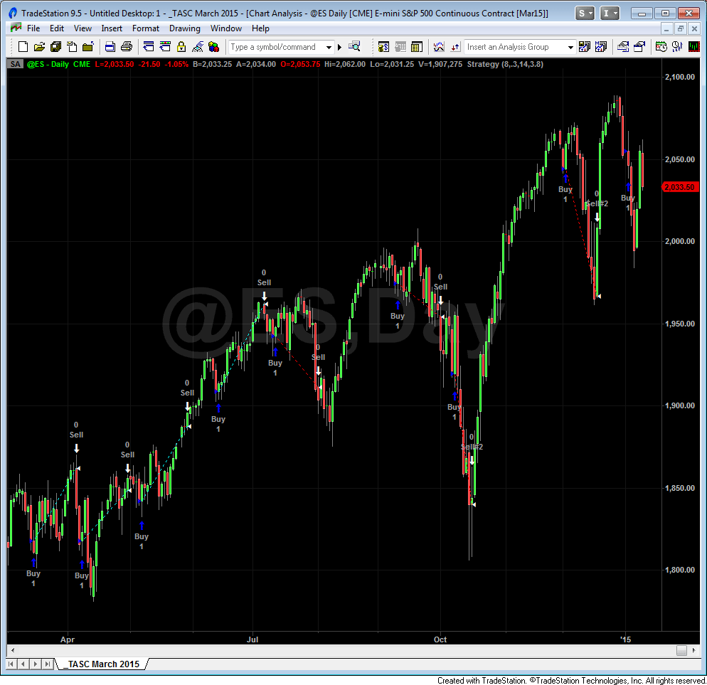

**FIGURE 1: TRADESTATION. Here is an example of a simple stochastic system applied to a daily chart of the emini S&P 500 (ES), based on John Ehlers & Ric Way’s article in this issue.**

This article is for informational purposes. No type of trading or investment recommendation, advice, or strategy is being made, given, or in any manner provided by TradeStation Securities or its affiliates.

```easylanguage
Indicator: _Ehlers Event Predictability

{ 
_Ehlers Event Predictability Indicator

For application see..
Technical Analysis of Stocks and Commodities
March 2015 

}

variables:
	Event( false ),
	FuturePrice( 0 ),
	j( 0 ),
	CG( 0 ),
	Denom( 0 ) ;
arrays:
	PredictBin[100]( 0 );


//>>>>>>>>>> Start Event Code
inputs:
	StocLength( 10 ) ;
variables:
	HiC( 0 ),
	LoC( 0 ),
	Stoc( 0 ) ;
HiC = Highest( Close, StocLength ) ;
LoC = Lowest( Close, StocLength ) ;
Stoc = ( Close - LoC ) / ( HiC - LoC );
if Stoc[9] crosses under 0.2 then 
	Event = true 
else 
	Event = false ;
//<<<<<<<<<<<< End Event Code


If Event then 
	begin
	FuturePrice = 100 * ( Close - Close[9] ) / Close[9] ; 
	//Future is referenced to 10 bars back

	If FuturePrice < -10 then 
		FuturePrice = -10 ; //Limits lower price to -10%

	If FuturePrice > 10 then 
		FuturePrice = 10 ; //Limits higher price to +10%

	FuturePrice = 5 * ( FuturePrice + 10 ) ; 
	//scale -10% to +10% to be 0 - 100
	end ;

//Place the FuturePrices into one of 100 bins
If FuturePrice <> FuturePrice[1] then 
	begin
	For j = 1 to 100 
		begin
		If FuturePrice > j - 1 and FuturePrice <= j then 
			PredictBin[j] = PredictBin[j] + 1 ;
		end;
	end;

//Measure Center of Gravity as a quick estimate
CG = 0 ;
Denom = 0 ;
For j = 1 to 100 
	begin
	CG = CG + j * PredictBin[j] ;
	Denom = Denom + PredictBin[j] ;
	end ;

CG = (CG/Denom-50)/5; 

Plot1( CG, "CG" );

if LastBarOnChartEx then 
	begin
	For j = 0 to 100 
		begin
		Print( File( "C:\PDFTest\PDF.CSV" ), 
		.2*j - 10, ",", PredictBin[j] ) ;
		end ;
	end ;


Strategy: _Ehlers Stochastic Strategy

{
_Ehlers Stochastic Strategy
Technical Analysis of Stocks and Commodities
March 2015
}

inputs:
	StocLength( 8 ),
	Threshold( .3 ),
	TradeLength( 14 ),
	PctLoss( 3.8 ) ;

variables:
	HiC( 0 ),
	LoC( 0 ),
	Stoc( 0 ) ;

HiC = Highest( Close, StocLength ) ;
LoC = Lowest( Close, StocLength ) ;

Stoc = ( Close - LoC ) / ( HiC - LoC ) ;

If Stoc crosses under Threshold then 
	Buy next bar on Open ;
If Barssinceentry >= TradeLength then 
	Sell next bar on Open ;
If Low < EntryPrice * ( 1 - PctLoss / 100 ) then 
	Sell next bar on Open ;
```

—Doug McCrary TradeStation Securities, Inc. www.TradeStation.com

BACK TO LIST

## eSIGNAL: MARCH 2015

For this month’s Traders’ Tip, we’re providing the formula SimpleStocTrSystem.efs based on the formula described in John Ehlers & Ric Way’s article in this issue, “Trading System Design: A Statistical Approach.”

The study contains formula parameters that may be configured through the edit chart window (right-click on the chart and select “edit chart”). A sample chart is shown in Figure 2.

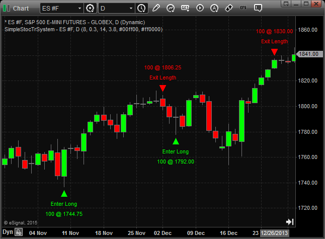

**FIGURE 2: eSIGNAL. Here is an example of the simple stochastic system on a chart of the S&P 500 emini futures contract (ES).**

To discuss this study or download a complete copy of the formula code, please visit the EFS Library Discussion Board forum under the forums link from the support menu at www.esignal.com or visit our EFS KnowledgeBase at https://www.esignal.com/support/kb/efs/ . The eSignal formula script (EFS) is also available below.

SimpleStocTrSystem.efs

```text
/*********************************

Provided By:  

    Interactive Data Corporation (Copyright © 2015) 

    All rights reserved. This sample eSignal Formula Script (EFS)

    is for educational purposes only. Interactive Data Corporation

    reserves the right to modify and overwrite this EFS file with 

    each new release. 


Description:        

    Trading System Design: A Statistical Approach by John F. Ehlers and Ric Way

    

Version:            1.00  01/12/2015


Formula Parameters:                     Default:

Stoc Length                             8

Threshold                               0.3

Trade Length                            14

Percent Loss                            3.8

Entry Position Color                    lime

Exit Position Color                     red


Notes:

    The related article is copyrighted material. If you are not a subscriber

    of Stocks & Commodities, please visit www.traders.com.


**********************************/


var fpArray = new Array(); 


function preMain(){

    

    setStudyTitle("SimpleStocTrSystem");

    setPriceStudy(true);

    

    var x = 0;


    fpArray[x] = new FunctionParameter("fpLength", FunctionParameter.NUMBER);

    with(fpArray[x++]){

        setName("Stoc Length");

        setLowerLimit(1);

        setDefault(8);

    }


    fpArray[x] = new FunctionParameter("fpThreshold", FunctionParameter.NUMBER);

    with(fpArray[x++]){

        setName("Threshold");

        setLowerLimit(0);

        setUpperLimit(1); 

        setDefault(0.3);

    }


    fpArray[x] = new FunctionParameter("fpTradeLength", FunctionParameter.NUMBER);

    with(fpArray[x++]){

        setName("Trade Length");

        setLowerLimit(0);    

        setDefault(14);

    } 

    

    fpArray[x] = new FunctionParameter("fpPctLoss", FunctionParameter.NUMBER);

    with(fpArray[x++]){

        setName("Percent Loss");    

        setLowerLimit(0);

        setUpperLimit(100); 

        setDefault(3.8);

    }


    fpArray[x] = new FunctionParameter("fpEntryColor", FunctionParameter.COLOR);

    with(fpArray[x++]){

        setName("Entry Position Color");    

        setDefault(Color.lime);

    }


    fpArray[x] = new FunctionParameter("fpExitColor", FunctionParameter.COLOR);

    with(fpArray[x++]){

        setName("Exit Position Color");    

        setDefault(Color.red);

    }

}


var bInit = false;

var bVersion = null;


var xClose = null;

var xOpen = null;

var xLow = null;


var xStoc = null;


var nBarsSinceEntry = null;

var nEntryPrice = null;


var nLotSize = null;


function main(fpLength, fpThreshold, fpTradeLength, fpPctLoss, fpEntryColor, fpExitColor){

    

    if (bVersion == null) bVersion = verify();

    if (bVersion == false) return;

        

    if (!bInit){

        

    	xClose = close();

        xOpen = open();

        xLow = low();

        

        xStoc = efsInternal("calc_Stoc", fpLength, xClose);

        

        nLotSize = Strategy.getDefaultLotSize();

        

        bInit = true; 

    }

    

    if (getCurrentBarIndex() != 0){

        

        if (!Strategy.isInTrade() && crossUnder(xStoc, fpThreshold, fpLength)){

            

            nEntryPrice = xOpen.getValue(1);

            

            Strategy.doLong("Enter Long", Strategy.MARKET, Strategy.NEXTBAR);                                                                               

            drawShapeRelative(1, BelowBar1, Shape.UPTRIANGLE, null, fpEntryColor, Text.PRESET, getCurrentBarIndex()+"Ent");

            drawTextRelative(1, BelowBar2, "Enter Long", fpEntryColor, null, Text.PRESET|Text.CENTER, null, null, getCurrentBarIndex()+"Ent_Label"); 

            drawTextRelative(1, BelowBar3, nLotSize + " @ " + formatPriceNumber(nEntryPrice), fpEntryColor, null, Text.PRESET|Text.CENTER, null, null, getCurrentBarIndex()+"Ent_Size");

            

            nBarsSinceEntry = getCurrentBarCount() + 1;

            

            return;

        }

        

        if (Strategy.isLong()){

            

            var bExit = false;

            var sLabel = "";

            

            var nCountEntry = getCurrentBarCount() - nBarsSinceEntry;

            if (nCountEntry >= fpTradeLength){

                bExit = true;

                sLabel = "Exit Length";

            }

             

            var nLow = xLow.getValue(0);

            var nStopLevel = nEntryPrice * (1 - fpPctLoss / 100); 

            if (nLow < nStopLevel){

                bExit = true;

                sLabel = "Exit Stop";

            }

                

            if (bExit){

                var nExitPrice = xOpen.getValue(1);

            

                Strategy.doSell("Exit Long", Strategy.MARKET, Strategy.NEXTBAR)

                drawShapeRelative(1, AboveBar1, Shape.DOWNTRIANGLE, null, fpExitColor, Text.PRESET, getCurrentBarIndex()+"Ex");

                drawTextRelative(1, AboveBar2, sLabel, fpExitColor, null, Text.PRESET|Text.CENTER, null, null, getCurrentBarIndex()+"Ex_Label"); 

                drawTextRelative(1, AboveBar3, nLotSize + " @ " + formatPriceNumber(nExitPrice), fpExitColor, null, Text.PRESET|Text.CENTER, null, null, getCurrentBarIndex()+"Ex_Size");

            }    

        }

    }

}


var xHignest = null;

var xLowest = null;


function calc_Stoc(nLength, xSource){

    

   if (getBarState() == BARSTATE_ALLBARS){

       xHignest = highest(nLength, xSource);

       xLowest = lowest(nLength, xSource);

   }

   

   var nSource = xSource.getValue(0);

   var nHighest = xHignest.getValue(0);

   var nLowest = xLowest.getValue(0);


   if (nSource == null || nHighest == null || nLowest == null)

        return;

    

   var nReturnValue = (nSource - nLowest) / (nHighest - nLowest);

   

   return nReturnValue;

}


function crossUnder(xStoc, nThreshold, nStocLength){

        

    var nReturnValue = false;

    

    var nStoc = xStoc.getValue(0);

       

    if (nStoc < nThreshold){

        for (var i = -1; i >= -(getCurrentBarCount() - nStocLength) ; i--){

                

            var nPrevStoc = xStoc.getValue(i);

                

            if (nPrevStoc != nThreshold){

                if (nPrevStoc > nThreshold)

                    nReturnValue = true; 

                break;

            }

        } 

    }

    return nReturnValue;

}


function verify(){

    

    var b = false;

    

    if (getBuildNumber() < 779){

        drawTextAbsolute(5, 35, "This study requires version 8.0 or later.", 

            Color.white, Color.blue, Text.RELATIVETOBOTTOM|Text.RELATIVETOLEFT|Text.BOLD|Text.LEFT,

            null, 13, "error");

        drawTextAbsolute(5, 20, "Click HERE to upgrade.@URL=https://www.esignal.com/download/default.asp", 

            Color.white, Color.blue, Text.RELATIVETOBOTTOM|Text.RELATIVETOLEFT|Text.BOLD|Text.LEFT,

            null, 13, "upgrade");

        return b;

    } 

    else{

        b = true;

    }


    return b;

}
```

—Eric Lippert eSignal, an Interactive Data company 800 779-6555, www.eSignal.com

BACK TO LIST

## WEALTH-LAB: MARCH 2015

In their article in this issue, “Trading System Design: A Statistical Approach,” authors John Ehlers & Ric Way outline a statistically valid procedure for the successful development of trading systems, providing a testbed for assessing whether the price will increase or decrease over n bars after an event.

From our point of view, it might be optimal to prove the conclusion regarding the robustness of the example system by using a different subset of data that includes a bear market, given that the in-sample period of 10 years used to optimize the system on was a strong bull market (Figure 3).

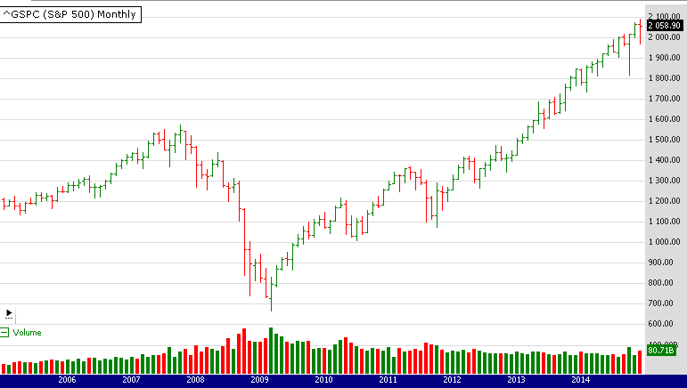

**FIGURE 3: WEALTH-LAB. This chart shows the US market bubble of the 2010s on a monthly chart of the S&P 500 index (∧GSPC).**

The code for Wealth-Lab based on Ehlers & Way’s code follows:

```csharp
Wealth-Lab 6 strategy code (C#)

using System;
using System.Collections.Generic;
using System.Text;
using System.Drawing;
using WealthLab;
using WealthLab.Indicators;

namespace WealthLab.Strategies
{
	public class EhlersMar2015 : WealthScript
	{
		private StrategyParameter paramStoc;
		private StrategyParameter paramThresh;
		private StrategyParameter paramLength;
		private StrategyParameter paramLoss;

		public EhlersMar2015()
		{
			paramStoc = CreateParameter("StocLength", 8, 1, 100, 1);
			paramThresh = CreateParameter("Threshold", 0.3, 0.1, 0.9, 0.1);			
			paramLength = CreateParameter("TradeLength", 14, 1, 50, 1);
			paramLoss = CreateParameter("PctLoss", 3.8, 0.5, 15.0, 0.5);
		}
		
		protected override void Execute()
		{
			int StocLength = paramStoc.ValueInt, TradeLength = paramStoc.ValueInt;
			double Threshold = paramThresh.Value, PctLoss = paramLoss.Value;

			Highest HiC = Highest.Series(Close, StocLength);
			Lowest LoC = Lowest.Series(Close, StocLength);
			DataSeries Stoc = (Close - LoC) / (HiC - LoC);
			
			for(int bar = GetTradingLoopStartBar(1); bar < Bars.Count; bar++)
			{
				if (IsLastPositionActive)
				{
					Position p = LastPosition;
					if ( bar+1 - p.EntryBar >= TradeLength )
						SellAtMarket( bar+1, p, "Timed" );
					else
						if( Low[bar] < p.EntryPrice*(1.0 - PctLoss /100d) )
						SellAtMarket(bar+1, p, "Stop");

				}
				else
				{
					if( CrossOver( bar, Stoc, Threshold ) )
						BuyAtMarket( bar+1 );
				}
			}
		}
	}
}
```

—Eugene, Wealth-Lab team MS123, LLC www.wealth-lab.com

BACK TO LIST

## NEUROSHELL TRADER: MARCH 2015

The simple stochastic trading system described by John Ehlers & Ric Way in their article in this issue, “Trading System Design: A Statistical Approach,” can be easily implemented with a few of NeuroShell Trader’s 800+ indicators. Simply select “New Trading Strategy” from the insert menu and enter the following in the appropriate locations of the Trading Strategy Wizard:

```text
BUY LONG CONDITIONS:	CrossBelow(Stoch%K(High,Low,Close,5),30)
LONG TRAILING STOP:	PriceFloor%(Trading Strategy,3.8)
SELL LONG CONDITIONS: 	BarsSinceFill>=X(Trading Strategy,14)
```

If you have NeuroShell Trader Professional, you can also choose whether the parameters should be optimized. After backtesting the trading strategy, use the detailed analysis button to view the backtest and trade-by-trade statistics for the strategy.

You can also create another trading strategy using the center of gravity indicator referenced in the article along with a one-period lag of the same indicator called the trigger . Both indicators are part of Ehlers’ Cybernetic Analysis add-on for NeuroShell Trader.

```text
BUY LONG CONDITIONS: 	Center of Gravity > Center of Gravity Trigger
SELL LONG CONDITIONS: 	Center of Gravity < Center of Gravity Trigger
```

Users of NeuroShell Trader can go to the STOCKS & COMMODITIES section of the NeuroShell Trader free technical support website to download a copy of this or any previous Traders’ Tips.

A sample chart is shown in Figure 4.

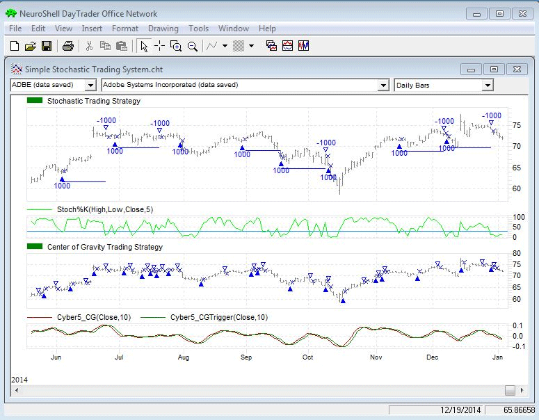

**FIGURE 4: NEUROSHELL TRADER. This NeuroShell Trader chart displays the simple stochastic trading system as well as a trading system based on Ehlers’ center of gravity indicator.**

—Marge Sherald, Ward Systems Group, Inc. 301 662-7950, sales@wardsystems.com www.neuroshell.com

BACK TO LIST

## AIQ: MARCH 2015

The AIQ code based on John Ehlers & Ric Way’s article in this issue, “Trading System Design: A Statistical Approach,” is provided at www.TradersEdgeSystems.com/traderstips.htm and is also shown here:

```text
!TRADING SYSTEM DESIGN: A STATISTICAL APPROACH

!Author: John Ehlers, TASC March 2015

!Coded by: Richard Denning 1/12/2015

!www.TradersEdgeSystems.com


!STOCHASTIC TRADING SYSTEM FROM ARTICLE:


!INPUTS:

StocLength is 8.

Threshold is 0.3.

TradeLength is 14.

PctLoss is 3.8.


!SYSTEM CODE:

HiC is Highresult([Close], StocLength, 0).

LoC is Lowresult([Close], StocLength, 0).

Stoc is ([Close] - LoC) / (HiC - LoC).

Buy if Stoc < Threshold and valrule(Stoc >= Threshold,1).

PD is {position days}.

PEP is {position entry price}.

ExitLong if PD - 1 >= TradeLength or [Low] < PEP*(1-PctLoss/100).
```

Figure 5 shows the EDS backtest summary for trading the NASDAQ 100 list of stocks using the authors’ stochastic system over the period 2009 through 1/13/2015.

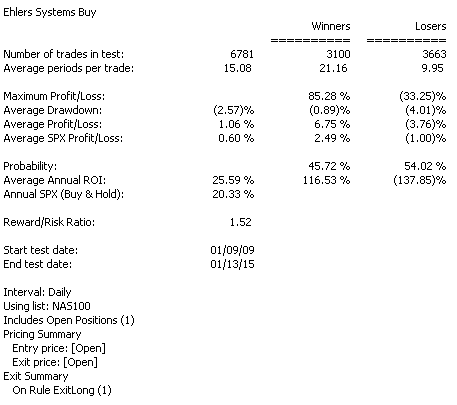

**FIGURE 5: AIQ. Here is the strategy’s EDS backtest summary for trading the NASDAQ 100 list of stocks over the period from 2009 through 1/13/2015.**

—Richard Denning info@TradersEdgeSystems.com for AIQ Systems

BACK TO LIST

## TRADERSSTUDIO: MARCH 2015

The TradersStudio code for John Ehlers & Ric Way’s article in this issue, “Trading System Design: A Statistical Approach” can be found at:

www.TradersEdgeSystems.com/traderstips.htm www.TradersStudio.com → Traders Resources

The following code file is provided in the download:

System: EHLERS_SYSTEMS: A long-only system that uses daily data and the stochastic indicator for entries.

Figure 6 shows an equity curve for this stochastic system trading one contract per trade of the S&P 500 full-sized futures contract from 1982 to 2014 using data from Pinnacle Data Corp. Slippage & commission of $100 per round-turn trade were subtracted from each trade.

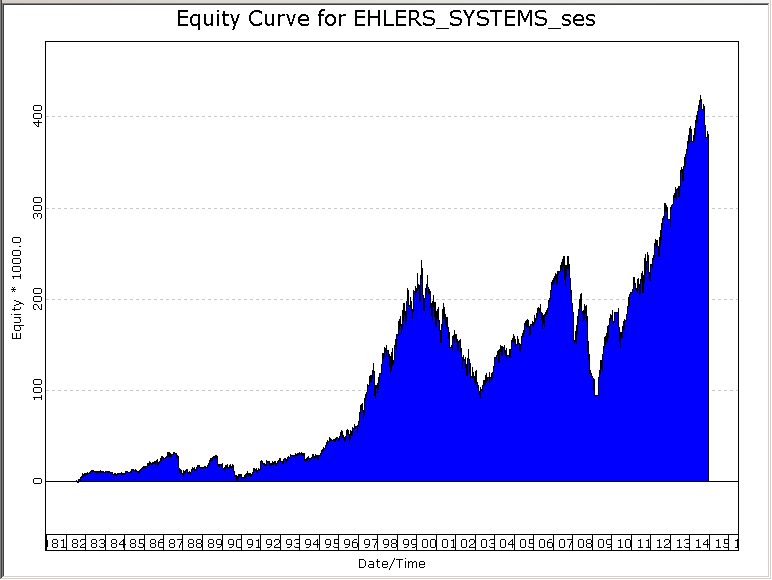

**FIGURE 6: TRADERSSTUDIO. Here is a sample equity curve trading the stochastic system one contract per trade of the S&P 500 full-sized futures contract from 1982 to 2014.**

```basic
'TRADING SYSTEM DESIGN: A STATISTICAL APPROACH

'Author: John Ehlers, TASC March 2015

'Coded by: Richard Denning 1/12/2015

'www.TradersEdgeSystems.com


'Stochastic trading system from article:

Sub EHLERS_SYSTEMS(StocLength, Threshold, TradeLength, PctLoss)

    Dim HiC As BarArray

    Dim LoC As BarArray

    Dim Stoc As BarArray


    If BarNumber=FirstBar Then

        'StocLength = 8

        'Threshold = .3

        'TradeLength = 14

        'PctLoss = 3.8

        HiC = 0

        LoC = 0

        Stoc = 0

    End If


    HiC = Highest(Close, StocLength, 0)

    LoC = Lowest(Close, StocLength, 0)

    Stoc = (Close - LoC) / (HiC - LoC)


    If CrossesUnder(Stoc, Threshold) Then

        Buy("LE", 1, 0, Market, Day)

    End If

    If BarsSinceEntry -1>= TradeLength Then

        ExitLong("LX_time", "", 1, 0, Market, Day)

    End If

    If Low < EntryPrice*(1 - PctLoss /100) Then

        ExitLong("LX_loss", "", 1, 0, Market, Day)

    End If

End Sub
```

—Richard Denning info@TradersEdgeSystems.com for TradersStudio

BACK TO LIST

## NINJATRADER: MARCH 2015

The SimpleStochastic strategy presented in John Ehlers & Ric Way’s article in this issue, “Trading System Design: A Statistical Approach,” has been made available for download at www.ninjatrader.com/SC/March2015SC.zip .

Once it has been downloaded, from within the NinjaTrader Control Center window, select the menu File → Utilities → Import NinjaScript and select the downloaded file. This file is for NinjaTrader version 7 or greater.

You can review the strategy source code by selecting the menu Tools → Edit NinjaScript → Strategy from within the NinjaTrader Control Center window and selecting the SimpleStochastic file.

NinjaScript uses compiled DLLs that run native, not interpreted, which provides you with the highest performance possible.

A sample chart implementing the strategy is shown in Figure 7.

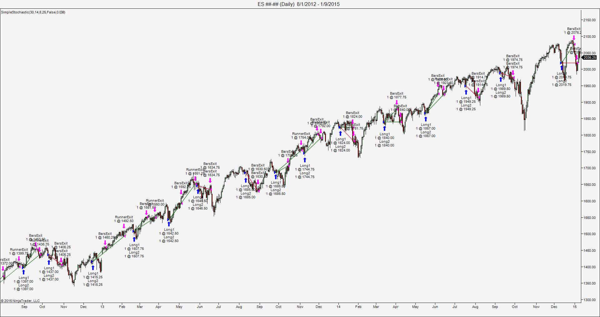

**FIGURE 7: NINJATRADER. This screenshot shows the SimpleStochastic strategy applied to a daily emini S&P futures continuous chart in NinjaTrader.**

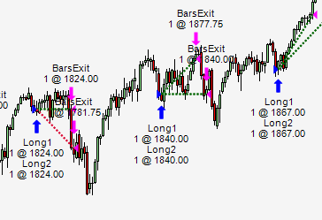

**DETAIL FROM FIGURE 7.**

—Raymond Deux and Dave Ingram NinjaTrader, LLC www.ninjatrader.com

BACK TO LIST

## UPDATA: MARCH 2015

Our Traders’ Tip for this month is based on the article by John Ehlers & Ric Way in this issue, “Trading System Design: A Statistical Approach.” In it, the authors develop a statistical methodology for the predictability of an event—in this case, the crossing of a stochastic threshold level. By offsetting entry times and measuring the effect this has on overall profitability in the intervening period, a probability distribution function can be created.

The Updata code based on the article is in the Updata Library and may be downloaded by clicking the custom menu and system library . Those who cannot access the library due to firewall issues may paste the code shown here into the Updata custom editor and save it.

```basic
'AStochasticSystem 
DISPLAYSTYLE 2LINES
INDICATORTYPE TOOL
COLOUR RGB(0,0,200)
COLOUR2 RGB(0,0,200)
PARAMETER "Stochastic Period" #STOCHPERIOD=14
PARAMETER "Threshold" @THRESHOLD=0.3
PARAMETER "Hold Period" #HOLDPERIOD=14
PARAMETER "Stop Loss %" @STOP=3.8  
NAME "STOCHASTIC SYSTEM [" #STOCHPERIOD "|" @THRESHOLD "|" #HOLDPERIOD "|" @STOP "]" ""
@UPPER=0
@LOWER=0 
@STOCH=0  
@ENTRYPRICE=0
FOR #CURDATE=#STOCHPERIOD TO #LASTDATE
   @UPPER=PHIGH(CLOSE,#STOCHPERIOD)
   @LOWER=PLOW(CLOSE,#STOCHPERIOD) 
   @STOCH=(CLOSE-@LOWER)/(@UPPER-@LOWER) 
   'STOCHASTIC ENTRY
   IF HIST(@STOCH<@THRESHOLD,1) AND ORDERISOPEN=0
      BUY OPEN 
      @ENTRYPRICE=OPEN
   ENDIF 
   'TIME EXIT
   IF ORDEROPENFOR>=#HOLDPERIOD
      SELL CLOSE
   ENDIF 
   '% STOP EXIT
   IF HIST(LOW<@ENTRYPRICE*(1-(@STOP/100)),1)
      SELL OPEN
   ENDIF
   @PLOT=@UPPER
   @PLOT2=@LOWER  
NEXT
```

A sample chart implemention is shown in Figure 8.

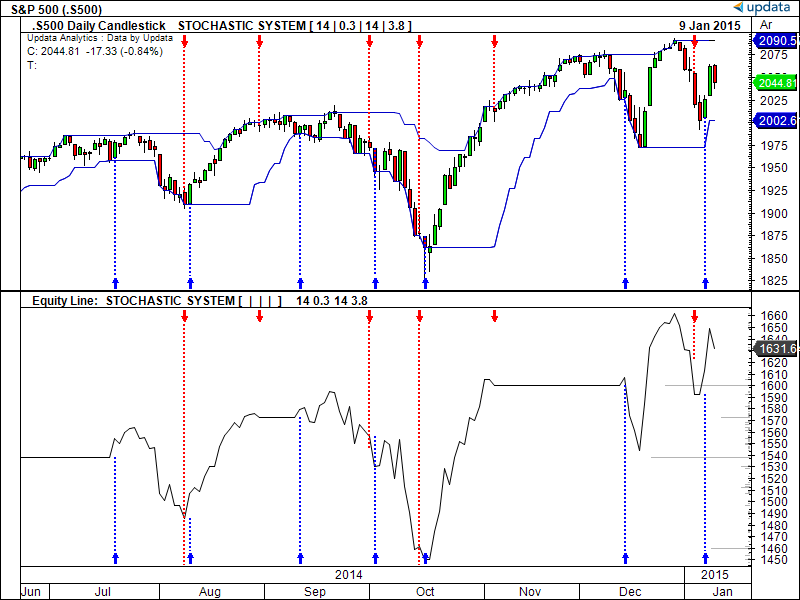

**FIGURE 8: UPDATA. Here is an example chart of the simple stochastic entry system as applied to the cash S&P 500 index.**

—Updata support team support@updata.co.uk www.updata.co.uk

BACK TO LIST

## AMIBROKER: MARCH 2015

In “Trading System Design: A Statistical Approach” in this issue, authors John Ehlers & Ric Way present a way to find out whether signals generated by a given indicator have a statistical edge.

Listing 1 presents AmiBroker Formula Language (AFL) code that produces a profitability distribution chart for a simple statistic crossover system. One can replace the event variable with any other system to test its statistical edge. When code is used in AmiBroker’s exploration mode, it produces an extra tab(s) with a profitability distribution chart for each symbol separately. To use the formula, type the code into the formula editor and press send to analysis to perform an exploration. As you can see from Figure 9, using more data (in this case, hourly) produces a smoother chart than what was presented in the article.

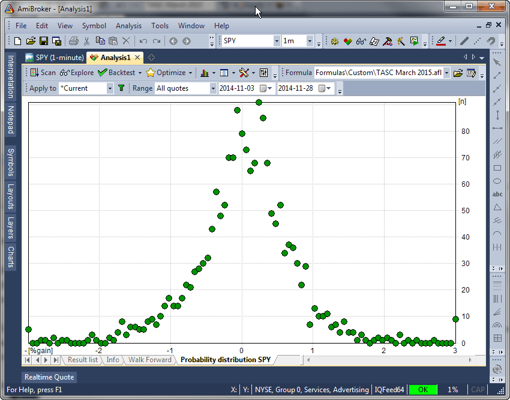

**FIGURE 9: AMIBROKER. Here is an AmiBroker exploration chart showing a sample profitability distribution for the stochastic indicator crossing under 0.2 using hourly SPY data. (Note that hourly data and a significantly larger dataset produces a distribution that more closely resembles a classic bell curve than the chart that was shown in Ehlers & Way’s article.**

```afl
LISTING 1.
Range = 10; 

HiC = HHV( Close, Range ); 
LoC = LLV( Close, Range ); 
Stoc = ( Close - LoC ) / ( HiC - LoC ); 

Lookback = Range - 1; 

Event = Ref( Cross( Stoc, 0.2 ), -Lookback ); 

PctGainRange = 3; // defines % gain range for X axis 

FuturePrice = ROC( Close, Lookback ); 
// keep values in range 
FuturePrice = Min( PctGainRange, Max( -PctGainRange, FuturePrice ) ); 
// map range to to 0..100
FuturePrice = Round( 100 * ( FuturePrice + PctGainRange )/
              ( 2 * PctGainRange ) ); 

PredictBin = 0; 

for( i = 0; i < BarCount AND BarCount > 100; i++ ) 
{ 
    if( Event[ i ] ) PredictBin[ FuturePrice[ i ] ]++; 
} 

chartname = "Probability distribution " + Name(); 

XYChartSetAxis(chartname, "[%gain]", "[n]" ); 
for( i = 0; i < BarCount AND i <= 100; i++ ) 
{ 
    XYChartAddPoint( chartname, "", 
                     ( i * 2 * PctGainRange / 100 - PctGainRange ),
                     PredictBin[ i ], colorGreen ); 
}
```

—Tomasz Janeczko, AmiBroker.com www.amibroker.com

BACK TO LIST

## MICROSOFT EXCEL: MARCH 2015

In their article in this issue, “Trading System Design: A Statistical Approach,” authors John Ehlers & Ric Way show us a statistical approach to determine if an event we can define to a computer has any value as a future price predictor.

Once we have determined the size and shape of such an event, we can build trading rules around the event and construct a system to follow those rules.

In the article, the authors use a simple stochastic crossunder as the event and look ahead a number of bars to determine a percentage change after the event.

Run this logic against 10 or more years of historical data, accumulate the events you find as well as the percent change values associated with the events, and you can then use a center of gravity (weighted average) calculation to assess the predictive power of the event. The premise here is that the more positive the CG value, the better your event is likely to be for trading long positions.

Figure 10 shows the specification for one such stochastic event definition on the left under the heading “predictive event testing controls.” The corresponding “event count by price gains” chart with a marker for the calculated center of gravity is shown under the price chart.

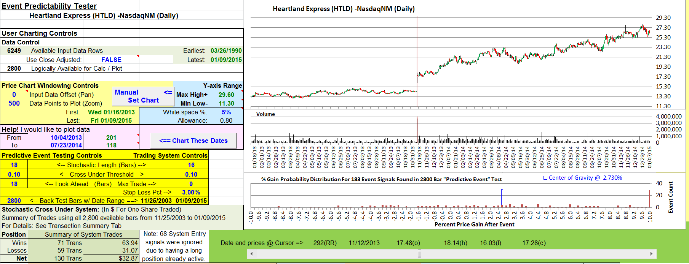

**FIGURE 10: EXCEL, Event testing controls and trading controls. This shows the specification for one stochastic event definition on the left under the heading “predictive event testing controls.”**

Controls specifying a slightly different size and shape of our event to be used in the simplified trading system appear under the heading “trading system controls.” A summary of the trading results for this control set can be found in the lower-left corner.

Calculations for predictive event testing and center of gravity determination can be found in the columns to the right of the price chart, as shown in Figure 11.

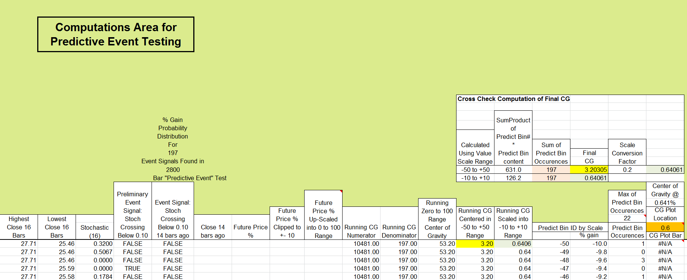

**FIGURE 11: EXCEL, Predictive Event Computations. Calculations for predictive event testing and center of gravity determination can be found in the columns to the right of the price chart.**

Figure 12 shows the calculations for the trading system. These are located in columns yet farther to the right of those shown in Figure 11.

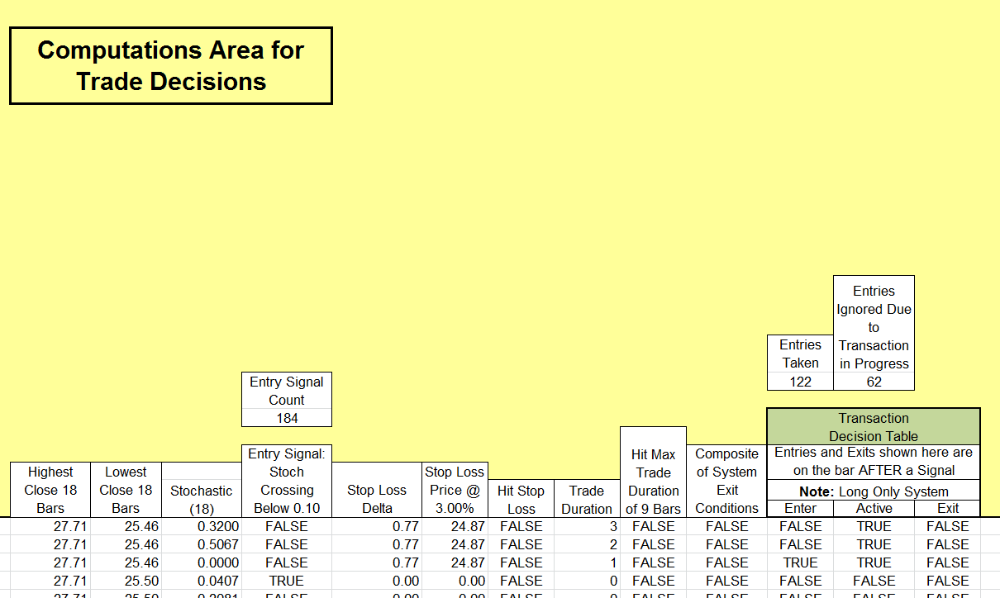

**FIGURE 12: EXCEL, Trading decisions. This shows the calculations for the trading system.**

As described in the article, selecting the correct combination of specifications for our predictive event can be a trial & error process. In the spreadsheet I am providing, I have included a rudimentary mechanism to assist with the tedious business of evaluating an array of event parameter choices to find the combination that generates the most promising center of gravity value.

Figure 13 shows this mechanism on the PredictiveEventScenarioTester tab of the workbook. Filling in the values in blue defines the envelope of events we want to look at. In this case, we are set up to look at all stochastic lookback lengths from eight to 18 bars; use threshold values from 0.1 to 0.35 in steps of 0.05; and try look-ahead periods from five to 18 bars, inclusive.

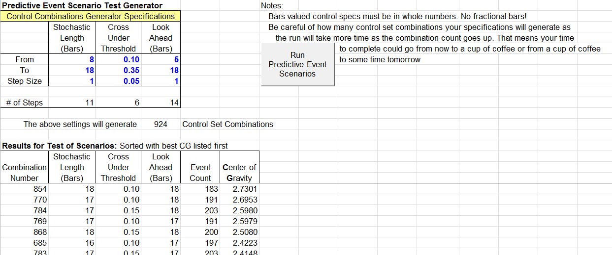

**FIGURE 13: EXCEL, Finding a “Good” Set of Event Parameters. On the PredictiveEventScenarioTester tab of the workbook, I have included a rudimentary mechanism to assist with evaluating an array of event parameter choices to find the combination that generates the most promising center of gravity value.**

When you click the run button, the VBA code behind the button cycles through all possible combinations of these values one at a time. The results area keeps track of the looping process.

The results are sorted from highest to lowest on the center of gravity value, and the three control values for this “best” setting are used to set the CalculationsAndCharts (Figure 10) predictive event controls.

The TradingSystem-Evaluator tab shown in Figure 14 serves the same purpose for evaluating sets of trading system controls. Control values from the best equity value row are used to set the CalculationsAndCharts trading system controls.

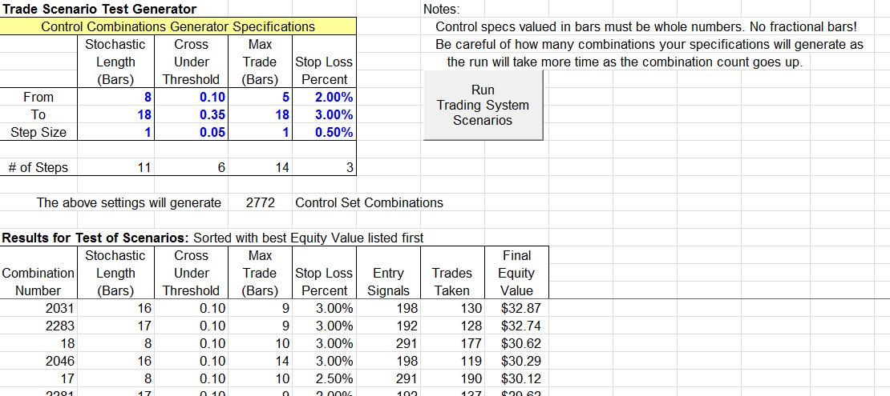

**FIGURE 14: EXCEL, Finding a “Good” Set of Event Parameters (Cont’d.). The TradingSystemEvaluator tab serves the same purpose for evaluating sets of trading system controls. Here, control values from the best equity value row are used to set the CalculationsAndCharts trading system controls.**

Trading results for a given scenario can be seen on the transaction summary tab shown in Figure 15.

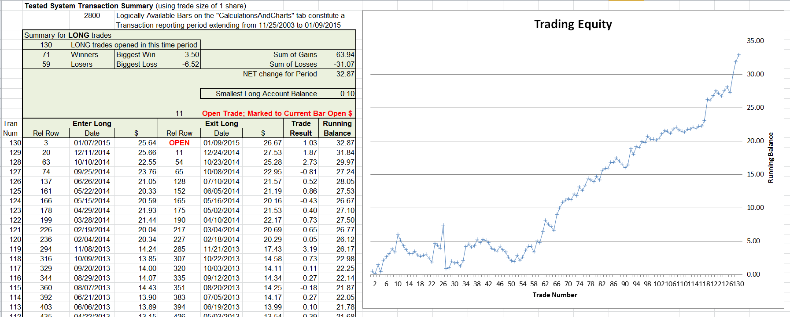

**FIGURE 15: EXCEL, Trade Details. Trading results for a given scenario can be seen on the transaction summary tab.**

You will find that the automated event evaluator and the trading evaluator usually come up with different event specifications as being their best choice. I think one of the reasons for this difference can be found in the trading summary in the bottom left of Figure 10: Not every event/entry signal participates in a trade. Many are ignored because a trade is already in progress. So while each of these “ignored” events contributed to a center of gravity computation, they do not contribute independently to the equity value. Moreover, stop-loss processing of a trade may prevent an event entry from reaching the potential contribution that was recognized in the event evaluator CG calculation.

The spreadsheet file for this Traders’ Tip (EventPredictabilityTester.xlsm) can be downloaded here . To successfully download it, follow these steps:

Right-click on the Excel file link , then Select “save as” (or “save target as”) to place a copy of the spreadsheet file on your hard drive.

—Ron McAllister Excel and VBA programmer rpmac_xltt@sprynet.com

BACK TO LIST

Originally published in the March 2015 issue of Technical Analysis of STOCKS & COMMODITIES magazine. All rights reserved. © Copyright 2015, Technical Analysis, Inc.

---

## BibTeX

```bibtex
@misc{traders_tips_2015_03,
  author = {{Technical Analysis of STOCKS \& COMMODITIES}},
  title = {Traders' Tips: Trading System Design: A Statistical Approach, March 2015},
  howpublished = {online},
  year = {2015},
  month = {3},
  url = {https://www.traders.com/Documentation/FEEDbk_docs/2015/03/TradersTips.html}
}
```
