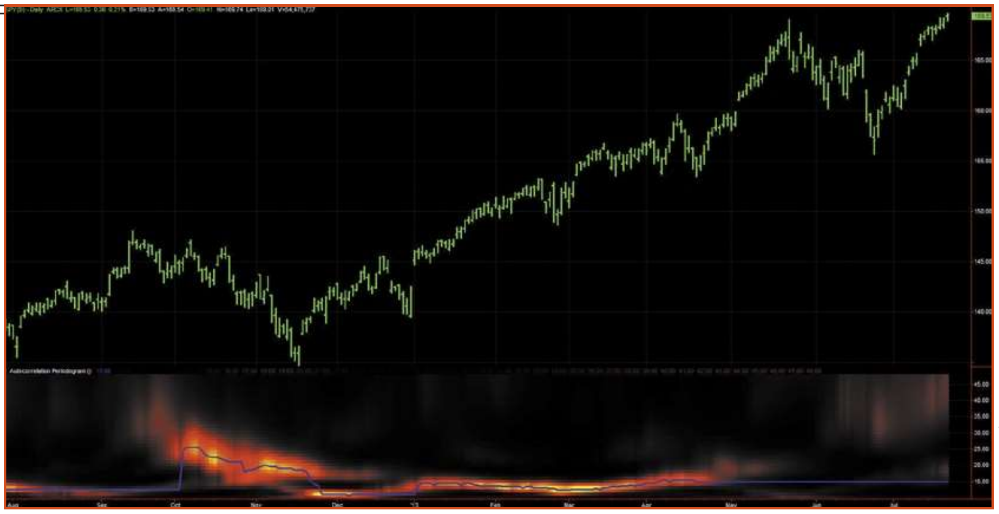
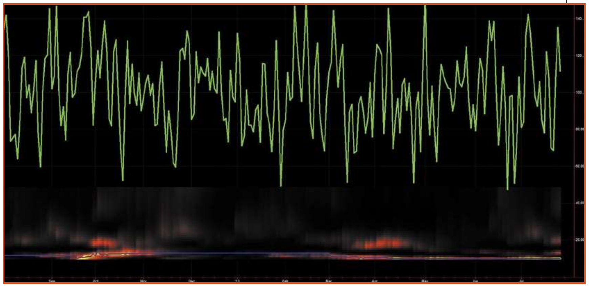
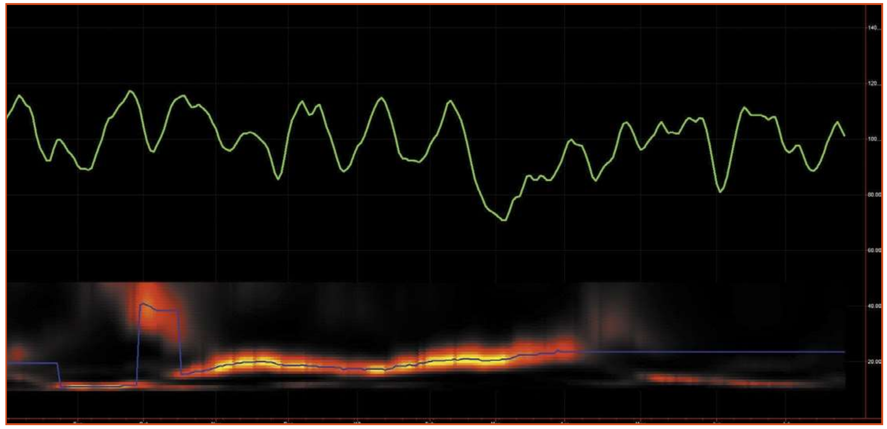
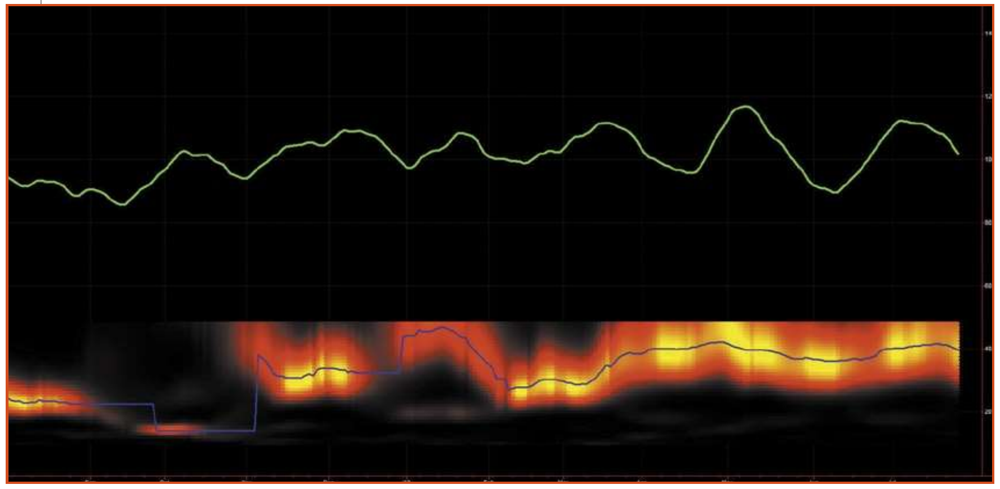

# Schrödinger's Cat

- **Author:** John Ehlers
- **Publication:** Technical Analysis of STOCKS & COMMODITIES, Volume 33, May 2015, pp. 8--10
- **Article URL:** [Article PDF](https://technical.traders.com/archive/article.asp?file=\V33\C05\983EHLE.pdf)

---

*What information is contained in market data? Can you develop an indicator or trading system that can extract this information to provide an edge in trading? Here's a look.*

The purpose of technical analysis is to discern what information is contained in market data and, if you are clever enough, to develop an indicator or trading system that extracts this information to provide an edge in trading. On the other hand, there are those who believe in the efficient market hypothesis: that all the information about the markets is known and the effects are purely random due to the law of large numbers of traders. The discussion goes downhill from there.

One of my favorite theoretical descriptions of market activity is the drunkard's walk. When the random variable is position, the partial differential equation solution is called the diffusion equation, and it describes random motion like a particle of smoke in a smoke plume. When the random variable is momentum, then the partial differential equation solution is called the wave equation. Taken together, the drunkard's walk describes physical phenomena like the meandering of a river, which can be random (trending) or cyclical. Unfortunately, there is no closed solution for the differential equations that can lead to an indicator, because they require boundary value solutions and there is no definable boundary.

In another physical area, Peter Swerling noted that the radar echoes returned from flying aircraft were noise-like. The echoes would vary from pulse to pulse and from one antenna sweep to another. The explanation is that there was a total average power returned, but the total power was the summation of components that were bounced off the fuselage, wings, rudder, and so on, and the changing aspect of the aircraft caused the summation of these components to look like noise. When building deception jammers for radars, I simulated the Swerling noise by using the received radar pulse plus an exponential moving average (EMA) of past pulses. This jamming signal was a remarkably good replica of the real radar echo. This kind of signal is called random with memory, and it's consistent with other phenomena described by the Hurst coefficient. Synthesizing market data using a random number generator and an EMA is simple to do and could be an interesting way to examine the nature of market data. Knowing the nature of the data can therefore lead to the generation of an indicator that possibly can give us a trading edge.

## Measuring Synthesized Market Data

Synthesizing market data is one thing, and measuring its characteristics is quite another. The problem is similar to that of the "Schrödinger's cat" thought experiment: Merely measuring the outcome determines the outcome itself. Here's the problem: When the market is modeled as a random variable with memory, the memory is provided by a filter such as an EMA. However, when measuring the frequency content of market data with any technique such as a Fourier transform or a contiguous bank of bandpass filters, they all have filters with memory as part of the analysis technique. Thus, measuring a truly random set of data would involve the memory being provided by the measurement technique, and the entire process would become self-fulfilling. Measuring the frequency content of synthesized data must avoid the use of filters.

Interfering with the synthesis of market data is minimized through the use of an autocorrelation periodogram. This process first creates the autocorrelation of the data, a process that is basically without filters. Then, a Fourier transform of the autocorrelation function is taken to extract the frequency content of the data. On a related note, the autocorrelation periodogram is now my preferred method of frequency measurement of market data because it mitigates the effects of spectral dilation.

Figure 1 shows what the measured spectrum of real market data looks like. The data is approximately one year's worth of daily bars of the SPDR S&P 500 (SPY). The measured spectrum is shown below the price bars as a heatmap. The strength of the cycle amplitude is shown in colors ranging from white hot through red hot to ice cold. The period of the measured cycles is indicated on the vertical scale from zero through 48-bar periods.


**Figure 1: Measured spectrum of the SPDR S&P 500 over the last year.** The dominant cycle period was between 20 and 25 bars in the fall of 2012, was on the order of 15 bars during most of the uptrend, and was an ill-defined longer cycle period most recently.

Figure 1 shows that the dominant cycle period was between 20 and 25 bars in the fall of 2012; was on the order of 15 bars during most of the uptrend; and was an ill-defined longer cycle period most recently.

Now that you are familiar with displays of market spectra, let's turn your attention to the measurement of purely random data with no memory, as shown in Figure 2. The random data is shown as the green ragged line over approximately 250 samples (essentially one year of daily data). The spectrum shows that there is not much cyclic activity, and the dominant cycle is mostly near a 10-bar cycle due to aliasing noise.


**Figure 2: Measured spectrum of purely random data with no memory.** The spectrum shows that there is not much cyclic activity, and the dominant cycle is mostly near a 10-bar cycle due to aliasing noise.

The next experiment is to see the effects of adding memory to the random data. For example, Figure 3 shows the data and spectrum when the memory low-pass filter has a critical period of 20 bars. Not unexpectedly, the data is much smoother than in Figure 2. Also, the dominant cycle period in the measured spectrum is near a 20-bar period most of the time.


**Figure 3: Measured spectrum of random data with memory having a 20-bar critical period.** The dominant cycle period in the measured spectrum is near a 20-bar period most of the time.

Continuing with the experiment, the memory of the low-pass filter is changed to have a critical period of 40 bars (Figure 4). In this case, the data is smoother across the graph. Further, the measured dominant cycle period has increased.


**Figure 4: Measured spectrum of random data with memory having a 40-bar period.** The data is smoother across the graph and the measured dominant cycle period has increased.

## So What Does It All Mean?

Dealing with random data is tricky because you can never reproduce your results. The best you can do is infer characteristics from your measurements. The first observation is that market cycles are ephemeral---they come and go, and the cycle periods of the dominant cycle can often change rapidly.

Synthesizing market data as random with memory does gain some credibility because the resulting measured spectra look similar to real market data. Further, the characteristics of the synthesized data can be controlled simply by varying the critical period of the memory component of the synthesized data. Credible replicas of market data can therefore be created simply by making the critical period of the memory time variable across the chart.

But most of all, you can gain the edge in your trading that you sought in the first place. Knowing that market cycles are ephemeral, you can quickly jump on them with predictive filters when they appear. You can get an idea of how this works by looking at the trade setup analyzer on www.StockSpotter.com. A trade setup occurs when the MESA cycle indicator is at or near a cycle trough and the MESA momentum indicator is declining or is at a minimum.

## Further Reading

- Ehlers, John [2013]. *Cycle Analytics For Traders*, Wiley & Sons.
- Ehlers, John [2014]. "The Quotient Transform," *Technical Analysis of STOCKS & COMMODITIES*, Volume 32: August.

---

## BibTeX

```bibtex
@article{ehlers_schrodingers_cat_2015,
  author = {Ehlers, John F.},
  title = {Schr\"{o}dinger's Cat},
  journal = {Technical Analysis of STOCKS \& COMMODITIES},
  volume = {33},
  number = {5},
  pages = {8--10},
  year = {2015},
  month = may,
  url = {https://technical.traders.com/archive/article.asp?file=\V33\C05\983EHLE.pdf}
}
```
