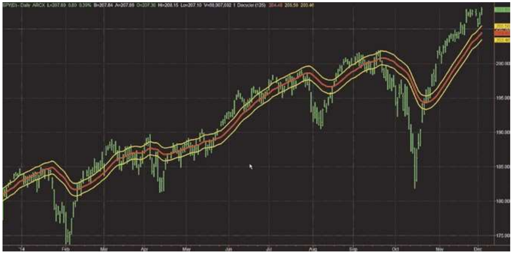
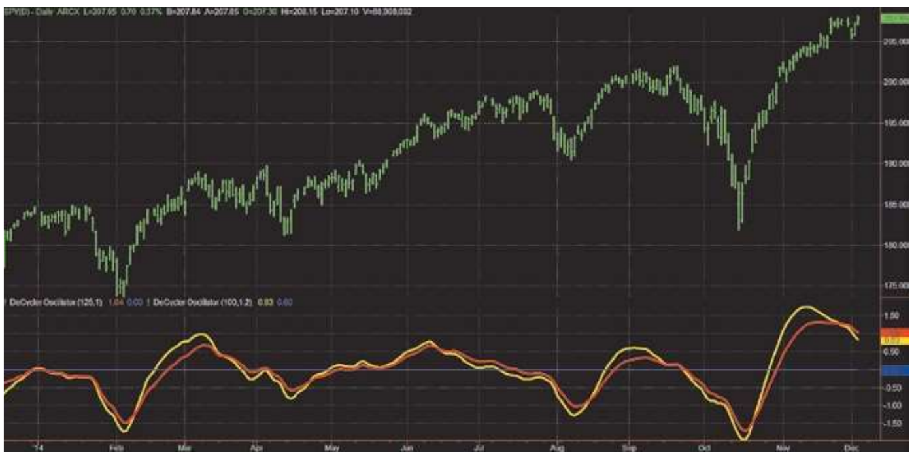

# Decyclers

- **Author:** John Ehlers
- **Publication:** Technical Analysis of STOCKS & COMMODITIES, Volume 33, September 2015, pp. 13--15
- **Article URL:** [Article PDF](https://technical.traders.com/archive/article.asp?file=\V33\C09\057EHLE.pdf)
- **Traders' Tips URL:** [Traders' Tips, September 2015](https://www.traders.com/Documentation/FEEDbk_docs/2015/09/TradersTips.html)

---

## Where Did The Trend Go?

Trends are great when they're moving in the direction you want them to. But when they reverse, you don't want to be caught off-guard. Here's an oscillator that can signal trend reversals with almost no lag.

Technical analysis literature is filled with descriptions of detrenders. If market data is made up of trends and cyclers, why are there no decyclers? Well, now there are, and I am going to describe them in this article. The primary advantage of decyclers is that they can identify trends as an indicator that has virtually no lag.

## It's All A Part Of A Bigger Cycle

From my analysis perspective, there is no such thing as a trend. Rather, I view market data as a continuum of cycle periods with differing cycle amplitudes. With this viewpoint, a trend is just a segment of a longer cycle. Then, by considering all market conditions as segments of a spectrum, the technical analysis problem is reduced to simply finding the right filter.

Trends are commonly identified by using a smoother such as a moving average. Smoothing filters are a class of filters called low-pass filters because they allow the low-frequency components in the data to pass through to the filter output and attenuate the higher-frequency components. This means the combination of the longer cycle periods are displayed and the shorter cycle periods---the ones causing the wiggles---are removed. The basic problem with low-pass filters is that they have considerable lag in their display. In the case of a simple moving average (SMA), the lag is approximately half the length of the moving average. For example, a 50-day SMA has a lag of about 25 bars. This lag is too much to have the SMA be considered a responsive indicator.

## High-Pass Filters

But there is another class of filters called high-pass filters. As the name implies, these filters allow the high-frequency components in the data to pass through to the filter output, and they reject the low-frequency components. Since high-pass filters do not pass the low-frequency, long-wavelength components, there is little computational lag between the data input and the filter output.

Since high-pass filters have very little lag, here is the trick to computing a decycler: Subtract the high-pass filter output from the data input. The high-frequency components are present in both components, so the high-frequency components are eliminated by cancellation. On the other hand, there are basically no low-frequency components in the high-pass filter output, so the low-frequency components in the original data are not cancelled. As a result, the decycler displays the low-frequency components with virtually no lag. That's a really big deal!

The sidebar "EasyLanguage Code For A Simple Decycler" shows some EasyLanguage code for a simple decycler. There is only one input parameter for the decycler---the period for which you want the low-frequency components to pass. The range of this variable is just about anything you choose. Since you are identifying trends, I suggest larger values, like the approximately half-year period shown as the default setting. Alpha1 is a variable used to compute the high-pass filter (HP). The decycler is then just the difference between the input data and HP.

I have plotted not only the decycler but also lines that are plus and minus 0.5 percent from it. The decycler is plotted in red in Figure 1 and the two yellow lines form a hysteresis band that aids in the use of the decycler. The interpretation is simple. If the prices are above the upper hysteresis line, then the market is in an uptrend. If the prices are below the low hysteresis line, then the market is in a downtrend. Prices within the hysteresis band are trend-neutral.



**FIGURE 1: A SIMPLE DECYCLER.** The decycler is plotted in red and the two yellow lines comprise a hysteresis band that aid in the use of the decycler. The simple decycler shows trend as prices outside the hysteresis bands.

## Decycler Oscillator

The simple decycler contains the very low-frequency components in the data. That enables it to be plotted as an overlay on prices. However, the very low-frequency components are precisely those that contribute to lag. You can virtually eliminate lag by getting rid of those very low-frequency components. We can do this by taking a high-pass filter of the simple decycler. The sidebar "EasyLanguage Code For Decycler Oscillator" shows how this is done.

The decycler oscillator is useful when two instances of it are plotted in the same subgraph. The first instance is plotted at the selected HPPeriod with an input K value of 1. The second instance is plotted at 80% of the HPPeriod with an input K value of 1.2. The basic idea is to compensate for a 20% reduction in cycle period with a 20% increase in the amplitude swing of the indicator.

Figure 2 shows the two instances of the decycler oscillator plotted in one subgraph below a chart of the prices. The instance plotted as a red line has an HPPeriod value of 125 and a K value of 1. The instance plotted as a yellow line has an HPPeriod value of 100 and a K value of 1.2.

Interpretation of the decycler oscillator pair is straightforward. When the yellow line crosses over the red line, a trend reversal to the upside is indicated. When the yellow line crosses under the red line, a trend reversal to the downside is indicated. A casual examination of Figure 2 shows that the trend reversals are made with almost no lag. Of course, there will always be some whipsaw conditions, but these are relatively easy to remove with other conditional statements in the code.



**FIGURE 2: THE DECYCLER OSCILLATOR.** Here you see two instances of the decycler oscillator. The decycler oscillator shows trend reversals with almost no lag.

## Things To Remember

- A decycler is created by cancellation rather than by direct filtering.
- A decycler has minimal lag for a given amount of smoothing.
- A decycler oscillator signals trend reversals with almost no lag.
- Decyclers and decycler oscillators can be used over a very wide range of input filter parameters.

## EasyLanguage Code For A Simple Decycler

```easylanguage
//Simple Decycler
//(c) 2014 John F. Ehlers

Inputs:
    HPPeriod(125);

Vars:
    alpha1(0),
    HP(0),
    Decycle(0);

//Highpass filter
alpha1 = (Cosine(.707*360 / HPPeriod) + Sine(.707*360 / HPPeriod) - 1) / Cosine(.707*360 / HPPeriod);

HP = (1 - alpha1 / 2)*(1 - alpha1 / 2)*(Close - 2*Close[1] + Close[2]) + 2*(1 - alpha1)*HP[1] - (1 - alpha1)*(1 - alpha1)*HP[2];

//Decycle is the difference between the input data and HP
Decycle = Close - HP;

Plot1(Decycle);
Plot3(1.005*Decycle);
Plot7(.995*Decycle);
```

## EasyLanguage Code For Decycler Oscillator

```easylanguage
//Decycler Oscillator
//(c) 2014 John F. Ehlers

Inputs:
    HPPeriod(125),
    K(1);

Vars:
    alpha1(0),
    alpha2(0),
    HP(0),
    Decycle(0),
    DecycleOsc(0);

//Highpass filter cyclic components whose periods are shorter than 48 bars
alpha1 = (Cosine(.707*360 / HPPeriod) + Sine(.707*360 / HPPeriod) - 1) / Cosine(.707*360 / HPPeriod);

HP = (1 - alpha1 / 2)*(1 - alpha1 / 2)*(Close - 2*Close[1] + Close[2]) + 2*(1 - alpha1)*HP[1] - (1 - alpha1)*(1 - alpha1)*HP[2];

//Decycle is the difference between the input data and HP
Decycle = Close - HP;

//Take a HighPass filter of Decycle to create the DecycleOsc
alpha2 = (Cosine(.707*360 / (.5*HPPeriod)) + Sine(.707*360 / (.5*HPPeriod)) - 1) / Cosine(.707*360 / (.5*HPPeriod));

DecycleOsc = (1 - alpha2 / 2)*(1 - alpha2 / 2)*(Decycle - 2*Decycle[1] + Decycle[2]) + 2*(1 - alpha2)*DecycleOsc[1] - (1 - alpha2)*(1 - alpha2)*DecycleOsc[2];

Plot1(100*K*DecycleOsc/Close);
Plot2(0);
```

## Further Reading

- Dickover, Melvin E. [2015]. "Understanding Causes Of Market Movements," *Technical Analysis of STOCKS & COMMODITIES*, Volume 33: June.
- Dickover, Melvin E. [2015]. "Seeing Clearly," *Technical Analysis of STOCKS & COMMODITIES*, Volume 33: July.
- Ehlers, John F. [2013]. *Cycle Analytics For Traders*, John Wiley & Sons Inc.

---

## BibTeX

```bibtex
@article{ehlers_decyclers_2015,
  author = {Ehlers, John F.},
  title = {Decyclers},
  journal = {Technical Analysis of STOCKS \& COMMODITIES},
  volume = {33},
  number = {9},
  pages = {13--15},
  year = {2015},
  month = sep,
  url = {https://technical.traders.com/archive/article.asp?file=\V33\C09\057EHLE.pdf}
}

@misc{traders_tips_2015_09,
  author = {{Technical Analysis of STOCKS \& COMMODITIES}},
  title = {Traders' Tips: Decyclers},
  year = {2015},
  month = sep,
  howpublished = {online},
  url = {https://www.traders.com/Documentation/FEEDbk_docs/2015/09/TradersTips.html}
}
```
