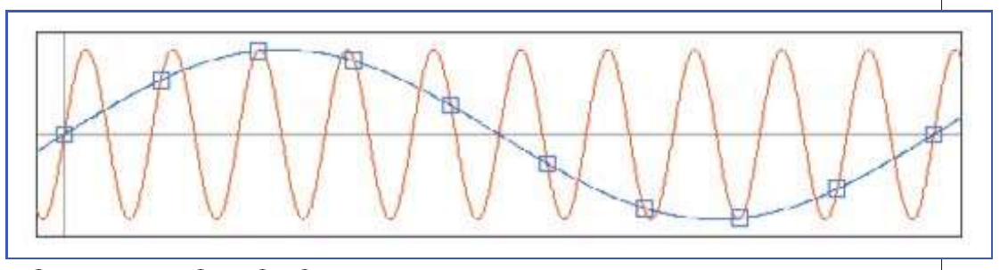
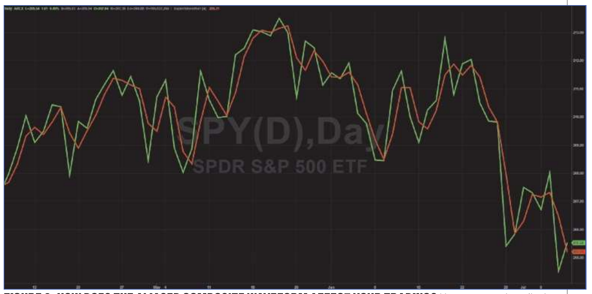
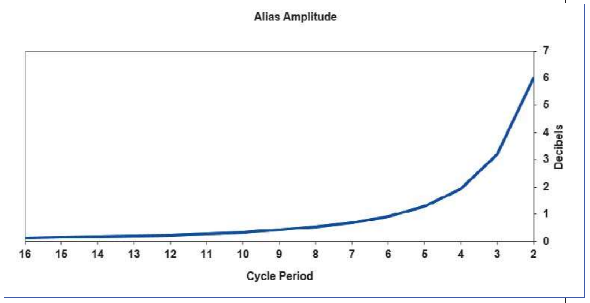
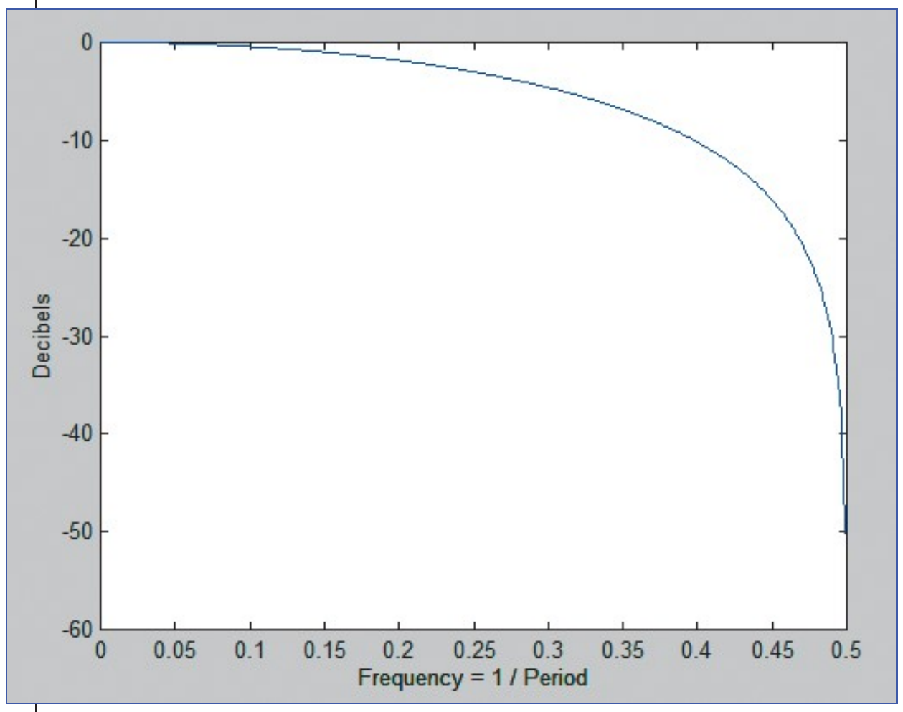
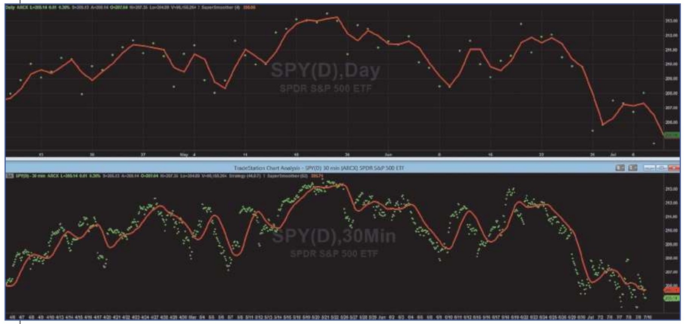
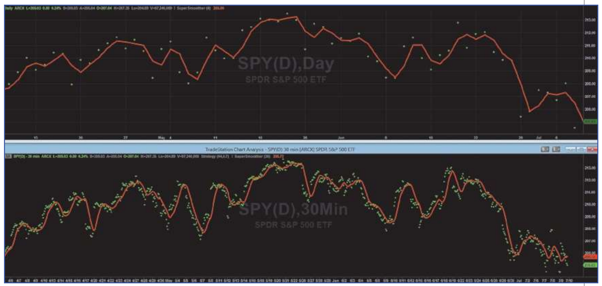

# Aliasing

- **Author:** John Ehlers
- **Publication:** Technical Analysis of STOCKS & COMMODITIES, Volume 34, January 2016, pp. 18--21
- **Article URL:** [Article PDF](https://technical.traders.com/archive/article.asp?file=\V34\C01\128EHLE.pdf)

---

Since you are likely using sampled data when trading, there is a chance that there could be some distortions in the data. Here's what you can do to avoid those distortions.

I imagine that most traders consider the price data they use for analysis to be a continuous function. Nothing could be further from the truth. And, depending on your trading style, the impact of this assumption can range from trivial to dramatic. The fact is that the data is sampled data. The sample rate is once per day on daily bars, once per hour on hourly bars, and so on. It doesn't matter if you average the high, low, and close; you still only have one sample per day on daily bars.

One impact of sampled data is that it can lead to aliasing. In my youth, the old cowboy movies had a sample rate of only 16 frames per second, letting the eye integrate those individual still photographs to produce motion, albeit with a little flicker. Aliasing at this slow sample rate made the wagon wheels look like they were turning backwards, and the effect was really weird. Aliasing can also produce some weird effects on your market data.

The theory of sampled data states that you must have at least two samples per cycle. Otherwise, the sampled data will result in aliasing. The frequency at which there are exactly two samples per cycle is called the Nyquist frequency. The theory is demonstrated in Figure 1, where the shorter cycle depicted by the red line is sampled at a rate less than two samples per cycle. Since there are less than two samples per cycle of the real data of the red sine wave, the data is interpreted as the phantom aliased blue sine wave. Just imagine the impact on your trading if your data is subject to aliasing!


**Figure 1: Theory of sampled data.** Sampling less than twice per cycle produces phantom aliased signals.

Mathematically, the process of sampling is multiplying a sine wave at the sampling frequency with the cycles in the continuous data. From your high school trigonometry class you may recall this equation:

$$\sin(A) \cdot \sin(B) = 0.5 \cdot (\sin(A+B) + \sin(A-B))$$

If $A$ represents the sampling frequency and $B$ represents the frequencies of the continuous data, the sampling frequency is heterodyned with the continuous data with upper and lower sidebands. This is exactly the same process as with your AM radio, where you tune your receiver to the carrier frequency and the information is contained in the upper and lower sidebands. Since the sampling process is nonlinear, aliasing can include harmonics of the sampling frequency mixing with different harmonics of the data to produce a really gnarly soup of noise superimposed on the information contained in the data.

Here's the important part for market data: there is nothing inherent in the data to preclude content whose period is shorter than that of the Nyquist frequency. That means you should expect the upper sideband to be folded back into the lower sideband, producing a false composite signal due to aliasing. The real question is how badly the aliased composite waveform affects your trading. Figure 2 shows the closes of daily prices of SPY as the green line, while the red line shows the majority of the aliased signals removed by filtering in the composite waveform at the cost of a half bar of lag.


**Figure 2: How does the aliased composite waveform affect your trading?** Aliasing produces short-term volatility in the composite data.

## Just How Bad Is It?

To get a more quantitative estimate of aliasing effects, start by making a model of market data. It is well established that market data is fractal. That is, a chart using weekly data looks exactly like a chart using daily data if you remove the scales. In other words, the amplitude of the swings in market data is proportional to the wavelength of the cycle components in the data. Simply put, longer cycles have bigger swings. Using this model, you can extend the theoretical shape of the market spectrum on both sides of the Nyquist frequency. Figure 3 shows the spectrum amplitude of the data at frequencies below the Nyquist frequency as the blue line and, with the upper sideband folded back about the Nyquist frequency, the amplitude of the composite sidebands show as the red line. The lower sideband blue line shows the amplitude doubling every time the cycle period doubles. In this simplified model, the red line represents the aliased upper sideband amplitude simply added to the amplitude of the blue line signal.


**Figure 3: Aliasing impact.** The lower sideband blue line shows the amplitude doubling every time the cycle period doubles. In this simplified model, the red line represents the aliased upper sideband amplitude simply added to the amplitude of the blue line signal.

The aliasing impact is better demonstrated in Figure 4, where the ratio of the composite signal plus alias is shown as a ratio to the signal in terms of decibels. The maximum impact is at the two-bar cycle period---the period of the Nyquist frequency. Two octaves below the Nyquist frequency, at the eight-bar cycle, the impact is less than 0.5 dB, and therefore is basically insignificant at longer cycle periods. Other theoretical models of the market can be created, and these generally show that the aliasing impacts depicted in Figures 3 & 4 are a conservative estimate.


**Figure 4: Alias amplitude.** The aliasing impact becomes insignificant two octaves below the Nyquist frequency.

So what does all this mean to a trader? If you are a trend follower and are using tools like a 50-day moving average or a 200-day moving average, the cycle periods of the data you are using is so far removed from the Nyquist frequency that you can just ignore the impact of aliasing. On the other hand, if your technique involves recognizing short-term patterns in the range of two to five bars, you should seriously rethink your approach because aliasing produces illusory patterns. Short-term traders using cycles or mean reversion should take active measures to mitigate the impacts of aliasing.

## What Can Be Done To Mitigate Aliasing Effects?

The first line of defense to avoid problems associated with aliasing is to just accept that you should not work with cycle periods within two octaves of the period of the Nyquist frequency. For daily data, that means you should not expect to use cycle periods shorter than eight bars. Even with this constraint you should reduce the swing of the composite waveform by filtering. For example, if you wanted to use a cycle having a four-bar period, you need to recognize that the composite signal at the Nyquist frequency has the same amplitude as your desired signal. Therefore, it is imperative that a low-pass filter of some kind be used to reduce the amplitude of the frequency components near the Nyquist frequency. A simple two-bar moving average is often adequate, because this average has a theoretical zero of transmission at the Nyquist frequency.

The frequency response of a two-bar simple moving average is shown in Figure 5. This is an effective way to be sure that aliasing effects are removed. But when it comes to filtering, more is often better, if there is not a price to be paid in terms of lag. Therefore, I also recommend using my SuperSmoother filter set to a four-bar cutoff period.


**Figure 5: Frequency response of a two-bar simple moving average.** A simple two-bar moving average can remove much of the aliasing impact.

A trader can also elect to oversample the data by using a different sample rate. For example, there are 13 half-hour samples in the trading day. So if you use 30-minute data instead of daily data, the data of interest is nearly three octaves below the sample rate. The top chart in Figure 6 shows a four-bar SuperSmoother as the red line while the bottom chart shows the equivalent 52-bar SuperSmoother using 30-minute data. The green dots show the sampled data in both cases. The filter output using the oversampled data is much smoother.


**Figure 6: Oversampling results in smoother equivalent filtered data.** The top chart shows a four-bar SuperSmoother as the red line. The bottom chart shows the equivalent 52-bar SuperSmoother using 30-minute data.

More important, oversampling enables the trader to create a higher-fidelity waveform closer to the original Nyquist frequency. For example, the cutoff period of the oversampled SuperSmoother filter was reduced to 26 bars, resulting in a smoothed waveform with less lag as shown in the lower graph of Figure 7.


**Figure 7: Smoother indicators with reduced lag.** Reducing the cutoff period of the oversampled SuperSmoother filter to 26 bars resulted in the smoothed waveform with less lag.

## It May Impact Your Trading

Market data aliasing is real, but its impact on your trading depends on your style. If you are a trend trader using relatively long moving averages or slowly moving indicators, you can just ignore it. On the other hand, if you are using short-term patterns in the range of two to five bars, the effect is dramatic and you might want to rethink your approach. Nonetheless, it's a good idea to be aware that aliasing is real and it's a good idea to mitigate its effects just by applying a simple two-bar moving average or the SuperSmoother filter to the data before using any other indicator. More adventurous technicians might want to explore oversampling using intraday data.

---

*S&C Contributing Editor John Ehlers is a pioneer in the use of cycles and DSP technical analysis. He is president of MESA Software. MESASoftware.com offers the MESA Phasor and MESA intraday futures strategies. He is also the chief scientist for StockSpotter.com, which offers stock trading signals based on indicators and statistical techniques.*

## Further Reading

Ehlers, John F. [2013]. *Cycle Analytics For Traders*, John Wiley & Sons.

Ehlers, John F. [2015]. "Decyclers," *Technical Analysis of STOCKS & COMMODITIES*, Volume 33: September.

---

## BibTeX

```bibtex
@article{ehlers_aliasing_2016,
  author = {Ehlers, John F.},
  title = {Aliasing},
  journal = {Technical Analysis of STOCKS \& COMMODITIES},
  volume = {34},
  number = {1},
  pages = {18--21},
  year = {2016},
  month = jan,
  url = {https://technical.traders.com/archive/article.asp?file=\V34\C01\128EHLE.pdf}
}
```
