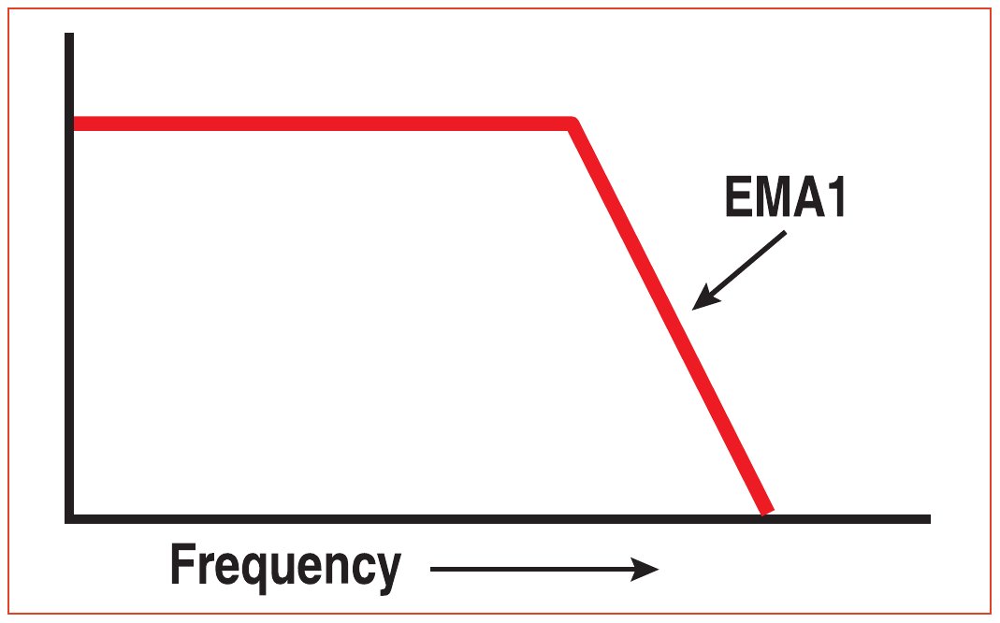
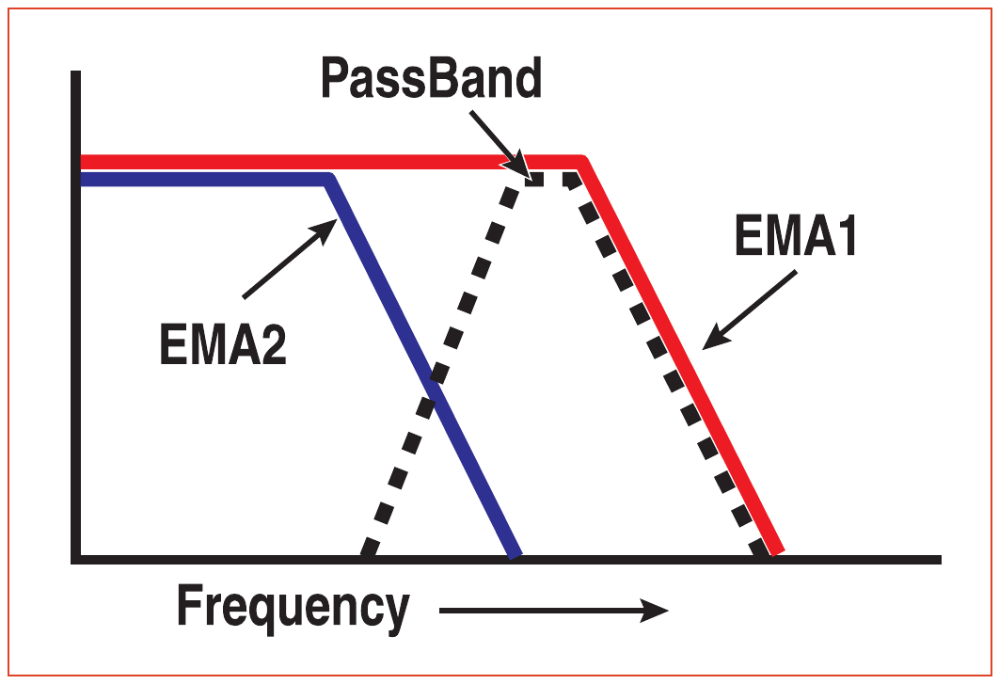
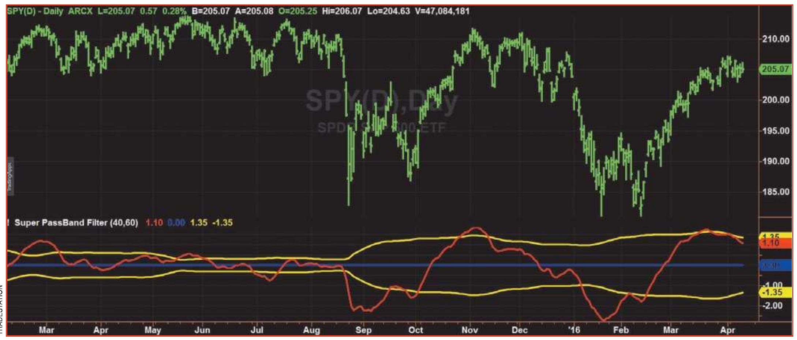

# The Super Passband Filter

- **Author:** John Ehlers
- **Publication:** Technical Analysis of STOCKS & COMMODITIES, Volume 34, July 2016, pp. 11--13
- **Article URL:** [Article PDF](https://technical.traders.com/archive/article.asp?file=\V34\C07\242EHLE.pdf)
- **Traders' Tips URL:** [Traders' Tips, July 2016](https://www.traders.com/Documentation/FEEDbk_docs/2016/07/TradersTips.html)

---

*Are low and high frequencies getting in your way? Here's a filter that will reject both of these extremes so you can focus on what really matters.*

It's a well-known fact: The real enemy of technical traders is the lag from their indicators and trading strategies. Sure, it is relatively simple to create a fancy filter that will give you a precise answer to your trading decisions. But fancy filters require more data than simple filters do, which will cause a delay in the calculations. What use would that be to a trader?

It is far better to get a reasonable answer with no lag, which is precisely what my super passband filter does. Because it passes a band of frequencies through a filter from the data spectrum, it rejects the very low frequencies and therefore displays as an oscillator. It rejects the very high frequencies to eliminate the distracting wiggles that often occur in indicators. I will show you how to use the super passband filter with maximum effectiveness to supplement your discretionary trading, and I'll give you sufficient detail so you can also implement the rules as part of an algorithmic trading strategy.

## The Filter Concept

Perhaps the simplest technical indicator is the exponential moving average (EMA). The EMA takes a fraction of the current price and adds the complement of the fraction to the value of the EMA one bar ago. In EasyLanguage notation, using $\alpha$ to denote the fraction, the equation is:

$$\text{EMA} = \alpha \cdot \text{Price} + (1 - \alpha) \cdot \text{EMA}[1]$$

I always write the EMA equation this way to ensure the coefficients add up to unity, thus avoiding a potential bug or rounding error in the program. The EMA is a low-pass, or smoothing, filter. It provides the smoothing by rejecting the high-frequency components that are present in the price data spectrum. The EMA frequency transfer response can be visualized as in Figure 1. The low-frequency components are passed unattenuated while the frequency components above the critical frequency are increasingly attenuated.


**Figure 1: Exponential Moving Average (EMA) Transfer Response**

The super passband filter is formed by using two EMA filters. One has a critical frequency that is set to a lower frequency than the first. Then, the second EMA filter is subtracted from the first. Since both EMAs pass the very low frequencies with no attenuation, the subtraction eliminates the lowest frequencies by cancellation. This is important, because the very low frequencies are eliminated without the use of filtering, which means there is no induced lag.

Figure 2 illustrates the concept of the super passband filter. The original EMA is shown by the red line. The second EMA, having a lower critical frequency, is shown by the blue line. The resultant super passband filter response is shown by the dashed black line. The response of the blue line is subtracted from the response of the red line. At the very low frequencies, the values of the red and blue lines are the same, so the value of the super passband filter is zero by cancellation. Slightly above the critical frequency of the blue line, you'll see its value decrease, so less cancellation occurs. The response of the super passband filter increases until the value of the blue line is essentially zero. Then, its response is flat through the passband until the critical frequency of the red line EMA is reached. The high-frequency attenuation of the super passband filter is determined by the attenuation of the red line EMA.


**Figure 2: Super Passband Filter**

The usefulness of the super passband filter can be enhanced by also computing some trigger points, which can increase the efficiency of your entries and exits. I do this by computing the root mean square (RMS) value of the cyclic output of the super passband filter. In working with cycles, the RMS value describes the power in the waveform. The RMS value is the conceptual equivalent of the first standard deviation in a more generalized waveform. When the waveform exceeds the RMS value, there is a higher probability that the waveform will turn and revert toward the mean. Therefore, I will use the computed RMS value as convenient trigger levels for trading.

The EasyLanguage code for computing the super passband filter can be found in the sidebar "EasyLanguage Code For Super Passband Filter." The two inputs to the super passband filter are the critical periods of the two EMA filters. Cycle periods are the reciprocal of frequency, and so the shorter period is given first. Don't worry if you get the two inputs reversed. The result will be that the output waveform will be upside down, which is easily identified. The critical periods are used to compute the EMA coefficients, a relationship I obtained heuristically (that is, by computational trial and error).

I have written the equation for the passband (PB) variable in closed form by taking the difference of the two EMA Z-transform responses. It could have as easily been done by computing each EMA and then taking the difference, as described conceptually.

There are only two pieces of input information: the current closing price and the closing price one bar ago. The equation is completed using the computed value of PB one bar ago and two bars ago. The super passband filter will not have unity gain at the center of the passband, but the absolute value of the filter amplitude is irrelevant because the trigger points are referenced to the RMS value of the PB waveform.

I compute the RMS value of the PB waveform by summing its square over the last 50 bars and taking the square root of the averaged sum. There is nothing magic in the number 50, and you can substitute a different value if you choose, but it should be sufficiently long to use approximately one cycle's worth of data in the calculation.

## The Super Passband Filter in Action

I have applied the super passband filter to approximately one year's worth of SPY daily data (Figure 3). The filter response is shown as the red line in the first subgraph. The two yellow lines display the +RMS and −RMS values, and the blue line is the zero reference. The super passband filter output has a guaranteed zero mean because the low-frequency components are removed by cancellation. The near-zero lag of the filter can be verified by comparing a notch in the prices, say, near the beginning of October 2015 or the third week of January 2016, to the lowest spots in the filter response.

Since going beyond the RMS levels and then starting to return to the mean is significant, the red line crossing over the −RMS line is a good trade entry signal. You can also sell short when the yellow line crosses under the +RMS line for the same reason. The basic idea is to hold the trade until the red line crosses the other RMS line. There are many cases where the slope of the red line is not consistent when traversing from one RMS line to the other. In this case, a slope reversal is a good time to exit the trade, even if it's a loss. Then, when the slope of the red line resumes its original trajectory, you can reenter the trade even though the red line has not crossed over (or under) the yellow line.



## Less Is Clearer

That's all there is to it. I am sure you will find the super passband filter response will accurately reflect the pattern of the prices, making your trade opportunities clearer. You will find that the smaller you make the critical periods of the two EMAs, the more raggedy the filter response becomes. This is the straightforward result of using less smoothing in your EMAs.

## EasyLanguage Code for Super Passband Filter

```easylanguage
//Super Passband Filter
// (c) 2016 John F. Ehlers

Inputs:
    Period1(40),
    Period2(60);

Vars:
    a1(0),
    a2(0),
    PB(0),
    count(0),
    RMS(0);

a1 = 5 / Period1;
a2 = 5 / Period2;

PB = (a1 - a2)*Close + (a2*(1 - a1) - a1*(1 - a2))*Close[1] +
     ((1 - a1) + (1 - a2))*PB[1] - (1 - a1)*(1 - a2)*PB[2];

RMS = 0;
For count = 0 to 49 Begin
    RMS = RMS + PB[count]*PB[count];
End;
RMS = SquareRoot(RMS / 50);

Plot1(PB);
Plot2(0);
Plot3(RMS);
Plot7(-RMS);
```

## Further Reading

- Ehlers, John F. [2013]. *Cycle Analytics For Traders*, John Wiley & Sons.
- Ehlers, John F. [2016]. "Aliasing," Technical Analysis of STOCKS & COMMODITIES, Volume 34: January.
- Ehlers, John F. [2015]. "Decyclers," Technical Analysis of STOCKS & COMMODITIES, Volume 33: September.

---

## BibTeX

```bibtex
@article{ehlers_super_passband_2016,
  author = {Ehlers, John F.},
  title = {The Super Passband Filter},
  journal = {Technical Analysis of STOCKS \& COMMODITIES},
  volume = {34},
  number = {7},
  pages = {11--13},
  year = {2016},
  month = jul,
  url = {https://technical.traders.com/archive/article.asp?file=\V34\C07\242EHLE.pdf}
}

@misc{traders_tips_2016_07,
  author = {{Technical Analysis of STOCKS \& COMMODITIES}},
  title = {Traders' Tips: The Super Passband Filter},
  year = {2016},
  month = jul,
  howpublished = {online},
  url = {https://www.traders.com/Documentation/FEEDbk_docs/2016/07/TradersTips.html}
}
```
