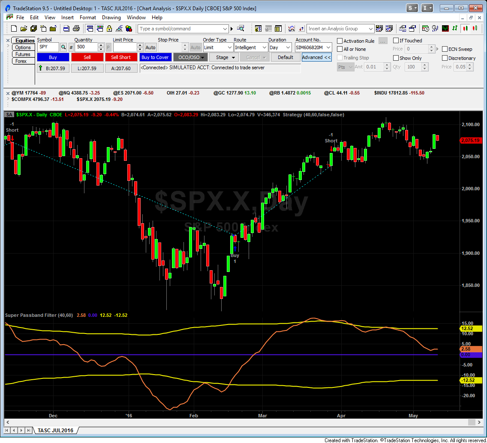
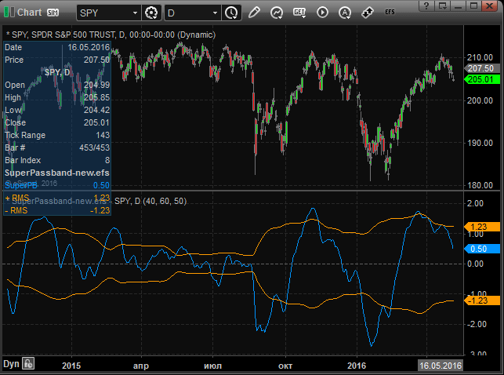
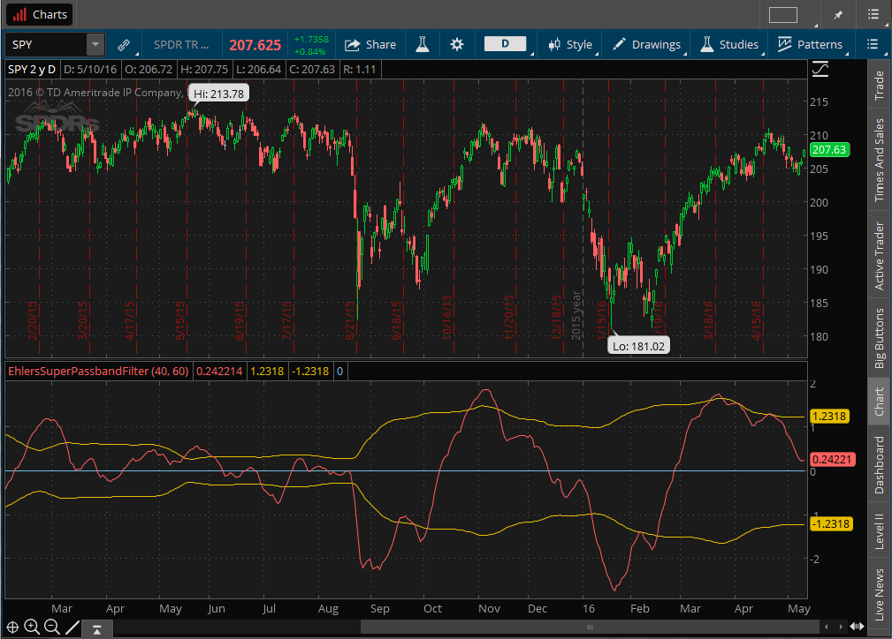
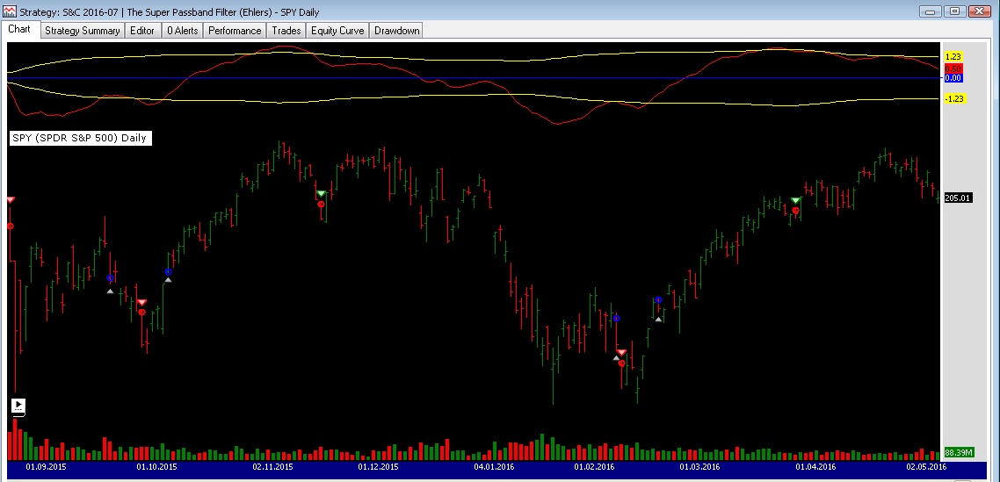
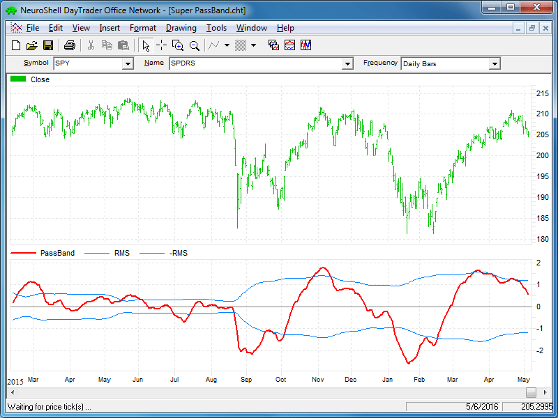
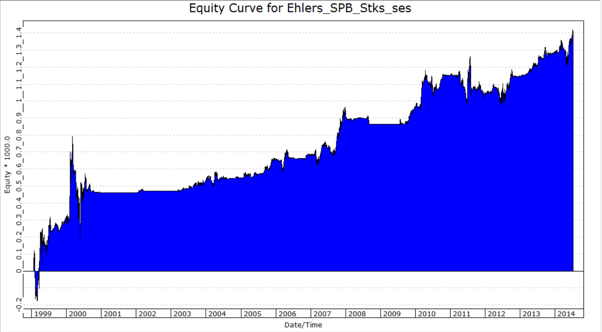
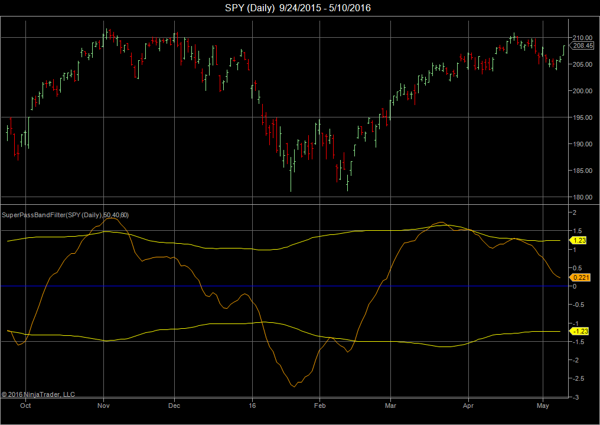
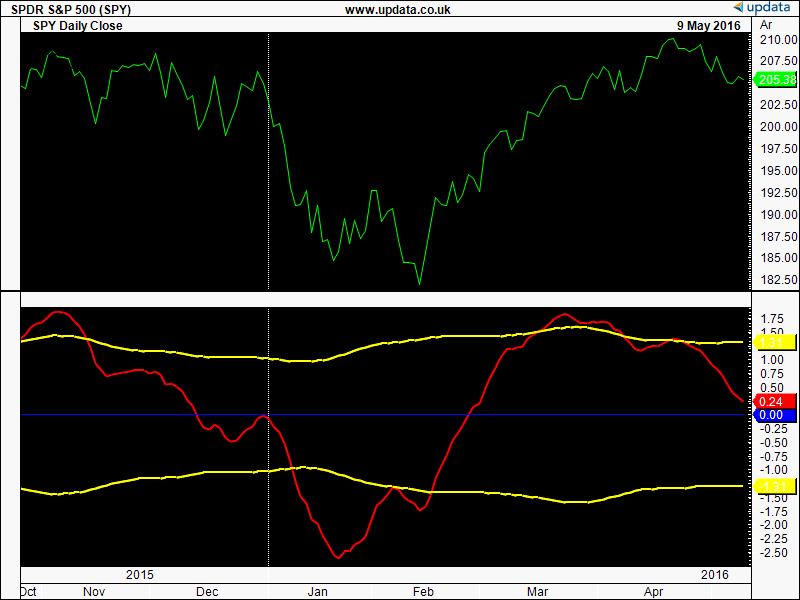
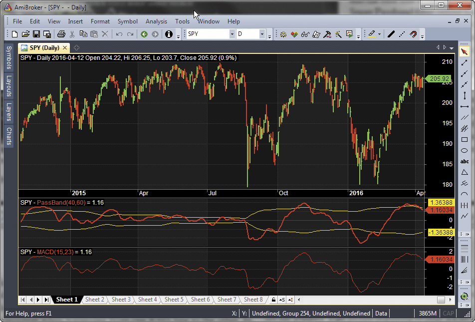
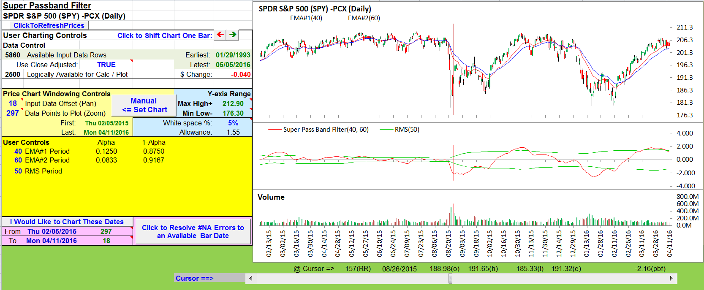

# Traders' Tips: July 2016

- **Article:** The Super Passband Filter by John Ehlers
- **Traders' Tips URL:** [Traders' Tips, July 2016](https://www.traders.com/Documentation/FEEDbk_docs/2016/07/TradersTips.html)

---

## TRADESTATION: JULY 2016

In “The Super Passband Filter” in this issue, author John Ehlers describes
  a new oscillator he’s developed to help minimize computational lag. Ehlers
  calls this new oscillator a super passband filter. He has designed it to reject
  very low-frequency components and thus display as an oscillator as well as
  reject high-frequency components so as to minimize noise.

For convenience, we are providing TradeStation code for super passband filter
  indicators. In addition, we are providing EasyLanguage code for a TradeStation
  strategy based on the super passband filter calculation.

To download the EasyLanguage code, please visit our TradeStation and EasyLanguage
  support forum. The code can be found here:https://community.tradestation.com/Discussions/Topic.aspx?Topic_ID=142776.
  The ELD filename is “TASC_JUL2016.ELD.”

For more information about EasyLanguage in general please seehttps://www.tradestation.com/EL-FAQ.

A sample chart is shown in Figure 1.

This article is for informational purposes. No type of trading or investment
    recommendation, advice, or strategy is being made, given, or in any manner
    provided by TradeStation Securities or its affiliates.

—Doug McCraryTradeStation Securities, Inc.www.TradeStation.com

```easylanguage
//Super Passband Filter
// (c) 2016 John F. Ehlers
// TASC JUL 2016
inputs:
	Period1( 40 ),
	Period2( 60 ) ;
variables:
	a1( 0 ),
	a2( 0 ),
	PB( 0 ),
	count( 0 ),
	RMS( 0 ) ;

a1 = 5 / Period1 ;
a2 = 5 / Period2 ;

PB = (a1 - a2) * Close + (a2*(1 - a1) - a1 * (1 - a2))
	* Close[1] + ((1 - a1) + (1 - a2))*PB[1] - (1 - a1)
	* (1 - a2)*PB[2] ;

RMS = 0;
for count = 0 to 49 
	begin
	RMS = RMS + PB[count]*PB[count] ;
	end ;

RMS = SquareRoot( RMS / 50 ) ;

Plot1( PB, "Super PB" ) ;
Plot2( 0, "Zero Line" ) ;
Plot3( RMS, "+RMB" ) ;
Plot7(-RMS, "-RMS" ) ;


Strategy: Super Passband Filter

//Super Passband Filter
// (c) 2016 John F. Ehlers
// TASC JUL 2016
inputs:
	Period1( 40 ),
	Period2( 60 ),
	UseZeroLineTarget( true ),
	UseReversalStop( true );

variables:
	a1( 0 ),
	a2( 0 ),
	PB( 0 ),
	count( 0 ),
	RMS( 0 ) ;

a1 = 5 / Period1 ;
a2 = 5 / Period2 ;

PB = (a1 - a2) * Close + (a2*(1 - a1) - a1 * (1 - a2))
	* Close[1] + ((1 - a1) + (1 - a2))*PB[1] - (1 - a1)
	* (1 - a2)*PB[2] ;

RMS = 0;
for count = 0 to 49 
	begin
	RMS = RMS + PB[count]*PB[count] ;
	end ;

RMS = SquareRoot( RMS / 50 ) ;

if PB crosses over -RMS then
	Buy next bar at Market 
else if PB crosses under RMS then
	Sell Short next bar at Market ;	

if UseZeroLineTarget then
	begin
	if PB crosses over 0 then
		Sell next bar at Market 
	else if PB crosses under 0 then
		Buy to cover next bar at Market ;
	end ;

If UseReversalStop then
	begin	
	if PB crosses under -RMS then
		Sell next bar at Market 
	else if PB crosses over RMS then
		Buy to cover next bar at Market ;	
	end ;	

```


**FIGURE 1**

---

## METASTOCK: JULY 2016

In “The Super Passband Filter” in this issue, John Ehlers presents his indicator
  called the super passband filter and suggests ways to trade it. The MetaStock
  formula given here for the indicator allows you to set whatever time periods
  are desired for the filter. The buy & sell signal formula has set those
  time periods as variables on the first two lines. If you wish to use different
  time periods, you must change those two lines in all four formulas or else
  the signals will not align.

—William GolsonMetaStock Technical Supportwww.metastock.com

```metastock
Passband Filter
p1:= Input("short time periods", 1, 100, 40);
p2:= Input("long time periods", 2, 200, 60);
a1:= 5/p1;
a2:= 5/p2;
PB:= (a1-a2)*C + (a2*(1-a1)-a1*(1-a2))*Ref(C,-1) +
((1-a1) + (1-a2))*PREV - (1-a1)*(1-a2)*Ref(PREV,-1);
RMSa:= Sum( pb*pb, 50);
RMS:= Sqrt(RMSa/50);
pb;
0;
RMS;
-RMS

```

```metastock
Enter Long:
p1:= 40;
p2:= 60;
a1:= 5/p1;
a2:= 5/p2;
PB:= (a1-a2)*C + (a2*(1-a1)-a1*(1-a2))*Ref(C,-1) +
((1-a1) + (1-a2))*PREV - (1-a1)*(1-a2)*Ref(PREV,-1);
RMSa:= Sum( pb*pb, 50);
RMS:= Sqrt(RMSa/50);
el:= Cross(pb,-RMS);
xl:= pb < Ref(pb, -1);
trade:= If(el, 1, If(xl, 0, PREV));
Cross(trade, 0.5)


Exit Long:
p1:= 40;
p2:= 60;
a1:= 5/p1;
a2:= 5/p2;
PB:= (a1-a2)*C + (a2*(1-a1)-a1*(1-a2))*Ref(C,-1) +
((1-a1) + (1-a2))*PREV - (1-a1)*(1-a2)*Ref(PREV,-1);
RMSa:= Sum( pb*pb, 50);
RMS:= Sqrt(RMSa/50);
el:= Cross(pb,-RMS);
xl:= pb < Ref(pb, -1);
trade:= If(el, 1, If(xl, 0, PREV));
Cross(0.5,trade)


Enter Short:
p1:= 40;
p2:= 60;
a1:= 5/p1;
a2:= 5/p2;
PB:= (a1-a2)*C + (a2*(1-a1)-a1*(1-a2))*Ref(C,-1) +
((1-a1) + (1-a2))*PREV - (1-a1)*(1-a2)*Ref(PREV,-1);
RMSa:= Sum( pb*pb, 50);
RMS:= Sqrt(RMSa/50);
es:= Cross(RMS,pb);
xs:= pb > Ref(pb, -1);
trade:= If(es, 1, If(xs, 0, PREV));
Cross(trade, 0.5)


Exit Short:
p1:= 40;
p2:= 60;
a1:= 5/p1;
a2:= 5/p2;
PB:= (a1-a2)*C + (a2*(1-a1)-a1*(1-a2))*Ref(C,-1) +
((1-a1) + (1-a2))*PREV - (1-a1)*(1-a2)*Ref(PREV,-1);
RMSa:= Sum( pb*pb, 50);
RMS:= Sqrt(RMSa/50);
es:= Cross(RMS,pb);
xs:= pb > Ref(pb, -1);
trade:= If(es, 1, If(xs, 0, PREV));
Cross(0.5, trade)

```

---

## eSIGNAL: JULY 2016

For this month’s Traders’ Tip, we’ve provided the studySuperPassband.efsbased
  on the formula described in John Ehlers’ article in this issue, “The Super
  Passband Filter.” In the article, Ehlers presents a method for filtering data
  and how to apply the study to your trading.

The study contains formula parameters that may be configured through theedit
    chartwindow (right-click on the chart and select “edit chart”). A sample
    chart is shown in Figure 2.

To discuss this study or download a complete copy of the formula code, please
  visit the EFS Library Discussion Board forum under theforumslink
  from the support menu atwww.esignal.comor
  visit our EFS KnowledgeBase athttps://www.esignal.com/support/kb/efs/.
  The eSignal formula script (EFS) is also available for copying & pasting
  below.

—Eric LipperteSignal, an Interactive Data company800 779-6555,www.eSignal.com

```javascript
/*********************************
Provided By:  
eSignal (Copyright c eSignal), a division of Interactive Data 
Corporation. 2016. All rights reserved. This sample eSignal 
Formula Script (EFS) is for educational purposes only and may be 
modified and saved under a new file name.  eSignal is not responsible
for the functionality once modified.  eSignal reserves the right 
to modify and overwrite this EFS file with each new release.

Description:        
    The Super Passband Filter by John F. Ehlers

Version:            1.00  05/05/2016

Formula Parameters:                     Default:
EMA Short Period                        40
EMA Long Period                         60
RMS Period                              50


Notes:
The related article is copyrighted material. If you are not a subscriber
of Stocks & Commodities, please visit www.traders.com.

**********************************/

var fpArray = new Array();

function preMain(){
    
    setPriceStudy(false);
    setCursorLabelName("SuperPB", 0);
    setDefaultBarFgColor(Color.RGB(0,148,255), 0);
    setCursorLabelName("+ RMS", 1);
    setDefaultBarFgColor(Color.RGB(255,155,0), 1);
    setCursorLabelName("- RMS", 2);
    setDefaultBarFgColor(Color.RGB(255,155,0), 2);
    
    var x=0;
    fpArray[x] = new FunctionParameter("EMAShort", FunctionParameter.NUMBER);
	with(fpArray[x++]){
        setName("EMA Short Period");
        setLowerLimit(1);		
        setDefault(40);
    }
    fpArray[x] = new FunctionParameter("EMALong", FunctionParameter.NUMBER);
	with(fpArray[x++]){
        setName("EMA Long Period");
        setLowerLimit(1);		
        setDefault(60);
    }
    fpArray[x] = new FunctionParameter("RMSPeriod", FunctionParameter.NUMBER);
	with(fpArray[x++]){
        setName("RMS Period");
        setLowerLimit(1);		
        setDefault(50);
    }
}

var bInit = false;
var bVersion = null;
var a1 = 0;
var a2 = 0;
var xClose = null;
var xPB = null;
var xRMS = null;

function main(EMAShort, EMALong, RMSPeriod) {
    
    if (bVersion == null) bVersion = verify();
    if (bVersion == false) return;
    
    if(getBarState() == BARSTATE_ALLBARS){
        bInit = false;
    }
    
    if (getCurrentBarCount() < EMALong) return;
    
    if (!bInit){
        a1 = 5 / EMAShort;
        a2 = 5 / EMALong;
        xClose = close();
        addBand(0, PS_DASH, 1, Color.RGB(96,96,96), 4);
        xPB = efsInternal("Calc_PassBand", xClose, a1, a2);
        xRMS = efsInternal("Calc_RMS",xPB, RMSPeriod);
        bInit = true;
    }

    if (xPB.getValue(0) == null || xRMS.getValue(0) == null) return;
    
    return [xPB.getValue(0), xRMS.getValue(0), (-xRMS.getValue(0))];
    
}

function Calc_PassBand(Close, a1, a2){
    
    var PB = null;
    var PB_1 = ref(-1);
    var PB_2 = ref(-2);
    
    PB = (a1 - a2) * Close.getValue(0)  
        + (a2 * (1-a1) - a1 * (1 - a2)) * Close.getValue(-1) 
        + ((1 - a1) + (1 - a2)) * PB_1 - (1 - a1)*(1 - a2) * PB_2;
    
    return PB;
}

function Calc_RMS(PB, Period){
    
    var RMS = null;
    for (var i = 0; i < Period; i++){
        RMS = RMS + PB.getValue(-i) * PB.getValue(-i);
    }
    RMS = Math.sqrt(RMS / Period);

    return RMS;
}

function verify(){
    
    var b = false;
    if (getBuildNumber() < 779){
        
        drawTextAbsolute(5, 35, "This study requires version 10.6 or later.", 
            Color.white, Color.blue, Text.RELATIVETOBOTTOM|Text.RELATIVETOLEFT|Text.BOLD|Text.LEFT,
            null, 13, "error");
        drawTextAbsolute(5, 20, "Click HERE to upgrade.@URL=https://www.esignal.com/download/default.asp", 
            Color.white, Color.blue, Text.RELATIVETOBOTTOM|Text.RELATIVETOLEFT|Text.BOLD|Text.LEFT,
            null, 13, "upgrade");
        return b;
    } 
    else
        b = true;
    
    return b;
}

```

Download: [code/SuperPassband.efs](code/SuperPassband.efs)


**FIGURE 2**

---

## THINKORSWIM: JULY 2016

In “The Super Passband Filter” in this issue, John Ehlers addresses the problem
  of frequencies in indicators that are too low or too high. The common practice
  to refine frequency is to enable smart filters. However, good filters take
  lots of computational power. So Ehlers shows us how to use filters while keep
  computing power relatively low.

We have recreated Ehlers’ study using our proprietary scripting language,thinkscript.
  We have made the loading process extremely easy. Simply click on the linkhttps://tos.mx/zeAlsQand
  chooseview thinkScript. Choose to rename your study EhlersSuperPassbandFilter.
  You can adjust the parameters of this strategy within theedit studieswindow
  to fine-tune your variables.

In Figure 3, you see a chart of SPY, the ETF built to track the S&P 500,
  along with the EhlersSuperPassbandFilter added. For use of the study, traders
  should focus on the red line crossing one of the yellow lines. For more information
  about the filter, please refer to Ehlers’ article in this issue.

—thinkorswimA division of TD Ameritrade, Inc.www.thinkorswim.com


**FIGURE 3**

---

## WEALTH-LAB: JULY 2016

Author John Ehlers continues to please readers with more nearly-zero lag filters—this
  time, it’s the super passband oscillator, which he describes in his article
  in this issue, “The Super Passband Filter.”

Following the trading idea in his article, we are presenting a simple WealthScript
  system that can be applied selectively (only long side or both sides):

Our tests suggest that this new nearly-zero lag filter looks promising for
  countertrend trades and for buying on significant dips (see Figure 4). To execute
  this trading system, Wealth-Lab users need to install (or update) the latest
  version of the TASCIndicators library from theextensionssection
  of our website if they haven't already done so, and then restart Wealth-Lab.

—Eugene, Wealth-Lab teamMS123, LLCwww.wealth-lab.com

```csharp
using System;
using System.Collections.Generic;
using System.Text;
using System.Drawing;
using WealthLab;
using WealthLab.Indicators;
using TASCIndicators;

namespace WealthLab.Strategies
{
	public class TASC201607 : WealthScript
	{
		private StrategyParameter paramPeriod1;
		private StrategyParameter paramPeriod2;
		private StrategyParameter paramGoShort;

		public TASC201607()
		{
			paramPeriod1 = CreateParameter("Period1", 40, 10, 100, 10);
			paramPeriod2 = CreateParameter("Period2", 60, 20, 300, 10);
			paramGoShort = CreateParameter("Go short?", 0, 0, 1, 1);
		}
		
		protected override void Execute()
		{
			int Period1 = paramPeriod1.ValueInt;
			int Period2 = paramPeriod2.ValueInt;
			bool goShort = paramGoShort.ValueInt == 1 ? true : false;

			var spb = SuperPassband.Series(Close,40,60);
			var rms = SuperPassbandRMS.Series(Close,40,60);
			var mrms = rms*-1;
			
			var pbPane = CreatePane(30,true,true);
			PlotSeries(pbPane,spb,Color.Red,WealthLab.LineStyle.Solid,1);
			DrawHorzLine(pbPane,0,Color.Blue,WealthLab.LineStyle.Solid,1);
			PlotSeriesFillBand(pbPane,rms,mrms,Color.Yellow,Color.Transparent,WealthLab.LineStyle.Solid,1);
			
			for(int bar = Math.Max(Period1,Period2); bar < Bars.Count; bar++)
			{
				SetBackgroundColor(bar,Color.Black);
				
				if (IsLastPositionActive)
				{
					Position p = LastPosition;
					if( p.PositionType == PositionType.Long )
					{
						if( CrossUnder(bar, spb, rms) || CrossUnder(bar, spb, mrms) )
							SellAtMarket(bar+1, p);
					}
					else
					{
						if( CrossOver(bar, spb, mrms) || CrossOver(bar, spb, rms))
							CoverAtMarket(bar+1, p);
					}
				}
				else
				{
					if( CrossOver(bar, spb, mrms))
						BuyAtMarket(bar+1);
					else
						if( CrossUnder(bar, spb, rms) && goShort )
							ShortAtMarket(bar+1);
				}
			}
		}
	}
}

```


**FIGURE 4**

---

## NEUROSHELL TRADER: JULY 2016

John Ehlers’ super passband oscillator described in his article in this issue,
  “The Super Passband Filter,” can be easily implemented with a few of NeuroShell
  Trader’s 800+ indicators. Simply selectnew indicatorfrom the insert
  menu and use the indicator wizard to set up the following indicators:

Users of NeuroShell Trader can go to the STOCKS & COMMODITIES section
  of the NeuroShell Trader free technical support website to download a copy
  of this or any previous Traders’ Tips.

A sample chart is shown in Figure 5.

—Marge Sherald, Ward Systems Group, Inc.301 662-7950,sales@wardsystems.comwww.neuroshell.com

```text
PB:	ExpAvg1-ExpAvg2(Close,16,24)
RMS:	SqrRt(Divide(Sum(Pow(PB,2),50),50))
-RMS:	Neg(RMS)

```


**FIGURE 5**

---

## TRADERSSTUDIO: JULY 2016

The TradersStudio code for John Ehlers’ article in this issue, “The Super
  Passband Filter,” can be found atwww.TradersEdgeSystems.com/traderstips.htm.

The following code files are contained in the download:

I tried various rules for the shorting but could not find one that returns
  a profit, consequently I added a parameter that shuts off the shorting. Figure
  6 shows the equity curve for the example system (long only) from 1999 through
  2014 trading one share per signal of the NASDAQ 100 stocks.

—Richard Denninginfo@TradersEdgeSystems.comfor TradersStudio

```basic
'THE SUPER PASBAND FILTER
'Author: John Ehlers, TASC July 2016
'Coded by: Richard Denning 5/11/16 
'TradersEdgeSystems.com

'returns the Ehlers Super PassBand value:
Function Ehlers_SPB(Period1, Period2)
    Dim a1
    Dim a2
    Dim PB As BarArray
    
    a1 = 5 / Period1
    a2 = 5 / Period2
    PB = (a1 - a2)*Close + (a2*(1 - a1) - a1*(1 - a2))*Close[1] + ((1 - a1) + (1 - a2))*PB[1] - (1 - a1)*(1 - a2)*PB[2]
    Ehlers_SPB = PB
End Function
'-----------------------------------------------------------------------------------------------------------------------
'returns the Ehlers RMS value:
Function Ehlers_RMS(Period1,Period2)
    Dim PB As BarArray
    Dim RMS As BarArray
    Dim count
    PB = Ehlers_SPB(Period1,Period2)

RMS = 0
    For count = 0 To 49
        RMS = RMS + PB[count]*PB[count]
    Next
    RMS = Sqr(RMS / 50)
Ehlers_RMS = RMS
End Function
'-----------------------------------------------------------------------------------------------------------------------
'plots the Ehlers_SPB and RMS indicators:
Sub Ehlers_SPB_Ind(Period1,Period2)
   plot1(Ehlers_SPB(Period1,Period2))
   plot2(Ehlers_RMS(Period1,Period2))
   plot3(-Ehlers_RMS(Period1,Period2))
   plot4(0)
End Sub
'------------------------------------------------------------------------------------------------------------------------
'example system created by Richard Denning using the Ehlers SPB & RMS indicators:
'Note the following system is not in the article but is an example
'   of how the indicator might be used in a system
Sub Ehlers_SPB_sys(Period1,Period2,TrendLen,longOnly)
'default: Period1=40, Period2=60, longOnly=1
   Dim myRMS As BarArray
   Dim mySPB As BarArray
   Dim NDX As BarArray
   mySPB = Ehlers_SPB(Period1,Period2)
   myRMS = Ehlers_RMS(Period1,Period2)
   NDX = C Of independent1
   If CrossesOver(mySPB,-myRMS)And C>Average(C,TrendLen) And NDX>Average(NDX,TrendLen) Then Buy("LE",1,0,Market,Day)
   If CrossesUnder(mySPB,myRMS) Then ExitLong("LX","",1,0,Market,Day)
   If CrossesUnder(mySPB,0) Then ExitLong("LX_SE","LE",1,0,Market,Day)
   If CrossesUnder(mySPB,0) And longOnly<>1 And C<Average(C,TrendLen) And NDX<Average(NDX,TrendLen) Then Sell("SE",1,0,Market,Day)
   If CrossesOver(mySPB,-myRMS) Then ExitShort("SX_myRMS","SE",1,0,Market,Day)
   If CrossesOver(mySPB,0) Then ExitShort("SX_0","SE",1,0,Market,Day)
End Sub
'----------------------------------------------------------------------------------------------------------------------------------

```


**FIGURE 6**

---

## NINJATRADER: JULY 2016

The filter discussed in “The Super Passband Filter” by John Ehlers in this
  issue is available for download atwww.ninjatrader.com/SC/July2016SC.zip.

Once you have it downloaded, from within the NinjaTrader Control Center window,
  select the menu File → Utilities → Import NinjaScript and select
  the downloaded file. This file is for NinjaTrader Version 7.

You can review the indicators’ source code by selecting the menu Tools → Edit
  NinjaScript → Indicator from within the NinjaTrader Control Center window
  and selecting the SuperPassBandFile file.

NinjaScript uses compiled DLLs that run native, not interpreted, which provides
  you with the highest performance possible.

—Raymond Deux & Jess PennellNinjaTrader, LLCwww.ninjatrader.com

Code: [ninja-trader/SuperPassBandFilter.cs](ninja-trader/SuperPassBandFilter.cs)


**FIGURE 7**

---

## UPDATA: JULY 2016

Our Traders’ Tip for this month is based on “The Super Passband Filter” in
  this issue by John Ehlers.

In the article, Ehlers seeks to filter out both high and low frequencies from
  market data, eliminating distracting “wiggles” from the resultant signal with
  minimal lag effect. This indicator achieves this with two differenced exponential
  moving averages (EMAs) of varying periods. Trigger points for the filter are
  added with a root mean square (RMS) envelope over the signal line.

The Updata code for this article can be found in the Updata library and may
  be downloaded by clicking thecustommenu andindicator Library.
  Those who cannot access the library due to a firewall may paste the code shown
  here into the Updata custom editor and save it.

—Updata support teamsupport@updata.co.ukwww.updata.co.uk

```text
'Super PassBand Filter
PARAMETER "Period 1" @PERIOD1=40
PARAMETER "Period 2" @PERIOD2=60  
NAME "" "" 
DISPLAYSTYLE 4LINES
INDICATORTYPE CHART
PLOTSTYLE THICK2 RGB(255,0,0) 
PLOTSTYLE2 THICK2 RGB(255,255,0)  
PLOTSTYLE3 THICK2 RGB(255,255,0)   
COLOUR4 RGB(0,0,255)
@A1=0
@A2=0
@PB=0
#COUNT=0
@RMS=0
 
FOR #CURDATE=MAX(@PERIOD1,@PERIOD2) TO #LASTDATE
   @A1=5/@PERIOD1
   @A2=5/@PERIOD2 
   @PB=(@A1-@A2)*CLOSE+(@A2*(1-@A1)-@A1*(1-@A2))*CLOSE(1)+((1-@A1)+(1-@A2))*HIST(@PB,1)      ...-((1-@A1)*(1-@A2)*HIST(@PB,2))
   @RMS=0
   FOR #COUNT=0 TO 49
       @RMS=@RMS+(HIST(@PB,#COUNT)*HIST(@PB,#COUNT))
   NEXT  
   @PLOT=@PB
   @PLOT2=EXPBASE(@RMS/50,0.5)  
   @PLOT3=-EXPBASE(@RMS/50,0.5) 
   @PLOT4=0  
NEXT

```


**FIGURE 8**

---

## AMIBROKER: JULY 2016

In “The Super Passband Filter” in this issue, John Ehlers presents a passband
  filtering technique based on subtraction of two exponential moving averages
  (EMAs). It is worth noting that mathematically, such a filter is similar to
  the classic MACD indicator. The difference is the way that the smoothing factor
  is calculated. Ehlers uses a smoothing factor of 5/period while the classic
  EMA uses factor of 2/(period+1). So the relationship between passband filter parameters and the classic MACD is given by:

A ready-to-use formula that implements the super passband filter as described
  in Ehlers’ article is shown here. To use the formula, enter the code in the
  formula editor and pressapplyto display the passband indicator.

—Tomasz Janeczko, AmiBroker.comwww.amibroker.com

```c
PeriodMACD = -1 + PeriodPassBand/2.5;
```

```c
AmiBroker code
Period1 = Param("Period1", 40, 1, 100 ); 
Period2 = Param("Period2", 60, 1, 100 ); 

a1 = 5 / Period1; 
a2 = 5 / Period2; 

// pass band by difference of EMA's 
// essentially it is 're-invented' MACD 
PB = AMA( C, a1 ) - AMA( C, a2 ); 
         
RMS = sqrt( MA( PB * PB, 50 ) ); 

Plot( PB, "PassBand" + _PARAM_VALUES(), colorRed, styleThick ); 
Plot( RMS, "", colorYellow ); 
Plot( -RMS, "", colorYellow ); 
Plot( 0, "", colorBlue, styleNoLabel );

```


**FIGURE 9**

---

## MICROSOFT EXCEL: JULY 2016

In “The Super Passband Filter” in this issue, author John Ehlers presents
  an indicator with a very quick reaction profile.

By replicating Figure 3 from Ehlers’ article (Figure 10) and playing with
  the cursor, we can see that the lowest and highest points on the indicator
  are never more than one bar behind the lowest or highest closes, marking a
  change in significant localized trends. Hard to get much closer than that,
  eh?

Ehlers suggests using crossover points of the filter value and an RMS envelope
  of the super bandpass filter as a means of generating long or short entry signals.

For those crossovers where a trend appears to be in progress, this seems to
  work well. In sideways patterns where a trend is not well established, this
  technique can lead to whipsaws.

This indicator can give the trader a very early warning of trend changes.
  For safety, one should look for additional entry confirmations to control risk.

A note about the EMA calculations used in this article: In this filter, Ehlers
  is using a more aggressive alpha calculation to build his EMAs than is used
  in either of the perhaps more familiar EMA versions. This EMA is significantly
  more reactive to the most recent input value than a standard EMA or a Wilders’
  EMA.

Here is the formula for a more standard EMA, as found in many software packages:

Here is the formula for Wilders’ EMA:

And finally, here is the formuala as used in the super bandpass filter:

The spreadsheet file for this Traders’ Tip can be downloadedhere.
  To successfully download it, please follow these steps:

—Ron McAllisterExcel and VBA programmerrpmac_xltt@sprynet.com

Originally published in the July 2016 issue ofTechnical Analysis ofSTOCKS & COMMODITIES magazine.All rights reserved. © Copyright 2016, Technical Analysis, Inc.

```vba
Generalized EMA formula = price today * α + EMA yesterday * (1- α)
```

```vba
α = 2 / (N+1)
	Using N = 40: α = 2 / (N+1) = 0.04878, and (1 - α) = 0.95121
```

```vba
α = 1/N 
	Using N = 40: α = 1/N = 0.02500, and (1 - α) = 0.97500
```

```vba
α = 5/N 
	Using N = 40: α = 5/N = 0.12500, and (1 - α) = 0.87500
```

Download: [code/SuperPassbandFilter.xlsm](code/SuperPassbandFilter.xlsm)


**FIGURE 10**

---

## BibTeX

```bibtex
@misc{traders_tips_2016_07,
  author = {{Technical Analysis of STOCKS \& COMMODITIES}},
  title = {Traders' Tips: The Super Passband Filter},
  year = {2016},
  month = jul,
  howpublished = {online},
  url = {https://www.traders.com/Documentation/FEEDbk_docs/2016/07/TradersTips.html}
}
```