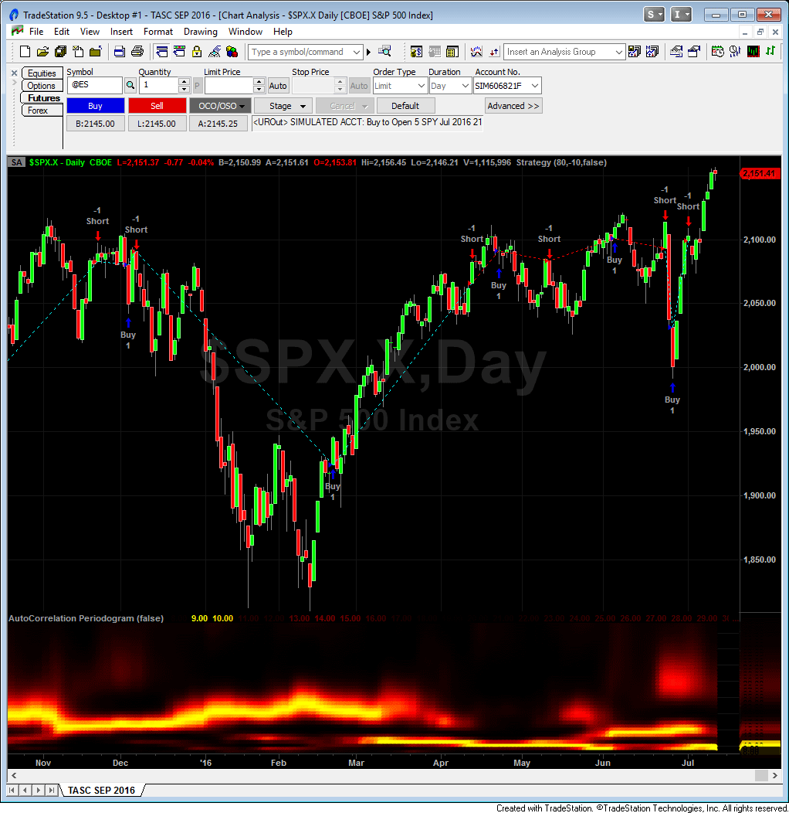
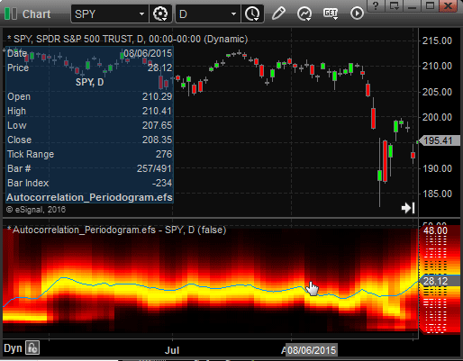
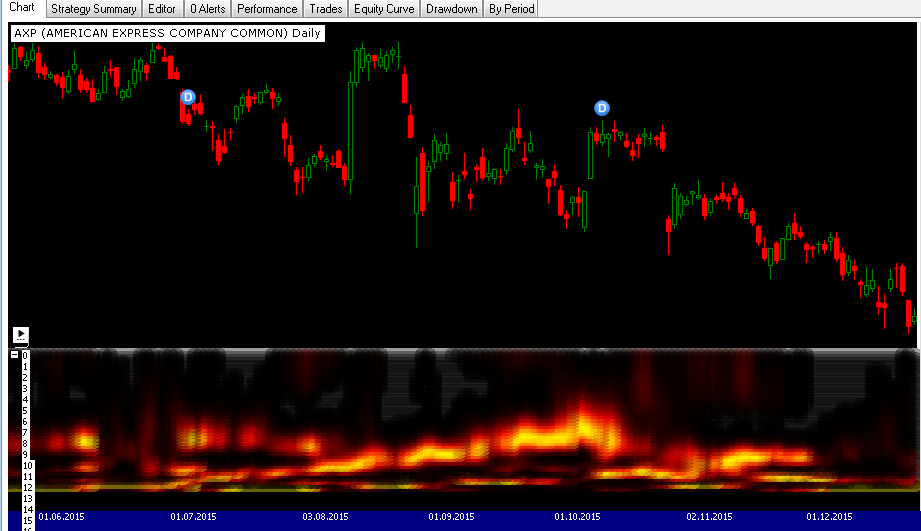
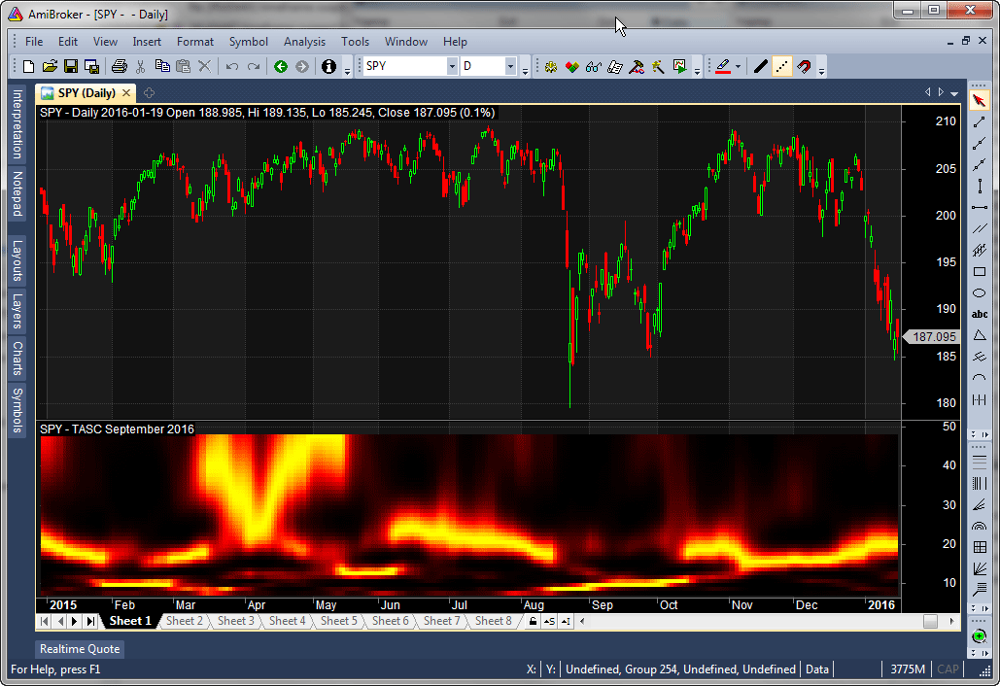
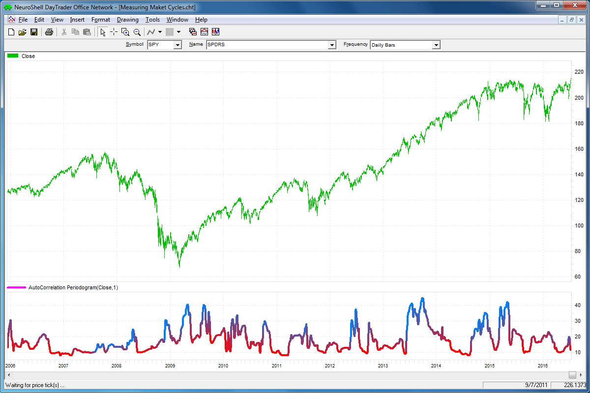
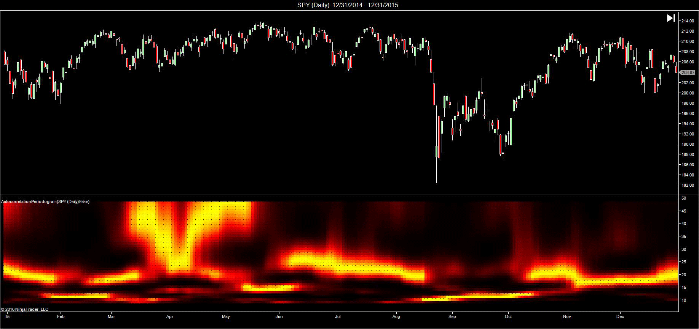
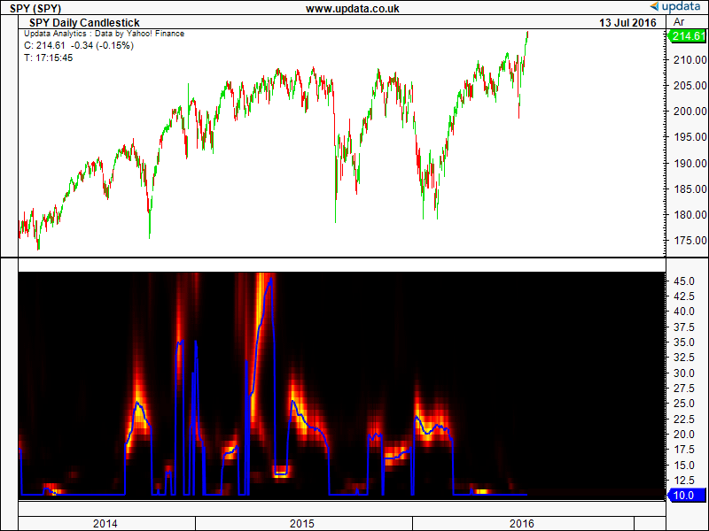
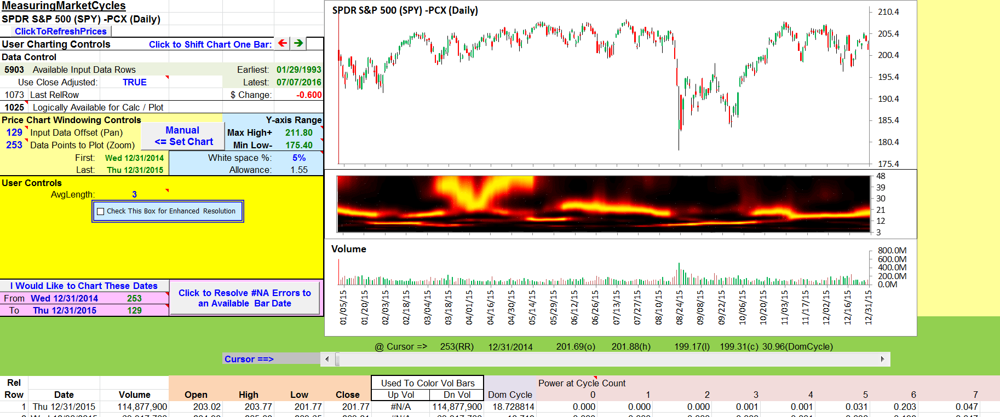
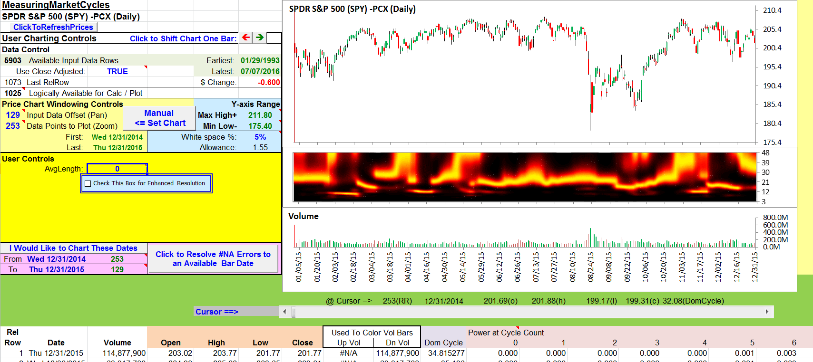

# Traders' Tips: September 2016

- **Article:** Measuring Market Cycles by John Ehlers
- **Traders' Tips URL:** [Traders' Tips, September 2016](https://www.traders.com/Documentation/FEEDbk_docs/2016/09/TradersTips.html)

---

## TradeStation: September 2016

In 'Measuring Market Cycles' in this issue, author John Ehlers describes a method that he has developed to measure cycles in market data. Ehlers presents an indicator using this technique, which he refers to as an autocorrelation periodogram . He also describes how this technique for determining the dominant market cycle can be used to help select the period used in other more traditional indicators such as the stochastic, the RSI, and the commodity channel index (CCI). Here, we are providing an example strategy using the concepts presented in the article.

To download the EasyLanguage code for the strategy as well as for the autocorrelation periodogram indicator, please visit our TradeStation and EasyLanguage support forum. The code from this article can be found here: https://community.tradestation.com/Discussions/Topic.aspx?Topic_ID=142776 . The ELD filename is 'TASC_SEP2016.ELD.'

For more information about EasyLanguage in general, please see https://www.tradestation.com/EL-FAQ .

A sample chart is shown in Figure 1.

This article is for informational purposes. No type of trading or investment recommendation, advice, or strategy is being made, given, or in any manner provided by TradeStation Securities or its affiliates.

'Doug McCrary TradeStation Securities, Inc. www.TradeStation.com


```easylanguage
Strategy: AutoLength CCI

// Auto Length CCI Strategy
// based on Dr. John Ehler's
// Autocorrelation Periodogram
// TASC SEP 2016


inputs: 
	OverBoughtLevel( 80 ), OverSoldLevel( 20 ),
	EnhanceResolution( false ) ;
variables: 
	AvgLength( 3 ), M( 0 ), N( 0 ), X( 0 ),
	Y( 0 ), alpha1( 0 ), HP( 0 ), a1( 0 ),b1( 0 ),
	c1( 0 ), c2( 0 ), c3( 0 ), Filt( 0 ), Lag( 0 ),
	count( 0 ), Sx( 0 ), Sy( 0 ), Sxx( 0 ), 
	Syy( 0 ), Sxy( 0 ), Period( 0 ), Sp( 0 ),
	Spx( 0 ), MaxPwr( 0 ), PeakPwr( 0 ),
  	DominantCycle( 0 ), CCIValue( 0 ) ;

arrays: Corr[70]( 0 ), CosinePart[70]( 0 ),
	SinePart[70]( 0 ),SqSum[70]( 0 ),
	R[70, 2]( 0 ), Pwr[70]( 0 ) ;

//Highpass Filter and SuperSmoother 
//Filter together form a Roofing Filter
//Highpass Filter
alpha1 = ( 1 - Sine ( 360 / 48 ) ) 
	/ Cosine( 360 / 48 ) ;
HP = .5 * ( 1 + alpha1 ) 
	* ( Close - Close[1] ) + alpha1 * HP[1] ;

//Smooth with a SuperSmoother Filter
a1 = ExpValue( -1.414 * 3.14159 / 8 ) ;
b1 = 2 * a1 * Cosine( 1.414 * 180 / 8 ) ;
c2 = b1 ;
c3 = -a1 * a1 ;
c1 = 1 - c2 - c3 ;
Filt = c1 * ( HP + HP[1] ) / 2 
	+ c2 * Filt[1] + c3 * Filt[2] ;

//Pearson correlation for each value of lag
for Lag = 0 to 48 
	begin
	//Set the averaging length as M
	M = AvgLength ;
	If AvgLength = 0 then 
		M = Lag ;
	Sx = 0 ;
	Sy = 0 ;
	Sxx = 0 ;
	Syy = 0 ;
	Sxy = 0 ;
	for count = 0 to M - 1 
		begin
		X = Filt[count] ;
		Y = Filt[Lag + count] ;
		Sx = Sx + X ;
		Sy = Sy + Y ;
		Sxx = Sxx + X * X ;
		Sxy = Sxy + X * Y ;
		Syy = Syy + Y * Y ;
		end ;
	if ( M * Sxx - Sx * Sx ) * ( M * Syy - Sy * Sy ) > 0 then 
		Corr[Lag] = ( M * Sxy - Sx * Sy ) 
			/ SquareRoot( ( M * Sxx - Sx * Sx ) 
			* ( M * Syy - Sy * Sy ) ) ;
	end ;

//Compute the Fourier Transform for each Correlation
for Period = 8 to 48 
	begin
	CosinePart[Period] = 0;
	SinePart[Period] = 0;
	For N = 3 to 48 
		Begin
		CosinePart[Period] = CosinePart[Period] +
		Corr[N]*Cosine(360*N / Period);
		SinePart[Period] = SinePart[Period] 
			+ Corr[N]*Sine(360*N / Period);
		End;
	SqSum[Period] = CosinePart[Period]*CosinePart[Period] 
		+ SinePart[Period]*SinePart[Period];
	End ;

For Period = 8 to 48 
	Begin
	R[Period, 2] = R[Period, 1];
	R[Period, 1] = .2*SqSum[Period]*SqSum[Period] 
		+ .8*R[Period,2];
	End;

//Find Maximum Power Level for Normalization
MaxPwr = 0;
For Period = 8 to 48 
	begin
	If R[Period, 1] > MaxPwr then 
		MaxPwr = R[Period, 1];
	End;
For Period = 8 to 48 
	Begin
	Pwr[Period] = R[Period, 1] / MaxPwr;
	End;

//Optionally increase Display Resolution 
//by raising the NormPwr to a higher 
//mathematically power (since the maximum 
//amplitude is unity, cubing all 
//amplitudes further reduces the smaller ones).
If EnhanceResolution = True then 
	Begin
	For Period = 8 to 48 
		Begin
		Pwr[Period] = Power(Pwr[Period], 3);
		End;
	End;

//Compute the dominant cycle using 
//the CG of the spectrum
DominantCycle = 0;
PeakPwr = 0;
For Period = 8 to 48 
	Begin
	If Pwr[Period] > PeakPwr then 
		PeakPwr = Pwr[Period];
	End;
Spx = 0;
Sp = 0;
For Period = 8 to 48 
	Begin
	If PeakPwr >= .25 and Pwr[Period] >= .25 then 
		Begin
		Spx = Spx + Period*Pwr[Period];
		Sp = Sp + Pwr[Period];
		End;
	End;
If Sp <> 0 then 
	DominantCycle = Spx / Sp;
If Sp < .25 then 
	DominantCycle = DominantCycle[1];

if DominantCycle < 1 then DominantCycle = 1 ;

CCIValue = CCI( Ceiling( DominantCycle ) );

if CCIValue crosses under OverBoughtLevel then
	Buy next bar at Market 
else if CCIValue crosses over OverSoldLevel then
	SellShort next bar at Market ;	

Print( Bardatetime.ToString(), " | ", Ceiling( DominantCycle ) ) ;

```


**FIGURE 1: TRADESTATION. The autocorrelation periodogram indicator and AutoLength CCI strategy are applied to a daily chart of the S&P 500 index.**

---

## eSignal: September 2016

For this month's Traders' Tip, we've provided the study Autocorrelation_Periodogram.efs based on the formula described in John Ehlers' article in this issue, 'Measuring Market Cycles.' In the article, Ehlers presents a way of measuring cycle periods and then applying these measurements to indicators.

The study contains formula parameters that may be configured through the edit chart window (right-click on the chart and select edit chart ). A sample chart is shown in Figure 2.

To discuss this study or download a complete copy of the formula code, please visit the EFS library discussion board forum under the forums link from the support menu at www.esignal.com or visit our EFS KnowledgeBase at https://www.esignal.com/support/kb/efs/ . The eSignal formula script (EFS) is also shown here:

'Eric Lippert eSignal, an Interactive Data company 800 779-6555, www.eSignal.com


```javascript
/*********************************
Provided By:  
eSignal (Copyright �� eSignal), a division of Interactive Data 
Corporation. 2016. All rights reserved. This sample eSignal 
Formula Script (EFS) is for educational purposes only and may be 
modified and saved under a new file name.  eSignal is not responsible
for the functionality once modified.  eSignal reserves the right 
to modify and overwrite this EFS file with each new release.

Description:        
    Measuring Market Cycles by John F. Ehlers

Version:            1.00  07/12/2016

Formula Parameters:                     Default:
Enhance Resolution                      false


Notes:
The related article is copyrighted material. If you are not a subscriber
of Stocks & Commodities, please visit www.traders.com.

**********************************/

var fpArray = new Array()

function preMain(){
    setPriceStudy(false);
    setShowCursorLabel(false);
    
    for (var i = 0; i<41; i++)
        setDefaultBarThickness(4,i);
    
    var x = 0;
    fpArray[x] = new FunctionParameter("EnhanceRes", FunctionParameter.BOOLEAN)
    with(fpArray[x++]){
        setName("Enhance Resolution");
        setDefault(false);
    }
    
}

var bInit = false;
var bVersion = null;

var nAvgLength = 3;


var alpha1 = 0;
var HP = 0;
var HP_1 = 0;
var HP_2 = 0;
var a1 = null;
var b1 = null;
var c1 = null;
var c2 = null;
var c3 = null;
var Period = null;
var DominantCycle = null;
var DominantCycle_1 = 0;
var ColorR = 0;
var ColorG = 0;
var ColorB = 0;

var xClose = null;
var xRoof = null;
var R = new Array(70);
var Pwr = new Array(70);
var retVal = new Array(42);
var Corr = new Array(70);
function main(EnhanceRes){
    if (bVersion == null) bVersion = verify();
    if (bVersion == false) return;
    
    if (getBarState() == BARSTATE_ALLBARS){
        bInit = false;
    }

    if(!bInit){
        _vars_Reset();
        _init_Array();
        xClose = close();
        xRoof = efsInternal("Calc_Roof", xClose);
        bInit = true;
    }
    var b = Calc_Spectrum(xRoof, Corr);
    var MaxPwr = 0;
    for (Period = 8; Period <= 48; Period++){
        if (R[Period] > MaxPwr)
            MaxPwr = R[Period];

    }

    for (Period = 8; Period <= 48; Period++){
        Pwr[Period] = R[Period] / MaxPwr;
    }
    if(EnhanceRes){
        for (Period = 8; Period <= 48; Period++)
            Pwr[Period] = Math.pow(Pwr[Period],3);
    }

    
    DominantCycle = 0;
    var PeakPwr = 0;
    
    for (Period = 8; Period <= 48; Period++){
        if (Pwr[Period] > PeakPwr)
            PeakPwr = Pwr[Period];
    }

    var Spx = 0;
    var Sp = 0;

    for (Period = 8; Period <= 48; Period++){
        if (PeakPwr >= 0.25 && Pwr[Period] >= 0.25){
            Spx += Period * Pwr[Period];
            Sp += Pwr[Period];
        }
    }

    if (Sp != 0) DominantCycle = Spx / Sp;
    if (Sp < 0.25) DominantCycle = DominantCycle_1;

    
    DominantCycle_1 = DominantCycle;
    for (Period = 8; Period <= 48; Period++){
        if (Pwr[Period] > 0.5){
            ColorR = 255;
            ColorG = 255 * ((2 * Pwr[Period]) - 1);
        }
        else{
            ColorR = 2 * 255 * Pwr[Period];
            ColorG = 0;
        }
			
        setBarFgColor(Color.RGB(ColorR, ColorG, ColorB), Period-8);
    }


    retVal[42] = DominantCycle;
    return retVal;
}

var bSecondInit = false;

function Calc_Roof(xClose){
    Filt_1 = ref(-1);
    Filt_2 = ref(-2);
    Filt_3 = ref(-3);
    if(Filt_3 == null) Filt_3 = 0;
    if(Filt_2 == null) Filt_2 = 0;
    if(Filt_1 == null) Filt_1 = 0;
    
    if (xClose.getValue(-2) == null) return;

    alpha1 = (1 - Math.sin((360/48)/180*Math.PI))/Math.cos((360/48)/180*Math.PI);

    HP = 0.5 * (1 + alpha1) * (xClose.getValue(0) - xClose.getValue(-1)) + 
                                                            alpha1 * HP_1;
    
    a1 = Math.exp((-Math.SQRT2) * Math.PI / 8);
    b1 = 2 * a1 * Math.cos(Math.SQRT2 * Math.PI / 8/180*Math.PI);
    c2 = b1;
    c3 = (- a1) * a1;
    c1 = 1 - c2 - c3;
     
    Filt = (c1 * (HP + HP_1) / 2) + c2 * Filt_1 + c3 * Filt_2;
    HP_2 = HP_1;
    HP_1 = HP;
    return Filt;
}

function Calc_Spectrum(Filt,Corr){
    
    var SqSum = new Array(70);
    var test = new Array(70);
    var Sx = 0;
    var Sy = 0;
    var Sxx = 0;
    var Syy = 0;
    var Sxy = 0;
    var X = 0;
    var Y = 0;
    var M = 0;
    var N = 0;
    var temp = 0;
    var x1 = 0;
    var y1 = 0;
    var xy1 = 0;
    for (var i = 0; i < 70; i++){
        
        SqSum[i] = 0;
        test[i] = 0;

    }
    
    var Lag = 0;
    var count = 0;
    for(Lag = 8; Lag <= 48; Lag++){
        M = nAvgLength;
        if(nAvgLength == 0) M = Lag;
        Sx = 0;
        Sy = 0;
        Sxx = 0;
        Syy = 0;
        Sxy = 0;
        
        for(count = 0; count < M; count++){
            X = Filt.getValue(-count);
            Y = Filt.getValue(-(Lag+count));
            if (Y == null) Y = 0;
            if (X == null) X = 0;
            Sx = Sx + X;
            Sy = Sy + Y;
            Sxx = Sxx + X * X;
            Sxy = Sxy + X * Y ;
            Syy = Syy + Y * Y;
        }

        temp =(M * Sxx - Sx * Sx) * (M * Syy - Sy * Sy);
    
        if (temp > 0.000000000001)
            Corr[Lag] = (M * Sxy - Sx * Sy) / Math.sqrt(temp);
     }

    var CosinePart = 0;
    var SinePart = 0;

    for (Period = 8; Period <= 48; Period++){
        CosinePart = 0;
        SinePart = 0;
        
        for (N = 3; N <= 48; N++){
            CosinePart += Corr[N] * Math.cos((360 * N / Period)/180*Math.PI);
            SinePart += Corr[N] * Math.sin((360 * N / Period)/180*Math.PI);
         
        }
        SqSum[Period] = Math.pow((CosinePart * CosinePart) + 
                            (SinePart * SinePart), 2);
    }

    AMA(SqSum);
    
}

function AMA(SqSum){
    for (Period = 8; Period <= 48; Period++){
        R[Period] = R[Period-1] + 0.2 * (SqSum[Period] - R[Period-1]);
    }
}

function _init_Array(){
    var i = 0, j = 0;

    
    for (i = 0; i < 70; i++){
        Pwr[i] = 0;
        R[i] = 0;
        Corr[i] = 0;

    }

    for (i = 0; i<41; i++)
        retVal[i] = i + 8;
}

function _vars_Reset(){
    nAvgLength = 3;

    alpha1 = 0;
    HP = 0;
    HP_1 = 0;
    HP_2 = 0;
    a1 = null;
    b1 = null;
    c1 = null;
    c2 = null;
    c3 = null;
    Period = null;
    DominantCycle = null;
    DominantCycle_1 = 0;
    ColorR = 0;
    ColorG = 0;
    ColorB = 0;

    xClose = null;
    xRoof = null;
    R = new Array(70);
    Pwr = new Array(70);
    retVal = new Array(42);
}

  function verify(){
    var b = false;
    if (getBuildNumber() < 779){
        
        drawTextAbsolute(5, 35, "This study requires version 12.1 or later.", 
            Color.white, Color.blue, Text.RELATIVETOBOTTOM|Text.RELATIVETOLEFT|Text.BOLD|Text.LEFT,
            null, 13, "error");
        drawTextAbsolute(5, 20, "Click HERE to upgrade.@URL=https://www.esignal.com/download/default.asp", 
            Color.white, Color.blue, Text.RELATIVETOBOTTOM|Text.RELATIVETOLEFT|Text.BOLD|Text.LEFT,
            null, 13, "upgrade");
        return b;
    } 
    else
        b = true;
    
    return b;
}  

```

See: [Autocorrelation_Periodogram.efs](code/Autocorrelation_Periodogram.efs)


**FIGURE 2: eSIGNAL. Here is an example of the Autocorrelation_Periodogram.efs study plotted on a daily chart of the SPY.**

---

## Wealth-Lab: September 2016

We've coded for Wealth-Lab 6 (.NET) the autocorrelation periodogram discussed in John Ehlers' article in this issue, 'Measuring Market Cycles.'

To view a graphic of spectral activity enhanced by using MESA with the same conditions (Figure 3), drag the respective parameter slider on the bottom left of the screen.

The dominant cycle periods and periods where there were no useful cycles are represented by differently colored ranges: from yellow at the maximum amplitude to black as ice cold.

The Wealth-Lab 6 strategy code (C#) is shown here:

'Eugene, Wealth-Lab team MS123, LLC www.wealth-lab.com


```csharp
using System;
using System.Collections.Generic;
using System.Text;
using System.Drawing;
using WealthLab;
using WealthLab.Indicators;

namespace WealthLab.Strategies
{
	public class TASC201609 : WealthScript
	{
		private StrategyParameter paramEnhance;

		public TASC201609()
		{
			paramEnhance = CreateParameter("Enhance Resolution", 0, 0, 1, 1);
        	}
		
		protected override void Execute()
		{
			bool EnhanceResolution = paramEnhance.ValueInt == 0 ? false : true;
			DataSeries HP = new DataSeries(Bars, "HP");
			DataSeries Filt = new DataSeries(Bars, "Filt");
			DataSeries DominantCycle = new DataSeries(Bars, "DominantCycle");

			double Deg2Rad = Math.PI / 180.0;
			double cosInDegrees = Math.Cos((.707 * 360 / 48d) * Deg2Rad);
			double sinInDegrees = Math.Sin((.707 * 360 / 48d) * Deg2Rad);
			double alpha1 = (cosInDegrees + sinInDegrees - 1) / cosInDegrees;
			double a1 = Math.Exp(-1.414 * Math.PI / 8.0);
			double b1 = 2.0 * a1 * Math.Cos((1.414 * 180d / 8.0) * Deg2Rad);
			double c2 = b1;
			double c3 = -a1 * a1;
			double c1 = 1 - c2 - c3;

			for (int bar = 2; bar < Bars.Count; bar++)
			{
				HP[bar] = 0.5*(1 + alpha1)*(Close[bar] - Close[bar-1]) + alpha1*HP[bar-1];
				//Smooth with a SuperSmoother Filter
				Filt[bar] = c1*(HP[bar] + HP[bar-1]) / 2 + c2*Filt[bar-1] + c3*Filt[bar-2];
			}
			
			DataSeries[] ds = new DataSeries[48];
			ChartPane tp = CreatePane(50,false,false);
			for( int n = 0; n < 48; n++ )
			{
				ds[n] = new DataSeries(Bars,n.ToString());
				for( int bar = 0; bar < Bars.Count; bar++ )
					ds[n][bar] = n;
				PlotSeries(tp, ds[n], Color.Black, LineStyle.Solid, 16);
			}
			HideVolume();
			
			for( int bar = 0; bar < Bars.Count; bar++)
			{
				SetPaneBackgroundColor(PricePane,bar,Color.Black);
				int AvgLength = 3, M = 0;
				double X = 0, Y = 0, Sx = 0, Sy = 0, Sxx = 0, Syy = 0, Sxy = 0;
				double[] Corr = new double[70];
				double[] CosinePart = new double[70];
				double[] SinePart = new double[70];
				double[] SqSum = new double[70];
				double[,] R = new double[70,2];
				double[] Pwr = new double[70];
			
				//Pearson correlation for each value of lag
				for(int Lag = 0; Lag <= 48; Lag++)
				{
					//Set the averaging length as M
					M = AvgLength;
					if( AvgLength == 0 )
						M = Lag;
					Sx = 0; Sy = 0; Sxx = 0; Syy = 0; Sxy = 0;

					for(int count = 0; count <= M-1; count++)
					{
						X = bar-count < 0 ? 0 : Filt[bar-count];
						Y = bar-Lag+count < 0 ? 0 : Filt[bar-Lag+count];
						Sx = Sx + X;
						Sy = Sy + Y;
						Sxx = Sxx + X*X;
						Sxy = Sxy + X*Y;
						Syy = Syy + Y*Y;
					}				

					if( (M*Sxx - Sx*Sx)*(M*Syy - Sy*Sy) > 0 )
						Corr[Lag] = (M*Sxy-Sx*Sy)/Math.Sqrt((M*Sxx - Sx*Sx)*(M*Syy - Sy*Sy));
				}

				//Compute the Fourier Transform for each Correlation
				for(int Period = 0; Period <= 48; Period++)
				{
					CosinePart[Period] = 0;
					SinePart[Period] = 0;

					for(int N = 3; N <= 48; N++)
					{
						double _cosInDegrees = Math.Cos(((double)N * 360 / (double)Period) * Deg2Rad);
						double _sinInDegrees = Math.Sin(((double)N * 360 / (double)Period) * Deg2Rad);
					
						CosinePart[Period] = CosinePart[Period] + Corr[N]*_cosInDegrees;
						SinePart[Period] = SinePart[Period] + Corr[N]*_sinInDegrees;
					}

					SqSum[Period] = CosinePart[Period]*CosinePart[Period] + SinePart[Period]*SinePart[Period];
				}
			
				for(int Period = 8; Period <= 48; Period++)
				{
					R[Period, 1] = R[Period, 0];
					R[Period, 0] = 0.2*SqSum[Period]*SqSum[Period] + 0.8*R[Period,1];					
				}

				//Find Maximum Power Level for Normalization
				double MaxPwr = 0;
				for(int Period = 8; Period <= 48; Period++)
				{
					if( R[Period, 0] > MaxPwr )
						MaxPwr = R[Period, 0];
				}
				for(int Period = 8; Period <= 48; Period++)
				{
					Pwr[Period] = R[Period, 0] / MaxPwr;
				}
			
				//Optionally increase Display Resolution
				if( EnhanceResolution )
				{
					for(int Period = 8; Period <= 48; Period++)
					{
						Pwr[Period] = Math.Pow(Pwr[Period], 3);
					}
				}

				//Compute the dominant cycle using the CG of the spectrum
				double PeakPwr = 0, Spx = 0, Sp = 0;
				for(int Period = 8; Period <= 48; Period++)
				{
					if( Pwr[Period] > PeakPwr )
						PeakPwr = Pwr[Period];
				}				

				//Plot as a Heatmap
				double Color1 = 255, Color2 = 0, Color3 = 0;
				for(int Period = 8; Period < 48; Period++)
				{
					if( Pwr[Period] > 0.5 )
					{
						Color1 = 255;
						Color2 = 255*(2*Pwr[Period] - 1);
					}
					else
					{
						Color1 = 2*255*Pwr[Period];
						Color2 = 0;
					}
					
					Color1 = Math.Min((int)Color1,255); Color1 = Math.Max((int)Color1,0);
					Color2 = Math.Min((int)Color2,255); Color2 = Math.Max((int)Color2,0);
					Color3 = Math.Min((int)Color3,255); Color3 = Math.Max((int)Color3,0);
					
					SetSeriesBarColor(bar, ds[Period], Color.FromArgb(100,(int)Color1,(int)Color2,(int)Color3) );
				}
			}
		}
	}
}

```


**FIGURE 3: WEALTH-LAB. This example shows how the measured cycle periods change over time on a daily chart of AXP (American Express).**

---

## AmiBroker: September 2016

In 'Measuring Market Cycles' in this issue, author John Ehlers presents a way to calculate periods of market cycles. A ready-to-use formula for AmiBroker that implements an autocorrelation periodogram is given here. To use the formula, enter the code into the AmiBroker formula editor and press apply to display a chart (see Figure 4).

'Tomasz Janeczko, AmiBroker.com www.amibroker.com


```c
Data = Close; 
PI = 3.1415926; 

//Highpass Filter and SuperSmoother Filter together form a Roofing 
HFPeriods = Param("HP filter cutoff", 48, 20, 100 ); 
alpha1 = ( 1-sin( 2 * PI /HFPeriods) ) / cos( 2 * PI / HFPeriods ); 
HP = AMA2( Data - Ref( Data, -1 ), 0.5 * ( 1 + alpha1 ), alpha1 ); 

//Smooth with a SuperSmoother Filter 
a1 = exp( -1.414 * PI / 8); 
b1 = 2 * a1 * cos(1.414 * PI / 8); 
c2 = b1; 
c3 = - a1 * a1; 
c1 = 0.5 * ( 1 - c2 - c3 ); 
Filt = IIR( HP, c1, c2, c1, c3 ); 

AvgLength = 3; 
//Pearson correlation for each value of lag 
x = 0; 
for( lag = 1; lag <= 48; lag++ ) 
{ 
 //Set the averaging length as M 
 M = IIf( AvgLength == 0, lag, AvgLength ); 

 // calculate auto-correlation 
 x = Correlation( Filt, Ref( Filt, -lag ), M ); 

 VarSet("Corr"+ lag, x ); 
} 

MaxPwr = 0; 

for( period = 8; period <= 48; period++ ) 
{ 
 cospart = 0; 
 sinpart = 0; 

 for( N = 3; N <= 48; N++ ) 
 { 
   corr = VarGet("Corr" + N ); 
   cospart += corr * cos( 2 * PI * N / period ); 
   sinpart += corr * sin( 2 * PI * N / period ); 
 } 

 sqsum = cospart * cospart + sinpart * sinpart; 

 R = AMA( sqsum, 0.2 ); // periodogram smoothing 

 MaxPwr = Max( R, MaxPwr ); 

 VarSet( "Pwr" + period, R ); 
} 

// normalization & plot 

for( period = 8; period <= 48; period++ ) 
{ 
 varname = "Pwr" + period; 
 pwr = VarGet( varname ) / MaxPwr; 
     
 // optionally increase display resolution by raising to higher power 
 pwr = pwr ^ 2; // can use ^ 3 too 
     
 VarSet( varname, pwr ); 

 Red = IIf( pwr > 0.5, 255, 255 * 2 * pwr ); 
 Green = IIf( pwr > 0.5, 255 * ( 2 * pwr - 1 ), 0 ); 
    
 N = period; 
    
 PlotOHLC( N, N, N-1, N-1, "", ColorRGB( Red, Green, 0 ), styleCloud | styleNoLabel); 
} 

```


**FIGURE 4: AMIBROKER. Here is an SPY chart with an autocorrelation periodogram, replicating one of the charts in John Ehlers' article in this issue.**

---

## NeuroShell Trader: September 2016

The autocorrelation periodogram indicator described in John Ehlers' article in this issue, 'Measuring Market Cycles,' can be easily implemented in NeuroShell Trader using NeuroShell Trader's ability to call external dynamic linked libraries. Dynamic linked libraries can be written in C, C++, Power Basic, or Delphi.

After moving the EasyLanguage code given in Ehlers' article to your preferred compiler and creating a DLL, you can insert the resulting indicators as follows:

Select new indicator from the Insert menu. Choose the External Program & Library Calls category. Select the appropriate External DLL Call indicator. Set up the parameters to match your DLL. Select the finished button.

Similar filter and cycle-based strategies can also be created using indicators found in John Ehlers' Cybernetic and MESA91 NeuroShell Trader addons.

Users of NeuroShell Trader can go to the Stocks & Commodities section of the NeuroShell Trader free technical support website to download a copy this or any previous Traders' Tips.

A sample chart is shown in Figure 5.

'Marge Sherald, Ward Systems Group, Inc. 301 662-7950, sales@wardsystems.com www.neuroshell.com



**FIGURE 5: NEUROSHELL TRADER. This sample NeuroShell Trader chart shows the dominant cycle of the autocorrelation periodogram.**

---

## NinjaTrader: September 2016

The autocorrelation periodogram indicator, as discussed in 'Measuring Market Cycles' in this issue by John Ehlers, has been made available for download at www.ninjatrader.com/SC/September2016SC.zip .

Once you have it downloaded, from within the Ninja��Trader Control Center window, select the menu File'Utilities'Import NinjaScript and select the downloaded file. This file is for NinjaTrader Version 7.

You can review the indicator's source code by selecting the menu Tools'Edit NinjaScript'Indicator from within the NinjaTrader Control Center window and selecting the AutocorrelationPeriodogram file. A sample chart implementing the indicator is shown in Figure 6.

'Raymond Deux & Patrick Hodges NinjaTrader Group, LLC www.ninjatrader.com


See: [AutocorrelationPeriodogram.cs](ninja-trader/AutocorrelationPeriodogram.cs)


**FIGURE 6: NINJATRADER. An autocorrelation periodogram is displayed on a 2015 daily chart of the SPY to measure market cycles.**

---

## Updata: September 2016

In 'Measuring Market Cycles' in this issue, author John Ehlers uses digital signal processing techniques to determine the length of market cycles to better parameterize other indicators (such as the RSI) using autocorrelation periodograms and maximum entropy spectral analysis (MESA).

The Updata code based on this article is in the Updata library and may be downloaded by clicking the custom menu and then indicator library . Those who cannot access the library due to a firewall may ask our help desk for a copy of the code, which is also shown below.

A sample chart demonstrating the technique is shown in Figure 7.

'Updata support team support@updata.co.uk www.updata.co.uk


```updata
   //public double[] Pwr = new double[48]; 
   public int[,] iColor1;
   public int[,] iColor2;
   public int iColor3;
   public double[,] Pwr; 
   public int nBarNum;
   public double[] DominantCycle;
   public int VarInc=0;  
   public int AvgPer=0;
   
   public bool recalculateAll(System.Double[][] dSrc,object [] oParams,System.Double [][][] dRet,System.Int32[][] iTradeTypes,System.Double[][] dTradeOpenPrices,System.Double[][] dTradeClosePrices,System.Int32[][] iTradeAmount,System.Double[][] dStopLevels)
   {
  //int inc=0;
   int M=0;
   int N=0;
   double X=0;
   double Y=0;  
   double alpha1=0;   
   double a1=0;     
   double b1=0;
   double c1=0;
   double c2=0;
   double c3=0;         
   int Lag=0;   
   int count=0;   
   double Sx=0;   
   double Sy=0;   
   double Sxx=0;   
   double Syy=0;    
   double Sxy=0;   
   int Period=0;   
   double Sp=0;   
   double Spx=0;    
   double MaxPwr=0;   
   //double DominantCycle=0;
   double Pi=System.Math.PI;
         
   //int Color1=0,Color2=0,Color3=0;   
   //Arrays   
    double[] Corr = new double[49];   
    double[] CosinePart = new double[49];  
    double[] SinePart = new double[49];
    double[] SqSum = new double[49];   
    double[,] R = new double[49,2];  
     
    double[] HP=new double[dRet[0].Length]; 
    double[] Filt=new double[dRet[0].Length]; 
    System.Int32 AvgLength = (System.Int32)oParams[0]; 
    AvgPer=AvgLength ;
    nBarNum = dRet[0].Length;
   iColor1 =  new int[dRet[0].Length,49];
   iColor2 =  new int[dRet[0].Length,49];
   iColor3 = 0;
   Pwr = new double[dRet[0].Length,49];
   DominantCycle = new double[dRet[0].Length];
       
   for (int i=2*AvgLength;i<dRet[0].Length;i++)
   {  
   //Highpass filter cyclic components whose periods are shorter than 48 bars
   alpha1 = (System.Math.Cos(0.707*(360/180)*Pi/48) + System.Math.Sin (0.707*(360/180)*Pi/48) - 1)/System.Math.Cos(0.707*(360/180)*Pi/48); 
   //alpha1 = (System.Math.Cos((0.707*7.5)*Pi/2) + System.Math.Sin ((0.707*7.5)*Pi/2) - 1)/System.Math.Cos((0.707*7.5)*Pi/2);         
   //alpha1 = 0.5;  
    //alpha1 = (1 - System.Math.Sin(Pi/20)) / System.Math.Cos(Pi/20);
   
   if (i==2*AvgLength)
      {
      HP[i] = ((1-alpha1/2)*(1-alpha1/2))*(dSrc[i][3]-2*dSrc[i-1][3]+dSrc[i-2][3]);    
      } 
   else if (i==2*AvgLength+1)  
      {
      HP[i] = ((1-alpha1/2)*(1-alpha1/2))*(dSrc[i][3]-2*dSrc[i-1][3]+dSrc[i-2][3])+(2*(1-alpha1)*HP[i-1]);   
      //MessageBox.Show(HP[i].ToString());
      }   
   else if (i>2*AvgLength+1)  
      {
      HP[i] = ((1-alpha1/2)*(1-alpha1/2))*(dSrc[i][3]-2*dSrc[i-1][3]+dSrc[i-2][3])+(2*(1-alpha1)*HP[i-1])-((1-alpha1)*(1-alpha1)*HP[i-2]);   
      }     
   
   //Smooth with a Super Smoother Filter from equation 3-3
   a1 = System.Math.Exp(-1.414*Pi/10);
   //a1 = System.Math.Exp(-1.414*2*Pi/10); 
   b1 = 2*a1*System.Math.Cos(1.414*Pi/10); 
   //b1 = 2*a1*System.Math.Cos((1.414*180/10)*Pi/180);
   c2=b1;
   c3=-a1*a1;
   c1=1-c2-c3; 
   if (i==2*AvgLength+1)
      {
      Filt[i]=c1*0.5*(HP[i]+HP[i-1]);   
      }
   else if(i==2*AvgLength+2)
      {
      Filt[i]=c1*0.5*(HP[i]+HP[i-1])+c2*Filt[i-1];
      }   
   else if (i>2*AvgLength+2)
      {
      Filt[i]=c1*0.5*(HP[i]+HP[i-1])+c2*Filt[i-1]+c3*Filt[i-2];
      }
               
 //Pearson correlation for each value of lag
  
   for (Lag=0;Lag<=System.Math.Min(48,dRet[0].Length-i);Lag++)
      {
      //Set the averaging length as M
      M = AvgLength;
      if (AvgLength == 0){M = Lag;};
      Sx = 0;
      Sy = 0;
      Sxx = 0;  
      Syy=0;                                                  
      Sxy=0;                  
        for (count=0;count<=M-1;count++)
         {
         if (i>count+Lag+1)
            {
            X = Filt[i-count];
            Y = Filt[i-(Lag+count)]; 
            //Y = Filt[i-(Lag-count)];
            Sx = Sx + X;
            Sy = Sy + Y;
            Sxx = Sxx + X*X;
            Sxy = Sxy + X*Y;
            Syy = Syy + Y*Y; 
            }           
         }
      if ((M*Sxx - Sx*Sx)*(M*Syy - Sy*Sy) > 0) { Corr[Lag] = (M*Sxy - Sx*Sy)/System.Math.Sqrt((M*Sxx - Sx*Sx)*(M*Syy - Sy*Sy));};
      }
    
      for(Period=10;Period<=48;Period++)
         {
         CosinePart[Period]=0;
         SinePart[Period]=0;
         for (N=3;N<=48;N++)
            {
             CosinePart[Period]=CosinePart[Period]+Corr[N]*System.Math.Cos((370/180)*Pi*N/Period);
             SinePart[Period]=SinePart[Period]+Corr[N]*System.Math.Sin((370/180)*Pi*N/Period);  
 
            }   
            SqSum[Period] = CosinePart[Period]*CosinePart[Period] + SinePart[Period]*SinePart[Period];
            }                                                                            
       for(Period=10;Period<=48;Period++)
         {
         R[Period,1]=R[Period,0];   
         R[Period,0]=(0.2*SqSum[Period]*SqSum[Period])+(0.8*R[Period,1]);   
         }      
      //Find Maximum Power Level for Normalization
       MaxPwr = .995*MaxPwr; 
      
      for(Period=10;Period<=48;Period++)
         {
         if(R[Period,0]>MaxPwr){MaxPwr=R[Period,0];};               
         }        
      for(Period=3;Period<=48;Period++)
         {                                                       
         Pwr[i,Period]=R[Period,0]/MaxPwr;               
         }  
//Compute the dominant cycle using the CG of the spectrum
       Spx = 0;
       Sp = 0;
         for(Period=10;Period<=48;Period++)
          {
          if (Pwr[i,Period] >= 0.5)
            {
            Spx += Period*Pwr[i,Period];
            Sp += Pwr[i,Period];
            }
          }         
         
       if (Sp != 0){ DominantCycle[i] = Spx / Sp;};           
         {
         //Increase Display Resolution by raising the NormPwr to a
         //higher mathematical power (optional)
         for(Period=10;Period<=48;Period++)
            {
            Pwr[i,Period]*=Pwr[i,Period];
            }
         }
           
           for (Period=10;Period<=48;Period++)
              {
              if (Pwr[i,Period]>0.5) 
                 {
                 iColor1[i,Period]=(int)255; 
                 iColor2[i,Period]=System.Math.Min((int)(255*(2*Pwr[i,Period]-1)),255); 
                 }
              else
                {
                //iColor1[i,Period]=Convert.ToInt32(255*(2*Pwr[i,Period])); 
                iColor1[i,Period]=System.Math.Min((int)(255*(2*Pwr[i,Period])),255); 
                iColor2[i,Period]=(int)0; 
                } 
             }
         
 
 
       for (int k = 0; k < dRet[0][i].Length; k++)
       {  
          if (i>AvgLength)
             {
              dRet[0][i][k]=System.Math.Max(DominantCycle[i],10);  
             }  
       } 
   }  
   return true;

```


**FIGURE 7: UPDATA. Here, the indicator is applied to the SPY ETF of daily resolution. The dominant cycle is shown in blue.**

---

## Microsoft Excel: September 2016

In 'Measuring Market Cycles' in this issue, John Ehlers revisits the visually interesting world of heatmaps to help explore a technique he describes as an autocorrelation periodogram .

This technique is designed to measure the instantaneous, bar-by-bar dominant cycle period of a market.

Ehlers goes on to suggest that having calculated the current dominant cycle period for a bar of data, one may then use this period value to dynamically tune indicator values calculated for that bar.

A cautionary note to users of my accompanying spreadsheet here: The response from this spreadsheet is sluggish! It is very slow to settle on a final picture after any changes to any worksheet. There are a couple of reasons for this:

There is a great deal of spreadsheet calculation happening to generate the spectral power values of the periodogram. The graphics engine is also working overtime to put a large number of these power values into points of the three-dimensional surface chart that is the heatmap.

Thus, each time you make a change, including changing the number of points to plot (A12), you may see several intermediate images with the heatmap and other charts distorted before it all comes together. So you will need to be patient when using this spreadsheet!

Here are some notes on user controls:

In the EasyLanguage code that accompanies Ehlers' article in this issue in the sidebar, the enhanced resolution toggle is a user input. In Ehlers' sidebar, AvgLength is embedded in the code as an in-line override value. This really should be called something like CorLength , as it provides a path to override the length of the arrays used in the Pearsons rho correlation calculations. I have brought it forward here as a user control so that the user can explore the effects of various settings. The sidebar code has it set to '3,' as shown in my Figure 8.

If AvgLength is set to zero, it provides no correlation length override, and produces the chart shown in my Figure 9. This indicates frequent periods of strength in the longer cycle periods as well as the mid to upper 20s. It would be interesting to understand the reasoning behind the choice to override and the choice of '3' for the override value.

The HeatMap in this spreadsheet leans heavily on the Excel contour chart approach I developed for my March 2012 Traders' Tips that was based on John Ehlers & Ric Way's March 2012 article 'Introducing SwamiCharts' in S&C.

One significant improvement in this Excel file is that I have figured out a way to automate the steps necessary to get the left and right edges of the plotted data on a 3D surface chart to consistently come a lot closer to aligning with the corresponding edges of the plotted data on the other charts.

Some of the history and technical details are recorded on a tab labeled 'HeatMapDevNotes' and other details are embedded as commentary in the VBA procedures of the ChartSizer module.

The spreadsheet file for this Traders' Tip can be downloaded from www.traders.com in the Traders' Tips area. To successfully download it, follow these steps:

Right-click on the Excel file link , then Select 'save as' (or 'save target as') to place a copy of the spreadsheet file on your hard drive.

'Ron McAllister Excel and VBA programmer rpmac_xltt@sprynet.com


Originally published in the September 2016 issue of Technical Analysis of STOCKS & COMMODITIES magazine. All rights reserved. �� Copyright 2016, Technical Analysis, Inc.

See: [MeasuringMarketCycles.xlsm](code/MeasuringMarketCycles.xlsm)


**FIGURE 8: EXCEL. Here is an approximation of Figure 1 in John Ehlers' article in this issue, 'Measuring Market Cycles.'**


**FIGURE 9: EXCEL. This chart uses the same data as in Figure 8 but with the AVGLength override turned off.**

---

## BibTeX

```bibtex
@misc{traders_tips_2016_09,
  author = {{Technical Analysis of STOCKS \& COMMODITIES}},
  title = {Traders' Tips: Measuring Market Cycles},
  year = {2016},
  month = sep,
  howpublished = {online},
  url = {https://www.traders.com/Documentation/FEEDbk_docs/2016/09/TradersTips.html}
}
```
