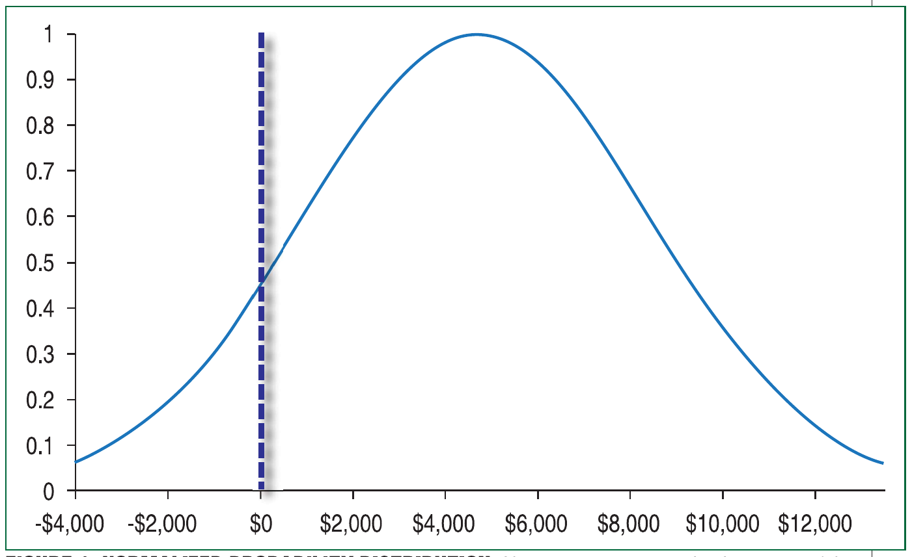
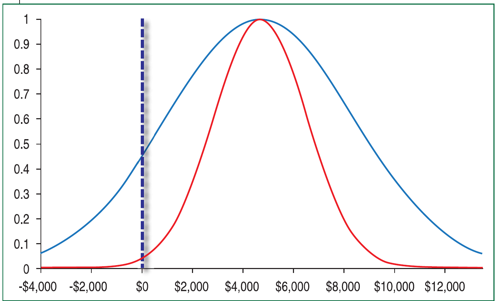

# Be Your Own Hedge Fund

- **Author:** John Ehlers and Ric Way
- **Publication:** Technical Analysis of STOCKS & COMMODITIES, Volume 35, January 2017, pp. 16--18
- **Article URL:** [Article PDF](https://technical.traders.com/archive/article.asp?file=\V35\C01\355EHLE.pdf)

---

*Think being your own hedge fund is out of reach? Maybe it's time to rethink it. It could be a lot simpler than you expected.*

A hedge fund is an aggressively managed portfolio of investments that uses advanced investment strategies with the goal of generating high returns. Though that sounds daunting, you can do this on your own. What's holding you back from trying? You are probably thinking:

- I don't have the experience to be a successful trader.
- I don't know how to formulate a trading strategy.
- I don't have the technology for an advanced investment strategy.
- I am worried about the risks of trading.
- I don't have time. Managing a fund is a full-time job.
- I don't have the capital to start a fund.
- I don't know the legality of running a hedge fund.

In this article, we'll address each of these concerns and show you that yes, you can in fact be your own hedge fund. That is to say, you can manage your own money using proven trading signals while reducing your exposure to risk.

## You Have Experience

That you are reading this proves you are almost halfway to the goal of having enough experience. You must be thoughtful, able to consider alternatives, and be willing to learn from others. Everyone has to start someplace, and the advantage of learning is that you are exposed to the experience of others. Often, education is expensive. But it doesn't have to be. You can assimilate the experience of others and learn from their mistakes.

The problem with learning from others' trading experience is that there is a wide diversity of opinion of what a successful trading style is. Your *trading style* is a selection that only you can make, depending on your preferences and comfort zone. The first biggest choice is whether you want to follow fundamental data or technical considerations. If you prefer fundamentals, your best approach to being your own hedge fund would be to find a combination of stocks and bonds that place you on the "efficient frontier" using *modern portfolio theory*. Basically, this means you have a mix of instruments using random variables that gives you the best tradeoff between risk & reward. It does not necessarily mean the strategy has the goal of generating high returns.

Since you are a reader of this magazine, you probably prefer the technical analysis approach. So let's start with that.

## Come Up With a Strategy

Within the umbrella of technical analysis, there is still a wide diversity---and often contradictory---opinion on what constitutes a successful trading strategy. But the arguments basically boil down to selecting the best combination of profit factor and percent winning trades. *Profit factor* is the ratio of gross winnings to gross losses and is analogous to the payout in gambling.

If you prefer trend trading, you will necessarily have to be in successful positions for a longer period of time. In addition, you will have to estimate when the onset of a trend has taken place. This means you must take a tentative position and then exit quickly if your estimate of trend onset is not successful. Therefore, your trading will be characterized by a relatively high profit factor due to the big winners and a relatively low percentage of winners because of taking many explorative trades.

We prefer short-term trading due to the cyclic content in the data. What's behind some of this cyclic content? In a nutshell, companies have to "make their numbers" on a monthly basis. Our experience is that the monthly cycle is measurably present in the data, and is there with sufficient regularity to give you a decided edge in your trade entries & exits. In round numbers, a month cycle consists of a 10-day move up and a 10-day move down. If you are only taking long positions, you will have an average trade duration on the order of 10 days. This means your average risk exposure is less than it would be if you were expecting the trend to be your friend. This strategy is simple: Buy on a cyclic trough and exit the trade on a cyclic peak.

## The Necessary Technology

You say you don't have the technology for an advanced investment strategy? Balderdash! The Internet is teeming with vendors vying for your attention. Even our own website, www.StockSpotter.com, fits this category of Internet-based services that provide trading signals or strategies to implement. It is your obligation to do due diligence and to assess the experience, credibility, and track record of any vendor attempting to license their trading signals to you.

## Manage Your Risks

About the only way to evaluate basic potential risk is to examine a historical trading track record. It's another example of expecting the past to be a prolog. A minimum requirement for the track record would be that it has been established long enough to cover several kinds of market conditions and should have a sufficient number of trades so the estimates of profit factor and percent winning trades are statistically significant. If there are a number of variables constituting the trading system, an old rule of thumb is that the track record should have at least 30 trades per variable. For example, a simple moving average crossover system has the length of the two moving averages as variables, and thus a minimum of 60 trades using the system should be used for the track record. This rule prevents curve-fitting by "optimization."

Since we are dealing with random variables in the market, we think the tests for risk should be far more stringent than using just a single equity curve. The variations in equity curves from test to test can be substantial, even when the system has a high profit factor and high percentage of winning trades. Risk is particularly important when you start trading because the risk of ruin is higher than after you have had a chance to build equity based on your trading results. A better way to evaluate trading risk is through the use of a Monte Carlo simulator.

Here's how a Monte Carlo simulator works: First, take all the trades in your history and create another list consisting of the profits per day for each day. Then take all of these profits per day and drop them into the proverbial hat (of course, we will be doing this process on a computer). Randomly draw the profit per day from the hat, record it, and place the profit per day back into the hat. By repeating the drawing process 260 times, you have simulated a year's worth of trading using randomly selected results. Now, repeat the annual process 5,000 or 10,000 times and you have just simulated 5,000 or 10,000 years of trading using your real track record history. That's enough random data upon which to create credible statistics on what you can expect from your trading system.

You can find an example of a Monte Carlo simulator at http://www.stockspotter.com/In/MonteCarloProfit.aspx. Figure 1 shows a normalized example of the probability distribution resulting from the Monte Carlo simulator by being fully invested in one stock at a time for a year.


**Figure 1: Normalized probability distribution** resulting from the Monte Carlo simulator by being fully invested in one stock at a time for a year.

From the *central limit theorem*, it is no surprise that the Monte Carlo simulator produces a normal probability distribution. From these statistics, you can easily estimate your expectation (the average profit you can expect) as well as the one-sigma and two-sigma points on the curve. In this case, the probability of breakeven or better is outside the lower one-sigma point, but the probability of having a loss is still uncomfortably high. But we can fix that.

It is well-known in statistics that if you double the number of independent elements in your random sampling, you reduce the variance of the distribution by the square root of two. So if you increase the number of stocks being traded simultaneously by a factor of four, you will halve the variance of the probability distribution. Figure 2 shows what happens when you trade four different stocks in parallel using random selections.


**Figure 2: An increase in the number of stocks.** If you trade four different stocks in parallel using random selections, the variance of the probability distribution is halved.

Figure 2 shows that your expectation will not increase because your total capitalization is spread across four stocks at a time instead of simply being continuously invested in one stock at a time. You can reduce the variance still more by adding more stocks. For example, if you traded eight stocks at a time, you would halve the variance again. However, reducing the variance quickly reaches a point of diminishing returns, and you are also taxing the amount of capitalization you can afford. In general, trading four stocks at a time is adequate to reduce the probability of an annual loss in a well-designed system.

## Strategy Pas de Deux

Your hedge fund strategy needs a small revision to reduce risk. That is, you want to develop four "channels" in which to trade. The trade signals and timing are completely independent in the four channels and the trade timing is unsynchronized. This is a small but crucial modification of the original strategy, because these four channels halve the variance in your returns.

## Time Is No Obstacle

It is easier to manage your hedge fund than you may think. With over 5,000 stocks and ETFs in the US markets, there are plenty of trading opportunities every day (not counting penny stocks, OTC stocks, and the like). Just grab your trading signals from the Internet every day and apply them to your four trading channels. For example, at StockSpotter we give explicit entry signals and exit signals on open positions, in advance, for exercise at the market on the open of the next trading day. All you have to do is monitor your own open positions in each of the four channels, exit a trade when you get a signal, and replace it with another buy signal on that day. You can do this in the evening and place your market orders. The whole process can be completed in less than 15 minutes per day.

## And Then There's Capital

Like any business, trading your hedge fund requires capital. Most brokerages require a minimum account balance of \$2,000 or so. At this minimum level you would be dividing your hedge fund into four \$500 channels. Frankly, that's a pretty small amount, and it leaves you with no real initial margin of error for drawdown. Since you would only be trading a few shares of many stocks with this low level of funding, commission costs can become a factor in your trading. All in all, we would recommend a minimum \$10,000 account for your "hedge fund."

## Bypass the Legal Stuff

This is the United States---you can do anything you want with your *own* money. You can trade any way you like. To be clear, what we mean when we say "be your own hedge fund" is the way you go about conducting your own trading, not accepting somebody else's money to trade. That way, you don't have to worry about the legal issues that come with managing other people's money. What we've described here is *using proven trading signals and employing diversity to reduce your risk exposure*.

## Take Ownership

The concerns you may have about trading can be addressed by treating your own money as if it were in a hedge fund with you as the fund manager. This requires establishing your own trading style, acquiring trading signals (if necessary, by lease), and applying diversity to reduce risk. This is all very doable with the technology available today.

---

*S&C Contributing Editor John Ehlers is a pioneer in the use of cycles and DSP technical analysis. He is president of MESA Software. MESASoftware.com offers the MESA Phasor and MESA intraday futures strategies. He is also the chief scientist for StockSpotter.com, which offers stock trading signals based on indicators and statistical techniques.*

*Ric Way is an independent software developer specializing in programming algorithmic trading signals in C#. He may be reached at ricway@live.com.*

---

## BibTeX

```bibtex
@article{ehlers_way_hedge_fund_2017,
  author = {Ehlers, John F. and Way, Ric},
  title = {Be Your Own Hedge Fund},
  journal = {Technical Analysis of STOCKS \& COMMODITIES},
  volume = {35},
  number = {1},
  pages = {16--18},
  year = {2017},
  month = jan,
  url = {https://technical.traders.com/archive/article.asp?file=\V35\C01\355EHLE.pdf}
}
```
