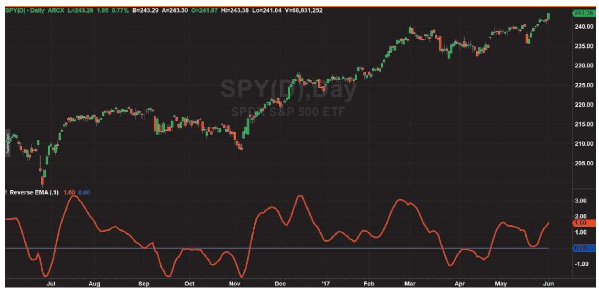

# The Reverse EMA Indicator

- **Author:** John Ehlers
- **Publication:** Technical Analysis of STOCKS & COMMODITIES, Volume 35, September 2017, pp. 8--12
- **Article URL:** [Article PDF](https://technical.traders.com/archive/article.asp?file=\V35\C09\504EHLE.pdf)
- **Traders' Tips URL:** [Traders' Tips, September 2017](https://www.traders.com/Documentation/FEEDbk_docs/2017/09/TradersTips.html)

---

*The exponential moving average is a popular indicator among technical analysts. But it has its shortcomings. Here's a look at how the indicator can be used so it results in minimum lag and provides crisper trading signals.*

The exponential moving average (EMA) is one of the cornerstones of technical analysis. It is easy to implement and has excellent smoothing qualities over a wide range of applications. The disadvantage of the EMA is that it has different group delay, or lag, across the spectrum of frequencies present in market data. This different lag causes a nonlinear relationship between frequency and phase, leading to waveform distortions. The moving average is computed from left to right across the chart, and some traders have tried to also perform the EMA from right to left, thereby canceling the nonlinear phase response and getting twice the smoothing in the process.

The problem with forward and backward EMA is that it is noncausal. In other words, you cannot actually use such a filter in real time. Trading is always performed at the right-hand edge of the chart, and waiting for data to happen so you can perform a reverse EMA is a way of cheating on real results. In short, it doesn't work for real trading.

In this article I will describe a causal forward and backward EMA indicator that can be used in real trading. This indicator provides a clean and crisp output that can be adapted to cycle, momentum, and trend activity. It has the primary attributes I think are necessary for a technical indicator. That is, it has double smoothing at the high end of the frequency spectrum to reduce aliased components, and it has a difference that mitigates the impact of spectral dilation at the low-frequency end of the spectrum.

## The EMA

An EMA is computed by multiplying the input data by a number (less than 1) and adding to it the complement of that number, multiplying the previously computed value of the EMA. In EasyLanguage code, this is written as:

$$\text{EMA} = \alpha \cdot \text{Price} + (1 - \alpha) \cdot \text{EMA}[1]$$

The two coefficients of this filter sum to unity, so the gain of the filter is 1. That is, if a constant input is applied to the filter, the quiescent filter output will have the same value. If a spike amplitude of $1/\alpha$ (an impulse) is applied to an EMA, its immediate output is a value of 1. In the next sample period there is no input, so the output value is just $(1 - \alpha)$. In the next sample period there is still no input, so the output value is $(1 - \alpha)^2$. The process continues, so the general expression for the EMA response to an impulse at the Nth sample period is $(1 - \alpha)^N$. This is one reason why it is called an *exponential* moving average---the amplitude response falls off as the exponent of the time sample from the impulse event.

With apologies to the mathematical purists, we can frame the EMA equation in terms of Z-transforms, where $Z^{-1}$ signifies one unit of delay. Doing this, the EMA equation becomes:

$$\text{Output} = \alpha \cdot \text{Input} + (1 - \alpha) \cdot \text{Output} \cdot Z^{-1}$$

Rearranging the terms, we get:

$$\text{Output} \cdot (1 - (1 - \alpha) \cdot Z^{-1}) = \alpha \cdot \text{Input}$$

The Z-transform of a filter is the ratio of the output to the input, so algebra further gives us:

$$H(Z) = \frac{\text{Output}}{\text{Input}} = \frac{\alpha}{1 - (1 - \alpha) Z^{-1}}$$

## The Reverse EMA Algorithm

I came across this algorithm in Martin Vicanek's article "A New Reverse IIR Filtering Algorithm." To understand the reverse EMA algorithm, it is best to simplify the Z-transform equation by forgetting about the $\alpha$ gain term and letting $c = (1 - \alpha)$. Doing this, the Z-transform becomes:

$$H(Z) = \frac{1}{1 - cZ}$$

If we carry out the long division of this rational equation for the Z-transform of the EMA, we get the infinitely long series:

$$H(Z) = 1 + cZ^{-1} + c^2 Z^{-2} + c^3 Z^{-3} + c^4 Z^{-4} + \ldots$$

This is an exponential decay of the filter response to an input. In addition, since $c$ has a value less than unity, the coefficients become vanishingly small after a sufficient number of terms. Therefore, we can truncate the infinite series to a finite number of terms with a quantifiable amount of error. If we truncate the series, the Z-transform now becomes the expression for a finite impulse response (FIR) filter. A simple moving average (SMA) is a special case of an FIR filter where all the coefficients are the same.

Having the Z-transform of the filter represented as a FIR, we can further factor the previous equation for an FIR filter as:

$$H(Z) = (1 + cZ^{-1})(1 + c^2 Z^{-2})(1 + c^4 Z^{-4})(1 + c^8 Z^{-8}) \ldots$$

Time reversal of the FIR filter is easy. All that need be done is to reverse the order of the impulse response and add a total delay to make the time-reversed filter causal.

The equation for such a filter is:

$$H(Z) = (c + Z^{-1})(c^2 + Z^{-2})(c^4 + Z^{-4})(c^8 + Z^{-8}) \ldots$$

This filter can be realized by successive filtering where each module filters the preceding module. Errors are sufficiently small for trading by using only eight modules.

## The Reverse EMA Indicator

A practical indicator can be created by subtracting a forward-and-reverse EMA response from a standard EMA. The basic idea is that the forward-and-reverse EMA does not contain the frequency-phase distortions, so subtracting it from a standard EMA highlights those distortions. One perspective is that it is just those distortions that comprise the indicator output.

A typical example of the filter response is shown in Figure 1. The single input parameter to the filter is the typical alpha for an EMA filter. By changing the alpha to be 0.05, the indicator will show more of the *trend* response. By changing the alpha to 0.3, the indicator will show more of the *cycle* response. The reverse EMA indicator output is similar to that of the roofing filter (discussed in my book *Cycle Analytics For Traders*) except that the roofing filter has independent control of the upper and lower band edges.

The EasyLanguage code to compute the reverse EMA indicator is given in the sidebar "EasyLanguage Code For Reverse EMA Indicator."


**Figure 1: Example of filter response.** On this daily chart of the SPY, the reverse EMA accurately reflects turning points with little lag.

## The Reality of It

The reverse EMA indicator is causal and can be used for real trading. It is virtually universal. It has a single input parameter that lets it highlight cycle, momentum, and trend components. It has minimum lag. It has high-frequency filtering that reduces the impact of aliased components of the sampled data. It has low-frequency filtering that rolls off at the rate of 6 dB per octave, thereby mitigating the effects of spectral dilation. All around, it is a crisp new indicator that should be in everyone's toolbox.

*S&C Contributing Editor John Ehlers is a pioneer in the use of cycles and DSP technical analysis. He is president of MESA Software. MESASoftware.com offers the MESA Phasor and MESA intraday futures strategies.*

*He will hold a three-day workshop in October in San Simeon, CA to offer an intimate and intense learning experience in cycles and DSP including fully disclosed trading strategies; for more information, see MESASoftware.com/#workshop.*

*The code given in this article is available in the **Article Code** section of our website, www.Traders.com.*

*See our **Traders' Tips** section beginning on page 50 for commentary and implementation of John Ehlers' technique in various technical analysis programs. Accompanying program code can be found in the Traders' Tips area at Traders.com.*

## EasyLanguage Code for Reverse EMA Indicator

```easylanguage
{
    Reverse EMA Indicator
    (C) 2017              John F. Ehlers
}

Inputs:
    AA(.1);

Vars:
    CC(0),
    EMA(0),
    RE1(0),
    RE2(0),
    RE3(0),
    RE4(0),
    RE5(0),
    RE6(0),
    RE7(0),
    RE8(0),
    Wave(0);

//Classic EMA
CC = 1 - AA;
EMA = AA*Close + CC*EMA[1];

//Compute Reverse EMA
RE1 = CC*EMA + EMA[1];
RE2 = Power(CC, 2)*RE1 + RE1[1];
RE3 = Power(CC, 4)*RE2 + RE2[1];
RE4 = Power(CC, 8)*RE3 + RE3[1];
RE5 = Power(CC, 16)*RE4 + RE4[1];
RE6 = Power(CC, 32)*RE5 + RE5[1];
RE7 = Power(CC, 64)*RE6 + RE6[1];
RE8 = Power(CC, 128)*RE7 + RE7[1];

//Indicator as difference
Wave = EMA - AA*RE8;

Plot1(Wave);
Plot2(0);
```

## Further Reading

- Ehlers, John F. [2015]. "Decyclers," *Technical Analysis of* STOCKS & COMMODITIES, Volume 33: September.
- ______ [2014]. "Predictive And Successful Indicators," *Technical Analysis of* STOCKS & COMMODITIES, Volume 32: January.
- ______ [2016]. "Measuring Market Cycles," *Technical Analysis of* STOCKS & COMMODITIES, Volume 34: September.
- ______ [2014]. "The Quotient Transform," *Technical Analysis of* STOCKS & COMMODITIES, Volume 32: August.
- ______ [2013]. *Cycle Analytics For Traders: Advanced Technical Trading Concepts*, Wiley.
- Vicanek, Martin [2015]. "A New Reverse IIR Filtering Algorithm," http://vicanek.de/articles/ReverseIIR.pdf.

---

## BibTeX

```bibtex
@article{ehlers_reverse_ema_2017,
  author = {Ehlers, John F.},
  title = {The Reverse EMA Indicator},
  journal = {Technical Analysis of STOCKS \& COMMODITIES},
  volume = {35},
  number = {9},
  pages = {8--12},
  year = {2017},
  month = sep,
  url = {https://technical.traders.com/archive/article.asp?file=\V35\C09\504EHLE.pdf}
}

@misc{traders_tips_2017_09,
  author = {{Technical Analysis of STOCKS \& COMMODITIES}},
  title = {Traders' Tips: The Reverse EMA Indicator},
  year = {2017},
  month = sep,
  howpublished = {online},
  url = {https://www.traders.com/Documentation/FEEDbk_docs/2017/09/TradersTips.html}
}
```
