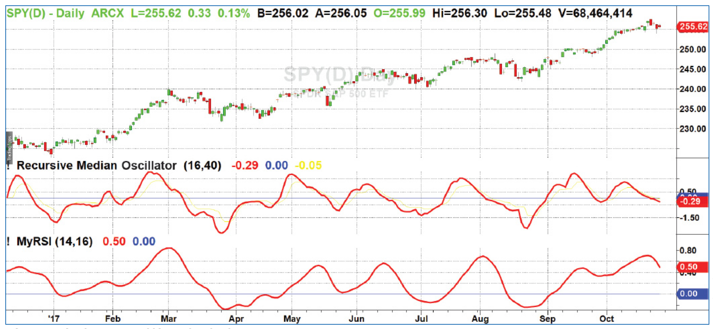

# Recursive Median Filters

- **Author:** John Ehlers
- **Publication:** Technical Analysis of STOCKS & COMMODITIES, Volume 36, March 2018, pp. 8--11
- **Article URL:** [Article PDF](https://technical.traders.com/archive/article.asp?file=\V36\C03\607EHLE.pdf)
- **Traders' Tips URL:** [Traders' Tips, March 2018](https://www.traders.com/Documentation/FEEDbk_docs/2018/03/TradersTips.html)

---

## Introduction

Median filters are best applied to remove impulsive or spiking types of noise. Rather than averaging the spike into the filter output, median filters simply ignore the spike. Median filters are routinely used for processing photographs and video because they preserve the sharp edges in the images rather than smoothing them as is done by averaging filters. Median filters have the unique characteristic of being idempotent, that is, if you repeatedly perform median filtering on a time waveform, the output rapidly converges to being exactly the input waveform except for computational lag. That a price waveform converges to a core waveform has some interesting philosophical ramifications for trading.

## How So?

Median filters are nonlinear. Since a median filter is not a convolution filter, it cannot be suitably represented in the Fourier frequency domain. Also, its output is not differentiable and therefore does not have a Taylor series expansion. This precludes curve-fitting by a higher-order polynomial.

There are many academic articles describing rather arcane algorithms for recursive median filters. The reason I consider the algorithms arcane is they exclusively study finite impulse response (FIR) types of filters. This is because the applications being considered are being implemented in hardware rather than software. "Recursive" means using a previous calculation in the current calculation.

## Applying It

An example of a recursive filter used in trading is the exponential moving average (EMA). I propose a recursive median filter for trading be implemented as the EMA of a five-bar median filter. A simple pseudocode representation of a recursive median filter is:

```
Output = a * Median(Input, 5) + (1 - a) * Output[1];
```

The EMA constant $a$ is a constant between zero and 1. I prefer to calculate it in terms of the critical period of the filter. The critical period is where shorter wavelengths are passed by the filter and longer wavelengths are rejected at the filter output. The relationship between the EMA constant and critical period is expressed by the equation:

$$
a = \frac{\cos(360\circ / \text{Period}) + \sin(360\circ / \text{Period}) - 1}{\cos(360\circ / \text{Period})}
$$

where the arguments of the trigonometric terms are in degrees.

An easier-to-remember approximation to the relationship between the EMA constant and critical period is:

$$a \approx 5 / \text{Period}$$

## More Filtering

An interesting and unique oscillator-type indicator can be created from the recursive median filter by further filtering with a second-order highpass filter. The highpass filter removes the DC (constant) values and very long wavelength components from the recursive median filter output. Using a second-order filter guarantees attenuation of the long wavelength components resulting from the statistical fractal pink-noise spectral shape of market data.

The second-order nature of the highpass filter reduces its critical period about 70% relative to the critical period of an EMA filter.

You can see the uniqueness and novelty of the recursive median oscillator when you compare it to the RSI (Figure 1). The recursive median oscillator is displayed in the first subgraph and the RSI is plotted in the second subgraph. The RSI is scaled to swing from -1 to +1 instead of the standard swing from zero to 100. The price data for Figure 1 is of the SPY for the calendar year 2017. The recursive median oscillator uses a 40-bar (two-month) critical highpass period and the RSI uses a standard 14-bar calculation. Both indicators have a smoothing filter critical period of 16 bars. From Figure 1 you can see that the recursive median oscillator has less lag and generally has faster response to the larger moves in the price data.


**Figure 1: Recursive Median Oscillator vs. RSI.** Compared to an RSI, the recursive median oscillator has less lag and a faster response to fast moves.

## Smooth and Efficient

When data contains impulsive noise or fluctuations in data, a trader needs to figure out how to smooth that data with the least amount of lag. The recursive median oscillator meets this need by filtering out outlier data, which gives a better view of the bigger picture.

## EasyLanguage Code For Recursive Median Filter

```easylanguage
{
    Recursive Median Filter
    (c) 2017 John F. Ehlers
}

Inputs:
    LPPeriod(12);

Vars:
    alpha1(0),
    RM(0);

//Set EMA constant from LPPeriod input
alpha1 = (Cosine(360 / LPPeriod) + Sine(360 / LPPeriod) - 1) / Cosine(360 / LPPeriod);

//Recursive Median (EMA of a 5 bar Median filter)
RM = alpha1*Median(Price, 5) + (1 - alpha1)*RM[1];

Plot1(RM);
```

## EasyLanguage Code For Recursive Median Oscillator

```easylanguage
{
    Recursive Median Oscillator
    (c) 2017 John F. Ehlers
}

Inputs:
    LPPeriod(12),
    HPPeriod(30);

Vars:
    alpha1(0),
    alpha2(0),
    RM(0),
    RMO(0);

//Set EMA constant from LPPeriod input
alpha1 = (Cosine(360 / LPPeriod) + Sine(360 / LPPeriod) - 1) / Cosine(360 / LPPeriod);

//Recursive Median (EMA of a 5 bar Median filter)
RM = alpha1*Median(Price, 5) + (1 - alpha1)*RM[1];

//Highpass filter cyclic components whose periods are shorter than HPPeriod to
//make an oscillator
Alpha2 = (Cosine(.707*360 / HPPeriod) + Sine(.707*360 / HPPeriod) - 1) / Cosine(.707*360 / HPPeriod);

RMO = (1 - alpha2 / 2)*(1 - alpha2 / 2)*(RM - 2*RM[1] + RM[2]) + 2*(1 - alpha2)*RMO[1] - (1 - alpha2)*(1 - alpha2)*RMO[2];

Plot1(RMO);
Plot2(0);
```

---

## Further Reading

- Ehlers, John F. [2017]. "The Reverse EMA Indicator," *Technical Analysis of Stocks & Commodities*, Volume 35: September.
- Ehlers, John F. [2016]. "The Super Passband Filter," *Technical Analysis of Stocks & Commodities*, Volume 34: July.
- Ehlers, John F. [2015]. "Whiter Is Brighter," *Technical Analysis of Stocks & Commodities*, Volume 33: January.
- Ehlers, John F. [2007]. "Fourier Transform For Traders," *Technical Analysis of Stocks & Commodities*, Volume 25: January.

---

## BibTeX

```bibtex
@article{ehlers_recursive_median_2018,
  author = {Ehlers, John F.},
  title = {Recursive Median Filters},
  journal = {Technical Analysis of STOCKS \& COMMODITIES},
  volume = {36},
  number = {3},
  pages = {8--11},
  year = {2018},
  month = mar,
  url = {https://technical.traders.com/archive/article.asp?file=\V36\C03\607EHLE.pdf}
}

@misc{traders_tips_2018_03,
  author = {{Technical Analysis of STOCKS \& COMMODITIES}},
  title = {Traders' Tips: Recursive Median Filters},
  year = {2018},
  month = mar,
  howpublished = {online},
  url = {https://www.traders.com/Documentation/FEEDbk_docs/2018/03/TradersTips.html}
}
```
