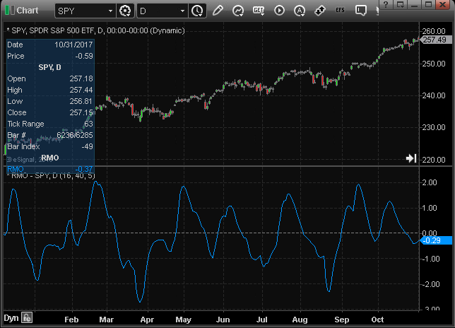
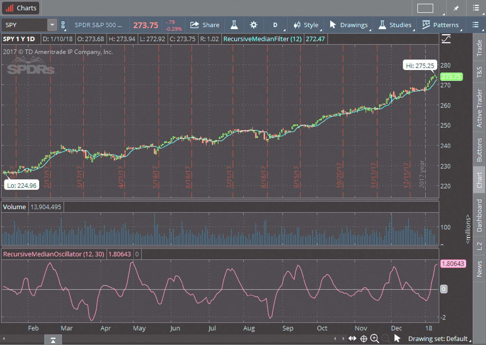
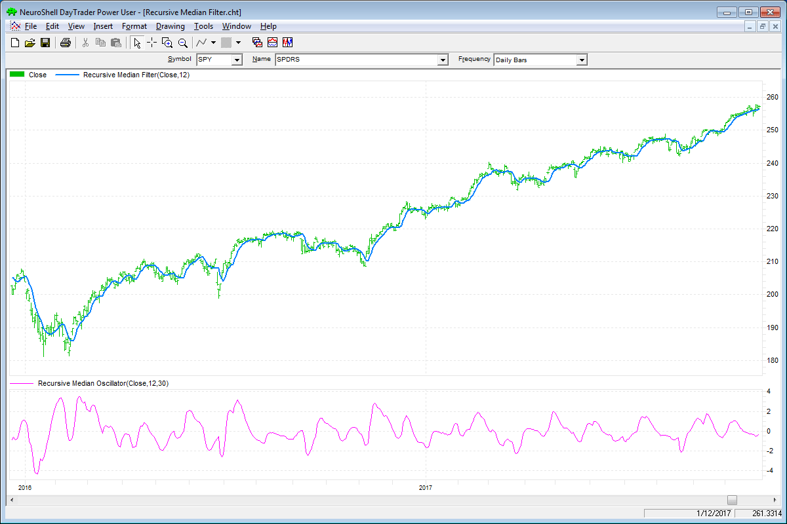
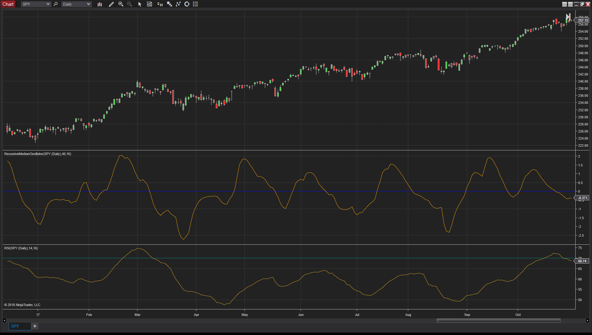
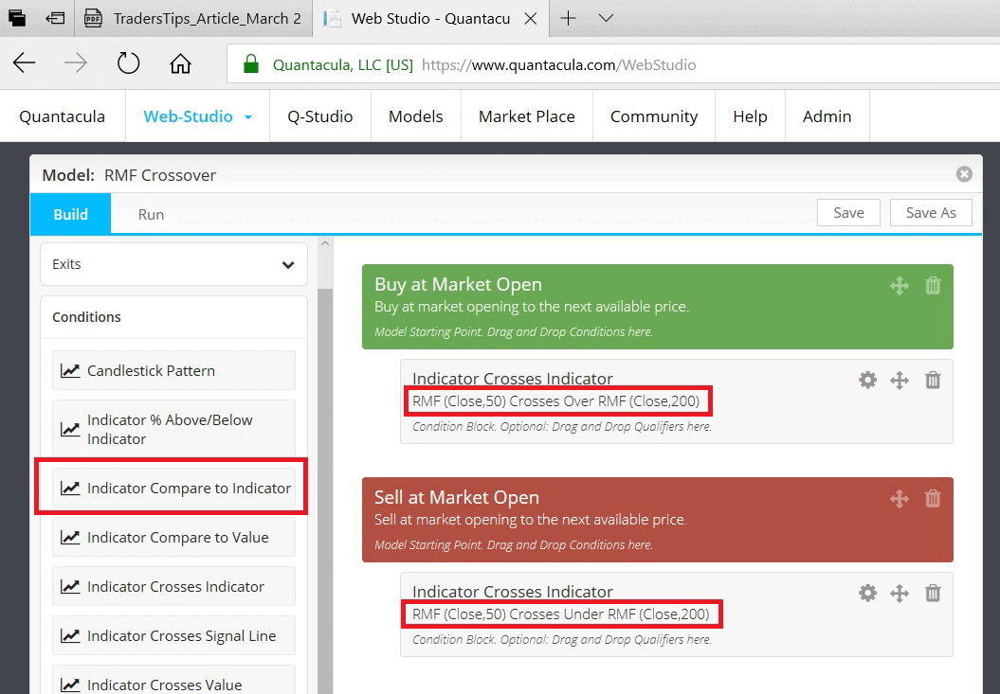
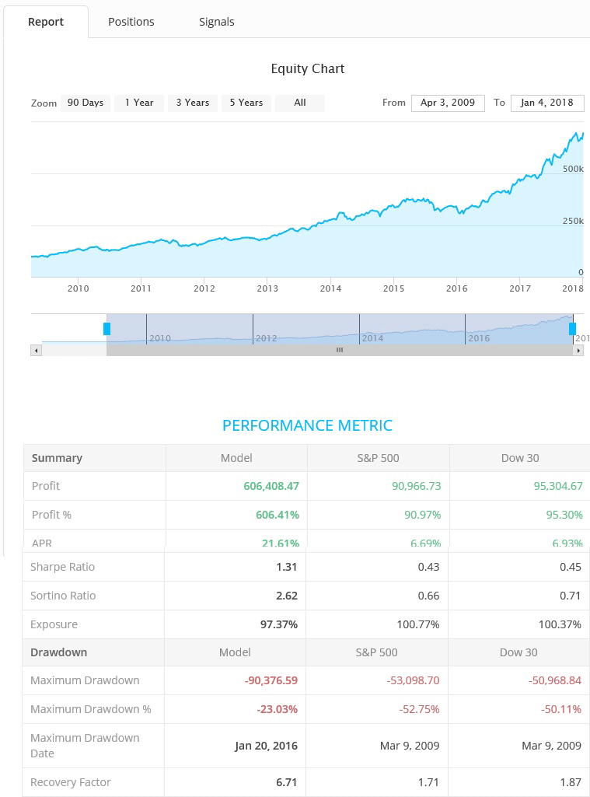
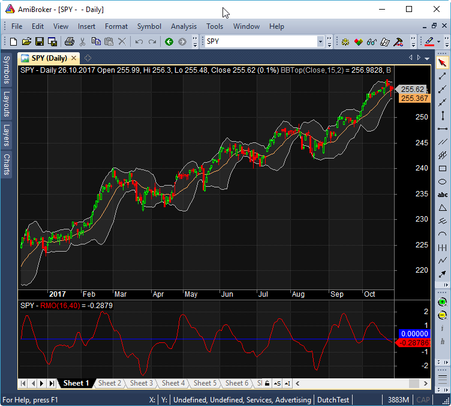
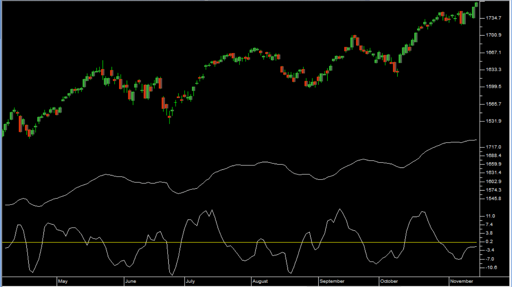
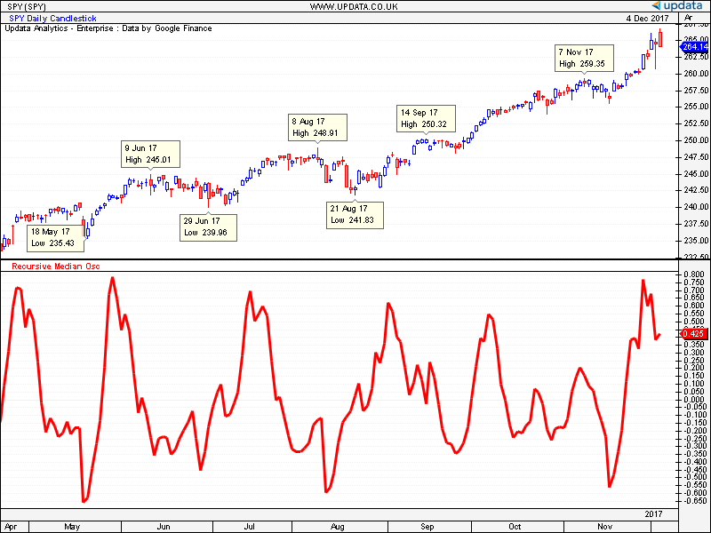

# Traders' Tips: March 2018

- **Article:** Recursive Median Filters by John Ehlers
- **Traders' Tips URL:** [Traders' Tips, March 2018](https://www.traders.com/Documentation/FEEDbk_docs/2018/03/TradersTips.html)

---

## TRADESTATION: MARCH 2018

In “Recursive Median Filters” in this issue, author John Ehlers presents an approach for filtering out extreme price and volume data that can throw off typical averaging calculations. Ehlers goes on to present a novel oscillator using this technique, comparing its response to the well-known RSI. He notes that by being able to smooth the data with the least amount of lag, the recursive median oscillator may give the trader a better view of the bigger picture.

Here, we are providing the TradeStation EasyLanguage code for the recursive median oscillator.

```easylanguage
Indicator: Recursive Median Oscillator

{
Recursive Median Oscillator
(c) 2017 John F. Ehlers
TASC March 2018
}

inputs:
	Price( Close ),
	LPPeriod( 12 ),
	HPPeriod( 30 ) ;
variables:
	Alpha1( 0 ),
	Alpha2( 0 ),
	RM( 0 ),
	RMO( 0 ) ;
	
// Set EMA constant from LPPeriod input
Alpha1 = ( Cosine( 360 / LPPeriod ) 
	+ Sine( 360 / LPPeriod ) - 1 ) 
	/ Cosine( 360 / LPPeriod ) ;

// Recursive Median (EMA of a 5 
// bar Median filter)
RM = Alpha1 * Median( Price, 5 ) 
	+ ( 1 - Alpha1 ) * RM[1] ;

// Highpass filter cyclic components 
// whose periods are shorter than 
// HPPeriod to make an oscillator

Alpha2 = ( Cosine( .707 * 360 / HPPeriod ) 
	+ Sine( .707 * 360 / HPPeriod ) - 1 ) 
	/ Cosine( .707 * 360 / HPPeriod ) ;

RMO = ( 1 - Alpha2 / 2 ) * ( 1 - Alpha2 / 2 ) 
	* ( RM - 2 * RM[1] + RM[2] ) 
	+ 2 * ( 1 - Alpha2 ) * RMO[1] 
	- ( 1 - Alpha2 ) * ( 1 - Alpha2 ) * RMO[2] ;

Plot1( RMO, "RMO" ) ;
Plot2( 0, "ZeroLine" );

```

To download the EasyLanguage code, please visit our TradeStation and EasyLanguage support forum. The files based on this article can be found here: [https://community.tradestation.com/Discussions/Topic.aspx?Topic_ID=142776](https://community.tradestation.com/Discussions/Topic.aspx?Topic_ID=142776). The filename is “TASC_MAR2018.ZIP.”

For more information about EasyLanguage in general, please see [https://www.tradestation.com/EL-FAQ](https://www.tradestation.com/EL-FAQ).

A sample chart is shown in Figure 1.

**FIGURE 1: TRADESTATION. This shows a daily chart of SPY with the recursive median oscillator applied.**

*This article is for informational purposes. No type of trading or investment recommendation, advice, or strategy is being made, given, or in any manner provided by TradeStation Securities or its affiliates.*

—Doug McCrary

TradeStation Securities, Inc.

[www.TradeStation.com](https://www.tradestation.com/)

[BACK TO LIST](https://www.traders.com/Documentation/FEEDbk_docs/2018/03/TradersTips.html#)

---

## eSIGNAL: MARCH 2018

For this month’s Traders’ Tip, we’ve provided the study [RecursiveMedianOscillator.efs](https://www.traders.com/Documentation/FEEDbk_docs/2018/03/images/code/RecursiveMedianOscillator.efs) based on the article by John Ehlers in this issue, “Recursive Median Filters.” The study is designed to filter out extreme price or volume data spikes.

The study contains formula parameters that may be configured through the *edit chart* window (right-click on the chart and select “edit chart”). A sample chart is shown in Figure 2.


**FIGURE 2: eSIGNAL. Here is an example of the RecursiveMedianOscillator study plotted on a daily chart of SPY.**

To discuss this study or download a complete copy of the formula code, please visit the EFS Library Discussion Board forum under the *forums* link from the support menu at [www.esignal.com](https://www.esignal.com/) or visit our EFS KnowledgeBase at [www.esignal.com/support/kb/efs/](https://www.esignal.com/support/kb/efs/). The eSignal formula script (EFS) is also available for copying & pasting below.

```javascript
/*********************************
Provided By:  
eSignal (Copyright c eSignal), a division of Interactive Data 
Corporation. 2016. All rights reserved. This sample eSignal 
Formula Script (EFS) is for educational purposes only and may be 
modified and saved under a new file name.  eSignal is not responsible
for the functionality once modified.  eSignal reserves the right 
to modify and overwrite this EFS file with each new release.

Description:        
    Recursive Median Filters by John F. Ehlers

Version:            1.00  01/10/2018

Formula Parameters:                     Default:
LPPeriod                                12
HPPeriod                                30
MedPeriod                               5


Notes:
The related article is copyrighted material. If you are not a subscriber
of Stocks & Commodities, please visit www.traders.com.

**********************************/

var fpArray = new Array();

function preMain(){
    setPriceStudy(false);
    setStudyTitle("RMO");
    
    var x = 0;
    fpArray[x] = new FunctionParameter("LPPeriod", FunctionParameter.NUMBER);
	with(fpArray[x++]){
        setLowerLimit(1);
        setDefault(12);
    }
    fpArray[x] = new FunctionParameter("HPPeriod", FunctionParameter.NUMBER);
	with(fpArray[x++]){
        setLowerLimit(1);
        setDefault(30);
    }
    fpArray[x] = new FunctionParameter("MedPeriod", FunctionParameter.NUMBER);
	with(fpArray[x++]){
        setLowerLimit(1);
        setDefault(5);
    }
}

var bInit = false;
var bVersion = null;
var xRM = null;
var xRMO = null;


function main(LPPeriod, HPPeriod, MedPeriod){
    if (bVersion == null) bVersion = verify();
    if (bVersion == false) return;
    
    if (getCurrentBarCount() <= HPPeriod + LPPeriod) return;

    if (getBarState() == BARSTATE_ALLBARS){
        bInit = false;
    }
    
    if (!bInit){
        var alpha1 = (Math.cos(Math.PI / 180 * (360 / LPPeriod)) 
                    + Math.sin(Math.PI / 180 * (360 / LPPeriod)) - 1) 
                    / Math.cos(Math.PI / 180 * (360 / LPPeriod));
        var alpha2 = (Math.cos(Math.PI / 180 * (0.707 * 360 / HPPeriod)) 
                    + Math.sin(Math.PI / 180 * (0.707 * 360 / HPPeriod)) - 1) 
                    / Math.cos(Math.PI / 180 * (0.707 * 360 / HPPeriod));
        xRM = efsInternal("calc_RM", close(), MedPeriod, alpha1);
        xRMO = efsInternal("calc_RMO", xRM, alpha2);
        addBand(0, PS_DASH, 1, Color.grey, 1);
        bInit = true;
    }

    if (xRMO.getValue(0) != null) return xRMO.getValue(0);

}

function calc_RM(xClose, MedPeriod, alpha1){
    var nRM = 0;
    var nRM_1 = ref(-1) == null ? 0 : ref(-1);
    var aMedian = new Array(MedPeriod);
        
    for (var i = 0; i < MedPeriod; i++){
        aMedian[i] = xClose.getValue(-i);
    }
    aMedian.sort(_ASC);

    var nMedianPrice = (MedPeriod % 2 > 0) ? aMedian[Math.ceil(MedPeriod / 2) - 1] 
                                           : (aMedian[(MedPeriod / 2 - 1)] + aMedian[(MedPeriod / 2 )]) / 2

    nRM = alpha1 * nMedianPrice + (1 - alpha1) * nRM_1;
    return nRM;
}

function calc_RMO(xRM, alpha2){
    var nRM = xRM.getValue(0);
    var nRM_1 = xRM.getValue(-1);
    var nRM_2 = xRM.getValue(-2);
    
    if (nRM_2 == null) return;
    
    var nRMO = 0;
    var nRMO_1 = ref(-1) == null ? 0 : ref(-1);
    var nRMO_2 = ref(-2) == null ? 0 : ref(-2);
    
    nRMO = (1 - alpha2 / 2) * (1 - alpha2 /2) * (nRM - 2 * nRM_1 + nRM_2) 
            + 2 * (1 - alpha2) * nRMO_1 - (1 - alpha2) * (1 - alpha2) * nRMO_2;
    return nRMO;
}

function _ASC(a, b){
    return (a - b);
}

function verify(){
    var b = false;
    if (getBuildNumber() < 779){
        
        drawTextAbsolute(5, 35, "This study requires version 10.6 or later.", 
            Color.white, Color.blue, Text.RELATIVETOBOTTOM|Text.RELATIVETOLEFT|Text.BOLD|Text.LEFT,
            null, 13, "error");
        drawTextAbsolute(5, 20, "Click HERE to upgrade.@URL=https://www.esignal.com/download/default.asp", 
            Color.white, Color.blue, Text.RELATIVETOBOTTOM|Text.RELATIVETOLEFT|Text.BOLD|Text.LEFT,
            null, 13, "upgrade");
        return b;
    } 
    else
        b = true;
    
    return b;
}

```

—Eric Lippert

eSignal, an Interactive Data company

800 779-6555, [www.eSignal.com](https://www.esignal.com/)

[BACK TO LIST](https://www.traders.com/Documentation/FEEDbk_docs/2018/03/TradersTips.html#)


**Download:** [RecursiveMedianOscillator.efs](code/RecursiveMedianOscillator.efs)

---

## THINKORSWIM: MARCH 2018

thinkorswim has prepared our implementation of the recursive median filter studies that are featured in John Ehlers’ article in this issue, “Recursive Median Filters.”

We built these two studies using our proprietary scripting language, *thinkscript*. We have made the loading process extremely easy; simply click on the following links: [https://tos.mx/PwwT66](https://tos.mx/PwwT66) and [https://tos.mx/fIdM6z](https://tos.mx/fIdM6z), then choose to *view thinkScript study*, and name the studies “RecursiveMeanFilter” and “RecursiveMeanFilterOscillator.”

The image shown in Figure 3 is of the RecursiveMeanFilter as well as the RecursiveMedianOscillator plotted on a one-year daily chart of SPY (S&P 500 ETF). For details on how to interpret these studies, please refer to Ehlers’ article.


**FIGURE 3: THINKORSWIM. Here is an example of the RecursiveMeanFilter and RecursiveMedianOscillator studies plotted on a daily chart of SPY.**

—thinkorswim

A division of TD Ameritrade, Inc.

[www.thinkorswim.com](https://www.thinkorswim.com/)

[BACK TO LIST](https://www.traders.com/Documentation/FEEDbk_docs/2018/03/TradersTips.html#)

---

## NEUROSHELL TRADER: MARCH 2018

John Ehlers’ recursive median filter and oscillator indicators described in his article in this issue (“Recursive Median Filters”) can be easily implemented in NeuroShell Trader using NeuroShell Trader’s ability to call external dynamic linked libraries. Dynamic linked libraries can be written in C, C++, or Power Basic.

After moving the EasyLanguage code given in Ehlers’ article to your preferred compiler and creating a DLL, you can insert the resulting indicators as follows:

Select “new indicator” from the insert menu.
Choose the external program & library calls category.
Select the appropriate external DLL call indicator.
Setup the parameters to match your DLL.
Select the finished button.

Similar filter and cycle-based indicators can also be created using indicators found in John Ehlers’ Cybernetic and MESA91 NeuroShell Trader Add-ons to the NeuroShell Trader program.

Users of  NeuroShell Trader can go to the Stocks & Commodities section of the NeuroShell Trader free technical support website to download a copy of this or any previous Traders’ Tips.

A sample chart is shown in Figure 4.


**FIGURE 4: NEUROSHELL TRADER. This sample NeuroShell Trader chart displays the recursive median filter and recursive median oscillator.**

—Marge Sherald, Ward Systems Group, Inc.

301 662-7950, [sales@wardsystems.com](mailto:sales@wardsystems.com)

[www.neuroshell.com](https://www.neuroshell.com/)

[BACK TO LIST](https://www.traders.com/Documentation/FEEDbk_docs/2018/03/TradersTips.html#)

---

## WEALTH-LAB: MARCH 2018

**FIGURE 5: WEALTH-LAB. The recursive median oscillator is applied to a daily chart of the SPY (SPDR S&P 500 ETF).**

After updating the TASCIndicators library to v2018.02 (or higher), the RMF and RMO indicators can be found under the TASC Magazine Indicators group. You can plot them on the chart or use them as an entry or exit condition in a rule-based strategy, all without having to program any code yourself.

The C# strategy code provided here will help you plot the indicators on a chart.

```csharp
using System;
using System.Collections.Generic;
using System.Text;
using System.Drawing;
using WealthLab;
using WealthLab.Indicators;
using TASCIndicators;

namespace WealthLab.Strategies
{
	public class TASC201803: WealthScript
	{
		private StrategyParameter slider1;
		private StrategyParameter slider2;
		private StrategyParameter slider3;
		private StrategyParameter slider4;
		private StrategyParameter slider5;

		public TASC201803()
		{
			slider1 = CreateParameter("RMO LPPeriod",16,2,300,20);
			slider2 = CreateParameter("RMO HPPeriod",40,2,300,20);
			slider3 = CreateParameter("RMO Median",5,2,300,20);
			
			slider4 = CreateParameter("RSI Period",14,2,200,20);
			slider5 = CreateParameter("EMA(RSI) Period",16,2,200,20);
		}
		
		protected override void Execute()
		{
			var rmf = RMF.Series( Close, slider1.ValueInt,slider3.ValueInt);
			var rmo = RMO.Series( Close, slider1.ValueInt,slider2.ValueInt,slider3.ValueInt);
			var rsi = EMA.Series(RSI.Series( Close, slider4.ValueInt),slider5.ValueInt,EMACalculation.Modern) / 100d;

			ChartPane paneRSI = CreatePane( 30,false,true);
			ChartPane paneRMO = CreatePane( 30,false,true);
			HideVolume();
			PlotSeries( paneRSI,rsi,Color.Blue,LineStyle.Solid,2);
			PlotSeries( paneRMO,rmo,Color.Red,LineStyle.Solid,2);
			PlotSeries( PricePane, rmf,Color.Black,LineStyle.Solid,2);
		}
	}
}

```

—Eugene (Gene Geren), Wealth-Lab team

MS123, LLC

[www.wealth-lab.com](https://www.wealth-lab.com/)

[BACK TO LIST](https://www.traders.com/Documentation/FEEDbk_docs/2018/03/TradersTips.html#)

---

## NINJATRADER: MARCH 2018

In “Recursive Median Filters” in this issue, author John Ehlers discusses the recursive median filter and recursive median oscillator. We are making available for download the RecursiveMedianFilter and RecursiveMedianOscillator indicators at the following links for NinjaTrader 8 and for NinjaTrader 7:

NinjaTrader 8: www.ninjatrader.com/SC/March2018SCNT8.zip
NinjaTrader 7: www.ninjatrader.com/SC/March2018SCNT7.zip

Once the file is downloaded, you can import the indicator into NinjaTader 8 from within the control center by selecting Tools → Import → NinjaScript Add-On and then selecting the downloaded file for NinjaTrader 8. To import into NinjaTrader 7, from within the control center window, select the menu File → Utilities → Import NinjaScript and select the downloaded file.

You can review the indicators’ source code in NinjaTrader 8 by selecting the menu New → NinjaScript Editor → Indicators from within the control center window and selecting the RecursiveMedianFilter and RecursiveMedianOscillator files. You can review the indicators’ source code in NinjaTrader 7 by selecting the menu Tools → Edit NinjaScript → Indicator from within the control center window and selecting the RecursiveMedianFilter and RecursiveMedianOscillator files.

NinjaScript uses compiled DLLs that run native, not interpreted. to provide with the highest performance possible.

A sample chart with the oscillator is shown in Figure 6.


**FIGURE 6: NINJATRADER. The RecursiveMedianOscillator is displayed along with the RSI on a daily chart of the SPY for 2017, showing the faster response to fast movement over the RSI.**

—Raymond Deux & Jim Dooms

NinjaTrader, LLC

[www.ninjatrader.com](https://www.ninjatrader.com/)

[BACK TO LIST](https://www.traders.com/Documentation/FEEDbk_docs/2018/03/TradersTips.html#)


**Code files:**

- [RecursiveMedianFilter.cs](ninja-trader/RecursiveMedianFilter.cs)
- [RecursiveMedianOscillator.cs](ninja-trader/RecursiveMedianOscillator.cs)

---

## QUANTACULA: MARCH 2018

In “Recursive Median Filters” in this issue, author John Ehlers introduces two indicators: the recursive median filter (RMF) and the recursive median oscillator (RMO).

RMF uses an exponential moving average of the five-period median of the source data to produce a smoothing of the signal while avoiding spikes. The RMO is an oscillator built along the same principles.

We’ve included both indicators at Quantacula.com in our free *Stocks & Commodities Extensions* package that you can obtain by following the *MarketPlace* link on [www.quantacula.com](https://www.quantacula.com/).

Once you acquire the extension, you can use the RMF and RMO indicators for models that you build on Quantacula.com, or in our Quantacula Studio desktop product. In Figure 7, we’ve mocked up a simple crossover model using a fast (50-period) RMF and a slow (200-period) RMF. The model was created using Web Studio at www.quantacula.com.


**FIGURE 7: Quantacula, DRAG-AND-DROOP BUILDING BLOCKS. Here is an example RMF trading model built using drag-and-drop building blocks onwww.quantacula.com.**

We backtested this model (Figure 8) on the Nasdaq 100 stocks using our Q-Premium data. This data contains the historical symbols of the Nasdaq 100, even for companies that have been delisted. It intelligently responds to historical changes to the index over time, producing an accurate backtest result, free of survivorship bias. We chose a starting capital of $100,000 with 1.1 margin, and 5% of equity per position.


**FIGURE 8: Quantacula, BACKTEST REPORT. Here is a sample backtest report for an RMF crossover model run against the Nasdaq 100 stocks.**

Over a 10-year period, the model returned an annualized percentage return (APR) of 21.61%, compared to 6.69% annualized for the S&P 500 benchmark for the same period. Furthermore, the trend-following nature of this crossover model reduced drawdown. The model experienced a maximum drawdown of 23.03%, while the benchmark experienced a maximum drawdown of 52.75%.

—Dion Kurczek, Quantacula LLC

[info@quantacula.com](mailto:info@quantacula.com)

[www.quantacula.com](https://www.quantacula.com/)

[BACK TO LIST](https://www.traders.com/Documentation/FEEDbk_docs/2018/03/TradersTips.html#)

---

## AMIBROKER: MARCH 2018

In “Recursive Median Filters” in this issue, author John Ehlers presents a very nice oscillator based on a median filter. The AmiBroker code listing shown here provides a ready-to-use formula to implement the oscillator. To adjust the parameters, right-click on the chart and select *parameters* from the context menu.

```c
// Recursive Median Oscillator 
Version( 6.0 ); 

LPPeriod = Param("LPPeriod", 12 ); 
HPPeriod = Param("HPPeriod", 30 ); 

PI = 3.1415926; 

angle = 2 * PI / LPPeriod; 
alpha1 = ( cos( angle ) + sin( angle ) - 1 )/cos( angle ); 

mp = Median( Close, 5 ); 

rm = AMA( mp, alpha1 ); 

angle2 = 0.707 * 2 * PI / HPPeriod; 
alpha2 = ( cos( angle2 ) + sin( angle2 ) - 1 ) / cos( angle2 ); 

b0 = ( 1 - alpha2 / 2 ) * ( 1 - alpha2 / 2 ); 
b1 = - 2 * b0; 
b2 = b0; 
a1 = 2 * ( 1 - alpha2 ); 
a2 = - ( 1 - alpha2 ) * ( 1 - alpha2 ); 

// recursive second order filter 
RMO = IIR( rm, b0, a1, b1, a2, b2 ); 

Plot( RMO, "RMO" + _PARAM_VALUES(), colorRed ); 
Plot( 0, "", colorBlue );

```

A sample chart implementing the formula is shown in Figure 9.


**FIGURE 9: AMIBROKER. Shown here is a daily chart of the S&P 500 in the upper pane, with the recursive median oscillator in the lower pane, replicating the chart from John Ehlers’ article in this issue.**

—Tomasz Janeczko, AmiBroker.com

[www.amibroker.com](https://www.amibroker.com/)

[BACK TO LIST](https://www.traders.com/Documentation/FEEDbk_docs/2018/03/TradersTips.html#)

---

## TRADERSSTUDIO: MARCH 2018

The TradersStudio code based on John Ehlers’ article in this issue, “Recursive Median Filters,” is provided at [www.TradersEdgeSystems.com/traderstips.htm](https://www.tradersedgesystems.com/traderstips.htm) as well as below.

Figure 10 shows the recursive median (RM) and recursive median oscillator (RMO) indicators on a chart of the S&P 500 futures contract (SP) during part of 2013.


**FIGURE 10: TRADERSSTUDIO. Here, the RM (recursive median) and RMO (recursive median oscillator) indicators are shown on a chart of the S&P 500 futures contract (SP) during 2013.**

The TradersStudio code is shown here:

```basic
'Recursive Median Filters
'Author: John Ehlers, TASC March 2018
'Coded by: Richard Denning, 1/11/2018
'www.TradersEdgeSystems.com

Function EHLERS_RM(Price As BarArray,LPPeriod)
    Dim alpha1
    Dim n
    Dim RM As BarArray
    Dim MP As Array
    ReDim(MP,5)
    
    If BarNumber=FirstBar Then
        'Price = C
        'LPPeriod = 12
        alpha1 = 0
        RM = 0
    End If

    'Set EMA constant from LPPeriod input
    alpha1 = (Cos(DegToRad(360/LPPeriod))+Sin(DegToRad(360/LPPeriod))-1)/Cos(DegToRad(360/LPPeriod))
    
    'Recursive Median
    'EMA Of 5 bar Median filter
    For n=0 To 4
        MP[n]=Price[n]
    Next
    RM = alpha1*Median(MP) + (1-alpha1)*RM[1]
EHLERS_RM = RM
End Function
'----------------------------------------------
'Indicator plot for RM function
Sub EHLERS_RM_IND(LPPeriod)
     plot1(EHLERS_RM(C,LPPeriod))
End Sub
'-----------------------------------------------
Function EHLERS_RMO(Price As BarArray,LPPeriod,HPPeriod)
    Dim alpha2
    Dim RM As BarArray
    Dim RMO As BarArray
    
    If BarNumber=FirstBar Then
        'Price = C
        'LPPeriod = 12
        'HPPeriod = 30
        alpha2 = 0
        RM = 0
        RMO = 0
    End If
    
    'Get recursive median fllter
    RM = EHLERS_RM(Price,LPPeriod)
    
    'Highpass filter cyclic components whose periods are shorter than HPPeriod to make an oscillator
    alpha2 = (Cos(DegToRad(.707*360/HPPeriod))+Sin(DegToRad(.707*360/HPPeriod)-1))/Cos(DegToRad(.707*360/HPPeriod))
    RMO = (1-alpha2/2)*(1-alpha2/2)*(RM-2*RM[1]+RM[2])+2*(1-alpha2)*RMO[1]-(1-alpha2)*(1-alpha2)*RMO[2]
EHLERS_RMO = RMO 
End Function
'-----------------------------------------------
Sub EHLERS_RMO_IND(LPPeriod,HPPeriod)
    plot1(EHLERS_RMO(C,LPPeriod,HPPeriod))
    plot2(0)
End Sub
'-----------------------------------------------

```

—Richard Denning

[info@TradersEdgeSystems.com](mailto:info@TradersEdgeSystems.com)

for TradersStudio

[BACK TO LIST](https://www.traders.com/Documentation/FEEDbk_docs/2018/03/TradersTips.html#)

---

## UPDATA: MARCH 2018

Our Traders’ Tip this month is based on the article “Recursive Median Filters” in this issue by John Ehlers.

The author’s line in digital signal processing extends to removing extreme spikes in financial data, but utilizing the median average value in the recursive filter calculations. By removing these extremities, the actual extremities that occur in the underlying data may be better determined. Two sets of code based on this premise are provided by the author in his article, one for a median filter and one for an oscillator.

The Updata code based on this article is now in the Updata library and may be downloaded by clicking the *custom* menu and *indicator library*. Those who cannot access the library due to a firewall may paste the code shown here into the Updata custom editor and save it.

```text
Median Filter
PARAMETER "Period" #PERIOD=12  
NAME "Recursive Median Filter" "" 
@ALPHA=0
@RM=0 
FOR #CURDATE=0 TO #LASTDATE
    @ALPHA=(-1+COS(2*CONST_PI/12)+SIN(2*CONST_PI/12))/COS(2*CONST_PI/12)
    @RM=@ALPHA*0.5*(PHIGH(Close,5)+PLOW(Close,5))+(1-@ALPHA)*@RM
    @PLOT=@RM   
NEXT

'Recursive Median Osc
PARAMETER "Period" #PERIOD=12 
NAME "Recursive Median Osc" "" 
@ALPHA=0 
@ALPHA2=0
@RM=0
@RMO=0 
FOR #CURDATE=0 TO #LASTDATE
    @ALPHA=(-1+COS(2*CONST_PI/12)+SIN(2*CONST_PI/12))/COS(2*CONST_PI/12)
    @RM=@ALPHA*0.5*(PHIGH(Close,5)+PLOW(Close,5))+(1-@ALPHA)*@RM
    @ALPHA2=(-1+COS(0.707*2*CONST_PI/12)+SIN(0.707*2*CONST_PI/12))/COS(0.707*2*CONST_PI/12) 
    @RMO=(1-@ALPHA2/2)*(1-@ALPHA2/2)*(@RM-2*HIST(@RM,1)+HIST(@RM,2))+2*(1-@ALPHA2)*HIST(@RMO,1)-EXPBASE(1-@ALPHA2,2)*HIST(@RMO,2)
    @PLOT=@RMO   
NEXT

```


**FIGURE 11: UPDATA. Here, the daily recursive median filter is applied to the daily SPY.**

—Updata support team

[support@updata.co.uk](mailto:support@updata.co.uk)

[www.updata.co.uk](https://www.updata.co.uk/)

[BACK TO LIST](https://www.traders.com/Documentation/FEEDbk_docs/2018/03/TradersTips.html#)

---

## MICROSOFT EXCEL: MARCH 2018

John Ehlers’ article in this issue, “Recursive Median Filters,” demonstrates the unique capabilities of recursive median filters.

In Figure 12, I defined the recursive median filter as Ehlers defines it in his article, and I’ve plotted it on a price chart. You can see its smooth tracking and minimal jitter.

**FIGURE 12: EXCEL. This sample chart shows the recursive median filter plotted on price. The subcharts are plots of the recursive median oscillator and an unfiltered RSI.**

Subchart 2 in Figure 12 is the oscillator Ehlers discusses in his article that is derived from the recursive median filter. Subchart 3 shows an unfiltered RSI.

Right-click on the Excel file link, then
Select “save as” (or “save target as”) to place a copy of the spreadsheet file on your hard drive.

[A fix for previous Excel spreadsheets, required due to Yahoo modifications, can be found here: https://traders.com/files/Tips-ExcelFix.html](https://traders.com/files/Tips-ExcelFix.html)

—Ron McAllister

Excel and VBA programmer

[rpmac_xltt@sprynet.com](mailto:rpmac_xltt@sprynet.com)

[BACK TO LIST](https://www.traders.com/Documentation/FEEDbk_docs/2018/03/TradersTips.html#)

Originally published in the March 2018 issue of

*Technical Analysis of* STOCKS & COMMODITIES magazine. 

  All rights reserved. © Copyright 2018, Technical Analysis, Inc.


**Download:** [RecursiveMedianFilters.xlsm](code/RecursiveMedianFilters.xlsm)

---

## BibTeX

```bibtex
@misc{traders_tips_2018_03,
  author = {{Technical Analysis of STOCKS \& COMMODITIES}},
  title = {Traders' Tips: Recursive Median Filters},
  year = {2018},
  month = mar,
  howpublished = {online},
  url = {https://www.traders.com/Documentation/FEEDbk_docs/2018/03/TradersTips.html}
}
```