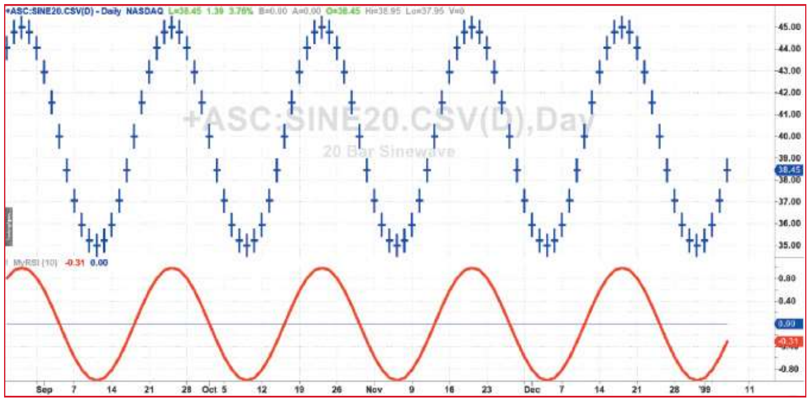
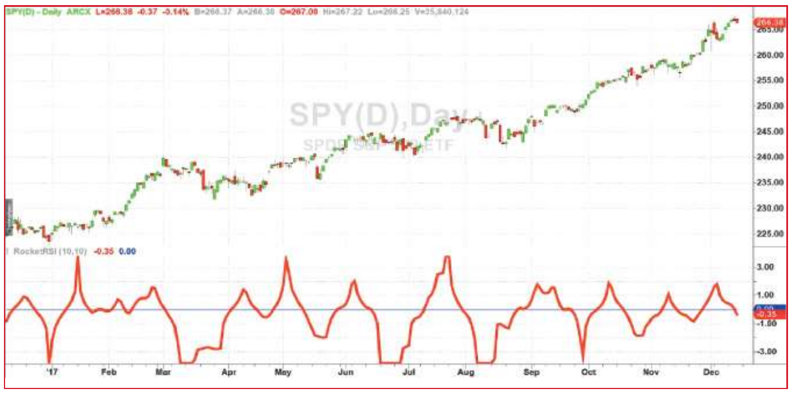

# RocketRSI — A Solid Propellant For Your Rocket Science Trading

**John F. Ehlers**
*Technical Analysis of Stocks & Commodities*, Volume 36, May 2018, pp. 8–12

- **Article URL:** <https://technical.traders.com/archive/article.asp?file=\V36\C05\207EHLE.pdf>
- **Traders' Tips URL:** <https://www.traders.com/Documentation/FEEDbk_docs/2018/05/TradersTips.html>

---

Wouldn't it be great to know that there's a strong chance a cyclic reversal will take place? How many indicators can identify this event? The RSI is a favorite indicator among technical analysts. Make it a tad bit more flexible and it may help you find those high-probability reversal points.

Welles Wilder's original description of the relative strength index (RSI) in his 1978 book *New Concepts In Technical Trading Systems* specified a calculation length of 14 days. That requirement started me on a 40-year quest to find the correct length of data for the computation of indicators and trading strategy rules. Many technicians have addressed the RSI and described its applications. In this article I will derive a formulation that has more flexibility and ease of interpretation. I will also extrapolate the algorithm to accurately address a statistical approach to technical analysis.

## Start with the RSI

Here is the original definition of the RSI indicator:

$$RSI = 100 - \frac{100}{1 + RS}$$

where $RS$ = Average gain of up periods during the specified timeframe / Average loss of down periods during the specified timeframe.

My first observation is that the factor of 100 is irrelevant. Second, the averages are not required because we are taking the ratio of closes up (CU) to closes down (CD) and the averages drop out if we simply independently accumulate the gains and losses. Therefore, I will simply accumulate CU and CD. I can then write the equation for RSI as:

$$RSI = 1 - \frac{1}{1 + \frac{CU}{CD}}$$

Using a little algebra to put everything on the right-hand side of the equation over a common denominator, the indicator equation becomes:

$$RSI = \frac{CU}{CU + CD}$$

In this formulation, RSI has a value of zero if the accumulation of CU is zero and has a value of 1 if the accumulation of CD is zero. If you reduce the price movement to its primitive as a sine wave, then it is easy to see that this RSI has only CU going from the valley to the peak and only has CD going from peak to valley. This RSI traces out the shape of the sine wave between these two limits. However, a sine wave swings between −1 and +1 rather than between 0 and +1. We can cause the RSI to also have the same swing limits as the sine wave if we multiply the equation above by 2 and then subtract 1 from the product as:

$$RSI = \frac{2 \cdot CU}{CU + CD} - 1$$

Again, using a little algebra to put the right-hand side of the equation over a common denominator, the equation evolves to:

$$MyRSI = \frac{CU - CD}{CU + CD}$$

## Apply it

If we apply MyRSI to prices having a 20-bar sine wave shape, we see that it traces out the price shape with no lag and full amplitude if we use a calculation period that is half the 20-bar period of the waveform. In other words, the correct calculation period to use to compute MyRSI is exactly half the dominant cycle in the price data. Doing this, the MyRSI indicator will have zero lag, as shown in Figure 1. Eureka! This is the correct length of data to be used to calculate the RSI.


**Figure 1: No lag.** When using the correct parameter length, MyRSI indicator traces input data with no lag.

However, the basic MyRSI indicator is too "nervous" for the taste of most technicians when using real-world noisy data, and therefore calls for some smoothing. There is an option to smooth the waveform of the indicator output or to smooth the data that is input to the indicator. Since MyRSI is a nonlinear process, the two different smoothing approaches result in different indicator shapes, but the zero crossings remain the same for equivalent smoothing. I prefer to smooth the data input to the indicator because that allows the indicator output to make the full swing between −1 and +1. Smoothing the output waveform averages the output that, itself, can never exceed +1 or −1. Therefore, the smoothed signal seldom makes the full swing. This difference of achieving full swing is important when we examine the statistical nature of the indicator.

The EasyLanguage code shown in the sidebar "MyRSI Indicator EasyLanguage Code" uses my SuperSmoother filter for smoothing. I have separated the choice of smoothing from the length of the MyRSI calculation so you can control the degree of lag the smoothing introduces. The input SmoothLength can be as small as 3. There probably is no benefit in setting SmoothLength to be larger than the RSILength input.

That the MyRSI indicator swings between −1 and +1 introduces the exciting possibility of applying the Fisher transform to obtain a statistical picture of price activity. The Fisher transform converts the probability distribution of virtually any waveform to have a nearly Gaussian probability distribution of the original waveform if it is bounded between −1 and +1. The vertical waveform scale is transformed to be expressed in standard deviations from the mean.

The problem with the MyRSI indicator is that it does not have a zero mean. In fact, there is a substantial bias in trending markets. This problem can be mitigated by removing the trend component using the momentum of closes over half the dominant cycle period rather than just the closing prices. This is really simple because the best RSILength input is also half the dominant cycle period. The momentum change and addition of the Fisher transform are incorporated into the RocketRSI indicator. The code can be seen in the sidebar "RocketRSI Indicator EasyLanguage Code."

### MyRSI indicator EasyLanguage code

```easylanguage
{
  MyRSI Indicator
  (C) 2005-2018 John F. Ehlers
}

Inputs:
  SmoothLength(8),
  RSILength(10);

Vars:
  a1(0),
  b1(0),
  c1(0),
  c2(0),
  c3(0),
  Filt(0),
  count(0),
  CU(0),
  CD(0),
  MyRSI(0);

// Compute Super Smoother coefficients once
If CurrentBar = 1 Then Begin
  a1 = expvalue(-1.414 * 3.14159 / (SmoothLength));
  b1 = 2 * a1 * Cosine(1.414 * 180 / (SmoothLength));
  c2 = b1;
  c3 = -a1 * a1;
  c1 = 1 - c2 - c3;
End;

// SuperSmoother Filter
Filt = c1 * (Close + Close[1]) / 2 + c2 * Filt[1] + c3 * Filt[2];

// Accumulate "Closes Up" and "Closes Down"
CU = 0;
CD = 0;
For count = 0 to RSILength - 1 Begin
  If Filt[count] - Filt[count + 1] > 0 Then
    CU = CU + Filt[count] - Filt[count + 1];
  If Filt[count] - Filt[count + 1] < 0 Then
    CD = CD + Filt[count + 1] - Filt[count];
End;
If CU + CD <> 0 Then MyRSI = (CU - CD) / (CU + CD);

Plot1(MyRSI);
Plot2(0);
```

### RocketRSI indicator EasyLanguage code

```easylanguage
{
  RocketRSI Indicator
  (C) 2005-2018 John F. Ehlers
}

Inputs:
  SmoothLength(8),
  RSILength(10);

Vars:
  a1(0),
  b1(0),
  c1(0),
  c2(0),
  c3(0),
  Filt(0),
  Mom(0),
  count(0),
  CU(0),
  CD(0),
  MyRSI(0),
  RocketRSI(0);

// Compute Super Smoother coefficients once
If CurrentBar = 1 Then Begin
  a1 = expvalue(-1.414 * 3.14159 / (SmoothLength));
  b1 = 2 * a1 * Cosine(1.414 * 180 / (SmoothLength));
  c2 = b1;
  c3 = -a1 * a1;
  c1 = 1 - c2 - c3;
End;

// Create half dominant cycle Momentum
Mom = Close - Close[RSILength - 1];

// SuperSmoother Filter
Filt = c1 * (Mom + Mom[1]) / 2 + c2 * Filt[1] + c3 * Filt[2];

// Accumulate "Closes Up" and "Closes Down"
CU = 0;
CD = 0;
For count = 0 to RSILength - 1 Begin
  If Filt[count] - Filt[count + 1] > 0 Then
    CU = CU + Filt[count] - Filt[count + 1];
  If Filt[count] - Filt[count + 1] < 0 Then
    CD = CD + Filt[count + 1] - Filt[count];
End;
If CU + CD <> 0 Then MyRSI = (CU - CD) / (CU + CD);

// Limit RocketRSI output to +/- 3 Standard Deviations
If MyRSI > .999 Then MyRSI = .999;
If MyRSI < -.999 Then MyRSI = -.999;

// Apply Fisher Transform to establish Gaussian Probability Distribution
RocketRSI = .5 * Log((1 + MyRSI) / (1 - MyRSI));

Plot1(RocketRSI);
Plot2(0);
```

## Using the RocketRSI

Again, the vertical scale of the RocketRSI indicator is in standard deviations. For example, −2 means two standard deviations below the mean. Since exceeding two standard deviations in a Gaussian probability distribution happens only about 2.4% of the time, and since we have employed the momentum of the dominant cycle period, the spike where the indicator falls below −2 provides a surgically precise timing signal to enter a long position. Similarly, exceeding the +2 standard deviation level is a timing signal to exit a long position or to reverse to a short position. Therefore, using the RocketRSI indicator is relatively intuitive. The only concerns are whether a dominant cycle exists in the data, that the indicator is tuned to half the dominant cycle period, and that smoothing introduces lag.

In Figure 2 you see an example of how the RocketRSI indicator can be applied. I have used an RSILength of 10 because there is commonly a more or less monthly (approximately 20 bars) cycle present in most stocks and stock indexes. A casual examination of Figure 2 shows that the negative spikes in the indicator correspond to excellent buying opportunities and the positive spikes correspond to excellent selling opportunities. Exceeding +/−2 on the indicator scale signifies that a cyclic reversal is a high probability event.


**Figure 2: Identification of cyclical turning points.** Here you see that the RocketRSI precisely indicates cyclic turning points as statistical events.

> The negative spikes in the indicator correspond to excellent buying opportunities and the positive spikes correspond to excellent selling opportunities.

## Making it flexible

Although this article revisits a solid, favorite indicator to technical traders, several new formulations have been introduced that increase the interpretation of and the usability of the good ol' RSI. These are:

- The RSI can be computed by using simple accumulations of closes up and closes down rather than averages.
- The correct data length to use in the computation of the RSI is half the dominant cycle period.
- An equation has been derived using dilation and translation that displays the RSI as swinging between −1 and +1. This is a natural display of an oscillator-type indicator for swing trading.
- Smoothing can be introduced either before or after the RSI computation. Placement of the smoothing alters the RSI waveshape because of the nonlinear operation of the RSI process. Smoothing before computing the RSI is preferred.
- Using the half dominant cycle period momentum rather than prices alone establishes a zero mean.
- Applying the Fisher transform creates statistically significant spikes that indicate cyclic turning points with precision.

---

## References

```bibtex
@article{ehlers2018rocketrsi,
  author    = {Ehlers, John F.},
  title     = {{RocketRSI} --- {A} Solid Propellant for Your Rocket Science Trading},
  journal   = {Technical Analysis of Stocks \& Commodities},
  volume    = {36},
  number    = {5},
  pages     = {8--12},
  year      = {2018},
  month     = may
}

@book{wilder1978new,
  author    = {Wilder, J. Welles},
  title     = {New Concepts in Technical Trading Systems},
  year      = {1978},
  publisher = {Trend Research}
}

@book{ehlers2013cycle,
  author    = {Ehlers, John F.},
  title     = {Cycle Analytics for Traders},
  year      = {2013},
  publisher = {Wiley}
}
```
