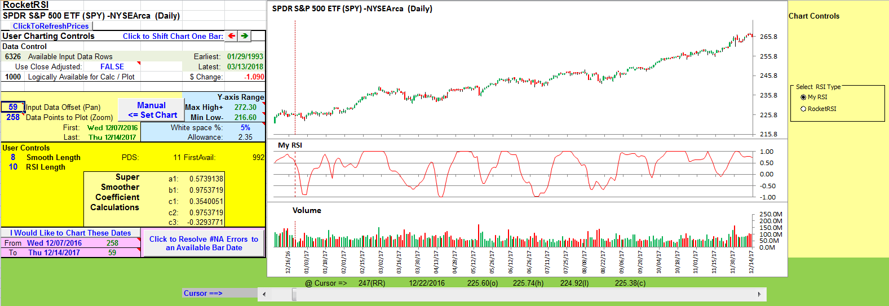
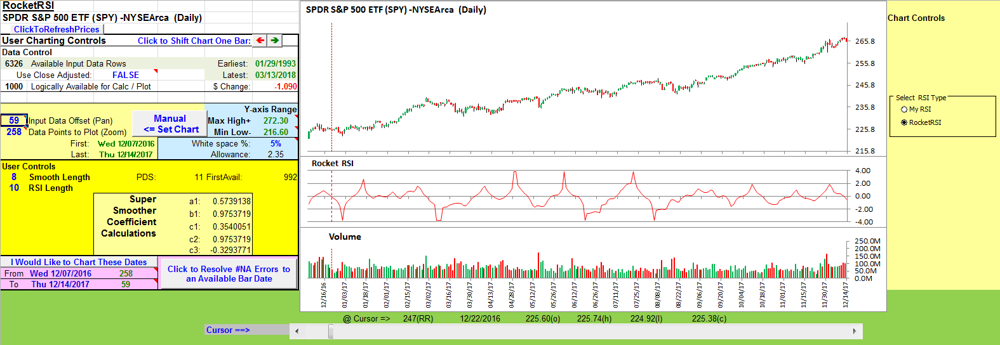

# Traders' Tips: May 2018

- **Article:** RocketRSI: A Solid Propellant For Your Rocket Science Trading by John Ehlers
- **Traders' Tips URL:** [Traders' Tips, May 2018](https://www.traders.com/Documentation/FEEDbk_docs/2018/05/TradersTips.html)

---

## TRADESTATION: MAY 2018

In “RocketRSI—A Solid Propellant For Your Rocket Science Trading” in this
  issue, author John Ehlers introduces a new take on the classic RSI indicator
  originally developed by J. Welles Wilder. Ehlers begins by introducing a new
  version of the RSI based on a simple accumulation of up and down closes rather
  than averages. To this he applies a Fisher transform. He tells us that the
  resultant output is statistically significant spikes that indicate cyclic turning
  points with precision.

Here, we are providing the TradeStation EasyLanguage code for an indicator
  and a strategy based on the author’s work.

```easylanguage
// RocketRSI Indicator
// (C) 2005-2018 John F. Ehlers
// TASC May 2018

inputs:
	SmoothLength( 10 ),
	RSILength( 10 ),
	OBOSLevel( 2 ) ;
variables:
	a1( 0 ),
	b1( 0 ),
	c1( 0 ),
	c2( 0 ),
	c3( 0 ),
	Filt( 0 ),
	Mom( 0 ),
	count( 0 ),
	CU( 0 ),
	CD( 0 ),
	MyRSI( 0 ),
	RocketRSI( 0 ),
	DollarsPerTrade( 0 ),
	PositionSize( 0 ) ;
	
//Compute Super Smoother coefficients once
if CurrentBar = 1 then 
begin
	a1 = expvalue( -1.414 * 3.14159 
		/ ( SmoothLength ) ) ;
	b1 = 2 * a1 * Cosine( 1.414 * 180 
		/ ( SmoothLength ) ) ;
	c2 = b1 ;
	c3 = -a1 * a1 ;
	c1 = 1 - c2 - c3 ;
end ;

//Create half dominant cycle Momentum
Mom = Close - Close[RSILength - 1] ;

//SuperSmoother Filter
Filt = c1 * ( Mom + Mom[1] ) 
	/ 2 + c2 * Filt[1] + c3 * Filt[2] ;

//Accumulate "Closes Up" and "Closes Down"
CU = 0 ;
CD = 0 ;
for count = 0 to RSILength -1 
begin
	if Filt[count] - Filt[count + 1] > 0 then 
		CU = CU + Filt[count] - Filt[count + 1] ;
	if Filt[count] - Filt[count + 1] < 0 then 
		CD = CD + Filt[count + 1] -	Filt[count] ;
end ; 

if CU + CD <> 0 then 
	MyRSI = ( CU - CD ) / ( CU + CD ) ;

//Limit RocketRSI output to 
//+/- 3 Standard Deviations
iF MyRSI > .999 then 
	MyRSI = .999 ;
if MyRSI < -.999 then 
	MyRSI = -.999 ;

//Apply Fisher Transform to establish 
//Gaussian Probability Distribution
RocketRSI = .5 * Log( ( 1 + MyRSI ) 
	/ ( 1 - MyRSI ) ) ;

Plot1( RocketRSI, "RocketRSI" ) ;
Plot2( 0, "Zero Line" ) ;
Plot3( OBOSLevel, "OB Level" ) ;
Plot4( -OBOSLevel, "OS Level" ) ;


Strategy: RocketRSI

// RocketRSI Strategy
// (C) 2005-2018 John F. Ehlers
// TASC May 2018

inputs:
	SmoothLength( 10 ),
	RSILength( 10 ),
	OBOSLevel( 2 ),
	InitialCapital( 100000 ),
	Leverage( 2 ),
	SLAmount( 2 ) ;
variables:
	a1( 0 ),
	b1( 0 ),
	c1( 0 ),
	c2( 0 ),
	c3( 0 ),
	Filt( 0 ),
	Mom( 0 ),
	count( 0 ),
	CU( 0 ),
	CD( 0 ),
	MyRSI( 0 ),
	RocketRSI( 0 ),
	DollarsPerTrade( 0 ),
	PositionSize( 0 ) ;
	
//Compute Super Smoother coefficients once
if CurrentBar = 1 then 
begin
	a1 = expvalue( -1.414 * 3.14159 
		/ ( SmoothLength ) ) ;
	b1 = 2 * a1 * Cosine( 1.414 * 180 
		/ ( SmoothLength ) ) ;
	c2 = b1 ;
	c3 = -a1 * a1 ;
	c1 = 1 - c2 - c3 ;
end ;

//Create half dominant cycle Momentum
Mom = Close - Close[RSILength - 1] ;

//SuperSmoother Filter
Filt = c1 * ( Mom + Mom[1] ) 
	/ 2 + c2 * Filt[1] + c3 * Filt[2] ;

//Accumulate "Closes Up" and "Closes Down"
CU = 0 ;
CD = 0 ;
for count = 0 to RSILength -1 
begin
	if Filt[count] - Filt[count + 1] > 0 then 
		CU = CU + Filt[count] - Filt[count + 1] ;
	if Filt[count] - Filt[count + 1] < 0 then 
		CD = CD + Filt[count + 1] -	Filt[count] ;
end ; 

if CU + CD <> 0 then 
	MyRSI = ( CU - CD ) / ( CU + CD ) ;

//Limit RocketRSI output to 
//+/- 3 Standard Deviations
iF MyRSI > .999 then 
	MyRSI = .999 ;
if MyRSI < -.999 then 
	MyRSI = -.999 ;

//Apply Fisher Transform to establish 
//Gaussian Probability Distribution
RocketRSI = .5 * Log( ( 1 + MyRSI ) 
	/ ( 1 - MyRSI ) ) ;

// Calculate Position Size
DollarsPerTrade = ( InitialCapital + NetProfit 
	+ OpenPositionProfit ) * Leverage ;
PositionSize = DollarsPerTrade / Close ;


if RocketRSI crosses below -OBOSLevel then
	Buy PositionSize shares next bar at Market 
else if RocketRSI crosses above OBOSLevel then
	SellShort PositionSize shares next bar at Market ;	

// Apply a Stop Loss
SetStopShare ;
SetStopLoss( SLAmount )
```

To download the EasyLanguage code, please visit our TradeStation and EasyLanguage
  support forum. The files for this article can be found here:https://community.tradestation.com/Discussions/Topic.aspx?Topic_ID=142776.
  The filename is “TASC_MAY2018.ZIP.”

For more information about EasyLanguage in general, please seehttps://developer.tradestation.com/easylanguage.

A sample chart is shown in Figure 1.

**FIGURE 1: TRADESTATION. Here is
    an example daily chart of SPY with the RocketRSI indicator and strategy applied.**

This article is for informational purposes. No type of trading or investment
    recommendation, advice, or strategy is being made, given, or in any manner
    provided by TradeStation Securities or its affiliates.

—Doug McCraryTradeStation Securities, Inc.www.TradeStation.com

BACK TO LIST

Code file: [RRSI.els](RRSI.els)

---

## METASTOCK: MAY 2018

John Ehlers’ article in this issue, “RocketRSI—A Solid Propellant For Your
  Rocket Science Trading,” presents two variations on the standard RSI calculation.
  Here are the MetaStock formulas for these indicators:

```metastock
MYRSI:

sml:= 8; {smooth length}
rsil:= 10; {RSI length}

{super smoother}
a1:= Exp(-1.414 * 3.14159 / sml);
b1:= 2*a1 * Cos(1.414*180 / sml);
c2:= b1;
c3:= -a1 * a1;
c1:= 1 - c2 - c3;
filt:= c1 * (C + Ref(C, -1))/2 + c2*PREV + c3*Ref(PREV,-1);

{RSI}
change:= ROC(filt, 1, $);
CU:= Sum(If(change > 0, change, 0), rsil);
CD:= Sum(If(change < 0, Abs(change), 0), rsil);
denom:= If(CU+CD = 0, -1, CU+CD);
If(denom=-1, 0, (CU-CD)/denom)


RocketRSI:

sml:= 8; {smooth length}
rsil:= 10; {RSI length}

{super smoother}
a1:= Exp(-1.414 * 3.14159 / sml);
b1:= 2*a1 * Cos(1.414*180 / sml);
c2:= b1;
c3:= -a1 * a1;
c1:= 1 - c2 - c3;

rmom:= C-Ref(C, -(rsil-1));
filt:= c1 * (rmom + Ref(rmom, -1))/2 + c2*PREV + c3*Ref(PREV,-1);

{RSI}
change:= ROC(filt, 1, $);
CU:= Sum(If(change > 0, change, 0), rsil);
CD:= Sum(If(change < 0, Abs(change), 0), rsil);
denom:= If(CU+CD = 0, -1, CU+CD);
myRSI:= If(denom=-1, 50, (CU-CD)/denom);

limit:= If(myRSI>0.999, 0.999, If(myRSI<-0.999, -0.999, myRSI));
.5*Log((1+limit) / (1-limit))
```

—William GolsonMetaStock Technical Supportwww.metastock.com

BACK TO LIST

Code file: [RRSI.msl](RRSI.msl)

---

## eSIGNAL: MAY 2018

For this month’s Traders’ Tip, we’ve provided the studyRocketRSI.efsbased
  on the article by John Ehlers in this issue, “RocketRSI—A Solid Propellant
  For Your Rocket Science Trading.” The study is designed to assist you in identifying
  cyclic reversal points.

The study contains formula parameters that may be configured through theedit
    chartwindow (right-click on the chart and select “edit chart”). A sample
    chart is shown in Figure 2.


**FIGURE 2: eSIGNAL. Here is an example
    of the study plotted on a daily chart of SPY.**

https://www.esignal.com/members/community

https://kb.esignal.com

here

```javascript
/*********************************
Provided By:  
eSignal (Copyright c eSignal), a division of Interactive Data 
Corporation. 2016. All rights reserved. This sample eSignal 
Formula Script (EFS) is for educational purposes only and may be 
modified and saved under a new file name.  eSignal is not responsible
for the functionality once modified.  eSignal reserves the right 
to modify and overwrite this EFS file with each new release.

Description:        
    RocketRSI - A Solid Propellant For Your Rocket Science Trading by John F. Ehlers

Version:            1.00  21/03/2018

Formula Parameters:                     Default:
Smoothing Length                        8
RSI Length                              10


Notes:
The related article is copyrighted material. If you are not a subscriber
of Stocks & Commodities, please visit www.traders.com.

**********************************/

var fpArray = new Array();

function preMain(){
    setPriceStudy(false);
    setStudyTitle("Rocket RSI");
    
    var x = 0;
    fpArray[x] = new FunctionParameter("SmLength", FunctionParameter.NUMBER);
	with(fpArray[x++]){
        setName("Smoothing Length");
        setLowerLimit(1);
        setDefault(8);
    }
    fpArray[x] = new FunctionParameter("RSILength", FunctionParameter.NUMBER);
	with(fpArray[x++]){
        setName("RSI Length");
        setLowerLimit(1);
        setDefault(10);
    }
}

var bInit = false;
var bVersion = null;
var xRocketRSI = null

function main(SmLength, RSILength){
    if (bVersion == null) bVersion = verify();
    if (bVersion == false) return;
    
    if (getCurrentBarCount() <= SmLength + RSILength + 1) return;
    
    if (getBarState() == BARSTATE_ALLBARS){
        bInit = false;
    }
    
    if (!bInit){
        var a1 = Math.exp(-Math.SQRT2 * Math.PI / SmLength);
        var b1 = 2 * a1* Math.cos( (Math.PI / 180) * Math.SQRT2 * 180 / SmLength);
        var c2 = b1;
        var c3 = - a1 * a1;
        var c1 = 1 - c2 - c3;
        
        var xMomentum = mom(RSILength-1);
        var xSSFilter = efsInternal("calc_SSFilter", xMomentum, c1, c2, c3);
        xRocketRSI = efsInternal("calc_RocketRSI", RSILength, xSSFilter);
        
        addBand(0, PS_DASH, 1, Color.grey, 1);
        
        bInit = true;
    }

    if( xRocketRSI.getValue(0) != null) return xRocketRSI.getValue(0);
}

var nSSFilter = 0;
var nSSFilter_1 = 0;
var nSSFilter_2 = 0;

function calc_SSFilter(xMomentum, c1, c2, c3){
    if (xMomentum.getValue(-1) == null) return;
    
    if (getBarState() == BARSTATE_NEWBAR){
        nSSFilter_2 = nSSFilter_1;
        nSSFilter_1 = nSSFilter;
    }
        
    nSSFilter = c1 * (xMomentum.getValue(0) + xMomentum.getValue(-1)) / 2 + c2 * nSSFilter_1 + c3 * nSSFilter_2;
    
    if (nSSFilter == null) return;
    
    return nSSFilter;
}

function calc_RocketRSI(RSILength, xSSFilter){     
    if (xSSFilter.getValue(-RSILength - 1) == null) return;
    
    var nCU = 0;
    var nCD = 0;
    var nMyRSI = 0;
    var nRocketRSI = 0;
    
    for (var i = 0; i < RSILength; i++){
        
        if (xSSFilter.getValue(-i) - xSSFilter.getValue(-i - 1) > 0)
            nCU += (xSSFilter.getValue(-i) - xSSFilter.getValue(-i - 1));
        
        if (xSSFilter.getValue(-i) - xSSFilter.getValue(-i - 1) < 0)
            nCD += (xSSFilter.getValue(-i - 1) - xSSFilter.getValue(-i)); 
    }

    
    if ((nCU + nCD) != 0) nMyRSI = (nCU - nCD) / (nCU + nCD);
    
    if (nMyRSI > 0.999) nMyRSI = 0.999;
    if (nMyRSI < -0.999) nMyRSI = -0.999;
        
    nRocketRSI = 0.5 * Math.log((1 + nMyRSI) / (1 - nMyRSI));
    
    return nRocketRSI;
}

function verify(){
    var b = false;
    if (getBuildNumber() < 779){
        
        drawTextAbsolute(5, 35, "This study requires version 10.6 or later.", 
            Color.white, Color.blue, Text.RELATIVETOBOTTOM|Text.RELATIVETOLEFT|Text.BOLD|Text.LEFT,
            null, 13, "error");
        drawTextAbsolute(5, 20, "Click HERE to upgrade.@URL=https://www.esignal.com/download/default.asp", 
            Color.white, Color.blue, Text.RELATIVETOBOTTOM|Text.RELATIVETOLEFT|Text.BOLD|Text.LEFT,
            null, 13, "upgrade");
        return b;
    } 
    else
        b = true;
    
    return b;
}
```

—Eric LipperteSignal, an Interactive Data company800 779-6555,www.eSignal.com

BACK TO LIST

Code file: [RocketRSI.efs](code/RocketRSI.efs)

---

## WEALTH-LAB: MAY 2018

In good tradition, in this issue we’re pleased to find two new indicators
  introduced by John Ehlers in his article, “RocketRSI—A Solid Propellant For
  Your Rocket Science Trading.” Is RocketRSI the new dawn for the RSI? Let’s
  take a look.

From our brief encounter with this new indicator, it seems that its applicability
  greatly depends on finding the dominant cycle period. The “$64,000 question”
  is whether this cycle actually exists in the data, and how stable it is over
  time.

We created a barebones system to put to test the idea that a spike below -2
  provides a long entry timing signal (we’ll skip the opposite signal this time).
  Figure 3 illustrates some typical entries. Its only exit rule is to “exit afterfixed
  bars” (wherefixed barsis a parameter). Looking ahead, this
  parameter had the biggest impact on the system’s net profit (as shown in Figure
  4). Then we ran a portfolio simulation on 10 years of daily data for the 30
  DJIA stocks allocating 10% equity to each signal.


**FIGURE 3: WEALTH-LAB. This shows
    some typical long entries following spikes below -2 standard deviations on
    a daily chart of Apple (AAPL).**


**FIGURE 4: WEALTH-LAB. Increasing
    the bars to hold parameter had the most visible effect on the system’s net
    profit.**

On a 3D optimization graph we plotted the system’s net profit on axis Y, and
  the RSI length and fixed bars parameters on axes X and Z, respectively (Figure
  5).


**FIGURE 5: WEALTH-LAB. This 3D optimization
    graph plots the system’s net profit on axis Y, the RSI length on axis x,
    and fixed bars parameters on axis Z.**

The best net profit amount came from the eight-period RSI length, which suggests
  that there may be a 16-bar cycle period in the 30 DJIA stocks. However, the
  3D graph indicates there’s a sharp peak around this value. The smooth area
  of the curve nearby suggests a stable and profitable zone with multiple adjacent
  parameter values, which leads to more consistent results. Hence, we’d rather
  pick the half-cycle period from this area in the 10 to 14 ballpark—which is
  close to the author’s suggestion.

To give the RocketRSI the more thorough testing that it deserves and to start
  building your own systems, install or update our TASCIndicators library to
  its latest version and restart Wealth-Lab. This makes it instantly applicable
  to any building blocks calledrules. By simply combining and reordering
  them, the user can come up with fairly elaborate strategies. The test system’s
  code follows:

```csharp
Wealth-Lab strategy code C#

using System;
using System.Collections.Generic;
using System.Text;
using System.Drawing;
using WealthLab;
using WealthLab.Indicators;
using TASCIndicators;

namespace WealthLab.Strategies
{
	public class MyStrategy : WealthScript
	{
		StrategyParameter slider1;
		StrategyParameter slider2;
		StrategyParameter paramExitDays;

		public MyStrategy()
		{
			slider1 = CreateParameter("Smoothing Length", 8, 2, 20, 2);
			slider2 = CreateParameter("RSI Length", 10, 2, 20, 2);
			paramExitDays = CreateParameter("Exit after", 10, 5, 30, 5);
		}

		protected override void Execute()
		{
			var rr = RocketRSI.Series(Close,slider1.ValueInt,slider2.ValueInt);
			var fixedBars = paramExitDays.ValueInt;
			
			for(int bar = GetTradingLoopStartBar(1); bar < Bars.Count; bar++)
			{
				if (IsLastPositionActive)
				{
					Position p = LastPosition;
					if ( bar+1 - p.EntryBar >= fixedBars )
						SellAtMarket( bar+1, p, "Exit after N bars" ); 
				}
				else
				{
					if( rr[bar] <= -2.0 )
						BuyAtMarket(bar+1);
				}
			}

			var ls = LineStyle.Solid;
			ChartPane paneRocketRSI = CreatePane(40,true,true);
			PlotSeries(paneRocketRSI,rr,Color.Black,ls,2);
			DrawHorzLine(paneRocketRSI,0,Color.Violet,ls,2);
			DrawHorzLine(paneRocketRSI,2,Color.Red,ls,1);
			DrawHorzLine(paneRocketRSI,-2,Color.Blue,ls,1);
		}
	}
}
```

—Gene Geren & Robert SucherWealth-Lab (MS123, LLC)www.wealth-lab.com

BACK TO LIST

Code file: [RRSI.cs](RRSI.cs)

---

## AMIBROKER: MAY 2018

In “RocketRSI—A Solid Propellant For Your Rocket Science Trading” in this
  issue, author John Ehlers presents a new variation of the RSI indicator. The
  AmiBroker code listing shown here provides a ready-to-use formula. To adjust
  parameters, right-click on the chart and selectparametersfrom the
  context menu.

```c
// RocketRSI Indicator 
// based on TS code by John F. Ehlers, S&C May 2018 

SmoothLength = Param("SmoothLength", 10, 2, 50 ); 
RSILength = Param("RSILength", 10, 2, 50 ); 

// Compute Super Smoother coefficients once 

PI = 3.1415926; 

a1 = exp( -1.414 * PI / SmoothLength ); 
b1 = 2 * a1 * Cos( 1.414 * PI / SmoothLength ); 
c2 = b1; 
c3 = -a1 * a1; 
c1 = 1 - c2 - c3; 

// Create half dominant cycle Momentum 
Mom = Close - Ref( Close, RSILength - 1 ); 

// SuperSmoother Filter 
Filt = IIR( Mom, 0.5 * c1, c2, 0.5 * c1, c3 ); 

// Accumulate "Closes Up" and "Closes Down" 
Diff = Ref( Filt, -1 ) - Filt; 

Up = Max( Diff, 0 ); 
Dn = Max( -Diff, 0 ); 

CU = Sum( Up, RSILength ); 
CD = Sum( Dn, RSILength ); 

MyRSI = ( CU - CD ) / ( CU + CD ); 

MyRSI = Ref( MyRSI, - RSILength + 1 ); 

// Limit RocketRSI output to +/- 3 Standard Deviations 

MyRSI = Min( 0.999, MyRSI ); 
MyRSI = Max( -0.999, MyRSI ); 

// Apply Fisher Transform to establish Gaussian Probability Distribution 
RocketRSI = .5 * Log( ( 1 + MyRSI ) / ( 1 - MyRSI ) ); 

Plot( RocketRSI, "RocketRSI" + _PARAM_VALUES(), colorRed, styleThick ); 

Plot( 0, "", colorBlue, styleNoLabel );
```

A sample chart is shown in Figure 6.


**FIGURE 6: AMIBROKER. Here is a
    daily chart of the SPY (upper pane) with the RocketRSI (lower pane), replicating
    a chart from Ehlers’ article in this issue.**

—Tomasz Janeczko, AmiBroker.comwww.amibroker.com

BACK TO LIST

Code file: [RRSI.afl](RRSI.afl)

---

## NEUROSHELL TRADER: MAY 2018

The RocketRSI indicator presented by John Ehlers in his article in this issue,
  “RocketRSI—A Solid Propellant For Your Rocket Science Trading,” can be easily
  implemented in NeuroShell Trader using NeuroShell Trader’s ability to call
  external dynamic linked libraries. Dynamic linked libraries can be written
  in C, C++ and Power Basic.

After moving the code given in the article to your preferred compiler and
  creating a DLL, you can insert the resulting indicator as follows:

Selectnew indicatorfrom theinsertmenu.Choose the External Program & Library Calls category.Select the appropriateexternal DLL callindicator.Set up the parameters to match your DLL.Select thefinishedbutton.

Users of NeuroShell Trader can go to the Stocks & Commodities section
  of the NeuroShell Trader free technical support website to download a copy
  of this or any previous Traders’ Tips.

A sample chart is shown in Figure 7.


**FIGURE 7: NEUROSHELL TRADER. This
    sample NeuroShell Trader chart shows the RocketRSI on a chart of SPY.**

—Marge Sherald, Ward Systems Group, Inc.301 662-7950,sales@wardsystems.comwww.neuroshell.com

BACK TO LIST

---

## TRADERSSTUDIO: MAY 2018

The TradersStudio code based on John Ehlers’ article in this issue, “RocketRSI—A
  Solid Propellant For Your Rocket Science Trading,” is provided atwww.TradersEdgeSystems.com/traderstips.htmas
  well as here:

```basic
'RocketRSI
'Author: John Ehlers, TASC May 2018
'Coded by: Richard Denning, 3/12/18
'www.TradersEdgeSystems.com

Function RocketRSI(SmoothLength, RSILength)
    Dim a1
    Dim b1
    Dim c1
    Dim c2
    Dim c3
    Dim Filt As BarArray
    Dim count
    Dim CU
    Dim CD
    Dim myRSI
    
    'SmoothLength = 8
    'RSILength = 10
       
    If CurrentBar - 1 Then
        a1 = Exp(-1.414*3.14159 / (SmoothLength))
        b1 = 2*a1*Cos(DegToRad(1.414*180 / (SmoothLength)))
        c2 = b1
        c3 = -a1*a1
        c1 = 1 - c2 - c3
    End If
    Filt = c1*(Close + Close[1]) / 2 + c2*Filt[1] + c3*Filt[2]
    CU = 0
    CD = 0
    For count = 0 To RSILength -1
        If Filt[count] - Filt[count + 1] > 0 Then
            CU = CU + Filt[count] - Filt[count + 1]
        End If
        If Filt[count] - Filt[count + 1] < 0 Then
            CD = CD + Filt[count + 1] - Filt[count]
        End If
    Next
    If CU + CD <> 0 Then
         myRSI = (CU - CD) / (CU + CD)
    End If
    If myRSI > 0.999 Then myRSI = 0.999
    If myRSI < -0.999 Then myRSI = -0.999
    RocketRSI = 0.5*Log((1+myRSI) / (1 - myRSI))
End Function
'---------------------------------------------------------------
Sub Ehlers_RocketRSI_IND(SmoothLength, RSILength)
  Dim MyRSI
  MyRSI = RocketRSI(SmoothLength,RSILength)
  plot1(MyRSI)
  plot2(0)
End Sub
'----------------------------------------------------------------
```

Figure 8 shows the RocketRSI indicator (yellow line) on a chart of S&P
  500 futures contract (SP) during part of 2006 and 2007.


**FIGURE 8: TRADERSSTUDIO. This shows
    the RocketRSI indicator (yellow line) on a chart of S&P 500 futures (SP)
    during part of 2006 and 2007.**

—Richard Denninginfo@TradersEdgeSystems.comfor TradersStudio

BACK TO LIST

Code file: [RRSI.trs](RRSI.trs)

---

## QUANTACULA: MAY 2018

We added John Ehlers’ RocketRSI indicator (described in his article in this
  issue, “RocketRSI—A Solid Propellant For Your Rocket Science Trading”) to our
  free TASC Extensions package for Quantacula that you can obtain by clicking
  ourmarketplacelink atwww.quantacula.com.

Once the extension is installed, you will see the RocketRSI among the other
  indicators adapted from previous Traders’ Tips the next time you launch Quantacula
  Studio.

You can now use RocketRSI anywhere in the product that accepts an indicator
  input, for example, the building block model builder. We built a simple model
  by dragging and dropping the following building blocks:

Entry:Buy at market openCondition:Indicator crosses value (RocketRSI
    crosses below -2.00)Exit:Sell at market openCondition:Indicator crosses value (RocketRSI
    crosses below 2.00)

Note we used “crosses below 2.00” for the exit condition, rather than “crosses
  above 2.00.” This lets the winning positions ride further, and resulted in
  a better overall return in our backtesting.

Figure 10 shows the model applied to a chart of Intel Corporation daily historical
  data, illustrating how it can pinpoint entry and exit points with surgical
  precision. A suggested next step would be to perform some portfolio backtesting
  on a universe of data you’re interested in trading.


**FIGURE 9: QUANTACULA. This sample
    chart shows the TASC Extensions indicators and the RocketRSI dragged onto
    a chart in Quantacula Studio.**


**FIGURE 10: QUANTACULA. Here, the
    RocketRSI model is applied to Intel Corporation historical data.**

—Dion Kurczek, Quantacula LLCinfo@quantacula.comwww.quantacula.com

BACK TO LIST

---

## NINJATRADER: MAY 2018

The RocketRSI and MyRSI indicators, as discussed in John Ehlers’ article in
  this issue, “RocketRSI—A Solid Propellant For Your Rocket Science Trading,”
  is available for download at the following links for NinjaTrader 8 and NinjaTrader
  7:

NinjaTrader 8:www.ninjatrader.com/SC/May2018SCNT8.zipNinjaTrader 7:www.ninjatrader.com/SC/May2018SCNT7.zip

Once the file is downloaded, you can import the indicator in NinjaTader 8
  from within the control center by selecting Tools → Import → NinjaScript
  Add-On and then selecting the downloaded file for NinjaTrader 8. To import
  in NinjaTrader 7, from within the control center window, select the menu File → Utilities → Import
  NinjaScript and select the downloaded file.

You can review the indicators’ source code in NinjaTrader 8 by selecting the
  menu New → NinjaScript Editor → Indicators from within the control
  Center window and selecting the RocketRSI and MyRSI files. You can review the
  indicators’ source code in NinjaTrader 7 by selecting the menu Tools → Edit
  NinjaScript → Indicator from within the control center window and selecting
  the RocketRSI and MyRSI files.

NinjaScript uses compiled DLLs that run native, not interpreted, which provides
  you with the highest performance possible.

A sample chart implementing the strategy is shown in Figure 11.


**FIGURE 11: NINJATRADER. Here, the
    RocketRSI and MyRSI indicators are shown on a daily SPY chart.**

—Raymond Deux & Jim DoomsNinjaTrader, LLCwww.ninjatrader.com

BACK TO LIST

Code files: [MyRSI.cs](ninja-trader/MyRSI.cs), [RocketRSI.cs](ninja-trader/RocketRSI.cs)

---

## TRADE NAVIGATOR: MAY 2018

The RocketRSI indicator presented by John Ehlers in his article in this issue,
  “RocketRSI—A Solid Propellant For Your Rocket Science Trading,” has now been
  recreated in Trade Navigator software for your use. If you have an older version
  of the software, you can get the indicator by downloading theupgrade specialfile.
  When prompted to upgrade, click theyesbutton. If prompted to close
  all software, click on thecontinuebutton. It should automatically
  re-import and verify the libraries. Once the program restarts, you will then
  be able to hit the “A” key on your keyboard and then select the RocketRSI indicator
  from the list under theindicatorstab.

If you would like to recreate the indicator manually, the TradeSense language
  for it is as follows:

```text
&Mom := Expression - (Expression).(RsiLength - 1) 
&Filt := Ehlers SuperSmoother (&Mom , SmoothLength) 
&CU := MovingSum (&Filt - (&Filt).1 , RsiLength , 1) 
&CD := MovingSum ((&Filt).1 - &Filt , RsiLength , 1) 
&MyRSI := (&CU - &CD) / (&CU + &CD) 
&LimitRSI := IFF (&MyRSI > 0.999 , 0.999 , IFF (&MyRSI < -0.999 , -0.999 , &MyRSI)) 
0.5 * Log ((1 + &LimitRSI) / (1 - &LimitRSI))
```

Creating a functionTo create this indicator manually, click on theeditdropdown menu
  and open the trader’s toolbox (or use CTRL + T) and click on the functions
  tab. Now click on thenewbutton, and anew functiondialog
  window will open. Type the code for the indicator into the text box. Please
  ensure there are no extra spaces at the end of each line. When completed, click
  on theverifybutton. You may be presented with anadd inputspopup
  message if there are variables in the code. If so, click theyesbutton,
  then enter the values in thedefault valuecolumn (close, 8, and 10
  are the default values in this case). If all is well, when you click on thefunctiontab,
  the code you entered will convert to italic font. Now click on thesavebutton,
  and type a name for the indicator.

**FIGURE 12: TRADE NAVIGATOR. This
    shows the RocketRSI indicator on LULU.**

If you have any difficulty creating the indicators or would like help recreating
  the chart shown here, our technical support staff would be happy to help. Call
  719 884-0245 or click on the live chat tool located under Trade Navigator’s
  help menu or at the top of our homepage. Our support hours are M-F 6am–6pm
  US Mountain Time. Happy trading!

—Genesis Financial TechnologiesTech support 719 884-0245www.TradeNavigator.com

BACK TO LIST

Code file: [RRSI.txt](RRSI.txt)

---

## MICROSOFT EXCEL: MAY 2018

In his article in this issue, “RocketRSI—A Solid Propellant For Your Rocket
  Science Trading,” John Ehlers provides us with two variants on the RSI calculation.

For the first variation, MyRSI, Ehlers uses his SuperSmoother filter on bar-by-bar
  closing price deltas and calculates MyRSI using these filtered values (Figure
  13).


**FIGURE 13: EXCEL, MYRSI**

For the second variation, RocketRSI, Ehlers uses his SuperSmoother filter
  on a momentum value that is the difference between the current close and the
  close fromRSI length bars previous. Then he computes an RSI using
  the filtered momentum values and applies a Fisher transform to this RSI value
  to arrive at the value of the RocketRSI (Figure 14).


**FIGURE 14: EXCEL, ROCKET RSI**

The spreadsheet file for this Traders’ Tip can bedownloaded
    here. To successfully download it, follow these steps:

Right-click on theExcel
      file link, thenSelect “save as” (or “save target as”) to place
    a copy of the spreadsheet file on your hard drive.

A fix for previous Excel spreadsheets, required due to Yahoo modifications, can be found here: https://traders.com/files/Tips-ExcelFix.html

—Ron McAllisterExcel and VBA programmerrpmac_xltt@sprynet.com

BACK TO LIST

Originally published in the May 2018 issue ofTechnical Analysis ofSTOCKS & COMMODITIES magazine.All rights reserved. © Copyright 2018, Technical Analysis, Inc.

Code file: [RocketRSI.xlsm](code/RocketRSI.xlsm)

---

## BibTeX

```bibtex
@misc{traders_tips_2018_05,
  author = {{Technical Analysis of STOCKS \& COMMODITIES}},
  title = {Traders' Tips: RocketRSI: A Solid Propellant For Your Rocket Science Trading},
  year = {2018},
  month = may,
  howpublished = {online},
  url = {https://www.traders.com/Documentation/FEEDbk_docs/2018/05/TradersTips.html}
}
```
