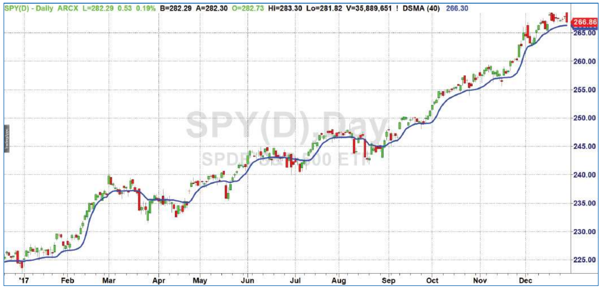

# The Deviation-Scaled Moving Average

- **Author:** John Ehlers
- **Publication:** Technical Analysis of STOCKS & COMMODITIES, Volume 36, July 2018, pp. 8--11
- **Article URL:** [Article PDF](https://technical.traders.com/archive/article.asp?file=\V36\C07\680EHLE.pdf)
- **Traders' Tips URL:** [Traders' Tips, July 2018](https://www.traders.com/Documentation/FEEDbk_docs/2018/07/TradersTips.html)

---

*Moving averages have two characteristics---they lag and they smooth data. But there are different ways to tweak them. Here's one way to make them more adaptive to current prices and make the smoothing heavier.*

Adaptive moving averages are not new to technical analysis. If you're familiar with adaptive techniques, you'll know that most start with an exponential moving average (EMA). The EMA is a smoothing filter that takes a fraction of the current price and adds the complement of that fraction times the value of the EMA one bar ago. The EMA equation is:

$$\text{EMA} = \alpha \cdot \text{Close} + (1 - \alpha) \cdot \text{EMA}[1]$$

## What's Alpha?

The alpha term is a number that can vary between zero and 1. When $\alpha$ is smaller, only a small fraction of the current price is used and a large fraction of the previous calculation is used. The result is an EMA that provides considerable smoothing. Conversely, when $\alpha$ is relatively large, a big fraction of the current price is used, which results in very little smoothing provided by the EMA. The idea of an adaptive moving average is to modify the alpha term according to another independently measured market condition.

Two of the more popular adaptive moving averages are VIDYA and KAMA. VIDYA, developed by Tushar Chande, uses the equivalent of an RSI to adjust the alpha term. KAMA, developed by Perry Kaufman, uses an effectiveness ratio to adjust the alpha term. The effectiveness ratio is the total price change over a calculation period divided by the sum of the bar-to-bar price changes over the same period. Both of these adaptive moving averages require the alpha modifier's calculation to be accomplished over a number of bars of data, with the result of induced computational lag.

## Another Way to Modify Alpha

The deviation-scaled moving average (DSMA) modifies the EMA's alpha in terms of the amplitude of an oscillator scaled to the standard deviation from the mean. Since the oscillator almost directly follows the price, the computational lag of the DSMA is minimal. Therefore, the DSMA rapidly adapts to price variations. In addition, when the standard deviation from the mean is small, the effective alpha term of the EMA is made to be small. The result is there is considerable smoothing by the DSMA when price variations are small.

The DSMA is probably best described with reference to the code in the sidebar "EasyLanguage Code For Deviation-Scaled Moving Average." The user input for the indicator is the *critical period* of a filter. The critical period of a smoothing filter is the cycle period at which the power of the signal allowed through the filter is reduced by half. Shorter cycle periods are reduced even more, so the filter achieves its smoothing function by not allowing the short cycle components in the spectrum to pass through to its output. The alpha term of the EMA is often described with reference to the length of a simple moving average. I prefer to relate the EMA alpha term to the filter critical period. The approximate relationship is simple, and can be expressed as:

$$\alpha = 5 / \text{Period}$$

In the DSMA, its alpha term is exactly equal to an EMA using the same critical period if the scaled amplitude deviation of the oscillator is 1.

## Zeros Oscillator

After inputs and declaration of variables, the computation of the standard deviation starts with an oscillator called *zeros* that is a simple two-bar difference of prices. This oscillator is important because of two characteristics in its transfer response.

First, when the cycle periods are very long and, at the limit, there is no change in price, the transfer response is zero. It is this characteristic that provides the nominal zero mean in the oscillator output. Further, its filter rolloff from shorter cycle periods is -6 dB per octave. Market data are fractal, meaning the cycle amplitudes in its spectrum increase in direct proportion to their cycle periods. That means the data cycle amplitudes increase statistically at the rate of 6 dB per octave. Since the oscillator rolloff is -6 dB per octave and spectrum amplitudes are statistically increasing at the rate of +6 dB per octave, the result is that the zeros oscillator whitens the price spectrum. This is a good thing.

Second, when the cycle period is exactly at twice the sampling rate, the samples are exactly one cycle period apart. This is called the Nyquist frequency period, and is the shortest possible period in sampled data. In the zeros oscillator the transfer response is zero at the Nyquist period because the samples are exactly one period apart for that spectral component. Having a zero in the transfer response at the Nyquist period eliminates the 6 dB increase in noise produced by a simple one-bar difference. Having a zero in the transfer response at the Nyquist period also reduces the impact of aliased data in the oscillator output.

The zeros oscillator output is smoothed in my two-pole SuperSmoother filter. The critical period of the SuperSmoother filter is half the input period to retain the oscillator's responsiveness, and the filter coefficients are calculated only on the first bar of data for computational efficiency.

Since the zeros oscillator has a nominally zero mean, the SuperSmoother filter output also has a nominally zero mean. Therefore, the standard deviation can be calculated as the square root of the average sum of the squares of the smoothed filter waveform over the input period. This is commonly called the root mean square (RMS).

When you divide the RMS into the smoothed filter waveform, it scales the waveform in terms of standard deviations. When you start with alpha computed in terms of the input period and then multiply it by the variable deviations, it scales alpha both in terms of the input and in terms of the current volatility. The scaling goes in the right direction at the right time. When the price deviation of the oscillator is large, the RMS is large, and consequently alpha is large. When alpha is large, there is very little EMA filtering and the filter quickly adapts to current prices. Conversely, when the price deviation of the oscillator is small, the RMS is small and alpha is small. When alpha is small, the EMA produces heavy smoothing.


**Figure 1: DSMA.** The deviation-scaled moving average (DSMA) is a smoothing filter that adapts rapidly to price variations.

The action of the DSMA speaks for itself in Figure 1. On the chart of the SPY in Figure 1, which uses data for the calendar year 2017, notice how the DSMA adapts to price action. You can change the responsiveness of the DSMA by simply changing the *period* input parameter.

## Adapting to Volatility

In summary, the DSMA is an adaptive moving average that features rapid adaptation to volatility in price movement. It accomplishes this adaptation by modifying the alpha term of an EMA by the amplitude of an oscillator scaled in standard deviations from the mean. The DSMA's responsiveness can be changed by using different values for the input parameter *period*.

## Further Reading

Ehlers, John [2013]. *Cycle Analytics For Traders*, Wiley.

---

## EasyLanguage Code for Deviation-Scaled Moving Average

```easylanguage
// Deviation Scaled Moving Average (DSMA)
// (c) 2013 - 2018 John F. Ehlers

Inputs:
    Period(40);

Vars:
    a1(0),
    b1(0),
    c1(0),
    c2(0),
    c3(0),
    Zeros(0),
    Filt(0),
    ScaledFilt(0),
    RMS(0),
    count(0),
    alpha1(0),
    DSMA(0);

If CurrentBar = 1 Then Begin
    //Smooth with a Super Smoother
    a1 = expvalue(-1.414*3.14159 / (.5*Period));
    b1 = 2*a1*Cosine(1.414*180 / (.5*Period));
    c2 = b1;
    c3 = -a1*a1;
    c1 = 1 - c2 - c3;
End;

//Produce Nominal zero mean with zeros in the transfer
//response at DC and Nyquist with no spectral distortion
//Nominally whitens the spectrum because of 6 dB per octave
//rolloff
Zeros = Close - Close[2];

//SuperSmoother Filter
Filt = c1*(Zeros + Zeros[1]) / 2 + c2*Filt[1] + c3*Filt[2];

//Compute Standard Deviation
RMS = 0;
For count = 0 to Period - 1 Begin
    RMS = RMS + Filt[count]*Filt[count];
End;
RMS = SquareRoot(RMS / Period);

//Rescale Filt in terms of Standard Deviations
ScaledFilt = Filt / RMS;

alpha1 = AbsValue(ScaledFilt)*5 / Period;
DSMA = alpha1*Close + (1 - alpha1)*DSMA[1];

Plot1(DSMA);
```

---

## BibTeX

```bibtex
@article{ehlers_dsma_2018,
  author = {Ehlers, John F.},
  title = {The Deviation-Scaled Moving Average},
  journal = {Technical Analysis of STOCKS \& COMMODITIES},
  volume = {36},
  number = {7},
  pages = {8--11},
  year = {2018},
  month = jul,
  url = {https://technical.traders.com/archive/article.asp?file=\V36\C07\680EHLE.pdf}
}

@misc{traders_tips_2018_07,
  author = {{Technical Analysis of STOCKS \& COMMODITIES}},
  title = {Traders' Tips: The Deviation-Scaled Moving Average},
  year = {2018},
  month = jul,
  howpublished = {online},
  url = {https://www.traders.com/Documentation/FEEDbk_docs/2018/07/TradersTips.html}
}
```
