# Traders' Tips: July 2018

- **Article:** The Deviation-Scaled Moving Average by John Ehlers
- **Traders' Tips URL:** [Traders' Tips, July 2018](https://www.traders.com/Documentation/FEEDbk_docs/2018/07/TradersTips.html)

---

## TRADESTATION: JULY 2018

In “The Deviation-Scaled Moving Average” in this issue, author John Ehlers introduces a new adaptive moving average that has the ability to rapidly adapt to volatility in price movement. The author explains that due to its design, it has minimal lag yet is able to provide considerable smoothing.

We’re providing the EasyLanguage code for a function to calculate the DSMA that you can easily integrate into your own code. We have also provided a demonstration indicator as well as a strategy. A sample chart is shown in Figure 1

To download the EasyLanguage code, please visit our TradeStation and EasyLanguage support forum. The files for this article can be found here: https://community.tradestation.com/Discussions/Topic.aspx?Topic_ID=152631 . The filename is “TASC_JUL2018.ZIP.”

For more information about EasyLanguage in general, please see https://www.tradestation.com/EL-FAQ .

This article is for informational purposes. No type of trading or investment recommendation, advice, or strategy is being made, given, or in any manner provided by TradeStation Securities or its affiliates.

—Doug McCrary TradeStation Securities, Inc. www.TradeStation.com


```easylanguage
Function: EhlersDSMA
// Deviation Scaled Moving Average (DSMA)
// (c) 2013 - 2018 John F. Ehlers
// TASC JUL 2018
// EhlersDSMA function
using elsystem ;

inputs:
    Period( numericsimple ) ;
    
variables:
    a1( 0 ),
    b1( 0 ),
    c1( 0 ),
    c2( 0 ),
    c3( 0 ),
    Zeros( 0 ),
    Filt( 0 ),
    ScaledFilt( 0 ),
    RMS( 0 ),
    count( 0 ),
    alpha1( 0 ),
    DSMA( 0 ) ;
    
once
begin    
	if Period <= 0 then
		throw Exception.Create( "The 'Period' input to the " + 
		"EhlersDSMA function must be greater than 0." ) ;

    //Smooth with a Super Smoother 
    a1 = ExpValue( -1.414 * 3.14159 / ( .5 * Period ) ) ;
    b1 = 2 * a1 * Cosine( 1.414 * 180 / ( .5 * Period ) ) ;
    c2 = b1 ;
    c3 = -a1 * a1 ;
    c1 = 1 - c2 - c3 ;
end ;

//Produce Nominal zero mean with zeros in the transfer 
//response at DC and Nyquist with no spectral distortion
//Nominally whitens the spectrum because of 6 dB 
//per octave rolloff
Zeros = Close - Close[2] ;

//SuperSmoother Filter
Filt = c1 * ( Zeros + Zeros[1] ) / 2 + c2 * Filt[1] + c3 * Filt[2] ;

//Compute Standard Deviation    
RMS = 0;
For count = 0 to Period - 1 
begin
    RMS = RMS + Filt[count] * Filt[count] ; 
end ;
RMS = SquareRoot( RMS / Period ) ;

//Rescale Filt in terms of Standard Deviations
If RMS <> 0 then 
	ScaledFilt = Filt / RMS ;

alpha1 = AbsValue( ScaledFilt ) * 5 / Period ;
DSMA = alpha1 * Close + ( 1 - alpha1 ) * DSMA[1] ;

EhlersDSMA = DSMA ;


Indicator: DSMA
// TASC JUL 2018
// Ehlers DSMA
inputs:
	Period( 40 ) ;
	
variables:
	DSMAValue( 0 ) ;
	
DSMAValue = EhlersDSMA( Period ) ;

Plot1( DSMAValue, "DSMA" ) ;		

if AlertEnabled  then 
begin
	if Close crosses over DSMAValue then
		Alert( "Price crossing over DSMA" ) 
	else if Close crosses under DSMAValue then
		Alert( "Price crossing under DSMA" ) ;
end ;
	

Strategy: DSMA
// TASC JUL 2018
// Ehlers DSMA
inputs:
	FastPeriod( 40 ),
	SlowPeriod( 100 ) ;
	
variables:
	FastDSMAValue( 0 ),
	SlowDSMAValue( 0 ) ;
	
FastDSMAValue = EhlersDSMA( FastPeriod ) ;
SlowDSMAValue = EhlersDSMA( SlowPeriod ) ;

if FastDSMAValue crosses above SlowDSMAValue then
	Buy next bar at Market
else if FastDSMAValue crosses below SlowDSMAValue then
	SellShort next bar at Market ;
```

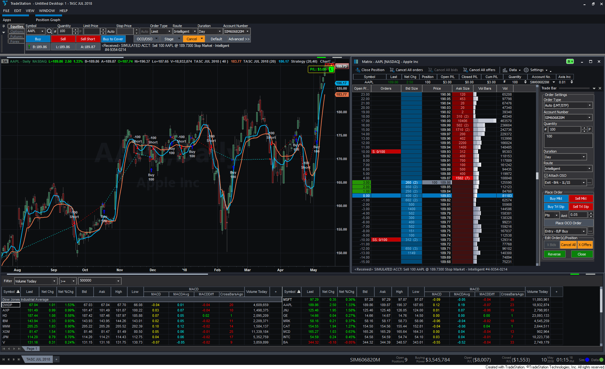
**FIGURE 1: TRADESTATION. This shows a daily chart of AAPL with the DSMA indicator and strategy.**

---

## METASTOCK: JULY 2018

John Ehlers’ article in this issue, “The Deviation-Scaled Moving Average,” introduces a moving average of the same name. The MetaStock formula for this moving average is provided here.

—William Golson MetaStock Technical Support www.metastock.com


```metastock
tp:= Input("time periods",2, 200, 40);
a1:= Exp(-1.414 * 3.14159 / (tp/2));
b1:= 2*a1 * Cos(1.414*180 /(tp/2));
c2:= b1;
c3:= -a1 * a1;
c1:= 1 - c2 - c3;
zeros:= C-Ref(C,-2);
filt:= c1 * (zeros + Ref(zeros, -1))/2 + c2*PREV + c3*Ref(PREV,-1);
ScaledFilt:= filt/Std(filt,tp);
a2:= Abs(ScaledFilt*5)/tp;
If(Cum(1)<=tp+4, C, a2*C + ((1-a2)*PREV))
```

---

## eSIGNAL: JULY 2018

For this month’s Traders’ Tip, we’ve provided the study DSMA.efs , based on the article in this issue by John Ehlers, “The Deviation-Scaled Moving Average.” This study is an adaptive moving average.

The study contains formula parameters that may be configured through the edit chart window (right-click on the chart and select “edit chart”). A sample chart is shown in Figure 2.

To discuss this study or download a complete copy of the formula code, please visit the EFS library discussion board forum under the forums link from the support menu at www.esignal.com or visit our EFS KnowledgeBase at www.esignal.com/support/kb/efs/ . The eSignal formula script (EFS) is also shown below.

—Eric Lippert eSignal, an Interactive Data company 800 779-6555, www.eSignal.com


```javascript
/*********************************
Provided By:  
eSignal (Copyright c eSignal), a division of Interactive Data 
Corporation. 2016. All rights reserved. This sample eSignal 
Formula Script (EFS) is for educational purposes only and may be 
modified and saved under a new file name.  eSignal is not responsible
for the functionality once modified.  eSignal reserves the right 
to modify and overwrite this EFS file with each new release.

Description:        
    The Deviation-Scaled Moving Average by John F. Ehlers

Version:            1.00  5/14/2018

Formula Parameters:                     Default:
Period                                  40


Notes:
The related article is copyrighted material. If you are not a subscriber
of Stocks & Commodities, please visit www.traders.com.

**********************************/

var fpArray = new Array();

function preMain(){
    setPriceStudy(true);
    setStudyTitle("DSMA");
    
    var x = 0;
    fpArray[x] = new FunctionParameter("Period", FunctionParameter.NUMBER);
	with(fpArray[x++]){
        setName("Period");
        setLowerLimit(1);
        setDefault(40);
    }
}

var bInit = false;
var bVersion = null;
var xClose = null;
var xRMS = null;
var nDSMA_1 = 0;
var nDSMA = 0;

function main(Period){
    if (bVersion == null) bVersion = verify();
    if (bVersion == false) return;
    
    if (getCurrentBarCount() < Period) return;
    
    if (getBarState() == BARSTATE_ALLBARS){
        bInit = false;
    }
    
    if (getBarState() == BARSTATE_NEWBAR){
        nDSMA_1 = nDSMA;
    }

    
    if (!bInit){
        var a1 = Math.exp(-Math.SQRT2 * Math.PI /(0.5 * Period));
        var b1 = 2 * a1* Math.cos(Math.PI * Math.SQRT2 / (0.5 * Period));
        var c2 = b1;
        var c3 = - a1 * a1;
        var c1 = 1 - c2 - c3;
        nDSMA_1 = 0;
        nDSMA = 0;
        
        xClose = close();
        var xZeros = efsInternal("calc_Zeros", xClose);
        var xSSFilter = efsInternal("calc_SSFilter", xZeros, c1, c2, c3);
        xRMS = efsInternal("calc_RMS", Period, xSSFilter);
                
        bInit = true;
    }

    var alpha1 = Math.abs(xRMS.getValue(0)) * 5 / Period;

    if (getCurrentBarCount() == Period){
        nDSMA_1 = xClose.getValue(-1);
    }

    nDSMA = alpha1 * xClose.getValue(0) + (1 - alpha1) * nDSMA_1
    return nDSMA;
}


function calc_Zeros (xClose){
    if (xClose.getValue(-2) != null)
        return xClose.getValue(0) - xClose.getValue(-2);
}

var nSSFilter = 0;
var nSSFilter_1 = 0;
var nSSFilter_2 = 0;

function calc_SSFilter(xZeros, c1, c2, c3){
    if (xZeros.getValue(-1) == null) return;
    
    if (getBarState() == BARSTATE_NEWBAR){
        nSSFilter_2 = nSSFilter_1;
        nSSFilter_1 = nSSFilter;
    }

    if (getBarState() == BARSTATE_ALLBARS){
        nSSFilter = 0;
        nSSFilter_1 = 0;
        nSSFilter_2 = 0;
    }
        
    nSSFilter = c1 * (xZeros.getValue(0) + xZeros.getValue(-1)) 
                    / 2 + c2 * nSSFilter_1 + c3 * nSSFilter_2;
    
    return nSSFilter;
}

function calc_RMS(Period, xSSFilter){     
    if (xSSFilter.getValue(-Period) == null) return;
    
    var nRMS = 0;
    
    for (var i = 0; i < Period; i++){
        nRMS += Math.pow(xSSFilter.getValue(-i), 2);
    }
    
    nRMS = Math.sqrt(nRMS / Period);

    var nRMSScaled = xSSFilter.getValue(0) / nRMS;
    
    return nRMSScaled;
}

function verify(){
    var b = false;
    if (getBuildNumber() < 779){
        
        drawTextAbsolute(5, 35, "This study requires version 10.6 or later.", 
            Color.white, Color.blue, Text.RELATIVETOBOTTOM|Text.RELATIVETOLEFT|Text.BOLD|Text.LEFT,
            null, 13, "error");
        drawTextAbsolute(5, 20, "Click HERE to upgrade.@URL=https://www.esignal.com/download/default.asp", 
            Color.white, Color.blue, Text.RELATIVETOBOTTOM|Text.RELATIVETOLEFT|Text.BOLD|Text.LEFT,
            null, 13, "upgrade");
        return b;
    } 
    else
        b = true;
    
    return b;
}
```

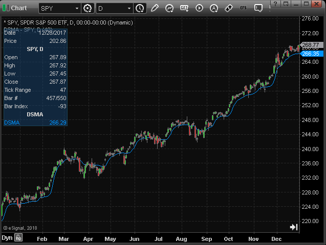
**FIGURE 2: eSIGNAL. Here is an example of the study plotted on a daily chart of SPY.**

---

## WEALTH-LAB: JULY 2018

The DSMA described by John Ehlers in his article in this issue, “The Deviation-Scaled Moving Average,” is an adaptive moving average that rapidly adapts to volatility in price movement. We’re going to illustrate in few easy steps how to set up a DSMA-based trading system in Wealth-Lab without coding.

Before anything else, install (or update) the TASCIndicators library from our website, Wealth-Lab.com. Figure 3 demonstrates how to choose the indicator from the library.

Although the indicator is best suited for trend-following, for kicks, let’s make our entry and exit countertrend. The idea is to buy at next open when today’s closing price has crossed a percentage below the 40-period DSMA. The opposite applies to exits but the percentage can of course be asymmetric.

You also have the option to click on the icon that appears next to the indicator to expose its parameter slider. This makes it possible to change, for example, DSMA’s responsiveness by varying its lookback period. As you keep dragging the slider at the bottom-left of the screen, the changes in the trading system are executed automatically.

Figure 4 is a chart implementing the indicator with example trades.

—Gene Geren (Eugene), Wealth-Lab team MS123, LLC www.wealth-lab.com


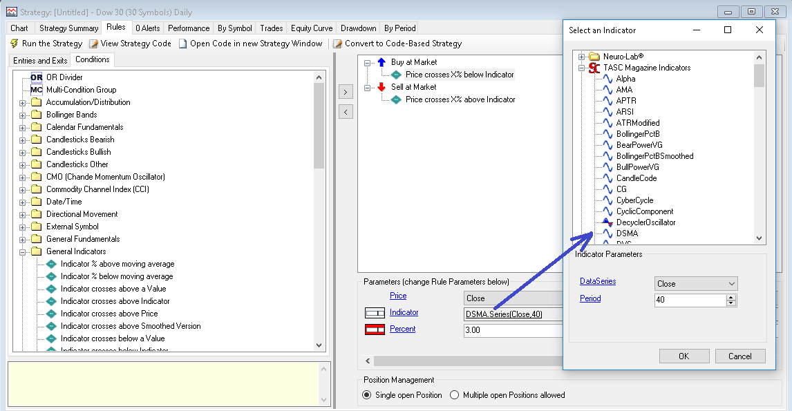
**FIGURE 3: WEALTH-LAB. This shows how to choose DSMA as the indicator.**

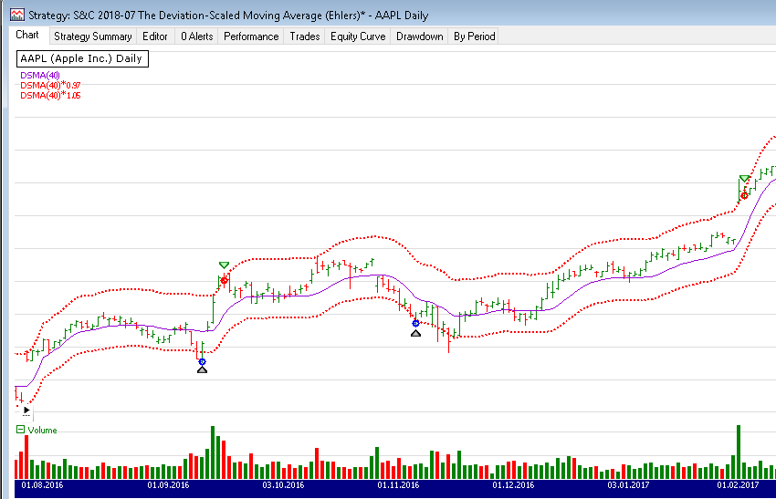
**FIGURE 4: WEALTH-LAB. This chart shows some example trades on AAPL (Apple Inc.) using the DSMA.**

---

## NINJATRADER: JULY 2018

The DSMA, as discussed by John Ehlers in his article in this issue, “The Deviation-Scaled Moving Average,” is available for download at the following links for NinjaTrader 8 and NinjaTrader 7:

Once the file is downloaded, you can import the indicator into NinjaTader 8 from within the Control Center by selecting Tools → Import → NinjaScript Add-On and then selecting the downloaded file for NinjaTrader 8. To import into NinjaTrader 7, from within the Control Center window, select the menu File → Utilities → Import NinjaScript and select the downloaded file.

You can review the indicator’s source code in NinjaTrader 8 by selecting the menu New → NinjaScript Editor → Indicators from within the Control Center window and selecting the DSMA file. You can review the indicator’s source code in NinjaTrader 7 by selecting the menu Tools → Edit NinjaScript → Indicator from within the Control Center window and selecting the DSMA file.

NinjaScript uses compiled DLLs that run native, not interpreted, which provides you with the highest possible performance.

A sample chart implementing the indicator is shown in Figure 5.

—Raymond Deux & Jim Dooms NinjaTrader, LLC www.ninjatrader.com


The NinjaTrader C# source file is available at [ninja-trader/DSMA.cs](ninja-trader/DSMA.cs).

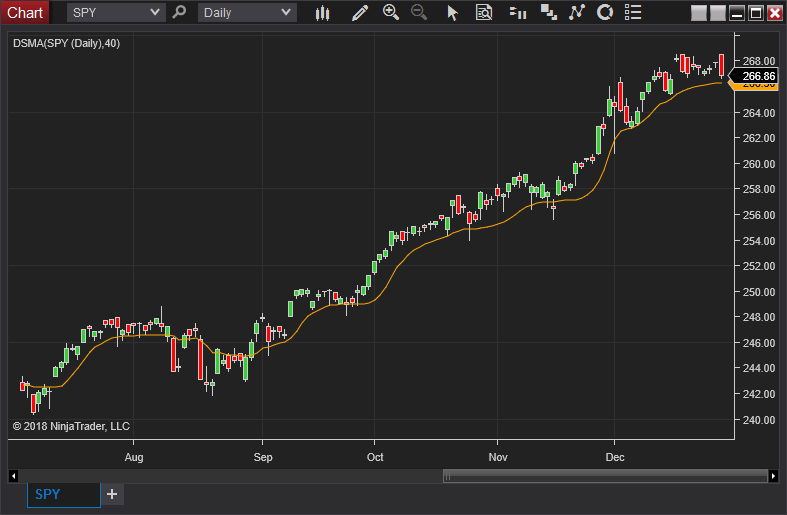
**FIGURE 5: NINJATRADER. The DSMA indicator is shown on SPY from July 3, 2017 to December 29, 2017.**

---

## NEUROSHELL TRADER: JULY 2018

The deviation-scaled moving average described by John Ehlers in his article in this issue can be easily implemented in NeuroShell Trader using NeuroShell Trader’s ability to call external dynamic linked libraries. Dynamic linked libraries can be written in C, C++, or Power Basic.

After moving the code given in the article to your preferred compiler and creating a DLL, you can insert the resulting indicators as follows:

Similar filter-based and cycle-based strategies may also be created using indicators found in John Ehlers’ Cybernetic and MESA91 NeuroShell Trader Add-ons.

Users of NeuroShell Trader can go to the Stocks & Commodities section of the NeuroShell Trader free technical support website to download a copy of this or any previous Traders’ Tips.

A sample NeuroShell Trader chart is shown in Figure 6.

—Marge Sherald, Ward Systems Group, Inc. 301 662-7950, sales@wardsystems.com www.neuroshell.com


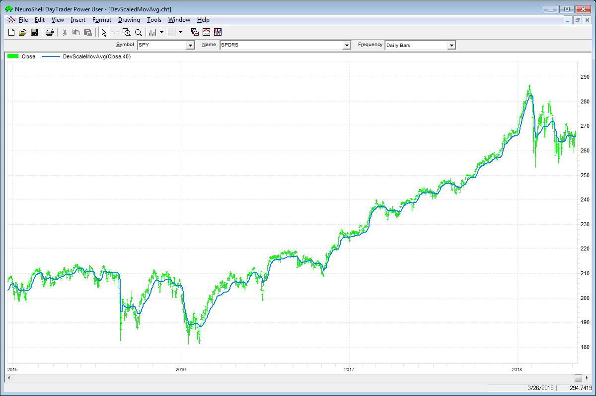
**FIGURE 6: NEUROSHELL TRADER. This sample NeuroShell Trader chart displays the deviation-scaled moving average.**

---

## AMIBROKER: JULY 2018

In “The Deviation-Scaled Moving Average” in this issue, author John Ehlers presents a variable-period (adaptive) exponential moving average. The code listing shown here contains a ready-to-use formula for the DSMA. To adjust parameters for the indicator, right-click on the chart and select parameters from the context menu. A sample chart is shown in Figure 7.

—Tomasz Janeczko, AmiBroker.com www.amibroker.com


```c
// Deviation Scaled Moving Average (DSMA) 
// TASC Traders Tips July 2018 
Period = Param( "Period", 40, 2, 100, 1 ); 

PI = 3.1415926; 

a1 = exp( -1.414 * PI / ( 0.5 * Period ) ); 
b1 = 2 * a1 * cos( 1.414 * PI / ( 0.5 * Period ) ); 
c2 = b1; 
c3 = -a1 * a1; 
c1 = 1 - c2 - c3; 

Zeros = Close - Ref( Close, -2 ); 

// SuperSmoother Filter 
Filt = IIR( Zeros, c1 * 0.5, c2, c1 * 0.5, c3 ); 

// Compute Standard Deviation 
RMS = Sum( Filt * Filt, Period ); 
RMS = sqrt( RMS / Period ); 

// Rescale Filt in terms of Standard Deviations 
ScaledFilt = Filt / RMS; 
alpha1 = abs( ScaledFilt ) * 5 / Period; 

DSMA = AMA( Close, alpha1 ); 

Plot( DSMA, "DSMA"+ Period, colorBlue, styleThick ); 

Plot( C, "Price", colorDefault, styleCandle );
```

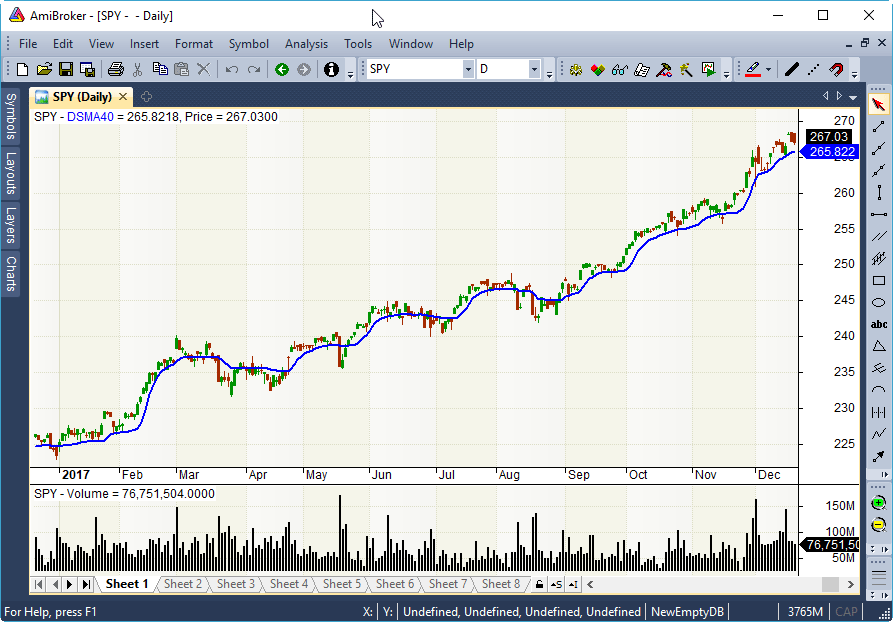
**FIGURE 7: AMIBROKER. Here is a daily chart of the SPY with the deviation-scaled moving average (blue line), replicating the chart from John Ehlers’ article in this issue.**

---

## JUICYCHARTS.COM: JULY 2018

We implemented the deviation-scaled moving average described in John Ehlers’ article in this issue using JuicyChart.com’s Javascript coding feature. To see the indicator on an interactive chart, see the following link:

In the interactive chart shown in the above link, note the slider above the chart. You can manipulate the slider to change the DSMA period value. Either drag the slider or click on the labels flanking it to make single point adjustments. As you change the slider value, your change is reflected in the chart immediately (Figure 8).

Below the chart, you can examine the Javascript code that produced the indicator (Figure 9). If you want to explore further, including applying the indicator to different stock or cryptocurrency symbols, use the link below the code to open it in a new chart window. Note that you must be logged in with a JuicyCharts account, which is free, to use this feature.

—Dion Kurczek Founder of Quantacula and JuicyCharts.com info@quantacula.com


```javascript
var MyModel = {};

//create parameter for period
MyModel.createParameters = function() {
  this.addParameter("DSMA Period", ParameterTypes.Int, 30, 3, 200);
};

//this function gets called once, prior to entering the main loop
MyModel.initialize = function(bars) { 
    var period = this.parameters[0].value;
    var source = bars.close;
  
    var prev = source[period - 1];
    var a1 = Math.exp(-1.414 * 3.14159 / (0.5 * period)); 
    var term = 1.414 * 180 / (0.5 * period);
    var radians = term * Math.PI / 180;
    var b1 = 2 * a1 * Math.cos(radians); 
    var c2 = b1; 
    var c3 = -a1 * a1; 
    var c1 = 1 - c2 - c3;
    var zeroes = new Array(source.length);
    zeroes.fill(0);
    var filt = new Array(source.length);
    filt.fill(1);
    var result = new Array(source.length);
    result.fill(Number.NaN);
    for(var n = 2; n < source.length; n++) {
      zeroes[n] = source[n] - source[n - 2];
      filt[n] = c1 * (zeroes[n] + zeroes[n - 1]) / 2 + c2 * filt[n - 1] + c3 * filt[n - 2];
      if (n < period) {
        continue;
      }
      var RMS = 0; 
      for(var count = 0; count < period; count++) {
        RMS = RMS + filt[n - count] * filt[n - count];
      }
      RMS = Math.sqrt(RMS / period);
      var ScaledFilt = filt[n] / RMS; 
      var alpha1 = Math.abs(ScaledFilt) * 5 / period; 
      result[n] = alpha1 * source[n] + (1 - alpha1) * prev;
      prev = result[n];
  };
  this.plot(result, "DSMA", "orange", 3);
};
  
//this function gets called once for every bar of data in the chart
MyModel.execute = function(bars, idx) {
};
return MyModel;
```

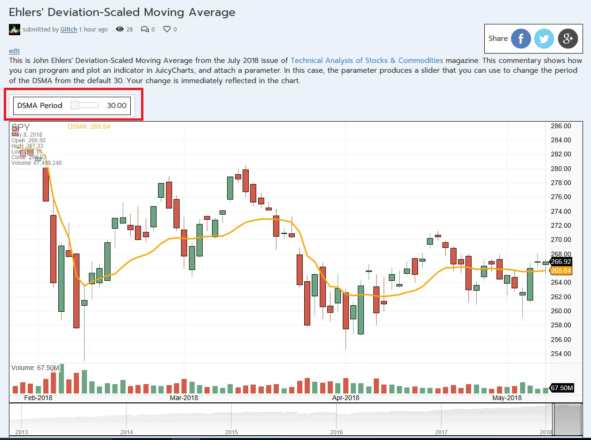
**FIGURE 8: JUICYCHARTS. The DSMA indicator is shown here on a chart from JuicyCharts.com. The slider allows you to manipulate the period.**

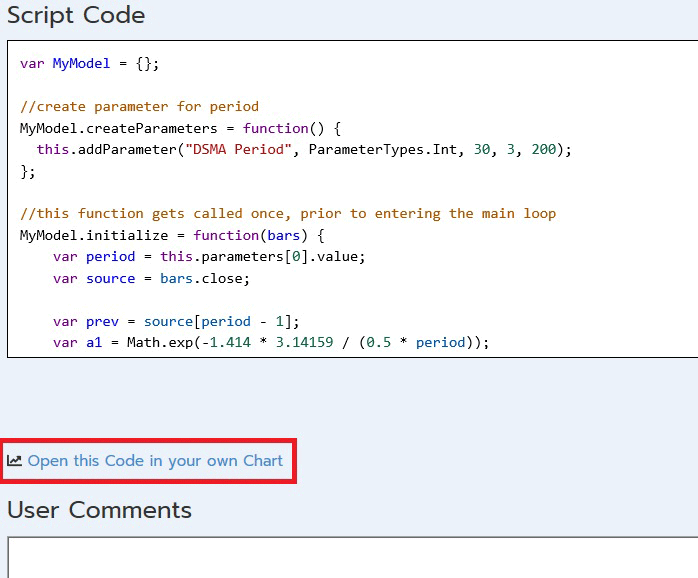
**FIGURE 9: JUICYCHARTS. The Javascript code for the indicator appears below the chart.**

---

## TRADERSSTUDIO: JULY 2018

The TradersStudio code based on John Ehlers’ article in this issue, “The Deviation-Scaled Moving Average,” is provided at www.TradersEdgeSystems.com/traderstips.htm .

Figure 10 shows the DSMA indicator (white line) on a chart of Yahoo (YHOO) during part of 2006.

The TradersStudio code is shown here:

—Richard Denning info@TradersEdgeSystems.com for TradersStudio


```basic
'DEVIATION SCALED MOVING AVERAGE (DSMA)
'Author: John F. Ehlers, TASC July 2018 
'Coded by: Richard Denning 5/9/18
'www.TradersEdgeSystems.com

Function DSMA(Period) As BarArray
Dim  a1, b1, c1, c2, c3, Zeros As BarArray, Filt As BarArray, ScaledFilt, RMS, count, alpha1
    If CurrentBar = 1 Then
'Smooth with a Super Smoother
        a1 = Exp(-1.414*3.14159 / (0.5*Period))
        b1 = 2*a1*Cos(DegToRad(1.414*180 / (0.5*Period)))
        c2 = b1
        c3 = -a1*a1
        c1 = 1 - c2 - c3
    End If
    Zeros = Close - Close[2]
'SuperSmoother Filter
    Filt = c1*(Zeros + Zeros[1]) / 2 + c2*Filt[1] + c3*Filt[2]
'Compute Standard Deviation
    RMS = 0
    For count = 0 To Period - 1
        RMS = RMS + Filt[count]*Filt[count]
    Next
    If Period <> 0 Then RMS = Sqr(RMS / Period)
'Rescale Filt in terms of Standard Deviations
    If RMS <> 0 Then ScaledFilt = Filt / RMS
    If Period <> 0 Then alpha1 = Abs(ScaledFilt)*5 / Period
    DSMA = alpha1*Close + (1 - alpha1)*DSMA[1]
End Function
'-----------------------------------------------------------
Sub EHLERS_DSMA_IND(dsmaLen)
Dim theDSMA As BarArray
theDSMA = DSMA(dsmaLen)
plot1(theDSMA)
End Sub
'-----------------------------------------------------------
```

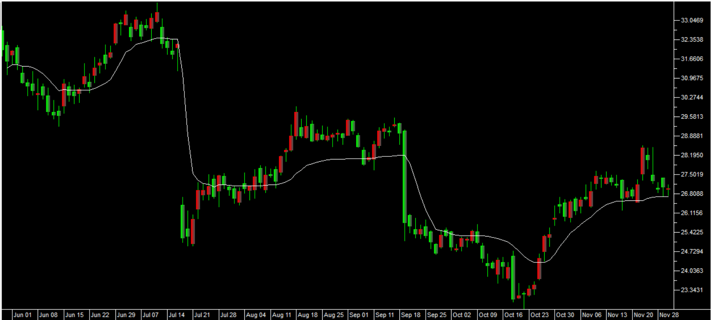
**FIGURE 10: TRADERSSTUDIO. This chart shows the DSMA indicator (white line) on a chart of Yahoo during part of 2006.**

---

## THINKORSWIM: JULY 2018

We have put together a study for thinkorswim based on the article “The Deviation-Scaled Moving Average” by John Ehlers in this issue.

We built the study using our proprietary scripting language, thinkscript. We have made the loading process extremely easy; simply go to https://tos.mx/yPg8au , then choose to view the thinkScript study, and name it “DeviationScaledMovingAverage.”

Overlaid on the daily chart of symbol HP in Figure 11 is the DeviationScaledMovingAverage. See Ehlers’ article for more details on the interpretation of the study.

—Brad Nave, thinkorswim A division of TD Ameritrade, Inc. www.thinkorswim.com


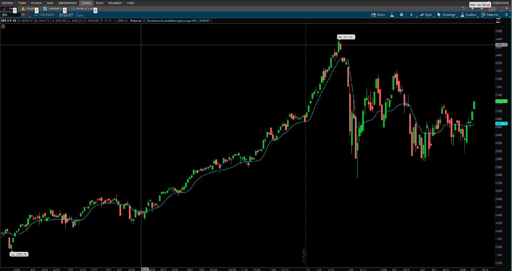
**FIGURE 11: THINKORSWIM. Overlaid on a daily chart of symbol HP is the DeviationScaledMovingAverage.**

---

## MICROSOFT EXCEL: JULY 2018

In his article in this issue, “The Deviation-Scaled Moving Average,” John Ehlers gives us a variation on the exponential moving average that scales its sensitivity using a moving standard deviation as a measure of the volatility of the data being averaged. This allows the resulting moving average to rapidly adapt to volatility in the data (Figure 12).

The spreadsheet file for this Traders’ Tip can be downloaded here . To successfully download it, follow these steps:

A fix for previous Excel spreadsheets, required due to Yahoo modifications, can be found here: https://traders.com/files/Tips-ExcelFix.html

—Ron McAllister Excel and VBA programmer rpmac_xltt@sprynet.com


Originally published in the July 2018 issue of Technical Analysis of STOCKS & COMMODITIES magazine. All rights reserved. © Copyright 2018, Technical Analysis, Inc.

The Excel spreadsheet is available at [code/DeviationScaledMA.xlsm](code/DeviationScaledMA.xlsm).

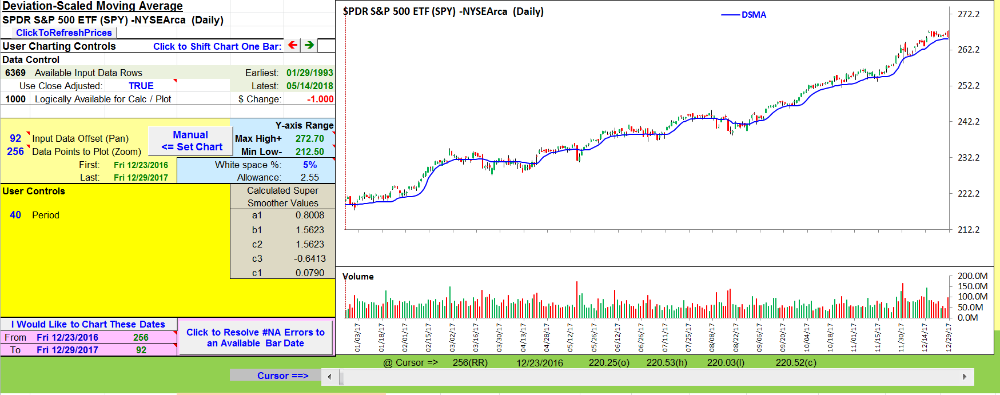
**FIGURE 12: EXCEL. This sample chart shows the deviation-scaled moving average on the SPY.**

---

## BibTeX

```bibtex
@misc{traders_tips_2018_07,
  author = {{Technical Analysis of STOCKS \& COMMODITIES}},
  title = {Traders' Tips: The Deviation-Scaled Moving Average},
  year = {2018},
  month = jul,
  howpublished = {online},
  url = {https://www.traders.com/Documentation/FEEDbk_docs/2018/07/TradersTips.html}
}
```