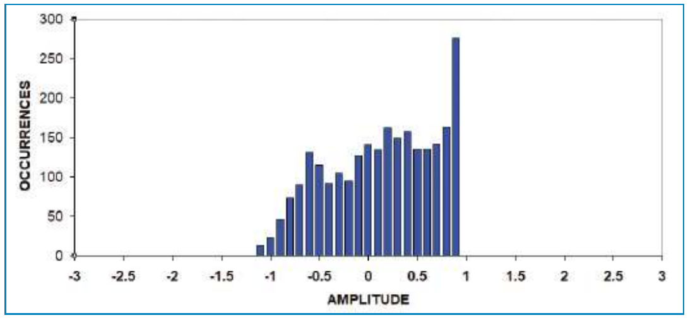
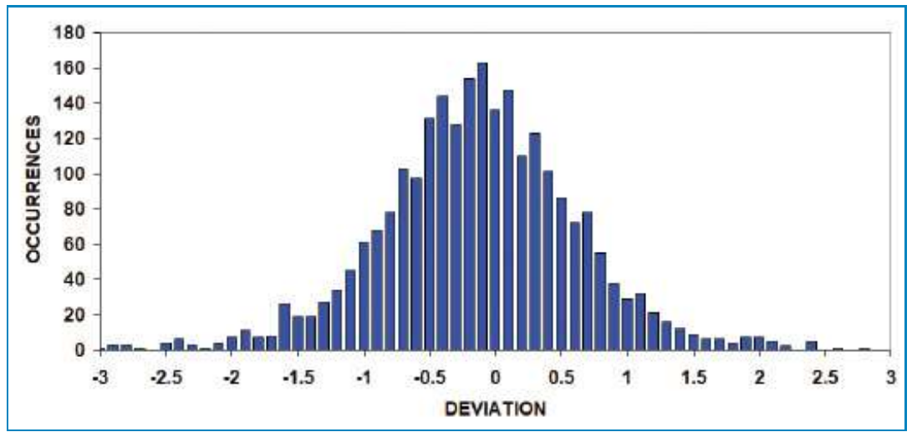
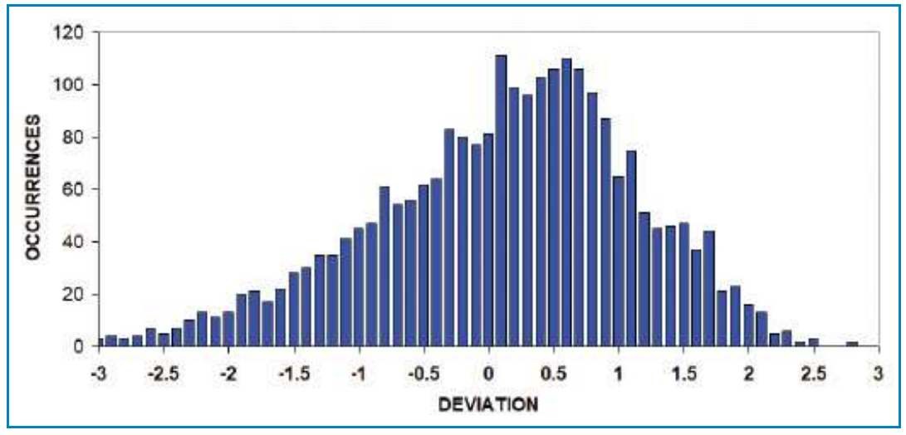
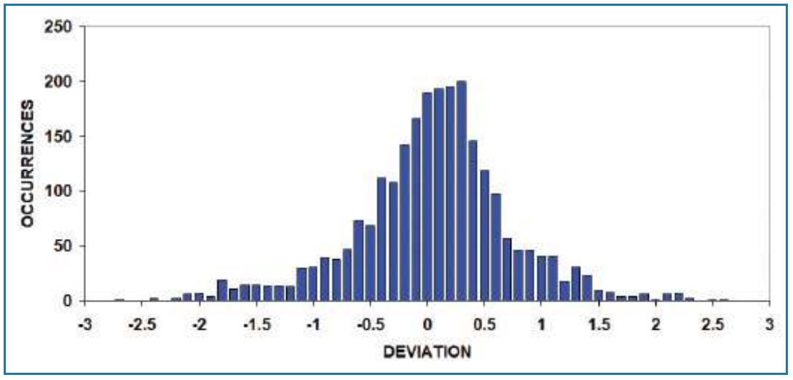

# Probability: Probably A Good Thing To Know

- **Author:** John Ehlers
- **Publication:** Technical Analysis of STOCKS & COMMODITIES, Volume 36, October 2018, pp. 10--14
- **Article URL:** [Article PDF](https://technical.traders.com/archive/article.asp?file=\V36\C10\728EHLE.pdf)
- **Traders' Tips URL:** [Traders' Tips, October 2018](https://www.traders.com/Documentation/FEEDbk_docs/2018/10/TradersTips.html)

---

*The idea of reversion to the mean is one that traders tend to take for granted. Can you confidently assume all indicators subscribe to the normal probability distribution? Here, we measure the probability distribution of a few indicators to determine if they can be used as part of your reversion-to-the-mean trading strategy.*

Swing trading, or reversion to the mean, is a popular trading style mainly because it is a strategy that typically yields a relatively high percent of winning trades. The idea behind it is that if prices have swung far enough from their mean price, there is high probability that price will swing back to the mean value. Two of the most inelegant technical analysis terms—overbought and oversold—imply probability considerations. There are a number of strategies based on overbought and oversold conditions. For example, a commonly promoted rule is to buy when an RSI is crossing over 20. The assumption is that when RSI is *below* 20, it is a low-probability event and prices could recover back toward the mean. Similarly, the complimentary rule is to sell short when the RSI is crossing under 80.

## Let's Challenge Those Assumptions

It turns out that measuring the probability distribution of an oscillator-type indicator is relatively easy. First of all, you can assume the oscillator has a zero mean. If it doesn't have a zero mean, it will be apparent in the probability distribution measurement itself.

Next, assume the oscillator swings between -3 and +3. (I will revisit the oscillator with scaling to make this a good assumption.) I will provide 30 bins below zero and 30 bins above zero in which to place the indicator value on each bar through history, and accumulate the bin counts across the data history. Then, on the last bar on the chart, I export all the bin values to a text file. I can then import this text file into Excel and plot the occurrences in each of the bins as a bar chart. The result is the probability density of the indicator.

In the sidebar "EasyLanguage Code For Measuring Probability Distribution," I provide a listing titled "Code fragment to measure indicator probability distribution" that shows how to accumulate the bin counts and export them to a text file.

In my May 2018 Stocks & Commodities article "RocketRSI," I described an RSI indicator that swings from -1 to +1. I'll use that indicator to measure the probability distribution of an RSI. You can find the complete code listing for doing this in "MyRSI With Probability Distribution Measurement" in the sidebar to this article. Since this RSI only swings from -1 to +1, I won't be using all the bins, but it will still provide a good handle on the probability distribution itself.

The measured probability density of the MyRSI indicator, measured with default settings and applied to daily data of SPY for the 10-year period from January 1, 2008 to December 31, 2017, can be seen in Figure 1. The probability distribution is certainly


*FIGURE 1: RSI MEASURED WITH DEFAULT SETTINGS ON SPY FROM JANUARY 1, 2008 TO DECEMBER 31, 2017. Here you see the RSI probability distribution is nearly uniform with an upside bias because of the uptrend in data over the time period analyzed.*

not the bell-shaped probability distribution that is commonly assumed. I would characterize it as having a nearly uniform probability distribution with a bias toward the upside due to the uptrend in the data over the 10-year period. Certainly, this probability distribution shows the RSI should not be your indicator of choice to swing trade the SPY. The probability of being "overbought" is more than twice the probability at the mean. The upside bias due to the general trend up is also apparent in Figure 1.

## But There Is A Way Around It

All is not lost if you really want to use reversion to the mean as your trading strategy. A characteristic of the nonlinear Fisher transform is to convert virtually any waveform into a waveform having a nearly bell-shaped Gaussian probability distribution. I used this characteristic of the Fisher transform when I described the RocketRSI. The RocketRSI swings are limited to plus and minus three standard deviations, which is the reason I scaled the bins to measure probabilities to range between -3 and +3. The code for the RocketRSI is repeated here from my earlier article and can be found in the code listing "RocketRSI with probability distribution measurement" in the sidebar to this article, with the code to measure the probability distribution appended.

When you apply the RocketRSI indicator to the same 10-year span of SPY data, it results in the beautiful bell-shaped probability distribution you see in Figure 2. The nearly Gaussian probability distribution means we have an indicator that we can use in a reversion-to-the-mean strategy with confidence.

For example, if the indicator crosses above -2, this means it is departing a region that has only a 2.5% probability of occurring. In other words, there is a high probability of reversion to the mean, and that is a good opportunity to buy. Alternatively, you could anticipate the turning point by buying when the RocketRSI crosses under the -2 level. You might be a little early in your entry if you use this strategy, but you have also mitigated some of the lag created by calculating the indicator itself.


*FIGURE 2: ROCKET RSI INDICATOR'S EFFECT ON PROBABILITY DISTRIBUTION. The RocketRSI has a bell-shaped Gaussian probability distribution, which suggests it's an indicator that could be used in a mean-reversion strategy.*

## Beyond RSI

The use of indicators for swing trading or reversion-to-the-mean strategies isn't limited to the RSI. For example, I created a simple oscillator indicator in my July 2018 Stocks & Commodities article "Deviation-Scaled Moving Average." The code for this oscillator is shown in the code listing titled "Deviation-scaled oscillator" in the sidebar to this article, with the code to measure the probability distribution appended.

That indicator starts with an oscillator called *zeros* that is a simple two-bar difference of prices. This oscillator is important because of two characteristics in its transfer response, which I'll describe next.

First, when the cycle periods are long, and at the limit there is no change in price, the transfer response is zero. It is this characteristic that provides the nominal zero mean in the oscillator output. Further, its filter rolloff from shorter-cycle periods is -6 dB per octave. Market data is fractal, meaning the cycle amplitudes in its spectrum increase in direct proportion to their cycle periods. That means the data cycle amplitudes increase statistically at the rate of 6 dB per octave. Since the oscillator rolloff is -6 dB per octave and spectrum amplitudes are statistically increasing at the rate of +6 dB per octave, the result is that the zeros oscillator whitens the price spectrum. This is a good thing.

Second, when the cycle period is exactly at twice the sampling rate, the samples are exactly one cycle period apart. This is called the Nyquist frequency period and is the shortest possible period in sampled data. In the zeros oscillator, the transfer response is zero at the Nyquist period because the samples are exactly one period apart for that spectral component. Having a zero in the transfer response at the Nyquist period eliminates the 6 dB increase in noise produced by a simple one-bar difference. Having a zero in the transfer response at the Nyquist period also reduces the impact of aliased data in the oscillator output.

The zeros oscillator output is smoothed in my two-pole SuperSmoother filter (for more on this, see my January 2014 S&C article "Predictive And Successful Indicators"). The critical period of the SuperSmoother filter is the "half the input" period to retain the oscillator's responsiveness, and the filter coefficients are calculated only on the first bar of data for computational efficiency.

Since the zeros oscillator has a nominally zero mean, the SuperSmoother filter output also has a nominally zero mean. Therefore, the standard deviation can be calculated as the square root of the average sum of the squares of the smoothed filter waveform over the input period. This is commonly called the root mean square (RMS).

> **Not all oscillators are suitable for swing trading because their probability distributions don't necessarily have low-probability events at the extreme swings of the indicator.**

Dividing the RMS into the smoothed filter waveform scales the waveform in terms of standard deviations, and you can evaluate the indicator by measuring its probability distribution. I did that using the same data as before, and Figure 3 shows the oscillator is suitable for swing trading, but the trend bias is obvious and the distribution has "fat tails." That is, the probability of being further from the mean is higher than a Gaussian probability distribution would have at the same deviation. This necessarily reduces the efficacy of the indicator for swing trading.


*FIGURE 3: PROBABILITY DISTRIBUTION FOR DEVIATION-SCALED OSCILLATOR. The oscillator is suitable for swing trading but there is a trend bias and the distribution has "fat tails."*

It is possible to improve the probability distribution by using a trick associated with the Fisher transform. The indicator is already scaled in terms of standard deviations. You don't care much if the deviation exceeds an absolute value of 2. So you simply apply the Fisher transform to absolute values of the indicator that are less than 2, and divide the input to the Fisher transform by 2 to avoid having the transform blow up. Fisher transform inputs must be limited to absolute values less than unity. In the code listing "Deviation-scaled oscillator with Fisher transform" in this article's sidebar, you see the same code as for the deviation-scaled oscillator but with the Fisher transform trick included.

When the Fisher transform is introduced with this trick and added to the deviation-scaled oscillator, and the oscillator is applied to the same data as before, it results in the nearly perfect bell-shaped Gaussian probability distribution. This is demonstrated in Figure 4.


*FIGURE 4: ADDING THE FISHER TRANSFORM TO THE DEVIATION-SCALED OSCILLATOR. This improved the probability distribution, as can be seen by the nearly perfect bell-shaped Gaussian probability distribution. This makes it a suitable indicator for swing trading.*

## Low Or High Probability?

Not all oscillators are suitable for swing trading because their probability distributions don't necessarily have low-probability events at the extreme swings of the indicator. With this article, I have provided a code fragment that can be appended to any properly scaled oscillator and modified to produce the probability distribution of that oscillator on any data symbol of your choice. If the oscillator is not scaled, you can apply the RMS scaling without distorting the oscillator response or introducing any computational lag. Almost any oscillator-type indicator can have its probability distribution improved for swing trading by applying the Fisher transform using the technique I've described here and that is shown in the code listing "Deviation-scaled oscillator with Fisher transform" in the sidebar to this article.

Good swing trading!

---

*Stocks & Commodities Contributing Editor John Ehlers is a pioneer in the use of cycles and DSP technical analysis. He is president of MESA Software and cofounder of StockSpotter.com and BeYourOwnHedgeFund.com, which is a new site that provides portfolios based on his algorithmic strategies.*

## Further Reading

Ehlers, John F. [2018]. "RocketRSI—A Solid Propellant For Your Rocket Science Trading," *Technical Analysis of* Stocks & Commodities, Volume 36: May.

——— [2018]. "The Deviation-Scaled Moving Average," *Technical Analysis of* Stocks & Commodities, Volume 36: July.

——— [2014]. "Predictive And Successful Indicators," *Technical Analysis of* Stocks & Commodities, Volume 32: January.

Ehlers, John F. [2013]. *Cycle Analytics For Traders*, Wiley.

‡TradeStation

*‡See Editorial Resource Index*

*The code given in this article is available in the Article Code section of our website, Traders.com.*

*See our Traders' Tips section beginning on page 48 for commentary and implementation of John Ehlers' technique in various technical analysis programs. Accompanying program code can be found in the Traders' Tips area at Traders.com.*

## EasyLanguage Code For Measuring Probability Distribution

### Code fragment to measure indicator probability distribution

```easylanguage
For I = 1 to 60 Begin
    J = (I - 31) / 10;
    K = (I - 30) / 10;
    If Indicator > J and Indicator <= K Then Bin[I] = Bin[I] + 1;
End;

If LastBarOnChart Then Begin
    For I = 1 to 61 Begin
        Print(File("C:\ProbabilityDensity.CSV"), (I - 31) / 10, ",", Bin[I]);
    End;
End;
```

### MyRSI with probability distribution measurement

```easylanguage
{
    MyRSI Indicator
    (C) 2005-2018  John F. Ehlers
}

Inputs:
    SmoothLength(8),
    RSILength(14);

Vars:
    a1(0), b1(0), c1(0), c2(0), c3(0), Filt(0), Mom(0), count(0), CU(0), CD(0),
    MyRSI(0), I(0), J(0), K(0);

Arrays:
    Bin[61](0);

//Compute Super Smoother coefficients once
If CurrentBar = 1 Then Begin
    a1 = expvalue(-1.414*3.14159 / (SmoothLength));
    b1 = 2*a1*Cosine(1.414*180 / (SmoothLength));
    c2 = b1;
    c3 = -a1*a1;
    c1 = 1 - c2 - c3;
End;

//SuperSmoother Filter
Filt = c1*(Close + Close[1]) / 2 + c2*Filt[1] + c3*Filt[2];

//Accumulate "Closes Up" and "Closes Down"
CU = 0;
CD = 0;
For count = 0 to RSILength -1 Begin
    If Filt[count] - Filt[count + 1] > 0 Then CU = CU + Filt[count] -
        Filt[count + 1];
    If Filt[count] - Filt[count + 1] < 0 Then CD = CD + Filt[count + 1] -
        Filt[count];
End;
If CU + CD <> 0 Then MyRSI = (CU - CD) / (CU + CD);

Plot1(MyRSI);
Plot2(0);

//Bin the indicator values in Bins from -3 to +3
For I = 1 to 60 Begin
    J = (I - 31) / 10;
    K = (I - 30) / 10;
    If MyRSI > J and MyRSI <= K Then Bin[I] = Bin[I] + 1;
End;

//Output the Bin measurements to a file
If LastBarOnChart Then Begin
    For I = 1 to 61 Begin
        Print(File("C:\ProbabilityDensity.CSV"), (I - 31) / 10, ",", Bin[I]);
    End;
End;
```

### RocketRSI with probability distribution measurement

```easylanguage
{
    RocketRSI Indicator
    (C) 2005-2018  John F. Ehlers
}

Inputs:
    SmoothLength(8),
    RSILength(10);

Vars:
    a1(0), b1(0), c1(0), c2(0), c3(0), Filt(0), Mom(0), count(0), CU(0),
    CD(0), MyRSI(0), RocketRSI(0), I(0), J(0), K(0);

Arrays:
    Bin[61](0);

//Compute Super Smoother coefficients once
If CurrentBar = 1 Then Begin
    a1 = expvalue(-1.414*3.14159 / (SmoothLength));
    b1 = 2*a1*Cosine(1.414*180 / (SmoothLength));
    c2 = b1;
    c3 = -a1*a1;
    c1 = 1 - c2 - c3;
End;

//Create half dominant cycle Momentum
Mom = Close - Close[RSILength - 1];

//SuperSmoother Filter
Filt = c1*(Mom + Mom[1]) / 2 + c2*Filt[1] + c3*Filt[2];

//Accumulate "Closes Up" and "Closes Down"
CU = 0;
CD = 0;
For count = 0 to RSILength -1 Begin
    If Filt[count] - Filt[count + 1] > 0 Then CU = CU + Filt[count] -
        Filt[count + 1];
    If Filt[count] - Filt[count + 1] < 0 Then CD = CD + Filt[count + 1] -
        Filt[count];
End;
If CU + CD <> 0 Then MyRSI = (CU - CD) / (CU + CD);

//Limit RocketRSI output to +/- 3 Standard Deviations
IF MyRSI > .999 Then MyRSI = .999;
If MyRSI < -.999 Then MyRSI = -.999;

//Apply Fisher Transform to establish Gaussian Probability Distribution
RocketRSI = .5*Log((1 + MyRSI) / (1 - MyRSI));

Plot1(RocketRSI);
Plot2(0);

//Bin the indicator values in Bins from -3 to +3
For I = 1 to 60 Begin
    J = (I - 31) / 10;
    K = (I - 30) / 10;
    If RocketRSI > J and RocketRSI <= K Then Bin[I] = Bin[I] + 1;
End;

//Output the Bin measurements to a file
If LastBarOnChart Then Begin
    For I = 1 to 61 Begin
        Print(File("C:\ProbabilityDensity.CSV"), (I - 31) / 10, ",", Bin[I]);
    End;
End;
```

### Deviation-scaled oscillator

```easylanguage
// Deviation Scaled Oscillator
// (c) 2013 - 2018 John F. Ehlers

Inputs:
    Period(40);

Vars:
    a1(0), b1(0), c1(0), c2(0), c3(0), Zeros(0), Filt(0), RMS(0),
    count(0), ScaledFilt(0), I(0), J(0), K(0);

Arrays:
    Bin[61](0);

If CurrentBar = 1 Then Begin
    //Smooth with a Super Smoother
    a1 = expvalue(-1.414*3.14159 / (.5*Period));
    b1 = 2*a1*Cosine(1.414*180 / (.5*Period));
    c2 = b1;
    c3 = -a1*a1;
    c1 = 1 - c2 - c3;
End;

//Produce Nominal zero mean with zeros in the transfer response at
//  DC and Nyquist with no spectral distortion
//Nominally whitens the spectrum because of 6 dB per octave rolloff
Zeros = Close - Close[2];

//SuperSmoother Filter
Filt = c1*(Zeros + Zeros[1]) / 2 + c2*Filt[1] + c3*Filt[2];

//Compute Standard Deviation
RMS = 0;
For count = 0 to Period - 1 Begin
    RMS = RMS + Filt[count]*Filt[count];
End;
RMS = SquareRoot(RMS / Period);

//Rescale Filt in terms of Standard Deviations
If RMS <> 0 Then ScaledFilt = Filt / RMS;

Plot1(ScaledFilt);
Plot2(0);

//Bin the indicator values in Bins from -3 to +3
For I = 1 to 60 Begin
    J = (I - 31) / 10;
    K = (I - 30) / 10;
    If ScaledFilt > J and ScaledFilt <= K Then Bin[I] = Bin[I] + 1;
End;

//Output the Bin measurements to a file
If LastBarOnChart Then Begin
    For I = 1 to 61 Begin
        Print(File("C:\ProbabilityDensity.CSV"), (I - 31) / 10, ",", Bin[I]);
    End;
End;
```

### Deviation-scaled oscillator with Fisher transform

```easylanguage
// Fisherized Deviation Scaled Oscillator
// (c) 2013 - 2018 John F. Ehlers

Inputs:
    Period(40);

Vars:
    a1(0), b1(0), c1(0), c2(0), c3(0), Zeros(0), Filt(0), RMS(0),
    count(0), ScaledFilt(0), FisherFilt(0), I(0), J(0), K(0);

Arrays:
    Bin[61](0);

If CurrentBar = 1 Then Begin
    //Smooth with a Super Smoother
    a1 = expvalue(-1.414*3.14159 / (.5*Period));
    b1 = 2*a1*Cosine(1.414*180 / (.5*Period));
    c2 = b1;
    c3 = -a1*a1;
    c1 = 1 - c2 - c3;
End;

//Produce Nominal zero mean with zeros in the transfer response at
//  DC and Nyquist with no spectral distortion
//Nominally whitens the spectrum because of 6 dB per octave rolloff
Zeros = Close - Close[2];

//SuperSmoother Filter
Filt = c1*(Zeros + Zeros[1]) / 2 + c2*Filt[1] + c3*Filt[2];

//Compute Standard Deviation
RMS = 0;
For count = 0 to Period - 1 Begin
    RMS = RMS + Filt[count]*Filt[count];
End;
RMS = SquareRoot(RMS / Period);

//Rescale Filt in terms of Standard Deviations
If RMS <> 0 Then ScaledFilt = Filt / RMS;

//Apply Fisher Transform to establish real Gaussian Probability
//  Distribution
If AbsValue(ScaledFilt) < 2 Then FisherFilt = .5*Log((1 + ScaledFilt /
    2) / (1 - ScaledFilt / 2));

Plot1(FisherFilt);
Plot2(0);

//Bin the indicator values in Bins from -3 to +3
For I = 1 to 60 Begin
    J = (I - 31) / 10;
    K = (I - 30) / 10;
    If FisherFilt > J and FisherFilt <= K Then Bin[I] = Bin[I] + 1;
End;

//Output the Bin measurements to a file
If LastBarOnChart Then Begin
    For I = 1 to 61 Begin
        Print(File("C:\ProbabilityDensity.CSV"), (I - 31) / 10, ",", Bin[I]);
    End;
End;
```

---

## BibTeX

```bibtex
@article{ehlers_probability_2018,
  author = {Ehlers, John F.},
  title = {Probability: Probably A Good Thing To Know},
  journal = {Technical Analysis of STOCKS \& COMMODITIES},
  volume = {36},
  number = {10},
  pages = {10--14},
  year = {2018},
  month = oct,
  url = {https://technical.traders.com/archive/article.asp?file=\V36\C10\728EHLE.pdf}
}

@misc{traders_tips_2018_10,
  author = {{Technical Analysis of STOCKS \& COMMODITIES}},
  title = {Traders' Tips: Probability: Probably A Good Thing To Know},
  year = {2018},
  month = oct,
  howpublished = {online},
  url = {https://www.traders.com/Documentation/FEEDbk_docs/2018/10/TradersTips.html}
}
```
