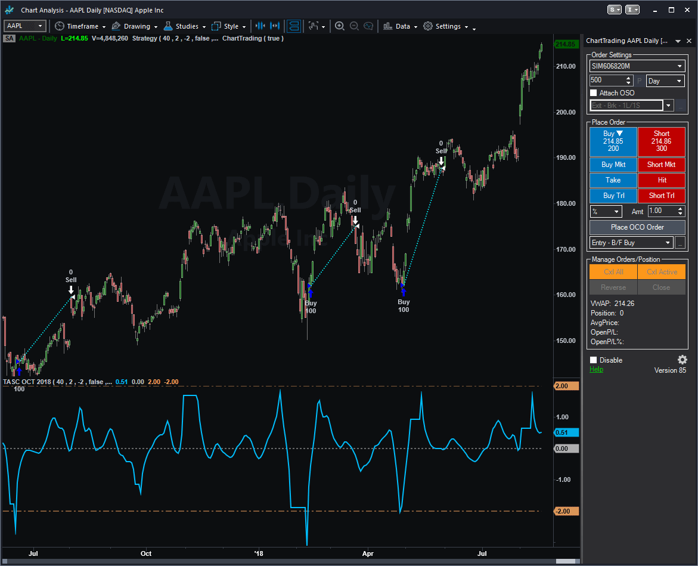
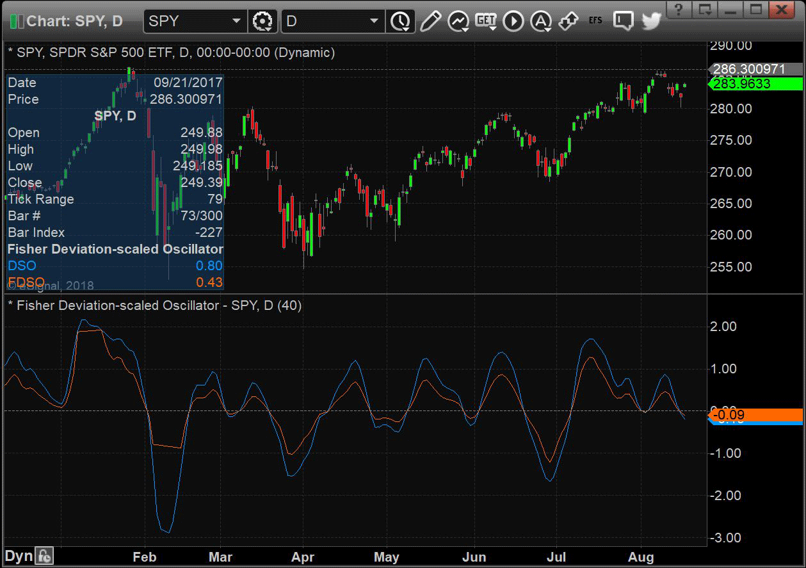
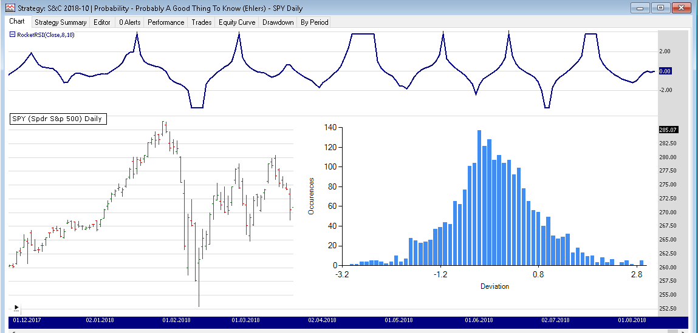
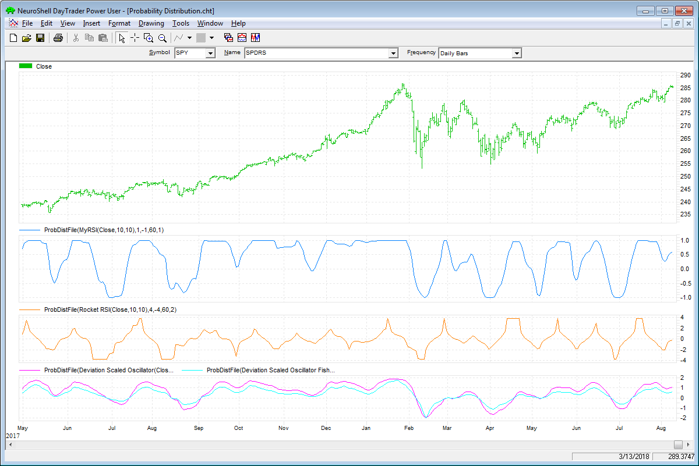
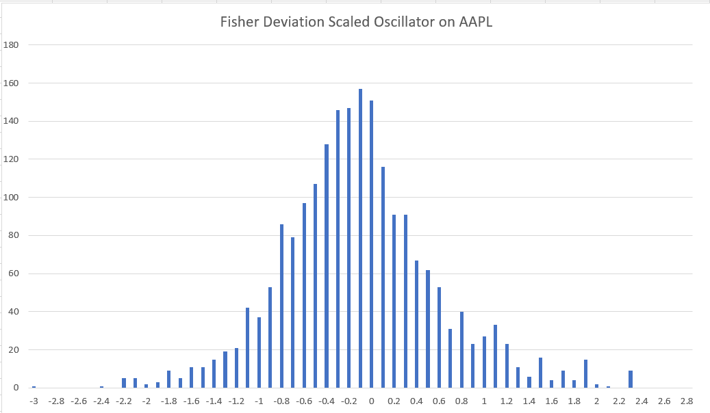
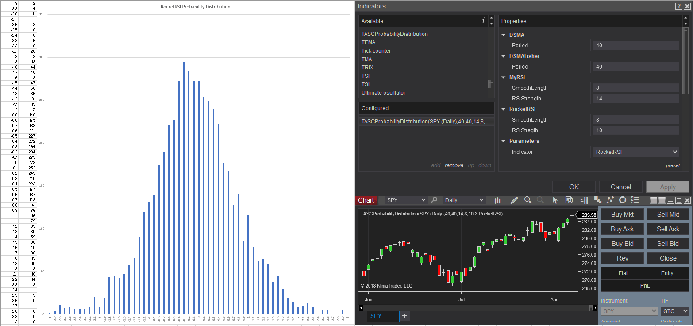
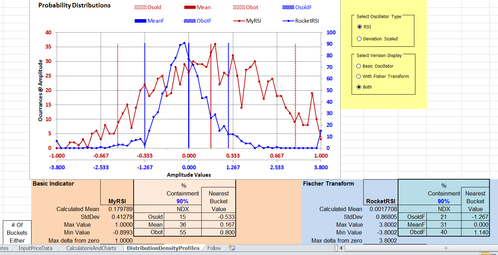
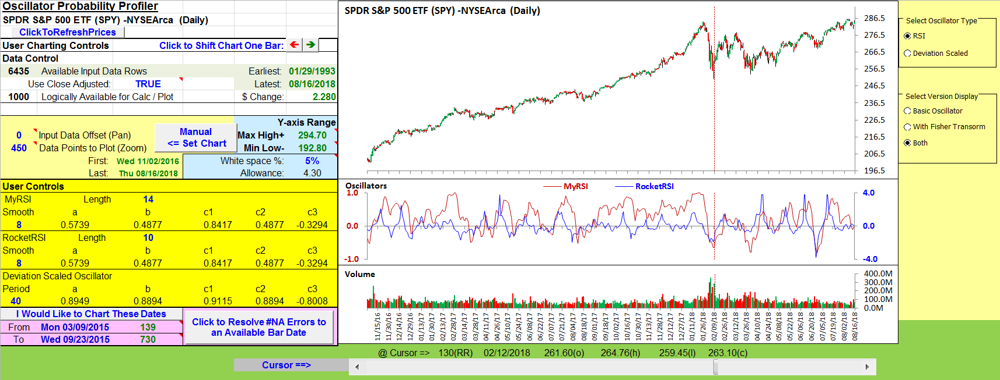

# Traders' Tips: October 2018

- **Article:** Probability: Probably A Good Thing To Know by John Ehlers
- **Traders' Tips URL:** [Traders' Tips, October 2018](https://www.traders.com/Documentation/FEEDbk_docs/2018/10/TradersTips.html)

---

## TRADESTATION: OCTOBER 2018

In “Probability—Probably A Good Thing To Know,” author John Ehlers introduces a procedure for measuring an indicator’s probability distribution to determine if it can be used as part of a reversion-to-the-mean trading strategy. The author demonstrates this method with several of his existing indicators and presents a new indicator that he calls a deviation-scaled oscillator with Fisher transform.

Here, we are providing TradeStation EasyLanguage code for an indicator and strategy based on Ehlers’ concepts.

The code for the complete set of indicators presented by the author in his article can be downloaded by visiting our TradeStation and EasyLanguage support forum. The files for this article can be found here: [https://community.tradestation.com/Discussions/Topic.aspx?Topic_ID=152631](https://community.tradestation.com/Discussions/Topic.aspx?Topic_ID=152631). The filename is “TASC_OCT2018.ZIP.”

For more information about EasyLanguage in general, please see [https://www.tradestation.com/EL-FAQ](https://www.tradestation.com/EL-FAQ).

A sample chart is shown in Figure 1.

*This article is for informational purposes. No type of trading or investment recommendation, advice, or strategy is being made, given, or in any manner provided by TradeStation Securities or its affiliates.*

—Doug McCrary

TradeStation Securities, Inc.

[www.TradeStation.com](https://www.tradestation.com/)

```easylanguage
Indicator: Fisherized Deviation Scaled Oscillator
// TASC OCT 2018
// Ehlers FDSA
inputs:
	Period( 40 ),
	OverBought( 2 ),
	OverSold( -2 ),
	OutPutData( false ),
	FilePath( "C:\ProbabilityDensity.CSV" ) ;

variables:
	a1( 0 ), b1( 0 ), c1( 0 ), c2( 0 ), 
	c3( 0 ), Zeros( 0 ), Filt( 0 ), RMS( 0 ),
	count( 0 ), ScaledFilt( 0 ), FisherFilt( 0 ), 
	Idx( 0 ), J( 0 ), K( 0 ) ;

arrays:
	Bin[61](0);


if CurrentBar = 1 Then 
//once
begin
//Smooth with a Super Smoother
	a1 = expvalue( -1.414 * 3.14159 / ( .5 * Period ) ) ;
	b1 = 2 * a1 * Cosine( 1.414 * 180 / ( .5 * Period ) ) ;
	c2 = b1 ;
	c3 = -a1 * a1 ;
	c1 = 1 - c2 - c3 ;
end ;

//Produce Nominal zero mean with zeros in the transfer response at
//DC and Nyquist with no spectral distortion
//Nominally whitens the spectrum because of 6 dB per octave rolloff
Zeros = Close - Close[2] ;

//SuperSmoother Filter
Filt = c1 * ( Zeros + Zeros[1] ) 
	/ 2 + c2 * Filt[1] + c3 * Filt[2] ;

//Compute Standard Deviation
RMS = 0;
For count = 0 to Period - 1 
begin
	RMS = RMS + Filt[count] * Filt[count] ;
end;
RMS = SquareRoot( RMS / Period ) ;

//Rescale Filt in terms of Standard Deviations
If RMS <> 0 then 
	ScaledFilt = Filt / RMS ;

//Apply Fisher Transform to establish real Gaussian Probability
//Distribution
If AbsValue( ScaledFilt ) < 2 then 
	FisherFilt = .5 * 
	Log( ( 1 + ScaledFilt / 2 ) / ( 1 - ScaledFilt / 2 ) ) ;
Plot1( FisherFilt, "Fisher Filt" ) ;
Plot2( 0, "ZL" ) ;
Plot3( OverBought, "OB" ) ;
Plot4( OverSold, "OS" ) ;


//Bin the indicator values in Bins from -3 to +3
if OutPutData then
begin
	For Idx = 1 to 60 
	begin
		J = (Idx - 31) / 10;
		K = (Idx - 30) / 10;
		If FisherFilt > J and FisherFilt <= K then 
			Bin[Idx] = Bin[Idx] + 1;
	end;
	
	//Output the Bin measurements to a fi le
	once ( LastBarOnChartEx ) 
	begin
		FileDelete( FilePath ) ;
		For Idx = 1 to 61 
		begin
			FileAppend( FilePath, NumToStr( .1 * ( Idx - 31 ), 1 ) 
			+ "," + NumToStr( Bin[Idx], 0 ) + NewLine ) ;
		end;
	end ;
end ;
	

Strategy: Fisherized Deviation Scaled Oscillator
// TASC OCT 2018
// Ehlers FDSA
inputs:
	Period( 40 ),
	OverBought( 2 ),
	OverSold( -2 ),
	OutPutData( false ),
	FilePath( "C:\Data\ProbabilityDensity.CSV" ) ;

variables:
	a1( 0 ), b1( 0 ), c1( 0 ), c2( 0 ), 
	c3( 0 ), Zeros( 0 ), Filt( 0 ), RMS( 0 ),
	count( 0 ), ScaledFilt( 0 ), FisherFilt( 0 ), 
	Idx( 0 ), J( 0 ), K( 0 ) ;

arrays:
	Bin[61](0);


if CurrentBar = 1 Then 
//once
begin
//Smooth with a Super Smoother
	a1 = expvalue( -1.414 * 3.14159 / ( .5 * Period ) ) ;
	b1 = 2 * a1 * Cosine( 1.414 * 180 / ( .5 * Period ) ) ;
	c2 = b1 ;
	c3 = -a1 * a1 ;
	c1 = 1 - c2 - c3 ;
end ;

//Produce Nominal zero mean with zeros in the transfer response at
//DC and Nyquist with no spectral distortion
//Nominally whitens the spectrum because of 6 dB per octave rolloff
Zeros = Close - Close[2] ;

//SuperSmoother Filter
Filt = c1 * ( Zeros + Zeros[1] ) 
	/ 2 + c2 * Filt[1] + c3 * Filt[2] ;

//Compute Standard Deviation
RMS = 0;
For count = 0 to Period - 1 
begin
	RMS = RMS + Filt[count] * Filt[count] ;
end;
RMS = SquareRoot( RMS / Period ) ;

//Rescale Filt in terms of Standard Deviations
If RMS <> 0 then 
	ScaledFilt = Filt / RMS ;

//Apply Fisher Transform to establish real Gaussian Probability
//Distribution
If AbsValue( ScaledFilt ) < 2 then 
	FisherFilt = .5 * 
	Log( ( 1 + ScaledFilt / 2 ) / ( 1 - ScaledFilt / 2 ) ) ;


if FisherFilt crosses below OverBought then
	Sell Short next bar at Market
else if FisherFilt crosses over OverSold then
	Buy next bar at Market ;	

if FisherFilt crosses below 0 then
	Sell next bar at Market
else if FisherFilt crosses over 0 then
	Buy to Cover next bar at Market ;
```


**FIGURE 1: FIGURE 1: TRADESTATION. Here, the Fisherized deviation-scaled oscillator is applied to daily chart of AAPL.**

---

## eSIGNAL: OCTOBER 2018

For this month’s Traders’ Tip, we’ve provided the study [FDSO.efs](https://www.traders.com/Documentation/FEEDbk_docs/2018/10/images/code/FDSO.efs) based on the article by John Ehlers in this issue, “Probability—Probably A Good Thing To Know.” This study displays a Fisher deviation-scaled oscillator on the chart.

The study contains formula parameters that may be configured through the *edit chart* window (right-click on the chart and select “edit chart”). A sample chart is shown in Figure 2.

To discuss this study or download a complete copy of the formula code, please visit the EFS library discussion board forum under the *forums* link from the support menu at [www.esignal.com](https://www.esignal.com/) or visit our EFS KnowledgeBase at [www.esignal.com/support/kb/efs/](https://www.esignal.com/support/kb/efs/). The eSignal formula script (EFS) is also available for copying & pasting [here](https://www.traders.com/Documentation/FEEDbk_docs/2018/10/images/code/FDSO.efs).

—Eric Lippert

eSignal, an Interactive Data company

800 779-6555, [www.eSignal.com](https://www.esignal.com/)

```javascript
/*********************************
Provided By:  
eSignal (Copyright c eSignal), a division of Interactive Data 
Corporation. 2016. All rights reserved. This sample eSignal 
Formula Script (EFS) is for educational purposes only and may be 
modified and saved under a new file name.  eSignal is not responsible
for the functionality once modified.  eSignal reserves the right 
to modify and overwrite this EFS file with each new release.

Description:        
    Probability—Probably A Good Thing To Know by John F. Ehlers
    

Version:            1.00  8/13/2018

Formula Parameters:                     Default:
Period                                  40


Notes:
The related article is copyrighted material. If you are not a subscriber
of Stocks & Commodities, please visit www.traders.com.

**********************************/

var fpArray = new Array();

function preMain(){
    setPriceStudy(false);
    setStudyTitle("Fisher Deviation-scaled Oscillator");
    
    setCursorLabelName("DSO", 0);
    setCursorLabelName("FDSO", 1);
    setDefaultBarFgColor(Color.RGB(0xFE,0x69,0x00), 1);
    
    var x = 0;
    fpArray[x] = new FunctionParameter("Period", FunctionParameter.NUMBER);
	with(fpArray[x++]){
        setName("Period");
        setLowerLimit(1);
        setDefault(40);
    }
}

var bInit = false;
var bVersion = null;
var xClose = null;
var xRMS = null;


function main(Period){
    if (bVersion == null) bVersion = verify();
    if (bVersion == false) return;
    
    if (getCurrentBarCount() < Period) return;
    
    if (getBarState() == BARSTATE_ALLBARS){
        bInit = false;
    }
    
    if (!bInit){
        var a1 = Math.exp(-Math.SQRT2 * Math.PI /(0.5 * Period));
        var b1 = 2 * a1* Math.cos(Math.PI * Math.SQRT2 / (0.5 * Period));
        var c2 = b1;
        var c3 = - a1 * a1;
        var c1 = 1 - c2 - c3;
                
        xClose = close();
        var xZeros = efsInternal("calc_Zeros", xClose);
        var xSSFilter = efsInternal("calc_SSFilter", xZeros, c1, c2, c3);
        xRMS = efsInternal("calc_RMS", Period, xSSFilter);
        addBand(0, PS_DASH, 1, Color.grey, 2);
        
        bInit = true;
    }
    
    if (Math.abs(xRMS.getValue(0)) < 2) {
        var nFisherFilt = 0.5 * Math.log((1 + xRMS.getValue(0) / 2) / (1 - xRMS.getValue(0) / 2));
    } 
    
    return [xRMS.getValue(0), nFisherFilt]
}

function calc_Zeros (xClose){
    if (xClose.getValue(-2) != null)
        return xClose.getValue(0) - xClose.getValue(-2);
}

var nSSFilter = 0;
var nSSFilter_1 = 0;
var nSSFilter_2 = 0;

function calc_SSFilter(xZeros, c1, c2, c3){
    if (xZeros.getValue(-1) == null) return;
    
    if (getBarState() == BARSTATE_NEWBAR){
        nSSFilter_2 = nSSFilter_1;
        nSSFilter_1 = nSSFilter;
    }

    if (getBarState() == BARSTATE_ALLBARS){
        nSSFilter = 0;
        nSSFilter_1 = 0;
        nSSFilter_2 = 0;
    }
        
    nSSFilter = c1 * (xZeros.getValue(0) + xZeros.getValue(-1)) 
                    / 2 + c2 * nSSFilter_1 + c3 * nSSFilter_2;
    
    return nSSFilter;
}

function calc_RMS(Period, xSSFilter){     
    if (xSSFilter.getValue(-Period) == null) return;
    
    var nRMS = 0;
    
    for (var i = 0; i < Period; i++){
        nRMS += Math.pow(xSSFilter.getValue(-i), 2);
    }
    
    nRMS = Math.sqrt(nRMS / Period);

    var nRMSScaled = xSSFilter.getValue(0) / nRMS;
    
    return nRMSScaled;
}

function verify(){
    var b = false;
    if (getBuildNumber() < 779){
        
        drawTextAbsolute(5, 35, "This study requires version 10.6 or later.", 
            Color.white, Color.blue, Text.RELATIVETOBOTTOM|Text.RELATIVETOLEFT|Text.BOLD|Text.LEFT,
            null, 13, "error");
        drawTextAbsolute(5, 20, "Click HERE to upgrade.@URL=https://www.esignal.com/download/default.asp", 
            Color.white, Color.blue, Text.RELATIVETOBOTTOM|Text.RELATIVETOLEFT|Text.BOLD|Text.LEFT,
            null, 13, "upgrade");
        return b;
    } 
    else
        b = true;
    
    return b;
}
```


**FIGURE 2: FIGURE 2: eSIGNAL. Here is an example of the study plotted on a daily chart of NFLX.**

---

## WEALTH-LAB: OCTOBER 2018

In his article in this issue, “Probability—Probably A Good Thing To Know,” author John Ehlers shares an interesting technique that charts the probability density of an oscillator to evaluate its applicability to swing trading.

However, exporting the data to a text file to be used by Excel for plotting as a bar chart is something we’d like to avoid. What we call the “Wealth-Lab way” would be to conveniently build the chart on the fly.

To approach this, we’ll leverage the power of .NET framework (preinstalled on any Windows PC), which comes with a powerful charting control under the hood. Its broad feature set can be easily used to extend Wealth-Lab’s ability to plot various objects, images, and text. Let’s employ it to overlay a stock chart with a nice histogram of an oscillator’s probability density. Below, you can have a look at the short sample code in C#, which takes RocketRSI as an example (but can be adjusted to accept any oscillator).

The bottom line is that Wealth-Lab lets a trader build some complex logic or visualization without having to resort to third-party applications.

A sample chart is shown in Figure 3.

—Gene (Eugene) Geren, Wealth-Lab team

MS123, LLC

[www.wealth-lab.com](https://www.wealth-lab.com/)

```csharp
using System;
using System.Collections.Generic;
using System.Text;
using System.Drawing;
using WealthLab;
using TASCIndicators;	//required
using System.IO;		//required for plotting
using System.Windows.Forms.DataVisualization.Charting;
//1. Click "References...", then "Other Assemblies..." > "Add a reference"
//2. In "C:\Windows\Microsoft.NET\Framework64\v4.0.30319\" (or "Framework" on 32-bit systems),
//choose and okay "System.Windows.Forms.DataVisualization.dll"

namespace WealthLab.Strategies
{
	public class MyStrategy : WealthScript
	{
		protected override void Execute()
		{
			var rrsi = RocketRSI.Series(Close,8,10);
			ChartPane paneRocketRSI = CreatePane(40,true,true);				PlotSeries(paneRocketRSI,rrsi,Color.DarkBlue,LineStyle.Solid,2);
			
			double[] bin = new double[61];			
			for(int bar = GetTradingLoopStartBar(10 * 3); bar < Bars.Count; bar++) {
				for(int i = 1; i <= 60; i++)				
				//Bin the indicator values in Bins from -3 to +3
				{
					double j = (i - 31) / 10d;
					double k = (i - 30) / 10d;
					if( rrsi[bar] > j && rrsi[bar] <= k)
						bin[i] = bin[i] + 1;
				}
			}

			Chart chart = new Chart();						
			//Histogram chart
			chart.Width = 600;
			string name = "Bins";
			chart.ChartAreas.Add(name);
			chart.ChartAreas[0].AxisX.MajorGrid.Enabled = chart.ChartAreas[0].AxisY.MajorGrid.Enabled = false;
			chart.ChartAreas[0].AxisX.Title = "Deviation";	
			//Custom axis titles
			chart.ChartAreas[0].AxisY.Title = "Occurences";
			chart.Series.Add(name);
			chart.Series[name].ChartType = SeriesChartType.Column;

			for(int b = 0; b < bin.GetLength(0); b++)
				chart.Series[name].Points.AddXY( (b - 31)/10d, bin[b]);
			
			using (MemoryStream memStream = new MemoryStream()) {
				chart.SaveImage(memStream, ChartImageFormat.Png);				
				Image img = Image.FromStream(memStream);
				DrawImage( PricePane, img, Bars.Count-50, Close[Bars.Count-50], false );
			}
		}
	}
}
```


**FIGURE 3: FIGURE 3: WEALTH-LAB. This shows the histogram of the oscillator’s probability density overlaid on a daily chart of SPY (10 years of data).**

---

## NEUROSHELL TRADER: OCTOBER 2018

John Ehlers’ probability distribution and associated indicators, which are discussed in his article in this issue, can be easily implemented in NeuroShell Trader using NeuroShell Trader’s ability to call external dynamic linked libraries. Dynamic linked libraries can be written in C, C++, or Power Basic.

After moving the code given in the article to your preferred compiler and creating a DLL, you can insert the resulting indicator as follows:

Users of NeuroShell Trader can go to the Stocks & Commodities section of the NeuroShell Trader free technical support website to download a copy of this or any previous Traders’ Tips.

A sample chart is shown in Figure 4.

—Marge Sherald, Ward Systems Group, Inc.

301 662-7950, [sales@wardsystems.com](mailto:sales@wardsystems.com)

[www.neuroshell.com](https://www.neuroshell.com/)


**FIGURE 4: FIGURE 4: NEUROSHELL TRADER. This NeuroShell Trader chart displays an SPY chart with the probability file output indicator applied to MyRSI, RocketRSI, deviation-scaled oscillator, and deviation-scaled oscillator with Fisher transform.**

---

## TRADERSSTUDIO: OCTOBER 2018

The TradersStudio code presented here is based on John Ehlers’s article in this issue, “Probability—Probably A Good Thing To Know.” The code can be found at [www.TradersEdgeSystems.com/traderstips.htm](https://www.tradersedgesystems.com/traderstips.htm) and is also shown here.

To run the four sets of probability output code, they need to be set up as separate sessions. The code needs to be saved as a system. These code sets do not produce buy & sell signals but rather print the probability bins to a terminal window.

To save the results to a .csv file, right-click inside the terminal window and then choose the first option “Save to file.” I ran all the tests on Apple Inc. (AAPL). Figure 5 shows the probability distribution for the Fisher transform deviation-scaled oscillator.

—Richard Denning

[info@TradersEdgeSystems.com](mailto:info@TradersEdgeSystems.com)

for TradersStudio

```basic
'PROBABILITY-PROBABLY A GOOD THING TO KNOW
'Author: John Ehlers, TASC Oct 2018
'Coded by: Richard Denning, 8/19/2018
'www.TradersEdgeSystems.com

Sub Ehlers_Prob(SmoothLength, RSILength)

    Dim a1 As BarArray
    Dim b1 As BarArray
    Dim c1 As BarArray
    Dim c2 As BarArray
    Dim c3 As BarArray
    Dim Filt As BarArray
    Dim count As BarArray
    Dim CU As BarArray
    Dim CD As BarArray
    Dim MyRSI As BarArray
    Dim I As BarArray
    Dim J As BarArray
    Dim K As BarArray
    Dim Bin As Array

    If BarNumber=FirstBar Then
        'SmoothLength = 8
        'RSILength = 14
        a1 = 0
        b1 = 0
        c1 = 0
        c2 = 0
        c3 = 0
        Filt = 0
        count = 0
        CU = 0
        CD = 0
        MyRSI = 0
        I = 0
        J = 0
        K = 0
    End If

    ReDim (Bin, 62)
    Bin = GValue501
    If CurrentBar - 1 Then
        a1 = Exp(-1.414*3.14159 / (SmoothLength))
        b1 = 2*a1*Cos(DegToRad(1.414*180 / (SmoothLength)))
        c2 = b1
        c3 = -a1*a1
        c1 = 1 - c2 - c3
    End If
    Filt = c1*(Close + Close[1]) / 2 + c2*Filt[1] + c3*Filt[2]
'Accumulate "Closes Up" and "Closes Down"
    CU = 0
    CD = 0
    For count = 0 To RSILength -1
        If Filt[count] - Filt[count + 1] > 0 Then
            CU = CU + Filt[count] - Filt[count + 1]
        End If
        If Filt[count] - Filt[count + 1] < 0 Then
            CD = CD + Filt[count + 1] - Filt[count]
        End If
    Next
    If CU + CD <> 0 Then
        MyRSI = (CU - CD) / (CU + CD)
    End If
    For I = 1 To 60
        J = (I - 31) / 10
        K = (I - 30) / 10
        If MyRSI > J And MyRSI <= K Then
            Bin[I] = Bin[I] + 1
        End If
    Next
'Output the Bin measurements to a file
    If BarNumber = LastBar Then
        For I = 1 To 61
            Print (I - 31) / 10,",", Bin[I]
        Next
    End If
    GValue501 = Bin
End Sub
'------------------------------------------------------------


Sub EHLERS_PROB2(SmoothLength, RSILength)

    Dim a1 As BarArray
    Dim b1 As BarArray
    Dim c1 As BarArray
    Dim c2 As BarArray
    Dim c3 As BarArray
    Dim Filt As BarArray
    Dim Mom As BarArray
    Dim count As BarArray
    Dim CU As BarArray
    Dim CD As BarArray
    Dim MyRSI As BarArray
    Dim RocketRSI As BarArray
    Dim I As BarArray
    Dim J As BarArray
    Dim K As BarArray
    Dim Bin As Array

    If BarNumber=FirstBar Then
        'SmoothLength = 8
        'RSILength = 10
        a1 = 0
        b1 = 0
        c1 = 0
        c2 = 0
        c3 = 0
        Filt = 0
        Mom = 0
        count = 0
        CU = 0
        CD = 0
        MyRSI = 0
        RocketRSI = 0
        I = 0
        J = 0
        K = 0
    End If

    ReDim (Bin, 62)
    Bin = GValue501
    If CurrentBar - 1 Then
        a1 = Exp(-1.414*3.14159 / (SmoothLength))
        b1 = 2*a1*Cos(DegToRad(1.414*180 / (SmoothLength)))
        c2 = b1
        c3 = -a1*a1
        c1 = 1 - c2 - c3
    End If
    Mom = Close - Close[RSILength - 1]
'SuperSmoother Filter
    Filt = c1*(Mom + Mom[1]) / 2 + c2*Filt[1] + c3*Filt[2]
'Accumulate "Closes Up" and "Closes Down"
    CU = 0
    CD = 0
    For count = 0 To RSILength -1
        If Filt[count] - Filt[count + 1] > 0 Then
            CU = CU + Filt[count] - Filt[count + 1]
        End If
        If Filt[count] - Filt[count + 1] < 0 Then
            CD = CD + Filt[count + 1] - Filt[count]
        End If
    Next
    If CU + CD <> 0 Then
        MyRSI = (CU - CD) / (CU + CD)
    End If
    If MyRSI > .999 Then
        MyRSI = .999
    End If
    If MyRSI < -.999 Then
        MyRSI = -.999
    End If
    RocketRSI = .5*Log((1 + MyRSI) / (1 - MyRSI))
'Plot1(RocketRSI); 
'Plot2(0);
'Bin the indicator values in Bins from -3 to +3
    For I = 1 To 60
        J = (I - 31) / 10
        K = (I - 30) / 10
        If RocketRSI > J And RocketRSI <= K Then
            Bin[I] = Bin[I] + 1
        End If
    Next
'Output the Bin measurements to a file
    If BarNumber = LastBar Then
        For I = 1 To 61
            Print (I - 31) / 10,",", Bin[I]
        Next
    End If
    GValue501 = Bin
End Sub
'------------------------------------------------------


Sub EHLERS_PROB3(Period)

    Dim a1 As BarArray
    Dim b1 As BarArray
    Dim c1 As BarArray
    Dim c2 As BarArray
    Dim c3 As BarArray
    Dim Zeros As BarArray
    Dim Filt As BarArray
    Dim RMS As BarArray
    Dim count As BarArray
    Dim ScaledFilt As BarArray
    Dim I As BarArray
    Dim J As BarArray
    Dim K As BarArray
    Dim Bin As Array

    If BarNumber=FirstBar Then
        'Period = 40
        a1 = 0
        b1 = 0
        c1 = 0
        c2 = 0
        c3 = 0
        Zeros = 0
        Filt = 0
        RMS = 0
        count = 0
        ScaledFilt = 0
        I = 0
        J = 0
        K = 0
    End If

    ReDim (Bin, 62)
    Bin = GValue501
    If CurrentBar - 1 Then
'Smooth with a Super Smoother
        a1 = Exp(-1.414*3.14159 / (.5*Period))
        b1 = 2*a1*Cos(DegToRad(1.414*180 / (.5*Period)))
        c2 = b1
        c3 = -a1*a1
        c1 = 1 - c2 - c3
    End If
    Zeros = Close - Close[2]
'SuperSmoother Filter
    Filt = c1*(Zeros + Zeros[1]) / 2 + c2*Filt[1] + c3*Filt[2]
'Compute Standard Deviation
    RMS = 0
    For count = 0 To Period - 1
        RMS = RMS + Filt[count]*Filt[count]
    Next
    RMS = Sqr(RMS / Period)
'Rescale Filt in terms of Standard Deviations
    If RMS <> 0 Then
        ScaledFilt = Filt / RMS
    End If
    For I = 1 To 60
        J = (I - 31) / 10
        K = (I - 30) / 10
        If ScaledFilt > J And ScaledFilt <= K Then
            Bin[I] = Bin[I] + 1
        End If
    Next
'Output the Bin measurements to a file
    If BarNumber = LastBar Then
        For I = 1 To 61
        Print (I - 31) / 10,",", Bin[I]
        Next
    End If
    GValue501 = Bin
End Sub
'---------------------------------------------------------------


Sub EHLERS_PROB4(Period)

    Dim a1 As BarArray
    Dim b1 As BarArray
    Dim c1 As BarArray
    Dim c2 As BarArray
    Dim c3 As BarArray
    Dim Zeros As BarArray
    Dim Filt As BarArray
    Dim RMS As BarArray
    Dim count As BarArray
    Dim ScaledFilt As BarArray
    Dim FisherFilt As BarArray
    Dim I As BarArray
    Dim J As BarArray
    Dim K As BarArray
    Dim Bin As Array

    If BarNumber=FirstBar Then
        'Period = 40
        a1 = 0
        b1 = 0
        c1 = 0
        c2 = 0
        c3 = 0
        Zeros = 0
        Filt = 0
        RMS = 0
        count = 0
        ScaledFilt = 0
        FisherFilt = 0
        I = 0
        J = 0
        K = 0
    End If

    ReDim (Bin, 62)
    Bin = GValue501
    If CurrentBar - 1 Then
'Smooth with a Super Smoother
        a1 = Exp(-1.414*3.14159 / (.5*Period))
        b1 = 2*a1*Cos(DegToRad(1.414*180 / (.5*Period)))
        c2 = b1
        c3 = -a1*a1
        c1 = 1 - c2 - c3
    End If
    Zeros = Close - Close[2]
'SuperSmoother Filter
    Filt = c1*(Zeros + Zeros[1]) / 2 + c2*Filt[1] + c3*Filt[2]
'Compute Standard Deviation RMS = 0;
    For count = 0 To Period - 1
        RMS = RMS + Filt[count]*Filt[count]
    Next
    RMS = Sqr(RMS / Period)
'Rescale Filt in terms of Standard Deviations
    If RMS <> 0 Then
        ScaledFilt = Filt / RMS
    End If
    If Abs(ScaledFilt) < 2 Then
        FisherFilt = .5*Log((1 + ScaledFilt / 2) / (1 - ScaledFilt / 2))
    End If
    For I = 1 To 60
        J = (I - 31) / 10
        K = (I - 30) / 10
        If FisherFilt > J And FisherFilt <= K Then
            Bin[I] = Bin[I] + 1
        End If
    Next
'Output the Bin measurements to a file
    If BarNumber = LastBar Then
        For I = 1 To 61
            Print (I - 31) / 10,",", Bin[I]
        Next
    End If
    GValue501 = Bin
End Sub
'-------------------------------------------------------------------------
```


**FIGURE 5: FIGURE 5: TRADERSSTUDIO. This shows the Fisher deviation-scaled oscillator on APPL.**

---

## NINJATRADER: OCTOBER 2018

The probability-distribution indicator discussed by author John Ehlers in his article in this issue, “Probability—Probably A Good Thing To Know,” is available for download at the following links for NinjaTrader 8 and NinjaTrader 7:

Once the file is downloaded, you can import the indicator into NinjaTader 8 from within the control center by selecting Tools → Import → NinjaScript Add-On and then selecting the downloaded file for NinjaTrader 8. To import in NinjaTrader 7, from within the control center window, select the menu File → Utilities → Import NinjaScript and select the downloaded file.

You can review the indicator’s source code in NinjaTrader 8 by selecting the menu New → NinjaScript Editor → Indicators from within the control center window and selecting the TASCProbabilityDistribution file. You can review the indicator’s source code in NinjaTrader 7 by selecting the menu Tools → Edit NinjaScript → Indicator from within the control center window and selecting the TASCProbabilityDistribution file.

NinjaScript uses compiled DLLs that run native, not interpreted, which provides you with the highest performance possible.

A sample chart displaying the indicator is shown in Figure 6.

—Raymond Deux & Jim Dooms

NinjaTrader, LLC

[www.ninjatrader.com](https://www.ninjatrader.com/)

NinjaTrader C# source files:

- [`ninja-trader/DSMAFisherPD.cs`](ninja-trader/DSMAFisherPD.cs)
- [`ninja-trader/DSMAPD.cs`](ninja-trader/DSMAPD.cs)
- [`ninja-trader/MyRSI.cs`](ninja-trader/MyRSI.cs)
- [`ninja-trader/RocketRSI.cs`](ninja-trader/RocketRSI.cs)
- [`ninja-trader/TASCProbabilityDistribution.cs`](ninja-trader/TASCProbabilityDistribution.cs)


**FIGURE 6: FIGURE 6: NINJATRADER. Here, the bell curve for the RocketRSI indicator is shown over daily SPY data using the TASCProbabilityDistribution utility.**

---

## MICROSOFT EXCEL: OCTOBER 2018

Regardless of what type of trading methodology we actively pursue, we are looking for ways to predict, or at least quickly recognize, turning points on which to capitalize. For the swing trader, reversion to the mean is a central concept.

Various oscillators have been developed that attempt to measure how far recent price activity has strayed from the local mean. Exceeding minimum and maximum thresholds for a given oscillator are accepted as anticipating or recognizing turning points.

In “Probability—Probably A Good Thing To Know” in this issue, John Ehlers provides two useful tools that he demonstrates on two different oscillators.

First, Ehlers demonstrates a way to determine if our oscillator of choice is relatively bias-free. His method is to run a large data sample and create a histogram of the resulting indicator values. We then consider: Does our histogram show a relatively Gaussian distribution of indicator values centered on zero? Or is the distribution skewed away from zero or significantly distorted in some way?

Second, Ehlers demonstrates the ability of the Fisher transform to “clean up” an oscillator so that the resulting histogram approaches a balanced Gaussian distribution.

One result of the Fisher transform is that the transformed values may far exceed the range of the values of the original oscillator.

The plot of the Fisherized oscillator in Figure 7 has a vertical range that is approaching four times the vertical range of the MyRSI oscillator. An immediate question comes to mind: Where to best set the oversold and overbought thresholds for the Fisherized oscillator?

For the RocketRSI example, Ehlers suggests thresholds of 2 and -2, assuming that 2.5% of the histogram values are below -2 and 2.5% of the values are above 2. That is to say, we are expecting 95% of the values to fall between -2 and 2.

Figure 8 shows the histograms of the MyRSI and the RocketRSI oscillators overlaid using independent scaling with a common zero point. I used a line chart instead of a bar chart to make it easier to see and compare the plots. (Note that radio buttons in the yellow box can be used to selectively display the basic oscillator, the Fisherized version, or both.)

We can clearly see that the red MyRSI histogram is rather broad with much of its bulk offset to the right of zero as confirmed by the red mean value line at 0.167. And we can see the blue RocketRSI diagram presents a tight, balanced profile with a mean that centers rather nicely on zero.

The overbought and oversold values shown in the figure were estimated by using a simple running accumulation of the histogram buckets to have roughly 5% of the data points below the oversold threshold and roughly 5% of the data points above the overbought threshold, with the remaining 90% of the data points falling in between. You can change the 90% as you see fit to observe what happens to the thresholds estimated using this technique.

Since we have to calculate the oscillator values to build the histograms, it seems like a good idea to go ahead and plot them. Again, I have placed them on the same subchart, color-coded to independent vertical scales. While using independent scales can distort the apparent vertical range, it allows us to see the similarities and differences of the shapes and turning points.

To keep this spreadsheet to a manageable download size, I reduced the capacity to 1,000 bars for the computations. Keeping it to under 1,000 bars translates to just under four years, as opposed to the 10 years used in Ehlers’ article. This leads to slight differences in the histogram distributions from those shown in the article.

The spreadsheet file for this Traders’ Tip can be downloaded [here](https://www.traders.com/Documentation/FEEDbk_docs/2018/10/images/code/OscillatorProbabilityProfilerV02.xlsm). To successfully download it, follow these steps:

—Ron McAllister

Excel and VBA programmer

[rpmac_xltt@sprynet.com](mailto:rpmac_xltt@sprynet.com)

Originally published in the October 2018 issue of

*Technical Analysis of* STOCKS & COMMODITIES magazine. 

  All rights reserved. © Copyright 2018, Technical Analysis, Inc.

Download: [`code/OscillatorProbabilityProfilerV02.xlsm`](code/OscillatorProbabilityProfilerV02.xlsm)


**FIGURE 7: FIGURE 7: EXCEL. This shows the MyRSI and RocketRSI oscillator histograms with sampled median, overbought, and oversold lines set for 90% containment of the sampled oscillator data points.**


**FIGURE 8: FIGURE 8: EXCEL. Since it’s necessary to compute both versions of a given oscillator to create the profiles, I have gone ahead and plotted them here since that helps us to get a feel for what we are profiling.**

---

## BibTeX

```bibtex
@misc{traders_tips_2018_10,
  author = {{Technical Analysis of STOCKS \& COMMODITIES}},
  title = {Traders' Tips: Probability: Probably A Good Thing To Know},
  year = {2018},
  month = oct,
  howpublished = {online},
  url = {https://www.traders.com/Documentation/FEEDbk_docs/2018/10/TradersTips.html}
}
```
