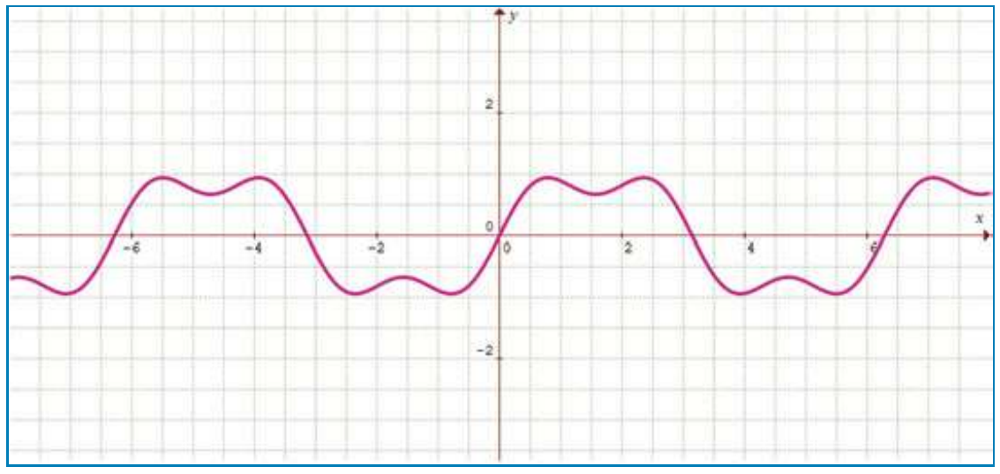
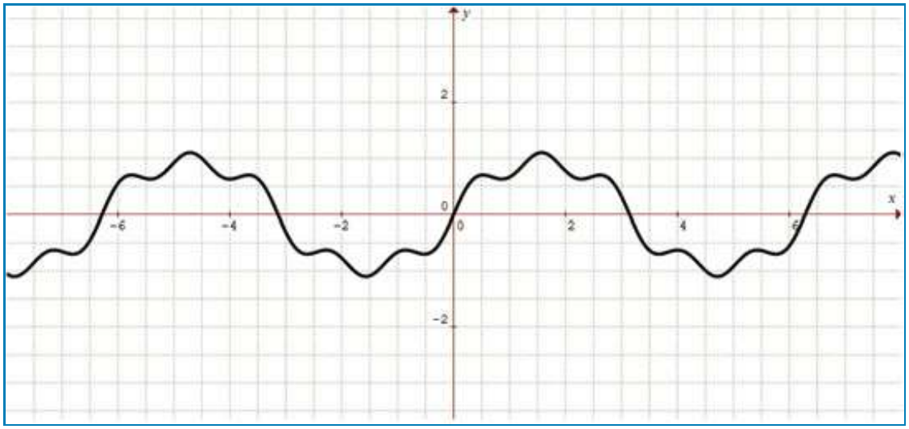
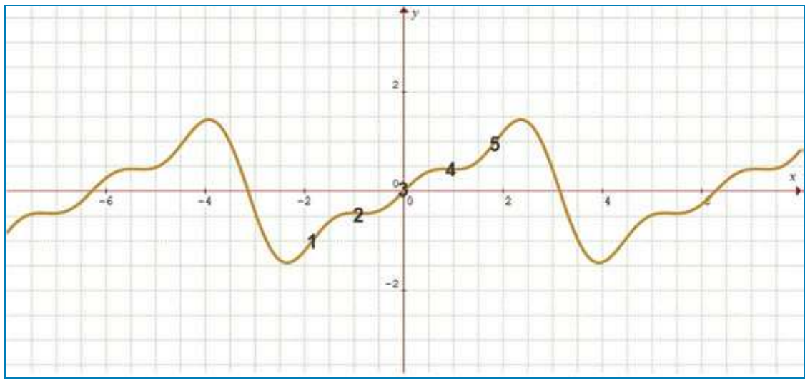
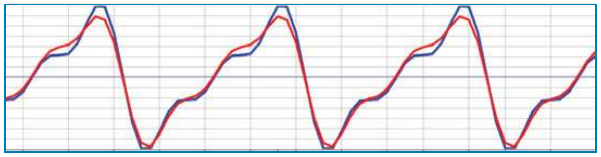
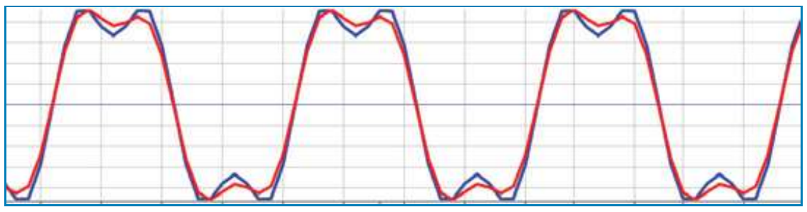
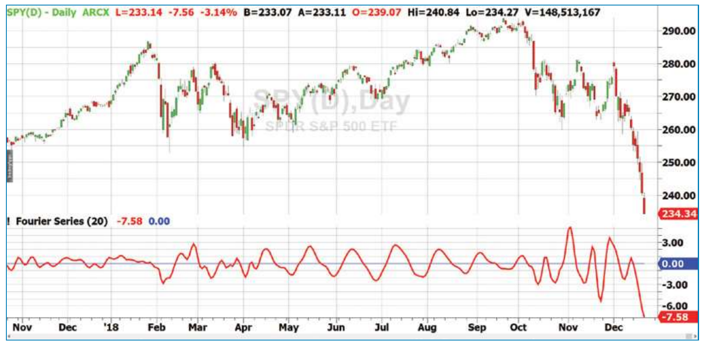

# Fourier Series Model Of The Market

- **Author:** John Ehlers
- **Publication:** Technical Analysis of STOCKS & COMMODITIES, Volume 37, June 2019, pp. 9--14
- **Article URL:** [Article PDF](https://technical.traders.com/archive/article.asp?file=\V37\C06\870EHLE.pdf)
- **Traders' Tips URL:** [Traders' Tips, June 2019](https://www.traders.com/Documentation/FEEDbk_docs/2019/06/TradersTips.html)

---

*Harmonic Synchronicity*

*Traders are aware that cyclical activity can be observed in market data. Here's a way to use a Fourier series indicator to model the market and describe cyclic market activity so you can develop realistic trading strategy rules for swing trades.*

Even the most casual observer will note that cycles are present in market data. Since this is so obvious, it is natural to try to embed the analysis of these cycles into trading strategies to make them better and more profitable. In this article, I'll describe such analysis.

In his seminal 1970 book *The Profit Magic of Stock Transaction Timing*, J.M. Hurst described five principles when dealing with periodic-cyclic motion. These were:

1. The summation principle
2. The commonality principle
3. The variation principle
4. The nominality principle
5. The proportionality principle

## The Principles, Explained

Addressing these principles in reverse order, the proportionality principle simply states that the longer the duration of the cycle component, the larger its magnitude. The modern description of this principle is that the market data is fractal. This principle causes problems with cycle measurements because most measurements do not account for this effect, which I call spectral dilation. This principle is more statistical in nature and is not absolutely true all the time. The Fourier series model I propose dynamically accounts for the relative amplitudes of the cyclic components.

The nominality principle reflects that some cyclic components tend to be consistently present. For example, I have found that most stocks and stock indexes tend to have a monthly, or 20-bar, cycle of daily data. I don't like to assign causality, but it makes sense that all management, from bottom to top, usually have to make their numbers on a monthly basis. It is not hard to imagine that this management imperative is reflected in stock prices.

The variation principle means cycles in the data are not absolutely stable. The duration of their cycle periods, amplitudes, and phases shift as a function of time. After all, if cycles were consistently present, every trader in the world would jump on them. That they are so recognizable, in effect, makes them self-destructive.

The commonality principle simply means the cyclic components in different stock ticker symbols tend to have similar durations and the highs and lows tend to be in time synchronization. This principle forms the basis of robustness test of a given trading strategy. If a strategy works well on one stock symbol, it should also work well on another similar stock if that strategy is to be robust.

The summation principle is a restatement of the theory of Fourier series. That is, any arbitrary waveshape can be created by a sum of harmonics of sine wave primitives. Hurst goes on in detail about how to synthesize patterns such as double tops, double bottoms, head & shoulders, and flags and pennants from their sine wave primitives.

As a quick review of Fourier series synthesis of waveshapes, I will show a few simple examples.

For example, consider the expression:

$$y = \sin(x) + 0.33 \cdot \sin(3x)$$

where the angle arguments are in radians. This expression plots out to be alternating double top and double bottom pattern shapes, as shown in Figure 1. So, using the variation principle, these patterns can come and go as a function of time.


**Figure 1: Synthesized double tops and double bottom patterns.** Here, a Fourier series synthesis of waveshapes plots alternating double top and double bottom pattern shapes.

Head & shoulders patterns can be synthesized from sine wave harmonics with a minor variation of the previous expression as:

$$y = \sin(x) + 0.1 \cdot \sin(3x) + 0.2 \cdot \sin(5x)$$

This expression plots the alternating direct and inverse head & shoulders patterns, as shown in Figure 2.


**Figure 2: Synthesized head & shoulders patterns.** Head & shoulders patterns can be synthesized from sine wave harmonics. Both direct and inverse head & shoulders patterns can be seen.

Even an Elliott wave pattern can be synthesized from sine wave primitives though the use of the equation:

$$y = \sin(x) - 0.5 \cdot \sin(2x) + 0.33 \cdot \sin(3x)$$

The resulting wave, with the basic wave count, is shown in Figure 3.


**Figure 3: Synthesized Elliott wave pattern with basic wave count.** Even an Elliott wave pattern can be synthesized from sine wave primitives.

The synthesized patterns were plotted using a free graphics package that can be downloaded from http://graphmatica.com.

Synthesis of patterns using sine wave primitives is relatively easy. All you have to do is follow the summation principle using harmonics of various amplitudes and phase angles. Analysis of a pattern by breaking it down to its component sine wave primitives is another thing altogether. In theory, there are a triple infinity of parameters to consider for each harmonic component. That is, you must determine the frequency, amplitude, and phase of each one. Further, according to the variation principle, the harmonic components are not time invariant. The problem of analyzing patterns in terms of their sine wave primitives seems to be virtually impossible.

However, truth and science again triumph over ignorance and superstition. The technical tool that isolates each of the primitive components is a *band-pass filter*. A band-pass filter passes only the cycle period of interest and rejects all other frequency components that may be present in the data spectrum. The band-pass filter and its characteristics are described in chapter 5 of my book *Cycle Analytics For Traders*. The band-pass filter isolates each of the harmonic components with their relative phases, and enables further measurement of their relative amplitudes.

There are tradeoffs in the use of the band-pass filter, as there are with most technical tools. In this case, the tradeoff is between the bandwidth of the filter and speed of its transient response. That is, if the filter bandwidth is designed to be too narrow, then the filter "rings out" like a bell and is slow to respond to changes in the input data. For this application, a reasonable compromise is have the filter bandwidth be 10% of its center period. So if the band-pass filter is tuned to a 20-bar cycle period, it will also pass spectral components having periods between 19 and 21 bars.

Since the harmonic components of the data spectrum can be isolated using band-pass filters, the seemingly impossible task of analyzing market data using a truncated Fourier series analysis can be accomplished using a precise algorithmic sequence. The steps of this sequence are:

1. Select a fundamental cycle period.
2. Precisely measure the fundamental as well as second and third harmonics in narrow-band band-pass filters. The relative phases of these sine wave primitives are determined by the measurement.
3. Determine the relative amplitude of the three cyclic components.
4. Following the principle of summation, add the three harmonic components together using their relative amplitudes.
5. Repeat for each bar across the chart.

These steps will produce a smooth time-variable pattern that describes market activity in direct synchronization with the price action of the market. The waveform is smooth because only the three harmonic sine wave components are used, and the extraneous noisy components are ignored. You can then use this smoothed waveform as the basis for realistic trading strategy rules.

The details of the algorithmic sequence are described in terms of the EasyLanguage code given in the sidebar "Fourier Series Analysis in EasyLanguage." The fundamental period is an input and the default value of 20 bars is used. The variables are declared, and then all the filter coefficients are computed on the first bar of the chart for execution efficiency because they do not change across the chart. In the next block of code, the band-pass filters for the fundamental as well as second and third harmonics are computed, as well as the quadrature components.

The quadrature components (Q1, Q2, and Q3) are generated by taking the one-bar difference of their respective band-pass filter response. This is analogous to taking their derivative in calculus. Recalling that the derivative of a sine wave is a cosine wave as

$$\frac{d(\sin(\omega t))}{dt} = \frac{1}{\omega} \cos(\omega t)$$

then taking the derivative produces a 90-degree shift (that is, quadrature of a cycle) of the same waveform with an amplitude adjustment. Since the band-pass filters have a relatively narrow bandwidth, we can treat this adjustment as the fundamental period divided by two pi.

The quadrature components are required to measure the amplitudes of the fundamental and two harmonic waves. Using the trigonometric relationship

$$1 = \sin^2(x) + \cos^2(x)$$

you can find the power in the wave as the sum of the squares of the in-phase and quadrature components. The power in the second and third harmonic waves are correctly computed because they are summed over two and three cycle periods, respectively, when the power is averaged over the fundamental cycle period.

Finally, the waveform is synthesized by adding the second and third harmonics at their relative amplitudes to the filtered fundamental signal.

The additional optional code, which is currently commented out, creates a trading signal as the rate of change (ROC) of the wave. This signal crosses zero each time the wave attains a peak or valley. So if the amplitude of the swing is adequate, the ROC crossing zero is an excellent time to enter or exit a swing trade.

## Real-World Trading

It is imperative that a technical analysis indicator perform as expected on deterministic waveforms before it can be applied to noisy, real-world data. Toward that end, I created a data signal consisting of the synthesized Elliott wave pattern. The test is whether the Fourier series indicator can accurately recreate that waveform at its output. Figure 4 shows that the Elliott wave as the blue line is faithfully reproduced by the red line output of the indicator. It's not perfect, but it's pretty good. One potential cause of the error is the half bar of lag in the computation of the quadrature components, but this lag is not correctable. Figure 5 shows that the double tops and double bottoms as the blue line is also faithfully reproduced by the red line output of the indicator even though there is no second harmonic in the original signal.


**Figure 4: Fourier series indicator and synthesized Elliott wave.** The Fourier series indicator (red line) faithfully replicates the synthesized Elliott wave (blue line).


**Figure 5: Fourier series indicator and double tops & bottoms.** The Fourier series indicator (red line) faithfully replicates the double tops and double bottoms (blue line).

The fun part is seeing how the Fourier series indicator works on real data. Figure 6 shows a little more than one year's worth of daily data on the symbol SPY. The Fourier series indicator is shown in the first subgraph below the price chart. From left to right, the market was in a trend mode in the fall of 2017 into January of 2018. The indicator shows this by having very little swing amplitude. After an erratic period, a strong cycle mode was present from April 2018 through October 2018. Note that the peaks and valleys of the indicator align with the extreme swings in prices, showing there is predictive value in the indicator based on continuation of the cycle. The peaks and valleys of the indicator also tend to line up with the extreme swings during the volatile period in the fall of 2018.


**Figure 6: Fourier series indicator and SPY.** The Fourier series indicator accurately shows trends as well as cyclic turning points.

## In Summation

The Fourier series indicator gives a faithful and tradable picture of market activity based on the five principles established by J.M. Hurst. It is made possible through the use of band-pass filters that isolate the fundamental and its second and third harmonics. The filter preserves their relative amplitudes and phases so that a truncated Fourier series can be established using the summation principle.

---

## Fourier Series Analysis in EasyLanguage

```easylanguage
{
  Fourier Series Analysis
  (C) 2005-2018 John F. Ehlers
}

Inputs:
  Fundamental(20);

Vars:
  Bandwidth(.1),
  G1(0), S1(0), L1(0), BP1(0), Q1(0), P1(0),
  G2(0), S2(0), L2(0), BP2(0), Q2(0), P2(0),
  G3(0), S3(0), L3(0), BP3(0), Q3(0), P3(0),
  count(0),
  Wave(0),
  ROC(0);

// Compute filter coefficients once
If CurrentBar = 1 Then Begin
  L1 = Cosine(360 / Fundamental);
  G1 = Cosine(Bandwidth * 360 / Fundamental);
  S1 = 1 / G1 - SquareRoot(1 / (G1 * G1) - 1);
  L2 = Cosine(360 / (Fundamental / 2));
  G2 = Cosine(Bandwidth * 360 / (Fundamental / 2));
  S2 = 1 / G2 - SquareRoot(1 / (G2 * G2) - 1);
  L3 = Cosine(360 / (Fundamental / 3));
  G3 = Cosine(Bandwidth * 360 / (Fundamental / 3));
  S3 = 1 / G3 - SquareRoot(1 / (G3 * G3) - 1);
End;

// Fundamental Band-Pass
BP1 = .5 * (1 - S1) * (Close - Close[2]) + L1 * (1 + S1) * BP1[1] - S1 * BP1[2];
If CurrentBar <= 3 Then BP1 = 0;

// Fundamental Quadrature
Q1 = (Fundamental / 6.28) * (BP1 - BP1[1]);
If CurrentBar <= 4 Then Q1 = 0;

// Second Harmonic Band-Pass
BP2 = .5 * (1 - S2) * (Close - Close[2]) + L2 * (1 + S2) * BP2[1] - S2 * BP2[2];
If CurrentBar <= 3 Then BP2 = 0;

// Second Harmonic Quadrature
Q2 = (Fundamental / 6.28) * (BP2 - BP2[1]);
If CurrentBar <= 4 Then Q2 = 0;

// Third Harmonic Band-Pass
BP3 = .5 * (1 - S3) * (Close - Close[2]) + L3 * (1 + S3) * BP3[1] - S3 * BP3[2];
If CurrentBar <= 3 Then BP3 = 0;

// Third Harmonic Quadrature
Q3 = (Fundamental / 6.28) * (BP3 - BP3[1]);
If CurrentBar <= 4 Then Q3 = 0;

// Sum power of each harmonic at each bar over the Fundamental period
P1 = 0;
P2 = 0;
P3 = 0;
For count = 0 to Fundamental - 1 Begin
  P1 = P1 + BP1[count] * BP1[count] + Q1[count] * Q1[count];
  P2 = P2 + BP2[count] * BP2[count] + Q2[count] * Q2[count];
  P3 = P3 + BP3[count] * BP3[count] + Q3[count] * Q3[count];
End;

// Add the three harmonics together using their relative amplitudes
If P1 <> 0 Then Wave = BP1 + SquareRoot(P2 / P1) * BP2 + SquareRoot(P3 / P1) * BP3;

Plot1(Wave);
Plot2(0);

{
// Optional cyclic trading signal
// Rate of change crosses zero at cyclic turning points
ROC = (Fundamental / 12.57) * (Wave - Wave[2]);
Plot3(ROC);
}
```

---

## Further Reading

- Ehlers, John F. [2013]. *Cycle Analytics For Traders: Advanced Technical Trading Concepts*, John Wiley & Sons.
- http://www.graphmatica.com

---

## BibTeX

```bibtex
@article{ehlers_fourier_series_2019,
  author = {Ehlers, John F.},
  title = {Fourier Series Model Of The Market},
  journal = {Technical Analysis of STOCKS \& COMMODITIES},
  volume = {37},
  number = {6},
  pages = {9--14},
  year = {2019},
  month = jun,
  url = {https://technical.traders.com/archive/article.asp?file=\V37\C06\870EHLE.pdf}
}

@misc{traders_tips_2019_06,
  author = {{Technical Analysis of STOCKS \& COMMODITIES}},
  title = {Traders' Tips: Fourier Series Model Of The Market},
  year = {2019},
  month = jun,
  howpublished = {online},
  url = {https://www.traders.com/Documentation/FEEDbk_docs/2019/06/TradersTips.html}
}
```
