# Traders' Tips: June 2019

- **Article:** Fourier Series Model Of The Market by John Ehlers
- **Traders' Tips URL:** [Traders' Tips, June 2019](https://www.traders.com/Documentation/FEEDbk_docs/2019/06/TradersTips.html)

---

## TRADESTATION: JUNE 2019

In '''Fourier Series Model Of The Market''' in this issue, author John Ehlers introduces a Fourier series indicator designed to help traders identify cycles in the market. According to the author, the approach based on five principles outlined by J.M. Hurst in his 1970 book allows the determinization of a security'''s primary cycle period and gives a faithful picture of market activity.

Here, we are providing TradeStation EasyLanguage code for an indicator and strategy based on Ehlers''' concepts described in the article. This code can be downloaded by visiting our TradeStation and EasyLanguage support forum at the link provided after the following code listing.


```easylanguage
Indicator: Fourier Series Indicator
// TASC JUN 2019
// Fourier Series Analysis
// (C) 2005-2018 John F. Ehlers

inputs:
	Fundamental( 20 ) ;
	
variables:
	Bandwidth(.1),
	G1( 0 ), S1( 0 ), L1( 0 ), BP1( 0 ), Q1( 0 ), P1( 0 ),
	G2( 0 ), S2( 0 ), L2( 0 ), BP2( 0 ), Q2( 0 ), P2( 0 ),
	G3( 0 ), S3( 0 ), L3( 0 ), BP3( 0 ), Q3( 0 ), P3( 0 ),
	count( 0 ),	Wave( 0 ), ROC( 0 ) ;

//compute filter coefficients once
once
begin
	L1 = Cosine( 360 / Fundamental ) ;
	G1 = Cosine( Bandwidth * 360 / Fundamental ) ;
	S1 = 1 / G1 - SquareRoot( 1 / ( G1 * G1 ) - 1 ) ;
	L2 = Cosine( 360 / ( Fundamental / 2 ) ) ;
	G2 = Cosine( Bandwidth * 360 / ( Fundamental / 2 ) ) ;
	S2 = 1 / G2 - SquareRoot( 1 / ( G2 * G2 ) - 1 ) ;
	L3 = Cosine( 360 / ( Fundamental / 3 ) ) ;
	G3 = Cosine( Bandwidth * 360 / ( Fundamental / 3 ) ) ;
	S3 = 1 / G3 - SquareRoot( 1 / ( G3 * G3 ) - 1 ) ;
end ;

//Fundamental Band-Pass
BP1 = .5 * ( 1 - S1) * ( Close - Close[2] ) 
	+ L1 * ( 1 + S1 ) * BP1[1] - S1 * BP1[2] ;
if CurrentBar  <= 3 then 
	BP1 = 0 ;
	
//Fundamental Quadrature
Q1 = ( Fundamental / 6.28 ) * ( BP1 - BP1[1] ) ;
if CurrentBar <= 4 then 
	Q1 = 0 ;
	
//Second Harmonic Band-Pass
BP2 = .5 * ( 1 - S2 ) * ( Close - Close[2] ) 
	+ L2 * ( 1 + S2 ) * BP2[1] - S2 * BP2[2] ;
if CurrentBar <= 3 then 
	BP2 = 0 ;
	
//Second Harmonic Quadrature
Q2 = ( Fundamental / 6.28 ) * ( BP2 - BP2[1] ) ;
if CurrentBar <= 4 then 
	Q2 = 0 ;

//Third Harmonic Band-Pass
BP3 = .5 * ( 1 - S3 ) * ( Close - Close[2] ) 
	+ L3 * ( 1 + S3 ) * BP3[1] - S3 * BP3[2] ;
if CurrentBar <= 3 then 
	BP3 = 0 ;
	
//Third Harmonic Quadrature
Q3 = ( Fundamental / 6.28 ) * ( BP3 - BP3[1] ) ;
if CurrentBar <= 4 then 
Q3 = 0 ;

//Sum power of each harmonic at 
//each bar over the Fundamental period
P1 = 0 ;
P2 = 0 ;
P3 = 0 ;
For count = 0 to Fundamental - 1 
begin
	P1 = P1 + BP1[count] * BP1[count] 
		+ Q1[count] * Q1[count] ;
	P2 = P2 + BP2[count] * BP2[count] 
		+ Q2[count] * Q2[count] ;
	P3 = P3 + BP3[count] * BP3[count] 
		+ Q3[count] * Q3[count] ;
end ;

//Add the three harmonics together 
//using their relative amplitudes
If P1 <> 0 then 
	Wave = BP1 + SquareRoot( P2 / P1 ) * BP2 
		+ SquareRoot( P3 / P1 ) * BP3 ;

Plot1( Wave );
Plot2( 0 );

//Optional cyclic trading signal
//Rate of change crosses zero at 
//cyclic turning points
ROC = ( Fundamental / 12.57 ) * 
	( Wave - Wave[2] ) ;
Plot3( ROC ) ;


Strategy: Fourier Series Strategy
// TASC JUN 2019
// Fourier Series Analysis
// (C) 2005-2018 John F. Ehlers

inputs:
	Fundamental( 20 ) ;
	
variables:
	Bandwidth(.1),
	G1( 0 ), S1( 0 ), L1( 0 ), BP1( 0 ), Q1( 0 ), P1( 0 ),
	G2( 0 ), S2( 0 ), L2( 0 ), BP2( 0 ), Q2( 0 ), P2( 0 ),
	G3( 0 ), S3( 0 ), L3( 0 ), BP3( 0 ), Q3( 0 ), P3( 0 ),
	count( 0 ),	Wave( 0 ), ROC( 0 ) ;

//compute filter coefficients once
once
begin
	L1 = Cosine( 360 / Fundamental ) ;
	G1 = Cosine( Bandwidth * 360 / Fundamental ) ;
	S1 = 1 / G1 - SquareRoot( 1 / ( G1 * G1 ) - 1 ) ;
	L2 = Cosine( 360 / ( Fundamental / 2 ) ) ;
	G2 = Cosine( Bandwidth * 360 / ( Fundamental / 2 ) ) ;
	S2 = 1 / G2 - SquareRoot( 1 / ( G2 * G2 ) - 1 ) ;
	L3 = Cosine( 360 / ( Fundamental / 3 ) ) ;
	G3 = Cosine( Bandwidth * 360 / ( Fundamental / 3 ) ) ;
	S3 = 1 / G3 - SquareRoot( 1 / ( G3 * G3 ) - 1 ) ;
end ;

//Fundamental Band-Pass
BP1 = .5 * ( 1 - S1) * ( Close - Close[2] ) 
	+ L1 * ( 1 + S1 ) * BP1[1] - S1 * BP1[2] ;
if CurrentBar  <= 3 then 
	BP1 = 0 ;
	
//Fundamental Quadrature
Q1 = ( Fundamental / 6.28 ) * ( BP1 - BP1[1] ) ;
if CurrentBar <= 4 then 
	Q1 = 0 ;
	
//Second Harmonic Band-Pass
BP2 = .5 * ( 1 - S2 ) * ( Close - Close[2] ) 
	+ L2 * ( 1 + S2 ) * BP2[1] - S2 * BP2[2] ;
if CurrentBar <= 3 then 
	BP2 = 0 ;
	
//Second Harmonic Quadrature
Q2 = ( Fundamental / 6.28 ) * ( BP2 - BP2[1] ) ;
if CurrentBar <= 4 then 
	Q2 = 0 ;

//Third Harmonic Band-Pass
BP3 = .5 * ( 1 - S3 ) * ( Close - Close[2] ) 
	+ L3 * ( 1 + S3 ) * BP3[1] - S3 * BP3[2] ;
if CurrentBar <= 3 then 
	BP3 = 0 ;
	
//Third Harmonic Quadrature
Q3 = ( Fundamental / 6.28 ) * ( BP3 - BP3[1] ) ;
if CurrentBar <= 4 then 
Q3 = 0 ;

//Sum power of each harmonic at 
//each bar over the Fundamental period
P1 = 0 ;
P2 = 0 ;
P3 = 0 ;
For count = 0 to Fundamental - 1 
begin
	P1 = P1 + BP1[count] * BP1[count] 
		+ Q1[count] * Q1[count] ;
	P2 = P2 + BP2[count] * BP2[count] 
		+ Q2[count] * Q2[count] ;
	P3 = P3 + BP3[count] * BP3[count] 
		+ Q3[count] * Q3[count] ;
end ;

//Add the three harmonics together 
//using their relative amplitudes
If P1 <> 0 then 
	Wave = BP1 + SquareRoot( P2 / P1 ) * BP2 
		+ SquareRoot( P3 / P1 ) * BP3 ;

//Rate of change crosses zero at 
//cyclic turning points
ROC = ( Fundamental / 12.57 ) * 
	( Wave - Wave[2] ) ;

if ROC crosses over 0 then 
	Buy next bar at Market
else if ROC crosses under 0 then
	SellShort next bar at Market ;
```

To download the EasyLanguage code, please visit our TradeStation and EasyLanguage support forum. The files for this article can be found here: https://community.tradestation.com/Discussions/Topic.aspx?Topic_ID=156727 . The filename is '''TASC_JUN2019.ZIP.''' For more information about EasyLanguage in general, please see https://www.tradestation.com/EL-FAQ .

A sample chart is shown in Figure 1.


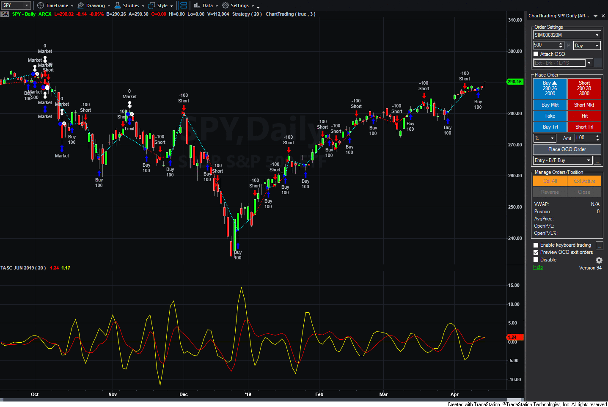
****

This article is for informational purposes. No type of trading or investment recommendation, advice, or strategy is being made, given, or in any manner provided by TradeStation Securities or its affiliates.

'''Doug McCrary TradeStation Securities, Inc. www.TradeStation.com

BACK TO TOP LINK

BACK TO LIST


See also: [FSM.els](FSM.els)


---

## METASTOCK: JUNE 2019

John Ehlers''' article in this issue, '''Fourier Series Model Of The Market,''' explains how to reduce market action to a sinewave using Fourier series analysis. The MetaStock formula for that indicator is given here.


```metastock
Fourier Series Analysis

x:= Input("fundemental cycle length", 2, 100, 20);
bw:= 0.1; {bandwidth}
L1:= Cos(360/x);
G1:= Cos((bw*360)/x);
S1:= 1/G1 - Sqrt(1/(G1*G1) -1);
L2:= Cos( 360 / (x/2));
G2:= Cos((bw*360)/(x/2));
S2:= 1/G2 - Sqrt(1/(G2*G2) -1);
L3:= Cos( 360 / (x/3));
G3:= Cos((bw*360)/(x/3));
S3:= 1/G3 - Sqrt(1/(G3*G3) -1);
{fundemental band pass}
BP1:= .5*(1-S1)*(C-Ref(C,-2)) + L1*(1+S1)*PREV - S1*Ref(PREV,-1);
Q1:= (x/6.28)*(BP1-Ref(BP1,-1));
{second harmonic band pass}
BP2:= .5*(1-S2)*(C-Ref(C,-2)) + L2*(1+S2)*PREV - S2*Ref(PREV,-1);
Q2:= (x/6.28)*(BP2-Ref(BP2,-1));
{third harmonic band pass}
BP3:= .5*(1-S3)*(C-Ref(C,-2)) + L3*(1+S3)*PREV - S3*Ref(PREV,-1);
Q3:= (x/6.28)*(BP3-Ref(BP3,-1));
{final calculations}
p1:= Sum((BP1*BP1) + (Q1*Q1), x);
p2:= Sum((BP2*BP2) + (Q2*Q2), x);
p3:= Sum((BP3*BP3) + (Q3*Q3), x);
BP1 + Sqrt(p2/p1)*BP2 + Sqrt(p3/p1)*BP3;
```

'''William Golson MetaStock Technical Support www.metastock.com

BACK TO TOP LINK

BACK TO LIST


See also: [FSM.met](FSM.met)


---

## THINKORSWIM: JUNE 2019

We have put together a study based on the article '''Fourier Series Model Of The Market''' in this issue by John Ehlers. We built the referenced study and strategy by using our proprietary scripting language, thinkScript. To ease the loading process, simply click on https://tos.mx/vDTSrd and then choose view thinkScript study and name it '''fourierseriesindicator.''' This can then be added to your chart from the edit study and strategies menu within thinkorswim.

The study can be seen in Figure 2, set to display one-day candles for the date range of October 20, 2017 through December 20, 2018. See John Ehlers''' article in this issue for more details on how to interpret the study.


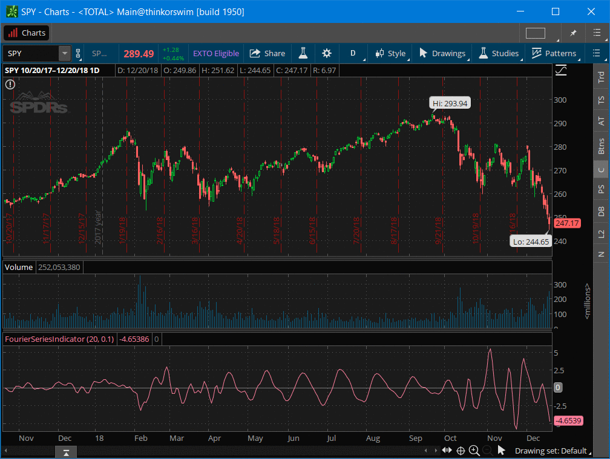
****

'''thinkorswim A division of TD Ameritrade, Inc. www.thinkorswim.com

BACK TO TOP LINK

BACK TO LIST


---

## eSIGNAL: JUNE 2019

For this month'''s Traders''' Tip, we'''ve provided the study Fourier_Series_Indicator.efs based on the article in this issue by John Ehlers, '''Fourier Series Model Of The Market.''' This study can be used to describe the cycles present in a market.

The study contains formula parameters that may be configured through the edit chart window (right-click on the chart and select '''edit chart'''). A sample chart is shown in Figure 3.


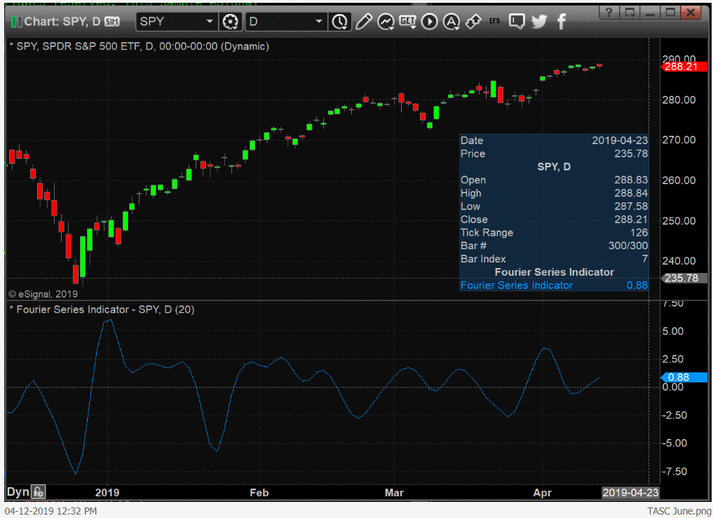
****

To discuss this study or download a complete copy of the formula code, please visit the EFS library discussion board forum under the forums link from the support menu at www.esignal.com or visit our EFS KnowledgeBase at https://www.esignal.com/support/kb/efs/ . The eSignal formula script (EFS) is also available for copying & pasting below.


```javascript
/*********************************
Provided By:  
Copyright 2019 Intercontinental Exchange, Inc. All Rights Reserved. 
eSignal is a service mark and/or a registered service mark of Intercontinental Exchange, Inc. 
in the United States and/or other countries. This sample eSignal Formula Script (EFS) 
is for educational purposes only. 
Intercontinental Exchange, Inc. reserves the right to modify and overwrite this EFS file with each new release. 

Description:        
   Fourier series Model Of The Market
   by John F. Ehlers
    

Version:            1.00  04/08/2019

Formula Parameters:                     Default:
Fundamental                             20


Notes:
The related article is copyrighted material. If you are not a subscriber
of Stocks & Commodities, please visit www.traders.com.

**********************************/


var fpArray = new Array();

function preMain(){
    setPriceStudy(false);
    setStudyTitle("Fourier Series Indicator");
    setCursorLabelName("Fourier Series Indicator");
    setPlotType(PLOTTYPE_LINE);
    
    var x = 0;
    fpArray[x] = new FunctionParameter("Fundamental", FunctionParameter.NUMBER);
	with(fpArray[x++]){
        setName("Fundamental");
        setLowerLimit(1);
        setDefault(20);        
    }
    
}

var bInit = false;
var bVersion = null;
var xClose = null;
var Bandwidth = 0.1;
var G1 = 0;
var S1 = 0;
var L1 = 0;
var BP1 = 0;
var Q1 = 0;
var P1 = 0;
var G2 = 0;
var S2 = 0;
var L2 = 0;
var BP2 = 0;
var Q2 = 0;
var P2 = 0; 
var G3 = 0;
var S3 = 0;
var L3 = 0;
var BP3 = 0;
var Q3 = 0;
var P3 = 0; 
var Wave = 0;
var vBP1 = [];
var vBP2 = [];
var vBP3 = [];
var vQ1 = [];
var vQ2 = [];
var vQ3 = [];
var fNewBar = null;


function main(Fundamental){
    if (bVersion == null) bVersion = verify();
    if (bVersion == false) return;
        
    if (getBarState() == BARSTATE_ALLBARS){
        bInit = false;
    }

    if (getCurrentBarCount() < Fundamental) {
        
        vBP1.unshift(0);
        vBP2.unshift(0);
        vBP3.unshift(0)
        vQ1.unshift(0)
        vQ2.unshift(0)
        vQ3.unshift(0)
        return;
        
    }
    
    if (!bInit){
        
        xClose = close();
        L1 = Math.cos(2 * Math.PI / Fundamental);
        L2 = Math.cos(2 * Math.PI / (Fundamental / 2));
        L3 = Math.cos(2 * Math.PI / (Fundamental / 3));
        G1 = Math.cos(Bandwidth * 2 * Math.PI / Fundamental);
        G2 = Math.cos(Bandwidth * 2 * Math.PI / (Fundamental / 2));
        G3 = Math.cos(Bandwidth * 2 * Math.PI / (Fundamental / 3));
        S1 = 1 / G1 - Math.sqrt(1 / (G1*G1) - 1);      
        S2 = 1 / G2 - Math.sqrt(1 / (G2*G2) - 1);      
        S3 = 1 / G3 - Math.sqrt(1 / (G3*G3) - 1);     
        
        addBand(0, PS_DASH, 1, Color.grey, 0);    
        bInit = true;
    }

    fNewBar = false;
    P1 = 0;
    P2 = 0;
    P3 = 0;

    if (getBarState() == BARSTATE_NEWBAR) fNewBar = true;        
    if (!fNewBar) {
        vBP1.shift();
        vBP2.shift();
        vBP3.shift();
        vQ1.shift();
        vQ2.shift();
        vQ3.shift();
    }

    if (getCurrentBarCount() <= 3) {
        vBP1.unshift(0);
        vBP2.unshift(0);
        vBP3.unshift(0);
    }
    else {
        vBP1.unshift(0.5 * (1 - S1)*(xClose.getValue(0) - xClose.getValue(-2)) + L1*(1 + S1)*vBP1[0] - S1*vBP1[1]);
        vBP2.unshift(0.5 * (1 - S2)*(xClose.getValue(0) - xClose.getValue(-2)) + L2*(1 + S2)*vBP2[0] - S2*vBP2[1]);
        vBP3.unshift(0.5 * (1 - S3)*(xClose.getValue(0) - xClose.getValue(-2)) + L3*(1 + S3)*vBP3[0] - S3*vBP3[1]);
    }

    if (getCurrentBarCount() <= 4) {
        vQ1.unshift(0);
        vQ2.unshift(0);
        vQ3.unshift(0);
    }
    else {
        vQ1.unshift((Fundamental / 6.28)*(vBP1[0] - vBP1[1]));
        vQ2.unshift((Fundamental / 6.28)*(vBP2[0] - vBP2[1]));
        vQ3.unshift((Fundamental / 6.28)*(vBP3[0] - vBP3[1]));
    }
       
    for (var i = 0; i < Fundamental; i++) {        
        P1 = P1 + vBP1[i]*vBP1[i] + vQ1[i]*vQ1[i]; 
        P2 = P2 + vBP2[i]*vBP2[i] + vQ2[i]*vQ2[i];
        P3 = P3 + vBP3[i]*vBP3[i] + vQ3[i]*vQ3[i];        
    }
    Wave = Calc_Ret(0, vBP1, vBP2, vBP3, P1, P2, P3);
    
    return Wave
}


function Calc_Ret(V, vBP1, vBP2, vBP3, P1, P2, P3){
    if (P1 == 0) return;
    var vWave = vBP1[0 + V] + Math.sqrt(P2 / P1)*vBP2[0 + V] + Math.sqrt(P3 / P1)*vBP3[0 + V];
    return vWave;
}
 

function verify(){
    var b = false;
    if (getBuildNumber() < 779){
        
        drawTextAbsolute(5, 35, "This study requires version 10.6 or later.", 
            Color.white, Color.blue, Text.RELATIVETOBOTTOM|Text.RELATIVETOLEFT|Text.BOLD|Text.LEFT,
            null, 13, "error");
        drawTextAbsolute(5, 20, "Click HERE to upgrade.@URL=https://www.esignal.com/download/default.asp", 
            Color.white, Color.blue, Text.RELATIVETOBOTTOM|Text.RELATIVETOLEFT|Text.BOLD|Text.LEFT,
            null, 13, "upgrade");
        return b;
    } 
    else
        b = true;
    
    return b;
}
```

'''Eric Lippert eSignal, an Interactive Data company 800 779-6555, www.eSignal.com

BACK TO TOP LINK

BACK TO LIST


See also: [Fourier_Series_Indicator.efs](code/Fourier_Series_Indicator.efs)


---

## WEALTH-LAB: JUNE 2019

The FourierSeries indicator presented by John Ehlers in his article in this issue, '''Fourier Series Model Of The Market,''' represents market activity based on analysis principles established by J.M. Hurst. It does so by applying a set of band-pass filters.

In Wealth-Lab, install (or update) the TASCIndicators library to its most-recent version from our website or by using the built-in Extension Manager. Once you see the '''Fourier series''' and '''Fourier cyclic trading signal''' indicators listed under the TASC Magazine Indicators group, they'''re ready for use in Wealth-Lab.

In Figure 4, you can see an example of the indicators applied.


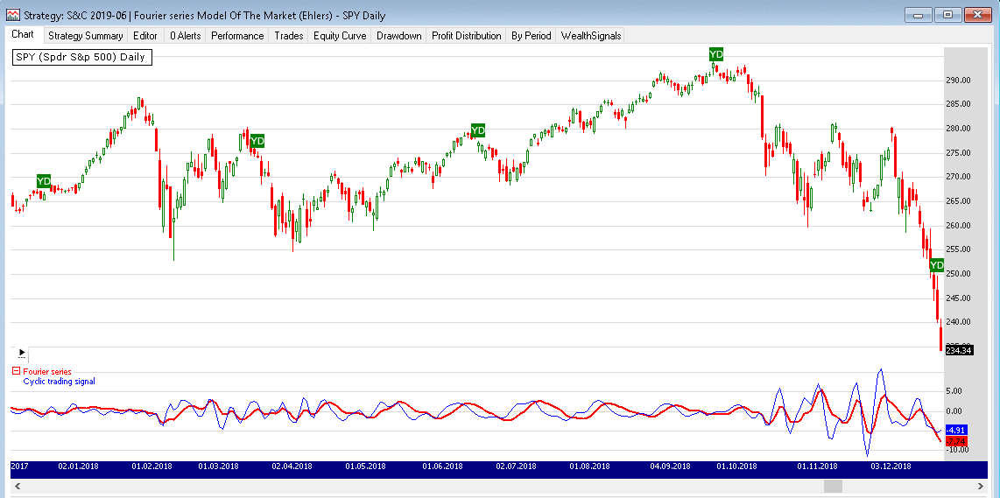
****

'''Gene (Eugene) Geren, Wealth-Lab team MS123, LLC www.wealth-lab.com

BACK TO TOP LINK

BACK TO LIST


---

## QUANTACULA: JUNE 2019

The FourierSeries indicator presented by John Ehlers in his article in this issue, '''Fourier Series Model Of The Market,''' is now available for Quantacula.com and Quantacula Studio from our TASC Extension library. We developed a simple system to exercise the indicator. Our trading model'''s rules are:

Buy next bar at market open when the FourierSeries(20) has reached a new 200-bar low and then turns up. This is an example of a '''self-tuning''' model, a concept we'''ve been working with recently at Quantacula. Rather than establish an arbitrary oversold level, we use the historical data itself to look for an appropriate reversal level. Sell at a limit price equal to the highest two-bar high. We'''ve found that this exit works well to capture small gains in markets that are due for an upside move, while reducing exposure.

We ran the model on the historical Nasdaq 100 stocks, corrected for survivorship bias by accounting for the stocks that came into and out of the index over time. We used $100,000 starting capital, a position size of 25% of equity, and a margin factor of 2 to 1. Over a 20-year backtest, the model returned 7.84% APR while the QQQ benchmark returned 3.49% APR. The model also had a win rate of nearly 70%.

Here is the Quantacula C# code for the self-tuning FourierSeries model:


```csharp
using QuantaculaBacktest;
using QuantaculaCore;
using TASCExtensions;

namespace Quantacula
{
    public class MyModel : UserModelBase
    {
        //create indicators and other objects here, executed prior to main trading loop
        public override void Initialize(BarHistory bars)
        {
            fs = new FourierSeries(bars.Close, 20);
            PlotIndicator(fs);
            StartIndex = 201;
        }

        //execute strategy rules here, executed once for each bar in the backtest history
        public override void Execute(BarHistory bars, int idx)
        {
            if (LastPosition == null)
            {
                //is FS at its historical low, and turning up?
                double lowFS = fs.GetLowest(idx - 1, 200);
                if (fs[idx - 1] == lowFS)
                    if (fs.TurnsUp(idx))
                        PlaceTrade(bars, TransactionType.Buy, OrderType.Market);
            }
            else
            {
                //sell at 2 bar high
                PlaceTrade(bars, TransactionType.Sell, OrderType.Limit, bars.High.GetHighest(idx, 2));
            }
        }

        //declare private variables below
        private FourierSeries fs;
    }
}
```


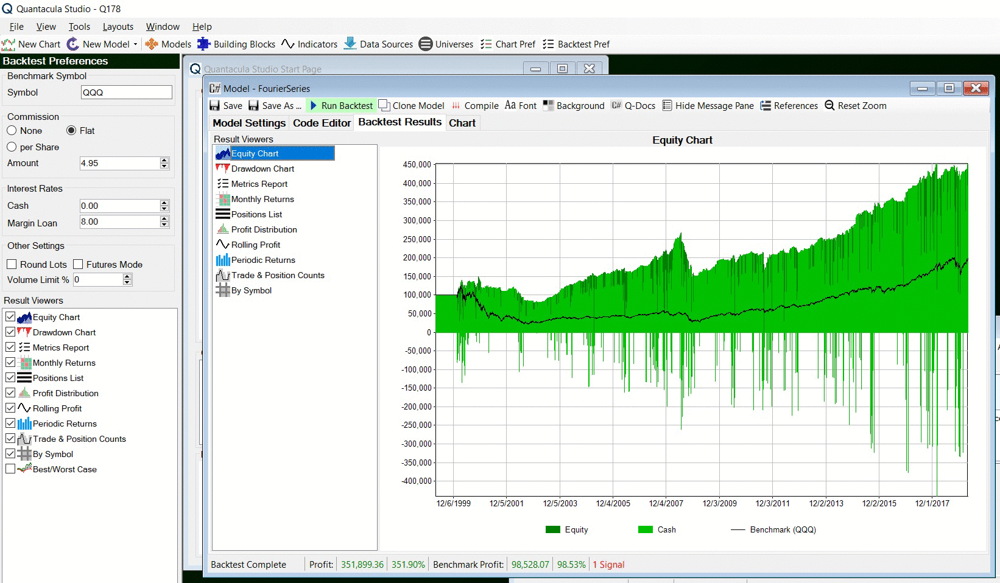
****

'''Dion Kurczek, Quantacula LLC info@quantacula.com www.quantacula.com

BACK TO TOP LINK

BACK TO LIST


See also: [FSM-Quantacula.cs](FSM-Quantacula.cs)


---

## NEUROSHELL TRADER: JUNE 2019

The Fourier market analysis indicator that John Ehlers describes in his article in this issue, '''Fourier Series Model Of The Market,''' can be easily implemented in NeuroShell Trader using NeuroShell Trader'''s ability to call external dynamic linked libraries. Dynamic linked libraries (DLLs) can be written in C, C++, and Power Basic.

After moving the code given in Ehlers''' article to your preferred compiler and creating a DLL, you can insert the resulting indicator as follows:

Select '''New indicator '''''' from the insert menu. Choose the External Program & Library Calls 
    category. Select the appropriate External DLL Call indicator. Set up the parameters to match your DLL. Select the finished button.

Users of NeuroShell Trader can go to the Stocks & Commodities section of the NeuroShell Trader free technical support website to download a copy of this or any previous Traders''' Tips.

A sample chart is shown in Figure 6.


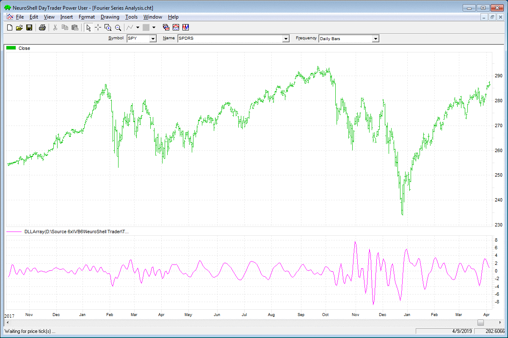
****

'''Marge Sherald, Ward Systems Group, Inc. 301 662-7950, sales@wardsystems.com www.neuroshell.com

BACK TO TOP LINK

BACK TO LIST


---

## NINJATRADER: JUNE 2019

The Fourier series analysis indicator, as discussed in the article by John Ehlers in this issue, '''Fourier Series Model Of The Market,''' is available for download at the following links for NinjaTrader 8 and NinjaTrader 7:

NinjaTrader 8: ninjatrader.com/SC/June2019SCNT8.zip NinjaTrader 7: ninjatrader.com/SC/June2019SCNT7.zip

Once the file is downloaded, you can import the indicator into NinjaTader 8 from within the control center by selecting Tools ''' Import ''' NinjaScript Add-On and then selecting the downloaded file for NinjaTrader 8. To import into NinjaTrader 7, from within the control center window, select the menu File ''' Utilities ''' Import NinjaScript and select the downloaded file.

You can review the indicator'''s source code in NinjaTrader 8 by selecting the menu New ''' NinjaScript Editor ''' Indicators from within the control center window and selecting the '''Fourier series analysis''' file. You can review the indicator'''s source code in NinjaTrader 7 by selecting the menu Tools ''' Edit NinjaScript ''' Indicator from within the control center window and selecting the '''Fourier series analysis''' file.

NinjaScript uses compiled DLLs that run native, not interpreted, which provides you with the highest performance possible.

A sample chart implementing the indicator is shown in Figure 7.


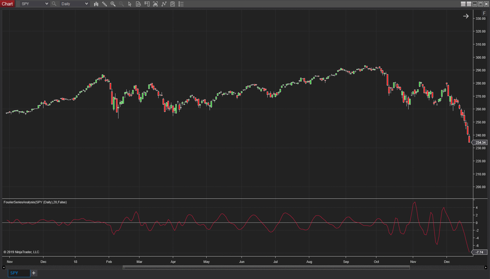
****

'''Raymond Deux & Chris Lauber NinjaTrader, LLC www.ninjatrader.com

BACK TO TOP LINK

BACK TO LIST


See also: [FourierSeriesAnalysis.cs](ninja-trader/FourierSeriesAnalysis.cs)


---

## TRADE NAVIGATOR: JUNE 2019

In the article '''Fourier Series Model Of The Market''' in this issue, author John Ehlers describes a Fourier series indicator. Users of Trade Navigator can download this library in Trade Navigator.

To download this library, click on Trade Navigator'''s telephone button (or use the pull-down menu and then click '''update data'''),  select '''download special file,''' then click on the start button. You will then be guided through an upgrade of your Trade Navigator.  If you are prompted to '''reimport libraries,''' please do so. This will import the new indicator into the software.

Once this update is complete, you can insert the Fourier series indicator onto a chart by opening the charting dropdown menu, selecting the add to chart command, then on the indicators tab, finding the Fourier series indicator, selecting it, then clicking on the add button. Repeat this procedure for additional indicators as well if you wish.

Users may contact our technical support staff by phone or by live chat if any assistance is needed in importing the library.

A chart displaying the indicator is shown in Figure 8.


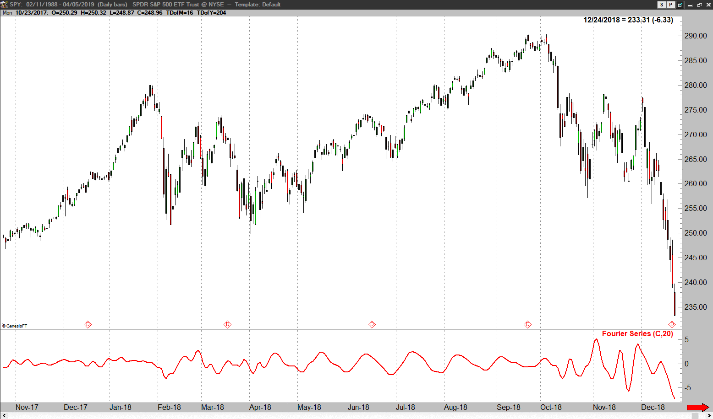
****

BACK TO TOP LINK

BACK TO LIST


---

## MICROSOFT EXCEL: JUNE 2019

In his article in this issue, '''Fourier Series Model Of The Market,''' author John Ehlers presents a very interesting Fourier-based oscillator construct that maps very nicely to cyclic price swings while filtering out much of the higher-frequency cycle noise.

He then suggests that the trader can apply rate-of-change (ROC) logic to pinpoint the extreme high and low turning points of this Fourier-based oscillator and thus the underlying turning points of the price action. This is a good tool to suggest potential swing trading entry and exit points.

The Fourier oscillator (Figure 9) can also help differentiate trending periods from cycle-mode periods by way of the oscillator swing amplitudes.


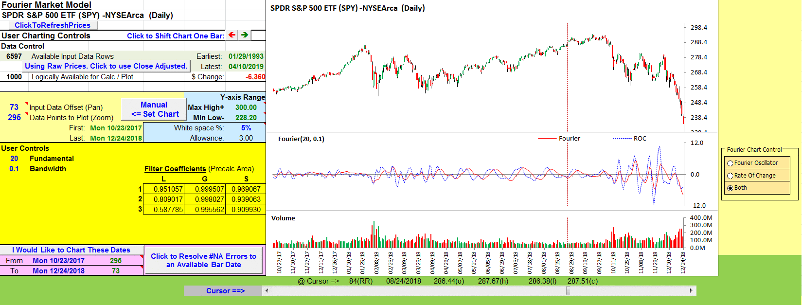
****

This oscillator and the ROC crossover signals can be a great addition to any already-robust trading decision system but should not be used as a standalone system.

I got a little curious about this F-ROC signaling technique and Figures 10 and 11 show the simple statistics this spreadsheet collects.


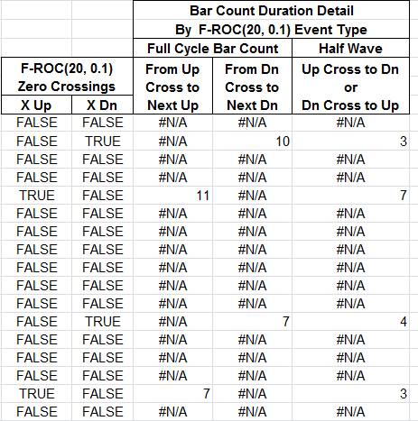
****


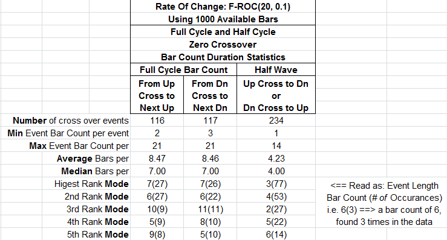
****

The formulas in columns just to the right of the charts, which are shown in Figure 10, keep track of the number of bars until the next occurrence of the indicated F-ROC crossover types. Of particular interest, the half wave would be the duration of a long or short swing trade when based on F-ROC crossovers.

Figure 11 provides a couple of interesting bits. When using '''20''' as the fundamental cycle length for the Fourier construct, the F-ROC detected full cycle lengths, either up to up , or down to down , clustered around seven bars.

For swing traders, the half wave (long or short position duration) clusters around four bars.

Ehlers suggests 20 as a fundamental cycle length for these calculations, as that is roughly the number of trading days in a month.

Just for grins, I thought to try 60 as an approximation of the number of trading days in a quarter.

One interesting result, seen in Figure 12, is that with the fundamental cycle length set to 60, the full cycle numbers cluster around 20 bars, similar to Ehlers''' observation for the trading length of a month.


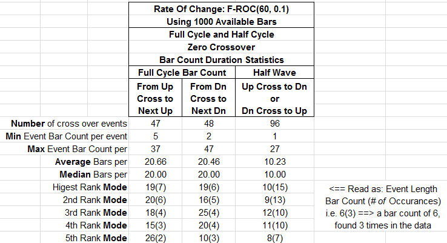
****

The spreadsheet file for this Traders''' Tip can be downloaded from Traders.com in the Traders''' Tips area. To successfully download it, follow these steps:

Right-click on the Excel file link , then Select '''save as''' (or '''save target as''') to place a copy of the spreadsheet file on your hard drive.

'''Ron McAllister Excel and VBA programmer rpmac_xltt@sprynet.com

BACK TO TOP LINK

BACK TO LIST


See also: [FourierMarketModel.xlsm](code/FourierMarketModel.xlsm)


---

## AMIBROKER: JUNE 2019

In his article in this issue, '''Fourier Series Model Of The Market,''' John Ehlers presents a new Fourier series indicator that describes cyclic market activity to help swing traders develop trading strategy rules. Ready-to-use code is provided below.


```c
// Fourier Series Analysis 

Fundamental = 20; 
Bandwidth = 0.1; 
TWOPI = 2 * 3.1415926; 

//compute filter coefficients 
L1 = cos( TWOPI / Fundamental); 
G1 = cos( Bandwidth*TWOPI / Fundamental); 
S1 = 1 / G1 - sqrt(1 / (G1*G1) - 1); 
L2 = cos(TWOPI / (Fundamental / 2)); 
G2 = cos(Bandwidth*TWOPI / (Fundamental / 2)); 
S2 = 1 / G2 - sqrt(1 / (G2*G2) - 1); 
L3 = cos(TWOPI / (Fundamental / 3)); 
G3 = cos(Bandwidth*TWOPI / (Fundamental / 3)); 
S3 = 1 / G3 - sqrt(1 / (G3*G3) - 1); 


// Fundamental Band-Pass 
// 2nd order IIR 
// IIR( array, b0, 
//             a1, b1, 
//             a2, b2 ) 
// aX - output (feedback) at X bar back   
// bX - input at X bar back 
               
BP1 = IIR( Close, 0.5*( 1 - S1 ), 
                  L1*(1 + S1), 0, 
                  -S1, - 0.5*( 1 - S1 ) ); 

// Fundamental Quadrature 
Q1 = (Fundamental / TWOPI)*(BP1 - Ref(BP1, -1 )); 

//Second Harmonic Band-Pass 
BP2 = IIR( Close, 0.5*(1 - S2), 
                  L2*(1 + S2), 0, 
                  -S2, - 0.5*(1 - S2) ); 

//Second Harmonic Quadrature 
Q2 = (Fundamental / TWOPI)*(BP2 - Ref( BP2, -1 )); 

// Third Harmonic Band-Pass 
BP3 = IIR( Close, 0.5*(1 - S3), 
                  L3*(1 + S3), 0, 
                  -S3, - 0.5*(1 - S3) ); 


//Third Harmonic  Quadrature 
Q3 = (Fundamental / TWOPI)*(BP3 - Ref(BP3, -1) ); 

// Sum power of each harmonic at each bar over the Fundamental period 
P1 = 0; P2 = 0; P3 = 0; 
for( count = 0; count < Fundamental; count++ ) 
{ 
  b = Ref( BP1, -count ); q = Ref( Q1, -count ); 
  P1 += b * b + q * q;   
  b = Ref( BP2, -count ); q = Ref( Q2, -count ); 
  P2 += b * b + q * q;   
  b = Ref( BP3, -count ); q = Ref( Q3, -count ); 
  P3 += b * b + q * q;   
} 

// Add the three harmonics together using their relative amplitudes 
Wave = BP1 + sqrt(P2 / P1)*BP2 + sqrt(P3 / P1)*BP3; 

Plot(Wave, "Wave", colorRed ); 

// Optional cyclic trading signal 
// Rate of change crosses zero at cyclic turning points 
rocc = (Fundamental / 12.57)*(Wave - Ref(Wave, -2)); 
// Plot(rocc, "Rate of change crosses zero", colorBlue);
```

A sample chart is shown in Figure 13.


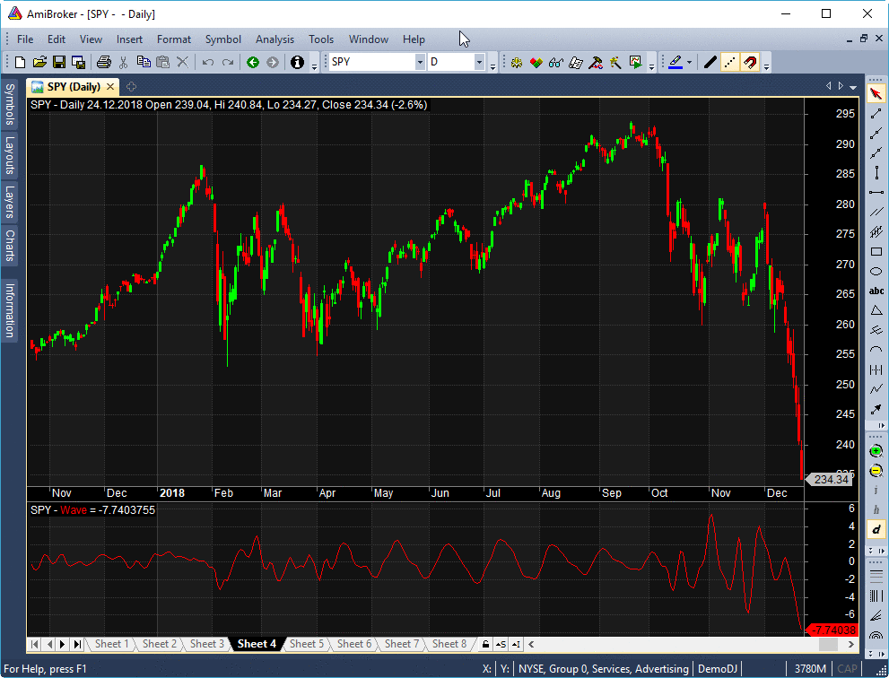
****

'''Tomasz Janeczko, AmiBroker.com www.amibroker.com

BACK TO TOP LINK

BACK TO LIST


See also: [FSM.afl](FSM.afl)


---

## TRADERSSTUDIO: JUNE 2019

The importable TradersStudio files based on John Ehlers''' article in this issue, '''Fourier Series Model of The Market,''' can be obtained on request via email to info@TradersEdgeSystems.com . The code is also available at Traders.com in the Traders''' Tips area.

The author did not provide complete code for a trading system. The code I am supplying may not be what the author intended. It only seems to work when traded without commissions or slippage so additional work is needed to convert this to a real-world trading system.


```basic
'Fourier Series Model of The Market
'Author: John F. Ehlers, TASC Jun 2019
'Coded by: Richard Denning, 4/16/2019
'www.TradersEdgeSystems.com

'Compute filter coefficients once
Function WAVE(Fundamental,Bandwidth)
  'Fundamental = 20
    Dim G1 As BarArray
    Dim S1 As BarArray
    Dim L1 As BarArray
    Dim BP1 As BarArray
    Dim Q1 As BarArray
    Dim P1 As BarArray
    Dim G2 As BarArray
    Dim S2 As BarArray
    Dim L2 As BarArray
    Dim BP2 As BarArray
    Dim Q2 As BarArray
    Dim P2 As BarArray
    Dim G3 As BarArray
    Dim S3 As BarArray
    Dim L3 As BarArray
    Dim BP3 As BarArray
    Dim Q3 As BarArray
    Dim P3 As BarArray
    Dim count As BarArray
   
   If CurrentBar = 1 Then 
        L1 = TStation_Cosine(360 / Fundamental)
        G1 = TStation_Cosine(Bandwidth*360 / Fundamental)
        S1 = 1 / G1 - Sqr(1 / (G1*G1) - 1)
        L2 = TStation_Cosine(360 / (Fundamental / 2))
        G2 = TStation_Cosine(Bandwidth*360 / (Fundamental / 2))
        S2 = 1 / G2 - Sqr(1 / (G2*G2) - 1)
        L3 = TStation_Cosine(360 / (Fundamental / 3))
        G3 = TStation_Cosine(Bandwidth*360 / (Fundamental / 3))
        S3 = 1 / G3 - Sqr(1 / (G3*G3) - 1)
   End If
   
'Fundamental Band-Pass
    BP1 = .5*(1 - S1)*(Close - Close[2]) + L1*(1 + S1)*BP1[1] - S1*BP1[2]
    
'Fundamental Quadrature
    Q1 = (Fundamental / 6.28)*(BP1 - BP1[1])
        
'Second Harmonic Band-Pass
    BP2 = .5*(1 - S2)*(Close - Close[2]) + L2*(1 + S2)*BP2[1] - S2*BP2[2]
        
'Second Harmonic Quadrature
    Q2 = (Fundamental / 6.28)*(BP2 - BP2[1])
       
'Thrid Harmonic Band-Pass
    BP3 = .5*(1 - S3)*(Close - Close[2]) + L3*(1 + S3)*BP3[1] - S3*BP3[2]
    Q3 = (Fundamental / 6.28)*(BP3 - BP3[1])
        
'Sum power of each harmonic at each bar over the Fundamental period
    P1 = 0
    P2 = 0
    P3 = 0
    For count = 0 To Fundamental - 1
        P1 = P1 + BP1[count]*BP1[count] + Q1[count]*Q1[count]
        P2 = P2 + BP2[count]*BP2[count] + Q2[count]*Q2[count]
        P3 = P3 + BP3[count]*BP3[count] + Q3[count]*Q3[count]
    Next
    
'Add the three harmonics together using their relative amplitudes
    If P1 <> 0 Then
        WAVE = BP1 + Sqr(P2 / P1)*BP2 + Sqr(P3 / P1)*BP3
    End If
'Print FormatDateTime(Date)," P1 ",P1," WAVE ",wave
End Function
'----------------------------------------------------------------------
Function TSTATION_COSINE(TSdegrees)
TSTATION_COSINE = Cos(DegToRad(TSdegrees))
End Function
'----------------------------------------------------------------------
'Code to plot indicator
Sub WAVE_IND(FundamentalLen,Bandwidth)
Dim theWAVE As BarArray
theWAVE = WAVE(FundamentalLen,Bandwidth)
plot1(theWAVE)
'-----------------------------------------------------------------------
'Optional cyclic trading signal 
'Rate Of change crosses zero at cyclic turning points 
Sub WAVE_SYS(FundamentalLen,Bandwidth)
Dim theWAVE As BarArray
Dim theROC As BarArray
theWAVE = WAVE(FundamentalLen,Bandwidth)
theROC = (FundamentalLen / 12.57)*(theWAVE - theWAVE[2])
If theROC[1] >= 0 And theROC < 0 Then Buy("LE",1,0,Market,Day)
If theROC[1] <= 0 And theROC > 0 Then ExitLong("LX","",1,0,Market,Day)
If theROC[1] <= 0 And theROC > 0 Then Sell("SE",1,0,Market,Day)
If theROC[1] >= 0 And theROC < 0 Then ExitShort("SX","",1,0,Market,Day)
End Sub
'------------------------------------------------------------------------
End Sub
```

'''Richard Denning info@TradersEdgeSystems.com for AIQ Systems

BACK TO TOP LINK

BACK TO LIST

ORIGINALLY FOOTER HERE

Originally published in the June 2019 issue of Technical Analysis of STOCKS & COMMODITIES magazine. All rights reserved. '' Copyright 2019, Technical Analysis, Inc.


See also: [FSM.trs](FSM.trs)


---

## BibTeX

```bibtex
@misc{traders_tips_2019_06,
  author = {{Technical Analysis of STOCKS \& COMMODITIES}},
  title = {Traders' Tips: Fourier Series Model Of The Market},
  year = {2019},
  month = jun,
  howpublished = {online},
  url = {https://www.traders.com/Documentation/FEEDbk_docs/2019/06/TradersTips.html}
}
```
