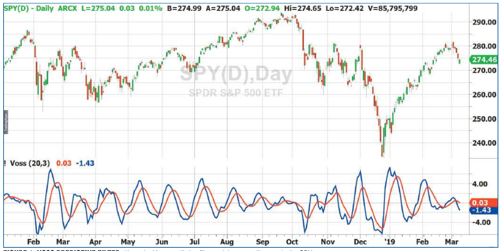

# A Peek Into The Future

- **Author:** John Ehlers
- **Publication:** Technical Analysis of STOCKS & COMMODITIES, Volume 37, August 2019, pp. 9--11
- **Article URL:** [Article PDF](https://technical.traders.com/archive/article.asp?file=\V37\C08\894EHLE.pdf)
- **Traders' Tips URL:** [Traders' Tips, August 2019](https://www.traders.com/Documentation/FEEDbk_docs/2019/08/TradersTips.html)

---

*Peaks And Valleys*

*We all know there is no crystal ball for the markets. But if you could get a signal in advance of other signals that are used by traders, that might be the next best thing. Here, we introduce a new filter that could help signal cyclic turning points.*

Trading would be considerably less difficult if we could look into the future. Of course that is impossible, but signal processing can provide a filter with negative group delay. In this article, I will describe such a filter. While it cannot *really* look into the future, it *can* provide signals in advance of signals used by other traders---and that may be enough to create a successful trading edge.

## Avoiding Delays

There are two kinds of delay associated with signal processing filters: *group delay* and *phase delay*. It is perhaps easiest to understand these two concepts by considering a five-bar simple moving average. Signals at the output of this moving average are delayed by exactly two bars at all frequencies. That is *group delay*. If we examine the filter output relative to an input of a cycle having a 20-bar period, the two-bar group delay becomes a phase delay that is 10% of the cycle period, or 36 degrees. If we examine the filter output relative to an input cycle having a 10-bar period, the phase delay is 20% of the cycle period, or 72 degrees.

An exponential moving average (EMA) filter, on the other hand, has a large group delay at very long signal periods, reducing to a minimum delay at the highest possible sample frequency (the Nyquist frequency). This group delay is nonlinear across the spectrum, making the phase delay even more nonlinear. In signal processing, group delay is used as a measure of signal distortion because signals arrive at the filter output in different phase relationships than existed at the filter input. Parenthetically, since market data is generally noisy with a wide spectral bandwidth, filter group and phase distortions have led to some interesting interpretations of technical indicators.

In general, it is best to minimize group and phase delays in technical indicators because minimization naturally improves indicator robustness in different market conditions. I discovered "A universal negative group delay filter for the prediction of band-limited signals" (see "Further reading" at end), and I have renamed the filter described in that article the *Voss predictive filter*. The derivation of the filter is complicated and long, but the filter itself is very simple. I show the formula for it in the code listing shown in the sidebar "EasyLanguage Code For Voss Predictive Filter."

## Bandwidth

There is a qualification required by the Voss predictive filter that the input signal be band-limited. Market data can reasonably be described as having an unlimited bandwidth, and so the Voss predictive filter must be preceded by a band-limiting filter to be useful in technical analysis. The simplest filter to use for this application is my two-pole bandpass filter (I describe this filter in chapter 5 of my book *Cycle Analytics For Traders*). This filter is also described in the code listing for the Voss predictive filter in the code sidebar. Please remember that this bandpass filter is also subject to nonlinear group and phase delays. Because a band-limited input signal is a requirement for the Voss filter, a true overall prediction is not possible. But reducing lag is always a good thing in technical analysis.

The input variables are the center period of the band-limiting bandpass filter and the number of bars forward of the prediction to be produced. You can experiment with the inputs for your application, but I recommend that you do not exceed three bars of prediction. The reason is that the output becomes noisier as the prediction is increased. The only way to reduce the output noise is to reduce the bandwidth of the bandpass filter. Of course, reducing the bandwidth increases the group and phase lags of the filter with the result that it is a no-win solution.

After the variables are declared, the filter constants are computed once on the first bar on the chart. The Voss predictive filter constant called "order" is approximately three times the desired prediction.

Next, the two-pole bandpass filter I describe in my book is computed as *Filt*. *Filt* then becomes the input to the Voss predictive filter.

The Voss predictive filter consists of multiple time-delayed feedback terms in order to accomplish anticipatory coupling, leading to negative group delay for frequency components within the passband of the bandpass filter.

The prediction of the Voss predictive filter is plotted relative to the output of the bandpass filter so that the prediction of the filter is obvious. The relationship between the two plots can be used to develop trading rules, which is beyond the scope of this article.

## Tracking Peaks and Valleys

The performance of the Voss predictive filter is shown in Figure 1, where it is applied to a little more than a year's worth of data of SPY, the SPDR S&P 500 ETF. The red indicator line is the output of the bandpass filter and the blue indicator line is the Voss predictive filter output. It is obvious that the blue line precedes the red line in its motion, and is therefore predictive. During the spring of 2018, SPY was in a cyclic mode with an approximate monthly (20-bar) cycle period. The bandpass filter accurately tracked the peaks and valleys of the market movement. Thus, the crossings of the blue line relative to the red line at its peaks and valleys were excellent sell and buy signals, respectively. The performance of the filter can be estimated by lining up the indicator crossovers relative to the peaks and valleys in the price action of the barchart.

On the other hand, SPY went into a trend mode in January 2019, and the cycle signal failed miserably, signaling a short position during the runup. This failure was not due to a failure of the prediction. Rather, the failure was basically a result of no information being within the passband of the bandpass filter. The only way to minimize the impact of this condition is to employ an additional trend detector.


**Figure 1: Voss Predictive Filter.** Here, the Voss predictive filter anticipates cyclic turns in the SPY.

## Tools You Can Use

The Voss predictive filter is another new tool that can improve your trading edge by giving you a peek into the future when the conditions are right. I hope it works well for you.

---

## EasyLanguage Code For Voss Predictive Filter

```easylanguage
Inputs:
  Period(20),
  Predict(3);

Vars:
  Order(0),
  F1(0), G1(0), S1(0), Bandwidth(.25),
  count(0),
  SumC(0),
  Filt(0),
  Voss(0);

If CurrentBar = 1 Then Begin
  Order = 3*Predict;
  F1 = Cosine(360 / Period);
  G1 = Cosine(Bandwidth*360 / Period);
  S1 = 1 / G1 - SquareRoot( 1 / (G1*G1) - 1);
End;

//Band Limit the input data with a wide band BandPass Filter
Filt = .5*(1 - S1)*(Close - Close[2]) + F1*(1 + S1)*Filt[1] - S1*Filt[2];
If CurrentBar <= 5 Then Filt = 0;

//Compute Voss predictor
SumC = 0;
For count = 0 to Order - 1 Begin
  SumC = SumC + ((count + 1) / Order)*Voss[Order - count];
End;
Voss = ((3 + Order) / 2)*Filt - SumC;

Plot1(Filt);
Plot2(Voss);
```

---

## Further Reading

- Ehlers, John F. [2013]. *Cycle Analytics For Traders*, John Wiley & Sons.
- Voss, Henning U. [2017]. "A universal negative group delay filter for the prediction of band-limited signals," https://arxiv.org/abs/1706.07326.

---

## BibTeX

```bibtex
@article{ehlers_peek_future_2019,
  author = {Ehlers, John F.},
  title = {A Peek Into The Future},
  journal = {Technical Analysis of STOCKS \& COMMODITIES},
  volume = {37},
  number = {8},
  pages = {9--11},
  year = {2019},
  month = aug,
  url = {https://technical.traders.com/archive/article.asp?file=\V37\C08\894EHLE.pdf}
}

@misc{traders_tips_2019_08,
  author = {{Technical Analysis of STOCKS \& COMMODITIES}},
  title = {Traders' Tips: A Peek Into The Future},
  year = {2019},
  month = aug,
  howpublished = {online},
  url = {https://www.traders.com/Documentation/FEEDbk_docs/2019/08/TradersTips.html}
}
```
