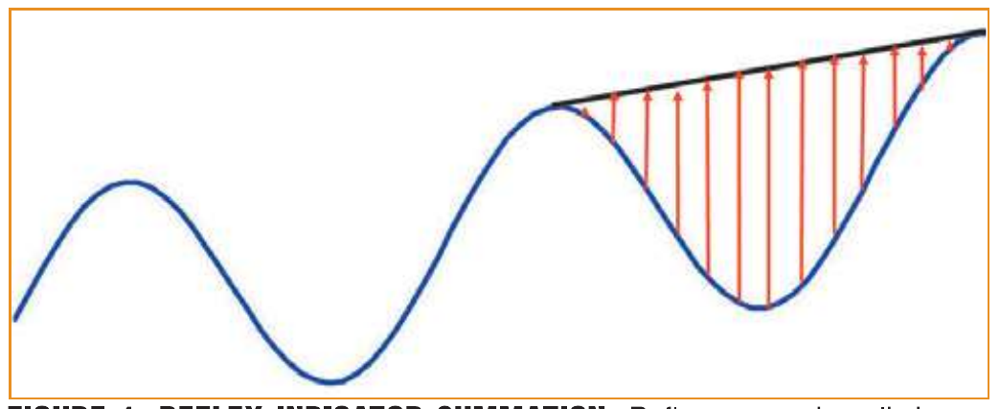
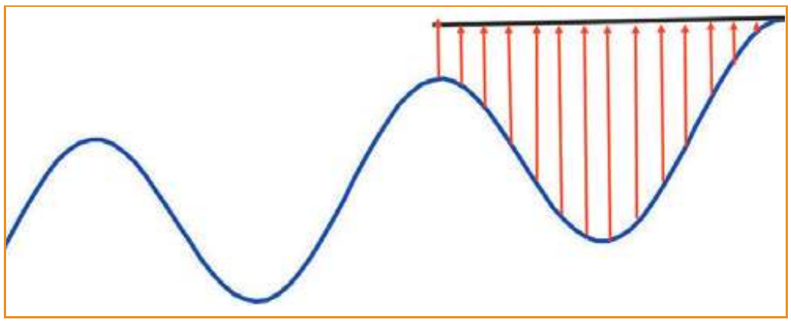
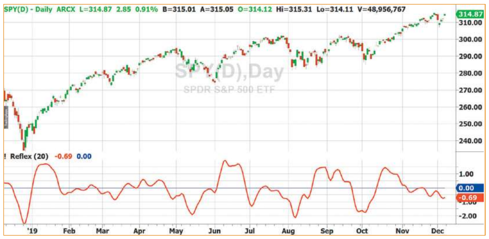
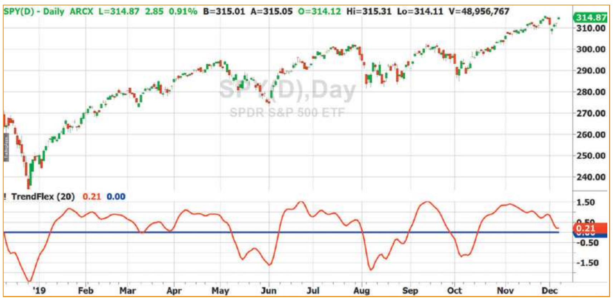

# Reflex: A New Zero-Lag Indicator

*For indicators to be useful, the indications they produce can't arrive too late. Toward that all-important goal, here we introduce a new indicator plus a variation on that indicator that you will want to add to your charts.*

## Introduction

Reduction of lag is probably the most desirable characteristic for an indicator. That is because in trading, even if you get the right answer, it is of no value if the indication comes after the opportunity has passed.

The new indicator I will present here is an averaging type of indicator. The averaging contributes to its stability, and the averaging is done in a novel way to produce zero lag.

I named this new indicator "reflex" because I used to be an archer, and the creation of the indicator reminded me of a bow and arrow. *Reflex* is a kind of bow with a cool name.

## Introducing the Reflex Indicator

Assume the market data structure consists of a cycle superimposed on a trend. With this model, the trend is described as a line between today's close and the close one cycle period ago. This is true regardless of today's cycle phase. We can estimate the cycle period because the indicator is not particularly sensitive to the cycle wavelength. So we can assume a monthly---that is, a 20-bar---cycle period as a starting point to build the indicator.

In Figure 1, I've drawn a notional line from today's close at the peak of the cycle to the peak of the cycle one wavelength ago. This is shown as the black line. The purpose of this line is to essentially remove the trend components from the indicator calculations. Next, we sum all of the distances from each data point to the corresponding location on the black line.

By examination of Figure 1, it is clear that the summation is maximum when today's close is at the cycle peak. Thus, the indicator is exactly in phase with the data and has zero lag. If the line is drawn from cycle valley to cycle valley, the summation will be minimum (or maximum negative, if you prefer). So the reflex indicator swings in exact synchronization with the cycle component in the data.

As mentioned, the calculation is not particularly sensitive to the estimated cycle wavelength, especially when today's close is near a cycle peak or cycle valley where the cycle rate of change is minimum.

The summation of the distances is basically an averaging process, which helps smooth the indicator. However, the two endpoints of the black line are not included in the averaging process, and so the data must be smoothed for the indicator output to appear smoothed. I suggest using my SuperSmoother for this purpose.


**FIGURE 1: REFLEX INDICATOR SUMMATION.** Reflex summation eliminates the trend component.

The reflex indicator code in EasyLanguage is shown in the sidebar "EasyLanguage Code For Reflex Indicator." After the declaration of variables, the first block of code is my SuperSmoother. The data is to be only gently smoothed to minimize the computational lag, and so the smoothing length is set to be half the period of the assumed cycle period. The variable *slope* is the notional black line in Figure 1. The next block of code sums the differences between *slope* and each data point of the length of the cycle period, and the average is produced by dividing by the cycle period length.

## Normalization

For display purposes, the mean square of the sum is computed as an exponential moving average (EMA). When divided by the square root of the mean square, the resultant reflex indicator is scaled in terms of standard deviations.

## The Trendflex Variation

I'll also introduce an interesting variance of the reflex indicator: the *trendflex indicator*. Trendflex retains the trend component, but displays the indicator as an oscillator rather than as superimposed on the price chart. This is accomplished simply by letting the notional black line be horizontal from the current close. The construction of the indicator is illustrated by the diagram in Figure 2. EasyLanguage code for the trendflex indicator is shown in the sidebar "EasyLanguage Code For Trendflex Indicator."

The example performance of the reflex indicator is shown in Figure 3. You can compare this to the example performance of the trendflex indicator in Figure 4.

The *reflex* and *trendflex* indicators can be adapted to charts of any structure, including intraday charts, tick charts, and equivolume charts, because the data length used in its computation is just the number of bars in an estimated cycle wavelength. These indicators can also be used as valuable components of more complex trading strategies.


**FIGURE 2: TRENDFLEX INDICATOR SUMMATION.** The trendflex indicator summation includes the trend component.


**FIGURE 3: REFLEX INDICATOR.** The reflex indicator has zero lag.


**FIGURE 4: TRENDFLEX INDICATOR.** The trendflex indicator includes the trend component.

## EasyLanguage Code For Reflex Indicator

```easylanguage
{
    Reflex Indicator
    (C) 2019  John F. Ehlers
}

Inputs:
    Length(20);

Vars:
    Slope(0),
    sum(0),
    count(0),
    a1(0), b1(0), c1(0), c2(0), c3(0), Filt(0),
    MS(0),
    Reflex(0);

//Gently smooth the data in a SuperSmoother
a1 = expvalue(-1.414*3.14159 / (.5*Length));
b1 = 2*a1*Cosine(1.414*180 / (.5*Length));
c2 = b1;
c3 = -a1*a1;
c1 = 1 - c2 - c3;
Filt = c1*(Close + Close[1]) / 2 + c2*Filt[1] + c3*Filt[2];

//Length is assumed cycle period
Slope = (Filt[Length] - Filt) / Length;

//Sum the differences
Sum = 0;
For count = 1 to Length Begin
    Sum = Sum + (Filt + count*Slope) - Filt[count];
End;

Sum = Sum / Length;

//Normalize in terms of Standard Deviations
MS = .04*Sum*Sum + .96*MS[1];
If MS <> 0 Then Reflex = Sum / SquareRoot(MS);

Plot1(Reflex);
Plot2(0);
```

## EasyLanguage Code For Trendflex Indicator

```easylanguage
{
    Trendflex Indicator
    (C) 2019  John F. Ehlers
}

Inputs:
    Length(20);

Vars:
    sum(0),
    count(0),
    a1(0), b1(0), c1(0), c2(0), c3(0), Filt(0),
    MS(0),
    Trendflex(0);

//Gently smooth the data in a SuperSmoother
a1 = expvalue(-1.414*3.14159 / (.5*Length));
b1 = 2*a1*Cosine(1.414*180 / (.5*Length));
c2 = b1;
c3 = -a1*a1;
c1 = 1 - c2 - c3;
Filt = c1*(Close + Close[1]) / 2 + c2*Filt[1] + c3*Filt[2];

//Sum the differences
Sum = 0;
For count = 1 to Length Begin
    Sum = Sum + Filt - Filt[count];
End;

Sum = Sum / Length;

//Normalize in terms of Standard Deviations
MS = .04*Sum*Sum + .96*MS[1];
If MS <> 0 Then Trendflex = Sum / SquareRoot(MS);

Plot1(Trendflex);
Plot2(0);
```

## Author

*Stocks & Commodities Contributing Editor John Ehlers is a pioneer in the use of cycles and DSP technical analysis. He is president of MESA Software and cofounder of StockSpotter.com and BeYourOwnHedgeFund.com, which is a new site that provides portfolios based on his algorithmic strategies. He can be reached through his website at MESAsoftware.com.*

## Further Reading

```bibtex
@book{ehlers2013cycle,
  author    = {Ehlers, John F.},
  title     = {Cycle Analytics For Traders},
  publisher = {Wiley \& Sons},
  year      = {2013}
}

@article{montevirgen2019market,
  author  = {Montevirgen, Karl},
  title   = {Market Data Insights With John Ehlers},
  journal = {Technical Analysis of Stocks \& Commodities},
  volume  = {37},
  month   = sep,
  year    = {2019},
  note    = {Interview}
}
```
