# Traders' Tips: February 2020

- **Article:** Reflex: A New Zero-Lag Indicator by John Ehlers
- **Traders' Tips URL:** [Traders' Tips, February 2020](https://www.traders.com/Documentation/FEEDbk_docs/2020/02/TradersTips.html)

---

## TradeStation: February 2020

In "Reflex: A New Zero-Lag Indicator" in this issue, author John Ehlers introduces a new averaging indicator that he has designed with reducing lag in mind. According to the author, this new indicator can be used to generate signals in a more timely manner than other lagging calculations.

In his article, Ehlers provides TradeStation EasyLanguage code for the indicators. Here, we are providing EasyLanguage functions for the reflex and trendflex indicators that you can use in developing your own indicators and strategies. We've also provided an example strategy to help you get started.

```easylanguage
Function: _Reflex

{
TASC Feb 2020
(C) 2019 John F. Ehlers
_Reflex function
}
Inputs:
	Length(numericsimple);
Vars:
	Slope( 0 ),
	sum( 0 ),
	count( 0 ),
	a1( 0), b1(0), c1(0), 
	c2(0), c3(0), Filt(0),
	MS(0),Reflex(0);

//Gently smooth the data in a SuperSmoother
a1 = ExpValue( -1.414 * 3.14159 / 
	( .5 * Length ) ) ;
b1 = 2 * a1 * Cosine( 1.414 * 180 / 
	( .5 * Length ) ) ;
c2 = b1 ;
c3 = -a1 * a1 ;
c1 = 1 - c2 - c3 ;
Filt = c1 * ( Close + Close[1] ) / 2 
	+ c2 * Filt[1] + c3 * Filt[2] ;

//Length is assumed cycle period
Slope = ( Filt[Length] - Filt ) / Length ;

//Sum the differences
Sum = 0;
for count = 1 to Length 
begin
	Sum = Sum + ( Filt + count * Slope ) - 
		Filt[count] ;
end;
Sum = Sum / Length ;

//Normalize in terms of Standard Deviations
MS = .04 * Sum * Sum + .96 * MS[1] ;
if MS <> 0 then 
	Reflex = Sum / SquareRoot( MS ) ;

_Reflex = Reflex ;


Function: _TrendFlex

{
TASC Feb 2020
(C) 2019 John F. Ehlers
_Trendflex function
}
inputs:
	Length( numericsimple ) ;
Vars:
	Sum( 0 ), Count( 0 ), a1( 0 ), 
	b1( 0 ), c1( 0 ), c2( 0 ), c3( 0 ), 
	Filt( 0 ), MS( 0 ), Trendflex( 0 ) ;

//Gently smooth the data in a SuperSmoother
a1 = ExpValue( -1.414 * 3.14159 / 
	( .5 * Length ) ) ;
b1 = 2 * a1 * Cosine( 1.414 * 180 / 
	( .5 * Length ) ) ;
c2 = b1 ;
c3 = -a1 * a1 ;
c1 = 1 - c2 - c3 ;
Filt = c1 * ( Close + Close[1] ) / 2 + 
	c2 * Filt[1] + c3 * Filt[2] ;

//Sum the differences
Sum = 0 ;
for count = 1 to Length 
begin
	Sum = Sum + Filt - Filt[count] ;
end ;
Sum = Sum / Length ;

//Normalize in terms of Standard Deviations
MS = .04 * Sum * Sum + .96 * MS[1] ;
if MS <> 0 then 
	Trendflex = Sum / SquareRoot( MS ) ;

_Trendflex = trendflex ;


Indicator:  Trendflex Cross

{
TASC Feb 2020
(C) 2019 John F. Ehlers
}
inputs:
	FastLength( 20 ),
	SlowLength( 50 ) ;
variables:	
	FastTF( 0 ),
	SlowTF( 0) ;

FastTF = _TrendFlex( FastLength ) ;	
SlowTF = _TrendFlex( SlowLength ) ;

Plot1( FastTF - SlowTF ) ;
Plot2( 0 ) ;


Strategy: Trendflex Cross

{
TASC Feb 2020
(C) 2019 John F. Ehlers
}
inputs:
	FastLength( 20 ),
	SlowLength( 50 ) ;
variables:	
	FastTF( 0 ),
	SlowTF( 0) ;

FastTF = _TrendFlex( FastLength ) ;	
SlowTF = _TrendFlex( SlowLength ) ;

if FastTF crosses over SlowTF then	
	Buy next bar at Market 
else if FastTF crosses under SlowTF then	
	SellShort next bar at Market ;
```

To download the EasyLanguage code, please visit our TradeStation and EasyLanguage support forum. The files for this article can be found here: https://community.tradestation.com/Discussions/Topic.aspx?Topic_ID=168100. The filename is "TASC_FEB2020.ZIP."

For more information about EasyLanguage in general, please see https://www.tradestation.com/EL-FAQ.

A sample chart is shown in Figure 1.

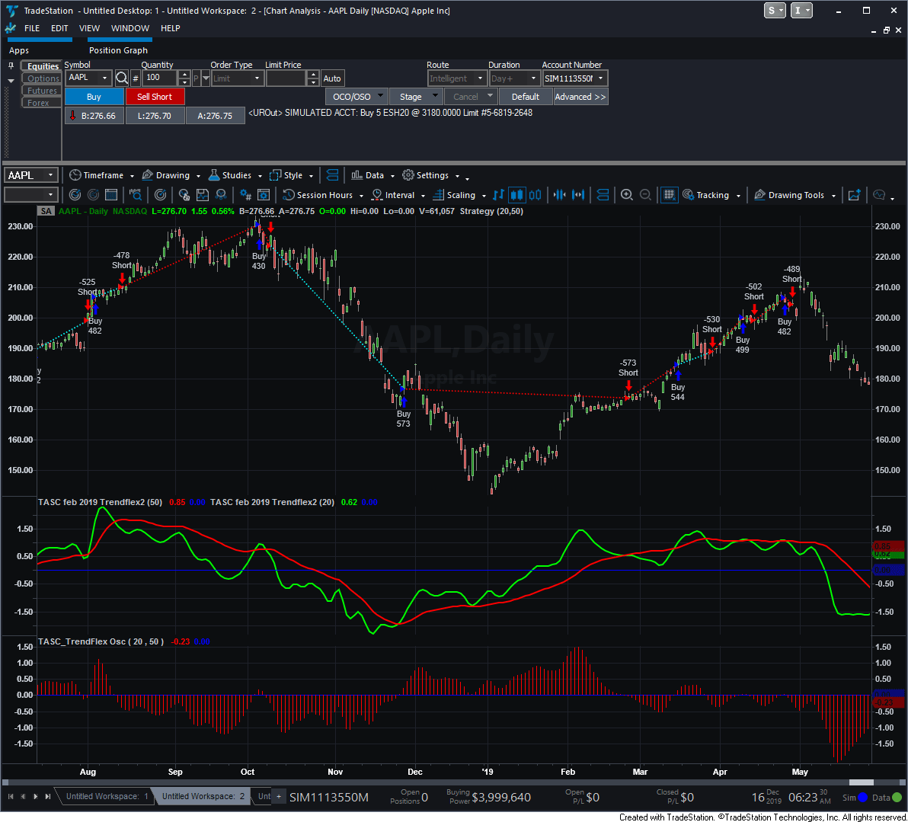
**FIGURE 1: TRADESTATION.** This shows an example of the trendflex indicator and strategy applied on a daily TradeStation chart of AAPL.

*This article is for informational purposes. No type of trading or investment recommendation, advice, or strategy is being made, given, or in any manner provided by TradeStation Securities or its affiliates.*

—Doug McCrary, TradeStation Securities, Inc., www.TradeStation.com

---

## eSignal: February 2020

For this month's Traders' Tip, we've provided the study ReflexIndicators.efs based on the article by John Ehlers in this issue, "Reflex: A New Zero-Lag Indicator." The study displays both the reflex and trendflex indicators discussed in the article.

The studies contain formula parameters that may be configured through the edit chart window (right-click on the chart and select "edit chart"). A sample chart is shown in Figure 2.

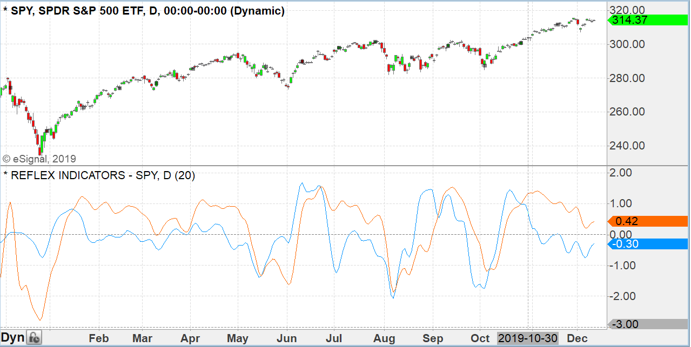
**FIGURE 2: ESIGNAL.** Here is an example of the studies plotted on a daily chart of SPY.

To discuss this study or download a complete copy of the formula code, please visit the EFS library discussion board forum under the forums link from the support menu at www.esignal.com or visit our EFS KnowledgeBase at https://www.esignal.com/support/kb/efs/.

```javascript
/**********************************
Provided By:  
Copyright 2019 Intercontinental Exchange, Inc. All Rights Reserved. 
eSignal is a service mark and/or a registered service mark of Intercontinental Exchange, Inc. 
in the United States and/or other countries. This sample eSignal Formula Script (EFS) 
is for educational purposes only. 
Intercontinental Exchange, Inc. reserves the right to modify and overwrite this EFS file with each new release. 

Description:        
   Reflex: A New
   Zero-Lag Indicator
   by John F. Ehlers
    

Version:            1.00  12/10/2019

Formula Parameters:                     Default:
Length                                  20

Notes:
The related article is copyrighted material. If you are not a subscriber
of Stocks & Commodities, please visit www.traders.com.

**********************************/
var fpArray = new Array();
var bInit = false;

function preMain() {
    setStudyTitle("REFLEX INDICATORS");
    setCursorLabelName("Reflex Indicator", 0);
    setCursorLabelName("Trendflex Indicator", 1);
    setPriceStudy(false);
    setDefaultBarFgColor(Color.RGB(0x00,0x94,0xFF), 0);
    setDefaultBarFgColor(Color.RGB(0xFE,0x69,0x00), 1);
    setPlotType( PLOTTYPE_LINE , 0 );
    setPlotType( PLOTTYPE_LINE , 1 );
    addBand(0, PS_DASH, 1, Color.grey);
    
    var x=0;
    fpArray[x] = new FunctionParameter("Length", FunctionParameter.NUMBER);
	with(fpArray[x++]){
        setLowerLimit(1);		
        setDefault(20);
    }
        
}

var bVersion = null;
var xClose = null;
var a1 = null; 
var b1 = null;
var c1 = null; 
var c2 = null;
var c3 = null;
var vFilt = [];
var Filt = null;
var Filt_1 = null;
var Filt_2 = null;
var MSR = null;
var MSR_1 = null;
var MST = null;
var MST_1 = null;
var Reflex = null;
var Trendflex = null;

function main(Length) {
    if (bVersion == null) bVersion = verify();
    if (bVersion == false) return; 
    
    if ( bInit == false ) { 
        xClose = close();
        a1 = Math.exp(-1.414*Math.PI / (.5*Length));
        b1 = 2*a1*Math.cos(1.414*Math.PI / (.5*Length));
        c2 = b1;
        c3 = -a1*a1;
        c1 = 1 - c2 - c3;
        MSR = 0
        MST = 0
        MSR_1 = 0
        MST_1 = 0
        
        bInit = true; 
    }   

    fNewBar = false;
    
    if (getBarState() == BARSTATE_NEWBAR) {
        Filt_2 = Filt_1
        Filt_1 = Filt
        MSR_1 = MSR
        MST_1 = MST
        fNewBar = true;
    }
    
    if (!fNewBar) vFilt.shift();
    Filt = c1*(xClose.getValue(0) + xClose.getValue(-1)) / 2 + c2*Filt_1 + c3*Filt_2;
    vFilt.unshift(Filt);
    if (getCurrentBarCount() <= Length ) return;
    
    Reflex = Calc_Flex(vFilt, Length, MSR_1, "re");
    Trendflex = Calc_Flex(vFilt, Length, MST_1, "trend")
    MSR = Reflex[1]
    MST = Trendflex[1]

    return [Reflex[0], Trendflex[0]]
}
 
function Calc_Flex(vFilt, Length, MS_1,  Type)
{
    
    var sum = 0
    if (Type == "trend") {
        Slope = 0
    }
    else 
        Slope = (vFilt[Length] - vFilt[0]) / Length

    for (var i = 1; i <= Length; i++) {    
        sum = sum + (vFilt[0] + i * Slope) - vFilt[i]
    }
    sum = sum/Length
    
    var MS = .04 * sum * sum + .96 * MS_1
    if (MS != 0) {
        Flex = sum/Math.sqrt(MS)
    }

    return [Flex, MS];
}

function verify(){
    var b = false;
    if (getBuildNumber() < 779){
        
        drawTextAbsolute(5, 35, "This study requires version 10.6 or later.", 
            Color.white, Color.blue, Text.RELATIVETOBOTTOM|Text.RELATIVETOLEFT|Text.BOLD|Text.LEFT,
            null, 13, "error");
        drawTextAbsolute(5, 20, "Click HERE to upgrade.@URL=https://www.esignal.com/download/default.asp", 
            Color.white, Color.blue, Text.RELATIVETOBOTTOM|Text.RELATIVETOLEFT|Text.BOLD|Text.LEFT,
            null, 13, "upgrade");
        return b;
    } 
    else
        b = true;
    
    return b;
}
```

—Eric Lippert, eSignal, an Interactive Data company, 800 779-6555, www.eSignal.com

---

## Wealth-Lab: February 2020

The reflex and trendflex indicators introduced by John Ehlers in his article in this issue, "Reflex: A New Zero-Lag Indicator," present a novel way to achieve zero lag in an averaging indicator. The reflex indicator synchronizes with the cycle component in the price data. Its companion, the trendflex oscillator, retains the trend component.

Wealth-Lab users can install (or update) the TASCIndicators library to its most-recent version from our website, www.wealth-lab.com, or by using the built-in Extension Manager.

Information on the Extension Manager can be found here: https://www2.wealth-lab.com/WL5WIKI/kbExtensionsTemp.ashx.

Once you see the new indicators listed under the "TASC Magazine Indicators" group, they're ready for use in Wealth-Lab.

Figure 3 shows an example of application of the two indicators.

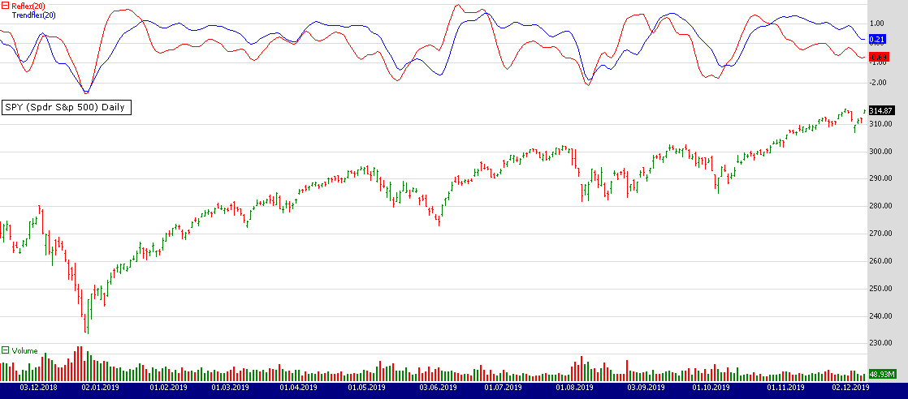
**FIGURE 3: WEALTH-LAB.** The two new indicators, reflex and trendflex, are shown here applied to a daily chart of SPY. (Data provided by Yahoo Finance.)

—Eugene (Gene Geren), Wealth-Lab team, MS123, LLC, www.wealth-lab.com

---

## NeuroShell Trader: February 2020

The reflex indicator and trendflex indicator introduced by John Ehlers in his article in this issue, "Reflex: A New Zero-Lag Indicator," can be easily implemented in NeuroShell Trader using NeuroShell Trader's ability to call external dynamic linked libraries. Dynamic linked libraries can be written in C, C++, and Power Basic.

After moving the code given in the article to your preferred compiler and creating a DLL, you can insert the resulting indicator as follows:

1. Select "New Indicator..." from the Insert menu.
2. Choose the External Program & Library Calls category.
3. Select the appropriate External DLL Call indicator.
4. Setup the parameters to match your DLL.
5. Select the finished button.

Users of NeuroShell Trader can go to the Stocks & Commodities section of the NeuroShell Trader free technical support website to download a copy of this or any previous Traders' Tips.

A sample chart is shown in Figure 4.

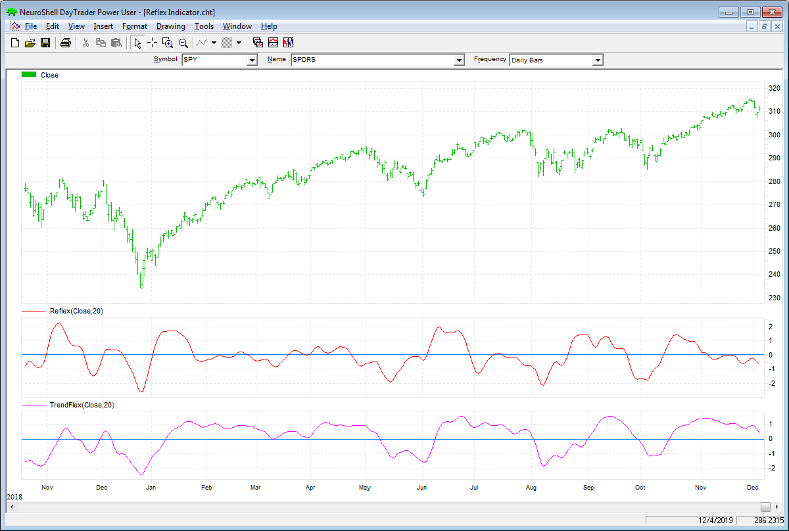
**FIGURE 4: NEUROSHELL TRADER.** This NeuroShell Trader chart shows the reflex and trendflex indicators on a chart of SPY.

—Marge Sherald, Ward Systems Group, Inc., 301 662-7950, sales@wardsystems.com, www.neuroshell.com

---

## NinjaTrader: February 2020

The reflex and trendflex indicators discussed in the article in this issue, "Reflex: A New Zero-Lag Indicator" by John Ehlers, are available for download at the following links for NinjaTrader 8 and NinjaTrader 7:

- **NinjaTrader 8:** https://ninjatrader.com/SC/February2020SCNT8.zip
- **NinjaTrader 7:** https://ninjatrader.com/SC/February2020SCNT7.zip

Once the file has been downloaded, you can import the indicators into NinjaTader 8 from within the Control Center by selecting Tools → Import → NinjaScript Add-On and then selecting the downloaded file for NinjaTrader 8. To import into NinjaTrader 7, from within the Control Center window, select the menu File → Utilities → Import NinjaScript and select the downloaded file.

You can review the indicators' source code in NinjaTrader 8 by selecting the menu New → NinjaScript Editor → Indicators from within the Control Center window and selecting the "reflex" and "trendflex" files. You can review the indicators' source code in NinjaTrader 7 by selecting the menu Tools → Edit NinjaScript → Strategy from within the Control Center window and selecting the "reflex" and "trendflex" files.

NinjaScript uses compiled DLLs that run native, not interpreted, which provides you with the highest performance possible.

A sample chart implementing the strategy is shown in Figure 5.

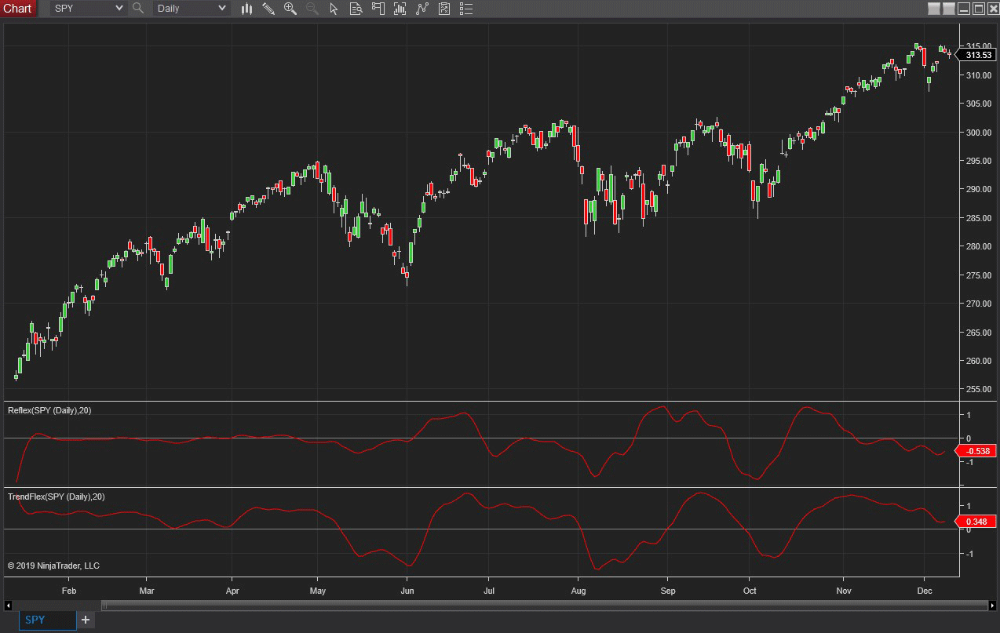
**FIGURE 5: NINJATRADER.** The reflex and trendflex indicators are displayed on a daily SPY chart from January 2019 to December 2019.

Source code: [Reflex.cs](ninja-trader/Reflex.cs) | [TrendFlex.cs](ninja-trader/TrendFlex.cs)

—Raymond Deux & Chris Lauber, NinjaTrader, LLC, www.ninjatrader.com

---

## TradersStudio: February 2020

The importable TradersStudio files based on John Ehlers' article, "Reflex: A New Zero-Lag Indicator," can be obtained on request via email to info@TradersEdgeSystems.com.

I coded the indicators described, reflex and trendflex. Figure 6 shows the two indicators with a 20-bar length on a chart of Google during 2011. The code is also shown here:

```basic
'REFLEX: A NEW ZERO-LAG INDICATOR
'Author: John F. Ehlers
'Coded by: Richard Denning 12/15/19
'TradersEdgeSystems.com

Function EHLERS_REFLEX(Length)
    Dim Slope As BarArray
    Dim theSum As BarArray
    Dim count As BarArray
    Dim a1 As BarArray
    Dim b1 As BarArray
    Dim c1 As BarArray
    Dim c2 As BarArray
    Dim c3 As BarArray
    Dim Filt As BarArray
    Dim MS As BarArray
    Dim Reflex As BarArray

    If BarNumber=FirstBar Then
        'Length = 20
        Slope = 0
        theSum = 0
        count = 0
        a1 = 0
        b1 = 0
        c1 = 0
        c2 = 0
        c3 = 0
        Filt = 0
        MS = 0
        Reflex = 0
    End If

    a1 = Exp(-1.414*3.14159 / (.5*Length))
    b1 = 2*a1*TStation_Cosine(1.414*180 / (.5*Length))
    c2 = b1
    c3 = -a1*a1
    c1 = 1 - c2 - c3
    Filt = c1*(Close + Close[1]) / 2 + c2*Filt[1] + c3*Filt[2]
'Length is assumed cycle period
    Slope = (Filt[Length] - Filt) / Length
'Sum the differences
    theSum = 0
    For count = 1 To Length
        theSum = theSum + (Filt + count*Slope) - Filt[count]
    Next
    theSum = theSum / Length
'Normalize in terms of Standard Deviations
    MS = .04*theSum*theSum + .96*MS[1]
    If MS <> 0 Then
        Reflex = theSum / Sqr(MS)
    End If
    EHLERS_REFLEX = Reflex
End Function
'--------------------------------------------------------------
Function EHLERS_TRENDFLEX(Length)
    Dim theSum As BarArray
    Dim count As BarArray
    Dim a1 As BarArray
    Dim b1 As BarArray
    Dim c1 As BarArray
    Dim c2 As BarArray
    Dim c3 As BarArray
    Dim Filt As BarArray
    Dim MS As BarArray
    Dim Trendflex As BarArray

    If BarNumber=FirstBar Then
        'Length = 20
        theSum = 0
        count = 0
        a1 = 0
        b1 = 0
        c1 = 0
        c2 = 0
        c3 = 0
        Filt = 0
        MS = 0
        Trendflex = 0
    End If
'Gently smooth the data in a SuperSmoother
    a1 = Exp(-1.414*3.14159 / (.5*Length))
    b1 = 2*a1*TStation_Cosine(1.414*180 / (.5*Length))
    c2 = b1
    c3 = -a1*a1
    c1 = 1 - c2 - c3
    Filt = c1*(Close + Close[1]) / 2 + c2*Filt[1] + c3*Filt[2]
'Sum the differences
    theSum = 0
    For count = 1 To Length
        theSum = theSum + Filt - Filt[count]
    Next
    theSum = theSum / Length
'Normalize in terms of Standard Deviations
    MS = .04*theSum*theSum + .96*MS[1]
    If MS <> 0 Then
        Trendflex = theSum / Sqr(MS)
    End If
 EHLERS_TRENDFLEX = Trendflex
End Function
'--------------------------------------------------------------
'Indicator plot for REFLEX:
Sub REFLEX_IND(length)
Dim Reflex As BarArray
Reflex = EHLERS_REFLEX(20)
Plot1(Reflex)
Plot2(0)
End Sub
'---------------------------------------------------------------
'Indicaotr plot for TRENDFLEX:
Sub TRENDFLEX_IND(length)
Dim Trendflex As BarArray
Trendflex = EHLERS_TRENDFLEX(20)
Plot1(Trendflex)
Plot2(0)
End Sub
'--------------------------------------------------------------
Function TSTATION_COSINE(TSdegrees)
TSTATION_COSINE = Cos(DegToRad(TSdegrees))
End Function
'--------------------------------------------------------------
```

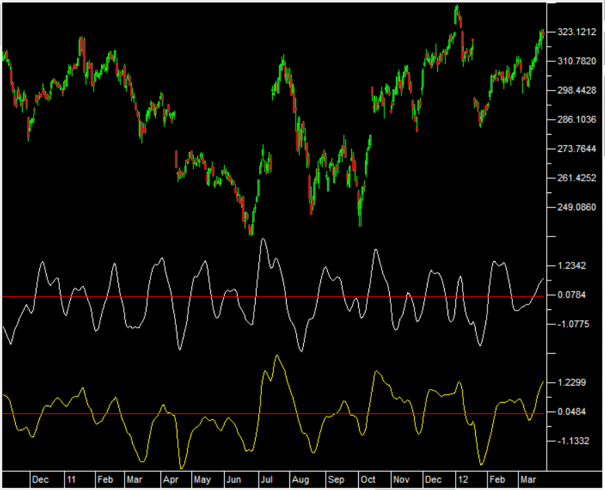
**FIGURE 6: TRADERSSTUDIO.** John Ehlers' reflex indicator (white) and trendflex indicator (yellow) are shown on a chart of Google during 2011.

—Richard Denning, info@TradersEdgeSystems.com, for TradersStudio

---

## Microsoft Excel: February 2020

In his article in this issue, "Reflex: A New Zero-Lag Indicator," John Ehlers takes a look at a couple novel indicators with reduced lag.

His reflex indicator is more sensitive to significant reversals, while the trendflex oscillator seems better at recognizing enduring trends. Both seem sensitive to sharper moves relative to recent price behavior.

As a "what if," I decided to add color bands at the zero crossover points to see if they might be useful as trading signals (see my Figures 8 and 9).

While I did not create a long and short transaction table to verify things, my observations over a few symbols suggest that there might be something to the idea of using the crossovers.

Trendflex is perhaps a bit better for this purpose but would definitely need a few complimentary indicators to confirm entries and exits and to help to reduce whipsaws in the middle of ongoing trends.

It will be well worth your time to look at some other symbols with these two indicators and think about how you might incorporate either or both into your trading toolbox.

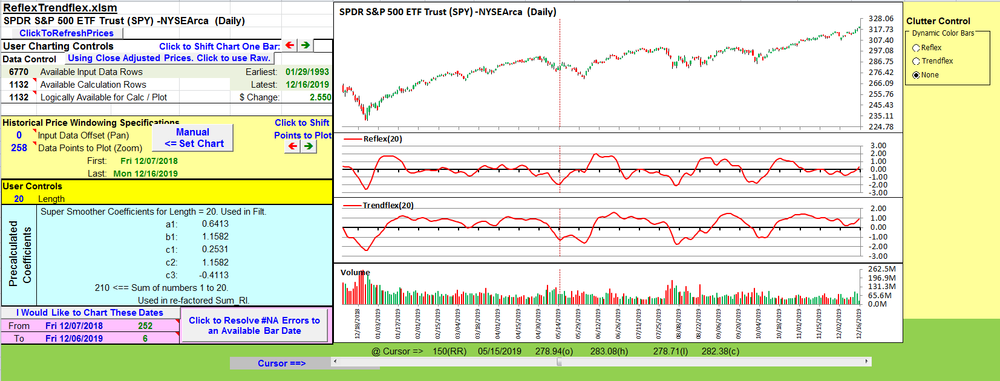
**FIGURE 7: EXCEL.** Reflex and trendflex similar to Figures 3 and 4 from Ehlers' article.

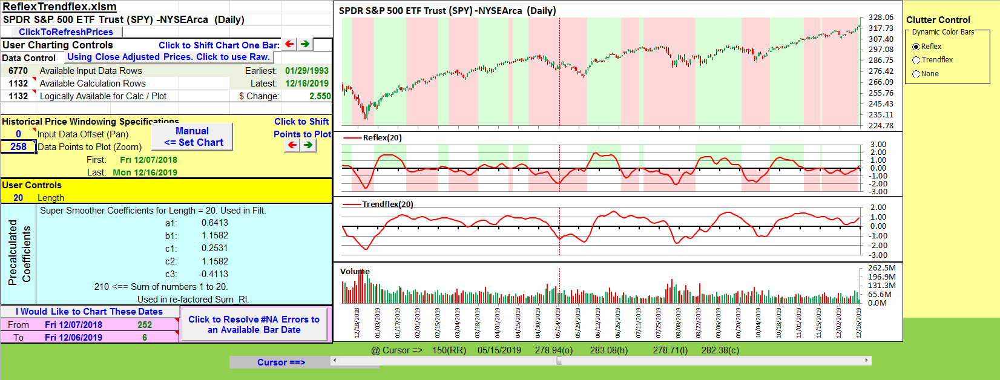
**FIGURE 8: EXCEL.** Color Bands for Reflex Zero Crossovers.

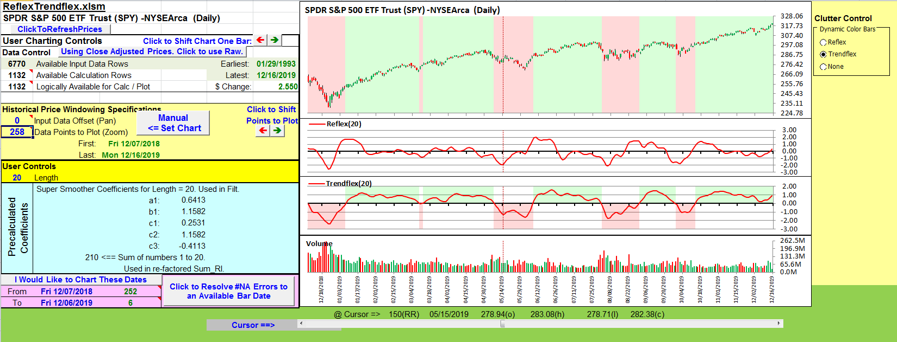
**FIGURE 9: EXCEL.** Color Bands for Trendflex Zero Crossovers.

The spreadsheet file for this Traders' Tip can be downloaded here: [ReflexTrendflex.xlsm](code/ReflexTrendflex.xlsm)

—Ron McAllister, Excel and VBA programmer, rpmac_xltt@sprynet.com

---

## thinkorswim: February 2020

We have put together a pair of studies based on the article by John Ehlers, "Reflex: A New Zero-Lag Indicator." We built the studies referenced by using our proprietary scripting language, thinkscript. To ease the loading process, simply click on https://tos.mx/KuKGOLK or enter it into setup→open shared item from within thinkorswim then choose view thinkScript study and name it "reflex." Do the same with https://tos.mx/aE5oFkr and name it "trendflex." These can then be added to your chart from the edit study and strategies menu within thinkorswim charts. We should note that we used our ExpAverage() function instead of the simple recursion formula as in the author's scripts to utilize Prefetch to get better initialization and therefore consistent initial values regardless the chosen time period.

Figure 10 shows these two studies applied to a one-year daily chart of SPY. See John Ehlers' article for how to interpret these studies.

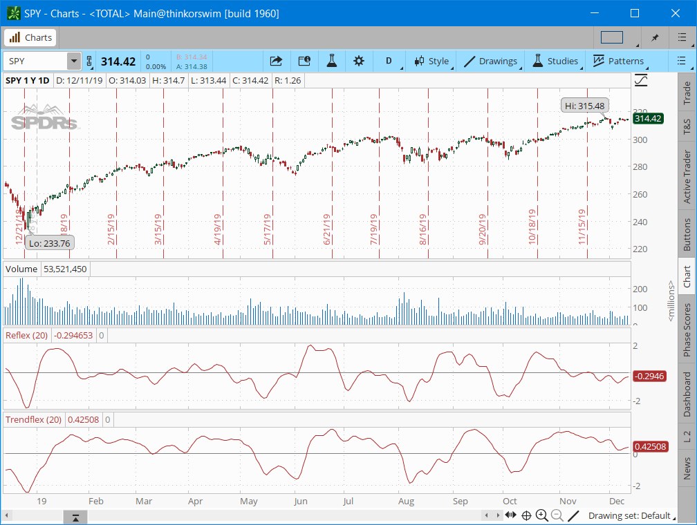
**FIGURE 10: THINKORSWIM.** The two studies applied to a one year daily chart of SPY.

—thinkorswim, A division of TD Ameritrade, Inc., www.thinkorswim.com

---

## Quantacula Studio: February 2020

We added the reflex and trendflex indicators to our TASC library for Quantacula, so they are available both on our website and in Quantacula Studio. Here is an example trading strategy written in C# using the reflex indicator. The strategy enters the market when reflex hits a 200-bar low, and exits when it turns down from a 20-bar high. This simple technique is effective at timing entries and exits, as shown in the example chart of VZ in Figure 11.

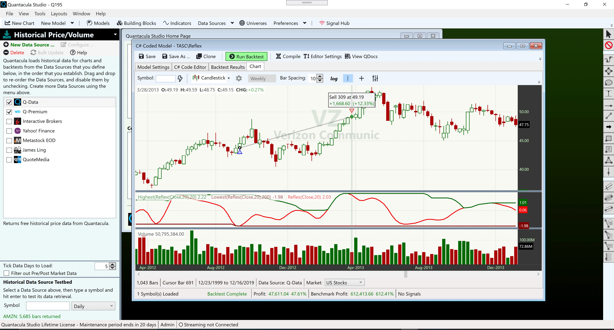
**FIGURE 11: AN EXAMPLE TRADE IN THE QUANTACULA REFLEX 200/20 STRATEGY**

The code is shown here:

```csharp
Code:
using QuantaculaBacktest;
using QuantaculaCore;
using QuantaculaIndicators;
using System.Drawing;
using TASCIndicators;

namespace Quantacula
{
    public class MyModel1 : UserModelBase
    {
        //create indicators here
        public override void Initialize(BarHistory bars)
        {
            StartIndex = 200;
            reflex = new Reflex(bars.Close, 20);
            PlotIndicator(reflex);
            reflexLL = new Lowest(reflex, 200);
            PlotIndicator(reflexLL, Color.Maroon);
            reflexHH = new Highest(reflex, 20);
            PlotIndicator(reflexHH, Color.DarkGreen);
        }

        //execute the strategy rules here
        public override void Execute(BarHistory bars, int idx)
        {
            if (!HasOpenPosition(bars, PositionType.Long))
            {
                //code your buy conditions here
                if (reflex[idx] == reflexLL[idx])
                {
                    PlaceTrade(bars, TransactionType.Buy, OrderType.Market);
                    exitFlag = false;
                }
            }
            else
            {
                //code your sell conditions here
                if (exitFlag)
                {
                    if (reflex[idx] < reflexHH[idx])
                        PlaceTrade(bars, TransactionType.Sell, OrderType.Market);
                }
                else if (reflex[idx] == reflexHH[idx])
                    exitFlag = true;
            }
        }

        //declare private variables below
        Reflex reflex;
        Lowest reflexLL;
        Highest reflexHH;
        bool exitFlag;
    }
}
```

—Dion Kurczek, Quantacula LLC, info@quantacula.com, www.quantacula.com

---

## BibTeX

```bibtex
@misc{traders_tips_2020_02,
  author = {{Technical Analysis of STOCKS \& COMMODITIES}},
  title = {Traders' Tips: Reflex: A New Zero-Lag Indicator},
  year = {2020},
  month = feb,
  howpublished = {online},
  url = {https://www.traders.com/Documentation/FEEDbk_docs/2020/02/TradersTips.html}
}
```
