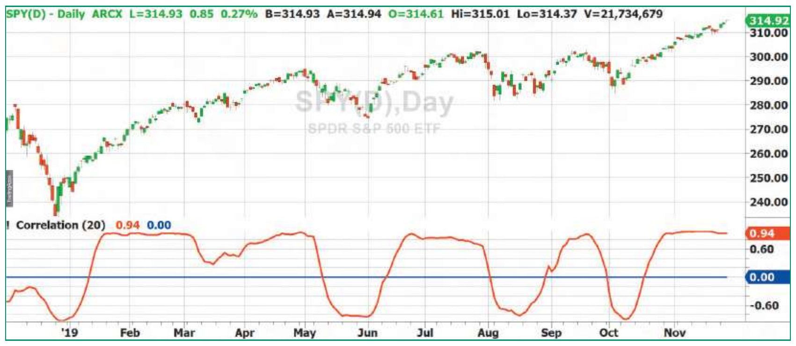
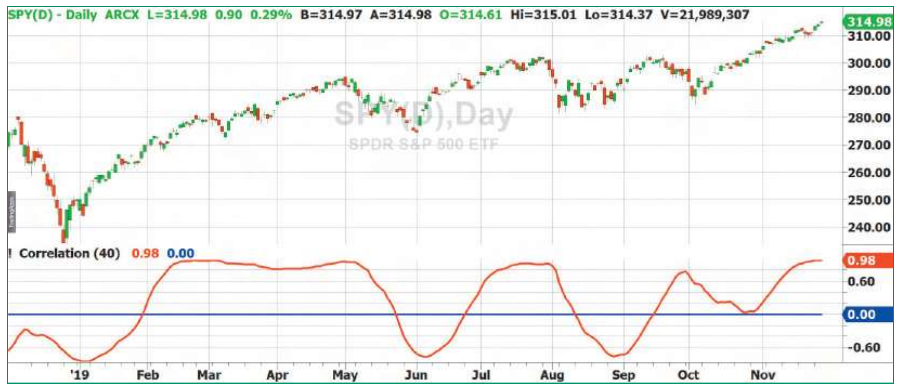
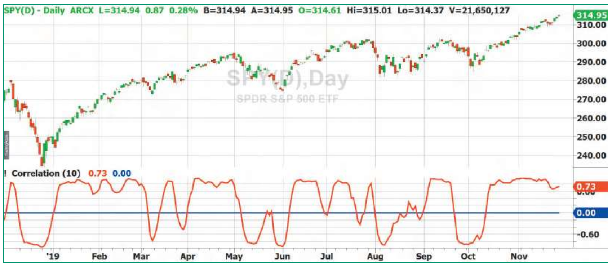

# Correlation As A Trend Indicator

**John F. Ehlers**
*Technical Analysis of Stocks & Commodities*, Volume 38, May 2020, pp. 24–27

- **Article URL:** <https://technical.traders.com/archive/article.asp?file=\V38\C05\270EHLE.pdf>
- **Traders' Tips URL:** <https://www.traders.com/Documentation/FEEDbk_docs/2020/05/TradersTips.html>

---

Here, we introduce a new indicator: the correlation trend indicator. It could help you to identify the onset of a trend. It could also help you to detect the failure of a trend—thereby giving you an indication that a cyclic mode may be beginning.

## The concept

Imagine correlating prices with a straight line having a positive slope. If the price trend is up, the correlation is nearly +1. If the price trend is down, there is anticorrelation and the correlation is nearly −1. If the price trend is sideways, or if prices are oscillating, there is no correlation over the span of the correlation period.

These conditions pretty much describe an ideal trend indicator. The indicator output is even limited in its range between −1 and +1, so it can be applied universally to any security symbol.

## Cyclic component

If the correlation period is shortened to be approximately a half cycle length, then the correlation indicator can also be used to extract the cyclic component. This is because the correlation is positive during the upswing part of the cycle and is negative during the downswing part. However, similar to a moving average, the lag of a correlation indicator is approximately half the correlation length. So if the correlation length is half of a cycle period, the lag will be at least a quarter of the cycle. In the case of band-limited signals, this lag can be mitigated by using the rate of change of the correlation as the real indicator, but there are other cycle indicators that work better.

## The correlation trend indicator

The correlation trend indicator can be adjusted to accommodate the expected trade holding period. For example, if you want to hold a trade for about a month, you could use a 20-bar correlation period. If your expected holding period is on the order of a quarter year, you could use a 40- to 60-bar correlation period. Since the lag of the correlation indicator is approximately half the correlation period, a trader could identify the onset of a trend with a shorter correlation period and then extend the correlation period as the trend develops. Correspondingly, a trader could detect the failure of the trend sooner by decreasing the correlation period.

Figure 1 shows the correlation trend indicator with a 20-bar correlation period applied to approximately one year's worth of daily data on SPY. The action of the indicator is self-explanatory.


**Figure 1: Correlation Trend Indicator, with 20-bar correlation period.** Trends are clearly identified on SPY using a 20-bar correlation period.

The indicator can be further smoothed by using a 40-bar correlation period as shown in Figure 2. While the indicator is smoother than in Figure 1, the increased lag is apparent.


**Figure 2: Correlation Trend Indicator, with 40-bar correlation period.** The correlation trend indicator is smoother using a 40-bar correlation period. However, the lag is increased.

The lag can be reduced to 10 bars or less for the decision regarding the onset or failure of the trend. The shorter correlation period response is shown in Figure 3.


**Figure 3: Correlation Trend Indicator, with 10-bar correlation period.** Trend onsets and failures are more quickly identified using a 10-bar correlation period.

## Implementation

The indicator is a Spearman correlation of closing prices against a straight line with a positive slope. That straight line is created at the variable `Y`. It has a negative value in the code because the counting in the code goes backwards in time, that is, from right to left. The rest of the code is almost textbook.

### EasyLanguage code for the Correlation Trend Indicator

```easylanguage
{
  Correlation Trend Indicator
  (c) 2013-2019 John F. Ehlers
}

Inputs:
  Length(20);

Vars:
  Sx(0),
  Sy(0),
  Sxx(0),
  Sxy(0),
  Syy(0),
  count(0),
  X(0),
  Y(0),
  Corr(0);

Sx = 0;
Sy = 0;
Sxx = 0;
Sxy = 0;
Syy = 0;

For count = 0 to Length - 1 Begin
  X = Close[count];
  Y = -count;
  Sx = Sx + X;
  Sy = Sy + Y;
  Sxx = Sxx + X*X;
  Sxy = Sxy + X*Y;
  Syy = Syy + Y*Y;
End;

If (Length*Sxx - Sx*Sx > 0) and (Length*Syy - Sy*Sy > 0)
Then Corr = (Length*Sxy - Sx*Sy) /
  SquareRoot((Length*Sxx - Sx*Sx) * (Length*Syy - Sy*Sy));

Plot1(Corr);
Plot2(0);
```

---

## References

- Ehlers, John F. [2013]. *Cycle Analytics For Traders*, John Wiley & Sons.
- Ehlers, John F. [2020]. "Correlation As A Trend Indicator," *Technical Analysis of Stocks & Commodities*, Volume 38: May.
