# Traders' Tips: May 2020

- **Article:** Correlation As A Trend Indicator by John Ehlers
- **Traders' Tips URL:** [Traders' Tips, May 2020](https://www.traders.com/Documentation/FEEDbk_docs/2020/05/TradersTips.html)

---

## TRADESTATION: MAY 2020

In his article “Correlation As A Trend Indicator” in this issue, author John Ehlers introduces a new trend indicator that is based on the correlation between a security’s price history and the ideal trend: a straight line. He describes methods for using the indicator to not only identify the onset of new trends but to identify trend failures as well.

Here, we are providing the TradeStation EasyLanguage code for an indicator and strategy as well as a function that you can use in your own EasyLanguage code that are based on the author’s work.

To download the EasyLanguage code, please visit our TradeStation and EasyLanguage support forum. The files for this article can be found at https://community.trade-station.com/Discussions/Topic.aspx?Topic_ID=168100 . The filename is “TASC_MAY2020.ZIP.”  For more information about EasyLanguage in general, please see https://www.tradestation.com/EL-FAQ .

A sample chart is shown in Figure 1.

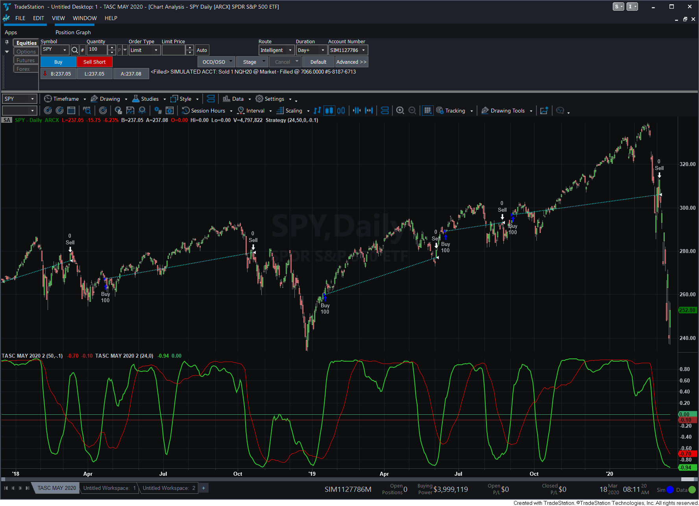
**FIGURE 1: **

This article is for informational purposes. No type of trading or investment recommendation, advice, or strategy is being made, given, or in any manner provided by TradeStation Securities or its affiliates.

—Doug McCrary TradeStation Securities, Inc. www.TradeStation.com

BACK TO LIST

```easylanguage
Indicator: Correlation Trend
// Correlation Trend Indicator
// TASC MAY 2020
// John F. Ehlers


inputs: Length( 20 ), TriggerLevel( .5 ) ;
variables: Corr( 0 ) ;

Corr = _CorrelationTrend( Length ) ;

Plot1( Corr, "Trend Cor" ) ;
Plot2( TriggerLevel, "Trigger" ) ;


Strategy: Correlation Trend
// Correlation Trend Strategy
// TASC MAY 2020
// John F. Ehlers


inputs: FastLength( 20 ), SlowLength( 40 ),
	BuyThreshold( .5 ), SellThreshold( 0 ) ;
variables: CorrF( 0 ), CorrS( 0 ) ;

CorrF = _CorrelationTrend( FastLength ) ;
CorrS = _CorrelationTrend( SlowLength ) ;

if CorrF crosses over BuyThreshold then
	Buy next bar at Market ;
	
if CorrS crosses under SellThreshold then	
	sell next bar at Market ;	


Function: _CorrelationTrend
// _CorrelationTrend Function
// TASC MAY 2020
// John F. Ehlers


inputs:Length( numericsimple ) ;
variables:Sx( 0 ), Sy( 0 ), Sxx( 0 ), 
	Sxy( 0 ), Syy( 0 ), 
	count( 0 ), X( 0 ), Y( 0 ), Corr( 0 ),
	Num( 0 ), Denom( 0 ); 
 
Sx = 0 ; 
Sy = 0 ; 
Sxx = 0 ; 
Sxy = 0 ; 
Syy = 0 ; 
for count = 0 to Length - 1 
begin  
 	X = Close[count] ; 
 	Y = -count ; 
 	Sx = Sx + X ; 
 	Sy = Sy + Y ; 
 	Sxx = Sxx + X * X ; 
 	Sxy = Sxy + X * Y ; 
 	Syy = Syy + Y * Y ; 
end ; 

Num = Length * Sxy - Sx * Sy ;
Denom = SquareRoot( ( Length * Sxx - Sx * Sx )
	* ( Length * Syy - Sy * Sy ) ) ;

if Denom <> 0 then
	Corr = Num / Denom ;

_CorrelationTrend = Corr ;
```

---

## METASTOCK: MAY 2020

John Ehlers’ article in this issue, “Correlation As A Trend Indicator,” discusses using correlation to an upward-sloping line as a means to determine an instrument’s trend. The MetaStock version of the formula for the correlation trend indicator is as follows:

—William Golson MetaStock Technical Support www.metastock.com

BACK TO LIST

```metastock
MetaStock formula for correlation trend indicator:
pds:= Input("Number of periods", 5, 200, 20);
Correl(Cum(1), C, pds, 0)
```

---

## THINKORSWIM: MAY 2020

We have put together a study based on the article in this issue by John Ehlers, “Correlation As A Trend Indicator.” We built the study referenced by using our proprietary scripting language, thinkscript. To load it, simply click on https://tos.mx/GZnUKaF or enter it into setup→open shared item from within thinkorswim, then choose view thinkScript study and name it “CorrelationTrendIndicator.”

Figure 2 shows this study on one-year daily chart of SPY. See Ehlers’ article on how to interpret this study.

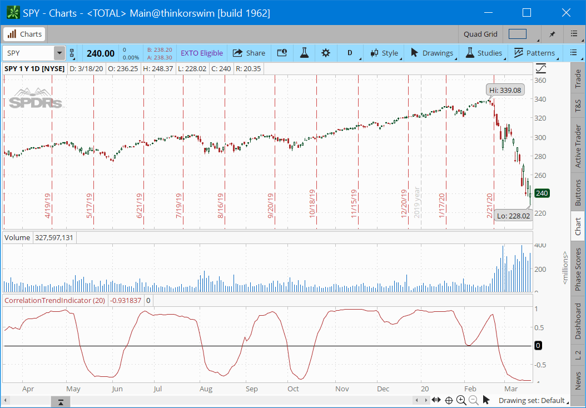
**FIGURE 2: **

—thinkorswim A division of TD Ameritrade, Inc. www.thinkorswim.com

BACK TO LIST

---

## WEALTH-LAB: MAY 2020

In his article in this issue, “Correlation As A Trend Indicator,” John Ehlers presents what looks like a simple and elegant idea for a trend-detection and mode-switching indicator. Following the trading idea described in the article, we are including a simple long-only WealthScript system to demonstrate the CorrelationTrend:

Careful market selection may be the key to a correct application of the indicator. Even such barebone rules could shine with stocks like AAPL that tend to develop prolonged trends (Figure 3). But for others like CAT, which can keep oscillating in ranges for years, results will be much less impressive. They require a different approach. For example, you would want to buy when CorrelationTrend falls significantly below zero and sell when it reaches positive values.

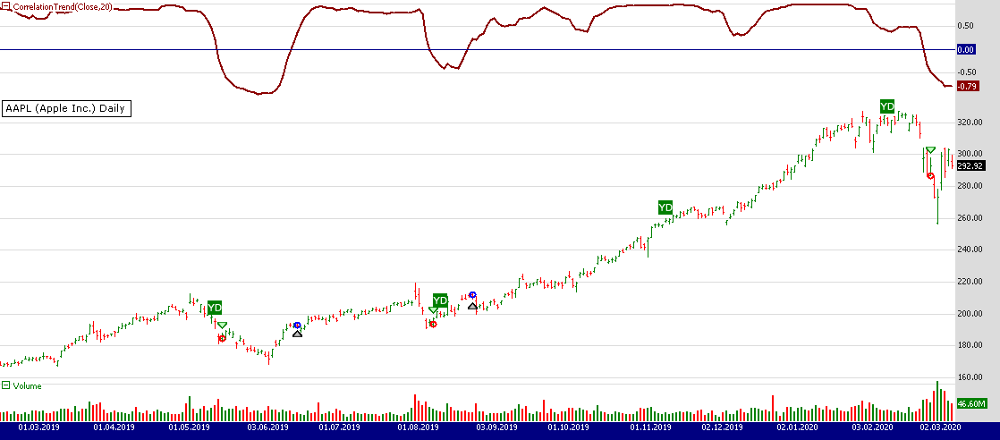
**FIGURE 3: **

Therefore, it would be an interesting problem to research CorrelationTrend’s ability to identify the switch to a cycle mode. That might help develop countertrend systems and trade pullbacks. Another possible application might be to act as a system filter of change from trending mode to mean-reversion mode.

To execute the trading system we are providing, Wealth-Lab users need to install (or update) the latest version of the TASCIndicators library from the extensions section of our website if they haven’t already done so, and restart Wealth-Lab. Then either copy/paste the strategy’s C# code (below) or simply let Wealth-Lab do the job. From the open strategy dialog, click download to get this strategy as well as many others contributed by the Wealth-Lab community.

—Gene (Eugene) Geren, Wealth-Lab team MS123, LLC www.wealth-lab.com

BACK TO LIST

```csharp
Buy at market when the 20-day CorrelationTrend crosses above zero
Exit long when the indicator crosses below zero.
```

```csharp
using System;
using System.Collections.Generic;
using System.Text;
using System.Drawing;
using WealthLab;
using WealthLab.Indicators;
using TASCIndicators;

namespace WealthLab.Strategies
{
	public class MyStrategy : WealthScript
	{		
		protected override void Execute()
		{
			var ct = CorrelationTrend.Series(Close, 20);

			ChartPane pane1 = CreatePane( 35,true,true);
			PlotSeries( pane1,ct,Color.DarkRed,LineStyle.Solid,2);
			DrawHorzLine( pane1, 0, Color.DarkBlue, LineStyle.Solid, 1);

			for(int bar = GetTradingLoopStartBar(1); bar < Bars.Count; bar++)
			{
				if (IsLastPositionActive)
				{
					Position p = LastPosition;
					if (CrossUnder(bar, ct, 0))
						SellAtMarket( bar + 1, p);
				}
				else
				{
					if (CrossOver(bar, ct, 0))
						BuyAtMarket( bar + 1);
				}
			}
		}
	}
}
```

---

## NEUROSHELL TRADER: MAY 2020

The correlation trend indicator presented in John Ehlers’ article in this issue, “Correlation As A Trend Indicator,” can be easily implemented in NeuroShell Trader by using one of NeuroShell Trader’s 800+ indicators. To implement the indicator, select new indicator from the insert menu and use the indicator wizard to set up the following indicator:

Users of NeuroShell Trader can go to the Stocks & Commodities section of the NeuroShell Trader free technical support website to download a copy of this or any previous Traders’ Tips.

A sample chart is shown in Figure 4.

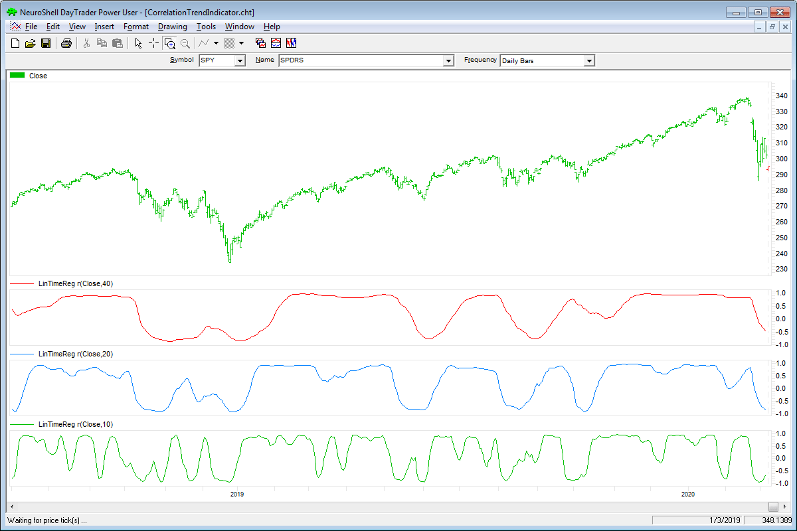
**FIGURE 4: **

—Marge Sherald, Ward Systems Group, Inc. 301 662-7950, sales@wardsystems.com www.neuroshell.com

BACK TO LIST

---

## TRADERSSTUDIO: MAY 2020

The importable TradersStudio files based on the ideas in John Ehlers’ article in this issue, “Correlation As A Trend Indicator,” can be obtained on request via email to info@TradersEdgeSystems.com . The code is also available here:

I coded the indicator described by the author. Figure 5 shows the correlation indicator using the default length of 20 on a chart of Microsoft (MSFT).

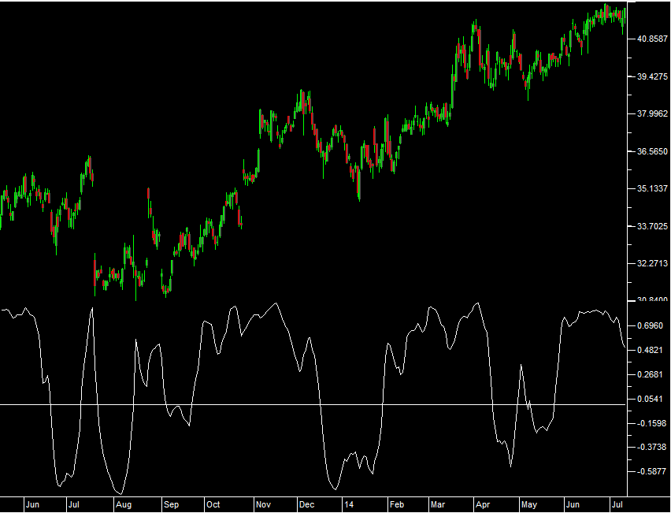
**FIGURE 5: **

—Richard Denning info@TradersEdgeSystems.com for TradersStudio

BACK TO LIST

```basic
'Correlation as a Trend Indicator
'Author: John Ehlers, TASC May 2020
'Coded by: Richard Denning 3/20/20
'www.TrdersEdgesystems.com

Function Ehlers_Correl(Length)
    Dim Sx As BarArray
    Dim Sy As BarArray
    Dim Sxx As BarArray
    Dim Sxy As BarArray
    Dim Syy As BarArray
    Dim count As BarArray
    Dim X As BarArray
    Dim Y As BarArray
    Dim Corr As BarArray

    If BarNumber=FirstBar Then
        'Length = 20
        Sx = 0
        Sy = 0
        Sxx = 0
        Sxy = 0
        Syy = 0
        count = 0
        X = 0
        Y = 0
        Corr = 0
    End If

    Sx = 0
    Sy = 0
    Sxx = 0
    Sxy = 0
    Syy = 0
    For count = 0 To Length - 1
        X = Close[count]
        Y = -count
        Sx = Sx + X
        Sy = Sy + Y
        Sxx = Sxx + X*X
        Sxy = Sxy + X*Y
        Syy = Syy + Y*Y
    Next
    If (Length*Sxx - Sx*Sx > 0) And (Length*Syy - Sy*Sy > 0) Then
        Corr = (Length*Sxy - Sx*Sy) / Sqr((Length*Sxx - Sx*Sx)*(Length*Syy - Sy*Sy))
    End If
Ehlers_correl = Corr
End Function
'-----------------------------------------------------------------------------------
Sub Ehlers_Correl_Ind(length)
Dim Corr As BarArray
Corr = Ehlers_Correl(length)
Plot1(Corr)
Plot2(0)
End Sub
'------------------------------------------------------------------------------------
```

---

## NINJATRADER: MAY 2020

The indicator discussed in John Ehlers’ article in this issue, “Correlation As A Trend Indicator,” is available for download at the following links for NinjaTrader 8 and NinjaTrader 7:

Once the file is downloaded, you can import the indicator into NinjaTader 8 from within the control center by selecting Tools → Import → NinjaScript Add-On and then selecting the downloaded file for NinjaTrader 8. To import in NinjaTrader 7, from within the control center window, select the menu File → Utilities → Import NinjaScript and select the downloaded file.

You can review the indicator’s source code in NinjaTrader 8 by selecting the menu New → NinjaScript Editor → Indicators from within the control center window and selecting the “CTI” file. You can review the indicator’s source code in NinjaTrader 7 by selecting the menu Tools → Edit NinjaScript → Indicator from within the control center window and selecting the “CTI” file.

A sample chart implementing the indicator is shown in Figure 6.

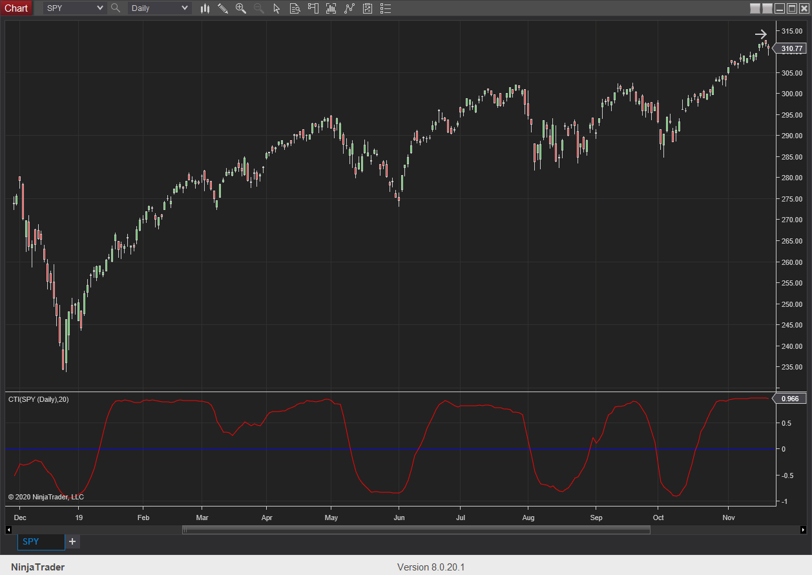
**FIGURE 6: **

—Chris Lauber NinjaTrader, LLC www.ninjatrader.com

BACK TO LIST

Code file: [ninja-trader/CTI.cs](ninja-trader/CTI.cs)

---

## TRADE NAVIGATOR: MAY 2020

We are providing a library file that users can download to implement the indicator described by John Ehlers in his article in this issue, “Correlation As A Trend Indicator.” The file name is “SC202005.”

To download it, click on Trade Navigator’s blue telephone button, select download special file , and replace the word “upgrade” with “SC202005” (without the quotes). Then click the start button. When prompted to upgrade, click yes . If prompted to close all software, click continue . Your library will now download.

This library contains an indicator named correlation SPY AAPL and a template named SC correlation as a trend indicator .

To add indicators to your Trade Navigator chart, open the charting dropdown menu, select add to chart , then on the indicators tab, find your named indicator, select it, and click on add . Repeat for additional indicators if you wish.

This library also contains a template named SC correlation as a trend indicator . This template can be added to your chart (Figure 7) by opening the charting dropdown menu, selecting templates , then selecting the SC correlation as a trend indicator template.

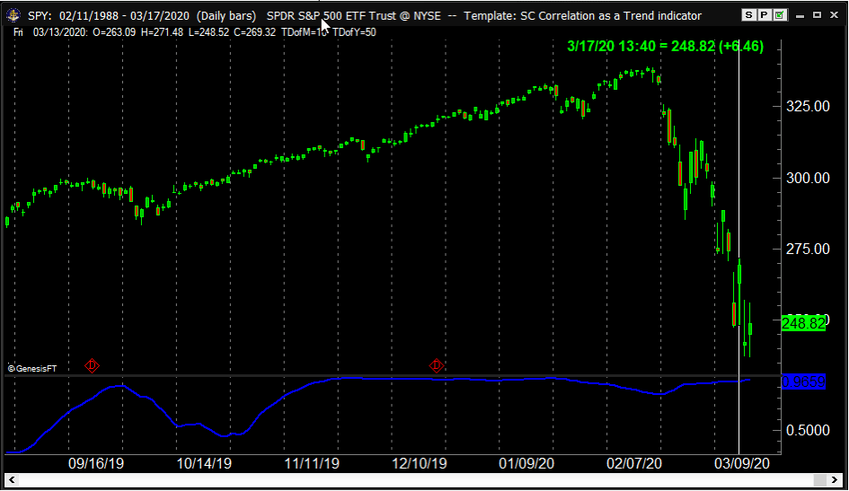
**FIGURE 7: **

If you need assistance, feel free to call our technical support or use live chat. Happy trading!

—Genesis Financial Technologies Tech support 719 884-0245 www.TradeNavigator.com

BACK TO LIST

---

## THE ZORRO PROJECT: MAY 2020

There are thousands of trend indicators that are known to traders. Yet still, John Ehlers has come up with a new idea, and it is presented in his article in this issue, “Correlation As A Trend Indicator.”

The ideal trend curve is a straight upward line. Ehlers’ new correlation trend indicator (CTI) measures the Spearman correlation of the price curve with this ideal trendline.

The TradeStation code that Ehlers provides in his article can be directly converted to Zorro’s C language as follows:

Figure 8 shows the correlation trend indicator applied to SPY (red = 10-day period, blue = 40 days).

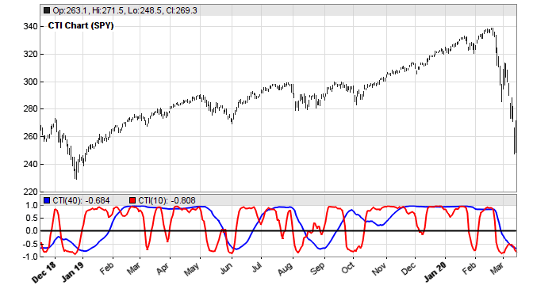
**FIGURE 8: **

We can see that the lines reproduce well the short-term and long-term trend. But does the indicator have predictive power? To help find out, we can look at a price difference profile of its zero crossings. A price difference profile displays the average price movement and its standard deviation after a given event or condition. It is used for testing the quality of trade signals. Here is the code and the resulting profile (Figure 9):

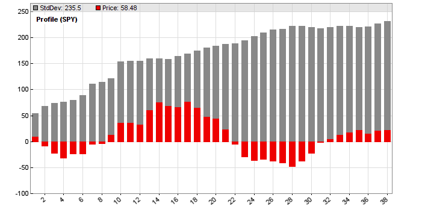
**FIGURE 9: **

The red bars are the average differences in cents to the price at the zero crossings. The x-axis shows the days after the crossing. We can see that the average difference tends to drop to a negative minimum immediately after a crossing, thus indicating a short-term mean-reversion effect. Then the difference rises to a trend maximum after about 15 days. The effect is trend neutral by including negative differences at reverse crossings. But we see that the standard deviation of the price difference—the gray bars, here reduced by a factor of 4 for better scaling—is ten times higher than the price difference extremes. So a somewhat predictive power of the CTI(SPY,20) exists, but is too weak to be directly exploited in a SPY trade system.

The script for the CTI indicator can be downloaded from https://financial-hacker.com/scripts2020.zip . The Zorro platform can be downloaded from https://zorro-project.com/download.php .

—Petra Volkova The Zorro Project by oP group GmbH www.zorro-project.com

BACK TO LIST

```c
var CTI (vars Data, int Length)
{
  int count;
  var Sx = 0, Sy = 0, Sxx = 0, Sxy = 0, Syy = 0;
  for(count = 0; count < Length; count++) {
    var X = Data[count];
    var Y = -count;
    Sx = Sx + X;
    Sy = Sy + Y;
    Sxx = Sxx + X*X;
    Sxy = Sxy + X*Y;
    Syy = Syy + Y*Y;
  }
  if(Length*Sxx - Sx*Sx > 0 && Length*Syy - Sy*Sy > 0)
     return (Length*Sxy - Sx*Sy) / sqrt((Length*Sxx - Sx*Sx)*(Length*Syy - Sy*Sy));
   else return 0;
}
```

```c
void run() 
{
   BarPeriod = 1440;
   LookBack = 40;
   StartDate = 2010;
   assetAdd("SPY","STOOQ:SPY.US"); // load SPY history from Stooq
   asset("SPY");

   vars Prices = series(priceClose());
   vars Signals = series(CTI(Prices,20));
   if(crossOver(Signals,0))
      plotPriceProfile(40,0); // plot positive price difference
   else if(crossUnder(Signals,0))
      plotPriceProfile(40,2); // plot negative price difference
}
```

---

## MICROSOFT EXCEL: MAY 2020

In his article in this issue, author John Ehlers explores the concept of correlation as a trend indicator.

Figure 10 is a consolidation of the three correlation chart periods examined in Ehlers’ article. The clutter controls will allow the user to examine them individually or in combination, as I have them here. The correlation lookback bar counts can be adjusted in the user controls area.

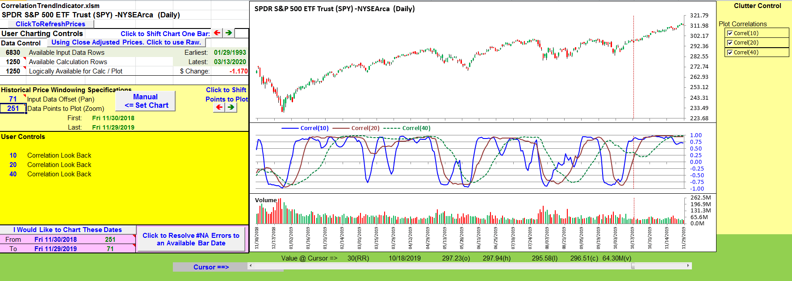
**FIGURE 10: **

As I write this, the anticipation of COVID-19 has begun to disrupt local and global economies and markets. Figures 11 and 12 use the correlation indicator to examine a couple of popular symbols under the influence of COVID-19.

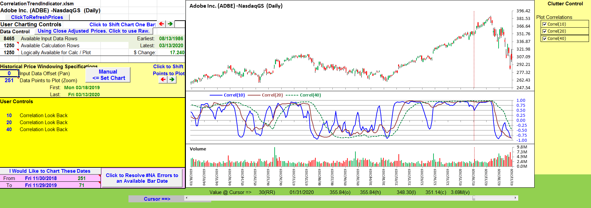
**FIGURE 11: **

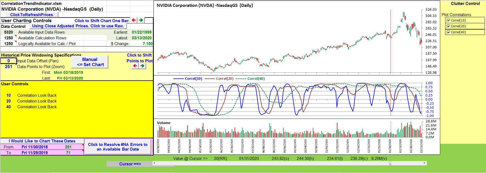
**FIGURE 12: **

The spreadsheet file for this Traders’ Tip can be downloaded here . To successfully download it, follow these steps:

Note regarding an intermittent data issue: While developing and testing this spreadsheet, I encountered several zero value bars in the downloaded data for more than one symbol.

Zero price and volume values do not play well with indicator calculations. They can also exaggerate the amount of white space under the candles on the price chart.

On closer inspection of these bars, I found that the dates on the problem bars corresponded to holidays when the markets are closed. When I looked at the Yahoo historical data web page I found the same discrepancies. Sometimes, on refreshing the web page, these “holiday” bars would disappear—and then come back on yet another refresh of the web page. I encountered similar “on again, off again” behavior for the downloads.

So beginning with this month’s Traders’ Tip contribution, I have incorporated perpetual calendar logic to detect and eliminate bars with both zero values and US markets closed dates.

Zero value bars can be legit for thinly traded (penny, perhaps?) symbols, but are very unusual for Big Board–listed symbols.

—Ron McAllister Excel and VBA programmer rpmac_xltt@sprynet.com

BACK TO LIST

Spreadsheet: [code/CorrelationTrendIndicator.xlsm](code/CorrelationTrendIndicator.xlsm)

---

## eSIGNAL: MAY 2020

For this month’s Traders’ Tip, we’ve provided the CorrelationTrendIndicator.efs study based on the article by John F. Ehlers, “Correlation As A Trend Indicator.” The indicator helps to identify the onset of a trend or to detect the failure of a trend.

The studies contain formula parameters which may be configured through the Edit Chart window (right-click on the chart and select “Edit Chart”). A sample chart is shown in Figure 13.

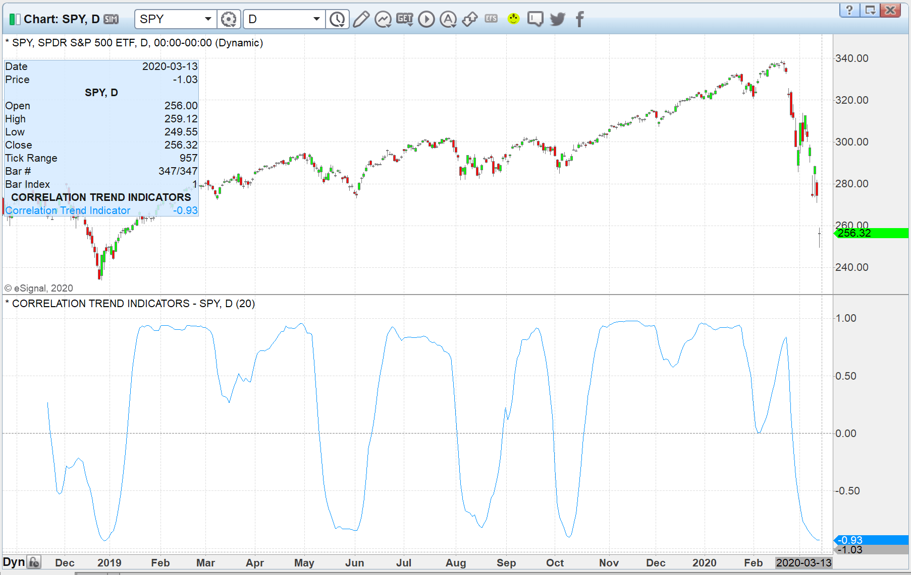
**FIGURE 13: **

To discuss this study or download a complete copy of the formula code, please visit the EFS Library Discussion Board forum under the forums link from the support menu at www.esignal.com or visit our EFS KnowledgeBase at https://www.esignal.com/support/kb/efs/ . The eSignal formula script (EFS) is also available for copying & pasting below.

—Eric Lippert, eSignal, an Interactive Data company 800 779-6555, www.eSignal.com

BACK TO LIST

Originally published in the May 2020 issue of Technical Analysis of STOCKS & COMMODITIES magazine. All rights reserved. © Copyright 2020, Technical Analysis, Inc.

```javascript
/**********************************
Provided By:  
Copyright 2019 Intercontinental Exchange, Inc. All Rights Reserved. 
eSignal is a service mark and/or a registered service mark of Intercontinental Exchange, Inc. 
in the United States and/or other countries. This sample eSignal Formula Script (EFS) 
is for educational purposes only. 
Intercontinental Exchange, Inc. reserves the right to modify and overwrite this EFS file with each new release. 

Description:        
   Correlation As A
    Trend Indicator
   by John F. Ehlers
    

Version:            1.00  11/03/2019

Formula Parameters:                     Default:
Length                                  20

Notes:
The related article is copyrighted material. If you are not a subscriber
of Stocks & Commodities, please visit www.traders.com.

**********************************/
var fpArray = new Array();
var bInit = false;

function preMain() {
    setStudyTitle("CORRELATION TREND INDICATORS");
    setCursorLabelName("Correlation Trend Indicator", 0);
    setPriceStudy(false);
    setDefaultBarFgColor(Color.RGB(0x00,0x94,0xFF), 0);
    setPlotType( PLOTTYPE_LINE , 0 );
    addBand(0, PS_DASH, 1, Color.grey);
    
    var x=0;
    fpArray[x] = new FunctionParameter("Length", FunctionParameter.NUMBER);
	with(fpArray[x++]){
        setLowerLimit(1);		
        setDefault(20);
    }
}

var bVersion = null;
var xClose = null;
var Sx = null; 
var Sy = null;
var Sxx = null; 
var Sxy = null;
var Syy = null;
var count = [];
var X = null;
var Y = null;
var Corr = null;


function main(Length) {
    if (bVersion == null) bVersion = verify();
    if (bVersion == false) return; 
    
    if ( bInit == false ) { 
        xClose = close();
        Sx = 0
        Sy = 0
        Sxx = 0;
        Sxy = 0;
        Syy = 0;
                
        bInit = true; 
    }  

    if (getCurrentBarCount() < Length) return;

        Sx = 0
        Sy = 0
        Sxx = 0;
        Sxy = 0;
        Syy = 0;
        X = 0
        Y = 0

    for (var i = 0; i <= Length - 1; i++){
        X = xClose.getValue(-i)
        Y = -i
        Sx = Sx + X
        Sy = Sy + Y
        Sxx = Sxx + X*X
        Sxy = Sxy + X*Y
        Syy = Syy + Y*Y
    }

    if ((Length * Sxx - Sx*Sx > 0)&& (Length * Syy - Sy*Sy > 0)) {
        Corr = (Length * Sxy - Sx*Sy) / Math.sqrt((Length * Sxx - Sx*Sx)*(Length*Syy - Sy*Sy))
    }
    
    return [Corr]
}
 


function verify(){
    var b = false;
    if (getBuildNumber() < 779){
        
        drawTextAbsolute(5, 35, "This study requires version 10.6 or later.", 
            Color.white, Color.blue, Text.RELATIVETOBOTTOM|Text.RELATIVETOLEFT|Text.BOLD|Text.LEFT,
            null, 13, "error");
        drawTextAbsolute(5, 20, "Click HERE to upgrade.@URL=https://www.esignal.com/download/default.asp", 
            Color.white, Color.blue, Text.RELATIVETOBOTTOM|Text.RELATIVETOLEFT|Text.BOLD|Text.LEFT,
            null, 13, "upgrade");
        return b;
    } 
    else
        b = true;
    
    return b;
}
```

---

## BibTeX

```bibtex
@misc{traders_tips_2020_05,
  author = {{Technical Analysis of STOCKS \& COMMODITIES}},
  title = {Traders' Tips: Correlation As A Trend Indicator},
  year = {2020},
  month = may,
  howpublished = {online},
  url = {https://www.traders.com/Documentation/FEEDbk_docs/2020/05/TradersTips.html}
}
```
