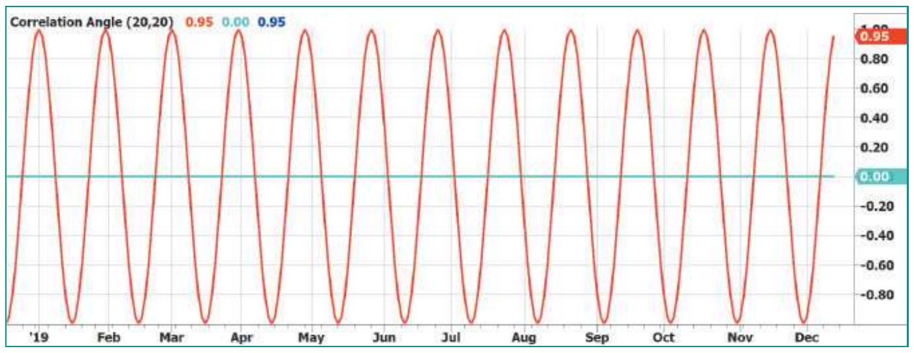
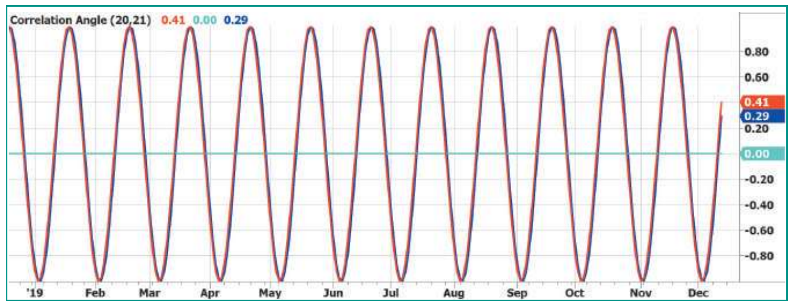
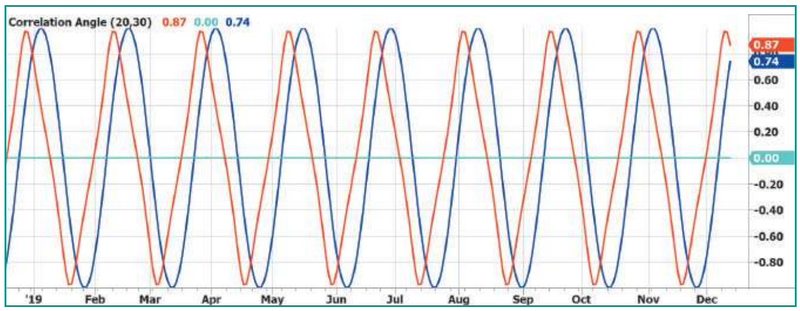
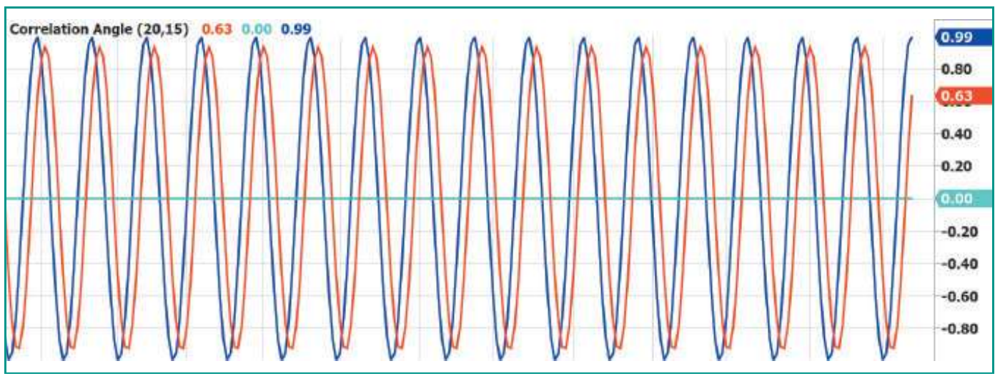
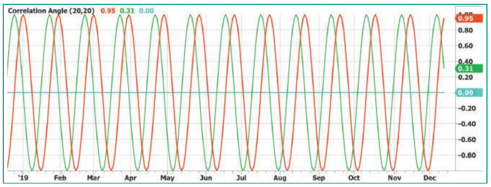
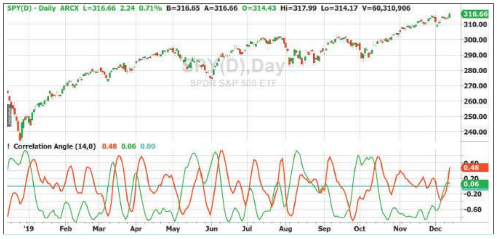
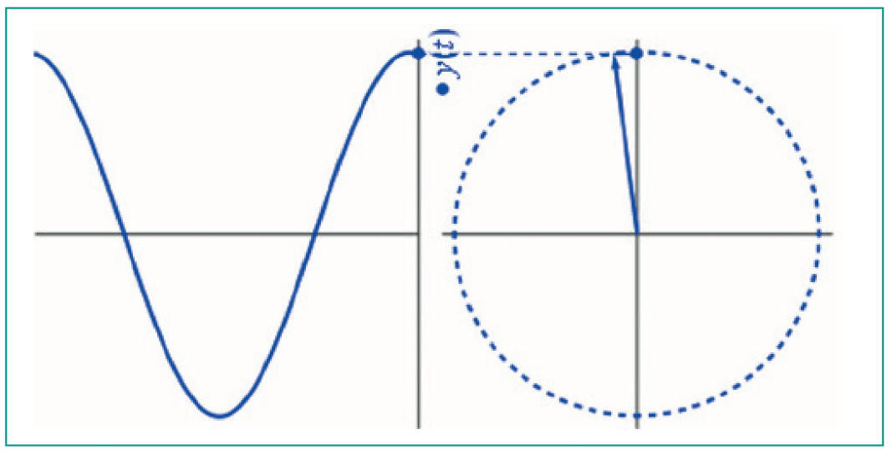
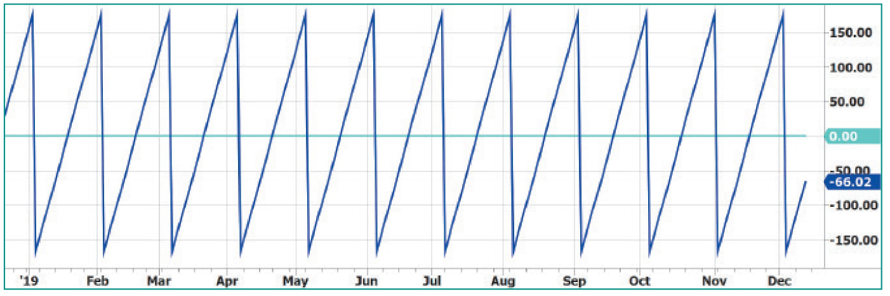
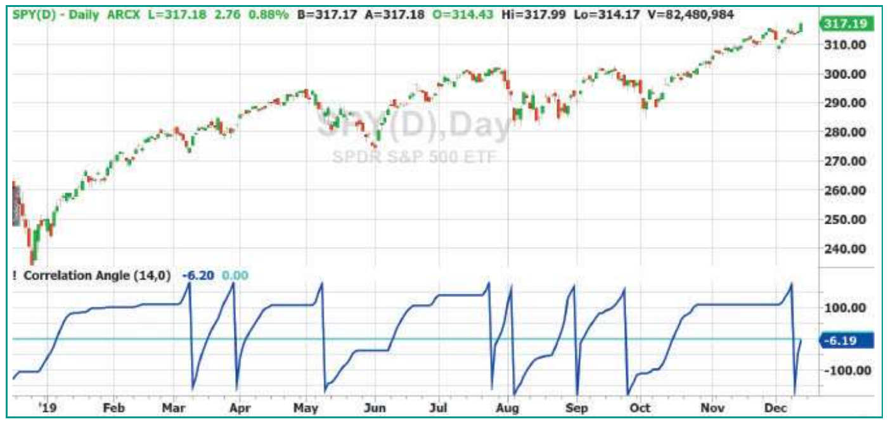
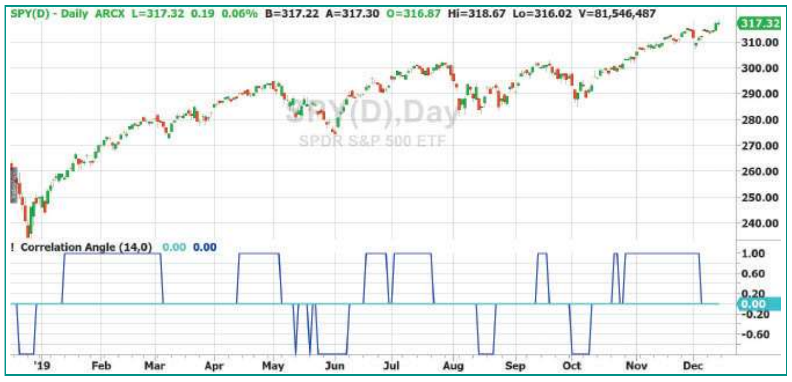

# Correlation As A Cycle Indicator

**John F. Ehlers**
*Technical Analysis of STOCKS & COMMODITIES, Volume 38, June 2020, pp. 9–15*

- Article URL: <https://technical.traders.com/archive/article.asp?file=\V38\C06\066EHLE.pdf>
- Traders' Tips URL: <https://www.traders.com/Documentation/FEEDbk_docs/2020/06/TradersTips.html>

---

## Using Phase Angles For Trading Signals And Market Mode Identification

Cycle indicators can give very fast and timely signals. Here, I will present a new cycle indicator to help you get in early on trades, as well as a variable to help you base trade entries on prevailing market conditions.

In my article last month, "Correlation As A Trend Indicator," I described how a trend indicator can be developed by correlating prices with a straight line having a positive slope. The correlation trend indicator that I introduced can help to identify the onset of a trend, as well as help detect the failure of a trend.

To trade during a cyclic mode, traders may want to turn from a trend indicator to a cycle indicator as they consider applying countertrend or mean-reversion strategies.

## A Cycle Indicator

It turns out that a cycle indicator can be developed by correlating prices to a cosine wave over the full wavelength of the selected period.

I will describe the concept behind this correlation, why it's useful, and I'll also provide code to help you implement it.

## Testing The Concept

When designing indicators and strategies, it is my approach to first test them using deterministic waveforms, that is, a known model. After all, if an indicator doesn't work where you know the correct answer, then why would you expect it to work on a noisy waveform of real data?

Figure 1 shows the input waveform (that is, the shape and form of a signal) in blue as a 20-bar sinusoid. When correlated with a 20-bar cosine wave, the "indicator" output is shown in red. The indicator correlation is so good that its plot covers the plot of the input data. Yes, the input data is really there—you can see this by tuning the input data to a 21-bar sinusoid while keeping the cosine correlation function period at 20 bars, as I have done in Figure 2. The main point is that correlation of price to a cosine wave gives an indicator that is exactly in phase with the cycle component in the data. In this sense, there is no lag.



**FIGURE 1: IN PHASE—AND ALMOST NO LAG.** Correlating a data sinusoid with a cosine wave produces an indicator that is in phase with the data. In fact, the indicator correlation is so good that its plot covers the plot of the input data.



**FIGURE 2: YES, THERE REALLY ARE TWO PLOTS.** Detuning the input data shows it is really there. In Figure 1, you could barely see it because of the tight correlation.

Market data is neither purely cyclic, nor is it statistically stationary. Therefore, the assumption of a fixed-cycle period for the indicator is bound to be incorrect to some degree most of the time. Since we are using deterministic (known in advance) waveforms, we can perform a stress test on the indicator to see just how bad the results can be if the selected cycle period is in error.

Figure 3 shows the results if the data has a 50% longer period than the assumed cycle period. That is, the indicator cosine period is retained at 20 bars and the period of the input sinusoid is 30 bars. The result is that the indicator produces an error. When the length of the indicator is shorter than the period of the input waveform, the indicator produces an output earlier than is perfectly correct. The result is that the error for a static sinewave signal is in the form of a leading phase error. In this case, the error is less than 45 degrees. The practical ramification is that you will be getting in early on trades where the data cycle period is longer than the assumed cycle period.



**FIGURE 3: INDICATOR STRESS TEST 1.** A 50% shorter tuning error—to test if the actual data were to have a 50% longer period than the assumed cycle period—results in a phase lead less than 45 degrees.

Continuing the stress test, I set the input cycle period to be 25% shorter than the assumed period of the cosine. That is, the indicator cosine period is retained at 20 bars and the period of the input sinusoid is 15 bars. The results of this stress test are shown in Figure 4. In this case, the lagging phase error is less than 45 degrees also.



**FIGURE 4: INDICATOR STRESS TEST 2.** A 25% longer tuning error—that is, setting the input cycle period to be 25% shorter than the assumed period of the cosine—results in a phase lag less than 45 degrees. This shows that even when the assumed cycle period is wrong, the cycle correlation indicator does not fall apart.

The main point of the cycle tests is that they prove that the cycle correlation indicator does not fall apart even when the assumed cycle period is in error.

## Rate Of Change

When dealing with a cycle indicator, the best trade entry point for a long position is at the exact valley of the waveform. It is often difficult to locate the valley with precision. Mathematically, the valley of the waveform occurs when its rate of change is zero, going from negative to positive. The rate of change is analogous to taking the derivative in calculus, with the result that the rate of change waveform is much noisier than the original waveform. Since we are in the cycle domain, there is a better method to achieve the rate of change function.

Noting that the derivative of a cosine wave is a negative sine wave, we can create a de facto rate-of-change indicator by correlating the input data with a negative sine wave having the same period as with the original correlation. Figure 5 shows that this rate-of-change indicator (in green) has an exact 90-degree phase lead compared with the original indicator output. Leading by 90 degrees means that the green line crosses over zero when the original indicator (in red) is at a cycle valley, and it crosses under zero when the original indicator is at a cycle peak. Therefore, the zero crossings of the rate-of-change indicator provide precise timing for entries and exits of cyclic-based trades.



**FIGURE 5: THE RATE-OF-CHANGE INDICATOR.** Zero crossings of the rate-of-change indicator precisely identify cycle peaks and valleys. This is helpful since the best trade entry point for a long position is at the exact valley.

## Real-World Example

Performance of the cycle indicator and its rate of change are shown in Figure 6. The use of real input data is facilitated by setting the input period parameter of the indicator to zero. I used a 14-bar period for the cosine period because I prefer to have a leading phase error for the cycle components in the real-world data.

The picture is not nearly as idyllic as the theoretical examples. This is partially because I purposely did not cherry-pick a glowing example. However, even with this poor cycle example, the cyclic turning points can be correctly identified by lining up the peaks and valleys of the indicator (the red line) with the short-term peaks and valleys in the price.



**FIGURE 6: REAL-WORLD DATA.** The cycle indicator is applied to one year of SPY data. Even with a noisy market that is far from an idealized model, the cyclic turning points can be correctly identified by lining up the peaks and valleys of the indicator (red line) with the short-term peaks and valleys in the price.

Most noticeably, the rate-of-change indicator (in green) fails when the market goes into a trend. It is also worthy to note that the joint condition where the cycle indicator is at a peak and the rate-of-change indicator crosses under zero fails spectacularly at the beginning of the major trends.

Rather than discarding the indicator as a failure in the real world, a new and unique opportunity unfolds.

## Cycle Mode And Trend Mode

Trend indicators typically have substantial lag, so a trader does not get an indication of the trend until the trend is well established. The result of this lag is a loss of potential profit in following that trend. Cycle indicators react rapidly, but as we have seen, they fail when the market goes into a trend. If we construct an idealized model of the market such that it consists of only a trend mode and a cycle mode, then a trend mode can be rapidly identified as a failure of the cycle mode.

One definition of a cycle uses its rate change of phase. For example, a 20-bar cycle period has an 18-degree rate of change per sample so that it completes 360 degrees of phase rotation each cycle period. It is convenient to think of a cycle in terms of the phasor diagram shown in Figure 7. The phasor arrow is anchored at the origin and sweeps out a cycle over one full counterclockwise rotation, and the next cycle period starts with the next rotation.



**FIGURE 7: CYCLE PHASE.** A phasor describes cycle phase in terms of orthogonal components. The phasor arrow sweeps out a cycle over one full counterclockwise rotation, and the next cycle period starts with the next rotation.

The phasor can also be described in terms of its orthogonal components. The projection of the phasor rotating at a constant rate onto the horizontal, or real, axis is a cosine. The projection of the phasor onto the vertical, or imaginary, axis is a sine. It follows that if we have the correlation of the data to a cosine and also to a sine, we can compute the phase angle of the phasor. The phase angle is computed as the arctangent of the ratio of the real component to the imaginary component. Since the arctangent works only over a 180-degree span, the 360-degree picture of the phasor must be completed by resolving the ambiguity in two of the four quadrants.

The theoretical phase angle for a 20-bar sine wave is shown in Figure 8. The plot ranges from -180 degrees to +180 degrees, whereupon the phase wraparound is conducted and the next cycle is plotted.



**FIGURE 8: RATE CHANGE OF PHASE.** The phasor angle ranges from -180 to +180 degrees, whereupon the phase wraparound is conducted and the next cycle is plotted. In reality, the rate change of phase is continuous, but a continuous rate of change is difficult to plot.

When the phase angle is above zero, the theoretical sine wave is descending from the cycle peak to the cycle valley. At a phase angle of zero, the sine wave is at its maximum. When the phase angle is +180 degrees, the sine wave is at its minimum. Correspondingly, when the phase angle is below zero, the theoretical sine wave is ascending from the cycle valley to the cycle peak. The implication is that when the market is in a cycle mode, you want to be in a long position if the angle is less than zero, and you want to be in a short position if the angle is greater than zero.

Just as time cannot go backwards, the phase angle of the phasor cannot go backwards. Therefore, in my code, the computed phase angle is not allowed to regress. In this case, the phase angle is held at a constant value to indicate the cycle mode failure. So when the phase display "flatlines" (that is, the angle at the current data sample is the same as the angle at the previous data sample), the interpretation is that the cycle mode has failed and therefore the market is now in a trend mode. Further, since the indicator is dead wrong in the case of cycle mode failure, the correct position is to establish a short trend mode position when the phase angle flatlines below zero, and to establish a long trend mode position when the phase angle flatlines above zero. An early indication of the end of a trend is given when the phase angle ceases to flatline.



**FIGURE 9: REAL-WORLD DATA.** The phasor indicator is applied to the SPY. The phasor display provides an early indication of trend onset and trend termination.

## Market State Variable

The very definition of a trend mode and a cycle mode makes it simple to create a "state variable" that identifies the market state. If the state is zero, the market is in a cycle mode. If the state is +1, the market is in an uptrend. If the state is -1, the market is in a downtrend. The state variable for the angle presentation of Figure 9 is given in Figure 10.

A trend can also be declared if the measured cycle period is too long to be traded in the cycle mode. I have arbitrarily decided that cycles having a 40-bar period or longer should be treated as trends. A 40-bar cycle period has a phase rate of change of 9 degrees per bar, so phase rate changes less than this amount are classified as trends.



**FIGURE 10: MARKET CONDITIONS, OR THE STATE OF THE MARKET.** Is the market in a trend mode or a cycle mode? Shown here is the state variable for the SPY example in Figure 9. The state variable shows the occurrences of the cycle mode, uptrend mode, and downtrend mode.

## Code

In my mind, computer code describes the computational process far more precisely than English can, and I try to write code in a straightforward and easy-to-understand format. The code for all the indicators described in this article is given in the sidebar.

### EasyLanguage Code For The Correlation Angle Indicator And Market State Variable

```easylanguage
{
  Correlation Angle Indicator
  (C) 2013-2020 John F. Ehlers
}

Inputs:
  Period(20),
  InputPeriod(20); // Uses price data if InputPeriod is set to 0

Vars:
  Length(20), Price(0),
  Sx(0), Sy(0), Sxx(0), Sxy(0), Syy(0), count(0), X(0), Y(0),
  Real(0), Imag(0),
  Angle(0),
  State(0);

// Correlate over one full cycle period
Length = Period;

Price = Close;

// Creates a theoretical sinusoid having a period equal to the
// input period as the data input
If InputPeriod <> 0 Then Price = Sine(360 * CurrentBar / InputPeriod);

// Correlate price with cosine wave having a fixed period
Sx = 0;
Sy = 0;
Sxx = 0;
Sxy = 0;
Syy = 0;
For count = 1 to Length Begin
  X = Price[count - 1];
  Y = Cosine(360 * (count - 1) / Period);
  Sx = Sx + X;
  Sy = Sy + Y;
  Sxx = Sxx + X * X;
  Sxy = Sxy + X * Y;
  Syy = Syy + Y * Y;
End;
If (Length * Sxx - Sx * Sx > 0) and (Length * Syy - Sy * Sy > 0) Then
  Real = (Length * Sxy - Sx * Sy) / SquareRoot((Length * Sxx - Sx * Sx) * (Length * Syy - Sy * Sy));

// Correlate with a negative sine wave having a fixed period
Sx = 0;
Sy = 0;
Sxx = 0;
Sxy = 0;
Syy = 0;
For count = 1 to Length Begin
  X = Price[count - 1];
  Y = -Sine(360 * (count - 1) / Period);
  Sx = Sx + X;
  Sy = Sy + Y;
  Sxx = Sxx + X * X;
  Sxy = Sxy + X * Y;
  Syy = Syy + Y * Y;
End;
If (Length * Sxx - Sx * Sx > 0) and (Length * Syy - Sy * Sy > 0) Then
  Imag = (Length * Sxy - Sx * Sy) / SquareRoot((Length * Sxx - Sx * Sx) * (Length * Syy - Sy * Sy));

// Compute the angle as an arctangent function and resolve ambiguity
If Imag <> 0 Then Angle = 90 + Arctangent(Real / Imag);
If Imag > 0 Then Angle = Angle - 180;

// Do not allow the rate change of angle to go negative
If Angle[1] - Angle < 270 and Angle < Angle[1] Then Angle = Angle[1];

// Plot1(Real);
Plot4(0);
// Plot3(Imag);
Plot2(Angle);

// If InputPeriod <> 0 Then Plot6(Price);

// Compute and plot market state
State = 0;
If AbsValue(Angle - Angle[1]) < 9 and Angle < 0 Then State = -1;
If AbsValue(Angle - Angle[1]) < 9 and Angle >= 0 Then State = 1;
// Plot10(State);
```

## Conclusions

Correlation as a cycle indicator is robust, yielding only relatively small errors even if an incorrect judgment is made in assigning the dominant cycle to the indicator. Orthogonal component correlations can be made to enable precise identification of the correct trade entry and exit points. However, the cycle mode indicator fails when the market enters a trend mode. But that failure can be used to rapidly identify the current market mode. The phasor angle display indicates the correct trade position for either the cycle mode or the trend mode.

The phasor angle display is a departure from conventional indicators and requires traders to have situational awareness at the concept level. A further advantage of the phasor angle display is that two orthogonal (that is, independent) components are used in its construction. Since it has two independent signal inputs, the resulting indicator has a 6 dB signal-to-noise advantage over conventional squiggly-line indicators.

## About The Author

John Ehlers, a STOCKS & COMMODITIES Contributing Editor, is a pioneer in the use of cycles and DSP technical analysis. He is president of MESA Software and cofounder of StockSpotter.com and BeYourOwnHedgeFund.com, which provides portfolios based on his algorithmic strategies. He can be reached through his website at MESAsoftware.com.

## Further Reading

- Ehlers, John F. [2013]. *Cycle Analytics For Traders*, John Wiley & Sons.
- Ehlers, John F. [2020]. "Correlation As A Trend Indicator," *Technical Analysis of STOCKS & COMMODITIES*, Volume 38, May.

## References

```bibtex
@article{ehlers2020correlationcycle,
  author  = {Ehlers, John F.},
  title   = {Correlation As A Cycle Indicator},
  journal = {Technical Analysis of STOCKS \& COMMODITIES},
  volume  = {38},
  number  = {6},
  pages   = {9--15},
  year    = {2020},
  month   = jun,
  url     = {https://technical.traders.com/archive/article.asp?file=\V38\C06\066EHLE.pdf}
}

@misc{ehlers2020correlationcycle_tips,
  author  = {{Technical Analysis of STOCKS \& COMMODITIES}},
  title   = {Traders' Tips: Correlation As A Cycle Indicator},
  year    = {2020},
  month   = jun,
  url     = {https://www.traders.com/Documentation/FEEDbk_docs/2020/06/TradersTips.html}
}
```
