# Traders' Tips: Correlation As A Cycle Indicator — June 2020

- Source URL: <https://www.traders.com/Documentation/FEEDbk_docs/2020/06/TradersTips.html>
- Related Article: "Correlation As A Cycle Indicator" by John F. Ehlers, TASC Volume 38, June 2020

---

TRADERS’ TIPS - JUNE 2020


TRADERS’ TIPS

# June 2020

For this month’s Traders’ Tips, the focus is John Ehlers’ article in this issue, “Correlation As A Cycle Indicator.” Here, we present the June 2020 Traders’ Tips code with possible implementations in various software.

**You can right-click on any chart to open it in a new tab or window and view it at it’s originally supplied size, often much larger than the version printed in the magazine.**

The Traders’ Tips section is provided to help the reader implement a selected technique from an article in this issue or another recent issue. The entries here are contributed by software developers or programmers for software that is capable of customization.

* [TRADESTATION: JUNE 2020](https://www.traders.com/Documentation/FEEDbk_docs/2020/06/TradersTips.html#item1)
* [THINKORSWIM: JUNE 2020](https://www.traders.com/Documentation/FEEDbk_docs/2020/06/TradersTips.html#item2)
* [WEALTH-LAB: JUNE 2020](https://www.traders.com/Documentation/FEEDbk_docs/2020/06/TradersTips.html#item3)
* [NINJATRADER: JUNE 2020](https://www.traders.com/Documentation/FEEDbk_docs/2020/06/TradersTips.html#item4)
* [eSIGNAL: JUNE 2020](https://www.traders.com/Documentation/FEEDbk_docs/2020/06/TradersTips.html#item5)
* [NEUROSHELL TRADER: JUNE 2020](https://www.traders.com/Documentation/FEEDbk_docs/2020/06/TradersTips.html#item6)
* [QUANTACULA STUDIO: JUNE 2020](https://www.traders.com/Documentation/FEEDbk_docs/2020/06/TradersTips.html#item7)
* [THE ZORRO PROJECT: JUNE 2020](https://www.traders.com/Documentation/FEEDbk_docs/2020/06/TradersTips.html#item8)
* [MICROSOFT EXCEL: JUNE 2020](https://www.traders.com/Documentation/FEEDbk_docs/2020/06/TradersTips.html#item9)

### TRADESTATION: JUNE 2020

In his article “Correlation As A Cycle Indicator” in this issue, author John Ehlers introduces a companion to the trend indicator he presented in his article last month. This new indicator is designed to help traders navigate cycling markets.

The new cycle indicator can help the trader get into trades earlier and have better insight into prevailing market conditions. Here, we are providing TradeStation EasyLanguage code for an indicator based on the author’s work.

```
Indicator: Correlation Cycle
// Correlation Angle Indicator     
// (C) 2013-2020   John F. Ehlers 
// TASC Jun 2020                  

inputs: Period( 14 ), 
	InputPeriod( 0 ) ;  //Uses price data if 0
variables: Length( 20 ), Price( 0 ), 
	Sx( 0 ), Sy( 0 ), Sxx( 0 ), Sxy( 0 ), 
	Syy( 0 ), Count( 0 ), X( 0 ), Y( 0 ), 
	Real( 0 ), Imag( 0 ), Angle( 0 ), State( 0 ) ; 

//Correlate over one full cycle period 
Length = Period ; 
Price = Close ; 

//Creates a theoretical sinusoid 
//having an period equal to the 
//input period as the data input 
if InputPeriod <> 0 then 
	Price = Sine( 360 * CurrentBar / InputPeriod) ; 

//Correlate price with 
//cosine wave having a fixed period 
Sx = 0 ; 
Sy = 0 ; 
Sxx = 0 ; 
Sxy = 0 ; 
Syy = 0 ; 
for Count = 1 to Length 
begin   
	X = Price[count - 1] ; 
	Y = Cosine( 360 * ( Count - 1 ) / Period ) ; 
	Sx = Sx + X ; 
	Sy = Sy + Y ; 
	Sxx = Sxx + X * X ; 
	Sxy = Sxy + X * Y ; 
	Syy = Syy + Y*Y ; 
end ; 

if ( Length * Sxx - Sx * Sx > 0 ) 
	and ( Length * Syy - Sy * Sy > 0 ) then 
	Real = ( Length * Sxy - Sx * Sy ) / 
	SquareRoot( ( Length * Sxx - Sx * Sx ) * 
	( Length * Syy - Sy * Sy ) ) ; 

//Correlate with a negative 
//sine wave having a fixed period 
Sx = 0 ; 
Sy = 0 ; 
Sxx = 0 ; 
Sxy = 0 ; 
Syy = 0 ; 
for Count = 1 to Length 
begin   
	X = Price[count - 1]; 
	Y = -Sine( 360 * ( count - 1 ) / Period ) ; 
	Sx = Sx + X ; 
	Sy = Sy + Y ; 
	Sxx = Sxx + X * X ; 
	Sxy = Sxy + X * Y ; 
	Syy = Syy + Y * Y ; 
end ; 

if ( Length * Sxx - Sx * Sx > 0 ) 
	and ( Length * Syy - Sy * Sy > 0 ) then 
	Imag = ( Length * Sxy - Sx * Sy ) / 
	SquareRoot( ( Length * Sxx - Sx * Sx ) * 
	( Length * Syy - Sy * Sy ) ) ; 

//Compute the angle as an arctangent 
//function and resolve ambiguity 
if Imag <> 0 then 
	Angle = 90 + Arctangent( Real / Imag ) ; 

if Imag > 0 then 
Angle = Angle - 180 ; 
//Do not allow the rate change of angle to go negative 
if Angle[1] - Angle < 270 and Angle < Angle[1] then 
	Angle = Angle[1] ; 

//Plot1(Real); 
//Plot2(Imag); 
//Plot3(Angle, "Phasor" ); 

if InputPeriod <> 0 then 
	Plot6(Price, "Price"); 

//Compute and plot market state 
State = 0; 
if AbsValue( Angle - Angle[1] ) < 9 and Angle < 0 then 
	State = -1	; 
if AbsValue( Angle - Angle[1] ) < 9 and Angle >= 0 then 
	State = 1; 
Plot4( State, "Correlation Cycle" ) ;
Plot5( 0, "ZL" ) ;
```

To download the EasyLanguage code, please visit our TradeStation and EasyLanguage support forum. The files for this article can be found here: <https://community.tradestation.com/Discussions/Topic.aspx?Topic_ID=168100>. The filename is “TASC\_JUN2020.ZIP.” For more information about EasyLanguage in general, please see <https://www.tradestation.com/EL-FAQ>.

A sample chart is shown in Figure 1.

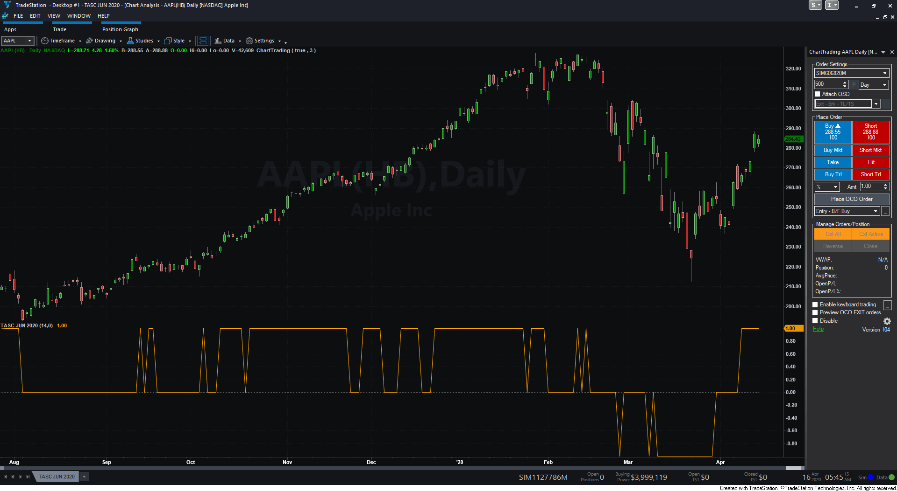

FIGURE 1: TRADESTATION. The correlation cycle indicator and strategy are applied to a daily chart of Apple Inc. (AAPL).

*This article is for informational purposes. No type of trading or investment recommendation, advice, or strategy is being made, given, or in any manner provided by TradeStation Securities or its affiliates.*

—Doug McCrary  
TradeStation Securities, Inc.  
[www.TradeStation.com](https://www.tradestation.com/)

### THINKORSWIM: JUNE 2020

We have put together a study based on the article in this issue by John Ehlers, titled “Correlation As A Cycle Indicator.”

We built the study referenced by using our proprietary scripting language, thinkscript. To ease the loading process, simply click on <https://tos.mx/bne3CO6> or enter it into *Setup → Open shared item* from within thinkorswim, then choose *view thinkScript study* and name it “CorrelationCycleIndicator.”

The chart in Figure 2 shows this study on a one-year daily chart of SPY. See John Ehlers’ article in this issue on how to interpret this study.

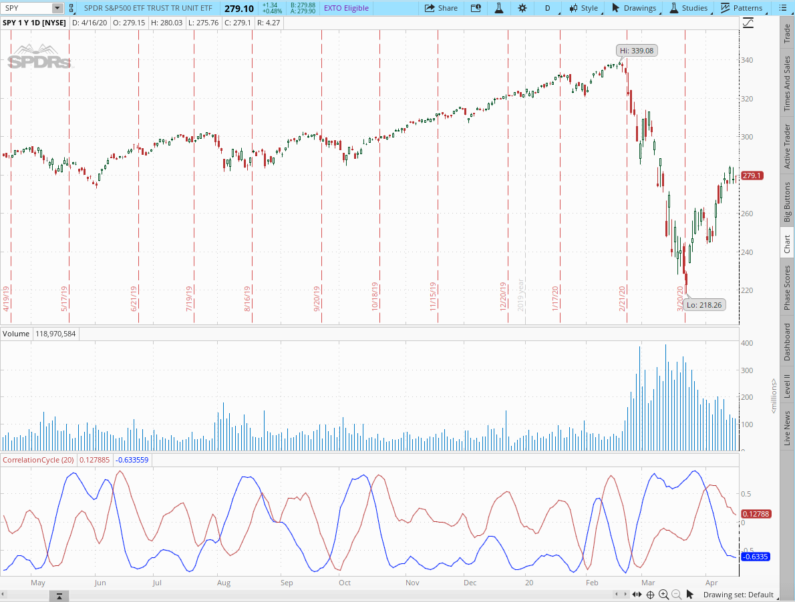

FIGURE 2: THINKORSWIM. This sample daily chart shows the CorrelationCycleIndicator study on the SPY.

—thinkorswim  
A division of TD Ameritrade, Inc.  
[www.thinkorswim.com](https://www.thinkorswim.com/)

### WEALTH-LAB: JUNE 2020

In his article in this issue, “Correlation As A Cycle Indicator,” author John Ehlers follows up his article last month with a new mode-switching indicator, named the CorrelationAngle.

To illustrate the application of the indicator, you will find below a sample trading system that changes approach depending on the phase angle.

We define an uptrend when the CorrelationAngle’s state “flatlines” at 1 for 2 bars (or -1 for a downtrend). The logic is simple: An uptrend switches the system into trend-following mode, with entries and exits made via channel breakout. If permitted, short trades are done in the same manner in a downtrend—yet with a shorter lookback period for the channel. An absence of trend directs the system to take cyclic trades: buying small dips and selling at the high of the channel.

Here are the rules for the system:

1. **Buy** at stop next day when price breaks through the highest price of 20 days and there’s an uptrend detected
2. **Short** at stop next day when price breaks below the lowest price of 10 days and there’s a downtrend detected (if short trades are allowed)
3. **Buy** at limit next day at 5% below today’s low if there’s neither an uptrend nor downtrend (buy dips)
4. **Exit** at a -10% stop-loss
5. **Exit long** next day when a downtrend kicks in
6. **Exit long** at stop next day at the lowest price of 10 days
7. **Cover** at stop next day at the highest price of 10 days.

See Figure 3 for an example Wealth-Lab chart displaying the CorrelationAngle indicator on AAPL.

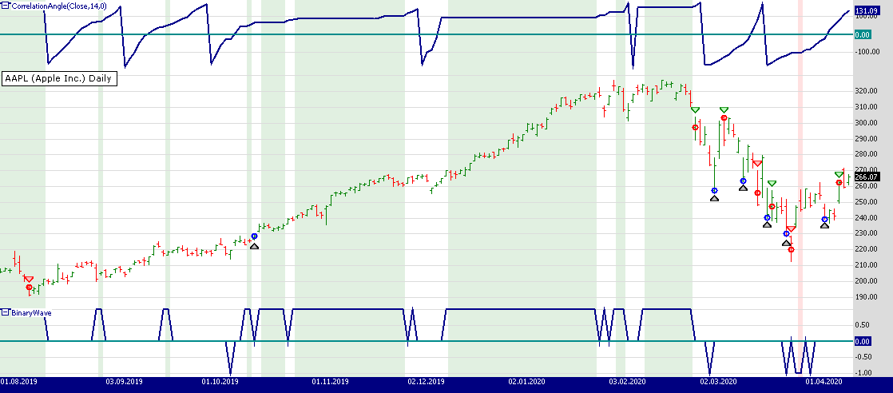

FIGURE 3: WEALTH-LAB. Here, the trading system switches gears when Apple’s stock experiences a smooth uptrend followed by a rapid decline. The Correlation Angle indicator is plotted on the upper pane of the chart. The “market state” is plotted as a “binary wave” on the lower pane of the chart.

To execute the included trading system, Wealth-Lab users need to install (or update) the latest version of the TASCIndicators library from the Extensions section of our website if they haven’t already done so, and restart Wealth-Lab. Then either copy/paste the included strategy’s C# code or simply let Wealth-Lab do the job. From the *open strategy* dialog, click *download* to get this strategy as well as many others contributed by the Wealth-Lab community.

```
Wealth-Lab strategy code (C#):
using System;
using System.Collections.Generic;
using System.Text;
using System.Drawing;
using WealthLab;
using WealthLab.Indicators;
using TASCIndicators;

namespace WealthLab.Strategies
{
	public class TASC2020_06 : WealthScript
	{
		private StrategyParameter paramShort;
		private StrategyParameter paramStop;

		public TASC2020_06()
		{
			paramShort = CreateParameter("Short enabled", 0, 0, 1, 1);
			paramStop = CreateParameter("S/L %", 10, 5, 30, 5);
		}

		protected override void Execute()
		{
			var ca = CorrelationAngle.Series(Close, 14, 0);
			var State = new DataSeries(Close, "BinaryWave");
			bool shortTrades = paramShort.ValueInt == 1;
			var stopLoss = paramStop.Value;

			for(int bar = GetTradingLoopStartBar( 20 ); bar < Bars.Count; bar++)
			{
				bool upTrend = false, downTrend = false;
				/* Compute and plot market state */
				if (bar > 0)
				{
					if (Math.Abs(ca[bar] - ca[bar - 1]) < 9 && ca[bar] < 0)
						State[bar] = -1;
					if (Math.Abs(ca[bar] - ca[bar - 1]) < 9 && ca[bar] >= 0)
						State[bar] = 1;

					upTrend = State[bar] == 1 && State[bar-1] == 1;
					downTrend = State[bar] == -1 && State[bar-1] == -1;
				}

				if(upTrend)
					SetBackgroundColor(bar, Color.FromArgb(30, Color.Green));
				if (downTrend)
					SetBackgroundColor(bar, Color.FromArgb(30, Color.Red));
				
				if (IsLastPositionActive)
				{
					Position p = LastPosition;
					
					if (!ExitAtStop(bar + 1, p, p.RiskStopLevel, 
						string.Format("SL {0}%", stopLoss)))
					{	
						if (p.PositionType == PositionType.Long)
						{
							switch (p.EntrySignal)
							{
								case "Breakout":
									if (downTrend)
										SellAtMarket(bar + 1, p, "Trend change");
								else
									SellAtStop(bar + 1, p, Lowest.Series(Low, 20)[bar]); 
								break;
								case "Dip buy": 
									SellAtLimit(bar + 1, p, Highest.Series(High, 5)[bar]); break;
								default: break;
							}
						}
						else
						{
							CoverAtStop(bar + 1, p, Highest.Series(High, 10)[bar]);
						}
					}
				}
				else
				{
					if (bar > 0)
					{
						RiskStopLevel = Close[bar] * (1 - (stopLoss / 100d));
						if (upTrend) {
							BuyAtStop(bar + 1, Highest.Series(High, 20)[bar], "Breakout");
						}
						else
						if (downTrend && shortTrades) {
							ShortAtStop(bar + 1, Lowest.Series(Low, 10)[bar], "Breakdown");
						}
						else {
							BuyAtLimit(bar + 1, Low[bar] * 0.95, "Dip buy");
						}
					}
				}
			}
			
			ChartPane paneCA = CreatePane( 30,true,true);
			ChartPane paneBW = CreatePane( 30,false,true);
			PlotSeries( paneCA,ca,Color.DarkBlue,LineStyle.Solid,2);
			PlotSeries( paneBW,State,Color.DarkBlue,LineStyle.Solid,2);
			DrawHorzLine( paneCA,0,Color.DarkCyan,LineStyle.Solid,2);
			DrawHorzLine( paneBW,0,Color.DarkCyan,LineStyle.Solid,2);
			HideVolume();
		}
	}
}
```

—Gene (Eugene) Geren, Wealth-Lab team  
MS123, LLC  
[www.wealth-lab.com](https://www.wealth-lab.com/)

### NINJATRADER: JUNE 2020

The correlation angle, phasor, and market state variable indicators, as described in John Ehlers’ article in this issue, “Correlation As A Cycle Indicator,” are available for download at the following links for NinjaTrader 8 and NinjaTrader 7:

* **NinjaTrader 8:** [www.ninjatrader.com/SC/June2020SCNT8.zip](https://www.ninjatrader.com/SC/June2020SCNT8.zip)
* **NinjaTrader 7:** [www.ninjatrader.com/SC/June2020SCNT7.zip](https://www.ninjatrader.com/SC/June2020SCNT7.zip)

Once the file is downloaded, you can import the indicator into NinjaTader 8 from within the Control Center by selecting Tools → Import → NinjaScript Add-On and then selecting the downloaded file for NinjaTrader 8. To import in NinjaTrader 7, from within the Control Center window, select the menu File → Utilities → Import NinjaScript and select the downloaded file.

You can review the indicator’s source code in NinjaTrader 8 by selecting the menu New → NinjaScript Editor → Indicators from within the Control Center window and selecting the CorrelationAngle, Phasor, and MarketStateVariable files. You can review the indicator’s source code in NinjaTrader 7 by selecting the menu Tools → Edit NinjaScript → Indicator from within the Control Center window and selecting the CorrelationAngle, Phasor, and MarketStateVariable files.

A sample chart displaying the indicators is shown in Figure 4.

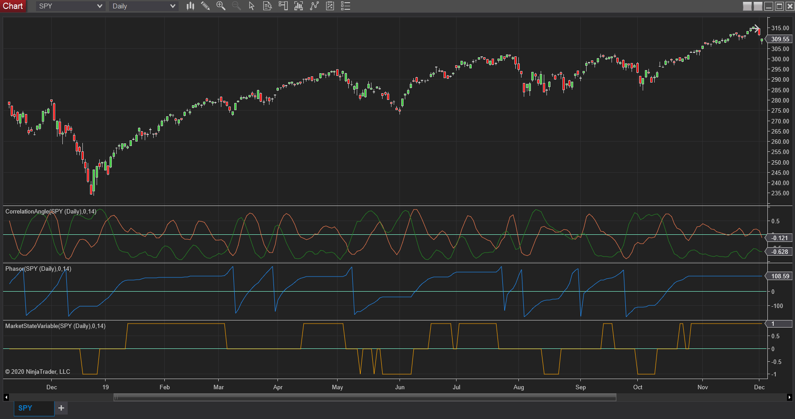

FIGURE 4: NINJATRADER. The correlation angle, phasor, and market state variable indicators are displayed on a daily SPY chart from January 2019 to December 2019.

—Chris Lauber  
NinjaTrader, LLC  
[www.ninjatrader.com](https://www.ninjatrader.com/)

### eSIGNAL: JUNE 2020

For this month’s Traders’ Tip, we’ve provided the study “[Correlation Angle Indicator.efs](https://www.traders.com/Documentation/FEEDbk_docs/2020/06/images/code/Correlation%20Angle%20Indicator.efs)” based on the article in this issue by John Ehlers, “Correlation As A Cycle Indicator.”

The studies contain formula parameters that may be configured through the *edit chart* window (right-click on the chart and select “edit chart”). A sample chart is shown in Figure 5.

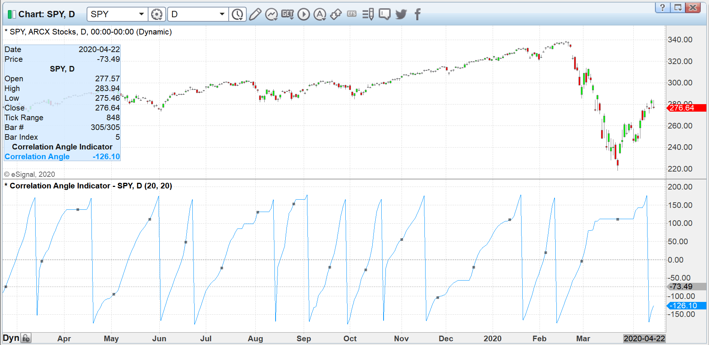

FIGURE 5: eSIGNAL. Here is an example of the studies plotted on a daily chart of the SPY.

To discuss this study or download a complete copy of the formula code, please visit the EFS Library Discussion Board forum under the *forums* link from the support menu at www.esignal.com or visit our EFS KnowledgeBase at www.esignal.com/support/kb/efs/.

The eSignal formula script (EFS) is also available for copying & pasting [here](https://www.traders.com/Documentation/FEEDbk_docs/2020/06/images/code/Correlation%20Angle%20Indicator.efs).

```
/**********************************
Provided By:  
Copyright 2019 Intercontinental Exchange, Inc. All Rights Reserved. 
eSignal is a service mark and/or a registered service mark of Intercontinental Exchange, Inc. 
in the United States and/or other countries. This sample eSignal Formula Script (EFS) 
is for educational purposes only. 
Intercontinental Exchange, Inc. reserves the right to modify and overwrite this EFS file with each new release. 

Description:        
   Correlation As A Cycle Indicator
   by John F. Ehlers
    

Version:            1.00  04/13/2020

Formula Parameters:                     Default:
Period                                  20
InputPeriod                             20

Notes:
The related article is copyrighted material. If you are not a subscriber
of Stocks & Commodities, please visit www.traders.com.

**********************************/
var fpArray = new Array();
var bInit = false;

function preMain() {
    setStudyTitle("Correlation Angle Indicator");
    setCursorLabelName("Correlation Angle", 0);
    setPriceStudy(false);
    setDefaultBarFgColor(Color.RGB(0x00,0x94,0xFF), 0);
    setPlotType( PLOTTYPE_LINE , 0 );
    addBand( 0, PLOTTYPE_DOT, 1, Color.grey); 
    
    
    var x=0;
    fpArray[x] = new FunctionParameter("Period", FunctionParameter.NUMBER);
	with(fpArray[x++]){
        setLowerLimit(0);		
        setDefault(20);
    }
    fpArray[x] = new FunctionParameter("InputPeriod", FunctionParameter.NUMBER);
	with(fpArray[x++]){
        setLowerLimit(0);		
        setDefault(20);
    }
        
}

var bVersion = null;
var Length = null; 
var xClose = null;
var Sx = null; 
var Sy = null; 
var Sxx = null; 
var Syy = null; 
var Sxy = null; 
var X = null; 
var Y = null; 
var Real = null; 
var Imag = null; 
var Angle = null; 
var Angle_1 = null;
var State = null; 
var xPrice = null;

function main(Period,InputPeriod) {
    if (bVersion == null) bVersion = verify();
    if (bVersion == false) return; 
    
    if ( bInit == false ) { 
        Length = Period;
        xClose = close();
        xPrice = xClose
        if (InputPeriod != 0) xPrice = efsInternal("Calc_Price", xClose, InputPeriod)
        Angle_1 = 0;
        Angle = 0;
        
        bInit = true; 
    }      
    if (getBarState() == BARSTATE_NEWBAR) {
        Angle_1 = Angle;
        Angle = 0;
    }

    //Correlate price with cosine wave having a fixed period
    Sx = 0; 
    Sy = 0; 
    Sxx = 0; 
    Syy = 0; 
    Sxy = 0; 
    for (var i = 1; i <= Length; i++){
        X = xPrice.getValue(-i+1);
        Y = Math.cos(2 * Math.PI * (i-1) / Period);
        Sx = Sx + X;
        Sy = Sy + Y;
        Sxx = Sxx + X*X;
        Sxy = Sxy + X*Y;
        Syy = Syy + Y*Y;
    }

    if ((Length * Sxx - Sx*Sx > 0) && (Length*Syy - Sy*Sy >0)) {
        Real = (Length*Sxy - Sx*Sy)/ Math.sqrt((Length*Sxx - Sx*Sx) * (Length*Syy - Sy*Sy))
    }

    //Correlate with a negative sine wave having a fixed period
    Sx = 0; 
    Sy = 0; 
    Sxx = 0; 
    Syy = 0; 
    Sxy = 0; 
    for (var i = 1; i <= Length; i++){
        X = xPrice.getValue(-i+1);
        Y = - Math.sin(2 * Math.PI * (i-1) / Period);
        Sx = Sx + X;
        Sy = Sy + Y;
        Sxx = Sxx + X*X;
        Sxy = Sxy + X*Y;
        Syy = Syy + Y*Y;
    }

    if ((Length * Sxx - Sx*Sx > 0) && (Length*Syy - Sy*Sy >0)) {
        Imag = (Length*Sxy - Sx*Sy)/ Math.sqrt((Length*Sxx - Sx*Sx) * (Length*Syy - Sy*Sy))
    }
    //Compute the angle as an arctangent function and resolve
    //ambiguity
    if (Imag != 0) Angle = Math.PI/2 + Math.atan(Real / Imag);
    if (Imag > 0) Angle = Angle - Math.PI;
    
    //Do not allow the rate change of angle to go negative
    if ((Angle_1 - Angle < 270 * Math.PI / 180) && (Angle < Angle_1 )) Angle = Angle_1;
    
    return [Angle * 180 / Math.PI]
}
var ret = 0;
function Calc_Price(xClose, InputPeriod) {
    ret = Math.sin(2 * Math.PI * xClose.getValue(0) / InputPeriod)
    return ret;
}


function verify(){
    var b = false;
    if (getBuildNumber() < 779){
        
        drawTextAbsolute(5, 35, "This study requires version 10.6 or later.", 
            Color.white, Color.blue, Text.RELATIVETOBOTTOM|Text.RELATIVETOLEFT|Text.BOLD|Text.LEFT,
            null, 13, "error");
        drawTextAbsolute(5, 20, "Click HERE to upgrade.@URL=https://www.esignal.com/download/default.asp", 
            Color.white, Color.blue, Text.RELATIVETOBOTTOM|Text.RELATIVETOLEFT|Text.BOLD|Text.LEFT,
            null, 13, "upgrade");
        return b;
    } 
    else
        b = true;
    
    return b;
}
```

—Eric Lippert  
eSignal, an Interactive Data company  
800 779-6555, [www.eSignal.com](https://www.esignal.com/)

### NEUROSHELL TRADER: JUNE 2020

The *correlation angle indicator* presented by John Ehlers in his article in this issue, “Correlation As A Cycle Indicator,” can be easily implemented in NeuroShell Trader using NeuroShell Trader’s ability to call external dynamic linked libraries. Dynamic linked libraries can be written in C, C++, and Power Basic.

After moving the code provided in Ehlers’ article to your preferred compiler and creating a DLL, you can insert the resulting indicator as follows:

1. Select *new indicator* from the **Insert** menu.
2. Choose the **External Program & Library Calls** category.
3. Select the appropriate **External DLL Call** indicator.
4. Set up the parameters to match your DLL.
5. Select the *finished* button.

Users of NeuroShell Trader can go to the Stocks & Commodities section of the NeuroShell Trader free technical support website to download a copy of this or any previous Traders’ Tips.

A sample chart is shown in Figure 6.

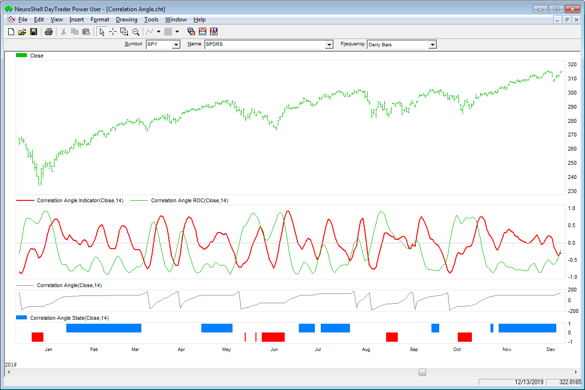

FIGURE 6: NEUROSHELL TRADER. This NeuroShell Trader chart shows the correlation angle indicator, rate of change, angle and state indicators.

—Marge Sherald, Ward Systems Group, Inc.  
301 662-7950, [sales@wardsystems.com](mailto:sales@wardsystems.com)  
[www.neuroshell.com](https://www.neuroshell.com/)

### QUANTACULA STUDIO: JUNE 2020

We have added the CorrelationAngle indicator to Quantacula’s TASC Extension, so it’s available both on the Quantacula.com website and in the downloadable Quantacula Studio trading model analysis platform.

This is based on the indicator presented by author John Ehlers in his article in this issue, “Correlation As A Cycle Indicator.”

Here, we present a simple C# script that uses **CorrelationAngle** to compute the market state, as explained in Ehlers’ article in this issue, and color-code the chart background accordingly. (The market state is determined by the CorrelationAngle indicator.)

```
Example Code:
using QuantaculaBacktest;
using System;
using QuantaculaCore;
using System.Drawing;
using TASCIndicators;

namespace Quantacula
{
    public class MyModel1 : UserModelBase
    {
        //this is executed prior to the main trading loop
        public override void Initialize(BarHistory bars)
        {
            StartIndex = 14;
            ca = new CorrelationAngle(bars.Close, 14);
            PlotIndicator(ca);
        }

        //this is executed once for each bar in the backtest history
        public override void Execute(BarHistory bars, int idx)
        {
            //determine market state
            int state = 0;
            double angle = ca[idx];
            double angle1 = ca[idx - 1];
            if (Math.Abs(angle - angle1) < 9 && angle < 0)
                state = -1;
            else if (Math.Abs(angle - angle1) < 9 && angle >= 0)
                state = 1;

            //color background based on state
            if (state == -1)
                SetBackgroundColor(idx, colorUp);
            else if (state == 1)
                SetBackgroundColor(idx, colorDown);
        }

        //declare private variables below
        private CorrelationAngle ca;
        private Color colorUp = Color.FromArgb(32, 255, 0, 0);
        private Color colorDown = Color.FromArgb(32, 0, 255, 0);
    }
}
```

A sample chart is shown in Figure 7.


FIGURE 7: QUANTACULA. This example chart shows the CorrelationAngle indicator based on John Ehlers’ article in this issue.

—Dion Kurczek, Quantacula LLC  
[info@quantacula.com](mailto:info@quantacula.com)  
[www.quantacula.com](https://www.quantacula.com/)

### THE ZORRO PROJECT: JUNE 2020

In a follow-up to his article last month on the correlation trend indicator, this month (in his article titled “Correlation As A Cycle Indicator”), John Ehlers presents another correlation-based indicator, this time for market cycles. While his *correlation trend indicator* measures the price correlation with a rising slope, the new *correlation cycle indicator* (CCY) measures the correlation with a sine wave.

Zorro’s C language supports function pointers and thus allows slightly shorter coding than in the original EasyLanguage script provided by Ehlers in his article:

```
var correlY(var Phase); // function pointer
var cosFunc(var Phase) { return cos(2*PI*Phase); }
var sinFunc(var Phase) { return -sin(2*PI*Phase); }

var correl(vars Data, int Length, function Func)
{
   correlY = Func; 
   var Sx = 0, Sy = 0, Sxx = 0, Sxy = 0, Syy = 0;
   int count;
   for(count = 0; count < Length; count++) {
      var X = Data[count];
      var Y = correlY((var)count/Length);
      Sx += X; Sy += Y;
      Sxx += X*X; Sxy += X*Y; Syy += Y*Y;
   }
   if(Length*Sxx-Sx*Sx > 0 && Length*Syy-Sy*Sy > 0)
      return (Length*Sxy-Sx*Sy)/sqrt((Length*Sxx-Sx*Sx)*(Length*Syy-Sy*Sy));
   else return 0;
}

var CCY(vars Data, int Length) { return correl(Data,Length,cosFunc); }

var CCYROC(vars Data, int Length) { return correl(Data,Length,sinFunc); }

var CCYState(vars Data, int Length, var Threshold)
{
   vars Angles = series(0,2);
   var Real = correl(Data,Length,cosFunc);
   var Imag = correl(Data,Length,sinFunc);
//Compute the angle as an arctangent function and resolve ambiguity
   if(Imag != 0) Angles[0] = 90 + 180/PI*atan(Real/Imag);
   if(Imag > 0) Angles[0] -= 180;
//Do not allow the rate change of angle to go negative
   if(Angles[1]-Angles[0] < 270 && Angles[0] < Angles[1])
      Angles[0] = Angles[1];
//Compute market state
   if(abs(Angles[0]-Angles[1]) < Threshold)
      return ifelse(Angles[0] < 0,-1,1);
   else return 0;
}
```

First, let’s look at how the CCY indicator behaves when applied to a sine wave. We’re using Zorro’s wave generator to produce sine chirp with a rising cycle length from 15 up to 30 bars, which is 25% below and 50% above the CCY period of 20 bars. The result is shown in Figure 8.

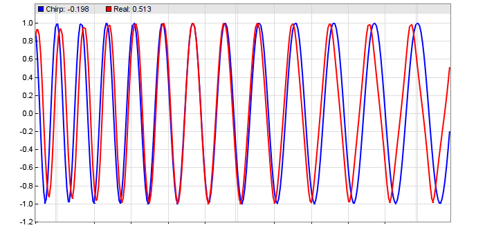

FIGURE 8: ZORRO PROJECT. Zorro’s wave generator was used to produce sine chirp with a rising cycle length from 15 up to 30 bars, which is 25% below and 50% above the CCY period of 20 bars.

This confirms the results from Ehlers’ stress test (described in his article in this issue). A shorter period results in a phase lag, a longer period in a phase lead. Let’s now apply the indicator to real-world price curves. Figure 9 shows the CCY and its rate of change (CCYROC) in a chart of the SPY.

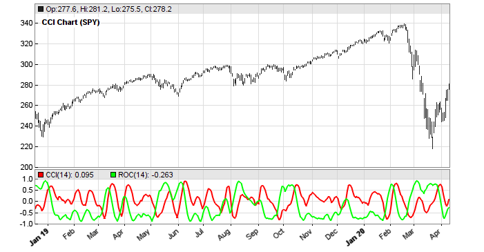

FIGURE 9: ZORRO PROJECT. This shows the correlation cycle indicator (CCY) and its rate of change (CCYROC) on the SPY.

How well can the cycle correlation detect market states? Ehlers’ CCYState indicator determines the phase angle of the CCY and CCYROC, and uses it to return 1 for a rising trend, -1 for a falling trend, and 0 for cycle regime (Figure 10).

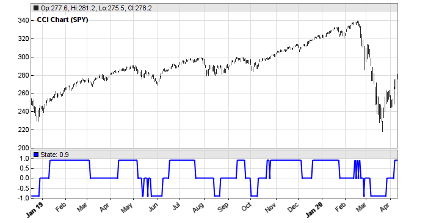

FIGURE 10: ZORRO PROJECT. The market state indicator determines the phase angle of the correlation cycle indicator and CCYROC, and uses it to return 1 for a rising trend, -1 for a falling trend, and 0 for cycle regime.

At first glance, trends and cycles seem to be rather well and timely detected. But is the indicator useful for determining market states in a real trading system?

To try to find out, we’ll compare the performance of a very simple trend follower with and without market state detection. We’ll use walk-forward optimization for being independent of parameters. Here is the trend follower without market state detection:

```
void run() 
{
   set(PARAMETERS,PLOTNOW);
   BarPeriod = 1440;
   LookBack = 40;
   NumYears = 8;
   assetAdd("SPY","STOOQ:SPY.US"); // load price history from Stooq
   asset("SPY");
   NumWFOCycles = 4;
   int Cutoff = optimize(10,4,20,2);
   vars Prices = series(priceClose());
   vars Signals = series(LowPass(Prices, Cutoff));
   if(valley(Signals))
      enterLong();
   else if(peak(Signals))
      enterShort();
}
```

The only indicator of this system is a second-degree low-pass filter with a cutoff optimized between 4 and 20 cycles. The system enters a long position on any valley of the low-pass filtered price curve, and a short position on any peak. The resulting equity curve (blue bars) can be seen in Figure 11.

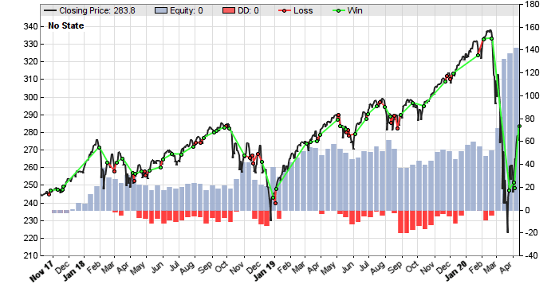

FIGURE 11: ZORRO PROJECT. An equity curve (the bluish histogram behind the price bars) is shown for the example trend-following system without the market state detection included. The results are not very good. For comparison, see the next figure with market state detection included.

We can see that the simple SPY trend follower is not very good. Its main profit came from a lucky trade at the market drop brought about by the coronavirus pandemic news. Before that, it had long flat periods. Let’s see if the CCYState indicator can help. Its two parameters, *period* and *threshold*, are also walk-forward optimized. The new script is as follows:

```
function run() 
{
   set(PARAMETERS,PLOTNOW);
   BarPeriod = 1440;
   LookBack = 40;
   NumYears = 8;
   assetAdd("SPY","STOOQ:SPY.US"); // load price history from Stooq
   asset("SPY");
   NumWFOCycles = 4;
   int Cutoff = optimize(10,5,30,5);
   int Period = optimize(14,10,25,1);
   var Threshold = optimize(9,5,15,1);
   vars Prices = series(priceClose());
   var State = CCYState(Prices, Period, Threshold);
   plot("State", State, NEW|LINE, BLUE);
   vars Signals = series(LowPass(Prices, Cutoff));
   if(State != 0) {
      if(valley(Signals))
         enterLong();
      else if(peak(Signals))
         enterShort();
   } else {
      exitLong(); 
      exitShort();
   }
}
```

The new system trades only when the market state is 1 or -1, indicating trend regime. It goes out of the market when the market state is 0. We can see that this improves the equity curve remarkably (Figure 12).

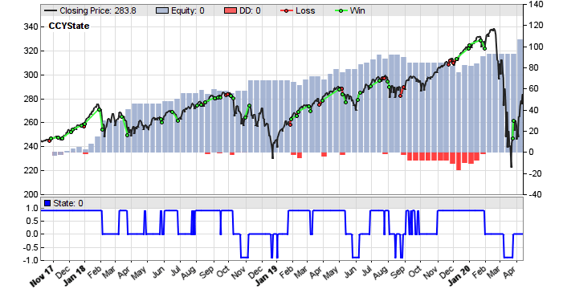

FIGURE 12: ZORRO PROJECT. The equity curve is improved greatly when the market state is taken into account using Ehlers’ market state variable.

I think most would prefer this system to the previous one, even though it stayed out of the market at the drop due to coronavirus news. Ehlers’ *correlation cycle indicator* apparently did a good job.

These indicators and trade systems can be downloaded from the 2020 script repository at [https://financial-hacker.com](https://financial-hacker.com/).

The Zorro platform can be downloaded from [https://zorro-project.com](https://zorro-project.com/).

—Petra Volkova  
The Zorro Project by oP group GmbH  
[www.zorro-project.com](https://www.zorro-project.com/)

### MICROSOFT EXCEL: JUNE 2020

In his article in this issue, Ehlers builds on his article from last month, which was on the *trend correlation indicator*, by exploring the concept of using cycle correlation as a trend indicator. The article takes us through the logical steps leading up to a *cycle correlation indicator* and gives us a couple of ways to look at the finished indicator.

Figure 13 is a situation similar to Figure 3 from Ehlers’ article in this issue.

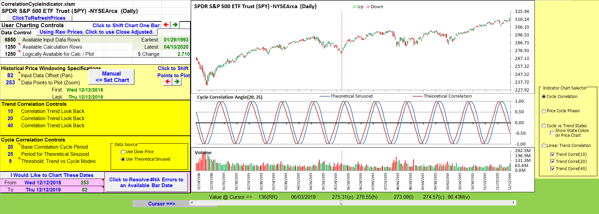

FIGURE 13: EXCEL. Correlation of a 25-bar sinusoid with a base 20-bar cosine.

Figure 14 uses the same calculations to correlate the closing price to a 14-bar base cycle. The result lines up well with Figure 4 from Ehlers’ article in this issue.

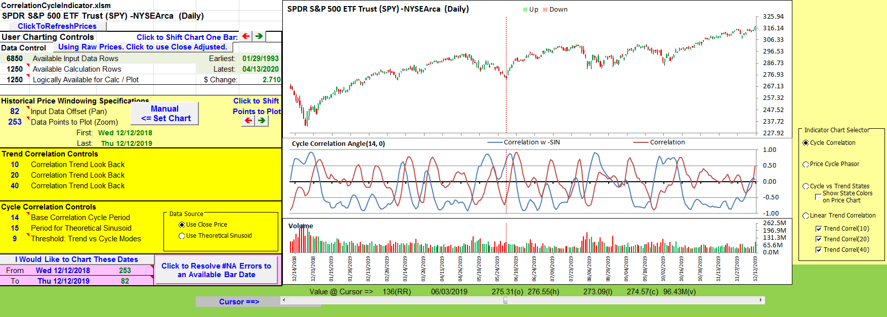

FIGURE 14: EXCEL. Correlation of price to -SIN and COS over a 14-bar base cycle.

The chart in Figure 14 is a bit noisy for easy use. So Ehlers takes things a bit further by introducing the concept of a *phasor* to help differentiate trend and cycle modes and to locate points of interest.

Figure 15 replicates Figure 8 from Ehlers’ article. This demonstrates the *phasor angle* change in the correlation of a 20-bar sinusoid and a 20-bar base cycle.

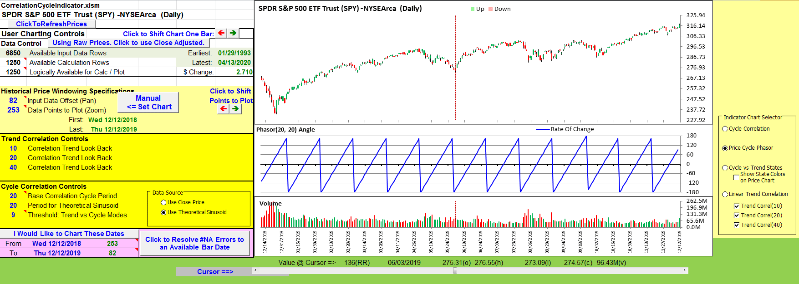

FIGURE 15: EXCEL. The phase angle rate of change for 20-bar sinusoid input correlated to 20-bar base cycle.

Figure 16 replicates Figure 9 from the article. This demonstrates the *phasor angle* change in the correlation of closing price using a 14-bar base cycle. This provides an easier way to see early indications of trend beginnings and endings.


FIGURE 16: EXCEL. Phase angle. The closing price is correlated to a 14-bar base cycle.

Then Ehlers takes the phasor concept one step further to define a market state variable that uses the information available in the phasor behavior to differentiate between cycle mode, and up or down trend modes.

Figure 17 replicates the market state chart shown in Figure 10 of Ehlers’ article in this issue.

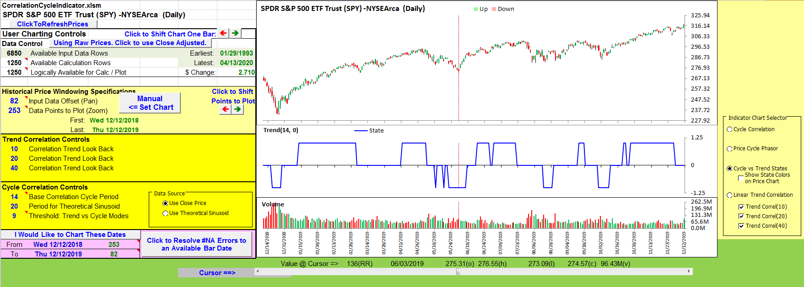

FIGURE 17: EXCEL. Market state variable.

To make things easy, in Figure 18 I have chosen to project the market state onto the price chart as background shading for the up and down trends and no shading for the periods of cycle mode. This is controlled by the checkbox below the cycle versus trend radio button to the right of the chart.

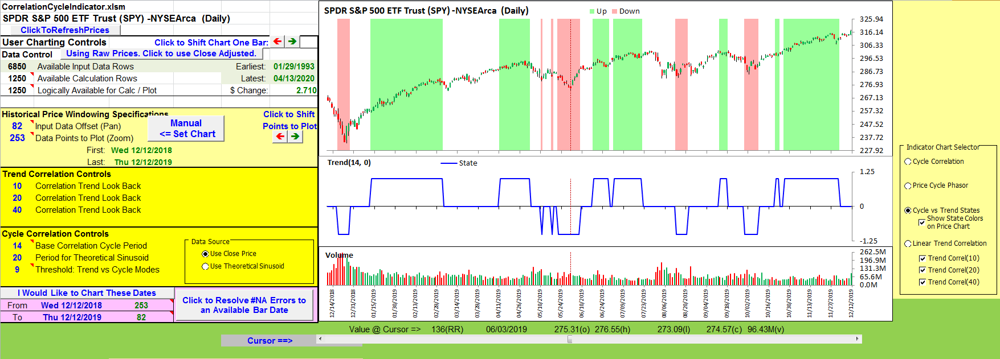

FIGURE 18: EXCEL. The market state is projected onto the price chart.

For completeness, based on Ehlers’ trend discussions in his May 2020 article and now in this issue, I carried over the linear trend correlation chart from the May 2020 article. See the bottom radio button in the chart selector.

Ehlers used a 9-degree threshold as part of differentiating trend versus cycle modes. Degree changes that are larger than the threshold, bar to bar, are considered to be cycle mode.

I was curious and decided to make that threshold setting part of the cycle correlation controls. It was interesting to see the results with larger and smaller threshold values.

If you try to replicate figures from the article, please be aware that the base correlation cycle period used in Ehlers’ figures is 20 in the early figures and 14 in the later figures.

One last note: The input price data also makes a difference when you are attempting to replicate a chart from any article. In this case, the price data used in the article ends in mid-December.

I am using data I retrieved in mid-April. Four months’ worth of dividends, splits, and possibly, corrections of data reporting errors have been folded into the close-adjusted pricing.

I could not get my Figures 17 and 18 to match up exactly with Ehlers’ Figure 10 until I selected “raw” pricing (the button to the right of cell A5 on the CalculationsAndCharts tab).

Once I figured this out, I could see subtle differences in the other charts available in this spreadsheet as I toggled between raw and adjusted prices.

I am not advocating for either pricing style. I am just noting that the choice can have a subtle or a significant impact on your computations.

The spreadsheet file for this Traders’ Tip can be downloaded [here](https://www.traders.com/Documentation/FEEDbk_docs/2020/06/images/code/CorrelationCycleIndicator.xlsm). To successfully download it, follow these steps:

* Right-click on the [Excel file link](https://www.traders.com/Documentation/FEEDbk_docs/2020/06/images/code/CorrelationCycleIndicator.xlsm), then
* Select “save as” (or “save target as”) to place a copy of the spreadsheet file on your hard drive.

—Ron McAllister  
Excel and VBA programmer  
[rpmac\_xltt@sprynet.com](mailto:rpmac_xltt@sprynet.com)

Originally published in the June 2020 issue of  
*Technical Analysis of* STOCKS & COMMODITIES magazine.   
All rights reserved. © Copyright 2020, Technical Analysis, Inc.

## References

```bibtex
@misc{tasc2020traderstips_jun,
  title   = {Traders' Tips: Correlation As A Cycle Indicator},
  journal = {Technical Analysis of STOCKS \& COMMODITIES},
  volume  = {38},
  number  = {6},
  year    = {2020},
  month   = jun,
  url     = {https://www.traders.com/Documentation/FEEDbk_docs/2020/06/TradersTips.html}
}
```
