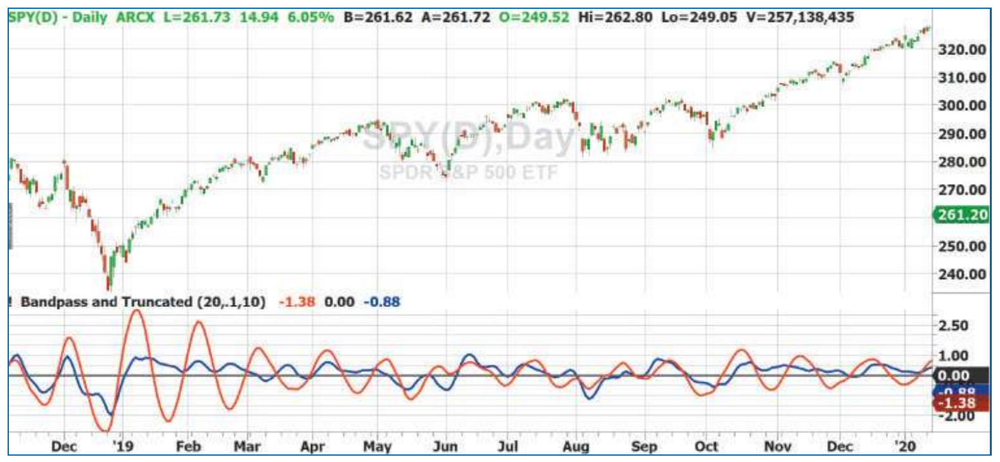

# Truncated Indicators

*A Simple Mathematical Technique To Improve Cycle Indicators*

- **Author:** John F. Ehlers
- **Publication:** Technical Analysis of STOCKS & COMMODITIES, Volume 38, July 2020, pp. 20–23
- **Article URL:** [V38/C07/082EHLE.pdf](https://technical.traders.com/archive/article.asp?file=\V38\C07\082EHLE.pdf)
- **Traders' Tips URL:** [Traders' Tips, July 2020](https://www.traders.com/Documentation/FEEDbk_docs/2020/07/TradersTips.html)

---

*An ideal cycle indicator is one that will help you locate and track cycles in price data to better anticipate price. Here is a straightforward technique for improving how accurately a cycle indicator reflects price—including the handling of extreme price events such as the market experienced recently. Coding is provided to help you implement the technique.*

The performance of some, but not all, indicators can be greatly enhanced by *truncation*. By "truncation," I am referring to limiting the data range automatically in ways that allow the indicator to more accurately reflect price.

But which indicators can be enhanced by it, and why? In this article, I'll tell you the type of indicator that can benefit from this mathematical technique, and I'll show you a way to perform the truncation. Through an example, I'll show you the difference it makes, and I'll codify it for you so you can see the details of the process and also implement it yourself.

## Why Truncation?

If you toss a rock into a lake, ripples will form. The rock may disturb the body of water only for a minute in the grand scheme of things, but the ripples echo outward until they fade (or are "attenuated")—and the impact of the rock fades. But in the meantime, the trail left by the ripples is noticeable, and the impact of the disturbance will distort the water.

An indicator takes form by the data series on which it is based. A short disturbance in the data, like the rock in the water, can have an outsized impact on indicator output in the time series, which is not always desirable. This is one situation where indicator truncation can be helpful, as I'll describe.

Another situation where indicator truncation is helpful has to do with the data window used for the calculation of an indicator, and at what point in the data the calculations start. A data series that begins, for example, at a price extreme—or that just misses one—affects the output.

## Digital Filters: Finite vs. Infinite

When it comes to digital filters, there are two fundamentally different types: *finite impulse response* and *infinite impulse response*.

### Finite impulse response (FIR)

*Finite impulse response* or FIR uses a fixed window of data and is used to calculate a point of the filter output. That window slides across the data, and the output points are connected to provide the indicator. A simple moving average (SMA) is an example of such a filter. The RSI (relative strength index) and the stochastic oscillator are examples of indicators that use this principle.

FIR filters and indicators can only be *degraded* by truncation.

### Infinite impulse response (IIR)

IIR stands for *infinite impulse response*, where the computation of the filter or indicator depends on a previous calculation of that filter. The exponential moving average (EMA), and thus the MACD, as well as other indicators, are IIR types. Of course, the computation of an IIR filter does not extend to infinity. The filter computation can only start at the beginning of the data being used.

Therein lies the problem. The answer you get from an IIR filter will be different depending on your data length. If the data stream is sufficiently long, the answer may be the same for all practical purposes, but it will be different nonetheless.

So *initialization* is one problem that is resolved by truncating the indicators. The *memory* of IIR indicators can also impact performance, because a major data disturbance can cause the transient response of the indicator to ring like a bell, using that data disturbance in its output long after the event has occurred. This is particularly important because market data is nonstationary, that is, the data has time variable probability statistics.

IIR filters are handy for a trader because you do not have to accept the group delay of an FIR filter, which is typically about half the length of the filter itself.

I will first describe several ways to perform truncation, and then I will discuss its performance impact.

## Performing Truncation

An exponential moving average (EMA) is one filter that depends on previous calculated values. In EasyLanguage notation, an EMA is:

> Output = α\*Input + (1-α)\*Output[1];

where Output[1] means the filter output one bar ago and where α is the EMA constant (less than 1).

Of course, the output one bar ago requires its previous output two bars ago, and so on. Thus, the required history goes back to infinity. The EMA equation can be rewritten as:

> (Output – (1-α)\*Output[1]) = α\*Input

If I change the notation at let Z⁻¹ signify one bar of delay, the equation is rewritten as:

> Output\*(1 – (1-α)\*Z⁻¹) = α\*Input

The ratio of output to input is the *transfer response* of the filter, and so the transfer response of the filter, H, can be written as:

> H = α / (1 – (1-α)\*Z⁻¹)

Just to simplify notation, let (1-α) = c. The equation then becomes:

> H = α / (1 – c\*Z⁻¹)

The denominator of the transfer response carries the requirement for a calculation into the infinite past. However, if we create an infinite series by dividing the dominator into the numerator by long division, the equation becomes:

> H = α\*(1 + c\*Z⁻¹ + c²\*Z⁻² + c³\*Z⁻³ + c⁴\*Z⁻⁴ + c⁵\*Z⁻⁵ + . . . . )

Truncation of this equation is easy, because we can just stop using the higher-power terms at any power we choose. Since (1-α) is a number less than unity, we can estimate the desired length of the truncation by computing when the coefficients no longer have an impact on the transfer response.

The EasyLanguage code fragment to compute a truncated EMA of a fixed length as a summation of terms is:

```easylanguage
Output = 0;
For count = 0 to Length Begin
    Output = Output + Power(c, count)*Input[count];
End;
Output = a*Output;
```

One of the beauties of computers is that we can just brute-force grind through calculations without resorting to mathematical sleight-of-hand tricks. This gives us more flexibility in easily truncating higher-order filters. However, it requires a slightly greater understanding of computer coding. In the sidebar "EasyLanguage Code For Standard And Truncated Bandpass Filters," I give the EasyLanguage code to compute a standard bandpass filter in terms of its center period and percentage bandwidth. The standard computation as an IIR filter uses the computed values of the bandpass filter both one bar ago and two bars ago. In the truncated version, I use the array *Trunc*. I first have to stack the array on every bar. Then, in the next code block, I crunch the current value for the array. I then convert the current value of the filter to a variable so I can plot it just like the standard computation.

## An SPY Example

In Figure 1, I show the standard and truncated bandpass filters applied to daily bars of SPY for roughly the calendar year 2019. In both cases, the center period of the filter is 20 bars and have 10 percent of the center period bandwidth. The standard bandpass filter is in red and the truncated bandpass filter is in blue. The truncated bandpass filter only uses 10 bars of data in its computation at every bar across the chart.



**FIGURE 1: TRUNCATED VS. STANDARD IIR FILTER.** Both the truncated (in blue) and standard (in red) bandpass filters are shown in the bottom pane of this 2019 daily SPY chart. As you can see in this example, the truncated bandpass filter is a better indicator of price action.

The big price dip in December 2018 certainly bangs the standard bandpass filter and causes it to ring out like a bell for at least five months. On the other hand, the truncated bandpass filter has a dampened response to that major event. It further accurately describes the price action by staying above zero during the uptrend into early May. During this time, the cyclic price action is also accurately portrayed.

For example, the price swing peak in the third week of March 2020 is accurately reflected in the peak of the truncated bandpass filter, whereas the standard bandpass filter is dead wrong at a cyclic valley at this time. Similarly, the truncated filter is above zero during the fourth quarter uptrend. The cyclic swings during August and September are also accurately reflected in the truncated indicator.

In fact, you can track the cyclic swings across the entire chart and see at a glance how they correlate with the price movements.

## A Better Indicator of Price Action

In summary, truncating IIR filters solves two problems associated with IIR filters. First, initialization errors are eliminated. Second, dampened transient responses of the truncated filters provide a more reliable indication of the current price action.

---

*John Ehlers, a Contributing Editor to* STOCKS & COMMODITIES*, is a pioneer in the use of cycles and DSP (digital signal processing) technical analysis. He is president of MESA Software and holds a comprehensive workshop in California in the fall each year. He can be reached through his website at MESAsoftware.com.*

*The code given in this article is available in the Article Code section of our website, Traders.com.*

*See our Traders' Tips section beginning on page 48 for commentary and implementation of John Ehlers' technique in various technical analysis programs. Accompanying program code can be found in the Traders' Tips area at Traders.com.*

## EasyLanguage Code For Standard And Truncated Bandpass Filters

```easylanguage
{
    BandPass Filter and Truncated Bandpass Filter
    (C) 2005-2020 John F. Ehlers
}

Inputs:
    Period(20),
    Bandwidth(.1),
    Length(10);    //must be less than 98 due to array size

Vars:
    L1(0), G1(0), S1(0), count(0),
    BP(0), BPT(0);

Arrays:
    Trunc[100](0);

//Standard Bandpass
L1 = Cosine(360 / Period);
G1 = Cosine(Bandwidth*360 / Period);
S1 = 1 / G1 - SquareRoot( 1 / (G1*G1) - 1);
BP = .5*(1 - S1)*(Close - Close[2]) + L1*(1 + S1)*BP[1] - S1*BP[2];
If CurrentBar <= 3 Then BP = 0;

//Stack the Trunc Array
For count = 100 DownTo 2 Begin
    Trunc[count] = Trunc[count - 1];
End;

//Truncated Bandpass
Trunc[Length + 2] = 0;
Trunc[Length + 1] = 0;
For count = Length DownTo 1 Begin
    Trunc[count] = .5*(1 - S1)*(Close[count - 1] - Close[count + 1]) +
    L1*(1 + S1)*Trunc[count + 1] - S1*Trunc[count + 2];
End;
BPT = Trunc[1];  //convert to a variable

Plot1(BP);
Plot4(0);
Plot2(BPT);
```

## Further Reading

- Ehlers, John F. [2013]. *Cycle Analytics For Traders*, John Wiley & Sons.
- ——— [2016]. "The Super Passband Indicator," *Technical Analysis of* STOCKS & COMMODITIES, Volume 34: July. ‡TradeStation

‡*See Editorial Resource Index*

## BibTeX

```bibtex
@article{ehlers_truncated_indicators_2020,
  author    = {Ehlers, John F.},
  title     = {Truncated Indicators},
  journal   = {Technical Analysis of STOCKS \& COMMODITIES},
  volume    = {38},
  number    = {7},
  pages     = {20--23},
  month     = jul,
  year      = {2020},
  url       = {https://technical.traders.com/archive/article.asp?file=\V38\C07\082EHLE.pdf}
}

@misc{traders_tips_2020_07,
  author       = {{Technical Analysis of STOCKS \& COMMODITIES}},
  title        = {Traders' Tips: Truncated Indicators},
  howpublished = {online},
  month        = jul,
  year         = {2020},
  url          = {https://www.traders.com/Documentation/FEEDbk_docs/2020/07/TradersTips.html}
}
```
