# Traders' Tips: July 2020

- **Article:** Truncated Indicators by John F. Ehlers
- **Traders' Tips URL:** [Traders' Tips, July 2020](https://www.traders.com/Documentation/FEEDbk_docs/2020/07/TradersTips.html)

---

For this month's Traders' Tips, the focus is John F. Ehlers' article in this issue, "Truncated Indicators." Here, we present the July 2020 Traders' Tips code with possible implementations in various software.

## TradeStation: July 2020

In his article "Truncated Indicators" in this issue, author John Ehlers introduces a method that can be used to modify some indicators, improving how accurately they are able to track and respond to price action. By limiting the data range, that is, *truncating* the data, indicators may be able to better handle extreme price events. A reasonable goal, especially during times of high volatility.

Here, we are providing TradeStation EasyLanguage code for both an indicator and strategy based on the author's work.

```easylanguage
Indicator: Truncated BP Filter
// Truncated BP Filter
// John F. Ehlers
// TASC JUL 2020

inputs: 
	Period( 20 ), 
	Bandwidth( .1 ), 
	Length( 10 ) ; 
variables: 
	L1( 0 ), G1( 0 ), S1( 0 ), 
	count( 0 ), BP( 0 ), BPT( 0 ) ;
arrays: 
	Trunc[100]( 0 ) ; 

//Standard Bandpass 
L1 = Cosine( 360 / Period ) ; 
G1 = Cosine( Bandwidth * 360 / Period ) ; 
S1 = 1 / G1 - SquareRoot( 1 / ( G1 * G1 ) - 1 ) ;
BP = .5 * ( 1 - S1 ) * ( Close - Close[2] )
	 + L1 * ( 1 + S1 ) * BP[1] - S1 * BP[2] ; 

If CurrentBar <= 3 then 
	BP = 0 ; 
	
//Stack the Trunc Array 
for Count = 100 downto 2 
begin 
	Trunc[count] = Trunc[count - 1] ; 
end ; 

//Truncated Bandpass 
Trunc[Length + 2] = 0 ; 
Trunc[Length + 1] = 0 ; 

for count = Length downto 1 
begin 
	Trunc[count] = .5 * ( 1 - S1 ) 
		* ( Close[count - 1] - Close[count + 1] ) 
		+ L1 * ( 1 + S1 ) * Trunc[count + 1] 
		- S1 * Trunc[count + 2] ; 
end ; 

BPT = Trunc[1]; //convert to a variable 

Plot1(BP, "BP Filt" ) ; 
Plot2( BPT, "Trunc BP Filt") ;
Plot4( 0, "ZL" ) ;

Strategy: Truncated BP Filter

// Truncated BP Filter
// John F. Ehlers
// TASC JUL 2020

inputs: 
	Period( 20 ), 
	Bandwidth( .1 ), 
	Length( 10 ) ; 
variables: 
	L1( 0 ), G1( 0 ), S1( 0 ), 
	count( 0 ), BP( 0 ), BPT( 0 ) ;
arrays: 
	Trunc[100]( 0 ) ; 

//Standard Bandpass 
L1 = Cosine( 360 / Period ) ; 
G1 = Cosine( Bandwidth * 360 / Period ) ; 
S1 = 1 / G1 - SquareRoot( 1 / ( G1 * G1 ) - 1 ) ;
BP = .5 * ( 1 - S1 ) * ( Close - Close[2] )
	 + L1 * ( 1 + S1 ) * BP[1] - S1 * BP[2] ; 

If CurrentBar <= 3 then 
	BP = 0 ; 
	
//Stack the Trunc Array 
for Count = 100 downto 2 
begin 
	Trunc[count] = Trunc[count - 1] ; 
end ; 

//Truncated Bandpass 
Trunc[Length + 2] = 0 ; 
Trunc[Length + 1] = 0 ; 

for count = Length downto 1 
begin 
	Trunc[count] = .5 * ( 1 - S1 ) 
		* ( Close[count - 1] - Close[count + 1] ) 
		+ L1 * ( 1 + S1 ) * Trunc[count + 1] 
		- S1 * Trunc[count + 2] ; 
end ; 

BPT = Trunc[1]; //convert to a variable 


if BPT crosses over 0  then 
	Buy next bar at Market 
else if BPT crosses under 0  Then
	SellShort next bar at Market ;
```

A sample chart is shown in Figure 1.

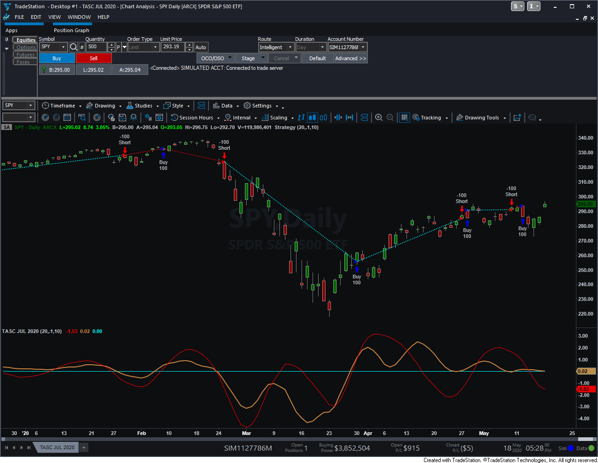

**FIGURE 1: TRADESTATION.** The truncated bandpass filter indicator and strategy are applied to a daily chart of the SPY ETF.

—Doug McCrary
TradeStation Securities, Inc.
[www.TradeStation.com](https://www.tradestation.com/)

---

## Wealth-Lab: July 2020

In his article in this issue, "Truncated Indicators," author John Ehlers shows how to improve a bandpass filter's ability to reflect price by limiting the data range. Filtering out the temporary spikes and price extremes should positively affect the indicator stability. Enter a new indicator—the TruncatedBandPass filter.

Despite the math behind it may not appear as easy to some, Wealth-Lab proves that prototyping a trading system should not be a complex task. In fact, our *strategy from rules* feature makes it possible for everyone to achieve without having to invest much effort.

For example, crossovers of the truncated bandpass with zero could indicate a trend change. Let's see if the idea has merit:

- **Step 1.** Install (or update) the TASCIndicators library to its most-recent version from our website or using the built-in Extension Manager.
- **Step 2.** Add an entry and exit block, then drag and drop "Indicator crosses above (below) value" from *general indicators* under the *conditions* tab on top of each one (respectively).
- **Step 3.** For each entry and exit, choose the TruncatedBandPass as *Indicator* and zero as the value to cross where prompted.

Figure 2 shows an example of creating a rules-based strategy in Wealth-Lab.

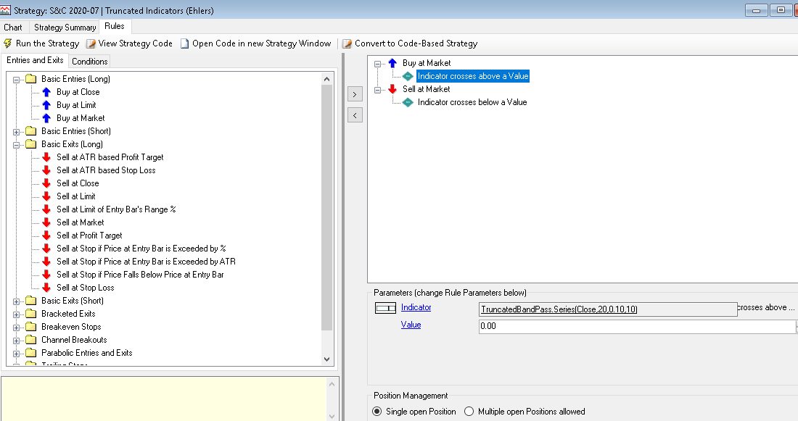

**FIGURE 2: WEALTH-LAB.** Here is an example of creating a rule-based strategy with the truncated bandpass in Wealth-Lab.

A quick test shows we're onto something, and with some more tweaking, we may be able to make a trading system out of it, as we've done in Figure 3.

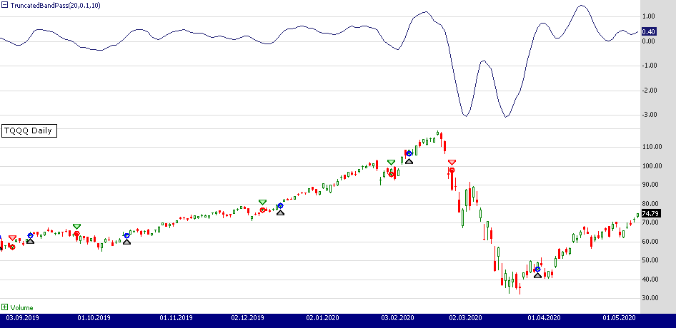

**FIGURE 3: WEALTH-LAB.** The example trading system is applied to a daily chart of TQQQ. (Data provided by AlphaVantage)

Whether you've prototyped the trading system code using our *strategy from rules* feature described above or whether you've downloaded the code from Wealth-Lab (hit Ctrl-O and choose *download*...), to peek into the code behind it, simply click "Open code in new strategy window."

```csharp
using System;
using System.Collections.Generic;
using System.Text;
using System.Drawing;
using WealthLab;
using WealthLab.Indicators;
using TASCIndicators;

namespace WealthLab.Strategies
{
	public class TASC2020_07 : WealthScript	
	{		
		protected override void Execute()
		{
			var tbp = TruncatedBandPass.Series(Close, 20, 0.10, 10);

			HideVolume();
			ChartPane pane1 = CreatePane( 25,true,true);
			PlotSeries( pane1,tbp,Color.MidnightBlue,LineStyle.Solid,1);

			for(int bar = GetTradingLoopStartBar( 21); bar < Bars.Count; bar++)
			{
				if (IsLastPositionActive)
				{
					Position p = LastPosition;
					
					if (CrossUnder(bar, tbp, 0))
						SellAtMarket( bar + 1, p);
				}
				else
				{
					if (CrossOver(bar, tbp, 0))
						BuyAtMarket( bar + 1);
				}
			}
		}
	}
}
```

—Robert Sucher & Gene (Eugene) Geren, Wealth-Lab team
MS123, LLC
[www.wealth-lab.com](https://www.wealth-lab.com/)

---

## eSignal: July 2020

For this month's Traders' Tip, we've provided the study "TruncatedIndicators.efs" based on the article in this issue by John Ehlers, "Truncated Indicators." The study is designed to improve cycle indicators by introducing truncation.

The study contains formula parameters that may be configured through the *edit chart* window (right-click on the chart and select "edit chart"). A sample chart is shown in Figure 4.

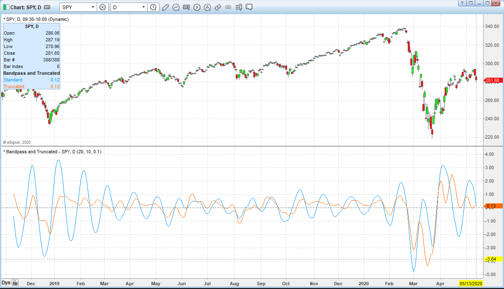

**FIGURE 4: ESIGNAL.** Here is an example of the study plotted on a daily chart of the SPY.

To discuss this study or download a complete copy of the formula code, please visit the EFS Library Discussion Board forum under the *forums* link from the support menu at [www.esignal.com](https://www.esignal.com/) or visit our EFS KnowledgeBase at [https://www.esignal.com/support/kb/efs/](https://www.esignal.com/support/kb/efs/).

```javascript
/**********************************
Provided By:  
Copyright 2019 Intercontinental Exchange, Inc. All Rights Reserved. 
eSignal is a service mark and/or a registered service mark of Intercontinental Exchange, Inc. 
in the United States and/or other countries. This sample eSignal Formula Script (EFS) 
is for educational purposes only. 
Intercontinental Exchange, Inc. reserves the right to modify and overwrite this EFS file with each new release. 

Description:        
   Truncated Indicators
   by John F. Ehlers
    

Version:            1.00  05/13/2020

Formula Parameters:                     Default:
Period                                  20
Length                                  10
Bandwidth                               0.1

Notes:
The related article is copyrighted material. If you are not a subscriber
of Stocks & Commodities, please visit www.traders.com.

**********************************/
var fpArray = new Array();
var bInit = false;

function preMain() {
    setStudyTitle("Bandpass and Truncated");
    setCursorLabelName("Standard", 0);
    setCursorLabelName("Truncated", 1);
    setPriceStudy(false);
    setDefaultBarFgColor(Color.RGB(0x00,0x94,0xFF), 0);
    setDefaultBarFgColor(Color.RGB(0xFE,0x69,0x00), 1);
    setPlotType( PLOTTYPE_LINE , 0 );
    setPlotType( PLOTTYPE_LINE , 1 );
    addBand( 0, PLOTTYPE_DOT, 1, Color.grey); 
    
    
    var x=0;
    fpArray[x] = new FunctionParameter("Period", FunctionParameter.NUMBER);
	with(fpArray[x++]){
        setLowerLimit(1);		
        setDefault(20);
    }
    fpArray[x] = new FunctionParameter("Length", FunctionParameter.NUMBER);
	with(fpArray[x++]){
        setLowerLimit(1);
        setUpperLimit(98);  
        setDefault(10);            
    }
    fpArray[x] = new FunctionParameter("Bandwidth", FunctionParameter.NUMBER);
	with(fpArray[x++]){
        setLowerLimit(0);		
        setDefault(.1);            
    }
        
}

var bVersion = null;
var L1 = null;
var G1 = null; 
var S1 = null; 
var BP = null; 
var BP_1 = null;
var BP_2 = null;
var BPT = null; 
var Trunc = [];
var xClose = null;


function main(Period,Length,Bandwidth) {
    if (bVersion == null) bVersion = verify();
    if (bVersion == false) return; 
    
    if ( bInit == false ) { 
        L1 = Math.cos(2 * Math.PI / Period)
        G1 = Math.cos(Bandwidth * 2 * Math.PI / Period)
        S1 = 1 / G1 - Math.sqrt(1 / (G1*G1) - 1)
        xClose = close();  
        BP_1 = 0;
        BP = 0;       
        for (var i = 0; i <= 100; i++){
            Trunc[i] = 0
        } 
        
        bInit = true; 
    }      

    if (getCurrentBarCount() <= Length) return;
    if (getBarState() == BARSTATE_NEWBAR) {
        BP_2 = BP_1;
        BP_1 = BP;
    }
    
    if (getCurrentBarCount() <= 3) BP = 0;
    else BP = .5 * (1 - S1) * (xClose.getValue(0) - xClose.getValue(-2)) + L1 * (1 + S1) * BP_1 - S1 * BP_2;
    
    //Stack the Trunc Array
    for (var i = 100; i > 1; i--) {
        Trunc[i] = Trunc[i-1]
    }

    //Truncated Bandpass
    Trunc[Length + 2] = 0;
    Trunc[Length + 1] = 0;
    for (var i = Length; i > 0; i--) {
        Trunc[i] = .5 * (1 - S1) * (xClose.getValue(-i + 1) - xClose.getValue(-i - 1)) + L1 * (1 + S1) * Trunc[i + 1] - S1 * Trunc[i + 2]; 
    } 

    BPT = Trunc[1] //convert to a variable

    return [BP, BPT]
}

function verify(){
    var b = false;
    if (getBuildNumber() < 779){
        
        drawTextAbsolute(5, 35, "This study requires version 10.6 or later.", 
            Color.white, Color.blue, Text.RELATIVETOBOTTOM|Text.RELATIVETOLEFT|Text.BOLD|Text.LEFT,
            null, 13, "error");
        drawTextAbsolute(5, 20, "Click HERE to upgrade.@URL=https://www.esignal.com/download/default.asp", 
            Color.white, Color.blue, Text.RELATIVETOBOTTOM|Text.RELATIVETOLEFT|Text.BOLD|Text.LEFT,
            null, 13, "upgrade");
        return b;
    } 
    else
        b = true;
    
    return b;
}
```

—Eric Lippert
eSignal, an Interactive Data company
800 779-6555, [www.eSignal.com](https://www.esignal.com/)

---

## NinjaTrader: July 2020

The BandPassFilter indicator discussed in John Ehlers' article in this issue, "Truncated Indicators," is available for download at the following links for NinjaTrader 8 and for NinjaTrader 7:

- **NinjaTrader 8:** [www.ninjatrader.com/SC/July2020SCNT8.zip](https://www.ninjatrader.com/SC/July2020SCNT8.zip)
- **NinjaTrader 7:** [www.ninjatrader.com/SC/July2020SCNT7.zip](https://www.ninjatrader.com/SC/July2020SCNT7.zip)

Once the file is downloaded, you can import the indicator into NinjaTader 8 from within the Control Center by selecting Tools → Import → NinjaScript Add-On and then selecting the downloaded file for NinjaTrader 8. To import in NinjaTrader 7, from within the Control Center window, select the menu File → Utilities → Import NinjaScript and select the downloaded file.

You can review the indicator's source code in NinjaTrader 8 by selecting the menu New → NinjaScript Editor → Indicators from within the Control Center window and selecting the BandPassFilter file. You can review the indicator's source code in NinjaTrader 7 by selecting the menu Tools → Edit NinjaScript → Indicator from within the Control Center window and selecting the BandPassFilter file.

A sample chart is shown in Figure 5.

**FIGURE 5: NINJATRADER.** The BandPassFilter indicator is shown on SPY from December 2018 to December 2019.

NinjaScript uses compiled DLLs that run native, not interpreted, to provide you with the highest performance possible.

Source code: [ninja-trader/BandPassFilter.cs](ninja-trader/BandPassFilter.cs)

—Jim Dooms
NinjaTrader, LLC
[www.ninjatrader.com](https://www.ninjatrader.com/)

---

## Quantacula Studio: July 2020

John Ehlers' article in this issue, "Truncated Indicators," features his bandpass indicator, which we've already integrated into the Quantacula TASC library. This means the indicator is ready for use both in Quantacula Studio and the Quantacula.com website.

We decided to test the indicator out by creating a trading model using drag & drop building blocks in Quantacula Studio. This type of model is composed of *entry*, *exit*, *condition*, and *qualifier* blocks. You drop *conditions* onto *entries* and *exits* to specify when to get into and out of a trade. You can drop *qualifiers* onto *conditions* to give them more specific criteria (see Figure 6).

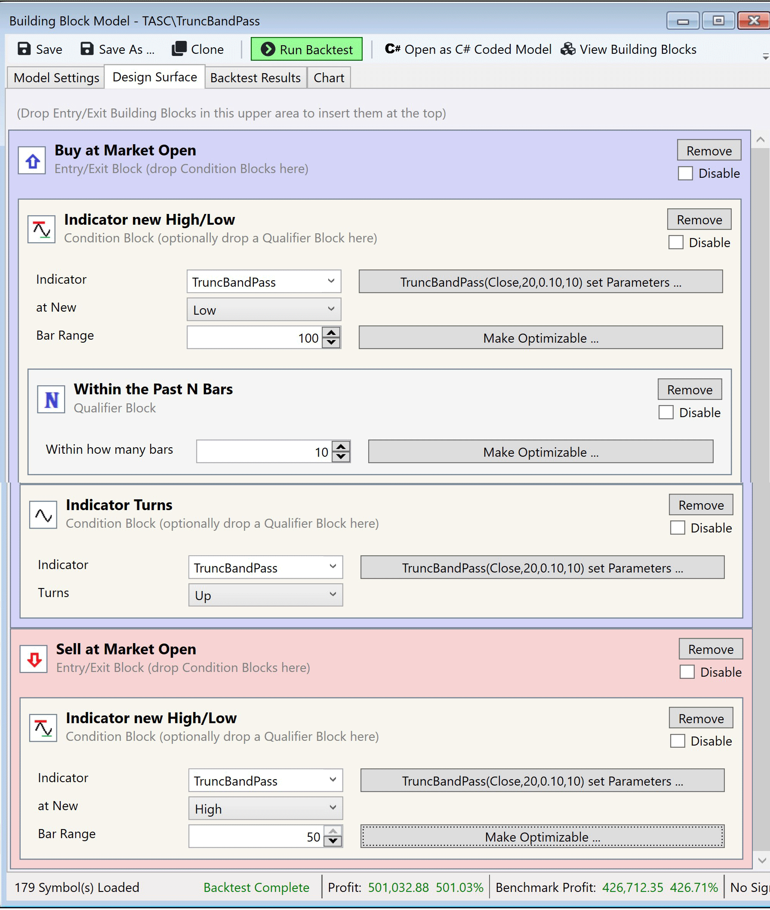

**FIGURE 6: QUANTACULA.** Shown here is the TruncBandPass trading model mocked up in Quantacula Studio Building Blocks.

We used two conditions for the entry here, *indicator new high/low* to specify that TruncBandPass should make a 100-bar new low. The second condition we used is *indicator turns up/down*, to specify that TruncBandPass should turn up, that is, move up after having moved down. We used the qualifier *within the past N bars* to give the first condition some flexibility. This results in a buy after the TruncBandPass turns up after having hit a 100-bar low *sometime within the past 10 bars*. We exit the trade when TruncBandPass hits a 50-bar new high.

We backtested the trading model on the Nasdaq 100 stocks, using the QPremium universe that automatically accounts for symbols that dropped into and out of the index over time. We used $100,000 starting capital, a trade size of 15% of equity, and 1.5:1 margin. Over the past 10 years, the model performed quite well, returning an annualized gain of 19.84% (see Figure 7).

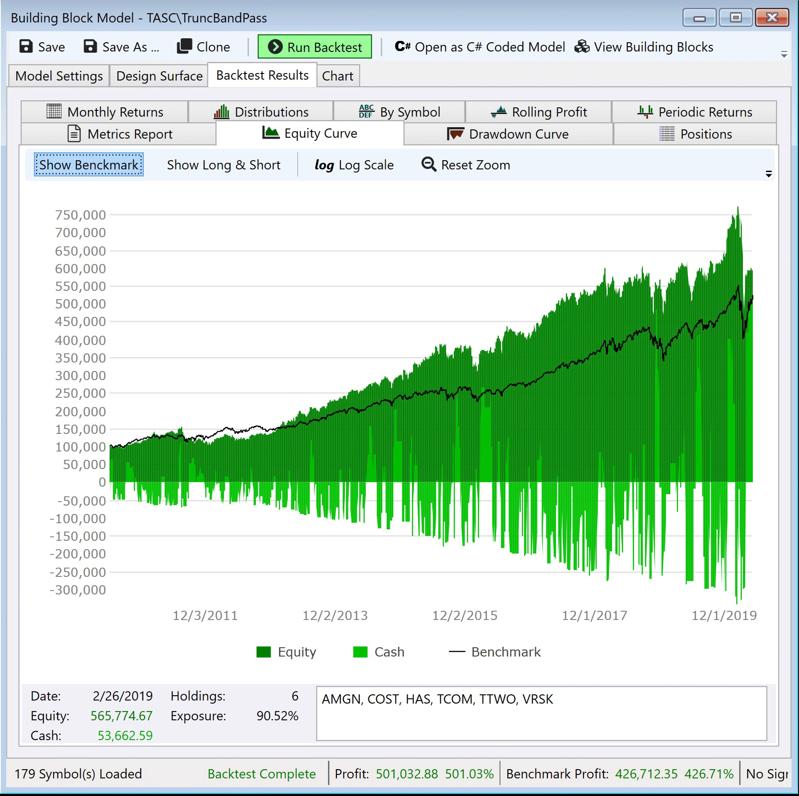

**FIGURE 7: QUANTACULA.** The resulting equity curve for the example TruncBandPass trading model is shown.

—Dion Kurczek, Quantacula LLC
[info@quantacula.com](mailto:info@quantacula.com)
[www.quantacula.com](https://www.quantacula.com/)

---

## NeuroShell Trader: July 2020

The truncated bandpass filter described by John Ehlers in his article in this issue, "Truncated Indicators," can be easily implemented in NeuroShell Trader using NeuroShell Trader's ability to call external dynamic linked libraries (DLLs). DLLs can be written in C, C++, and Power Basic.

After moving the code given in Ehlers' article to your preferred compiler and creating a DLL, you can insert the resulting indicator as follows:

1. Select *new indicator* from the **insert** menu.
2. Choose the **external program & library** calls category.
3. Select the appropriate *external DLL call* indicator.
4. Set up the parameters to match your DLL.
5. Select the **finished** button.

Users of NeuroShell Trader can go to the Stocks & Commodities section of the NeuroShell Trader free technical support website to download a copy of this or any previous Traders' Tips.

A sample chart is shown in Figure 8.

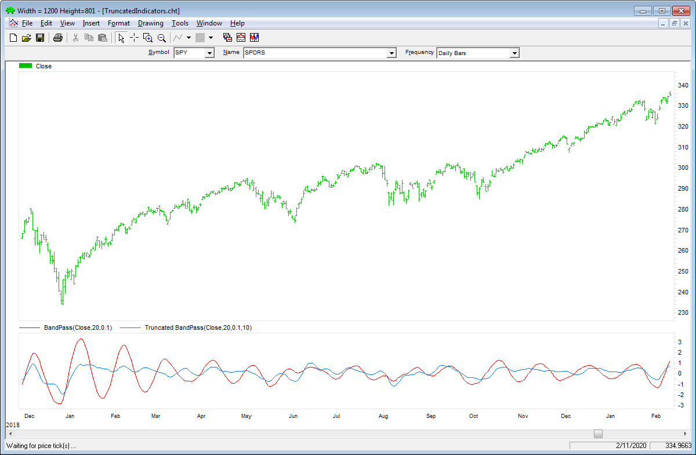

**FIGURE 8: NEUROSHELL TRADER.** This NeuroShell Trader chart shows the standard bandpass and truncated bandpass filters.

—Marge Sherald, Ward Systems Group, Inc.
301 662-7950, [sales@wardsystems.com](mailto:sales@wardsystems.com)
[www.neuroshell.com](https://www.neuroshell.com/)

---

## The Zorro Project: July 2020

Cumulative indicators, such as the EMA or MACD, are affected not only by previous candles, but by a theoretically infinite history of candles. Although this effect is often assumed to be negligible, John Ehlers demonstrates in his article in this issue that it is not so. Or at least not for a narrow-band bandpass filter.

Bandpass filters are normally used for detecting cycles in price curves. But they do not work well with steep edges in the price curve. Sudden price jumps cause a narrow-band filter to "ring like a bell" and generate artificial cycles that can cause false triggers. As a solution, Ehlers proposes to truncate the candle history of the filter. Limiting the history to 10 bars effectively dampened the filter output and produced a better representation of the cycles in the price curve.

For limiting the history of a cumulative indicator, we're not using Ehlers' code here, but instead we'll write a general "truncate" function that works for any indicator:

```c
var indicator(vars Data,int Period,var Param);

var truncate(function Indicator,vars Data,int Period,var Param)
{
  indicator = Indicator;
  var *Trunc = zalloc(UnstablePeriod*sizeof(var));
  var Ret;
  int i;
  for(i = UnstablePeriod-1; i >= 0; i--) {
    SeriesBuffer = Trunc;
    Ret = indicator(Data+i,Period,Param);
    shift(Trunc,0,UnstablePeriod);
  }
  return Ret;
}
```

This function does basically the same as Ehlers' code for his bandpass filter. It accesses the internal history buffer of the cumulative indicator that's passed as the first argument. The **SeriesBuffer** variable replaces that buffer with an external array that's temporarily allocated on the C heap. **UnstablePeriod** is a global variable already used for limiting the history range of traditional indicators, such as EMA or MACD.

The following code shows how the truncate function is used with our narrow bandpass filter:

```c
function run() 
{
   BarPeriod = 1440;
   StartDate = 20181101;

   assetAdd("SPY","STOOQ:SPY.US"); // load price history from Stooq
   asset("SPY");
   
  UnstablePeriod = 10;
  vars Prices = series(priceClose());
  var PB = BandPass(Prices, 20, 0.1);
  var Trunc = truncate(BandPass, Prices, 20, 0.1);
  plot("Bandpass",BP,NEW|LINE,RED);
  plot("Truncated",Trunc,LINE,BLUE);
}
```

The chart shown in Figure 9 confirms Ehlers' observation that the truncated narrow bandpass (blue line) represents cycles better than the original bandpass (red line). For comparison I've added a medium-wide bandpass filter as it is normally used in trading systems (green line). This filter doesn't "ring" either, truncated or not. So what's the better choice for detecting cycles, a truncated narrow bandpass or a nontruncated wide bandpass?

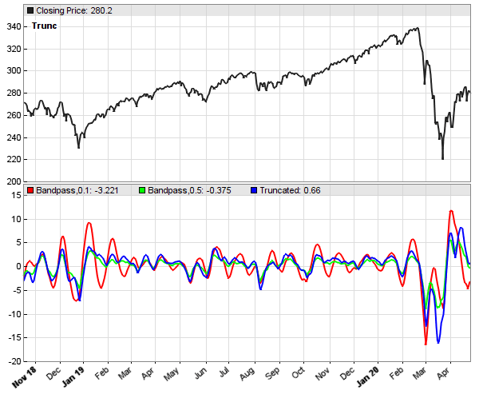

**FIGURE 9: ZORRO PROJECT.** The chart displays a truncated narrow bandpass (blue line). For comparison, the green line is a nontruncated medium-wide bandpass filter.

To find out, we feed the three bandpass variants with a sine chirp and compare their responses. The resulting plots are shown in Figure 10.

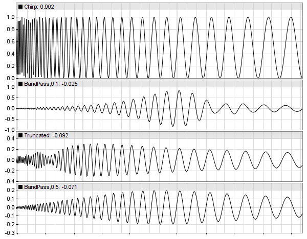

**FIGURE 10: ZORRO PROJECT.** Shown for comparison are sine chirp responses from three bandpass variants (the original narrow bandpass, the truncated narrow bandpass, and the wide bandpass).

The top panel is the chirp, a sine wave with a period rising from 5 to 60 cycles. The panels below that show the chirp responses of the original narrow bandpass, the truncated narrow bandpass, and the wide bandpass. We can see that the truncated bandpass got a wider bandwidth, artifacts at low cycles, and a shifted center frequency. A nontruncated filter with an already wider bandwidth seems here the better solution.

The advantage of truncating is that the indicator output is clearly defined, regardless of the lookback period of the trading system. A disadvantage is speed—truncating makes indicators much slower because they run in a loop. Not very relevant for normal trading systems, but relevant for HFT (high-frequency trading) systems.

The truncate function and the test scripts can be downloaded from the 2020 script repository on [https://financial-hacker.com](https://financial-hacker.com/). The Zorro platform can be downloaded from [zorro-project.com](https://zorro-project.com/). Zorro version 2.27 or above is needed.

—Petra Volkova
The Zorro Project by oP group GmbH
[www.zorro-project.com](https://zorro-project.com/)

---

## TradersStudio: July 2020

The importable TradersStudio files based on John Ehlers' article in this issue, "Truncated Indicators," can be obtained on request via email to [info@TradersEdgeSystems.com](mailto:info@TradersEdgeSystems.com). The code is also available below.

```basic
'TRUNCATED INDICATORS
'Author: John F. Ehlers, TASC July 2020
'Coded by Richard Denning, 5/17/2020
'www.TradersEdgeSystems.com

'FUNCTION THAT CALCULATES BP:
Function Ehlers_BP(Period, Bandwidth, Length)
'LENGTH must be less than 98 due to array size
    Dim L1 As BarArray
    Dim G1 As BarArray
    Dim S1 As BarArray
    Dim count
    Dim BP As BarArray
    'Dim BPT As BarArray
    Dim Trunc As Array

    If BarNumber=FirstBar Then
        'Period = 20
        'Bandwidth = .1
        'Length = 10
        L1 = 0
        G1 = 0
        S1 = 0
        count = 0
        BP = 0
        'BPT = 0
    End If

    ReDim (Trunc, 101)
    
'Standard Bandpass
    L1 = TStation_Cosine(360 / Period)
    G1 = TStation_Cosine(Bandwidth*360 / Period)
    S1 = 1 / G1 - Sqr(1 / (G1*G1) - 1)
    BP = .5*(1 - S1)*(Close - Close[2]) + L1*(1 + S1)*BP[1] - S1*BP[2]
Ehlers_BP = BP
End Function
'----------------------------------------------------------------------
'FUNCTION THAT CALCULATES BPT:
Function Ehlers_BPT(Period, Bandwidth, Length)  ', byref BP as bararray)
'LENGTH must be less than 98 due to array size
    Dim L1 As BarArray
    Dim G1 As BarArray
    Dim S1 As BarArray
    Dim count
    Dim BP As BarArray
    Dim BPT As BarArray
    Dim Trunc As Array

    If BarNumber=FirstBar Then
        'Period = 20
        'Bandwidth = .1
        'Length = 10
        L1 = 0
        G1 = 0
        S1 = 0
        count = 0
        'BP = 0
        BPT = 0
    End If

    ReDim (Trunc, 101)
   
'Standard Bandpass
    L1 = TStation_Cosine(360 / Period)
    G1 = TStation_Cosine(Bandwidth*360 / Period)
    S1 = 1 / G1 - Sqr(1 / (G1*G1) - 1)
    'See separate function (Ehlers_BP) for BP calculation:
    'BP = .5*(1 - S1)*(Close - Close[2]) + L1*(1 + S1)*BP[1] - S1*BP[2]

'Stack the Trunc Array   
For count=100 To 2 Step -1
    Trunc[count] = Trunc[count-1]
Next

'Truncated Bandpass
Trunc[Length + 2] = 0
Trunc[Length + 1] = 0
For count = Length To 1 Step -1
    Trunc[count] = .5*(1 - S1)*(Close[count - 1] - Close[count + 1]) + L1*(1 + S1)*Trunc[count + 1] - S1*Trunc[count + 2]
Next

'Convert to a variable
BPT = Trunc[1]
Ehlers_BPT = BPT
End Function
'------------------------------------------------------------------------------------------------------------------------
'INDICATOR PLOT THAT PLOTS BP AND BPT:
Sub Ehlers_BPT_IND(Period, Bandwidth, Length)
Dim BP As BarArray
Dim BPT As BarArray
If BarNumber = FirstBar Then BP = 0
BP = EHLERS_BP(Period, Bandwidth, Length)
BPT = EHLERS_BPT(Period, Bandwidth, Length)
plot1(BP)
plot2(BPT)
End Sub
'---------------------------------------------
```

I coded the indicators described by the author. Figure 11 shows the bandpass (BP) and truncated bandpass (BPT) indicators using the default lengths of 20, 0.1, 10 on a chart of Google (GOOGL).

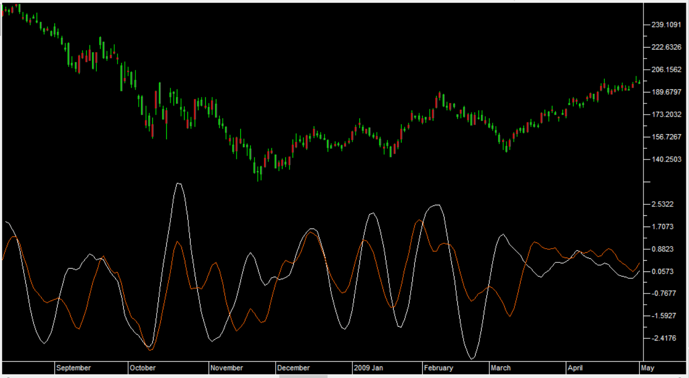

**FIGURE 11: TRADERSSTUDIO.** The bandpass (BP) and truncated bandpass (BPT) indicators are shown on a chart of MSFT.

—Richard Denning
[info@TradersEdgeSystems.com](mailto:info@TradersEdgeSystems.com)
for TradersStudio

---

## Trade Navigator: July 2020

In "Truncated Indicators" in this issue, author John Ehlers presents a truncation technique for cycle indicators and demonstrates the technique using a truncated bandpass filter.

To install these new tools into Trade Navigator, first obtain the program update by clicking on the telephone button (or use the *file* pulldown menu, then select *update data*). Then select *download special file*, and click on the *start* button. You will then be guided through an upgrade of your Trade Navigator. If prompted to "re-import libraries," please do so. This will import the new tools into the software. Once that is completed, you will find a study named "Ehlers BandPass filters."

You can insert these indicators onto your chart by opening the *charting* dropdown menu, selecting the *add to chart* command, then on the *studies* tab, finding the new study, selecting it, then clicking on the *add* button.

A sample chart is shown in Figure 12.

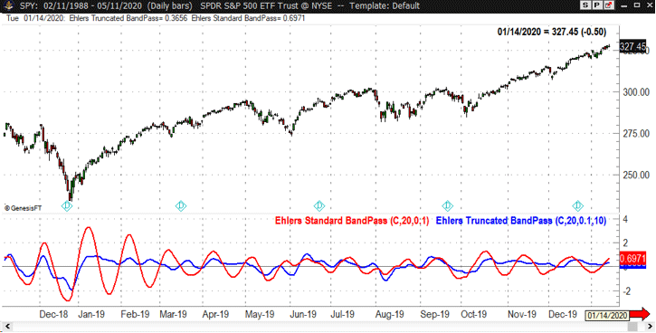

**FIGURE 12: TRADE NAVIGATOR.** This chart displays the Ehlers truncated bandpass filter.

—Genesis Financial Data
Tech support 719 884-0245
[www.TradeNavigator.com](https://www.tradenavigator.com/)

---

## Microsoft Excel: July 2020

In his article in this issue, "Truncated Indicators," John Ehlers takes us aside to look at the impact of sharp price movements on two fundamentally different types of filters: finite impulse response, and infinite impulse response filters. Given recent market conditions, this is a very well timed subject.

In this article, Ehlers suggests "truncation" as an approach to the way the trader calculates filters. He explains why truncation is not appropriate for finite impulse response filters but why truncation can be beneficial to infinite impulse response filters. He then explains how to apply truncation to infinite impulse response filters using his bandpass filter as an example.

Figure 13 replicates the figure from his article using Excel.

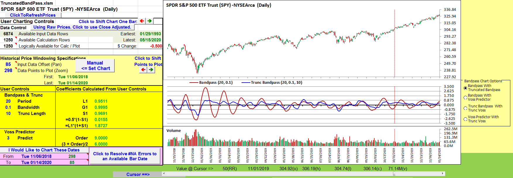

**FIGURE 13: EXCEL.** Bandpass and truncated bandpass filters.

Next, it seemed appropriate to take a look at this concept within a filter or indicator that uses the normal bandpass filter as a starting point.

A quick dive into my Traders' Tips spreadsheet archive brought me to an August 2019 S&C article by John Ehlers titled "A Peek Into The Future." That article introduced the Voss predictive filter, where the first step in the Voss computation is the bandpass filter.

Three columns of cell formulas make up the Voss filter and I already have the bandpass column. So it is a simple exercise to port the Voss filter forward to the current spreadsheet to demonstrate the result of bandpass truncation in a more complex environment.

Figure 14 replicates the chart from Ehlers' August 2019 article. Figure 15 is the same chart using the truncated bandpass filter as the first stage of Voss calculations. Figure 16 puts the two Voss calculations side by side.

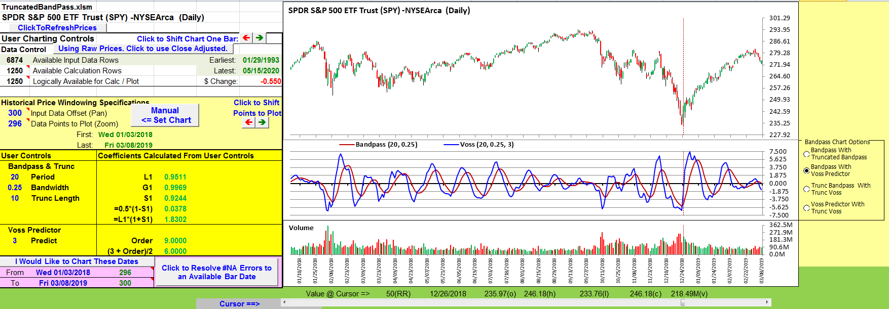

**FIGURE 14: EXCEL.** Voss predictive filter. Note: The Voss article used a wider bandwidth setting of 0.25.

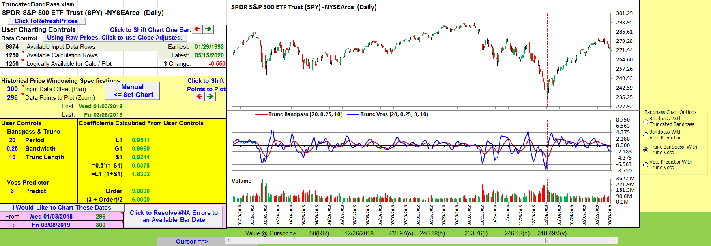

**FIGURE 15: EXCEL.** Voss filter calculated using the truncated bandpass filter.

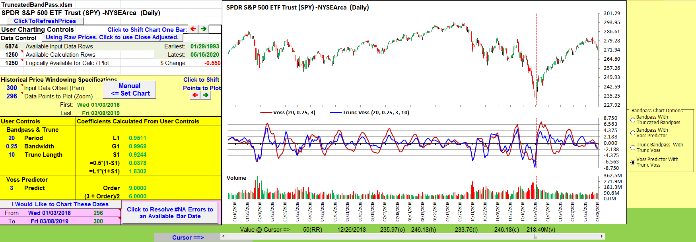

**FIGURE 16: EXCEL.** Voss filter and truncated Voss filter.

To download this spreadsheet: [code/TruncatedBandPass.xlsm](code/TruncatedBandPass.xlsm)

—Ron McAllister
Excel and VBA programmer
[rpmac_xltt@sprynet.com](mailto:rpmac_xltt@sprynet.com)

---

## BibTeX

```bibtex
@misc{traders_tips_2020_07,
  author       = {{Technical Analysis of STOCKS \& COMMODITIES}},
  title        = {Traders' Tips: Truncated Indicators},
  howpublished = {online},
  month        = jul,
  year         = {2020},
  url          = {https://www.traders.com/Documentation/FEEDbk_docs/2020/07/TradersTips.html}
}
```
