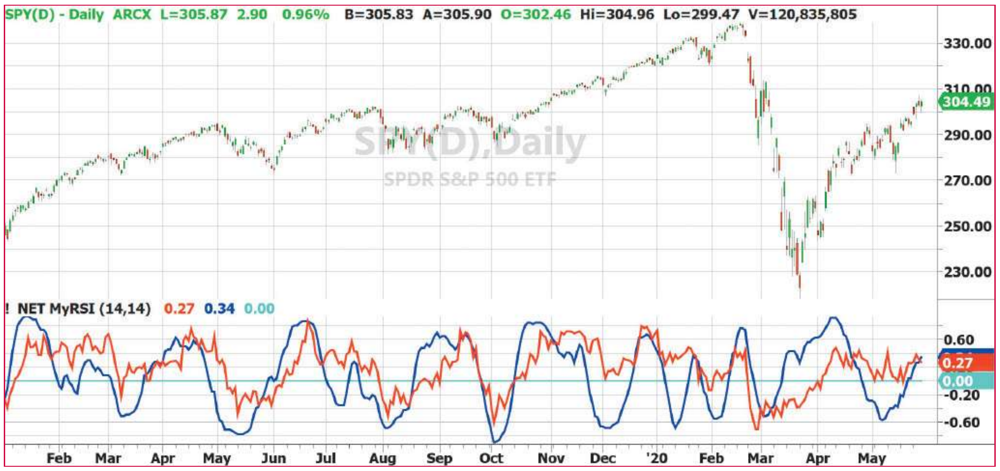

# Noise Elimination Technology

*Clarify Your Indicators Using Kendall Correlation*

- **Author:** John F. Ehlers
- **Publication:** Technical Analysis of STOCKS & COMMODITIES, Volume 38, December 2020, pp. 16--18
- **Article URL:** [Article PDF](https://technical.traders.com/archive/article.asp?file=\V38\C12\154EHLE.pdf)
- **Traders' Tips URL:** [Traders' Tips, December 2020](https://www.traders.com/Documentation/FEEDbk_docs/2020/12/TradersTips.html)

---

*Reduce indicator noise and clarify the direction of your indicators using Kendall rank correlation, which measures the strength of dependence between two sets of variables. Here's how you can use it.*

The purpose of technical indicators is to provide an insight into the inefficiencies in the market to make better-informed trading decisions. The problem with most indicators is they use only a short amount of data and are, therefore, noisy themselves. Noise can be removed by smoothing filters, but smoothing filters can cause indicator lag and delayed decisions. These delays can be costly.

I will show you how to clarify your indicators without filtering. This is accomplished using the nonlinearity of a rank-ordered Kendall correlation.

## Kendall Correlation

In general, *Kendall correlation* compares the ranked order of two sets of random variables. Pairs of ranked variables can be either concordant or discordant. I'll leave the details of the Kendall correlation description to the statistics tutorials or Wikipedia. The correlation equation is:

$$\tau = \frac{2}{n(n-1)} \sum_{i<j} \text{sgn}(x_i - x_j) \, \text{sgn}(y_i - y_j)$$

When used as noise elimination technology, the $y$ variable is a straight line with a positive slope and the $x$ variable is the indicator output. The Kendall correlation in this configuration basically strips out the noise components not going in the main direction of the indicator in a nonlinear fashion.

## Noise Elimination Technology Example

The best way to describe NET is with an example. I will start with MyRSI, a version of the RSI indicator that I derived in my article in the May 2018 issue of STOCKS & COMMODITIES. I prefer this version because it provides for the RSI to swing between -1 and +1.

This formulation is easier to use when dealing with market cycles. The computation accrues *closes up* (CU) and *closes down* (CD). The MyRSI indicator is simply the ratio of their difference divided by their sum. This is a relatively noisy indicator.

In the sidebar "EasyLanguage code for noise elimination technology," I provide coding in EasyLanguage for implementing NET using the MyRSI indicator for the example. The second block of code given in the sidebar is the noise elimination technology, and can be applied to any other indicator of your choice with the minor renaming of the indicator assigned to the X[] array.

The input length parameters for the indicator and for NET do not necessarily have the same value. For this example, the MyRSI indicator is assigned to the X[] array. A line with a positive slope is assigned to the Y[] array. Y[] has a positive slope because we are counting backwards from the current bar. The numerator of the Kendall correlation is computed over both indexes of the summation. The computation is simplified from the general equation because $\text{sgn}(y_i - y_j)$ is always negative since Y[] is a straight line. The denominator is a simple calculation, and NET is the ratio of the numerator to the denominator.

## Visual Clarity

The effectiveness of the nonlinear noise elimination technology is demonstrated in Figure 1. The candlestick chart is over a year's worth of daily data on the SPDR S&P 500 ETF (SPY). I have used the standard 14-day length to compute MyRSI, and the same length for NET. The red indicator line is MyRSI, and the blue indicator line is the NET output. Clearly, the goal of reducing the indicator noise without introducing lag has been obtained.


**FIGURE 1: NOISE ELIMINATION TECHNOLOGY (NET).** This chart of SPY covers over a year of daily data. The red indicator line is MyRSI and the blue indicator line is the NET output. You can see how NET reduces indicator noise without introducing lag.

NET does not necessarily replace smoothing filters, but it can work together with them to provide the best visual presentation. I hope that applying NET to your favorite indicators will help improve the clarity of your trading.

## About The Author

*John Ehlers, a Contributing Editor to STOCKS & COMMODITIES, is a pioneer in the use of cycles and DSP (digital signal processing) technical analysis. He is president of MESA Software. He can be reached through his website at MESAsoftware.com.*

*The code given in this article is available in the Article Code section of our website, Traders.com.*

*See our Traders' Tips section beginning on page 48 for implementation of John Ehlers' technique in various technical analysis programs. Accompanying program code can be found in the Traders' Tips section at Traders.com.*

## EasyLanguage Code For Noise Elimination Technology

```easylanguage
{
    MyRSI with Noise Elimination Technology
    (C) 2005-2020 John F. Ehlers
}

Inputs:
    RSILength(14),
    NETLength(14);

Vars:
    CU(0), CD(0), count(0), MyRSI(0);

//Accumulate "Closes Up" and "Closes Down"
CU = 0;
CD = 0;
For count = 0 to RSILength -1 Begin
    If Close[count] - Close[count + 1] > 0 Then CU = CU + Close[count] -
Close[count + 1];
    If Close[count] - Close[count + 1] < 0 Then CD = CD + Close[count + 1] -
Close[count];
End;
If CU + CD <> 0 Then MyRSI = (CU - CD) / (CU + CD);

//Noise Elimination Technology (NET)
Vars: Num(0), Denom(0), K(0), NET(0);
Arrays: X[100](0), Y[100](0);

For count = 1 to NETLength Begin
    X[count] = MyRSI[count - 1];
    Y[count] = -count;
End;

Num = 0;
For count = 2 to NETLength Begin
    For K = 1 to count - 1 Begin
        Num = Num - Sign(X[count] - X[K]);
    End;
End;
Denom = .5*NETLength*(NETLength - 1);
NET = Num / Denom;

//>>>>>>>>>>>>>> Plots >>>>>>>>>>>>>>>>>>>>
Plot1(MyRSI);
Plot4(0);
Plot2(NET);
```

## Further Reading

- Ehlers, John F. [2013]. *Cycle Analytics For Traders*, John Wiley & Sons.
- ——— [2018]. "RocketRSI—A Solid Propellant For Your Rocket Science Trading," *Technical Analysis of* STOCKS & COMMODITIES, Volume 36: May.

‡TradeStation
‡*See Editorial Resource Index*

---

## BibTeX

```bibtex
@article{ehlers_noise_elimination_technology_2020,
  author    = {John F. Ehlers},
  title     = {Noise Elimination Technology: Clarify Your Indicators Using Kendall Correlation},
  journal   = {Technical Analysis of STOCKS \& COMMODITIES},
  volume    = {38},
  number    = {12},
  pages     = {16--18},
  year      = {2020},
  month     = dec,
  url       = {https://technical.traders.com/archive/article.asp?file=\V38\C12\154EHLE.pdf}
}

@misc{traders_tips_2020_12,
  author       = {{Technical Analysis of STOCKS \& COMMODITIES}},
  title        = {Traders' Tips: Noise Elimination Technology},
  howpublished = {online},
  year         = {2020},
  month        = dec,
  url          = {https://www.traders.com/Documentation/FEEDbk_docs/2020/12/TradersTips.html}
}
```
