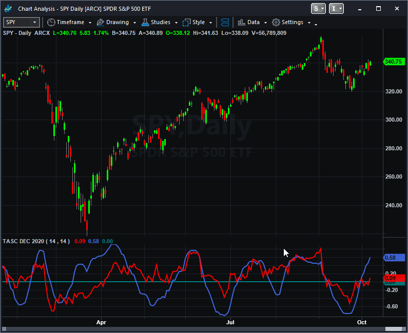
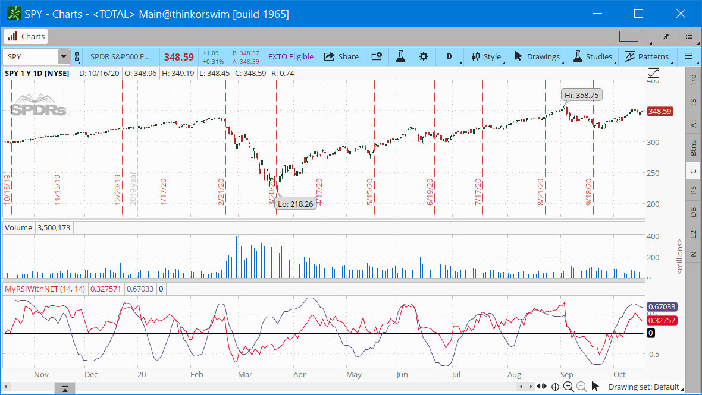
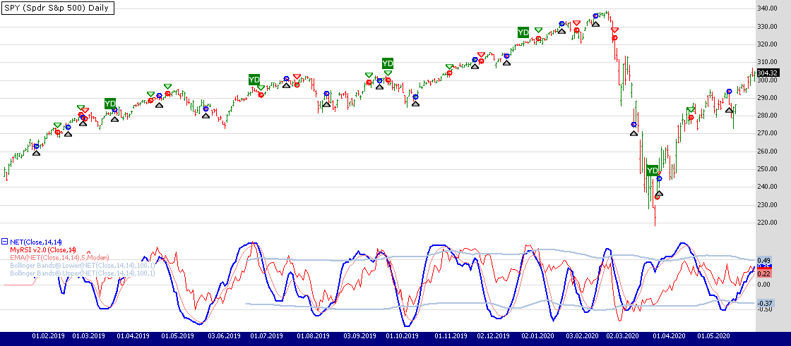
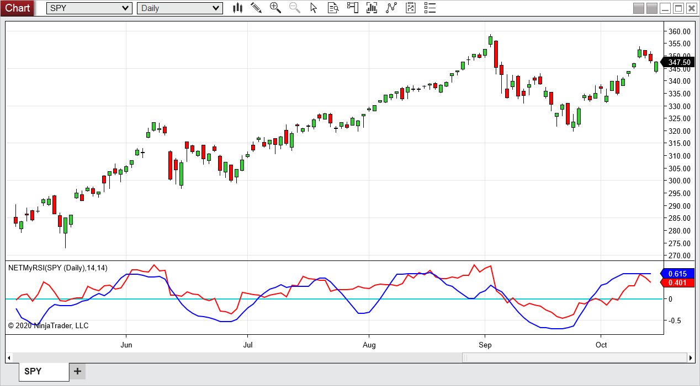
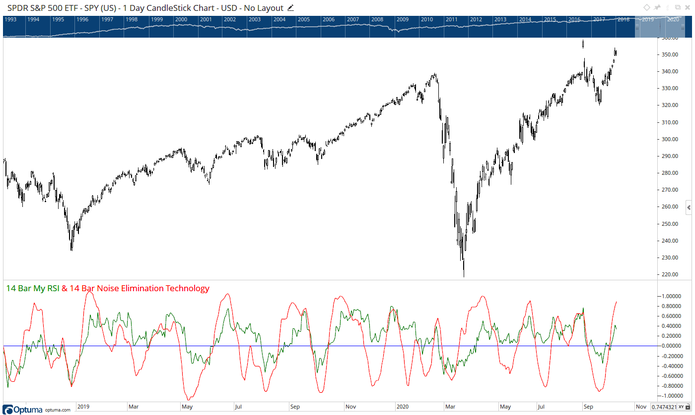
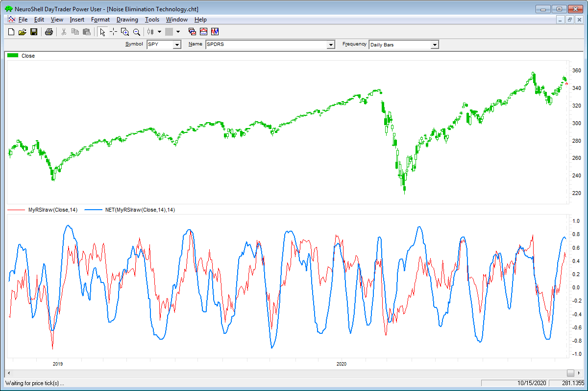
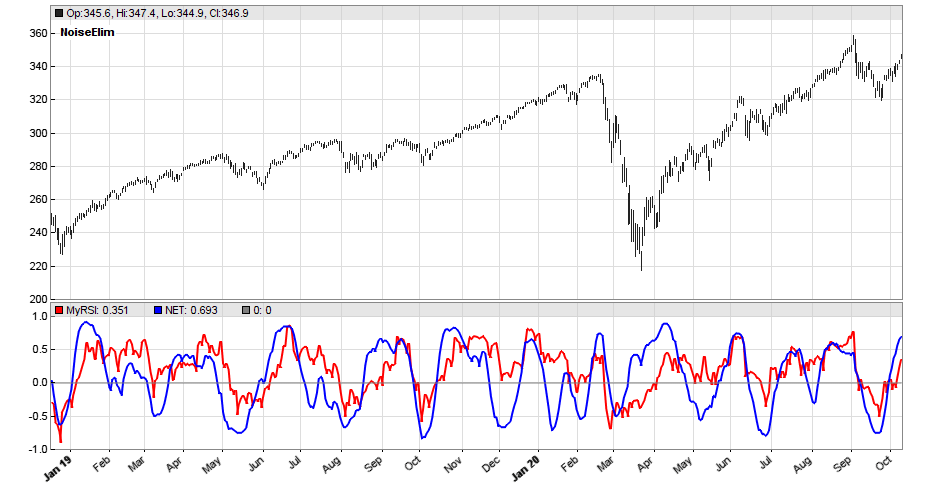
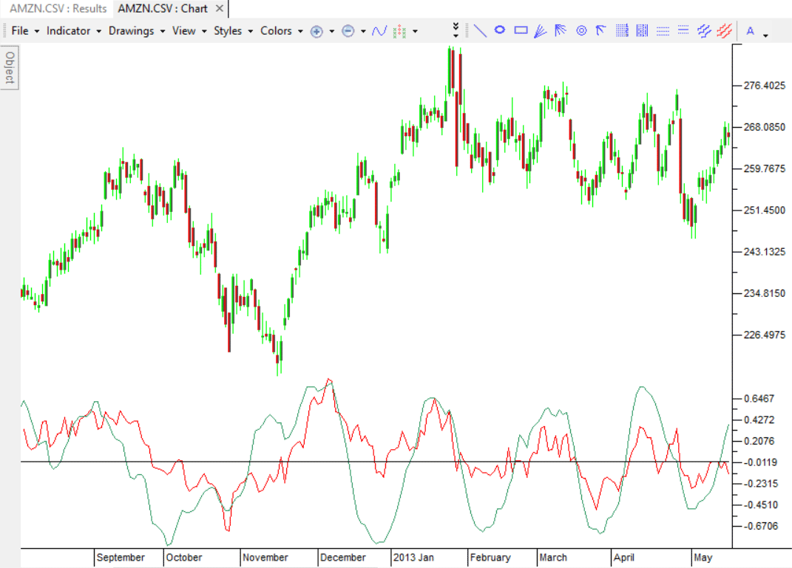
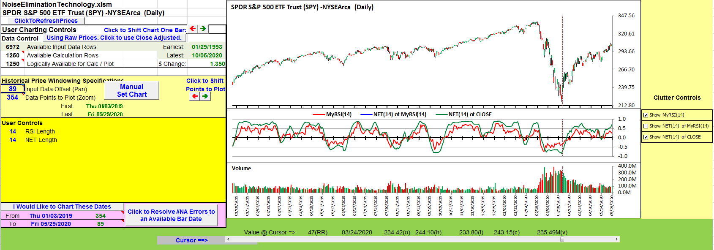
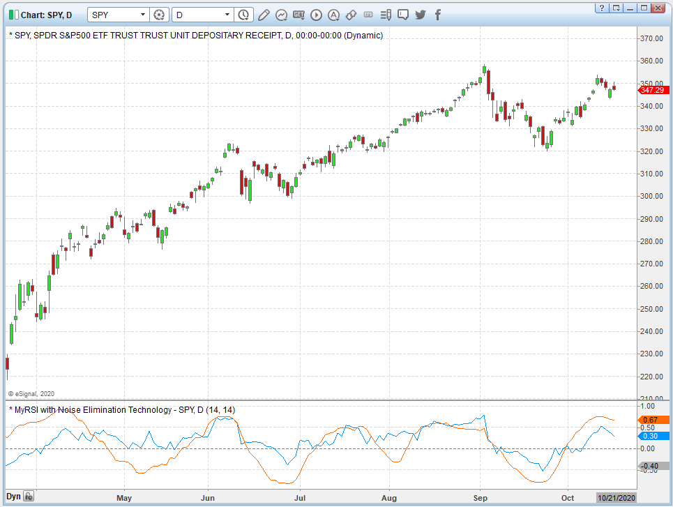

# Traders' Tips: December 2020

- **Article:** Noise Elimination Technology by John F. Ehlers
- **Traders' Tips URL:** [Traders' Tips, December 2020](https://www.traders.com/Documentation/FEEDbk_docs/2020/12/TradersTips.html)

---

For this month's Traders' Tips, the focus is John F. Ehlers' article in this issue, "Noise Elimination Technology." Here, we present the December 2020 Traders' Tips code with possible implementations in various software.

**You can right-click on any chart to open it in a new tab or window and view it at its originally supplied size, often much larger than the version printed in the magazine.**

The Traders' Tips section is provided to help the reader implement a selected technique from an article in this issue or another recent issue. The entries here are contributed by software developers or programmers for software that is capable of customization.

---

## TradeStation: December 2020

In his article in this issue, "Noise Elimination Technology," author John Ehlers introduces using a Kendall correlation to reduce indicator noise and provide better clarification of the indicator direction. This approach attempts to reduce noise without using smoothing filters, which tend to introduce indicator lag and therefore, delayed decisions. With this article, Ehlers builds on his "MyRSI" indicator, which he introduced in his May 2018 article in S&C, by adding some EasyLanguage code for the noise elimination technology. The indicator plots the MyRSI value as well as the value after applying NET to MyRSI.

Here, we have provided the TradeStation EasyLanguage code for the indicator based on the author's work.

```easylanguage
// MyRSI with Noise Elimination Technology
// John F. Ehlers
// TASC DEC 2020

inputs:
    RSILength( 14 ),
    NETLength( 14 );
    
variables:
    CU( 0 ), 
    CD( 0 ), 
    count( 0 ), 
    MyRSI( 0 ),
    Num( 0 ), 
    Denom( 0 ), 
    K( 0 ), 
    NET( 0 );

arrays: 
    X[100]( 0 ), 
    Y[100]( 0 );

// accumulate "Closes Up" and "Closes Down"
CU = 0;
CD = 0;

for count = 0 to RSILength -1 
begin
    if Close[count] - Close[count + 1] > 0 then 
        CU = CU + Close[count] - Close[count + 1];
    
    if Close[count] - Close[count + 1] < 0 then 
        CD = CD + Close[count + 1] - Close[count];
end;

if CU + CD <> 0 then 
    MyRSI = ( CU - CD ) / ( CU + CD );

// Noise Elimination Technology (NET)
for count = 1 to NETLength 
begin
    X[count] = MyRSI[count - 1];
    Y[count] = -count;
end;

Num = 0;

for count = 2 to NETLength 
begin
    for K = 1 to count - 1 
    begin
        Num = Num - Sign( X[count] - X[K] );
    end;
end;

Denom = 0.5 * NETLength * ( NETLength - 1 );
NET = Num / Denom;

// Plots 
Plot1( MyRSI, "MyRSI" );
Plot2( NET, "NET" );
Plot3( 0, "ZeroLine" );
```

External file: [NET.els](NET.els)

To download the EasyLanguage code for TradeStation 10, please visit our TradeStation and EasyLanguage support forum. The files for this article can be found here: https://community.tradestation.com/Discussions/Topic.aspx?Topic_ID=168100.

A sample chart is shown in Figure 1.


**FIGURE 1: TRADESTATION.** A TradeStation daily chart of SPY is shown with the author's indicator applied.

*This article is for informational purposes. No type of trading or investment recommendation, advice, or strategy is being made, given, or in any manner provided by TradeStation Securities or its affiliates.*

--Chris Imhof, TradeStation Securities, Inc., [www.TradeStation.com](https://www.tradestation.com/)

---

## thinkorswim: December 2020

We have put together a study based on the article in this issue by John Ehlers, "Noise Elimination Technology: Clarify Your Indicators Using Kendall Correlation." We built the study referenced by using our proprietary scripting language, thinkscript. To ease the loading process, simply click on https://tos.mx/JiH2IyP or enter it into the address into *setup > open shared item* from within thinkorswim then choose view thinkScript study and name it "MyRSIwithNET." You can then add the study to your charts from the *edit studies* menu from within the charts tab.

Figure 2 shows the study added as a lower subgraph to a one-year daily chart of SPY. Please see John Ehlers' article for more information on how to utilize this study.


**FIGURE 2: THINKORSWIM.** The referenced study is displayed as a subgraph on a one-year daily chart of SPY.

--thinkorswim, A division of TD Ameritrade, Inc., [www.thinkorswim.com](https://www.thinkorswim.com/)

---

## Wealth-Lab.com: December 2020

The "noise elimination technology" that John Ehlers introduces in his article in this issue calculates Kendall tau rank correlation between a straight line with positive slope and an oscillator of choice---for example, the MyRSI, which Ehlers described in his May 2018 article in this magazine.

Despite establishing the thresholds for trading with the NET oscillator (as well as the simplified MyRSI) is outside the scope of Ehlers' article, it's not a problem. We're free to apply various approaches. For instance, Bollinger Bands with a long period (such as 200 bars) can be used to set the thresholds dynamically. You can see its application to a chart on Figure 3.


**FIGURE 3: WEALTH-LAB.** This shows some sample entries on a daily chart of SPY. Data provided by Yahoo! Finance.

For demonstration purposes, we include a trading system that puts to use another approach: The NET oscillator is smoothed with a 5-period EMA to arrive at a signal line. The system buys when the oscillator is leaving an oversold condition or sells when it is no longer overbought. Of course, more robust and flexible rules are desired in a real-world application.

**Strategy rules:**

- Buy tomorrow at open when the NET oscillator crosses above its signal line
- Sell tomorrow at open when the NET oscillator crosses below its signal line.

We've added the noise elimination technology (NET) oscillator and Kendall correlation indicator to our TASCIndicators library and updated it with a simplified MyRSI. To execute the trading system, install (or update) the library from the *Extensions* section of our website if not already done so and restart Wealth-Lab. Then either copy/paste the included strategy's C# code or simply let Wealth-Lab do the job. From the *open strategy* dialog, click *download* to get this strategy as well as many others contributed by the Wealth-Lab community.

```csharp
using System;
using System.Collections.Generic;
using System.Text;
using System.Drawing;
using WealthLab;
using WealthLab.Indicators;
using TASCIndicators;

namespace WealthLab.Strategies
{
        public class TASC2020_12 : WealthScript
{
               protected override void Execute()
               {
                       var ds = Close;
                var period = 14;

                        var myrsi2 = new MyRSI(ds,0,period,
                             string.Format("MyRSI v2.0 ({0},{1})",ds.Description,period),true);
                      var net = NET.Series(ds, period, period);
                       var signalLine = EMAModern.Series(net, 5);
                      signalLine.Description = string.Format("Signal line of {0}", net.Description);
                  var bbl = BBandLower.Series(net, 100, 1.0);
                     var bbu = BBandUpper.Series(net, 100, 1.0);
                     
                        for(int bar = GetTradingLoopStartBar( period ); bar < Bars.Count; bar++)
                        {
                               if (IsLastPositionActive)
                               {
                                       if (CrossUnder(bar, net, signalLine))
                                           SellAtMarket( bar + 1, LastPosition );
                          }
                               else
                            {
                                       if(CrossOver(bar,net,signalLine))
                                               BuyAtMarket( bar + 1 );
                        }
                       }

                       var ls = LineStyle.Solid; HideVolume();
                ChartPane paneNET = CreatePane( 40,false,true );
                        PlotSeries( paneNET,net,Color.Blue,ls,2);
                       PlotSeries( paneNET,myrsi2,Color.Red,ls,1);
                     PlotSeries( paneNET,signalLine,Color.LightCoral,ls,1);
                  PlotSeriesFillBand( paneNET, bbl, bbu,
                          Color.FromArgb(255, 176, 196, 222), Color.Transparent, ls, 2);
          }
       }
}
```

External file: [NET.cs](NET.cs)

--Gene Geren (Eugene), Wealth-Lab team, [www.wealth-lab.com](https://www.wealth-lab.com/)

---

## NinjaTrader: December 2020

The NETMyRSI indicator, as discussed in John Ehlers' article in this issue, "Clarify Your Indicators Using Kendall Correlation: Noise Elimination Technology," is available for download at the following links for NinjaTrader 8 and for NinjaTrader 7:

- **NinjaTrader 8:** [ninjatrader.com/SC/December2020SCNT8.zip](https://ninjatrader.com/SC/December2020SCNT8.zip)
- **NinjaTrader 7:** [ninjatrader.com/SC/December2020SCNT7.zip](https://ninjatrader.com/SC/December2020SCNT7.zip)

Once the file is downloaded, you can import the indicator into NinjaTrader 8 from within the control center by selecting Tools > Import > NinjaScript Add-On and then selecting the downloaded file for NinjaTrader 8. To import into NinjaTrader 7, from within the control center window, select the menu File > Utilities > Import NinjaScript and select the downloaded file.

You can review the indicator's source code in NinjaTrader 8 by selecting the menu New > NinjaScript Editor > Indicators from within the control center window and selecting the NETMyRSI file. You can review the indicator's source code in NinjaTrader 7 by selecting the menu Tools > Edit NinjaScript > Indicator from within the control center window and selecting the NETMyRSI file.

A sample chart displaying the indicator is shown in Figure 4.


**FIGURE 4: NINJATRADER.** The NETMyRSI indicator demonstrates how NET can reduce indicator noise using Kendall rank correlation on an SPY daily chart with data from June 2020 to October 2020.

*NinjaScript uses compiled DLLs that run native, not interpreted, which provides you with the highest performance possible.*

Source code: [ninja-trader/NETMyRSI.cs](ninja-trader/NETMyRSI.cs)

--Brandon Haulk, NinjaTrader, LLC, [www.ninjatrader.com](https://www.ninjatrader.com/)

---

## Optuma: December 2020

Optuma already has many of the tools developed by John Ehlers built-in for rapid deployment on charts, scans, and quantitative testing. Users will find both NET (noise elimination technology) and the MyRSI, as presented by Ehlers in his article in this issue, available in the Optuma "Ehlers" module.

Figure 5 is a sample chart of the daily SPY with the NET and a 14-day MyRSI displayed in the subgraph.


**FIGURE 5: OPTUMA.** This sample chart displays NET (noise elimination technology) and a 14-day MyRSI under a daily chart of SPY.

--support@optuma.com

---

## NeuroShell Trader: December 2020

The MyRSI and noise elimination technology (NET) indicators that are described in John Ehlers' article in this issue can be easily implemented in NeuroShell Trader using NeuroShell Trader's ability to call external dynamic linked libraries (DLL). Dynamic linked libraries can be written in C, C++, or Power Basic.

After moving the code given in the article to your preferred compiler and creating a DLL, you can insert the resulting indicator as follows:

1. Select "new indicator" from the *insert* menu.
2. Choose the "external program & library calls" category.
3. Select the appropriate external DLL call indicator.
4. Set up the parameters to match your DLL.
5. Select the *finished* button.


**FIGURE 6: NEUROSHELL TRADER.** This NeuroShell Trader chart demonstrates the MyRSI and NET indicators on a chart of SPY.

NeuroShell Trader users can go to the Stocks & Commodities section of the NeuroShell Trader free technical support website to download a copy of this or any previous Traders' Tips.

--Marge Sherald, Ward Systems Group, Inc., 301 662-7950, sales@wardsystems.com, [www.neuroshell.com](https://www.neuroshell.com/)

---

## The Zorro Project: December 2020

Many indicators produce more or less noisy output, resulting in false or delayed signals. In his article in this issue, John Ehlers proposes a de-noising technology by using the Kendall correlation of the indicator with a rising slope. Compared with a lowpass filter, this method does not delay the signals. As an example, Ehlers applies the noise elimination to his MyRSI indicator that was presented in an earlier article.

The MyRSI indicator sums up positive and negative changes in a data series, and returns their normalized difference. The C version for Zorro follows:

```c
var var MyRSI(vars Data,int Period)
{
  var CU = SumUp(Data,Period+1);
  var CD = -SumDn(Data,Period+1);
  return ifelse(CU+CD != 0,(CU-CD)/(CU+CD),0);
}
```

For eliminating noise, the Kendall correlation removes all components that are not following the main trend of the indicator output. Here is the code for it:

```c
var NET(vars Data,int Period)
{
  int i,k;
  var Num = 0;
  for(i=1; i<Period; i++)
    for(k=0; k<i; k++)
        Num -= sign(Data[i]-Data[k]);
  var Denom = .5*Period*(Period-1);
  return Num/Denom;
}
```

External file: [NET.c](NET.c)

For making the effect of the denoising visible, we are displaying a sample chart of the SPY from 2019 to 2020 (Figure 7). The red line is the original MyRSI, and the blue line the de-noised version.


**FIGURE 7: ZORRO PROJECT.** A chart of the SPY from 2019 to 2020 is shown along with the original MyRSI (red line) and the de-noised version (blue line).

The technology appears to work well in this example for removing the noise. But note that the NET function is not meant as a replacement of a lowpass or smoothing filter; its output is always in the -1 to +1 range, so it can be used for de-noising oscillators, but not, for instance, to generate a smoothed version of the price curve.

The MyRSI and NET functions and a script for generating the chart in Zorro can be downloaded from the 2020 script repository on https://financial-hacker.com. The Zorro platform can be downloaded from https://zorro-project.com.

--Petra Volkova, The Zorro Project by oP group Germany, [www.zorro-project.com](https://zorro-project.com/)

---

## TradersStudio: December 2020

The importable TradersStudio files based on John Ehlers' article in this issue, "Noise Elimination Technology," can be obtained on request via email to info@TradersEdgeSystems.com. The code is also available here:

```basic
'Noise Elimination Technology
'Author: John F. Ehlers, TASC Dec 2020
'Coded by: Richard Denning, 10/16/20

Function Ehlers_RSI(RSIlength)
    Dim CU As BarArray
    Dim CD As BarArray
    Dim count As BarArray
    Dim MyRSI As BarArray

    CU = 0
    CD = 0
    For count = 0 To RSIlength -1
        If Close[count] - Close[count + 1] > 0 Then
            CU = CU + Close[count] - Close[count + 1]
        End If
        If Close[count] - Close[count + 1] < 0 Then
            CD = CD + Close[count + 1] - Close[count]
        End If
    Next
    If CU + CD <> 0 Then
        MyRSI = (CU - CD) / (CU + CD)
    End If
Ehlers_RSI = MyRSI
End Function
'------------------------------------------------------
Function Ehlers_NET(NETlength,myRSI As BarArray)
    Dim count
    Dim Num As BarArray
    Dim Denom As BarArray
    Dim K As BarArray
    Dim NET As BarArray
    Dim X As Array
    Dim Y As Array
'NETLength = 14
    ReDim (X, 101)
    ReDim (Y, 101)
    X = GValue501
    Y = GValue502
        For count = 1 To NETlength
            X[count] = myRSI[count - 1]
            Y[count] = -count
        Next
        Num = 0
        Dim temp As BarArray
        For count = 2 To NETlength
            For K = 1 To count - 1
                temp = Sign(X[count] - X[K])
                Num = Num - temp
            Next
        Next
        Denom = 0.5*NETlength*(NETlength - 1)
        If Denom<>0 Then NET = Num / Denom
    GValue501 = X
    GValue502 = Y
  Ehlers_NET = NET
End Function
'-------------------------------------------------------
Sub Ehlers_NET_IND(NETlength,RSIlength)
Dim myRSI As BarArray
Dim NET As BarArray
myRSI = Ehlers_RSI(RSIlength)
NET = Ehlers_NET(NETlength,myRSI)
plot1(myRSI)
plot2(NET)
plot3(0)
End Sub
'-------------------------------------------------------
```

External file: [NET.trs](NET.trs)

I coded the indicators described by the author. Figure 8 shows the myRSI and NET indicators using the default lengths of 14 and 14 on an example chart of Amazon (AMZN).


**FIGURE 8: TRADERSSTUDIO.** John Ehlers' myRSI indicator (red) and NET indicator (green) are shown on a sample chart of AMZN.

--Richard Denning, info@TradersEdgeSystems.com, for TradersStudio

---

## Microsoft Excel: December 2020

In his article in this issue, John Ehlers brings us yet another tool from his large toolkit of noise-filtering techniques.

Dubbed "noise elimination technology (NET)" the function is a slightly modified version of the Kendall correlation. As used here, we are using the unique Kendall computation to assess the correlation of directional movement of the input series relative to a line with a positive slope.

In his article in this issue, as an example implementation Ehlers uses his relatively noisy MyRSI computation in order to provide a series to smooth out using his NET function, as seen in Figure 9.


**FIGURE 9: EXCEL.** Here is an approximation of Figure 1 from John Ehlers' article in this issue based on an implementation in Excel.

The NET computations are straightforward, so I had some time on my hands to try out NET on a couple of other indicators and data series. One of the more interesting results came when I tried out NET on the close price. Figure 10 demonstrates an interesting similarity to the raw MyRSI.


**FIGURE 10: EXCEL.** Here, the MyRSI(14) is plotted with the NET(14) indicator using closing prices.

**To download this spreadsheet:** The spreadsheet file for this Traders' Tip can be downloaded from the Traders' Tips page. See also: [code/NoiseEliminationTechnology.xlsm](code/NoiseEliminationTechnology.xlsm)

--Ron McAllister, Excel and VBA programmer, rpmac_xltt@sprynet.com

---

## eSignal: December 2020

For this month's Traders' Tip, we've provided the MyRSI with Noise Elimination Technology.efs study based on the article by John Ehlers, "Noise Elimination Technology." The study demonstrates how to remove noise from an indicator without introducing lag.

The studies contain formula parameters which may be configured through the Edit Chart window (right-click on the chart and select "Edit Chart"). A sample chart is shown in Figure 11.


**FIGURE 11: eSIGNAL.** Here is an example of the study plotted on a daily chart of SPY.

To discuss this study or download a complete copy of the formula code, please visit the EFS Library Discussion Board forum under the *forums* link from the support menu at [www.esignal.com](https://www.esignal.com/) or visit our EFS KnowledgeBase at https://www.esignal.com/support/kb/efs. The eSignal formula script (EFS) is also available for copying & pasting below.

```javascript
/**********************************
Provided By:  
Copyright 2019 Intercontinental Exchange, Inc. All Rights Reserved. 
eSignal is a service mark and/or a registered service mark of Intercontinental Exchange, Inc. 
in the United States and/or other countries. This sample eSignal Formula Script (EFS) 
is for educational purposes only. 
Intercontinental Exchange, Inc. reserves the right to modify and overwrite this EFS file with each new release. 

Description:        
   Noise Elimination Technology
   by John F. Ehlers
    

Version:            1.00  10/06/2020

Formula Parameters:                     Default:
RSILength                               14
NETLength                               14


Notes:
The related article is copyrighted material. If you are not a subscriber
of Stocks & Commodities, please visit www.traders.com.

**********************************/
var fpArray = new Array();
var bInit = false;

function preMain() {
    setStudyTitle("MyRSI with Noise Elimination Technology");
    setCursorLabelName("MyRSI", 0);
    setCursorLabelName("NET", 1);
    setPriceStudy(false);
    setDefaultBarFgColor(Color.RGB(0x00,0x94,0xFF), 0);
    setDefaultBarFgColor(Color.RGB(0xFE,0x69,0x00), 1);
    setPlotType( PLOTTYPE_LINE , 0 );
    setPlotType( PLOTTYPE_LINE , 1 );
    addBand( 0, PLOTTYPE_DOT, 1, Color.grey); 
    
    
    var x=0;
    fpArray[x] = new FunctionParameter("RSILength", FunctionParameter.NUMBER);
	with(fpArray[x++]){
        setLowerLimit(1);		
        setDefault(14);
    }
    fpArray[x] = new FunctionParameter("NETLength", FunctionParameter.NUMBER);
	with(fpArray[x++]){
        setLowerLimit(1);
        setDefault(14);            
    }
        
}

var bVersion = null;
var CU = null;
var CD = null; 
var count = null; 
var xMyRSI = null; 
var xNET = null; 
var xClose = null;
var Num = null;
var Denom = null;


function main(RSILength, NETLength) {
    if (bVersion == null) bVersion = verify();
    if (bVersion == false) return; 
    
    if ( bInit == false ) { 
        CU = 0;
        CD = 0;
        Num = 0;
        xClose = close();  
        
        xMyRSI = efsInternal("Calc_MyRSI", xClose, RSILength);
        xNET = efsInternal("Calc_NET", xMyRSI, NETLength);
        
        bInit = true; 
    }      

    return [xMyRSI.getValue(0), xNET.getValue(0)]
}

function Calc_NET(xMyRSI, NETLength){
    X = [];
    for (var i = 1; i <= NETLength; i++){
        X[i] = xMyRSI.getValue(-i+1);
    }

    Num = 0;
    for (var i = 2; i <= NETLength; i++){
        for (j = 1; j < i; j++){
            var ind1 = X[i];
            var ind2 = X[j];

            if (ind1 == null || ind2 == null) return 0;
            Num = Num - Math.sign(ind1 - ind2); 
        }
    }
    Denom = 0.5 * NETLength * (NETLength - 1);
    return (Num / Denom);
}


function Calc_MyRSI(xClose, RSILength){
    CU = 0;
    CD = 0;
    for (var i = 0; i < RSILength; i++) {
        var closeDiff = xClose.getValue(-i) - xClose.getValue(-i-1);

        if (closeDiff > 0) {
            CU = CU + closeDiff;
        }
        if (closeDiff < 0) {
            CD = CD + xClose.getValue(-i-1) - xClose.getValue(-i);
        }
        
    }
    if (CU + CD != 0){
        MyRSI = (CU - CD) / (CU + CD)
    }
    else MyRSI = 0;
    
return MyRSI;        
}

function verify(){
    var b = false;
    if (getBuildNumber() < 779){
        
        drawTextAbsolute(5, 35, "This study requires version 10.6 or later.", 
            Color.white, Color.blue, Text.RELATIVETOBOTTOM|Text.RELATIVETOLEFT|Text.BOLD|Text.LEFT,
            null, 13, "error");
        drawTextAbsolute(5, 20, "Click HERE to upgrade.@URL=https://www.esignal.com/download/default.asp", 
            Color.white, Color.blue, Text.RELATIVETOBOTTOM|Text.RELATIVETOLEFT|Text.BOLD|Text.LEFT,
            null, 13, "upgrade");
        return b;
    } 
    else
        b = true;
    
    return b;
}
```

External file: [NET.efs](NET.efs)

--Eric Lippert, eSignal, an Interactive Data company, 800 779-6555, [www.eSignal.com](https://www.esignal.com/)

---

Originally published in the December 2020 issue of *Technical Analysis of* STOCKS & COMMODITIES magazine. All rights reserved. Copyright 2020, Technical Analysis, Inc.

---

## BibTeX

```bibtex
@misc{traders_tips_2020_12,
  author       = {{Technical Analysis of STOCKS \& COMMODITIES}},
  title        = {Traders' Tips: Noise Elimination Technology},
  howpublished = {online},
  year         = {2020},
  month        = dec,
  url          = {https://www.traders.com/Documentation/FEEDbk_docs/2020/12/TradersTips.html}
}
```
