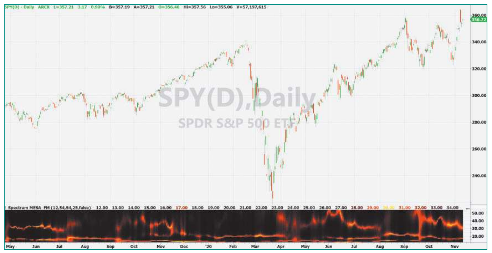
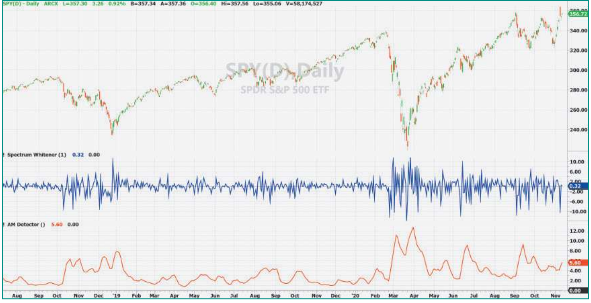
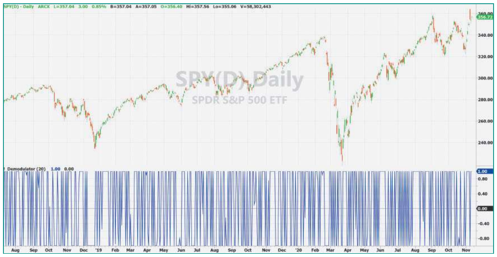
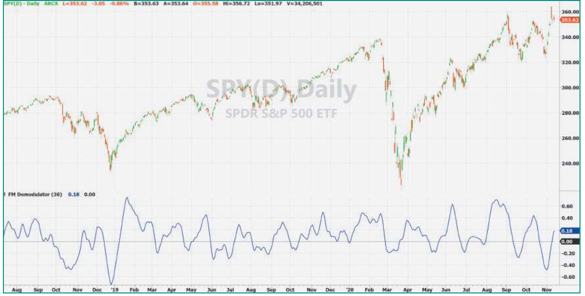

# A Technical Description Of Market Data For Traders

- **Author:** John F. Ehlers
- **Publication:** Technical Analysis of Stocks & Commodities, Volume 39, May 2021, pp. 8–14
- **Article URL:** https://technical.traders.com/archive/article.asp?file=\V39\C05\238EHLE.pdf
- **Traders' Tips URL:** https://www.traders.com/Documentation/FEEDbk_docs/2021/05/TradersTips.html

## Summary

*What is the nature of market data? What wisdoms can be gained from studying it? Here is a brief summary of research into the nature of market data, from someone who has spent decades researching it, testing it, and trading it. Included is a technique to detect and demodulate the AM and FM components of cycles, so you can better ensure your timing signals are accurately accounting for the market data.*

## Introduction

Most traders consider market data to be a continuous function. It is further assumed that smoothing this function with averages or squiggly line indicators will create patterns or conditions that are useful for predicting future market direction. These assumptions are very wrong on many levels.

First of all, market data is a nonstationary random process. Basically, this means that for whatever pattern you are observing, you will never see that exact pattern again. The process can be formulated as the classic "drunkard's walk" problem. The results are partial differential equations called the *diffusion equation* or the *telegrapher's equation*, depending on the selection of the random variable. (For more on this, I offer a cycles tutorial at my website; see "Further reading" at end for the URL.) There is no direct solution to these equations because they are *boundary value* problems, and the boundaries cannot be defined for market data.

Secondly, market data has a pink noise spectrum. Just like light waves, the term *spectrum* means that the data are comprised of cycle components having a wide range of frequencies, or periods. The colors of the spectrum comprise white light. The pink noise spectrum of market data means that the longer cycle periods have a greater amplitude. Without arguing about details, we can use the assumption that market data cycle amplitudes are in direct proportion to their cycle periods as a workable hypothesis. For example, if you look at a chart of daily data, it is not easily discernable from a chart of weekly data if you remove the labels. This being the case, since the horizontal time scale varies 5:1, then it necessarily follows that the vertical amplitude scale must also vary in the ratio 5:1. Therefore, cycle amplitudes statistically increase at the rate of 6 dB per octave.

It must be noted that noise does not necessarily mean chaos. The cycles in market data can very well contain information. For example, pink noise implies memory in the data.

Most of all, since the data is comprised of cycle components, the question is whether these components combine in the form of AM (amplitude modulation) or FM (frequency modulation). The modulation characteristics of market data can be determined by direct measurement.

## Market Data Spectrum

A high-resolution estimate of the spectrum of market data can be made using the MESA (Maximum Entropy Spectral Analysis) program. The MESA display of the spectrum of the SPY (SPDR S&P 500 ETF) over a period of a year and a half (May 2019–November 2020) is shown in Figure 1. The spectrum display is a heatmap that is synchronous with the candlestick chart above it. The period of the spectrum is scaled from a 12-bar cycle period to a 54-cycle period in the vertical dimension. The intensity of the spectral components range from white hot, through red hot, to ice cold in black. A single fixed-period cycle would be depicted as a horizontal yellow line.


**Figure 1: MESA Spectrum, SPY.** A high-resolution estimate of the spectrum of market data is shown for May 2019–November 2020 for SPY. The spectrum display is a heatmap that is synchronous with the candlestick chart above it.

Clearly, market data does not contain a fixed cycle. There is a strong tendency for an approximately monthly 20-bar cycle period to be the dominant cycle. However, there are other significant components, some appearing simultaneously with the monthly cycle. There is also a strong tendency for the measured dominant cycle period to change rapidly from bar to bar, analogous to a "chirp" in the audio range.

Even with all the variations of a nonstationary random process, the dominant cycles are easily identified by observation. Therefore, MESA has identified market data as a narrow band random process. A *narrow band process* is one where the width of a region of the spectral density is small compared with the center period of that region. Such a process can be mathematically modeled in the form:

S(*t*) = A(*t*)\*Sine(wt + Θ(*t*))

In this expression, A(*t*) is a time-variable function amplitude modulating (AM) a carrier waveform. The constant angular frequency of the carrier waveform sine wave is w. Θ(*t*) is a time variable phase term that is phase modulating the constant angular frequency, making the net frequency variable with time. *Phase modulation* is fundamentally the same as *frequency modulation* (FM), since frequency is just the rate-change of phase.

We continue our study of the market data structure by analyzing the AM and FM components of the narrow band nonstationary random process.

## Amplitude Modulation Component Analysis

We start our analysis by taking the one-bar difference of the market data. This is analogous to taking the derivative of a continuous function in the calculus. This action has two major results: It places a zero in the transfer response, and it whitens the pink noise spectrum. The zero is easy to understand because the value of the data is the same for the current bar and the previous bar at zero frequency. Now, consider moving away from zero frequency by a very small amount, *e*. Then the output of the difference can be expressed as:

Output = (1 + *e*) − 1 = *e*

In other words, the output of the difference grows in direct proportion to its distance from zero frequency. Reversing the direction, that means the amplitude falls off at the rate of 6 dB per octave. Since the transfer response of the difference falls off at the rate of 6 dB per octave and since the data intensity of the pink noise spectrum increases at the rate of 6 dB per octave, the net effect of taking the difference whitens the spectrum. That is, the spectrum is now effectively white noise, and we can therefore see the shorter wavelength components more clearly.

Figure 2 shows the signal of the whitened spectrum in the first subgraph. This is the classic picture of an amplitude modulated (AM) waveform. That is, the amplitude swings of both the positive and negative alternations are in proportion to the modulation waveform. In this case, an eyeball correlation allows me to assert that the AM is due to volatility. In fact, we can get a true measure of volatility by performing AM detection of this signal.


**Figure 2: Whitened Spectrum.** The signal of the whitened spectrum is in the first subgraph. It is an amplitude modulated (AM) waveform. By whitening the spectrum so that the spectrum is effectively white noise, you can see the shorter wavelength components more clearly.

AM detection is done by rectifying the carrier and recovering the envelopes of the amplitudes of the resulting peak swings. In code, this is done by taking the absolute value of the waveform and estimating the envelope by the largest amplitude over the last few samples. With reference to the code in the EasyLanguage sidebar "AM Detector," the derivative is the *close−open* because this is basically the same as Close−Close[1], particularly for intraday data. Plus, it has the added benefit of automatically removing gap openings for intraday data. The phase information is stripped from the rectified waveform by using only the highest value over the last four bars. The resulting envelope is lightly smoothed to form the volatility indicator.

The volatility indicator is shown in the lower subgraph in Figure 3. It compares favorably with an indicator constructed from the smoothed values of *high−low*.


**Figure 3: Volatility.** Volatility is recovered from the AM of the nonstationary random process. We can get a true measure of volatility by performing AM detection of this signal.

## Frequency Modulation Component Analysis

Classical FM detection techniques are used to extract the frequency modulating, or phase modulating, components of the narrow band nonstationary random process. In addition to its other functions, the derivative is also a phase detector because it is a *finite impulse response* (FIR) difference filter having a linear phase shift across the entire signal spectrum.

With reference to the EasyLanguage code in the sidebar "FM Demodulator Indicator," amplitude information is stripped from the whitened spectrum signal by running it through a hard limiter. The results of the hard limiter are shown in Figure 4. The final step of creating an FM demodulator indicator is to integrate the amplitude limited waveform in a SuperSmoother filter (for more on this filter, my book *Cycle Analytics For Traders* covers it in detail). Figure 5 shows that the FM demodulator indicator accurately tracks timing of price variations. For example, you can correlate major swings in the price chart with peaks and valleys of the indicator in the subgraph.


**Figure 4: Removing the Volatility Component.** The hard limiter removes all amplitude information from the whitened spectrum.


**Figure 5: FM Demodulator Indicator.** The FM demodulator indicator accurately tracks the timing of price variations. We can correlate major swings in the price chart with peaks and valleys of the indicator in the subgraph.

## Conclusions

Entire books have been written about the pink noise spectral shape of market data. The fact that longer cycle periods have greater amplitude swings is an effect I call *spectral dilation*. But just because it is called "noise," it does not mean that the cyclic components do not carry information. I showed by direct measurement using the MESA spectrum estimator that the data is a nonstationary narrow band random process, and therefore can be accurately modeled with AM and FM components. The AM components represent market volatility. The FM components contain market timing information.

Since many, if not most, technical indicators contain a mishmash of AM and FM components and/or disregard the consequences of spectral dilation, these indicators are distorted or give inaccurate timing signals. A careful review of the indicators you use is recommended.

## EasyLanguage Code

### AM Detector

```easylanguage
{
    AM Detector
    (C) 2020-2021  John F. Ehlers
}

Vars:
    Deriv(0),
    Envel(0),
    Volatil(0);

Deriv = Close - Open;

Envel = Highest(AbsValue(Deriv), 4);

Volatil = Average(Envel, 8);

Plot1(Volatil);
Plot2(0);
```

### FM Demodulator Indicator

```easylanguage
{
    FM Demodulator Indicator
    (C) 2013-2021  John F. Ehlers
}

Inputs:
    Period(30);

Vars:
    Deriv(0), HL(0),
    a1(0), b1(0), c1(0), c2(0), c3(0), SS(0);

//Derivative to establish zero mean (Basically the same as Close -
//Close[1], but removes intraday gap openings)
Deriv = Close - Open;

//Hard limiter to remove AM noise
HL = 10*Deriv;
If HL > 1 Then HL = 1;
If HL < -1 Then HL = -1;

//Integrate with a SuperSmoother
a1 = expvalue(-1.414*3.14159 / Period);
b1 = 2*a1*Cosine(1.414*180 / Period);
c2 = b1;
c3 = -a1*a1;
c1 = 1 - c2 - c3;
SS = c1*(HL + HL[1]) / 2 + c2*SS[1] + c3*SS[2];
If Currentbar < 3 Then SS = Deriv;

Plot1(SS);
Plot2(0);
```

## Further Reading

- Ehlers, John F., "Cycles Tutorial," Mesa Software, http://www.mesasoftware.com/ehlers_cycles_tutorial.htm.
- ——— [2013]. *Cycle Analytics For Traders*, John Wiley & Sons.
- ——— [2016]. "Measuring Market Cycles," *Technical Analysis of Stocks & Commodities*, Volume 34: September.
- ——— [2016]. "Aliasing," *Technical Analysis of Stocks & Commodities*, Volume 34: January.
- ——— [2015]. "Whiter Is Brighter," *Technical Analysis of Stocks & Commodities*, Volume 33: January.
- ——— [2014]. "Predictive And Successful Indicators," *Technical Analysis of Stocks & Commodities*, Volume 32: January.

---

## BibTeX

```bibtex
@article{ehlers2021technical,
  author  = {Ehlers, John F.},
  title   = {A Technical Description Of Market Data For Traders},
  journal = {Technical Analysis of Stocks \& Commodities},
  volume  = {39},
  number  = {5},
  pages   = {8--14},
  year    = {2021},
  month   = may,
  url     = {https://technical.traders.com/archive/article.asp?file=\V39\C05\238EHLE.pdf}
}

@misc{ehlers2021technical_tips,
  author       = {Ehlers, John F.},
  title        = {Traders' Tips: A Technical Description Of Market Data For Traders},
  year         = {2021},
  month        = may,
  howpublished = {Technical Analysis of Stocks \& Commodities},
  url          = {https://www.traders.com/Documentation/FEEDbk_docs/2021/05/TradersTips.html}
}
```
