# Traders' Tips: A Technical Description Of Market Data For Traders

- **Article:** "A Technical Description Of Market Data For Traders" by John F. Ehlers, TASC May 2021
- **Traders' Tips URL:** [Traders' Tips, May 2021](https://www.traders.com/Documentation/FEEDbk_docs/2021/05/TradersTips.html)

---

## TradeStation: May 2021

In his article in this issue, "A Technical Description Of Market Data For Traders," John Ehlers introduces the use of AM (amplitude modulation) and FM (frequency modulation) techniques applied to market data. Shown here is EasyLanguage code for a function that calculates the FM demodulator value, an indicator for the AM detector, and an indicator for the FM demodulator.

A sample chart is shown in Figure 1.

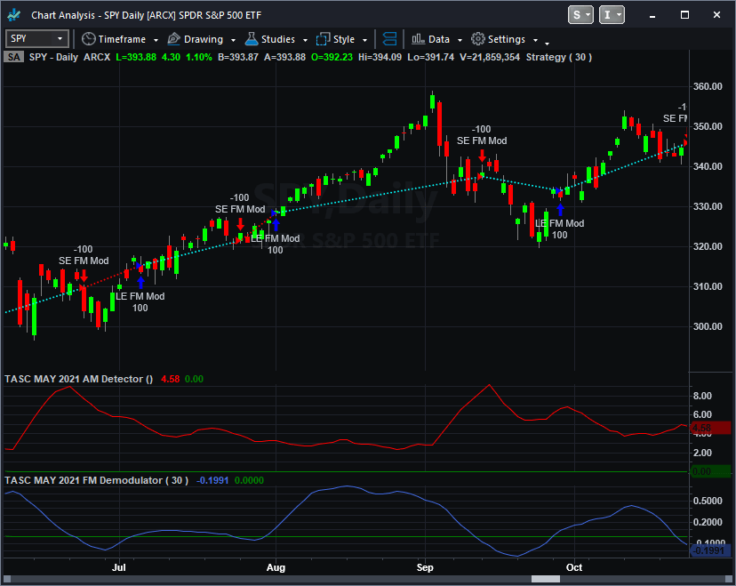
**FIGURE 1: TRADESTATION.** On this TradeStation daily chart of SPY, the indicators are applied in the subgraph, and the strategy is applied to the price chart.

```easylanguage
Function:  _TASC_MAY_2021_FM_Demodulator
// TASC MAY 2021
// A Technical Description Of Market Data For Traders
// John F. Ehlers (C) 2020-2021 
// FM Demodulator

inputs:
    Period( numericsimple );

variables:
    Deriv( 0 ), 
    HL( 0 ),
    a1( 0 ), 
    b1( 0 ), 
    c1( 0 ), 
    c2( 0 ), 
    c3( 0 ), 
    SS( 0 );

{
derivative to establish zero mean (basically the 
same as Close - Close[1], but removes intraday gap 
openings)
}
Deriv = Close - Open;

// hard limiter to remove AM noise
HL = 10 * Deriv;
if HL > 1 then 
    HL = 1;

if HL < -1 then 
    HL = -1;

// integrate with a SuperSmoother
a1 = ExpValue( -1.414 * 3.14159 / Period );
b1 = 2 * a1 * Cosine( 1.414 * 180 / Period );
c2 = b1;
c3 = -a1 * a1;
c1 = 1 - c2 - c3;
SS = c1 * ( HL + HL[1] ) /2 + c2 * SS[1] + c3 * SS[2];

if CurrentBar < 3 then 
    SS = Deriv;

_TASC_MAY_2021_FM_Demodultor = SS;

Indicator:  TASC MAY 2021 FM Demodulator
// TASC MAY 2021
// A Technical Description Of Market Data For Traders
// John F. Ehlers (C) 2020-2021 
// FM Demodulator

inputs:
    Period( 30 );

variables:
    SS( 0 );
    
SS = _TASC_MAY_2021_FM_Demodultor( Period );

Plot1( SS );
Plot2( 0 );

Indicator: TASC MAY 2021 AM Detector
// TASC MAY 2021
// A Technical Description Of Market Data For Traders
// John F. Ehlers (C) 2020-2021 
// AM Detector

variables:
    Deriv( 0 ),
    Envel( 0 ),
    Volatil( 0 );
    
Deriv = Close - Open;
Envel = Highest( AbsValue( Deriv ), 4 );
Volatil = Average( Envel, 8 );

Plot1( Volatil );
Plot2( 0 );


Strategy:  TASC MAY 2021 Strategy
// TASC MAY 2021
// A Technical Description Of Market Data For Traders
// John F. Ehlers (C) 2020-2021 
// FM Demodulator

// sample strategy for illustrative purposes only

[IntrabarOrderGeneration=false]

inputs:
    Period( 30 );

variables:
    SS( 0 );
    
SS = _TASC_MAY_2021_FM_Demodultor( Period );

if SS crosses above 0 then
    Buy ( "LE FM Mod" ) next bar market
else if SS crosses below 0 then
    SellShort ( "SE FM Mod" ) next bar market;
```

External file: [AM-FM.els](AM-FM.els)

---

## thinkorswim: May 2021

We have put together a pair of studies based on the article in this issue by John Ehlers, "A Technical Description Of Market Data For Traders."

Figure 2 shows the pair of studies on a two-year, one-day chart of SPY.

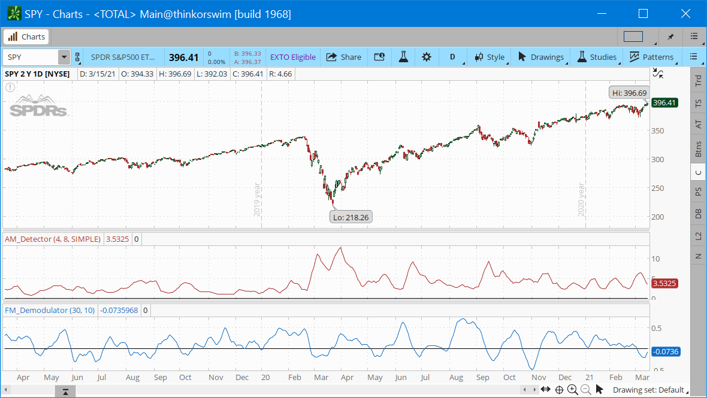
**FIGURE 2: THINKORSWIM.** The pair of studies are shown on a two-year, one-day chart of SPY.

---

## Wealth-Lab.com: May 2021

In "A Technical Description Of Market Data For Traders" in this issue, John Ehlers discusses cycle components of market data and introduces AM and FM techniques.

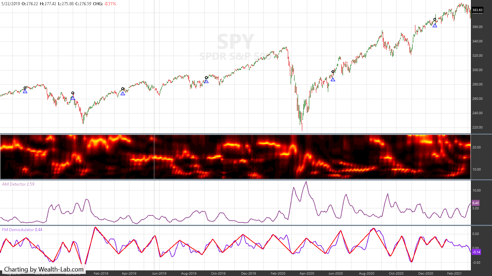
**FIGURE 3: WEALTH-LAB.** In this example Wealth-Lab chart, the new indicator is accompanied by John Ehlers' dominant cycle period indicator.

```csharp
using System;
using WealthLab.Indicators;
using System.Collections;
using System.Drawing;
using WealthLab.Backtest;
using WealthLab.Core;
using WealthLab.TASC;

namespace WealthScript1
{
    public class May2021 : UserStrategyBase
    {
        public May2021() : base()
        {
            AddParameter("Reversal", ParameterTypes.Double, 0.25, 0.25, 1.0, 0.25);
        }

        public override void Initialize(BarHistory bars)
        {
            reversal = Parameters[0].AsDouble;
            fmd = FMDemodulator.Series(bars, 30);
            amd = AMDetector.Series(bars, 4, 8);
            ptc = new PeakTroughCalculator( fmd, reversal, PeakTroughReversalTypes.Point);

            PlotTimeSeries( fmd, "FM Demodulator", "FMD", Color.BlueViolet);
            PlotTimeSeries( amd, "AM Detector", "AMD", Color.Violet);
            RenderPeakTroughs(ptc, Color.Red, "FMD");

            /* Dominant Cycle */
            TimeSeries dc;
            DominantCycle(bars, bars.AveragePriceHL, out dc);
        }

        /* execute the strategy rules here, this is executed once for each bar in the backtest history*/
        public override void Execute(BarHistory bars, int idx)
        {
            if (ptc.TroughState(idx) == 1 && ptc.TroughState(idx - 1) != 1)
            {
                PlaceTrade( bars, TransactionType.Buy, OrderType.Market);
            }
        }

        /* render peaks and troughs in a pane */
        private void RenderPeakTroughs(PeakTroughCalculator ptc, Color color, string paneTag)
        {
            if (ptc.PeakTroughs.Count < 2)
                return;

            for (int n = 1; n < ptc.PeakTroughs.Count; n++)
            {
                int x1 = ptc.PeakTroughs[n - 1].PeakTroughIndex;
                double y1 = ptc.PeakTroughs[n - 1].Value;
                int x2 = ptc.PeakTroughs[n].PeakTroughIndex;
                double y2 = ptc.PeakTroughs[n].Value;
                DrawLine( x1, y1, x2, y2, Color.Red, 2, LineStyles.Solid, paneTag);
            }
        }

        FMDemodulator fmd;
        AMDetector amd;
        PeakTroughCalculator ptc;
        double reversal;
        const double twoPi = 2 * Math.PI;
        const double fourPi = 4 * Math.PI;

        public class ArrayHolder
        {   /* current, old, older */
            internal double I, I2, I3;
            internal double Q, Q2, Q3;
            internal double R, R2, R3;
            internal double Im, Im2, Im3;
            internal double A;
            internal double dB, dB2;
        }

        public void DominantCycle(BarHistory bars, TimeSeries ds, out TimeSeries domCycMdn)
        {
            /* Initialize arrays */
            ArrayHolder[] ah = new ArrayHolder[52];
            for (int n = 12; n < 52; n++)
                ah[n] = new ArrayHolder();

            double domCycle = 0d;
            string s = ds.Description + ")";
            TimeSeries[] DB = new TimeSeries[52];
            TimeSeries domCyc = new TimeSeries(ds.DateTimes, 0); domCyc.Description = "DC(" + s;
            domCycMdn = new TimeSeries(ds.DateTimes, 0); domCycMdn.Description = "DomCyc(" + s;

            /* Create and plot the decibel series - change the colors later */
            for ( int n = 12; n < 52; n++)
            {
                double d = n / 2.0;
                DB[n] = domCyc + d;
                DB[n].Description = "Cycle." + d.ToString();
                PlotTimeSeriesLine( DB[n], "", "dbPane", Color.Black, 4, LineStyles.Solid, true);
            }

            /* Convert decibels to RGB color for display */
            Color[] color = new Color[21];
            for (int n = 0; n <= 10; n++)       /* yellow to red: 0 to 10 dB */
                color[n] = Color.FromArgb(255, (int)(255 - (255 * n / 10)), 0);
            for (int n = 11; n <= 20; n++)      /* red to black: 11 to 20 db */
                color[n] = Color.FromArgb((int)(255 * (20 - n) / 10), 0, 0);

            /* Detrend data by High Pass Filtering with a 40 Period cutoff */
            TimeSeries HP = domCyc;
            double alpha = (1 - Math.Sin(twoPi / 30)) / Math.Cos(twoPi / 30);
            for (int bar = 1; bar < ds.Count; bar++)
                HP[bar] = 0.5 * (1 + alpha) * Momentum.Series(ds, 1)[bar] + alpha * HP[bar - 1];
            FIRSmoother smoothHP = new FIRSmoother(HP);  //FIR.Series(HP, "1,2,3,3,2,1");

            ArrayList fifoList = new ArrayList(51);
            ArrayList fifoPsn = new ArrayList(21);

            for (int bar = 51; bar < ds.Count; bar++)
            {
                double maxAmpl = 0d;
                double delta = -0.015 * bar + 0.5;
                delta = delta < 0.1 ? 0.1 : delta;
                for (int n = 12; n < 52; n++)
                {
                    double beta = Math.Cos(fourPi / n);
                    double g = 1 / Math.Cos(2 * fourPi * delta / n);
                    double a = g - Math.Sqrt(g * g - 1);
                    ah[n].Q = Momentum.Series(smoothHP, 1)[bar] * n / fourPi;
                    ah[n].I = smoothHP[bar];
                    ah[n].R = 0.5 * (1 - a) * (ah[n].I - ah[n].I3) + beta * (1 + a) * ah[n].R2 - a * ah[n].R3;
                    ah[n].Im = 0.5 * (1 - a) * (ah[n].Q - ah[n].Q3) + beta * (1 + a) * ah[n].Im2 - a * ah[n].Im3;
                    ah[n].A = ah[n].R * ah[n].R + ah[n].Im * ah[n].Im;
                    maxAmpl = ah[n].A > maxAmpl ? ah[n].A : maxAmpl;
                }

                double num = 0; double den = 0;
                for (int n = 12; n < 52; n++)
                {
                    ah[n].I3 = ah[n].I2;
                    ah[n].I2 = ah[n].I;
                    ah[n].Q3 = ah[n].Q2;
                    ah[n].Q2 = ah[n].Q;
                    ah[n].R3 = ah[n].R2;
                    ah[n].R2 = ah[n].R;
                    ah[n].Im3 = ah[n].Im2;
                    ah[n].Im2 = ah[n].Im;
                    ah[n].dB2 = ah[n].dB;

                    if (maxAmpl != 0 && ah[n].A / maxAmpl > 0)
                        ah[n].dB = 10 * Math.Log10((1 - 0.99 * ah[n].A / maxAmpl) / 0.01);
                    ah[n].dB = 0.33 * ah[n].dB + 0.67 * ah[n].dB2;
                    ah[n].dB = ah[n].dB > 20 ? 20 : ah[n].dB;
                    SetSeriesBarColor( DB[n], bar, color[(int)Math.Round(ah[n].dB)]);

                    if (ah[n].dB <= 6)
                    {
                        num += n * (20 - ah[n].dB);
                        den += (20 - ah[n].dB);
                    }
                    if (den != 0) domCycle = 0.5 * num / den;
                }
                domCycMdn[bar] = Median.Value(bar, domCyc, 5);
                domCycMdn[bar] = domCycle < 6 ? 6 : domCycle;
            }
        }
    }
}
```

External file: [AM-FM.cs](AM-FM.cs)

---

## NinjaTrader: May 2021

The AMDetector and FMDemodulator indicators, as discussed in John Ehlers' article in this issue, "A Technical Description Of Market Data For Traders," are available for download.

A sample chart displaying the indicators is shown in Figure 4.

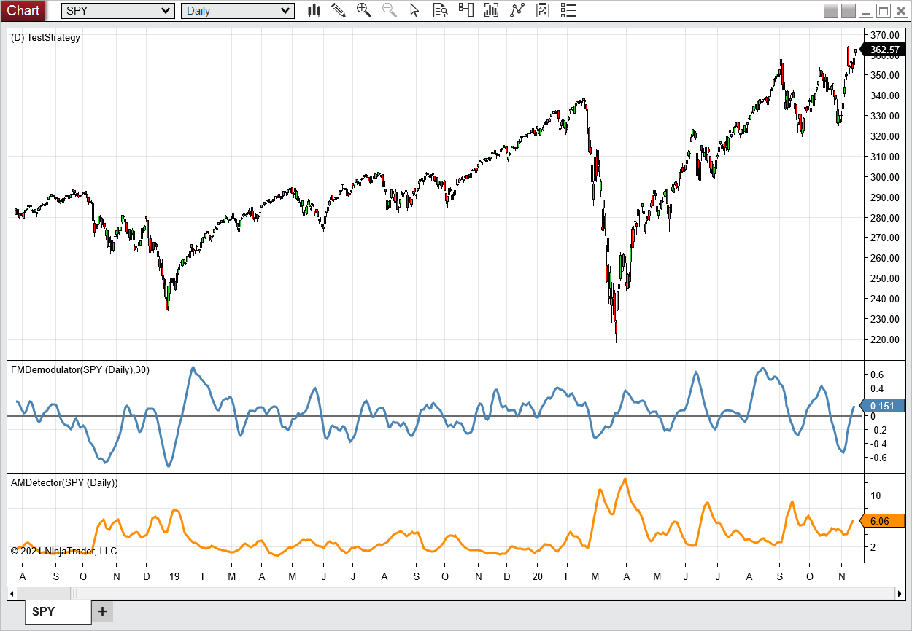
**FIGURE 4: NINJATRADER.** On this example daily chart of the SPDR S&P 500 ETF (SPY), the FMDemodulator is shown in the middle panel and the AMDetector in the bottom panel.

NinjaTrader source files: [ninja-trader/](ninja-trader/)

---

## NeuroShell Trader: May 2021

The AM detector and FM demodulator indicators introduced in John Ehlers' article in this issue can be implemented using NeuroShell Trader's ability to call external dynamic linked libraries.

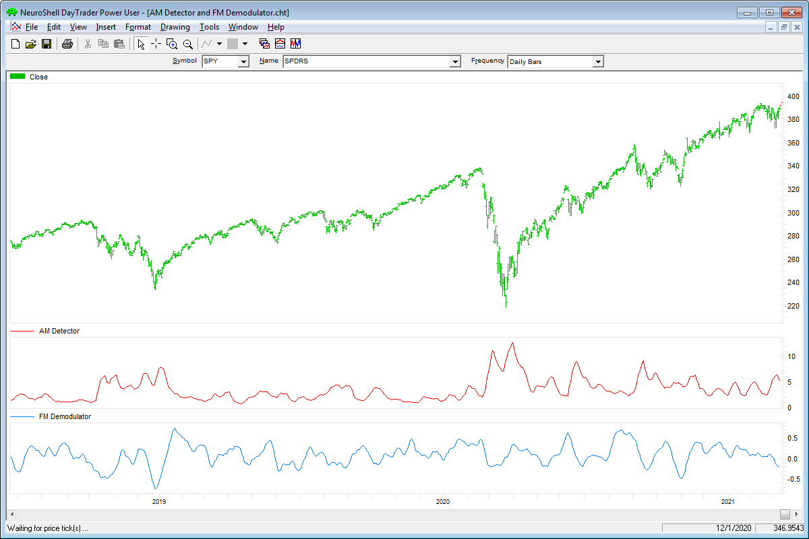
**FIGURE 5: NEUROSHELL TRADER.** This NeuroShell Trader chart shows the AM detector and FM demodulator indicators on a daily chart of SPY.

```text
AM	Avg( Max ( Abs( Sub(Close, Open) ), 4 ), 8 )
    FM	SuperSmoother ( Max2 ( -1, Min2( Mult2( 10, Sub(Close, Open) ), 1 ) ), 30
```

External file: [AM-FM.neuroshell.txt](AM-FM.neuroshell.txt)

---

## Optuma: May 2021

Here are the formulas for Optuma for implementing the two indicators presented in John Ehlers' article.

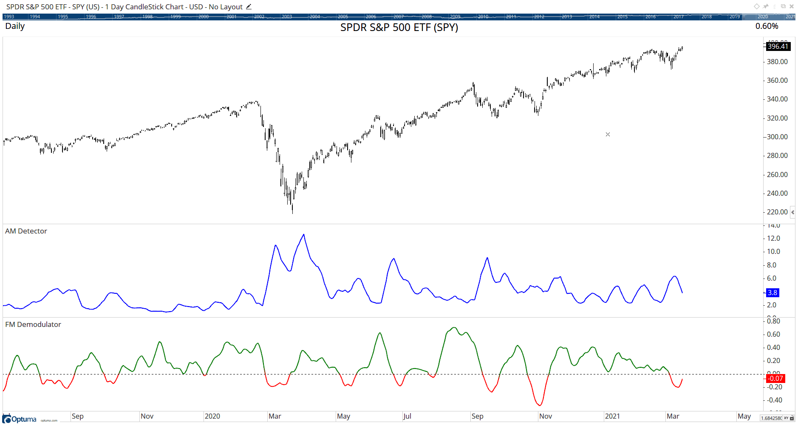
**FIGURE 6: OPTUMA.** This sample chart displays John Ehlers' AM detector and FM demodulator indicators.

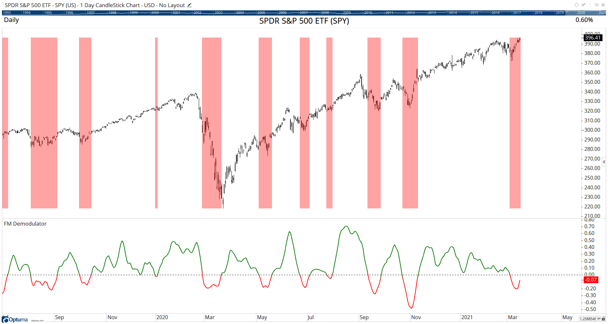
**FIGURE 7: OPTUMA.** This sample chart provides an example of the FM demodulator when it is negative, as indicated by the shading.

```optuma
AM Detector
Deriv = ABS(CLOSE() - OPEN());
Envel = HIGHESTHIGH(Deriv, BARS=4);
MA(Envel, BARS=8, CALC=Close)
 
FM Demodulator
Deriv = 10*(CLOSE() - OPEN());
// calculate the hard limit
HL =  IF(Deriv>1, 1, IF(Deriv<-1, -1, Deriv));
// output using the Ehlers SuperSmoother function
EHLSS(HL, PERIOD=30)
```

External file: [AM-FM.optuma](AM-FM.optuma)

---

## The Zorro Project: May 2021

Price curves consist of much noise and little signal. For separating the latter from the former, John Ehlers proposes in his article AM and FM demodulation techniques.

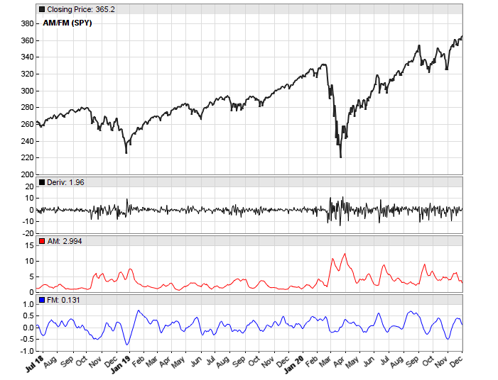
**FIGURE 8: ZORRO PROJECT.** The example chart shows the derivative and the AM (red) and FM (blue) decoded signals on the SPY.

```c
var AM(var Signal, int Period)
{
  var Envelope = MaxVal(series(abs(Signal)),4);
  return SMA(series(Envelope),Period); 
}

var FM(var Signal, int Period)
{
  var HL = clamp(10*Signal,-1,1);
  return Smooth(series(HL),Period);
}

void run() 
{
   BarPeriod = 1440;
   StartDate = 20180701;
   EndDate = 20201201;

   assetAdd("SPY","STOOQ:*"); // load price history from Stooq
   asset("SPY");

   var Deriv = priceClose()-priceOpen();
   plot("Deriv",Deriv,NEW,BLACK);
   plot("AM",AM(Deriv,8),NEW,RED);
   plot("FM",FM(Deriv,30),NEW,BLUE);
}
```

External file: [AM-FM.c](AM-FM.c)

---

## eSignal: May 2021

For this month's Traders' Tip, we've provided the FM Demodulator Indicator.efs study and AM Detector.efs based on the article by John Ehlers.

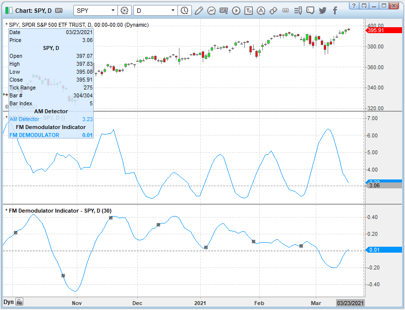
**FIGURE 9: eSIGNAL.** Here is an example of the study plotted on a daily chart of SPY.

### AM Detector

```javascript
/**********************************
Provided By:  
Copyright 2019 Intercontinental Exchange, Inc. All Rights Reserved. 
eSignal is a service mark and/or a registered service mark of Intercontinental Exchange, Inc. 
in the United States and/or other countries. This sample eSignal Formula Script (EFS) 
is for educational purposes only. 
Intercontinental Exchange, Inc. reserves the right to modify and overwrite this EFS file with each new release. 

Description:      
    A Technical Description Of Market Data For Traders
    FM DEMODULATOR
    by John F. Ehlers
    

Version:            1.00  03/12/2021

Formula Parameters:                    Default:
Period                                 30


Notes:
The related article is copyrighted material. If you are not a subscriber
of Stocks & Commodities, please visit www.traders.com.

**********************************/
var fpArray = new Array();
var bInit = false;

function preMain() {
    setStudyTitle("FM Demodulator Indicator");
    setCursorLabelName("FM DEMODULATOR", 0);
    setPriceStudy(false);
    setDefaultBarFgColor(Color.RGB(0x00,0x94,0xFF), 0);
    setPlotType( PLOTTYPE_LINE , 0 );
    
    var x=0;
    fpArray[x] = new FunctionParameter("Period", FunctionParameter.NUMBER);
	with(fpArray[x++]){
        setLowerLimit(1);
        setDefault(30);
    }
}

var bVersion = null;
var xClose = null;
var xOpen = null;
var xDeriv = null;
var xHL = null;
var a1 = null;
var b1 = null;
var c1 = null;
var c2 = null;
var c3 = null;
var SS = null;
var SS_1 = null;
var SS_2 = null;


function main(Period) {
    if (bVersion == null) bVersion = verify();
    if (bVersion == false) return; 
    
    if ( bInit == false ) { 
        xClose = close();  
        xOpen = open();
        xDeriv = efsInternal("Calc_Deriv", xClose, xOpen);
        addBand( 0, PS_DASH, 1, Color.grey); 
        xHL = efsInternal("Calc_HL", xDeriv);
        a1 = Math.exp(-1.414 * Math.PI / Period);
        b1 = 2 * a1 * Math.cos(1.414 * Math.PI / Period);
        c2 = b1;
        c3 = -a1 * a1;
        c1 = 1 - c2 - c3;
        SS = 0;
        SS_1 = 0;
        SS_2 = 0;

        bInit = true; 
    }      
    if (getCurrentBarCount() < Period - 3) return;
    if (getBarState() == BARSTATE_NEWBAR) {
        SS_2 = SS_1;
        SS_1 = SS;
    } 

    SS = c1 * (xHL.getValue(0) + xHL.getValue(1)) / 2 + c2 * SS_1 + c3 * SS_2;
    if (getCurrentBarCount() < 3) SS = xDeriv.getValue(0);
    
    return SS;
}


function Calc_HL(xDeriv){
    var ret = 0;
    ret = 10 * xDeriv.getValue(0);
    if (ret > 1) ret = 1
    if (ret < -1) ret = -1;
    return ret;
}

function Calc_Deriv(xClose, xOpen){
    var ret = 0;
    ret = xClose.getValue(0) - xOpen.getValue(0);
    return ret;
}

function verify(){
    var b = false;
    if (getBuildNumber() < 779){
        
        drawTextAbsolute(5, 35, "This study requires version 10.6 or later.", 
            Color.white, Color.blue, Text.RELATIVETOBOTTOM|Text.RELATIVETOLEFT|Text.BOLD|Text.LEFT,
            null, 13, "error");
        drawTextAbsolute(5, 20, "Click HERE to upgrade.@URL=https://www.esignal.com/download/default.asp", 
            Color.white, Color.blue, Text.RELATIVETOBOTTOM|Text.RELATIVETOLEFT|Text.BOLD|Text.LEFT,
            null, 13, "upgrade");
        return b;
    } 
    else
        b = true;
    
    return b;
}
```

External file: [AMDetector.efs](AMDetector.efs)

### FM Demodulator

```javascript
/**********************************
Provided By:  
Copyright 2019 Intercontinental Exchange, Inc. All Rights Reserved. 
eSignal is a service mark and/or a registered service mark of Intercontinental Exchange, Inc. 
in the United States and/or other countries. This sample eSignal Formula Script (EFS) 
is for educational purposes only. 
Intercontinental Exchange, Inc. reserves the right to modify and overwrite this EFS file with each new release. 

Description:      
    A Technical Description Of Market Data For Traders
    AM Detector
    by John F. Ehlers
    

Version:            1.00  03/12/2021


Notes:
The related article is copyrighted material. If you are not a subscriber
of Stocks & Commodities, please visit www.traders.com.

**********************************/
var fpArray = new Array();
var bInit = false;

function preMain() {
    setStudyTitle("AM Detector");
    setCursorLabelName("AM Detector", 0);
    setPriceStudy(false);
    setDefaultBarFgColor(Color.RGB(0x00,0x94,0xFF), 0);
    setPlotType( PLOTTYPE_LINE , 0 );
}

var bVersion = null;
var xClose = null;
var xOpen = null;
var xDeriv = null;
var xAbsDeriv = null;
var xEnvel = null;
var xVolatil = null;

function main(Period) {
    if (bVersion == null) bVersion = verify();
    if (bVersion == false) return; 
    
    if ( bInit == false ) { 
        xClose = close();  
        xOpen = open();
        xDeriv = efsInternal("Calc_Deriv", xClose, xOpen);
        xAbsDeriv = efsInternal("Calc_AbsDeriv", xDeriv);
        xEnvel = efsInternal("Calc_Envel", xAbsDeriv);
        xVolatil = sma(8, xEnvel);
        addBand( 0, PS_DASH, 1, Color.grey); 
        
        bInit = true; 
    }      

    if (getCurrentBarCount() < 8) return;
    return xVolatil.getValue(0);
}

function Calc_Envel(xAbsDeriv){
    var ret = 0;
    ret = highest(4, xAbsDeriv);    
    return ret;
}

function Calc_AbsDeriv(xDeriv){
    var ret = 0;
    ret = Math.abs(xDeriv.getValue(0));
    return ret;
}

function Calc_Deriv(xClose, xOpen){
    var ret = 0;
    ret = xClose.getValue(0) - xOpen.getValue(0);
    return ret;
}

function verify(){
    var b = false;
    if (getBuildNumber() < 779){
        
        drawTextAbsolute(5, 35, "This study requires version 10.6 or later.", 
            Color.white, Color.blue, Text.RELATIVETOBOTTOM|Text.RELATIVETOLEFT|Text.BOLD|Text.LEFT,
            null, 13, "error");
        drawTextAbsolute(5, 20, "Click HERE to upgrade.@URL=https://www.esignal.com/download/default.asp", 
            Color.white, Color.blue, Text.RELATIVETOBOTTOM|Text.RELATIVETOLEFT|Text.BOLD|Text.LEFT,
            null, 13, "upgrade");
        return b;
    } 
    else
        b = true;
    
    return b;
}
```

External file: [FMDemodulator.efs](FMDemodulator.efs)

---

## AIQ: May 2021

The AIQ EDS file for John Ehlers' article can be obtained on request via email. Code for the AM indicator is set up in the AIQ EDS code file.

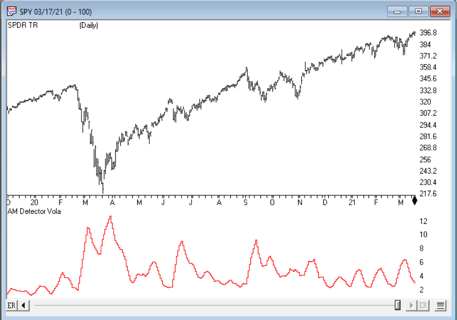
**FIGURE 10: AIQ.** AM indicator on a chart of SPDR TR (SPY).

```eds
! Technical Description of Market Data for Traders
! Author: John F. Ehlers, TASC May 2021
! Coded by: Richard Denning 3/17/2021

! AM Detector Indicator    
! (C) 2020-2021   John F. Ehlers

!FORMULAS:

Deriv is [Close] - [Open].
Envel is Highresult(Abs(Deriv), 4).
Volatil is Simpleavg(Envel, 8).
```

External file: [AM-FM.eds](AM-FM.eds)

---

## Microsoft Excel: May 2021

In his article in this issue, John Ehlers walks us through some amazing signal-processing techniques.

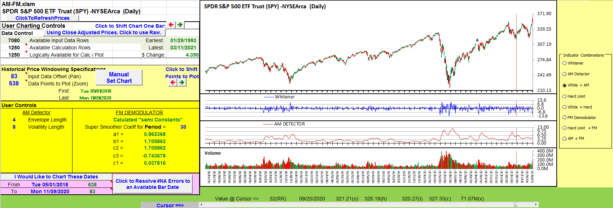
**FIGURE 11: AM (AMPLITUDE MODULATION) DETECTOR.** Whitened price and the amplitude modulation detector are shown.

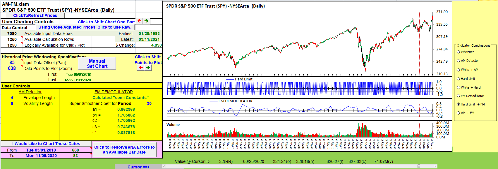
**FIGURE 12: DEMODULATED FM SIGNAL.** Amplitude information is stripped from the whitened noise signal by way of a hard limiter, and the result is integrated with a SuperSmoother.

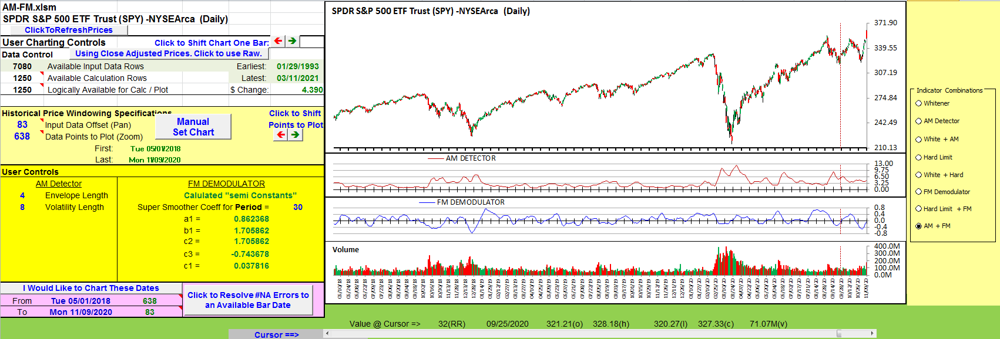
**FIGURE 13: AM & FM INFORMATION JUXTAPOSED.** Here, the AM and FM information are put next to each other.

External file: [code/AM-FM.xlsm](code/AM-FM.xlsm)

---

## BibTeX

```bibtex
@misc{traders_tips_2021_05,
  author       = {{Technical Analysis of STOCKS \& COMMODITIES}},
  title        = {Traders' Tips: A Technical Description Of Market Data For Traders},
  howpublished = {online},
  month        = may,
  year         = {2021},
  url          = {https://www.traders.com/Documentation/FEEDbk_docs/2021/05/TradersTips.html}
}
```
