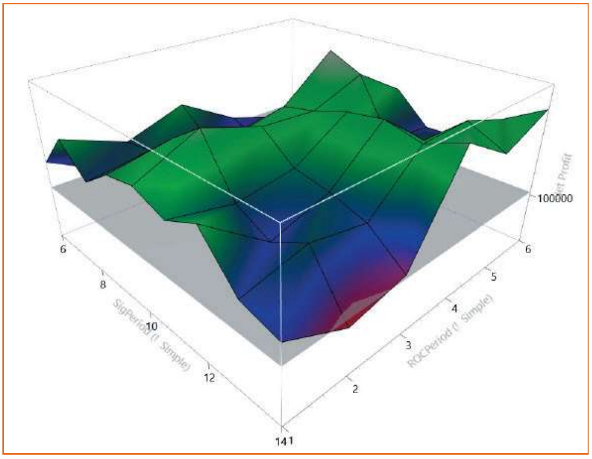
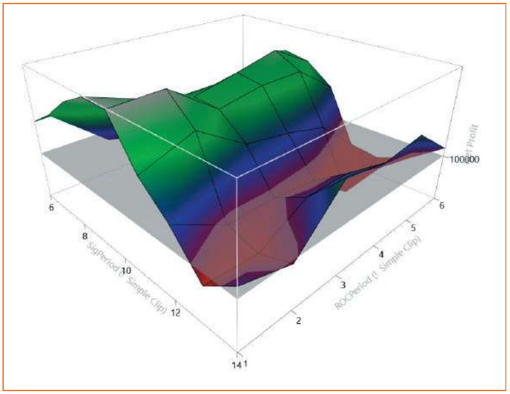
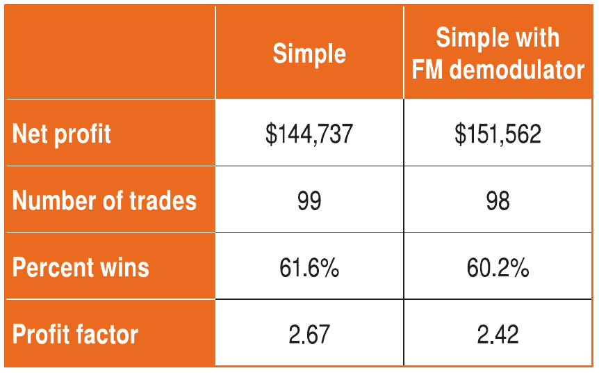

# Creating More Robust Trading Strategies With The FM Demodulator

*The Nature Of Market Data*

**John F. Ehlers**

- Article URL: https://technical.traders.com/archive/article.asp?file=\V39\C06\253EHLE.pdf
- Traders' Tips URL: https://www.traders.com/Documentation/FEEDbk_docs/2021/06/TradersTips.html

---

*Market data is made up of cyclical components. Cycles contain both signals and noise. It's a concept that underpins market timing and can be crucial to success. Last month we introduced the concept of using the AM (amplitude modulation) and FM (frequency modulation) components of cycles to better time trades. In this article, we follow up with an example of how you can use this idea in your trading strategies. It's a process that just might be considered foundational to quantitative analysis.*

---

Last month in the May 2021 issue of Stocks & Commodities, I introduced the concept of using an FM demodulator to identify and isolate volatility components from the timing components in market data. Using only the timing components of data in your indicators will change the shape of their response curves, and will probably change your interpretation of their meaning. In addition, the primary benefit of using the FM demodulator is to reduce the variation of parameter settings in strategies as the data inevitably changes, thereby increasing strategy robustness in various market conditions. This article will describe a strategy both with and without the FM demodulator to demonstrate its advantages.

## The Example Strategy (Without The FM Demodulator)

The strategy I will be describing is very simple. It is not intended nor is it recommended for trading in your account. I am using this strategy only for educational purposes, and if you choose to trade it you will be doing so at your own risk. As every caveat in this field clearly states, "past performance is not indicative of future results." The strategy is designed to trade only on the long side from January 2009 through February 2021. This span of more than 12 years is adequate to demonstrate reliability and robustness. The demonstration applies the strategy to one contract of the S&P futures contract without compounding. By using this contract, it is apparent why trading only to the long side was selected. It is to be noted that the strategy fails in the out-of-sample period from 2000 through 2008, where the market volatility was substantially less than current volatility and there were substantial moves to the downside.

The simple strategy is first described without the FM demodulator with reference to the code listing in the sidebar titled "A Simple Strategy." The strategy has two optimizable inputs, SigPeriod and ROCPeriod. There are only four variables to be declared. The first line of code is basically taking a derivative of the data. That is, close minus close one bar ago is an approximation to the derivative of a continuous function. The highest possible frequency that can be processed using digital signal processing (DSP) is at twice the sample rate, or a cycle having a two-bar period. This is called the Nyquist frequency. But taking a one-bar difference is a very noisy process, amplifying signals having a very short wavelength. For example, the samples at Nyquist are separated by 180 degrees. By taking a one-bar difference, the second term is just flipped 180 degrees, with the result that the two samples at Nyquist add together in phase. Thus, one-bar differencing quadruples the "noise" power at Nyquist. The increased noise at Nyquist can be mitigated by taking a two-bar difference instead of a one-bar difference because this is the same as performing a one-bar average of two one-bar differences. (That's really pretty simple when you think about it.) In DSP parlance, we have placed a zero in the transfer response of the difference at Nyquist. Reducing high-frequency noise is a good thing, even at the expense of an extra half bar of lag in the computations. The two-bar difference derivative does two things: 1) it places a zero in the transfer response at zero frequency and 2) it whitens the data spectrum. By placing a zero in the transfer response at zero frequency, the resulting indicator used in the strategy will have a nominal zero mean, and thus will be an "oscillator"-type indicator.

Next, the derivative is integrated in a four-bar moving average called Z3. The integration of the derivative recovers the shape of the original price data waveform, but without the zero-frequency component. The name of the Z3 variable is significant because the four-element moving average has a zero at the Nyquist frequency and conjugate zeros at twice the Nyquist frequency. Thus, short-term variations in the Z3 output are sharply reduced. Finally, the indicator is completed by the smoothing moving average parameter called *signal*.

A simple rate of change (ROC) of *signal* is zero when *signal* is at the valley of its cyclical swing, and is used to identify the best entry timing. The period of the ROC can be extended to smooth its response at the expense of some lag. The ROCPeriod is made to be an optimizable parameter.

A long position is entered when ROC crosses over zero, and in order to avoid getting out of the position too soon, the position is exited when *signal* crosses under zero. The strategy cannot be more simple.

When SigPeriod is optimized over the range 6 to 14 in steps of 1 and ROCPeriod is optimized over the range from 1 to 6 in steps of 1, the resulting profit surface is shown in Figure 1.



**Figure 1: Optimization profit surface of simple strategy.** The profit surface is shown for a simple strategy that is used for the study.

> **The primary benefit of using the FM demodulator is to reduce the variation of parameter settings in strategies as the data inevitably changes.**

This profit surface has a peak of approximately $144K, and the waterline (gray plane) is set to $100K. A profit of $144K over a 12-year span is not exactly shabby for such a simple strategy. However, the disturbing characteristic of the profit surface is that there are two ridges of best performance. One ridge is centered at a SigPeriod of 10 regardless of ROCPeriod. The other ridge is centered at a ROCPeriod of 4 regardless of the SigPeriod. This suggests that there is a complex relationship between the two optimizable parameters and that getting the right combination at any point in time could be difficult. Getting the right combination could even appear to be random.

## The Example Strategy (With The FM Demodulator)

I will now show that robustness can be improved through the use of the FM demodulator embedded into the strategy, with reference to the code listing in the sidebar titled "Simple Strategy With FM Demodulator." The strategy starts with taking the derivative as before. However, the next step is a hard limiter that removes the volatility amplitude variations in the derivative waveform. Of course, one question is: where does one set the clipping level of the hard limiter? To be reasonably consistent from symbol to symbol, I set the clipping level to be half the root mean square (RMS) level. RMS is basically the same as the standard deviation of the data. I compute the RMS by summing the square of the *deriv* variable over the last 50 bars, then taking the square root of this sum divided by 50. By doubling the normalized *deriv*, it is easy to set the hard limiting clip level and +/- 1. This means the clipping occurs at +/- half the standard deviation. After hard limiting, the remainder of the code is exactly the same as before. By hard limiting the variable *deriv*, the volatility amplitude components are almost all stripped away, and only the timing phase modulation components are left to be integrated.

When SigPeriod is optimized over the range 6 to 14 step 1 and ROCPeriod is optimized over the range from 1 to 6 step 1, the resulting profit surface is shown in Figure 2.



**Figure 2: Optimization profit surface of simple strategy with FM demodulator.** The profit surface is shown for the same simple strategy as in Figure 1, this time with the FM demodulator embedded into the strategy to improve the strategy's robustness.

> **The main advantage of incorporating the FM discriminator into the strategy is that it improves its robustness over time.**

This profit surface of the simple clip strategy has a peak of approximately $151K, and the waterline (gray plane) is set to $100K, as before. The big difference of the profit surface in Figure 2 is that the best solution is focused at a SigPeriod value of 10. This means there is no complex interplay between the two inputs, and therefore the strategy will be more robust over time. As a practical matter, ROCPeriod can probably be set to 2 and the SigPeriod alone is optimized to get the best performance at any given period of time.

## A Foundational Principle For Quantitative Analysis

The simple strategy was selected only to be a concrete example of the efficacy of incorporating the FM discriminator into the strategy design. Keeping things simple is always good. The in-sample summary performance of the simple strategy over the period from January 2009 through February 2021 is compared in the table in Figure 3. The summary data shows very little difference between the two approaches for the in-sample testing. The main advantage of incorporating the FM discriminator into the strategy is that it improves its robustness over time.



**Figure 3: Strategy comparison without and with the FM demodulator.** The in-sample summary performance of the simple strategy over the period from January 2009 through February 2021 is compared in the table. The summary data shows very little difference between the two approaches for the in-sample testing. The main advantage of incorporating the FM discriminator into the strategy is that it improves its robustness over time.

The main thing to remember is that you can improve most "oscillator" indicators and strategies by using a derivative, then a hard limiter, followed by an integrator. In my humble opinion, this process is foundational to quantitative analysis.

> **In my humble opinion, this process is foundational to quantitative analysis.**

---

## A Simple Strategy, In EasyLanguage Code

```easylanguage
// Simple
// (c) 2013 - 2021 John F. Ehlers

Inputs:
  SigPeriod(8),
  ROCPeriod(1);

Vars:
  Deriv(0),
  Z3(0),
  Signal(0),
  ROC(0);

//Derivative of the price wave
Deriv = Close - Close[2];

//zeros at Nyquist and 2*Nyquist, i.e. Z3 = (1 + Z^-1)*(1 + Z^-2)
//to integrate derivative
Z3 = Deriv + Deriv[1] + Deriv[2] + Deriv[3];

//Smooth Z3 for trading signal
Signal = Average(Z3, SigPeriod);

//Use Rate of Change to identify entry point
ROC = Signal - Signal[ROCPeriod];

If ROC Crosses Over 0 Then Buy Next Bar on Open;
If Signal Crosses Under 0 Then Sell Next Bar on Open;
```

## Simple Strategy With FM Demodulator, In EasyLanguage Code

```easylanguage
/// Simple Clip
// (c) 2013 - 2021 John F. Ehlers

Inputs:
  SigPeriod(22),
  ROCPeriod(10);

Vars:
  Deriv(0),
  RMS(0),
  count(0),
  Clip(0),
  Z3(0),
  Signal(0),
  ROC(0);

//Derivative of the price wave
Deriv = Close - Close[2];

//Normalize Degap to half RMS and hard limit at +/- 1
RMS = 0;
For count = 0 to 49 Begin
  RMS = RMS + Deriv [count]*Deriv [count];
End;
If RMS <> 0 Then Clip = 2*Deriv / SquareRoot(RMS / 50);
If Clip > 1 Then Clip = 1;
If Clip < -1 Then Clip = -1;

//zeros at Nyquist and 2*Nyquist, i.e. Z3 = (1 + Z^-1)*(1 + Z^-2)
//to integrate derivative
Z3 = Clip + Clip [1] + Clip [2] + Clip [3];

//Smooth Z2 for trading signal
Signal = Average(Z3, SigPeriod);

//Use Rate of Change to identify entry point
ROC = Signal - Signal[ROCPeriod];

If ROC Crosses Over 0 Then Buy Next Bar on Open;
If Signal Crosses Under 0 Then Sell Next Bar on Open;
```

---

## Further Reading

- Ehlers, John F. [2021]. "A Technical Description Of Market Data For Traders," *Technical Analysis of* Stocks & Commodities, Volume 39: May.
- ——— "Cycles Tutorial," Mesa Software, http://www.mesasoftware.com/ehlers_cycles_tutorial.htm.
- ——— [2013]. *Cycle Analytics For Traders*, John Wiley & Sons.
- ——— [2016]. "Measuring Market Cycles," *Technical Analysis of* Stocks & Commodities, Volume 34: September.
- ——— [2016]. "Aliasing," *Technical Analysis of* Stocks & Commodities, Volume 34: January.
- ——— [2015]. "Whiter Is Brighter," *Technical Analysis of* Stocks & Commodities, Volume 33: January.
- ——— [2014]. "Predictive And Successful Indicators," *Technical Analysis of* Stocks & Commodities, Volume 32: January.

---

## References

```bibtex
@article{ehlers2021fm,
  author  = {Ehlers, John F.},
  title   = {Creating More Robust Trading Strategies With The {FM} Demodulator},
  journal = {Technical Analysis of Stocks \& Commodities},
  volume  = {39},
  number  = {6},
  pages   = {8--13},
  year    = {2021},
  month   = jun,
  url     = {https://technical.traders.com/archive/article.asp?file=\V39\C06\253EHLE.pdf}
}

@misc{traderstips2021jun,
  title        = {Traders' Tips: June 2021},
  howpublished = {Technical Analysis of Stocks \& Commodities},
  year         = {2021},
  month        = jun,
  url          = {https://www.traders.com/Documentation/FEEDbk_docs/2021/06/TradersTips.html},
  note         = {Traders' Tips for ``Creating More Robust Trading Strategies With The {FM} Demodulator'' by John F. Ehlers}
}
```
