# Traders' Tips: June 2021

- Traders' Tips URL: https://www.traders.com/Documentation/FEEDbk_docs/2021/06/TradersTips.html

Traders' Tips for "Creating More Robust Trading Strategies With The FM Demodulator" by John F. Ehlers.

---

## TradeStation

**Author:** Chris Imhof

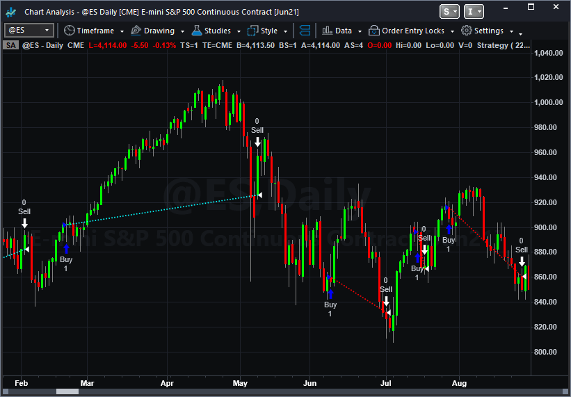

In "Creating More Robust Trading Strategies With The FM Demodulator" in this issue, author John Ehlers presents EasyLanguage code for a simple strategy and a version of the simple strategy with the FM demodulator incorporated.

**Simple Strategy** ([SimpleStrategy.els](SimpleStrategy.els)):

```easylanguage
// TASC JUN 2021
// Creating More Robust Trading Strategies With The FM
// Demodulator
// (c) 2013 - 2021 John F. Ehlers
// Simple strategy

inputs:
	SigPeriod( 8 ),
	ROCPeriod( 1 );
	
variables:
	Deriv( 0 ),
	Z3( 0 ),
	Signal( 0 ),
	ROC( 0 );

// derivative of the price wave
Deriv = Close - Close[2];

// zeros at Nyquist and 2 * Nyquist, 
// i.e. Z3 = (1 + Z^-1)*(1 + Z^-2) to integrate 
// derivative
Z3 = Deriv + Deriv[1] + Deriv[2] + Deriv[3];

// smooth Z3 for trading signal
Signal = Average( Z3, SigPeriod );

// use Rate of Change to identify entry point
ROC = Signal - Signal[ROCPeriod];

if ROC crosses over 0 then 
	Buy next bar on Open;

if Signal crosses under 0 then 
	Sell next bar on Open;
```

**Strategy With FM Demodulator** ([SimpleClipStrategy.els](SimpleClipStrategy.els)):

```easylanguage
// TASC JUN 2021
// Creating More Robust Trading Strategies With The FM
// Demodulator
// (c) 2013 - 2021 John F. Ehlers
// Simple strategy with FM demodulator

inputs:
	SigPeriod( 22 ),
	ROCPeriod( 10 );

variables:
	Deriv( 0 ),
	RMS( 0 ),
	count( 0 ),
	Clip( 0 ),
	Z3( 0 ),
	Signal( 0 ),
	ROC( 0 );

// derivative of the price wave
Deriv = Close - Close[2];

// normalize Degap to half RMS and hard limit at +/- 1
RMS = 0;

for count = 0 to 49 
begin
	RMS = RMS + Deriv[count] * Deriv[count];
end;

if RMS <> 0 then 
	Clip = 2 * Deriv / SquareRoot( RMS / 50 );

if Clip > 1 then 
	Clip = 1;

if Clip < -1 then 
	Clip = -1;

// zeros at Nyquist and 2*Nyquist, 
// i.e. Z3 = (1 + Z^-1)*(1 + Z^-2) to integrate 
// derivative
Z3 = Clip + Clip [1] + Clip [2] + Clip [3];

// smooth Z2 for trading signal
Signal = Average( Z3, SigPeriod );

// use Rate of Change to identify entry point
ROC = Signal - Signal[ROCPeriod];

if ROC crosses over 0 then 
	Buy next bar on Open;
	
if Signal crosses under 0 then 
	Sell next bar on Open;
```

---

## thinkorswim

**Author:** thinkorswim (TD Ameritrade)

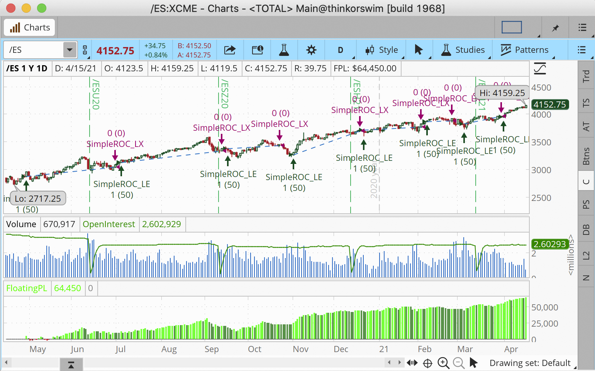

The FM demodulator strategy is available as a shared link: https://tos.mx/DOh8z2x. The FM demodulator is enabled by default via a "use FM demodulator" input toggle.

---

## eSignal

**Author:** Eric Lippert

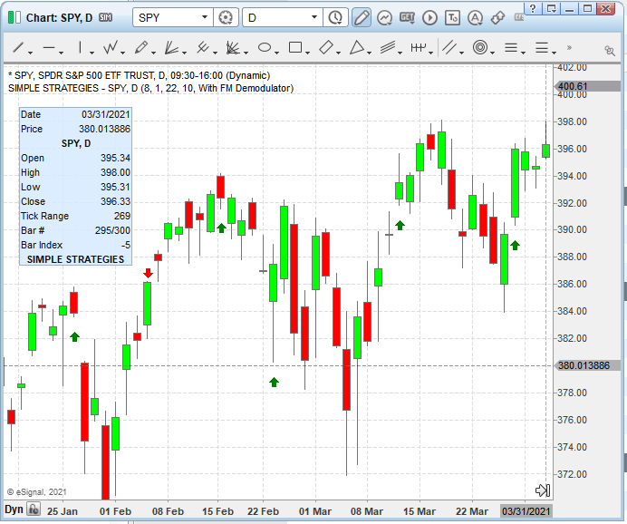

EFS formula script implementing both Standard and "With FM Demodulator" modes ([SimpleStrategies.efs](SimpleStrategies.efs)):

```javascript
/**********************************
Provided By:  
Copyright 2019 Intercontinental Exchange, Inc. All Rights Reserved. 
eSignal is a service mark and/or a registered service mark of Intercontinental Exchange, Inc. 
in the United States and/or other countries. This sample eSignal Formula Script (EFS) 
is for educational purposes only. 
Intercontinental Exchange, Inc. reserves the right to modify and overwrite this EFS file with each new release. 

Description:      
    Creating More Robust Trading Strategies With The FM Demodulator
    by John F. Ehlers
    

Version:            1.00  04/08/2021

Formula Parameters:                    Default:
SigPeriod                              8
ROCPeriod                              1
SigPeriod2                             22
ROCPeriod2                             10

Notes:
The related article is copyrighted material. If you are not a subscriber
of Stocks & Commodities, please visit www.traders.com.

**********************************/
var fpArray = new Array();
var bInit = false;

function preMain() {
    setStudyTitle("Simple Strategies");
    setPriceStudy(true);
        
    var x=0;
    fpArray[x] = new FunctionParameter("SigPeriod", FunctionParameter.NUMBER);
	with(fpArray[x++]){
        setLowerLimit(1);		
        setDefault(8);
    }
    fpArray[x] = new FunctionParameter("ROCPeriod", FunctionParameter.NUMBER);
	with(fpArray[x++]){
        setLowerLimit(1);		
        setDefault(1);
    }
     fpArray[x] = new FunctionParameter("SigPeriod2", FunctionParameter.NUMBER);
	with(fpArray[x++]){
        setName("SigPeriod Demodulator");
        setLowerLimit(1);		
        setDefault(22);
    }
    fpArray[x] = new FunctionParameter("ROCPeriod2", FunctionParameter.NUMBER);
	with(fpArray[x++]){
        setName("ROCPeriod Demodulator");
        setLowerLimit(1);		
        setDefault(10);
    }
    fpArray[x] = new FunctionParameter("Type", FunctionParameter.STRING);
	with(fpArray[x++]){
        setName("Type");
        addOption("Standard"); 
        addOption("With FM Demodulator");
        setDefault("Standard"); 
    }
}

var bVersion = null;
var xClose = null;
var xOpen = null;
var xDeriv = null;
var xZ3 = null;
var xSignal = null;
var xROC = null;


function main(SigPeriod, ROCPeriod, SigPeriod2, ROCPeriod2, Type) {
    if (bVersion == null) bVersion = verify();
    if (bVersion == false) return; 
    
    if ( bInit == false ) { 
        xClose = close();  
        xHigh = high();
        xLow = low();
        xDeriv = efsInternal("Calc_Deriv", xClose);
        if (Type=="Standard"){
            xZ3 = efsInternal("Calc_z3", xDeriv);
            xSignal = sma(SigPeriod, xZ3);
            xROC = roc(ROCPeriod, xSignal);
        }
        else {
            xClip = efsInternal("Calc_clip", xDeriv);
            xZ3 = efsInternal("Calc_z3", xClip); 
            xSignal = sma(SigPeriod2, xZ3);
            xROC = roc(ROCPeriod2, xSignal);
        }
        
        bInit = true; 
    }      

    if (xROC.getValue(-2) < 0 && xROC.getValue(-1) > 0) {
        drawShapeRelative(0, xLow.getValue(0) - getMinTick()*100, Shape.UPARROW, null, Color.green, Shape.ONTOP | Shape.TOP, "buy" + getCurrentBarCount());
    }
    if (xSignal.getValue(-2) > 0 && xSignal.getValue(-1) < 0){
        drawShapeRelative(0, xHigh.getValue(0) + getMinTick()*100, Shape.DOWNARROW, null, Color.red, Shape.ONTOP  | Shape.TOP, "sell" + getCurrentBarCount());
    }
    
    return;
}

function Calc_clip(xDeriv){
    var RMS = 0;
    var ret = 0;
    for (var i = 0; i <=49; i++){
        RMS = RMS + xDeriv.getValue(-i) * xDeriv.getValue(-i); 
    }
    if (RMS != 0) ret = 2 * xDeriv.getValue(0) / Math.sqrt(RMS/50);
    if (ret > 1) ret = 1;
    if (ret < -1) ret = -1;
    
    return ret;
}

function Calc_z3(xDeriv){
    var ret = 0;
    ret = xDeriv.getValue(0) + xDeriv.getValue(-1) + xDeriv.getValue(-2) + xDeriv.getValue(-3);
    return ret;
}

function Calc_Deriv(xClose){
    var ret = 0;
    ret = xClose.getValue(0) - xClose.getValue(-2);
    return ret;
}

function verify(){
    var b = false;
    if (getBuildNumber() < 779){
        
        drawTextAbsolute(5, 35, "This study requires version 10.6 or later.", 
            Color.white, Color.blue, Text.RELATIVETOBOTTOM|Text.RELATIVETOLEFT|Text.BOLD|Text.LEFT,
            null, 13, "error");
        drawTextAbsolute(5, 20, "Click HERE to upgrade.@URL=https://www.esignal.com/download/default.asp", 
            Color.white, Color.blue, Text.RELATIVETOBOTTOM|Text.RELATIVETOLEFT|Text.BOLD|Text.LEFT,
            null, 13, "upgrade");
        return b;
    } 
    else
        b = true;
    
    return b;
}
```

---

## Wealth-Lab

**Author:** Gene Geren (Eugene)

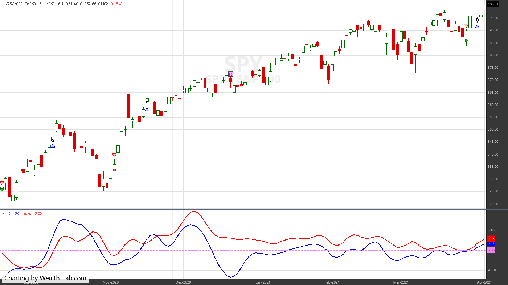

C# strategy implementing the FM demodulator ([FmDemodulator.cs](FmDemodulator.cs)):

```csharp
using WealthLab.Backtest;
using System;
using WealthLab.Core;
using WealthLab.Indicators;
using System.Drawing;
using System.Collections.Generic;

namespace TASCStrategies
{
	public class TASC202106 : UserStrategyBase
	{
		public override void Initialize(BarHistory bars)
		{
			roc = new TimeSeries( bars.DateTimes, 0);
			signal = new TimeSeries( bars.DateTimes, 0);
			clip = new TimeSeries( bars.DateTimes, 0);
			Z3 = new TimeSeries( bars.DateTimes, 0);
			RMS = new TimeSeries( bars.DateTimes, 0);

			/* Derivative of the price wave */
			var Deriv = bars.Close - (bars.Close >> 2);
			Deriv[0] = Deriv[1] = 0;

			for (int bar = 0; bar < bars.Count; bar++)
			{
				if (bar >= period)
				{
					for (int count = 0; count < period - 1; count++)
					{
						if (bar > period)
							rms += Math.Pow(Deriv[bar - count], 2);
					}

					RMS[bar] = rms;

					double _clip = 0;
					if (RMS[bar] != 0)
						_clip = 2 * Deriv[bar] / Math.Sqrt(RMS[bar] / 50);
					if (_clip > 1) _clip = 1;
					if (_clip < -1) _clip = -1;
					clip[bar] = _clip;

					/* zeros at Nyquist and 2*Nyquist, i.e. Z3 = (1 + Z^-1)*(1 + Z^-2) to integrate derivative */
					Z3[bar] = clip[bar] + clip[bar - 1] + clip[bar - 2] + clip[bar - 3];
				}
			}

			/* Smooth Z2 for trading signal */
			signal = SMA.Series(Z3, SigPeriod);
			/* Use Rate of Change to identify entry point */
			roc = signal - (signal >>ROCPeriod);

			PlotTimeSeries( signal, "Signal", "FMD", Color.Red);
			PlotTimeSeries( roc, "RoC", "FMD");
			DrawHorzLine( 0, Color.Violet, 2, LineStyles.Dashed, "FMD");
			
			StartIndex = Math.Max(ROCPeriod, Math.Max(SigPeriod, period));
		}

		public override void Execute(BarHistory bars, int idx)
		{
			if (!HasOpenPosition(bars, PositionType.Long))
			{
				/* If ROC Crosses Over 0 Then Buy Next Bar on Open;*/ 
				if (roc.CrossesOver(0, idx))
					PlaceTrade( bars, TransactionType.Buy, OrderType.Market);
			}
			else
			{
				/* If Signal Crosses Under 0 Then Sell Next Bar on Open; */
				if (signal.CrossesUnder(0, idx))
					ClosePosition( LastPosition, OrderType.Market);
			}
		}

		/* declare private variables below */
		TimeSeries roc, signal, clip, Z3, RMS;
		int SigPeriod = 22, ROCPeriod = 10, period = 49; /* Normalize Degap to half RMS and hard limit at +/- 1 */
		double rms = 0;
	}
}
```

---

## NinjaTrader

**Author:** Kate Windheuser

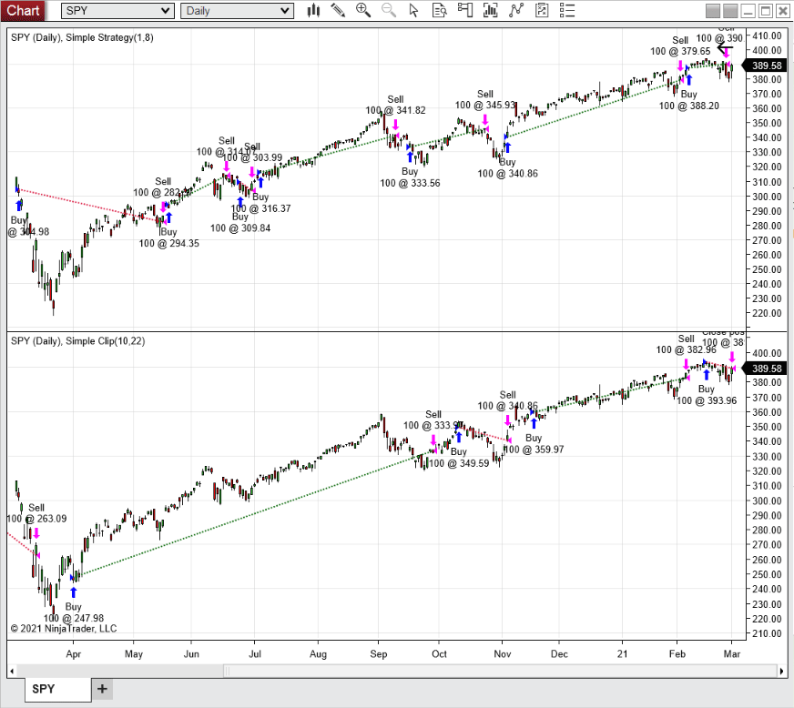

NinjaScript add-ons are available for download for both NinjaTrader 7 and 8. Pre-existing code files:
- [ninja-trader/@SMA.cs](ninja-trader/@SMA.cs)
- [ninja-trader/SimpleStrategy.cs](ninja-trader/SimpleStrategy.cs)
- [ninja-trader/SimpleClip.cs](ninja-trader/SimpleClip.cs)

---

## NeuroShell Trader

**Author:** Ward Systems Group, Inc.

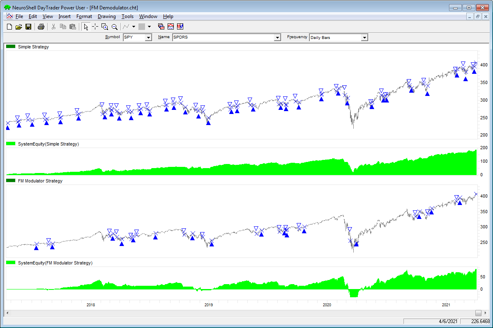

Indicator definitions:

```
Signal	Avg(Sum(Momentum(Close,2),4),8)

FMSignal	Avg( Sum( Max2( -1, Min2( Divide( Mul2( 2, Momentum( Close, 2)), SqrRt( Divide( Sum( Mul2( Momentum( Close, 2), Momentum( Close, 2)), 50), 50))), 1)), 4), 22)
```

Simple strategy trading rules:

```
BUY LONG CONDITIONS: [All of which must be true]
     CrossAbove( Momentum( Signal, 1), 0)
SELL LONG CONDITIONS: [All of which must be true]
     CrossBelow( Signal,  0)
```

FM Demodulator strategy trading rules:

```
BUY LONG CONDITIONS: [All of which must be true]
     CrossAbove(Momentum( FMSignal, 10 ), 0)
SELL LONG CONDITIONS: [All of which must be true]
     CrossBelow( FMSignal, 0)
```

---

## Optuma

**Author:** support@optuma.com

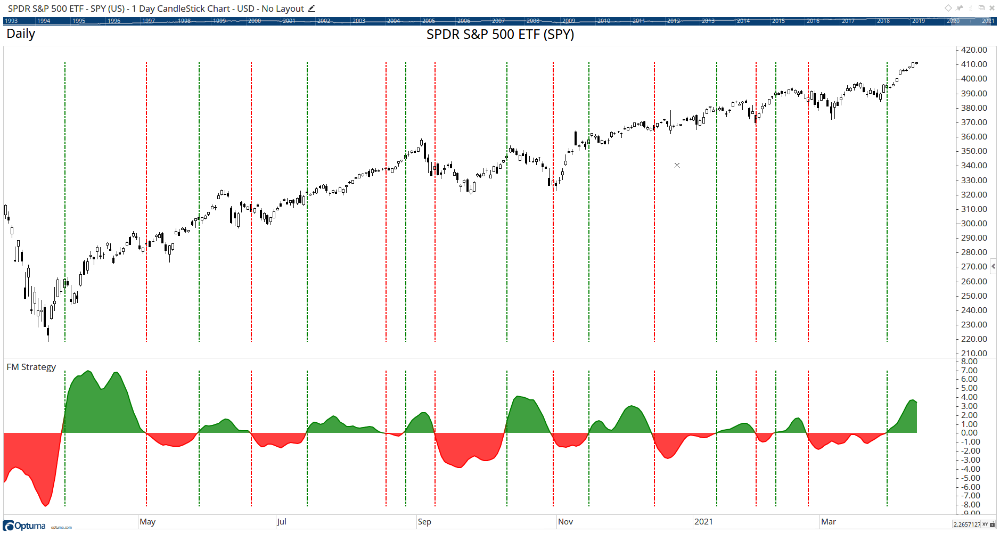

Optuma formula code for both strategies ([FmDemodulator.optuma](FmDemodulator.optuma)):

**Simple Strategy:**

```
$SigPeriod = 8;
$ROCPeriod = 1;
Deriv = CLOSE()-CLOSE()[2];
Z3 = Deriv + Deriv[1] + Deriv[2] + Deriv[3];
Signal= MA(Z3, BARS=$SigPeriod, CALC=Close);
ROC1 = Signal - OFFSET(Signal, OFFSET=$ROCPeriod);
//Buy Signal;
ROC1 CrossesAbove 0
//Sell Signal;
//ROC1 CrossesBelow 0
```

**Simple with FM Demodulator:**

```
$SigPeriod = 22;
$ROCPeriod = 10;
Deriv = CLOSE()-CLOSE()[2];
Deriv2 = Deriv * Deriv;
RMS=ACC(Deriv2, RANGE=Look Back Period, BARS=50);
Clip = (2*Deriv) / SQRT(RMS / 50);
Z3 = Clip + Clip[1] + Clip[2] + Clip[3];
Signal= MA(Z3, BARS=$SigPeriod, CALC=Close);
ROC1 = Signal - OFFSET(Signal, OFFSET=$ROCPeriod);
//Buy Signal;
ROC1 CrossesAbove 0
//Sell Signal;
//ROC1 CrossesBelow 0
```

---

## TradersStudio

**Author:** Richard Denning

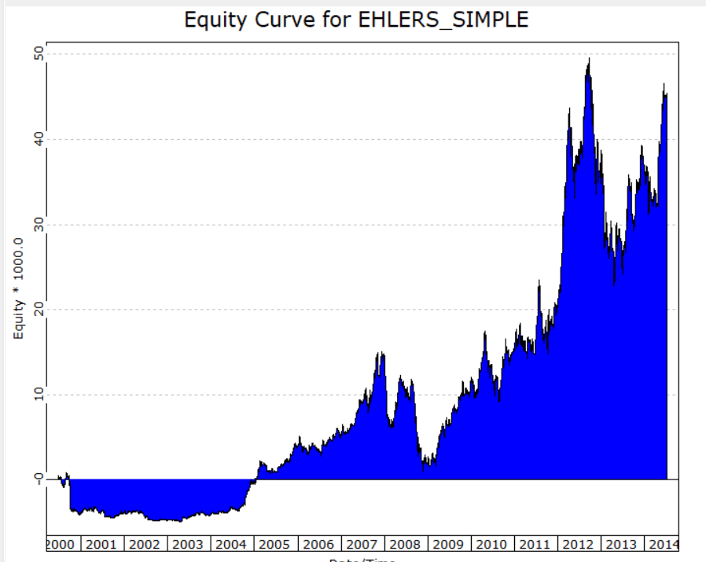

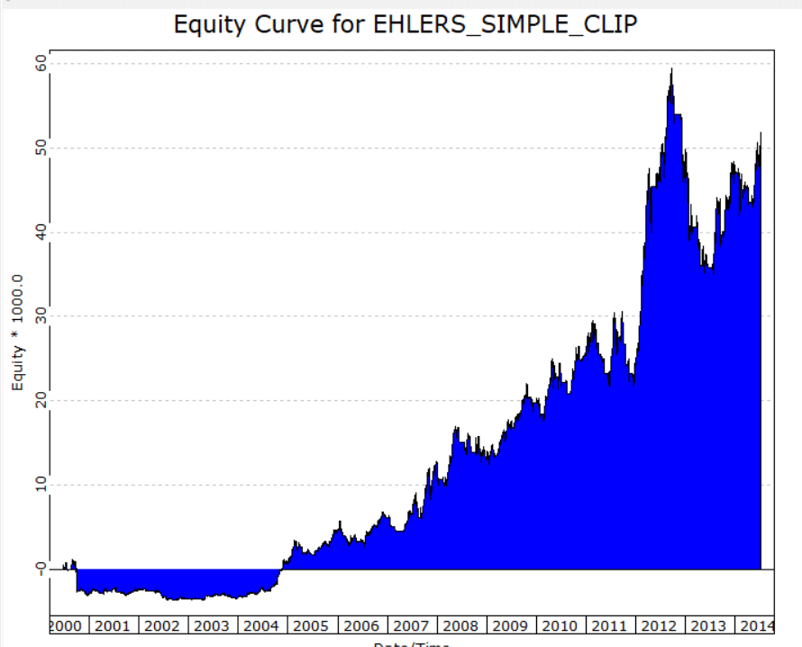

TradersStudio code for both systems ([FmDemodulator.tssb](FmDemodulator.tssb)):

```vb
'Simple
'(c) 2013 - 2021 John F. Ehlers
Sub EHLERS_SIMPLE(SigPeriod, ROCPeriod)

    Dim Deriv As BarArray
    Dim Z3 As BarArray
    Dim Signal As BarArray
    Dim theROC As BarArray

    If BarNumber=FirstBar Then
        'SigPeriod = 8
        'ROCPeriod = 1
        Deriv = 0
        Z3 = 0
        Signal = 0
        theROC = 0
    End If

'Derivative of the price wave
    Deriv = Close - Close[2]
'zeros at Nyquist and 2*Nyquist, 
'   i.e. Z3 = (1 + Z^-1)*(1 + Z^-2) to integrate derivative
    Z3 = Deriv + Deriv[1] + Deriv[2] + Deriv[3]
'Smooth Z3 for trading signal
    Signal = Average(Z3, SigPeriod)
'Use Rate of Change to identify entry point
    theROC = Signal - Signal[ROCPeriod]
    If CrossesOver(theROC, 0) Then
        Buy("", 1, 0, Market, Day)
    End If
    If CrossesUnder(Signal, 0) Then
        ExitLong("", "", 1, 0, Market, Day)
    End If
End Sub
'---------------------------------------------
'Simple Clip
'(c) 2013 - 2021 John F. Ehlers
Sub EHLERS_SIMPLE_CLIP(SigPeriod, ROCPeriod)

    Dim Deriv As BarArray
    Dim RMS As BarArray
    Dim count As BarArray
    Dim Clip As BarArray
    Dim Z3 As BarArray
    Dim Signal As BarArray
    Dim theROC As BarArray

    If BarNumber=FirstBar Then
        'SigPeriod = 22
        'ROCPeriod = 10
        Deriv = 0
        RMS = 0
        count = 0
        Clip = 0
        Z3 = 0
        Signal = 0
        theROC = 0
    End If

'Derivative of the price wave
    Deriv = Close - Close[2]
'Normalize Degap to half RMS and hard limit at +/- 1
    RMS = 0
    For count = 0 To 49
        RMS = RMS + Deriv [count]*Deriv [count]
    Next
    If RMS <> 0 Then
        Clip = 2*Deriv / Sqr(RMS / 50)
    End If
    If Clip > 1 Then
        Clip = 1
    End If
    If Clip < -1 Then
        Clip = -1
    End If
    Z3 = Clip + Clip [1] + Clip [2] + Clip [3]
'Smooth Z2 for trading signal 
Signal = Average(Z3, SigPeriod)
'Use Rate of Change to identify entry point
    theROC = Signal - Signal[ROCPeriod]
    If CrossesOver(theROC, 0) Then
        Buy("LE", 1, 0, Market, Day)
    End If
    If CrossesUnder(Signal, 0) Then
        ExitLong("LX", "", 1, 0, Market, Day)
    End If
End Sub
'----------------------------------------------
```

---

## The Zorro Project

**Author:** Petra Volkova (oP group Germany)

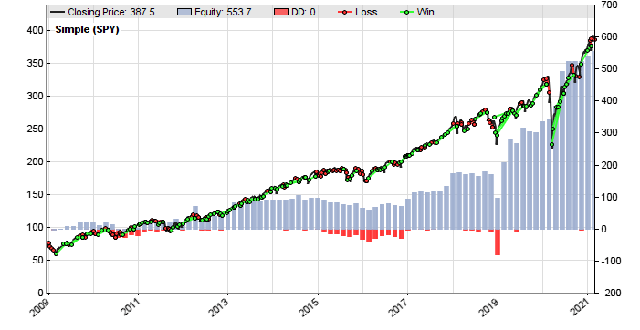

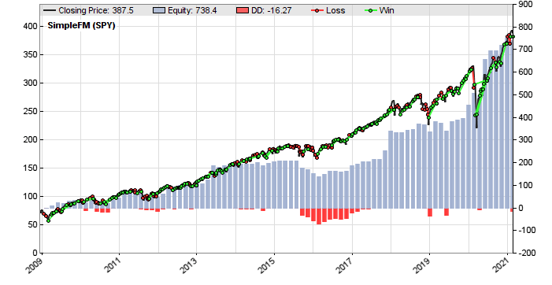

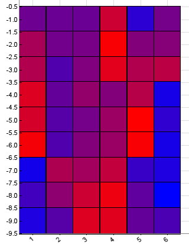

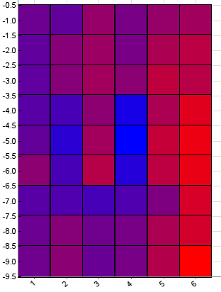

C code for Zorro with brute-force optimization ([FmDemodulator.c](FmDemodulator.c)):

```c
var void simple()
{
  int SigPeriod = optimize(8,6,14,1),
  ROCPeriod = optimize(1,1,6,1);
//Derivative of the price wave
  vars Deriv = series(priceClose(0)-priceClose(2));
//zeros at Nyquist and 2*Nyquist, i.e. Z3 = (1 + Z^-1)*(1 + Z^-2)
  vars Z3 = series(Sum(Deriv,4));
//Smooth Z3 for trading signal
  vars Signal = series(SMA(Z3,SigPeriod));
//Use Rate of Change to identify entry point
  vars Roc = series(Signal[0]-Signal[ROCPeriod]);
//If ROC Crosses Over 0 Then Buy Next Bar on Open;
//If Signal Crosses Under 0 Then Sell Next Bar on Open;
  if(crossOver(Roc,0))
    enterLong();
  else if(crossUnder(Signal,0))
  exitLong();
}

void simpleFM()
{
  int i, SigPeriod = optimize(8,6,14,1),
  ROCPeriod = optimize(1,1,6,1);
//Derivative of the price wave
  vars Deriv = series(priceClose(0)-priceClose(2));
//Normalize Degap to half RMS and hard limit at +/- 1
  var RMS = 0;
  for(i=0; i<50; i++) RMS += Deriv[i]*Deriv[i];
  vars Clip = series(clamp(2*Deriv[0]/sqrt(RMS/50),-1,1));
//zeros at Nyquist and 2*Nyquist, i.e. Z3 = (1 + Z^-1)*(1 + Z^-2)
  vars Z3 = series(Sum(Clip,4));
//Smooth Z3 for trading signal
  vars Signal = series(SMA(Z3,SigPeriod));
//Use Rate of Change to identify entry point
  vars Roc = series(Signal[0]-Signal[ROCPeriod]);
//If ROC Crosses Over 0 Then Buy Next Bar on Open;
//If Signal Crosses Under 0 Then Sell Next Bar on Open;
  if(crossOver(Roc,0))
    enterLong();
  else if(crossUnder(Signal,0))
    exitLong();
}
```

---

## Microsoft Excel

**Author:** Ron McAllister

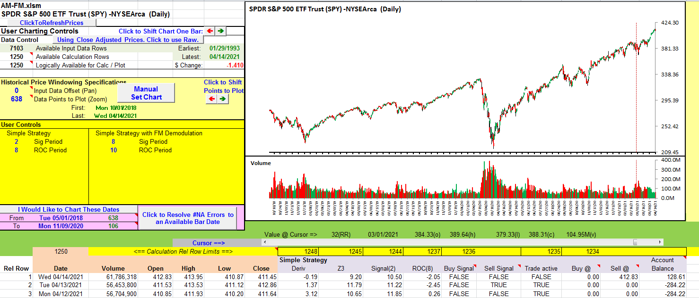

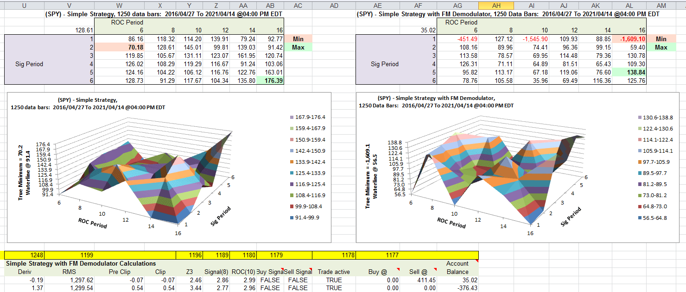

Excel spreadsheet with user controls for SigPeriod/ROCPeriod, data tables for scenario analysis, and 3D surface charts: [code/FmStrategy.xlsm](code/FmStrategy.xlsm)

---

## References

```bibtex
@misc{traderstips2021jun,
  title        = {Traders' Tips: June 2021},
  howpublished = {Technical Analysis of Stocks \& Commodities},
  year         = {2021},
  month        = jun,
  url          = {https://www.traders.com/Documentation/FEEDbk_docs/2021/06/TradersTips.html},
  note         = {Traders' Tips for ``Creating More Robust Trading Strategies With The {FM} Demodulator'' by John F. Ehlers}
}
```
