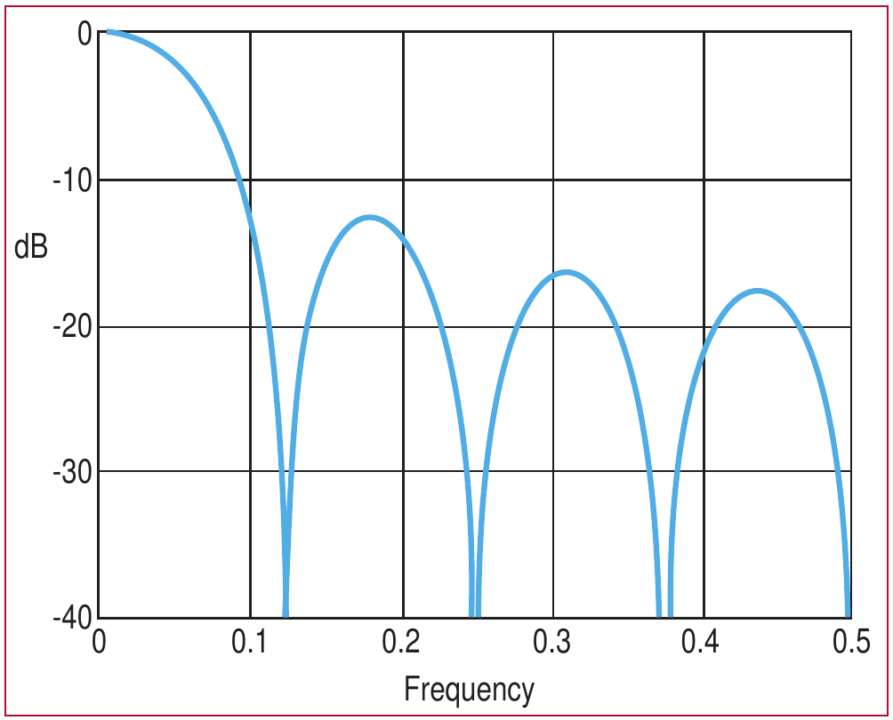
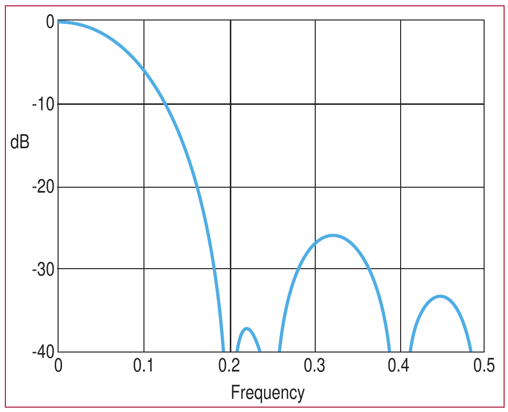
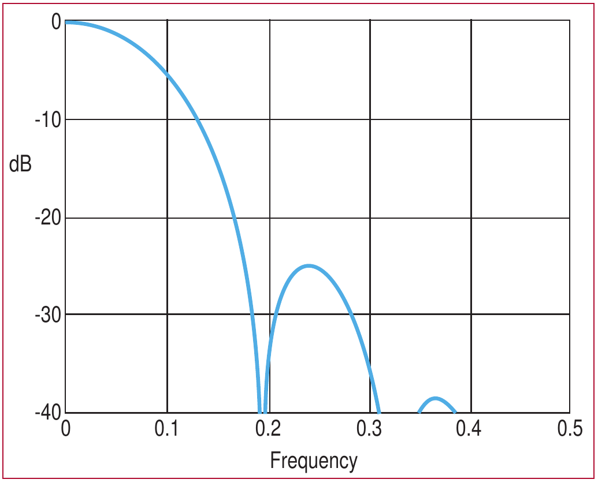
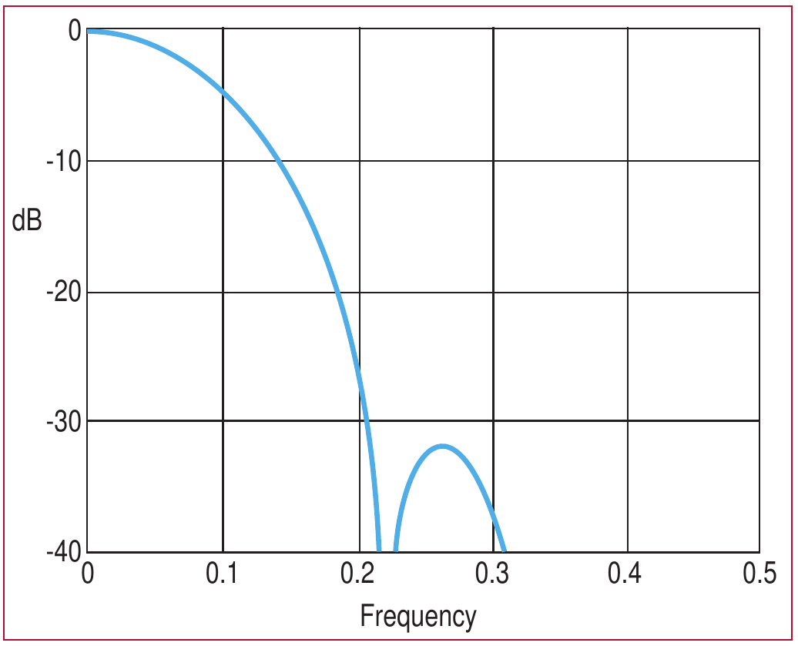
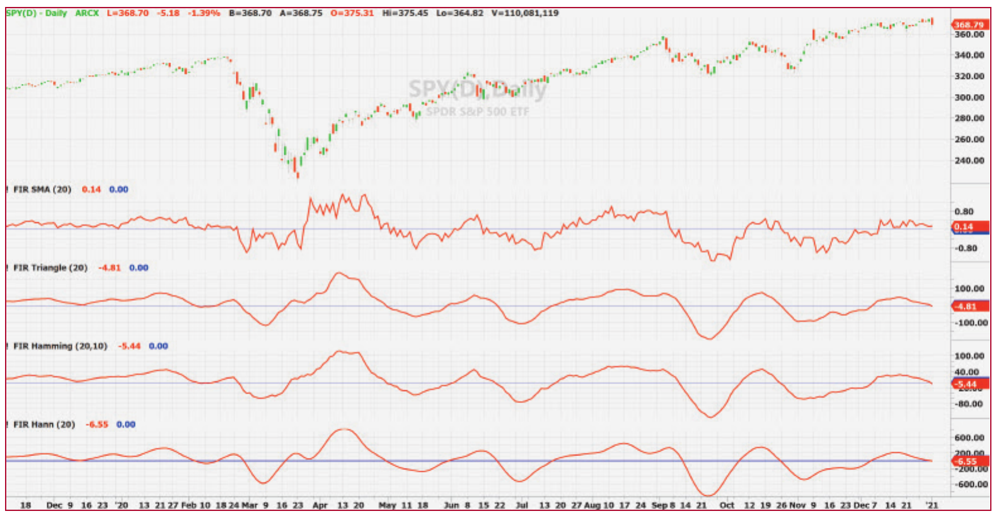
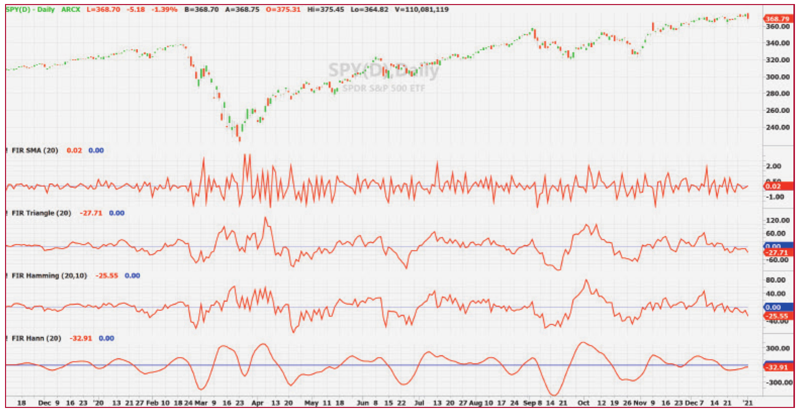

# Windowing

**Triangle, Hamming, Hann**

by John F. Ehlers

- **Article URL:** <https://technical.traders.com/archive/article.asp?file=\V39\C09\297EHLE.pdf>
- **Traders' Tips URL:** <https://www.traders.com/Documentation/FEEDbk_docs/2021/09/TradersTips.html>

---

> In statistics and signal processing, when a waveform or data sequence is multiplied by a window function, the result is the part where they overlap, often thought of as "the view through the window." Windowing can improve the functionality of filters used for trading such as the simple moving average. Which window function works best for this? We'll find out.

## Simple moving averages

Simple moving averages (SMA) are ubiquitous in technical analysis. However, the truth is that they are not very good filters. The purpose of this article is to present simple, easy-to-program modifications that represent a near-optimum compromise between filtering and lag for their use in technical analysis of the market.

The best statistical estimate of the true value of a group of data points is an average of those data points. In the case of a time series, the group of data points for averaging can be selected as an analysis length. Then, this grouping is changed by discarding the oldest data point and adding the new data point. This is a moving average. In this sense, a simple moving average creates the best estimate of the time series by connecting the dots. However, the time center of each filter output is the horizontal center of each of the averages. Thus, the group delay lag is approximately half the length of the averaging period. This lag is unavoidable and cannot be altered in moving average-type filters.

Some traders try to negate the SMA lag by centering the filter results half the filter length back from the current bar. However, this doesn't work because trading is done at the right-hand edge of the chart where the centered moving average cannot exist. Therefore, centered moving averages are to be avoided. Patches to fix the missing data just do not work.

The simple moving average can be viewed as multiplying the data points within the averaging period by unity and multiplying all other data points by zero. The outline of the multiplying factor is therefore a rectangular window whose coefficients are all unity. As the averaging proceeds, the window just slides along the data stream.

Multiplication in the time domain is convolution in the frequency domain. That means that the frequency response of the simple moving average is the Fourier transform of the rectangular window. The Fourier transform of a rectangular window is textbook, and is of the shape of sine(X) / X, where X = π·f·L, and L is the length of the rectangular window measured in data samples. f is the normalized frequency of the response, and it ranges from a minimum of zero to the maximum Nyquist frequency of 0.5.

The frequency response of an eight-element simple moving average is shown in Figure 1. Traders prefer to think in terms of wavelength rather than frequency. Wavelength is the reciprocal of frequency. So, a Nyquist frequency of 0.5 has a two-bar wavelength, a frequency of 0.1 has a 10-bar wavelength, etc.


**Figure 1: Eight-element simple moving average frequency response.** The simple moving average (SMA) is a low-pass filter, meaning that it passes the very low frequencies and attenuates the higher frequencies. The SMA half-power point occurs at a wavelength that is approximately twice the length of the SMA window. Here, this frequency is 0.0625.

With reference to Figure 1, the SMA is a low-pass filter, which means that it passes the very low frequencies and attenuates the higher frequencies. The SMA frequency response has zeros when the data wavelengths are multiples of the window length because the numerator of the Fourier transform goes to zero when the argument of the sine are multiples of pi. The first zero occurs at a frequency of 0.125 (a wavelength of 8). The passband of a filter is defined as the frequency at which the filter attenuates the data by half its power, or the -3 dB point. This occurs at a frequency of 0.056. It is easier to remember the approximation that the -3 dB point occurs at half the wavelength of the first zero. That is, the SMA half-power point occurs at a wavelength that is twice the length of the SMA window. In the case of Figure 1, this frequency is 0.0625.

The peak of the first sidelobe of the SMA filter occurs approximately when the numerator of the sine(X) / X function is unity. In this case, the frequency is 1 / (1.5·L) and X = 1.5·π. If the numerator is unity, then the value of the filter transfer response is just the reciprocal of X, or -13.5 dB. This is not much attenuation. The amplitude of the data is only reduced to about 21% of its unfiltered value at this frequency. This poor attenuation is often referred to as "sidelobe leakage" of the filter. For reference purposes to other filters, the SMA frequency response crosses the identifiable -10 dB grid line at a frequency of 0.092.

As an aside, I was puzzled as a student why sine(X) / X asymptotically approached unity as X approaches zero. Rational functions usually blow up when the denominator approaches zero. The answer is derived by considering the power series expansion of a sine function. It is:

> Sine(X) = X – X³/3! + X⁵/5! - ...

So, if X is very small, then all but the first term can be neglected. Thus, sine(X) / X approaches unity as X approaches zero. I guess small things amuse great minds.

I want to exclude weighted moving average-type filters from this discussion. Weighted moving averages have been proposed as a means to reduce lag. However, they have all the bad characteristics of phase distortion found in exponential moving averages and also have the undesirable group delay lag characteristics as a function of the filter length found in simple moving averages. They have the worst of all worlds. Thus, I am going to only address finite impulse response (FIR) filters, whose coefficients are symmetrical about the center point of the filter.

An impulse is a mathematical rectangle having infinite height and zero width such that the area of the rectangle is unity. More informally, just think of it as a data spike. An FIR filter is one where the filter has an output when the impulse is within the finite window length of the filter. An SMA is a special case of a FIR filter, where the shape of the window is a rectangle. But the coefficients of a FIR filter can trace out any outline shape as long as the window has symmetry about its center point. The reason an SMA has such a poor frequency response is that the rectangular window shape is sharply discontinuous at the leading and trailing edges. Better filtering occurs when smooth transitions occur at the beginning and ends. The outline of good filter coefficients would look more like a bell-shaped curve than a rectangle.

There are a jillion windows (Wikipedia, "Window Function"). Most are difficult to program. Many have such slow transition that a large number of data samples have a minimum contribution to filtering. That means the filters have to be very long to get anywhere near the same amount of smoothing obtainable from an SMA. That means that such filters, while being really good filters, have a large amount of lag. In trading it is better to get an approximate answer with no lag rather than getting the right answer ten bars too late.

> In trading, it is better to get an approximate answer with no lag rather than getting the right answer ten bars too late.

In the sidebar "SMA Indicator," I have provided some EasyLanguage code to compute a finite impulse response simple moving average indicator.

### SMA Indicator

```easylanguage
{
    FIR SMA Indicator
    (C) 2021  John F. Ehlers
}

Inputs:
    Length(20);

Vars:
    Deriv(0),
    Filt(0),
    coef(0),
    ROC(0),
    count(0);

//Derivative of the price wave
Deriv = Close - Open;

Filt = 0;
coef = 0;
For count = 1 to Length Begin
    Filt = Filt + Deriv[count];
    coef = coef + 1;
End;
If coef <> 0 Then Filt = Filt / coef;

ROC = (Length / 6.28)*(Filt - Filt[1]);

Plot1(Filt, "", red, 4, 4);
Plot2(0, "", white, 1, 1);
```

## Triangle windowing

Perhaps the easiest window to program has triangular weighting. For example, an eight-element FIR filter would have the coefficients as [1 2 3 4 4 3 2 1] / 20. You want to divide each of the coefficients by the total sum to cause the filter to have unity gain at zero frequency. This same idea is used when taking an average.

Although triangular weighting still has discontinuities, its frequency response, shown in Figure 2, is a substantial improvement over an SMA. The highest sidelobe is at -26 dB, a whopping 13 dB improvement. The half-power bandwidth is increased to be at 0.072, and for a graphical comparison to the SMA bandwidth, the frequency where the response crosses the -10 dB level is at 0.125. Note the frequency of the first zero has also increased. The beamwidth increases are attributable to a decreased efficiency by not using the full amplitude of all the coefficients. The ratio of the SMA half-power beamwidth to the beamwidth of a windowed filter is called *aperture efficiency*. In this case of the triangular weighting, the aperture efficiency is 77.8%.

In the sidebar "Triangle Window Indicator," I provide some EasyLanguage code to compute a generalized triangularly weighted SMA oscillator.


**Figure 2: Eight-element triangular weighted SMA frequency response.** Although triangular weighting still has discontinuities, its frequency response, shown here, is a substantial improvement over an SMA. The highest sidelobe is at -26 dB, an improvement of 13 dB. For a graphical comparison to the SMA bandwidth, the frequency where the response crosses the -10 dB level is at 0.125.

### Triangle Window Indicator

```easylanguage
{
    FIR Triangle Weighting Indicator
    (C) 2021  John F. Ehlers
}

Inputs:
    Length(20);

Vars:
    Deriv(0),
    Filt(0),
    coef(0),
    SumCoef(0),
    ROC(0),
    count(0);

//Derivative of the price wave
Deriv = Close - Open;

Filt = 0;
SumCoef = 0;
For count = 1 to Length Begin
    If count < Length / 2 Then Begin
        coef = count;
    End;
    If count = Length / 2 Then coef = Length / 2;
    If count > Length / 2 Then Begin
        coef = (Length + 1 - count);
    End;
    Filt = Filt + coef*Deriv[count - 1];
    SumCoef = SumCoef + coef;
End;
If SumCoef <> 0 Then Filt = Filt / SumCoef;

ROC = (Length / 6.28)*(Filt - Filt[1]);

Plot1(Filt, "", red, 4, 4);
Plot2(0, "", white, 1, 1);
```

## Hamming window

Another easy-to-program weighting is called the *Hamming window*. The outline of the shape of the coefficients is called "cosine on a pedestal," although the coefficients are more conveniently calculated as a sine function.

In the sidebar "Hamming Window Indicator," I provide some EasyLanguage code to compute an SMA with a Hamming window. Figure 3 shows the frequency response of an eight-element Hamming window where the first element pedestal height is the sine of 10 degrees. The highest sidelobe is at -25 dB, about the same level as the largest sidelobe obtained with a triangular distribution. However, because the window is a smoother function, almost all the other sidelobes are below -40 dB. The half-power beamwidth is at a frequency of 0.074, also about the same as with the triangular distribution.


**Figure 3: Hamming window with sine(10) pedestal SMA frequency response.** This graph shows the frequency response of an eight-element Hamming window where the first element pedestal height is the sine of 10 degrees. The highest sidelobe is at -25 dB, about the same level as the largest sidelobe obtained with a triangular distribution. However, because the window is a smoother function, almost all the other sidelobes are below -40 dB.

### Hamming Window Indicator

```easylanguage
{
    FIR Hamming Window Indicator
    (C) 2021  John F. Ehlers
}

Inputs:
    Length(20),
    Pedestal(10);

Vars:
    Deriv(0),
    Filt(0),
    coef(0),
    ROC(0),
    count(0);

//Derivative of the price wave
Deriv = Close - Open;

Filt = 0;
coef = 0;
For count = 0 to Length - 1 Begin
    Filt = Filt + Sine(Pedestal + (180 - 2*Pedestal)*count /
        (Length - 1))*Deriv[count];
    coef = coef + Sine(Pedestal + (180 -
        2*Pedestal)*count / (Length - 1));
End;
If coef <> 0 Then Filt = Filt / coef;

ROC = (Length / 6.28)*(Filt - Filt[1]);

Plot1(Filt, "", red, 4, 4);
Plot2(0, "", white, 1, 1);
```

## Hann window

A still-smoother weighting function that is easy to program is called the *Hann window*. The Hann window is often described as a "sine squared" distribution, although it is easier to program as a cosine subtracted from unity. The shape of the coefficient outline looks like a sinewave whose valleys are at the ends of the array and whose peak is at the center of the array. This configuration offers a smooth window transition from the smallest coefficient amplitude to the largest coefficient amplitude.

In the sidebar "Hann Window Indicator," I provide some EasyLanguage code to compute an SMA with a Hann window. Figure 4 shows the frequency response of an eight-element Hann window. The highest sidelobe is at -32 dB, which is the best of the easy-to-program window alternatives. The half-power beamwidth is at a frequency of 0.08, which is only marginally larger than the half-power bandwidth produced by a Hamming window.


**Figure 4: Hann window SMA frequency response.** This graph shows the frequency response of an eight-element Hann window. The highest sidelobe is at -32 dB, which is the best of the easy-to-program window alternatives. The half-power beamwidth is at a frequency of 0.08, which is only marginally larger than the half-power bandwidth produced by a Hamming window.

### Hann Window Indicator

```easylanguage
{
    FIR Hann Window Indicator
    (C) 2021  John F. Ehlers
}

Inputs:
    Length(20);

Vars:
    Deriv(0),
    Filt(0),
    coef(0),
    ROC(0),
    count(0);

//Derivative of the price wave
Deriv = Close - Open;

Filt = 0;
coef = 0;
For count = 1 to Length Begin
    Filt = Filt + (1 - Cosine(360*count / (Length + 1)))*Deriv[count - 1];
    coef = coef + (1 - Cosine(360*count / (Length + 1)));
End;
If coef <> 0 Then Filt = Filt / coef;

ROC = (Length / 6.28)*(Filt - Filt[1]);

Plot1(Filt, "", red, 4, 4);
Plot2(0, "", white, 1, 1);
```

## And the winner is...

So, which of these window functions is the best to use? It comes down to a tradeoff between ease of programming, minimizing sidelobe leakage, and the amount of group delay lag induced to obtain the desired amount of smoothing. From a filtering perspective, there is no clear "best" answer. Figure 5 shows the four FIR filters in comparison, where they all have the length parameter set to 20. They all look pretty much the same, except the SMA is noticeably noisier than the windowed versions.


**Figure 5: Comparison of four windowed FIR filters.** Here you can see the four FIR filters in comparison. They are all similar, except the SMA (simple moving average) is noticeably noisier than the windowed versions.

However, from a trading perspective, the Hann window is the clear winner. I routinely use the rate of change (ROC) of the filter to help with my trading decisions. The ROC identifies the peaks and valleys of the filtered data occurring exactly when the ROC crosses through zero. Having a relatively smooth ROC is therefore important to making unambiguous trading decisions. The rate-of-change operation is a high-pass filter itself, so it exaggerates the high-frequency noise of the filter.

> From a trading perspective, the Hann window is the clear winner.

You can see the relative noisiness when the ROCs of the four filters are plotted in Figure 6. All filters are set to a length of 20 bars. The SMA ROC is very, very noisy. The triangle window ROC is smoother, and even smoother than the ROC of the Hamming window with a 10-degree pedestal. The Hamming window can be made to be smoother by reducing the pedestal size up to a limit. But there is not much benefit in doing that because the Hann window produces the smoothest waveform by far.


**Figure 6: Smoothness comparison of the ROC of four windowed FIR filters.** Plotting the ROCs (rate of change) of the four filters shows their relative noisiness. All the filters are set to a length of 20 bars. The SMA ROC is the noisiest. The Hann window produces the smoothest waveform by far.

In summary, windowing can improve the functionality of simple moving averages for trading. The selection of the window function to be used is a tradeoff between the ease of programming for each of them, as well as the tradeoff of desired smoothness and group delay lag induced by the window. In many cases, a triangle window function may be good enough, because it is super easy to program. If the rate of change is used to help make trading decisions, then the use of the Hann window is the hands-down best choice.

## Further reading

- "Window Function," https://en.wikipedia.org/wiki/Window_function.

---

See our Traders' Tips section beginning on page 50 for implementation of John Ehlers' technique in various technical analysis programs and trading platforms. Accompanying program code can be found in the Traders' Tips area at Traders.com.

---

## References

```bibtex
@article{ehlers2021windowing,
  author  = {Ehlers, John F.},
  title   = {Windowing},
  journal = {Technical Analysis of Stocks \& Commodities},
  year    = {2021},
  volume  = {39},
  number  = {9},
  pages   = {8--14},
  month   = sep,
  url     = {https://technical.traders.com/archive/article.asp?file=\V39\C09\297EHLE.pdf}
}

@misc{traderstips2021sep,
  title        = {Traders' Tips},
  year         = {2021},
  month        = sep,
  howpublished = {Technical Analysis of Stocks \& Commodities, v.~39:9},
  url          = {https://www.traders.com/Documentation/FEEDbk_docs/2021/09/TradersTips.html}
}
```
