# Traders' Tips: Windowing

Implementations of John Ehlers' "Windowing" article (TASC, September 2021) across various platforms.

## TradeStation

In his article '''Windowing''' in this issue, author John Ehlers presents several window functions and explains how they can be applied to simple moving averages to enhance their functionality for trading. Afterwards, he discusses how he uses the rate of change (ROC) to further assist in trading decisions.

Sample charts are shown in Figure 1 and 2 showing the indicators applied and the ROC indicator version applied.

FIGURE 1: TRADESTATION. This displays a TradeStation daily chart of the S&P 500 ETF (SPY) with the indicators applied.

FIGURE 2: TRADESTATION. This displays a TradeStation daily chart of the S&P 500 ETF (SPY) with the rate of change (ROC) indicator versions applied.

This article is for informational purposes. No type of trading or investment recommendation, advice, or strategy is being made, given, or in any manner provided by TradeStation Securities or its affiliates.

'''John Robinson
TradeStation Securities, Inc.
www.TradeStation.com

BACK TO LIST

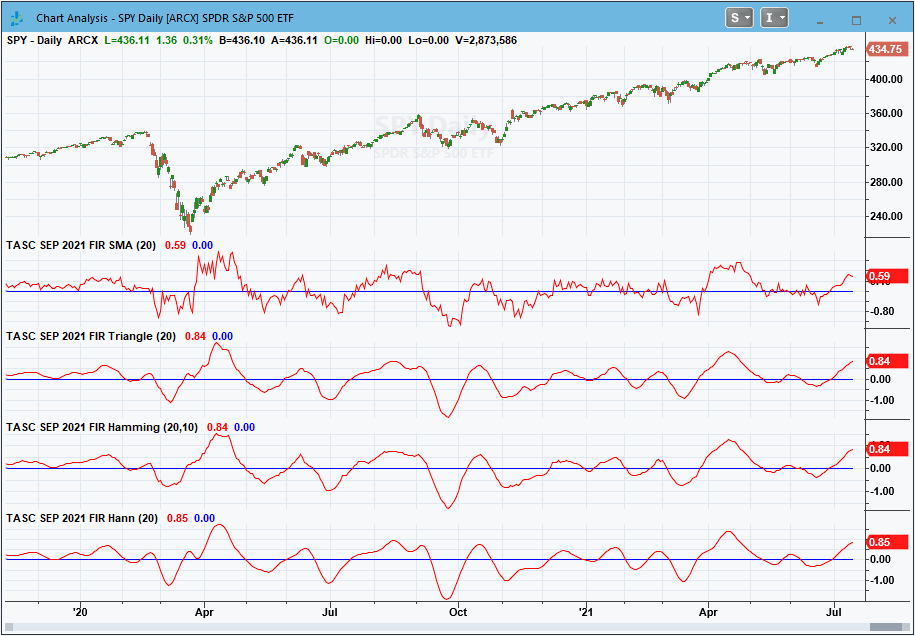

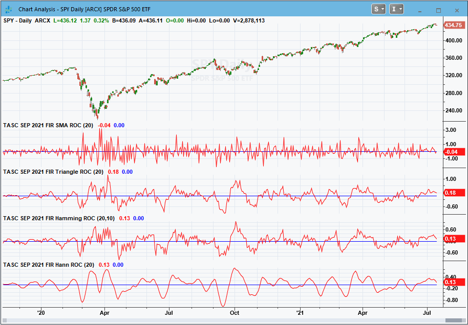

> Code file: [`Windowing.els`](code/Windowing.els)

```easylanguage
Indicator:  TASC SEP 2021 FIR SMA
{
	TASC SEP 2021
	FIR SMA Indicator
	(C) 2021   John F. Ehlers
}

Inputs:
	Length(20);	

Vars:
	Deriv(0), 
	Filt(0),
	coef(0),
	ROC(0),
	count(0);

//Derivative of the price wave	
Deriv = Close - Open;

Filt = 0;
coef = 0;
For count = 1 to Length Begin
	Filt = Filt + Deriv[count];
	coef = coef + 1;
End;
If coef <> 0 Then Filt = Filt / coef;

ROC = (Length / 6.28)*(Filt - Filt[1]);
	
Plot1(Filt);
Plot2(0);
 

Indicator:  TASC SEP 2021 FIR Triangle
{
	TASC SEP 2021
	FIR Triangle Weighting Indicator
	(C) 2021   John F. Ehlers
}

Inputs:
	Length(20);	

Vars:
	Deriv(0), 
	Filt(0),
	coef(0),
	SumCoef(0),
	ROC(0),
	count(0);

//Derivative of the price wave	
Deriv = Close - Open;

Filt = 0;
SumCoef = 0;
For count = 1 to Length Begin
	If count  Length / 2 Then Begin
		coef = (Length + 1 - count);
	End;
	Filt = Filt + coef*Deriv[count - 1];
	SumCoef = SumCoef + coef;
End;
If SumCoef <> 0 Then Filt = Filt / SumCoef;

ROC = (Length / 6.28)*(Filt - Filt[1]);

Plot1(Filt);
Plot2(0);
 

Indicator:  TASC SEP 2021 FIR Hamming
{
	TASC SEP 2021
	FIR Hamming Window Indicator
	(C) 2021   John F. Ehlers
}

Inputs:
	Length(20),
	Pedestal(10);	

Vars:
	Deriv(0), 
	Filt(0),
	coef(0),
	ROC(0),
	count(0);

//Derivative of the price wave	
Deriv = Close - Open;

Filt = 0;
coef = 0;
For count = 0 to Length - 1 Begin
	Filt = Filt + Sine(Pedestal + (180 - 2*Pedestal)*count / (Length - 1))*Deriv[count];
	coef = coef + Sine(Pedestal + (180 - 2*Pedestal)*count / (Length - 1));
End;
If coef <> 0 Then Filt = Filt / coef;

ROC = (Length / 6.28)*(Filt - Filt[1]);
	
Plot1(Filt);
Plot2(0);{

 
Indicator:  TASC SEP 2021 FIR Hann
{
	TASC SEP 2021
	FIR Hann Window Indicator
	(C) 2021   John F. Ehlers
}

Inputs:
	Length(20);	

Vars:
	Deriv(0), 
	Filt(0),
	coef(0),
	ROC(0),
	count(0);

//Derivative of the price wave	
Deriv = Close - Open;

Filt = 0;
coef = 0;
For count = 1 to Length Begin
	Filt = Filt + (1 - Cosine(360*count / (Length + 1)))*Deriv[count - 1];
	coef = coef + (1 - Cosine(360*count / (Length + 1)));
End;
If coef <> 0 Then Filt = Filt / coef;

ROC = (Length / 6.28)*(Filt - Filt[1]);
	
Plot1(Filt);
Plot2(0);
```

---

## thinkorswim

We put together a handful of studies related to the studies discussed by John Ehlers in his article in this issue titled '''Windowing.''' We built the studies referenced by using our proprietary scripting language, thinkscript. To ease the process of adding the studies to thinkorswim, simply click on the link below for the study or enter the address into setup'''open shared item from within thinkorswim, then choose view thinkScript study and name the study with the corresponding name. The studies are as follows:

Figure 3 shows the studies added to a one-year daily chart of SPY. Please see John Ehlers''' article in this issue for more information on how to read and utilize these studies.

FIGURE 3: THINKORSWIM. This example chart shows the studies added to a one-year daily chart of SPY.

'''thinkorswim
A division of TD Ameritrade, Inc.
www.thinkorswim.com

BACK TO LIST

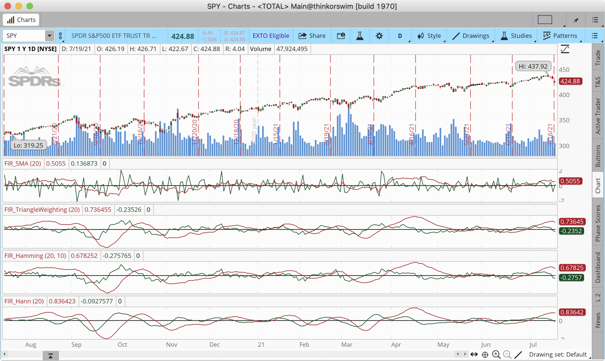

---

## eSIGNAL

For this month'''s Traders''' Tip, we'''ve provided the FIR SMA Indicators.efs study based on the article by John Ehlers, '''Windowing.''' This study improves the functionality of a simple moving average by reducing lag.

The studies contain formula parameters which may be configured through the edit chart window (right-click on the chart and select '''edit chart'''). A sample chart is shown in Figure 4.

FIGURE 4: eSIGNAL. Here is an example of the study plotted on a daily chart of SPY.

To discuss this study or download a complete copy of the formula code, please visit the EFS library discussion board forum under the forums link from the support menu at www.esignal.com or visit our EFS KnowledgeBase at www.esignal.com/support/kb/efs. The eSignal formula script (EFS) is also available for copying & pasting below.

'''Eric Lippert
eSignal, an Interactive Data company
800 779-6555, www.eSignal.com

BACK TO LIST

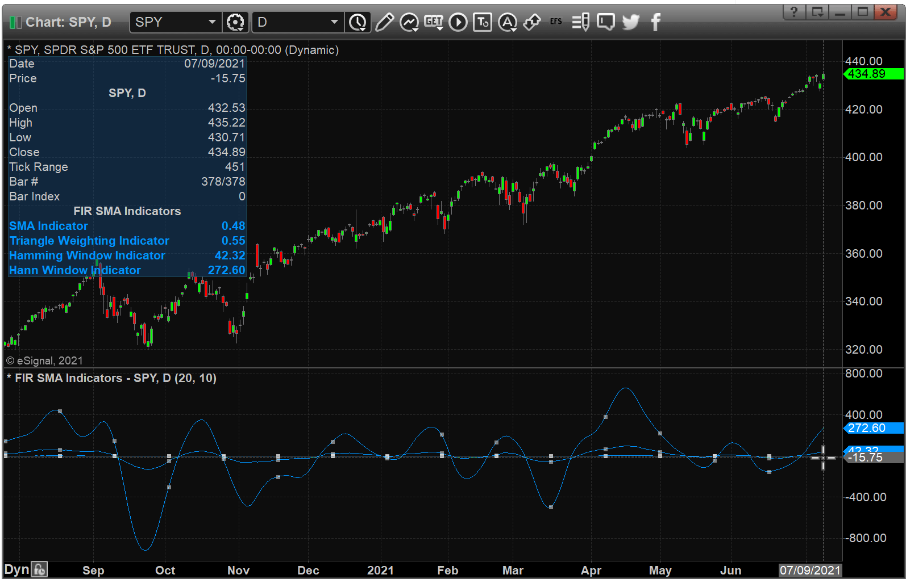

> Code file: [`Windowing.efs`](code/Windowing.efs)

```javascript
/**********************************
Provided By:  
Copyright 2019 Intercontinental Exchange, Inc. All Rights Reserved. 
eSignal is a service mark and/or a registered service mark of Intercontinental Exchange, Inc. 
in the United States and/or other countries. This sample eSignal Formula Script (EFS) 
is for educational purposes only. 
Intercontinental Exchange, Inc. reserves the right to modify and overwrite this EFS file with each new release. 

Description:      
    Windowing
    by John F. Ehlers
    

Version:            1.00  07/09/2021

Formula Parameters:                    Default:
Length                                 20
Pedestal                               10

Notes:
The related article is copyrighted material. If you are not a subscriber
of Stocks & Commodities, please visit www.traders.com.

**********************************/
var fpArray = new Array();
var bInit = false;

function preMain() {
    setStudyTitle("FIR SMA Indicators");
    setCursorLabelName("SMA Indicator", 0);
    setCursorLabelName("Triangle Weighting Indicator", 1);
    setCursorLabelName("Hamming Window Indicator", 2);
    setCursorLabelName("Hann Window Indicator", 3);
    setPriceStudy(false);  
    
    var x=0;
    fpArray[x] = new FunctionParameter("Length", FunctionParameter.NUMBER);
	with(fpArray[x++]){
        setLowerLimit(1);
        setDefault(20);
    }
    fpArray[x] = new FunctionParameter("Pedestal", FunctionParameter.NUMBER);
	with(fpArray[x++]){
        setLowerLimit(1);
        setDefault(10);            
    }       
}

var bVersion = null;
var xClose = null;
var xOpen = null;
var xDeriv = null;
var xFilt = null;
var xFiltTr = null;
var xFiltHam = null;
var xFiltHann = null;


function main(Length, Pedestal) {
    if (bVersion == null) bVersion = verify();
    if (bVersion == false) return; 
    
    if ( bInit == false ) { 
        xClose = close();  
        xOpen = open();
        xDeriv = efsInternal("Calc_Deriv", xClose, xOpen);
        xFilt =  efsInternal("Calc_Filt", Length, xDeriv);
        xFiltTr = efsInternal("Calc_FiltTr", Length, xDeriv);
        xFiltHam = efsInternal("Calc_FiltHam", Length, xDeriv, Pedestal);
        xFiltHann = efsInternal("Calc_FiltHann", Length, xDeriv);
        
        addBand( 0, PS_DASH, 1, Color.grey); 
        
        bInit = true; 
    }      

    if (getCurrentBarCount()  (Length/2)) Coef = (Length + 1 - i);
        Filt = Filt + (Coef * xDeriv.getValue( - i + 1));
        SumCoef = SumCoef + Coef;
    }
    if (SumCoef != 0) return (Filt/SumCoef)*100;  
    return Filt*100;
}

function Calc_Filt(Length, xDeriv){
    var Filt = 0;
    var Coef = 0;
    for (var i = 1; i <= Length; i++){
        Filt = Filt + xDeriv.getValue(-i)
        Coef = Coef + 1;
    }
    if (Coef != 0) return (Filt/Coef);  
    return Filt;
}

function Calc_Deriv(xClose, xOpen){
    var ret = 0;
    ret = xClose.getValue(0) - xOpen.getValue(0); 
    return ret;
}

function verify(){
    var b = false;
    if (getBuildNumber() < 779){
        
        drawTextAbsolute(5, 35, "This study requires version 10.6 or later.", 
            Color.white, Color.blue, Text.RELATIVETOBOTTOM|Text.RELATIVETOLEFT|Text.BOLD|Text.LEFT,
            null, 13, "error");
        drawTextAbsolute(5, 20, "Click HERE to upgrade.@URL=https://www.esignal.com/download/default.asp", 
            Color.white, Color.blue, Text.RELATIVETOBOTTOM|Text.RELATIVETOLEFT|Text.BOLD|Text.LEFT,
            null, 13, "upgrade");
        return b;
    } 
    else
        b = true;
    
    return b;
}
```

---

## NinjaTrader

The FIR SMA, FIR triangle, FIR Hamming, and FIR Hann indicators, as discussed in John Ehlers''' article in this issue '''Windowing,''' are available for download at the following links for NinjaTrader 8 and for NinjaTrader 7:

Once the file is downloaded, you can import the indicators into NinjaTrader 8 from within the control center by selecting Tools ''' Import ''' NinjaScript Add-On and then selecting the downloaded file for NinjaTrader 8. To import in NinjaTrader 7, from within the control center window, select the menu File ''' Utilities ''' Import NinjaScript and select the downloaded file.

You can review the source code for these indicators in NinjaTrader 8 by selecting the menu New ''' NinjaScript Editor ''' Indicators from within the control center window and selecting the FIRSMA, FIRTriangle, FIRHamming, or FIRHann file. You can review the strategies''' source code in NinjaTrader 7 by selecting the menu Tools ''' Edit NinjaScript ''' Indicator from within the control center window and selecting the FIRSMA, FIRTriangle, FIRHamming, or FIRHann file.

NinjaScript uses compiled DLLs that run native, not interpreted, which provides you with the highest performance possible.

A sample chart displaying these indicators is shown in Figure 5.

FIGURE 5: NINJATRADER. This daily chart shows the SPDR S&P 500 ETF (SPY) with the FIR SMA in the top-most pane, followed by the FIR triangle weighting indicator, the FIR Hamming window indicator, and the FIR Hann window indicator, from January 2020 through January 2021.

'''Kate Windheuser
NinjaTrader, LLC
www.ninjatrader.com

BACK TO LIST

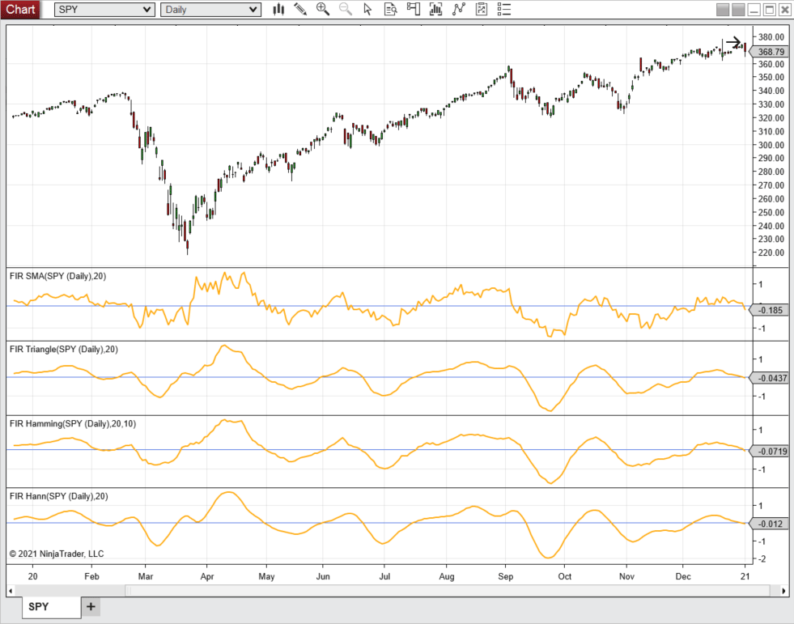

> Pre-existing code files: [`ninja-trader/`](../ninja-trader/) (FIRHamming.cs, FIRHann.cs, FIRSMA.cs, FIRTriangle.cs)

---

## Wealth-Lab.com

We have added the four windowed finite impulse response (FIR) filters to Wealth-Lab 7 for the convenience of our users. The chart in Figure 6 shows how they compare on a chart of SPY.

FIGURE 6: WEALTH-LAB. This example chart shows a comparison of the four windowed FIR filters.

'''Gene Geren, Robert Sucher
Wealth-Lab team
www.wealth-lab.com

BACK TO LIST

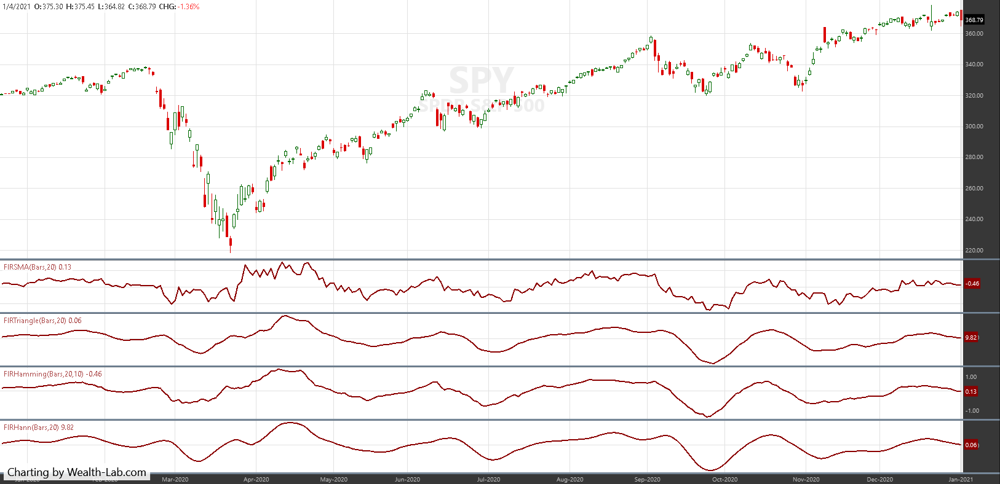

> Code file: [`Windowing.cs`](code/Windowing.cs)

```csharp
using WealthLab.Backtest;
using System;
using WealthLab.Core;
using WealthLab.Indicators;
using WealthLab.TASC;
using System.Drawing;
using System.Collections.Generic;

namespace WealthScript1 
{
    public class MyStrategy : UserStrategyBase
    {
        /* create indicators and other objects here, this is executed prior to the main trading loop */
        public override void Initialize(BarHistory bars)
        {
		fs = FIRSMA.Series(bars, 20);
		ft = FIRTriangle.Series(bars, 20);
		fh1 = FIRHamming.Series(bars, 20,10);
		fh2 = FIRHann.Series(bars, 20);

		PlotIndicator(fs, Color.DarkRed, PlotStyles.Line, false, "fSMA");
		PlotIndicator(ft, Color.DarkRed, PlotStyles.Line, false, "fTriangle");
		PlotIndicator(fh1, Color.DarkRed, PlotStyles.Line, false, "fHamming");
		PlotIndicator(fh2, Color.DarkRed, PlotStyles.Line, false, "fHann");

		SetPaneDrawingOptions("fSMA", 20, 50);
		SetPaneDrawingOptions("fTriangle", 20, 51);
		SetPaneDrawingOptions("fHamming", 20, 52);
		SetPaneDrawingOptions("fHann", 20, 53);
        }

        /* execute the strategy rules here, this is executed once for each bar in the backtest history */
        public override void Execute(BarHistory bars, int idx)
        {
        }

		/* declare private variables below */
		FIRSMA fs; FIRTriangle ft; FIRHamming fh1; FIRHann fh2;
	}
}
```

---

## Optuma

The four windowed finite impulse response (FIR) filters discussed in John Ehlers''' article in this issue ('''Windowing''') have been added to Optuma'''s suite of 17 Ehlers tools available to users of Optuma (see www.optuma.com/ehlers for a complete list). See Figure 7 for an example chart of the indicators.

FIGURE 7: OPTUMA. This sample chart displays a 20-period SMA, the triangle FIR, Hamming FIR, and Hann FIR to a chart of the SPDR S&P 500 ETF (SPY).

'''support@optuma.com
www.optuma.com

BACK TO LIST

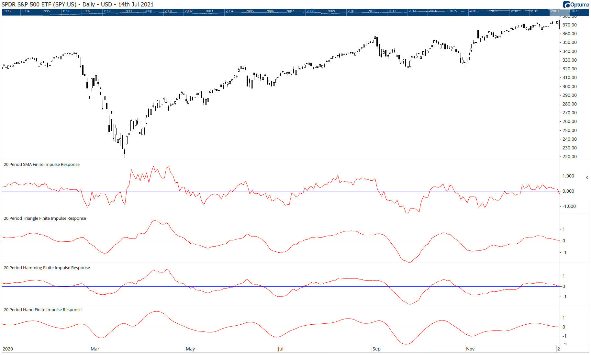

---

## NeuroShell Trader

John Ehlers''' windowing indicators described in his article in this issue can be easily implemented in NeuroShell Trader using NeuroShell Trader'''s ability to call external dynamic linked libraries. Dynamic linked libraries can be written in C, C++, and Power Basic.

After moving the EasyLanguage code given in the article to your preferred compiler and creating a DLL, you can insert the resulting indicators as follows:

A sample chart displaying the indicators is shown in Figure 8.

FIGURE 8: NEUROSHELL TRADER. This NeuroShell Trader chart shows the SMA, triangle-weighted, Hamming, and Hann window indicators applied to SPY.

Similar filter and cycle-based strategies can also be created using indicators found in John Ehlers''' Cybernetic and MESA91 NeuroShell Trader Add-ons.

Users of NeuroShell Trader can go to the Stocks & Commodities section of the NeuroShell Trader free technical support website to download a copy of this or any previous Traders''' Tips.

'''Ward Systems Group, Inc.
sales@wardsystems.com
www.neuroshell.com

BACK TO LIST

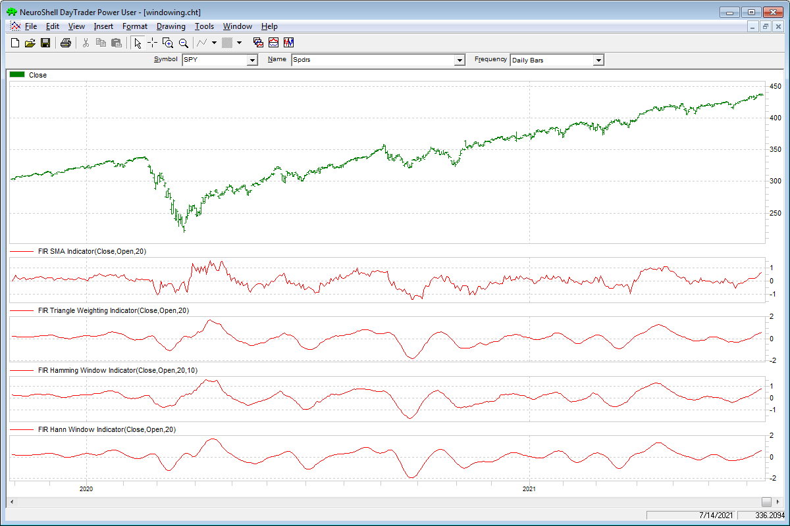

---

## TradersStudio

The importable TradersStudio files based on John Ehlers''' article in this issue, '''Windowing,''' can be obtained on request via email to info@TradersEdgeSystems.com. The code is also shown below, where:

Figure 9 demonstrates the indicators on a chart of Amazon Inc. (AMZN) from 2012 to 2014.

FIGURE 9: TRADERSSTUDIO. The FILT TRIANGLE indicator is shown here on a chart of Amazon Inc. (AMZN) from 2012 to 2014.

'''Richard Denning
info@TradersEdgeSystems.com
for TradersStudio

BACK TO LIST

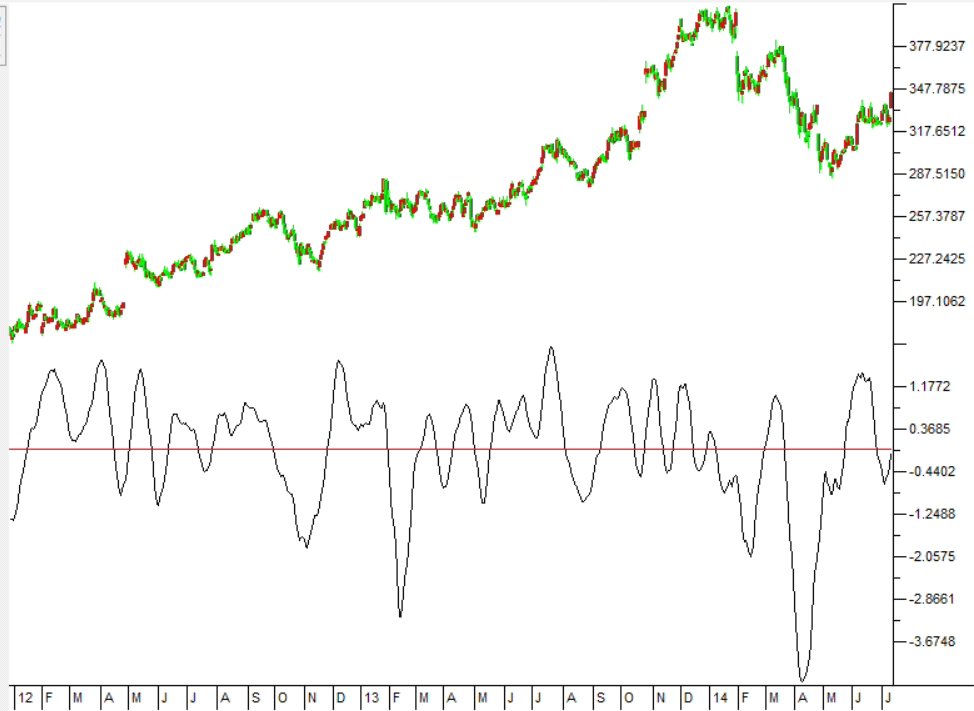

> Code file: [`Windowing.trs`](code/Windowing.trs)

```basic
'WINDOWING 
'Author: John F. Ehlers, TASC September 2021
'Coded by Richard Denning, 7/18/21

Function EHLERS_FIT_TRIANGLE(Length)

    Dim Deriv As BarArray
    Dim Filt As BarArray
    Dim coef As BarArray
    Dim SumCoef As BarArray
    Dim theROC As BarArray
    Dim count

    If BarNumber=FirstBar Then
        'Length = 20
        Deriv = 0
        Filt = 0
        coef = 0
        SumCoef = 0
        theROC = 0
        count = 0
    End If

    Deriv = Close - Open
    Filt = 0
    SumCoef = 0
    For count = 1 To Length
        If count  Length / 2 Then
            coef = (Length + 1 - count)
        End If
        Filt = Filt + coef*Deriv[count - 1]
        SumCoef = SumCoef + coef
    Next
    If SumCoef <> 0 Then
        Filt = Filt / SumCoef
    End If
    theROC = (Length / 6.28)*(Filt - Filt[1])
    EHLERS_FIT_TRIANGLE = Filt
End Function
'---------------------------------------------
'INDICATOR PLOT FOR TRIANGLE INDICATOR:
Dim Filt As BarArray
Filt = EHLERS_FIT_TRIANGLE(length)
PLOT1(Filt)
PLOT2(0)

End Sub
'---------------------------------------------
```

---

## The Zorro Project

Indicators can be improved by preprocessing their input data. John Ehlers, in his article in this issue, proposes using the windowing technique to preprocess data'''that is, multiplying the input data by an array of factors. In his article, he demonstrates implementing triangle, Hamming, and Hann windowing to the simple moving average (SMA) indicator.

Fortunately, Zorro'''s C language allows windowing functions that work for any indicator:

Any of the three functions takes a time series, multiplies it with a specific window array, and generates an output series to be fed to the indicator. The output is not normalized because that'''s irrelevant for the curve. To replicate the chart in Ehlers''' article, we can use the following code to display the SMA indicator on the SPY price curve derivative:

The resulting chart in Figure 10 displays first the original SMA, and below the SMA you see a triangle, Hamming, and Hann data window.

FIGURE 10: ZORRO PROJECT. This example chart displays the SMA indicator on the SPY price curve derivative. The original SMA is shown at top, and below that, the SMA applied on a triangle, Hamming, and Hann data window.

For testing the smoothness of the indicator, Ehlers uses the rate-of-change (ROC) of the SMA. The code in C for Zorro is as follows:

Now we can replicate the ROC chart in Ehlers''' article by replacing the SMA in the run() function with ROC_SMA. In Figure 11, we again show first the original ROC_SMA, and below that, a triangle, Hamming, and Hann data window.

FIGURE 11: ZORRO PROJECT. This example chart replicates the chart in John Ehlers''' article in this issue. The original ROC_SMA is displayed at the top, and below that you see the triangle, Hamming, and Hann data window.

We see in the chart that the Hann window indeed generates the smoothest curve, and this at no cost of lag.

The windowing functions and test script can be downloaded from the 2021 script repository on https://financial-hacker.com. The Zorro platform can be downloaded from https://zorro-project.com.

'''Petra Volkova
The Zorro Project by oP group Germany
https://zorro-project.com

BACK TO LIST

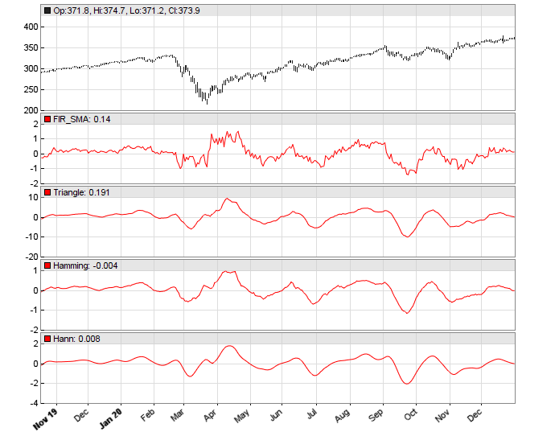

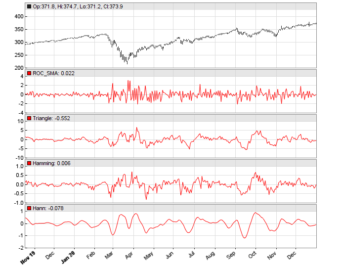

> Code file: [`Windowing.c`](code/Windowing.c)

```c
vars triangle(vars Data, int Length)
{
  vars Out = series(0,Length);
  int i;
  for(i=0; i<Length; i++)
    Out[i] = Data[i] * ifelse(i<Length/2,i+1,Length-i);
  return Out;
}

vars hamming(vars Data, int Length, var Pedestal)
{
  vars Out = series(0,Length);
  int i;
  for(i=0; i<Length; i++)
    Out[i] = Data[i] * sin(Pedestal+(PI-2*Pedestal)*(i+1)/(Length-1));
  return Out;
}

vars hann(vars Data, int Length)
{
  vars Out = series(0,Length);
  int i;
  for(i=0; i<Length; i++)
    Out[i] = Data[i] * (1-cos(2*PI*(i+1)/(Length+1)));
  return Out;
}
```

```c
void run()
{
  StartDate = 20191101;
  EndDate = 20210101;
  BarPeriod = 1440;

  assetAdd("SPY","STOOQ:*"); // load data from STOOQ
  asset("SPY");

  vars Deriv = series(priceClose() - priceOpen());
  plot("FIR_SMA",SMA(Deriv,20),NEW,RED);
  plot("Triangle",SMA(triangle(Deriv,20),20),NEW,RED);
  plot("Hamming",SMA(hamming(Deriv,20,10*PI/360),20),NEW,RED);
  plot("Hann",SMA(hann(Deriv,20),20),NEW,RED);
}
```

```c
var ROC_SMA(vars Data,int Length)
{ 
  vars Filt = series(SMA(Data,Length),2);
  return Length/(2*PI)*(Filt[0]-Filt[1]);
}
```

---

## Microsoft Excel

In his article in this issue, '''Windowing,''' John Ehlers takes a step into the world of finite impulse response (FIR) filters using four different weighted moving averages (WMA), each with a different weighting profile.

First up, there is our old friend, the simple moving average. SMA uses a constant weighting coefficient of 1.0 for all terms within the SMA window.

The remaining three indicators in the article each use a different computation to determine the weight to be applied to each term in their WMA window. And, while it is not a requirement of WMAs, the weighting factors resulting from each of these particular formulations are symmetrical around the center of their windowing period, which you will see in Figure 14.

The similarities of the filter tracings are easy to see in the four-way grouping in Figure 12. The differences become more evident when you drill down by using the checkboxes to the right of the charts.

FIGURE 12: EXCEL. All four filters are on display in this chart. Checkboxes to the right of the chart allow you to mix and match.

Ehlers uses a '''rate of change''' (ROC) calculation to explore how much smoothing is afforded by each of the four weighting scenarios. Radio buttons to the right of the charts shift the charts from displaying the filters to the ROC display shown in Figure 13.

FIGURE 13: EXCEL. This displays the rate of change analysis of the filters.

A quick visual inspection shows that SMA can be pretty noisy. Again, you can use the checkboxes to drill down into the ROC displays.

One last thought came to mind in building this spreadsheet. How do the coefficients for the various filter types compare? As calculated here, the raw coefficients for each filter type differ from one another by as much as an order of magnitude.

For a weighted moving average calculation, you multiply each element within the averaging window by a predetermined coefficient and sum the result. You then divide the summed result by the sum of the coefficients.

With a bit of basic algebra you can distribute the division by the sum-of-coefficients across the terms to see that the resulting WMA on '''n''' terms is a sum of the form:

We can use the Coef-x/SumOfCoefs construct to normalize the coefficients for the different filters to the same scale and then chart them on the same graph as in Figure 14. Note that regardless of the envelope shape, the normalized weighted average coefficients always total to 1.00.

FIGURE 14: EXCEL. Here you can see a comparison of the coefficient envelopes.

To download this spreadsheet: The spreadsheet file for this Traders''' Tip can be downloaded here. To successfully download it, follow these steps:

'''Ron McAllister
Excel and VBA programmer
rpmac_xltt@sprynet.com

BACK TO LIST

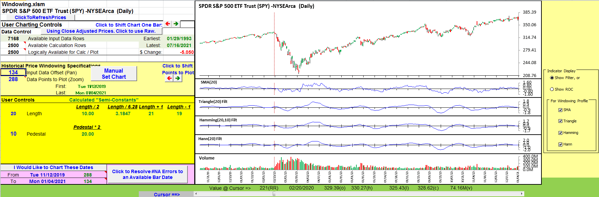

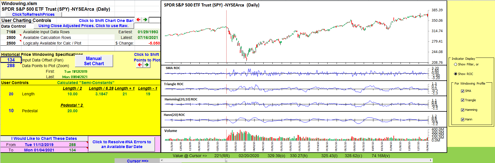

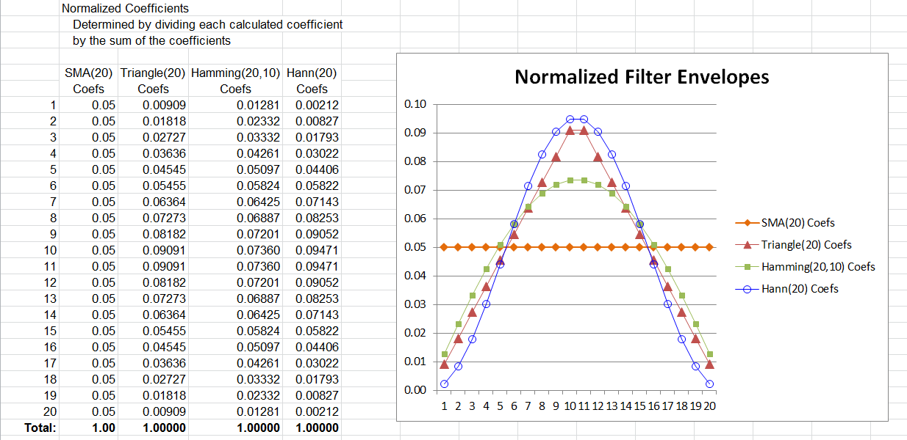

> Code file: [`Windowing.txt`](code/Windowing.txt)

```text
WMA-n = Coef-1/SumOfCoefs * Term-1 + Coef-2/SumOfCoefs*Term-2 +���+ Coef-n/SumOfCoefs*Term-n
```

---

## References

```bibtex
@misc{traderstips202109windowing,
  title     = {Traders' Tips: Windowing},
  journal   = {Technical Analysis of Stocks \& Commodities},
  volume    = {39},
  number    = {9},
  year      = {2021},
  month     = sep,
  url       = {https://www.traders.com/Documentation/FEEDbk_docs/2021/09/TradersTips.html}
}
```
