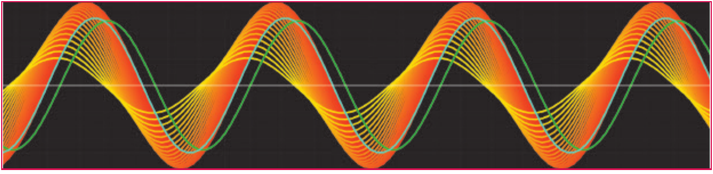
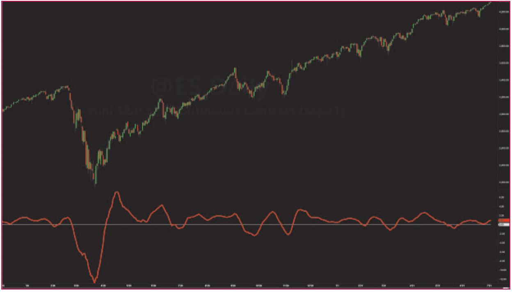

# Cycle/Trend Analytics And The MAD Indicator

**A New Trend Indicator**

by John F. Ehlers

- **Article URL:** <https://technical.traders.com/archive/article.asp?file=\V39\C10\314EHLE.pdf>
- **Traders' Tips URL:** <https://www.traders.com/Documentation/FEEDbk_docs/2021/10/TradersTips.html>

---

> Here, we introduce the moving average difference (MAD) indicator and explain the rationale behind its creation. You will find the indicator is robust yet reflects simplicity.

I have been conducting a research project that I started as a way to gain insight into the characteristics of cycles in market data. (See my May 2021 S&C article, "A Technical Description Of Market Data For Traders," and my February 2021 article, "Creating More Robust Trading Strategies With The FM Demodulator"). Ultimately, the research led to my development of a new trend indicator—the moving average difference (MAD) oscillator.

In this article, I will demonstrate this new indicator, provide the details of my research and the indicator development, and describe what the oscillator is showing you, which will reveal its rationale. I will also provide code for it so you can implement it yourself.

I think you will find that this trend indicator is robust across a range of input parameters and yet has the elegance of simplicity.

## An oscillator-style indicator

When I began my research project, I wanted to display an oscillator in a way that would demonstrate how the oscillator would behave as the length of the moving average was varied. This could provide some of the insights into the characteristics of cycles that I was looking for. The idea was to display the oscillator in a range of colors as a function of the length of the moving average.

One way to create an oscillator-style indicator is to subtract the moving average of price from price itself. The moving average contains the DC (zero-frequency) component and the low-frequency components of the data. So, subtracting the moving average from price results in an indicator that has a nominal zero mean and the higher-frequency cycle components in the data.

The sidebar "Cycle/Trend Analytics" provides EasyLanguage code that displays an oscillator in a range of colors as a function of the length of the moving average.

## Cycle mode

In the code given in the "Cycle/Trend Analytics" sidebar, which is code to display the oscillator in a color scheme, the default mode is "cycle." In that mode, price, which starts as the close, is overwritten as a 30-bar period sine wave. A cyan line is plotted to show the input price. The difference between two moving averages was added later, so that line will be ignored for now. Moving averages and the oscillator (osc) array were computed over a range from 5 to 30 bars. Each *osc* was assigned a value for the color green from 255 to 0 as the length was varied from 5 to 30. This value, combined with the color red, produced a net color of bright yellow when the length is 5 and a color of bright red when the length is 30.

The resulting display for the "cycle" mode is shown in Figure 1. The indicator output leads the input by almost 90 degrees for the shortest moving average. This is no great surprise, because a short moving average is almost like the price, but delayed a small amount. It looks like a momentum function when the difference is taken. But a momentum is analogous to a derivative in calculus, and the derivative of a sine wave is a cosine wave. In other words, the indicator output leads the phase of the input by about 90 degrees.


**Figure 1: Cycle mode.** Cycle/trend analytics shows the response to a pure cycle over the range of moving average values.

The indicator output is exactly in phase with the price input when the length of the moving average is one half the cycle period. Again, this is no surprise, because the summation of a sine wave over a half cycle period is exactly in phase with the price cycle in the same frame of reference. The indicator has a relatively lagging phase when the length of the moving average is greater than a half cycle period.

## Trend mode

The surprise comes when changing the CTMode input from "cycle" to "trend" in the operation of the code. This input change causes the block of code containing a theoretical sine wave data input to be ignored when the code runs. In this case, the value of price as the close is not overwritten, and we see the indicator applied to real data. An example of the indicator applied to closing prices is shown in Figure 2.

> This trend indicator is robust across a range of input parameters and yet has the elegance of simplicity.

The surprising result (to me) is that the predominant effect is that the amount of separation between the reddest line and the yellowest line reflects the strength of the trend. When the red line is on top, the trend is up. When the red line is on the bottom, the trend is down.

Moreover, the high-frequency squiggles in all the indicators tend to be nearly the same. That is because when the difference is taken between the price and its average, all of the indicator lines have similar high-frequency content.


**Figure 2: Trend mode.** The cycle/trend analytic shows the strength of the trend as the width of the displays. The amount of separation between the reddest line and the yellowest line reflects the strength of the trend. When the red line is on top, the trend is up. When the red line is on the bottom, the trend is down.

So, the idea is to show the trend by taking the difference of two oscillators. The high-frequency components are canceled when the difference is taken. If the difference of the length of the two moving averages are one half the period of the dominant cycle, then the resultant will be exactly in phase with the input price. You can verify this by changing the length of the second moving average in the plotting of the green line to 20. This makes the difference between the length of the two moving averages 15, exactly one half the length of the 30-bar cycle. The result is that the green line is overwritten by the cyan line, showing the two are exactly in phase.

Taking the difference of the two oscillator indicators is mathematically the same as just taking the difference of the two moving averages, because the price term in each oscillator is canceled.

## A "thinking man's" MACD

So there you have it. Although the derivation is convoluted, the MAD (moving average difference) indicator is basically just the difference of two simple moving averages whose averaging lengths are different by approximately half the period of the dominant cycle in the data. The indicator becomes smoother as the length of the shorter moving average is increased. The length of the longer moving average should be the length of the shorter one plus half the period of the dominant cycle in the data. If the dominant cycle is unknown, just make the length of the longer moving average be twice the length of the shorter one.

As a difference of moving averages, the MAD indicator is a "thinking man's" MACD, because there is a rationale to establish the lengths of the moving averages. Further, simple moving averages have a linear phase response so that the differencing obviates the need for a third smoothing average.

Code for the MAD indicator code is given in the sidebar "The MAD (Moving Average Difference) Indicator." For convenience, the indicator is plotted as a percentage of the closing price. The normalizing term is an average to keep the indicator as smooth as possible.

An example of the MAD indicator is plotted in Figure 3. This indicator is relatively insensitive to parameter variations over relatively wide ranges.


**Figure 3: MAD indicator, emini S&P 500 futures continuous contract, 12/1/2019 to 7/1/2021.** The MAD (moving average difference) indicator displays the trend as an oscillator scaled as a percentage of price.

## Next time

Next month, I will offer an extension of this concept and present a modification to this indicator. I'll show how it can be used to improve your trade timing and reduce false signals.

---

## Sidebar: Cycle/Trend Analytics

The following EasyLanguage shows the derivation code resulting in the MAD indicator.

```easylanguage
{
  Cycle/Trend Analytics
  (C) 2021 John F. Ehlers
}

Inputs:
  CTMode("cycle");

Vars:
  Price(0),
  Length(0),
  NormalLength(0),
  Color1(0),
  Color2(0),
  Color3(0);

Arrays:
  Osc[50](0);

Plot1(0,"",white, 1, 1);
Price = Close;

If CTMode = "cycle" Then Begin
  Price = Sine(360*CurrentBar / 30);
  Plot2(Price,"", cyan, 4, 4);
  Plot3(Average(Price, 5) - Average(Price, 30),"", green, 4, 4);
End;

Color1 = 255;
Color3 = 0;

For Length = 5 to 30 Begin
  Osc[Length] = Price - Average(Price, Length);
End;

For Length = 5 to 30 Begin
  Color2 = 306 - 10.2*Length;
  If Length = 4 Then Plot4[0](Osc[Length], "S4", RGB(Color1, Color2, Color3),0,4);
  If Length = 5 Then Plot5[0](Osc[Length], "S5", RGB(Color1, Color2, Color3),0,4);
  If Length = 6 Then Plot6[0](Osc[Length], "S6", RGB(Color1, Color2, Color3),0,4);
  If Length = 7 Then Plot7[0](Osc[Length], "S7", RGB(Color1, Color2, Color3),0,4);
  If Length = 8 Then Plot8[0](Osc[Length], "S8", RGB(Color1, Color2, Color3),0,4);
  If Length = 9 Then Plot9[0](Osc[Length], "S9", RGB(Color1, Color2, Color3),0,4);
  If Length = 10 Then Plot10[0](Osc[Length], "S10", RGB(Color1, Color2, Color3),0,4);
  If Length = 11 Then Plot11[0](Osc[Length], "S11", RGB(Color1, Color2, Color3),0,4);
  If Length = 12 Then Plot12[0](Osc[Length], "S12", RGB(Color1, Color2, Color3),0,4);
  If Length = 13 Then Plot13[0](Osc[Length], "S13", RGB(Color1, Color2, Color3),0,4);
  If Length = 14 Then Plot14[0](Osc[Length], "S14", RGB(Color1, Color2, Color3),0,4);
  If Length = 15 Then Plot15[0](Osc[Length], "S15", RGB(Color1, Color2, Color3),0,4);
  If Length = 16 Then Plot16[0](Osc[Length], "S16", RGB(Color1, Color2, Color3),0,4);
  If Length = 17 Then Plot17[0](Osc[Length], "S17", RGB(Color1, Color2, Color3),0,4);
  If Length = 18 Then Plot18[0](Osc[Length], "S18", RGB(Color1, Color2, Color3),0,4);
  If Length = 19 Then Plot19[0](Osc[Length], "S19", RGB(Color1, Color2, Color3),0,4);
  If Length = 20 Then Plot20[0](Osc[Length], "S20", RGB(Color1, Color2, Color3),0,4);
  If Length = 21 Then Plot21[0](Osc[Length], "S21", RGB(Color1, Color2, Color3),0,4);
  If Length = 22 Then Plot22[0](Osc[Length], "S22", RGB(Color1, Color2, Color3),0,4);
  If Length = 23 Then Plot23[0](Osc[Length], "S23", RGB(Color1, Color2, Color3),0,4);
  If Length = 24 Then Plot24[0](Osc[Length], "S24", RGB(Color1, Color2, Color3),0,4);
  If Length = 25 Then Plot25[0](Osc[Length], "S25", RGB(Color1, Color2, Color3),0,4);
  If Length = 26 Then Plot26[0](Osc[Length], "S26", RGB(Color1, Color2, Color3),0,4);
  If Length = 27 Then Plot27[0](Osc[Length], "S27", RGB(Color1, Color2, Color3),0,4);
  If Length = 28 Then Plot28[0](Osc[Length], "S28", RGB(Color1, Color2, Color3),0,4);
  If Length = 29 Then Plot29[0](Osc[Length], "S29", RGB(Color1, Color2, Color3),0,4);
  If Length = 30 Then Plot30[0](Osc[Length], "S30", RGB(Color1, Color2, Color3),0,4);
End;
```

## Sidebar: The MAD (Moving Average Difference) Indicator

```easylanguage
{
  MAD (Moving Average Difference) Indicator
  (C) 2021 John F. Ehlers
}

Inputs:
  ShortLength(8),
  LongLength(23);

Vars:
  MAD(0);

MAD = 100*(Average(Close, ShortLength) - Average(Close, LongLength)) / Average(Close, LongLength);

Plot1(MAD, "", red, 4, 4);
Plot2(0,"", white, 1, 1);
```

---

## Further reading

- Ehlers, John F. [2021]. "Windowing," *Technical Analysis of Stocks & Commodities*, Volume 39: September.
- Ehlers, John F. [2021]. "Creating More Robust Trading Strategies With The FM Demodulator," *Technical Analysis of Stocks & Commodities*, Volume 39: June.
- Ehlers, John F. [2021]. "A Technical Description Of Market Data For Traders," *Technical Analysis of Stocks & Commodities*, Volume 39: May.
- Ehlers, John F. [2016]. "Measuring Market Cycles," *Technical Analysis of Stocks & Commodities*, Volume 34: September.
- Ehlers, John F. [2013]. *Cycle Analytics For Traders*, John Wiley & Sons.

---

*Originally published in Technical Analysis of Stocks & Commodities magazine, Volume 39, October 2021, pp. 20–23. All rights reserved. &copy; Technical Analysis, Inc.*

---

## BibTeX

```bibtex
@article{ehlers2021mad,
  author       = {Ehlers, John F.},
  title        = {Cycle/Trend Analytics And The {MAD} Indicator},
  journal      = {Technical Analysis of Stocks \& Commodities},
  year         = {2021},
  month        = oct,
  volume       = {39},
  number       = {10},
  pages        = {20--23},
  url          = {https://technical.traders.com/archive/article.asp?file=\V39\C10\314EHLE.pdf}
}

@misc{tasc2021traderstips10,
  author       = {{Technical Analysis of Stocks \& Commodities}},
  title        = {Traders' Tips, October 2021},
  year         = {2021},
  month        = oct,
  url          = {https://www.traders.com/Documentation/FEEDbk_docs/2021/10/TradersTips.html},
  note         = {Traders' Tips implementations for ``Cycle/Trend Analytics And The MAD Indicator'' by John F. Ehlers}
}
```
