# Traders' Tips: October 2021

**Cycle/Trend Analytics And The MAD Indicator** by John F. Ehlers

- **Traders' Tips URL:** <https://www.traders.com/Documentation/FEEDbk_docs/2021/10/TradersTips.html>

---

## TradingView

The TradingView Pine code for the cycle/trend analytics indicator presented by John Ehlers in his article in this issue, "Cycle/Trend Analytics And The MAD Indicator," is as follows:

**Code file:** [CycleTrendAnalytics.pine](code/CycleTrendAnalytics.pine)

The Pine code for the MAD indicator is as follows:

**Code file:** [MAD.pine](code/MAD.pine)

```pine
//@version=4
// (C) 2021 John F. Ehlers
// Translation from EasyLanguage to TradingView's Pine Script by Ricardo Santos, for PineCoders.
study("TASC 2021.10 - MAD Moving Average Difference")
int i_shortLength = input(8, "Short Length")
int i_longLength  = input(23, "Long Length")

float shortAvg = sma(close, i_shortLength)
float longAvg  = sma(close, i_longLength)
float mad = 100 * (shortAvg - longAvg) / longAvg

plot(mad, "MAD", mad > 0 ? color.lime : color.red, 2)
hline(0, "Zero")
```

These indicators are available on TradingView at: https://www.tradingview.com/u/PineCodersTASC/#published-scripts

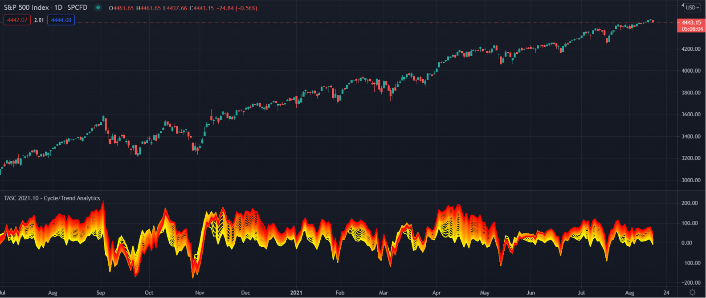

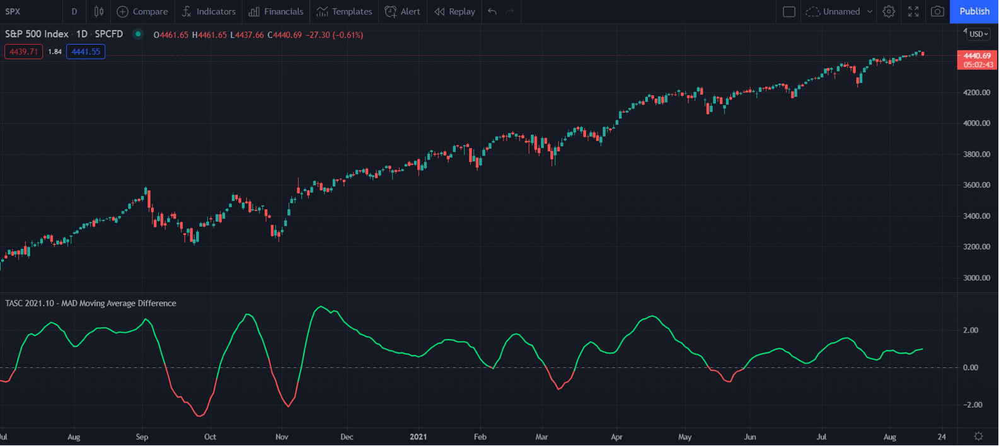

—TradingView, https://www.tradingview.com

---

## eSignal

For this month's Traders' Tip, we've provided the CycleTrend Analytics.efs and Moving Average Difference Indicator.efs studies based on the article in this issue by John Ehlers, "Cycle/Trend Analytics And The MAD Indicator." These studies, in combination, create a trend indicator that is simple and robust.

The study contains formula parameters that may be configured through the edit chart window.

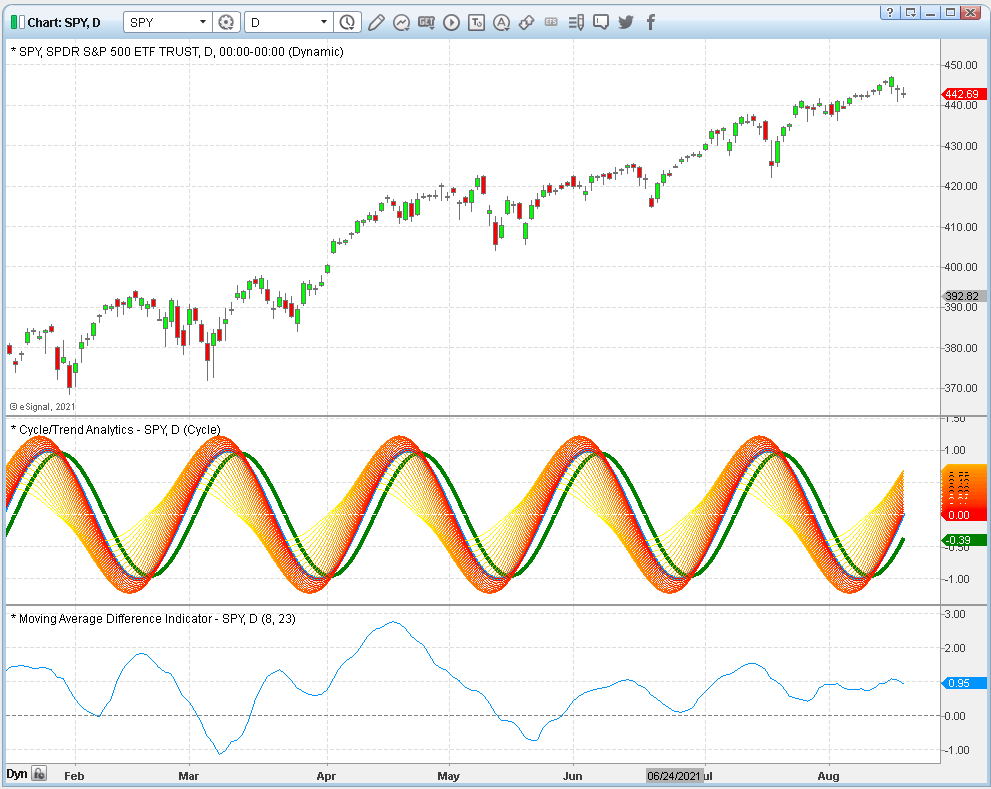

**Code files:** [CycleTrendAnalytics.efs](code/CycleTrendAnalytics.efs), [MAD.efs](code/MAD.efs)

—Eric Lippert, eSignal, an Interactive Data company, 800 779-6555, www.eSignal.com

---

## Wealth-Lab

We have added John Ehlers' MAD indicator into Wealth-Lab 7's recent build for the convenience of our users. This gives you the ability to quickly prototype various trading systems based on the indicator. For example, Figure 4 shows a classic trading system—the MACD (now MAD) crossing above the zero line is often considered a bullish signal, and vice versa.

System rules:
- Enter when the MAD indicator crosses over its zero line
- Exit when the MAD indicator crosses under its zero line

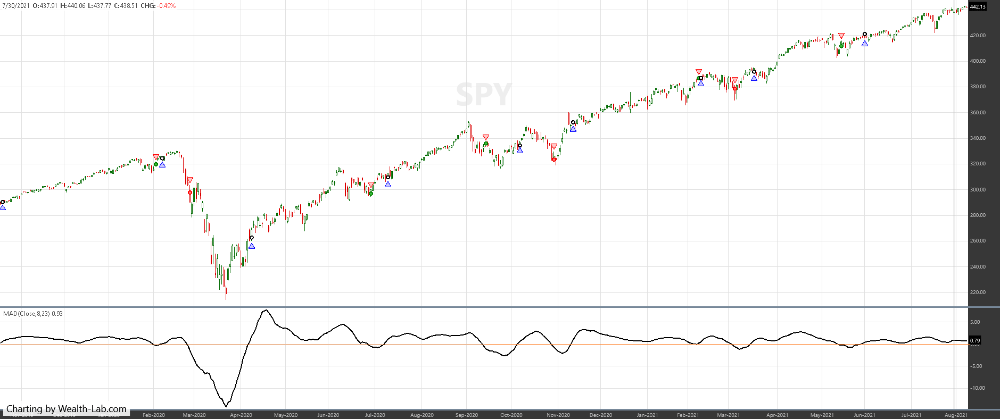

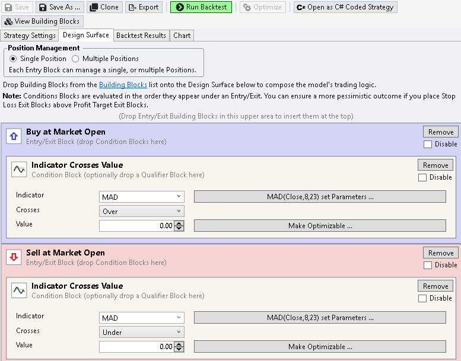

**Code file:** [MAD.cs](../code/MAD.cs)

—Gene Geren (Eugene), Wealth-Lab team, www.wealth-lab.com

---

## Neuroshell Trader

John Ehlers' MAD indicator, as described in his article in this issue, "Cycle/Trend Analytics And The MAD Indicator," can be easily implemented in NeuroShell Trader by combining some of NeuroShell Trader's 800+ indicators.

To implement the indicator, select new indicator from the insert menu and use the indicator wizard to create the following indicator:

```text
Divide( Avg1-Avg2( Close, 20, 40), Avg( Close, 40) )
```

A sample chart displaying the indicator is shown in Figure 6.

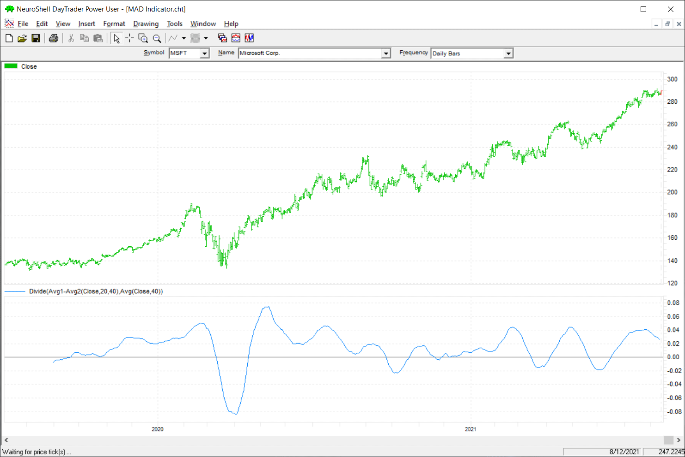

—Ward Systems Group, Inc., sales@wardsystems.com, www.neuroshell.com

---

## NinjaTrader

The indicators described in John Ehlers' article in this issue, "Cycle/Trend Analytics And The MAD Indicator," are available for download at the following links:

- NinjaTrader 8: www.ninjatrader.com/SC/October2021SCNT8.zip
- NinjaTrader 7: www.ninjatrader.com/SC/October2021SCNT7.zip

Once the file is downloaded, you can import the indicators into NinjaTrader 8 from within the control center by selecting Tools → Import → NinjaScript Add-On.

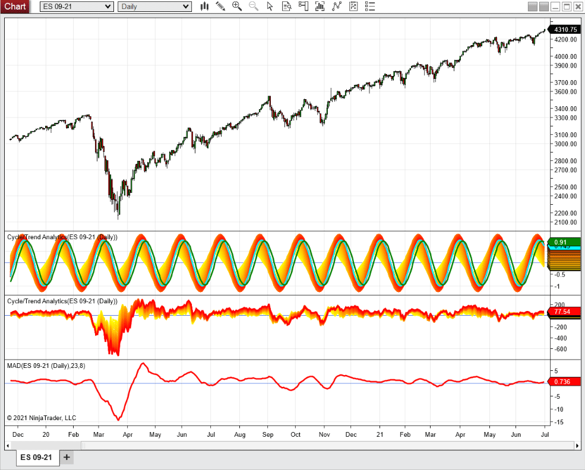

**Code files:** [CycleTrendAnalytics.cs](ninja-trader/CycleTrendAnalytics.cs), [@SMA.cs](ninja-trader/@SMA.cs), [MAD.cs](ninja-trader/MAD.cs)

—NinjaTrader, LLC, www.ninjatrader.com

---

## Optuma

The cycle and trend modes and MAD oscillator discussed in John Ehlers' article in this issue ("Cycle/Trend Analytics And The MAD Indicator") will be added to Optuma's Ehlers Tool Group (www.optuma.com/ehlers) and will be available to all clients. Here is the scripting code for the MAD oscillator:

**Code file:** [MAD.optuma](code/MAD.optuma)

```optuma
//MvgAv Inputs;
#$Short = 8;
#$Long = 23;
//Calculate MAD;
S1 = MA(BARS=$Short, CALC=Close);
L1 = MA(BARS=$Long, CALC=Close);
100 * ((S1 - L1)/L1)
```

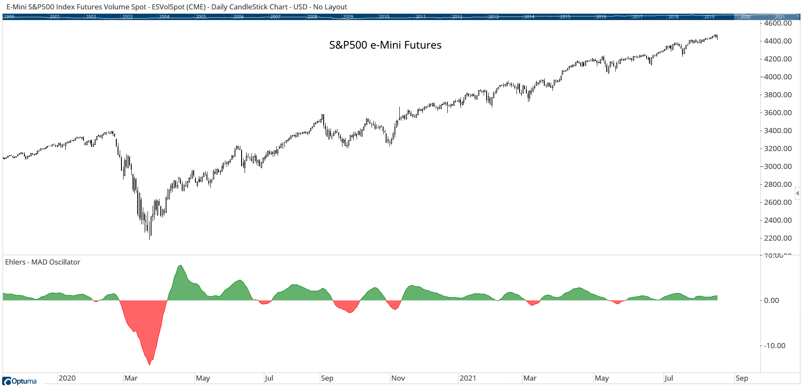

—support@optuma.com, www.optuma.com

---

## AIQ

The importable AIQ EDS file based on John Ehlers' article in this issue, "Cycle/Trend Analysis And The MAD Indicator," can be obtained on request via email to info@TradersEdgeSystems.com. The code is also available below.

Figure 9 shows the MAD indicator on a chart of Tesla, Inc. (TSLA).

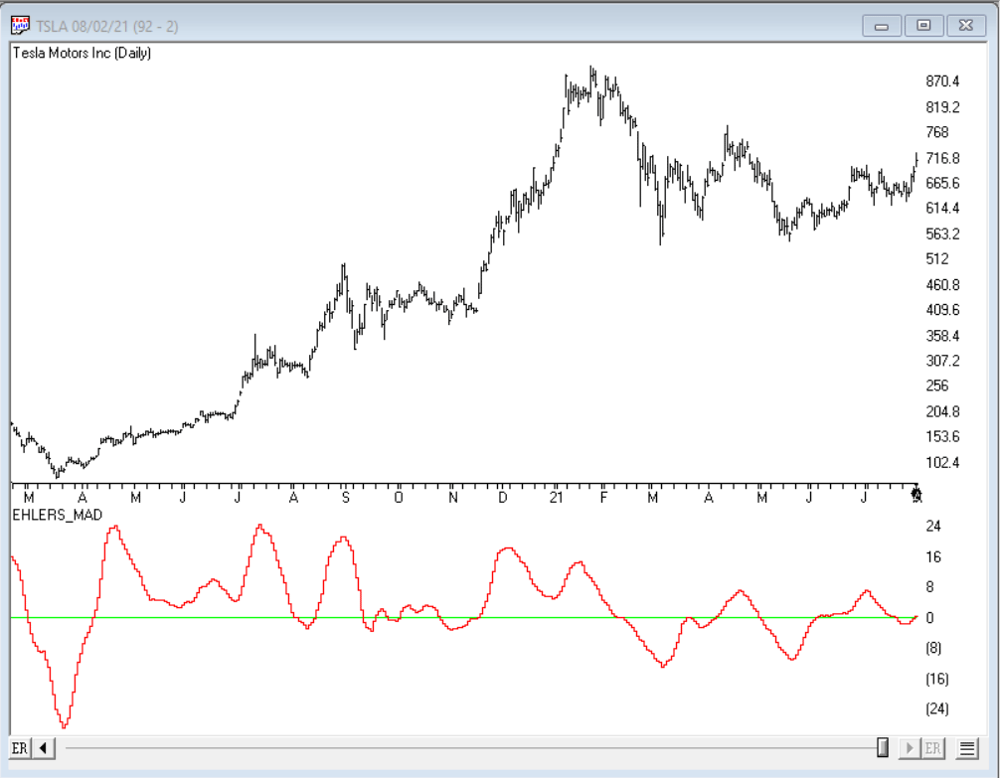

**Code file:** [MAD.aiq](code/MAD.aiq)

```aiq
!CYCLE/TREND ANALYTICS AND THE MAD INDICATOR
!Author: John F. Ehlers, TASC Oct 2021
!Coded by: Richard Denning, 8/15/2021

!MAD (Moving Average Difference) Indicator
!(C) 2021 John F. Ehler

Shortlength is 8.
LongLength is 23.
MAD is 100*(simpleavg([Close], ShortLength) -
    simpleavg([Close], LongLength)) /
    simpleavg([Close], LongLength).
```

—Richard Denning, info@TradersEdgeSystems.com, for AIQ Systems

---

## TradersStudio

The importable TradersStudio file based on John Ehlers' article in this issue, "Cycle/Trend Analytics And The MAD Indicator," can be obtained on request via email to info@TradersEdgeSystems.com. The code is also available below.

Code for the author's indicators is provided in the following files:
- **Function EHLERS_MAD:** Computes the MAD indicator
- **Indicator plot EHLERS_MAD_IND:** Plots the MAD indicator on a chart

Figure 10 shows the indicators on a chart of Amazon Inc. (AMZN).

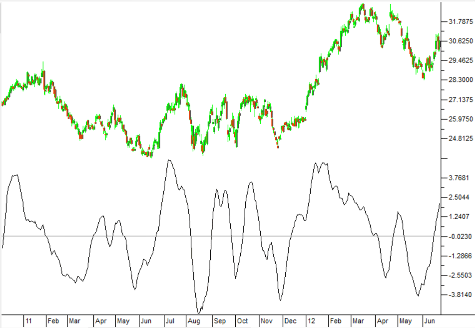

**Code file:** [MAD.trs](code/MAD.trs)

```basic
'CYCLE/TREND ANALYTICS AND THE MAD INDICATOR
'Author: John F. Ehlers, TASC Oct 2021
'Coded by: Richard Denning, 8/15/2021

'MAD (Moving Average Difference) Indicator
'(C) 2021 John F. Ehler
Function EHLERS_MAD(ShortLength,LongLength)
    'Shortlength=8
    'LongLength=23
EHLERS_MAD = 100*(Average(Close, ShortLength) - Average(Close, LongLength)) / Average(Close, LongLength)
End Function
```

—Richard Denning, info@TradersEdgeSystems.com, for TradersStudio

---

## The Zorro Project

In his article in this issue, "Cycle/Trend Analytics And The MAD Indicator," John Ehlers proposes a new trend indicator, the MAD (moving average difference) oscillator. As the name suggests, the indicator is just the difference of two moving averages normalized to +/-100.

According to Ehlers, the two periods should differ by half the period of the dominant cycle in the data. This ensures that the indicator output is in phase with the dominant cycle, thus reducing lag.

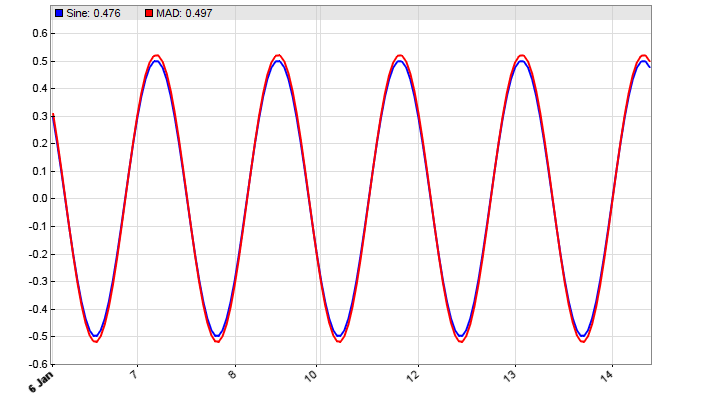

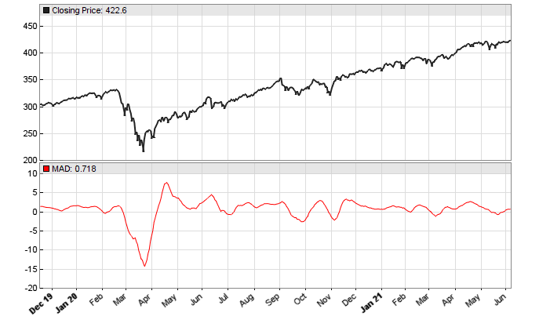

**Code file:** [MAD.c](code/MAD.c)

```c
var MAD(vars Data, int ShortPeriod, int LongPeriod)
{
	return 100*(SMA(Data,ShortPeriod)/SMA(Data,LongPeriod)-1.);
}

function run()
{
   MaxBars = 200;
   asset(""); // dummy asset
   ColorUp = ColorDn = 0; // don't plot a price curve

   vars Sine = series(genSine(30,30));
   var Diff = SMA(Sine,5) - SMA(Sine,20);
   plot("Sine",Sine[0]-0.5,LINE,BLUE);
   plot("MAD",Diff,LINE,RED);
}

void run()
{
  StartDate = 20191201;
  EndDate = 20210701;
  BarPeriod = 1440;

  assetAdd("SPY","STOOQ:*");
  asset("SPY");
  plot("MAD",MAD(seriesC(),8,23),NEW,RED);
}
```

—Petra Volkova, The Zorro Project by oP group Germany, https://zorro-project.com

---

## Microsoft Excel

In his article in this issue, "Cycle/Trend Analytics And The MAD Indicator," John Ehlers walks us through the development of his moving average difference (MAD) indicator.

The mathematical steps and the charting techniques used to illustrate the steps are both informative and colorful.

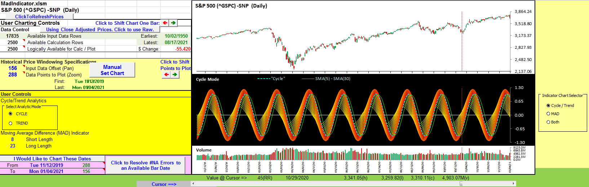

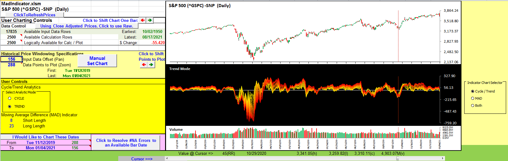

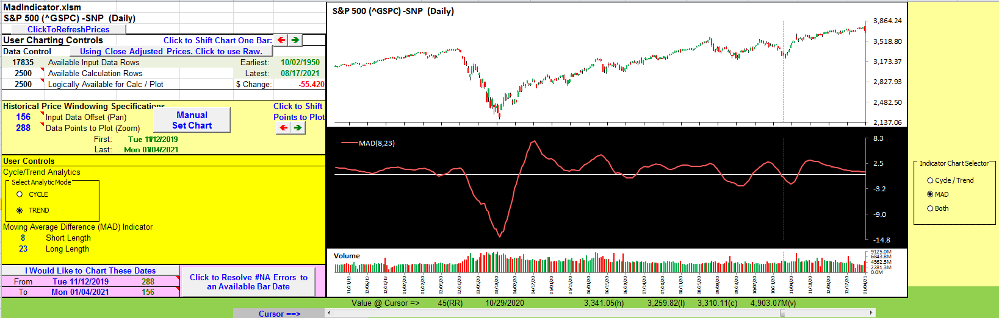

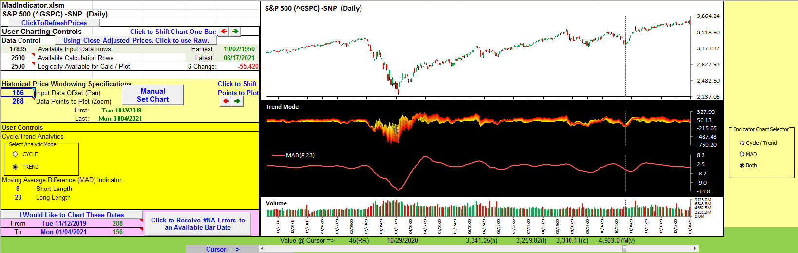

**Spreadsheet file:** [MadIndicator.xlsm](code/MadIndicator.xlsm)

—Ron McAllister, Excel and VBA programmer, rpmac_xltt@sprynet.com

---

## TradeStation

In his article "Cycle/Trend Analytics And The MAD Indicator," author John Ehlers discusses how his research into characteristics of cycles in market data led to the development of a new trend indicator called the moving average difference (MAD). First, the two modes ("cycle" and "trend") of the cycle/trend analytics indicator provide a foundational context for the MAD oscillator. Essentially, the MAD oscillator is a difference between two simple moving averages with varying lengths.

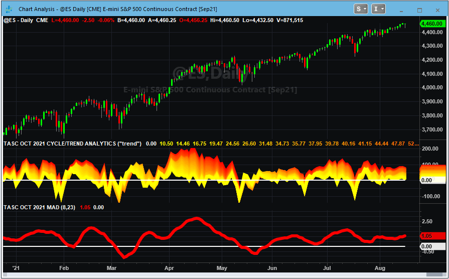

**Code file:** [CycleTrendAnalytics.els](code/CycleTrendAnalytics.els)

—John Robinson, TradeStation Securities, Inc. www.TradeStation.com

---

*Originally published in the October 2021 issue of Technical Analysis of Stocks & Commodities magazine. All rights reserved.*

---

## BibTeX

```bibtex
@misc{tasc2021traderstips10,
  author       = {{Technical Analysis of Stocks \& Commodities}},
  title        = {Traders' Tips, October 2021},
  year         = {2021},
  month        = oct,
  url          = {https://www.traders.com/Documentation/FEEDbk_docs/2021/10/TradersTips.html},
  note         = {Traders' Tips implementations for ``Cycle/Trend Analytics And The MAD Indicator'' by John F. Ehlers}
}
```
