# Traders' Tips: November 2021

**The MAD Indicator, Enhanced** by John F. Ehlers

- **Traders' Tips URL:** <https://www.traders.com/Documentation/FEEDbk_docs/2021/11/TradersTips.html>

---

## TradeStation

Last month in his October 2021 article in S&C, "Cycle/Trend Analytics And The MAD Indicator," John Ehlers presented the MAD indicator. In this month's article, "The MAD Indicator, Enhanced," he presents the improved MADH version using Hann windowing.

A sample chart is shown in Figure 1.

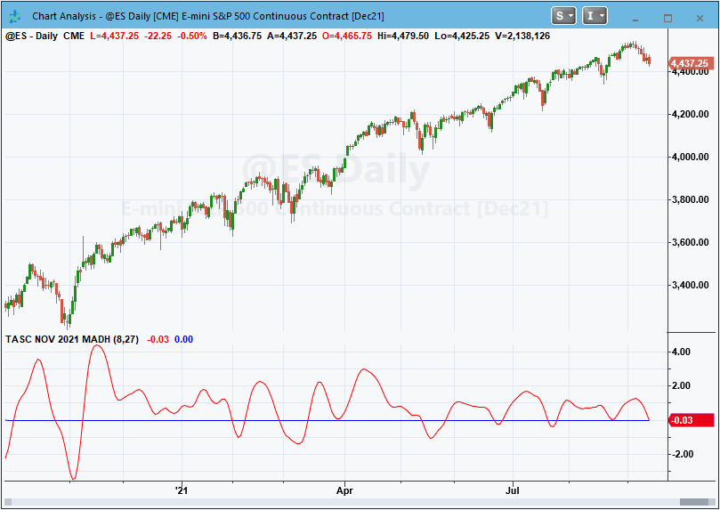

**Code file:** [MADH.els](code/MADH.els)

```easylanguage
Indicator:  TASC NOV 2021 MADH
// TASC NOV 2021
// MADH (Moving Average Difference - Hann) Indicator
// (C) 2021 John F. Ehlers

inputs:
	ShortLength(8),
	DominantCycle(27);

variables:
	LongLength(20),
	Filt1(0),
	Filt2(0),
	coef(0),
	count(0),
	MADH(0);

LongLength = IntPortion(ShortLength + DominantCycle / 2);
Filt1 = 0;
coef = 0;

for count = 1 to ShortLength
begin
	Filt1 = Filt1 + (1 - Cosine(360*count / (ShortLength +
	 1)))*Close[count - 1];
	coef = coef + (1 - Cosine(360*count / (ShortLength + 1)));
end;

If coef <> 0 then Filt1 = Filt1 / coef;

Filt2 = 0;
coef = 0;

for count = 1 to LongLength
begin
	Filt2 = Filt2 + (1 - Cosine(360*count / (LongLength +
	 1)))*Close[count - 1];
	coef = coef + (1 - Cosine(360*count / (LongLength + 1)));
end;

If coef <> 0 Then Filt2 = Filt2 / coef;

// Computed as percentage of price
If Filt2 <> 0 then MADH = 100*(Filt1 - Filt2) / Filt2;

Plot1(MADH, "MADH");
Plot2(0, "Zero");
```

—John Robinson, TradeStation Securities, Inc. www.TradeStation.com

---

## thinkorswim

We put together a study based on the article by John Ehlers in this issue titled "The MADH: The MAD Indicator, Enhanced."

The chart in Figure 2 shows the study added to a one-year daily chart of SPY.

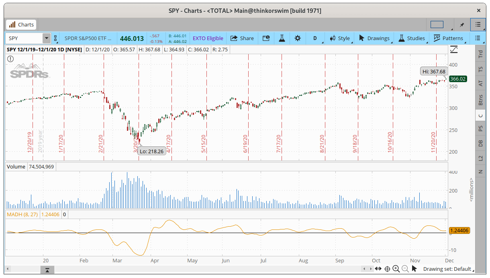

—thinkorswim, A division of TD Ameritrade, Inc. www.thinkorswim.com

---

## eSignal

For this month's Traders' Tip, we've provided the study "Moving Average Difference - Hann Indicator.efs" based on the article in this issue by John Ehlers titled "The MAD Indicator, Enhanced."

The study contains formula parameters that may be configured through the edit chart window.

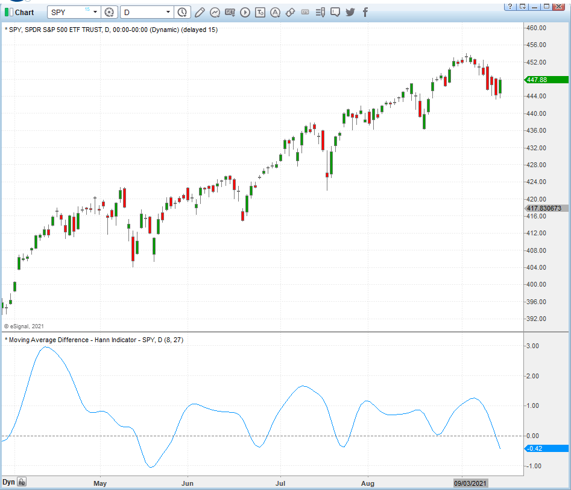

**Code file:** [MADH.efs](code/MADH.efs)

—Eric Lippert, eSignal, an Interactive Data company, 800 779-6555, www.eSignal.com

---

## Wealth-Lab

We have added John Ehlers' MADH indicator to Wealth-Lab 7 for the convenience of our users. In his article in this issue, he enhances the MAD indicator using Hann windowing.

Figure 4 illustrates application of the MADH to a chart of SPY.

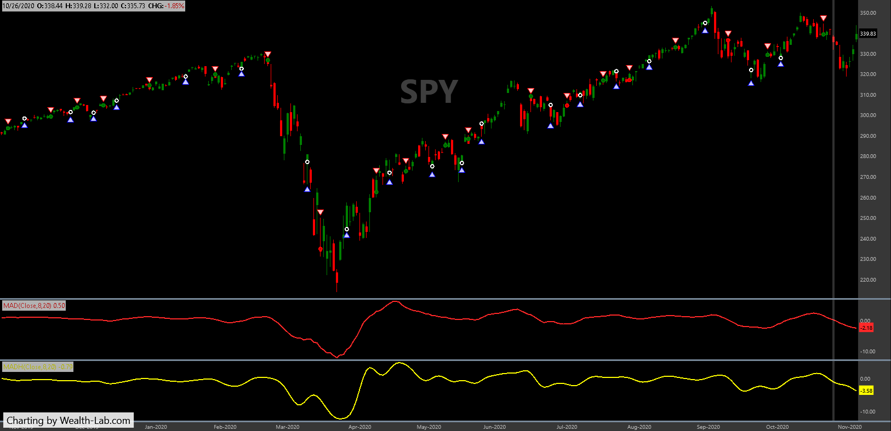

**Code file:** [MADH.cs](code/MADH.cs)

```csharp
using WealthLab.Backtest;
using System;
using WealthLab.Core;
using WealthLab.Indicators;
using WealthLab.TASC;
using System.Drawing;
using System.Collections.Generic;

namespace WealthScript1
{
	public class MyStrategy1 : UserStrategyBase
	{
		public override void Initialize(BarHistory bars)
		{
			mad = MAD.Series(bars.Close, 8, 20);
			madh = MADH.Series(bars.Close, 8, 20);

			PlotIndicator(mad, Color.Red, PlotStyles.Line, false, "MAD");
			PlotIndicator(madh, Color.Yellow, PlotStyles.Line, false, "MADH");

			ChartDisplaySettings cds = new ChartDisplaySettings();
			cds.ColorGridLines = Color.Transparent;
			cds.ColorWatermark = Color.White;
			cds.ColorUpBar = Color.Green;
			cds.ColorDownBar = Color.Red;
			cds.ColorBackground = Color.Black;
			SetChartDrawingOptions(cds);

			SetPaneDrawingOptions("MAD", 20, 50);
			SetPaneDrawingOptions("MADH", 20, 51);
		}

		public override void Execute(BarHistory bars, int idx)
		{
			if(madh.TurnsUp(idx))
				PlaceTrade(bars, TransactionType.Buy, OrderType.Market);
			if (madh.TurnsDown(idx))
				ClosePosition(LastPosition, OrderType.Market);
		}

		MAD mad; MADH madh;
	}
}
```

—Gene Geren (Eugene), Wealth-Lab team, www.wealth-lab.com

---

## Neuroshell Trader

John Ehlers' MADH indicator, presented in his article in this issue, can be easily implemented in NeuroShell Trader using NeuroShell Trader's ability to call external DLLs.

After moving the code given in the article to your preferred compiler and creating a DLL, you can insert the resulting indicator.

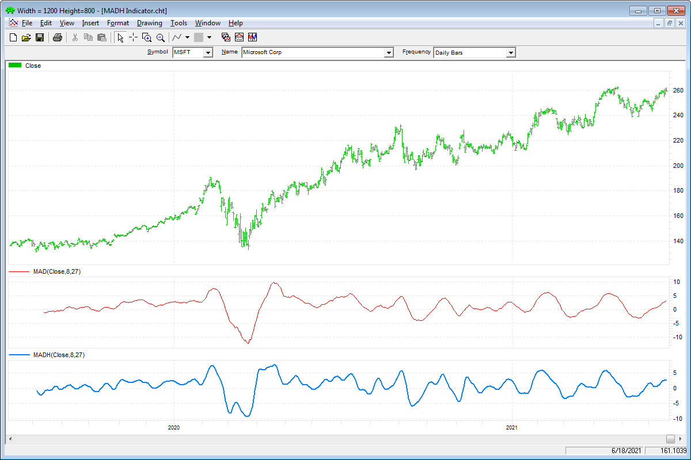

—Ward Systems Group, Inc., sales@wardsystems.com, www.neuroshell.com

---

## Optuma

In his article in this issue, "The MADH: The MAD Indicator, Enhanced," John Ehlers introduces his MADH indicator. To create the MADH in Optuma, we use the FIR Hann function available with our set of Ehlers tools.

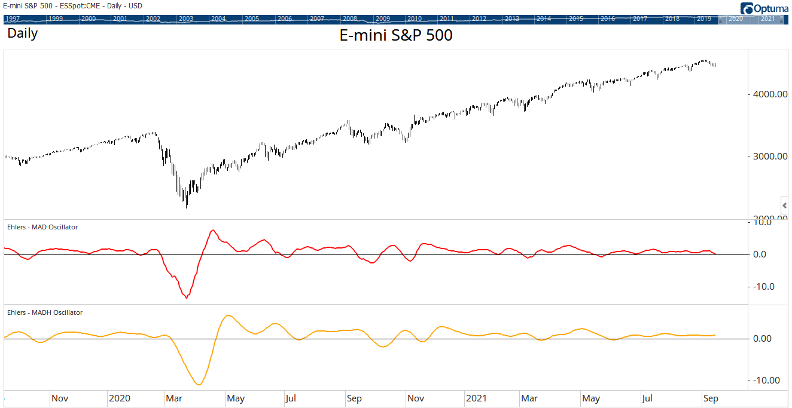

**Code file:** [MADH.optuma](code/MADH.optuma)

```optuma
//Calculate MAD Oscillator;
//MA Inputs;
#$Short = 8;
#$Long = 23;
//Calc MAD;
S1 = MA(BARS=$Short, CALC=Close);
L1 = MA(BARS=$Long, CALC=Close);
MAD1 =100 * ((S1 - L1)/L1);
//Wrap MAD in the FIR Hann function to calculate MADH;
FIR(MAD1, SMOOTHSTYLE=Hann, BARS=20)
```

—support@optuma.com

---

## TradersStudio

The importable TradersStudio files based on John Ehlers' article in this issue, "The MADH: The MAD Indicator, Enhanced," can be obtained on request.

Code for the author's indicator is provided in the following files.

A sample chart displaying the oscillator is shown in Figure 7.

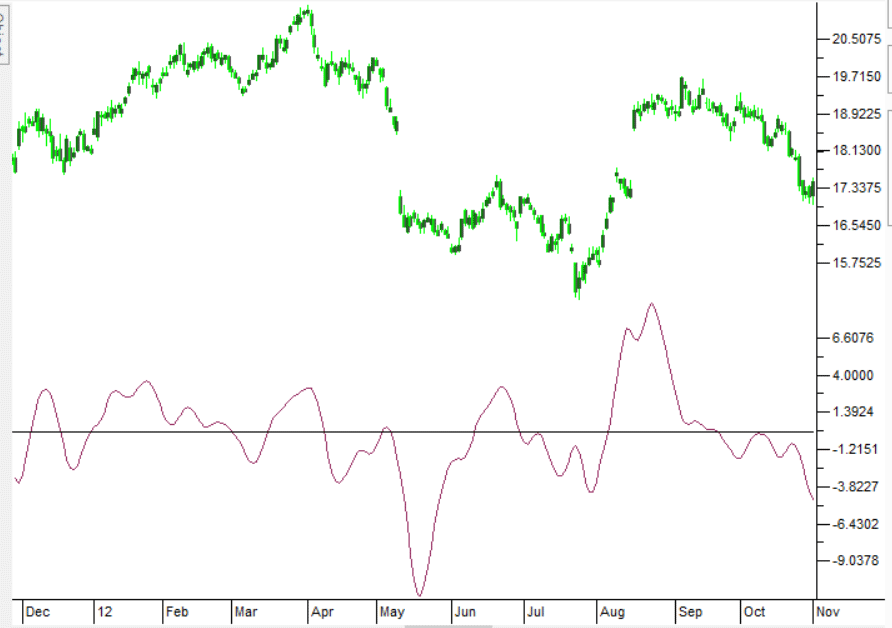

**Code file:** [MADH.trs](code/MADH.trs)

```basic
'The MAD Indicator, Enhanced
'Author: John F. Ehlers, TASC Nov 2021
'Coded by: Richard Denning, 9/14/2021

Function EHLERS_MADH(ShortLength, DominantCycle)
'ShortLength=8, DominantCycle=27
    Dim LongLength
    Dim Filt1
    Dim Filt2
    Dim coef
    Dim count
    Dim MADH As BarArray

    If BarNumber=FirstBar Then
        LongLength = 20
        Filt1 = 0
        Filt2 = 0
        coef = 0
        count = 0
        MADH = 0
    End If

    LongLength = CInt(ShortLength + DominantCycle / 2)
    Filt1 = 0
    coef = 0
    For count = 1 To ShortLength
        Filt1 = Filt1 + (1 - TStation_Cosine(360*count / (ShortLength + 1)))*Close[count - 1]
        coef = coef + (1 - TStation_Cosine(360*count / (ShortLength + 1)))
    Next
    If coef <> 0 Then
        Filt1 = Filt1 / coef
    End If
    Filt2 = 0
    coef = 0
    For count = 1 To LongLength
        Filt2 = Filt2 + (1 - TStation_Cosine(360*count / (LongLength + 1)))*Close[count - 1]
        coef = coef + (1 - TStation_Cosine(360*count / (LongLength + 1)))
    Next
    If coef <> 0 Then
        Filt2 = Filt2 / coef
    End If
    If Filt2 <> 0 Then
        MADH = 100*(Filt1 - Filt2)/Filt2
    End If
    EHLERS_MADH = MADH
End Function
'-------------------------------------------------------------------------------------------
'INDICATOR PLOT
Sub EHLERS_MADH_IND(ShortLength,DominantCycle)
Dim MADH As BarArray
MADH = EHLERS_MADH(ShortLength,DominantCycle)
plot1(MADH)
plot2(0)
End Sub
```

—Richard Denning, info@TradersEdgeSystems.com, for TradersStudio

---

## TradingView

Here is TradingView Pine code for implementing the MADH indicator (moving average difference with Hann windowing) as presented in John Ehlers' article in this issue.

The indicator is available on TradingView from the PineCodersTASC account at: https://www.tradingview.com/u/PineCodersTASC/#published-scripts

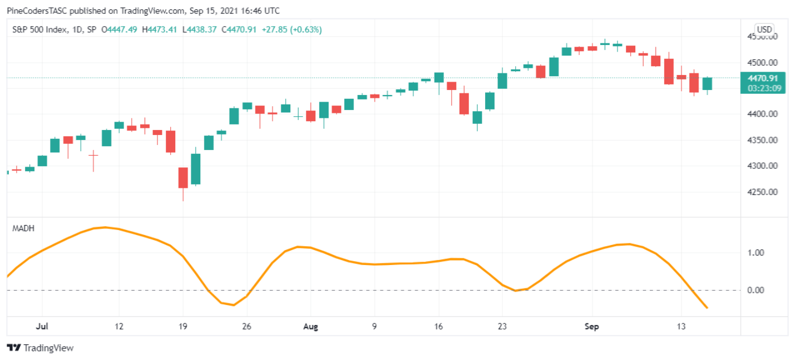

**Code file:** [MADH.pine](code/MADH.pine)

```pine
// TASC Issue: November 2021
// Article: "Moving Average Difference with Hann Windowing (MADH)" by John Ehlers
// Language: TradingView's Pine Script
// Provided by: PineCoders, for tradingview.com

//@version=4
study("TASC 2021.11 - Moving Average Diff. with Hann Windowing (MADH)", "MADH")

float sourceInput        = input(close, "Source:")
int   shortLengthInput   = input(8,     "Short Length:",   minval = 2)
int   dominantCycleInput = input(27,    "Dominant Cycle:", minval = 4)

madh(source, shortLength, dominantCycle) =>
	var float PIx2 = math.pi * 2.0
	float filt1 = 0.0
	float coeffs = 0.0
	for count = 1 to shortLength
		float hannCoeff = 1.0 - cos(PIx2 * count / (shortLength + 1))
		filt1 += hannCoeff * source[count - 1]
		coeffs += hannCoeff
	filt1 := nz(filt1 / coeffs)
	int longLength = int(shortLength + dominantCycle * 0.5)
	float filt2 = 0.0
	coeffs := 0.0
	for count = 1 to longLength
		float hannCoeff = 1.0 - cos(PIx2 * count / (longLength + 1))
		filt2 += hannCoeff * source[count - 1]
		coeffs += hannCoeff
	filt2 := nz(filt2 / coeffs)
	nz(100.0 * (filt1 - filt2) / filt2)

madhSignal = madh(sourceInput, shortLengthInput, dominantCycleInput)

plot(madhSignal, "MADH", color.orange, 3)
hline(0, "Zero", color.gray)
```

—PineCoders, for TradingView, https://www.tradingview.com

---

## The Zorro Project

Last month in his October 2021 article in S&C, John Ehlers described his MAD indicator. In his article this month, he presents the improved MADH version using Hann windowing.

For creating the MADH, we just glue both functions together. Here is a script for replicating Ehlers' chart using SPY data. The resulting chart is shown in Figure 9.

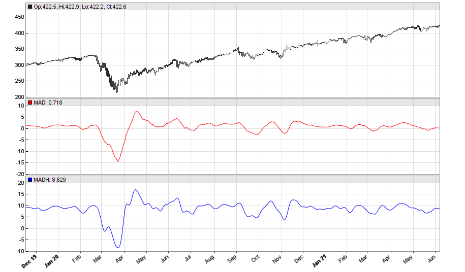

**Code file:** [MADH.c](code/MADH.c)

```c
var MAD(vars Data, int ShortPeriod, int LongPeriod)
{
   return 100*(SMA(Data,ShortPeriod)
    /SMA(Data,LongPeriod)-1.);
}

vars hann(vars Data,int Length)
{
   vars Out = series(0,Length);
   int i;
  for(i=0; i<Length; i++)
  Out[i] = Data[i] * (1-cos(2*PI*(i+1)/(Length+1)));
  return Out;
}

var MADH(vars Data, int ShortPeriod, int LongPeriod)
{
   return 100*(SMA(hann(Data,ShortPeriod),ShortPeriod)
      /SMA(hann(Data,LongPeriod),LongPeriod)-1.);
}

void run()
{
  StartDate = 20191201;
  EndDate = 20210701;
  BarPeriod = 1440;

  assetAdd("SPY","STOOQ:*");
  asset("SPY");
  plot("MAD",MAD(seriesC(),8,23),NEW,RED);
  plot("MADH",MADH(seriesC(),8,23),NEW,BLUE);
}
```

—Petra Volkova, The Zorro Project by oP group Germany, https://zorro-project.com

---

## NinjaTrader

The MADH (moving average difference–Hann) indicator, as discussed in the article in this issue by John Ehlers, "The MAD Indicator, Enhanced," is available for download.

Once the file is downloaded, you can import the indicator into NinjaTrader 8 from within the control center by selecting Tools → Import → NinjaScript Add-On.

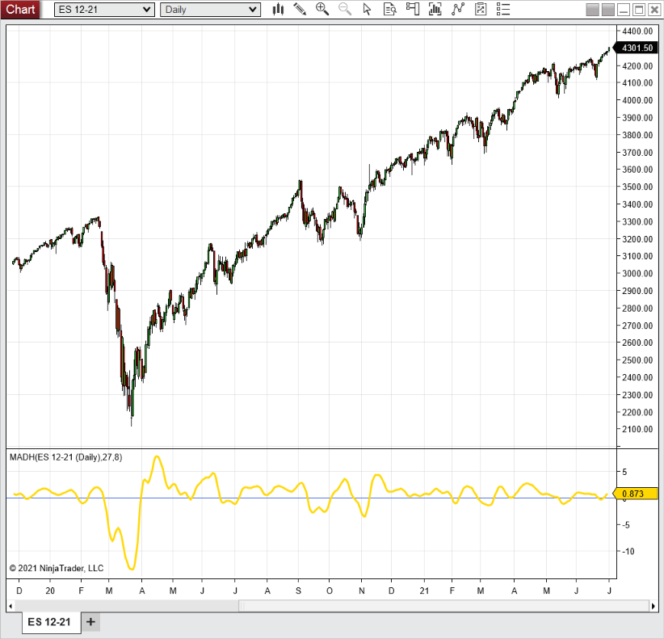

**Code file:** [MADH.cs](ninja-trader/MADH.cs)

—NinjaTrader, LLC, www.ninjatrader.com

---

## Microsoft Excel

In his article in this issue, "The MADH: The MAD Indicator, Enhanced," John Ehlers combines two concepts presented in recent articles to produce the MADH indicator.

By replacing the two moving averages used in the basic MAD indicator with two Hann windowing averages, we get an indicator that is smoother and produces fewer false signals.

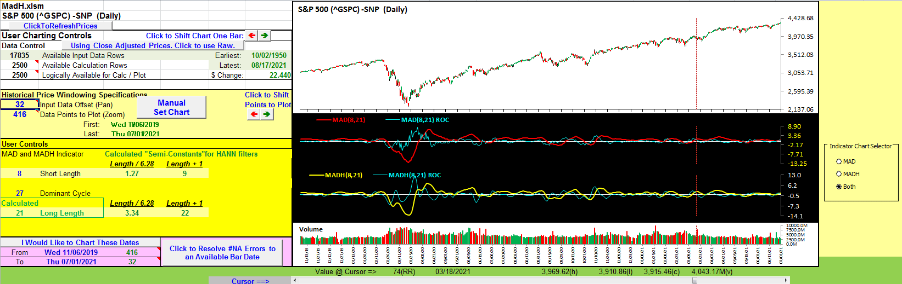

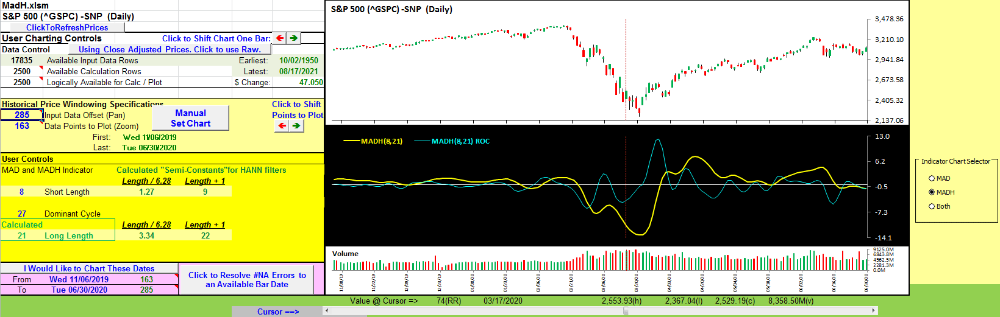

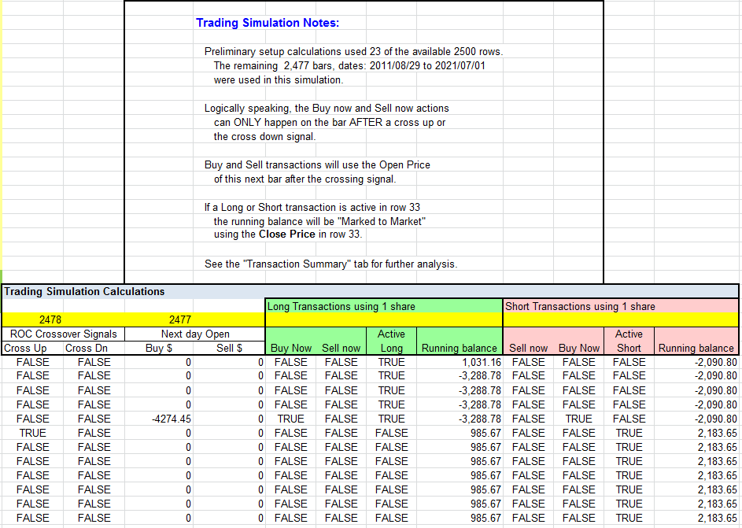

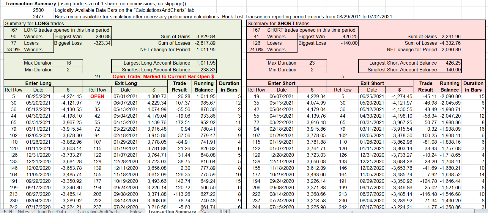

**Spreadsheet file:** [MadH.xlsm](code/MadH.xlsm)

—Ron McAllister, Excel and VBA programmer, rpmac_xltt@sprynet.com

---

*Originally published in the November 2021 issue of Technical Analysis of Stocks & Commodities magazine. All rights reserved.*

---

## BibTeX

```bibtex
@misc{tasc2021traderstips11,
  author       = {{Technical Analysis of Stocks \& Commodities}},
  title        = {Traders' Tips, November 2021},
  year         = {2021},
  month        = nov,
  url          = {https://www.traders.com/Documentation/FEEDbk_docs/2021/11/TradersTips.html},
  note         = {Traders' Tips implementations for ``The MAD Indicator, Enhanced'' by John F. Ehlers}
}
```
