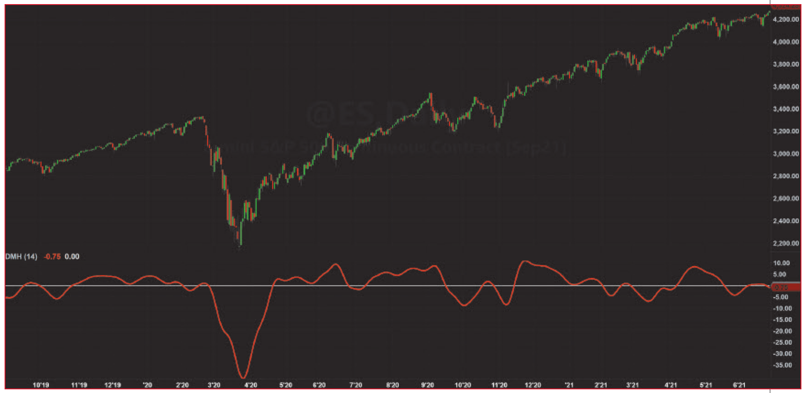

# The DMH: An Improved Directional Movement Indicator

*Enhanced With Hann Windowing*

**by John F. Ehlers**

- **Article URL:** <https://technical.traders.com/archive/article.asp?file=\V39\C12\341EHLE.pdf>
- **Traders' Tips URL:** <https://www.traders.com/Documentation/FEEDbk_docs/2021/12/TradersTips.html>

---

> The directional movement indicator originally developed by J. Welles Wilder has been a mainstay in technical analysis. It's time to modernize it.

I hardly know where to start. Directional movement has been part of technical analysis for five decades, invented using pencil and paper for its calculations. Seriously! Check out the worksheets in J. Welles Wilder's 1978 book, *New Concepts In Technical Trading Systems*. (Since it's in the public domain, the book can be downloaded from the internet for free.)

Directional movement is actually a pretty good indicator, but it carries some baggage due to the available technology at the time it was created. It's time to freshen it up for use in modern algorithmic trading.

## The directional movement indicator, explained

The basic idea of directional movement is that the summation of changes in highs will be greater than the summation of changes in lows in an uptrend. Conversely, the summation of the changes in the lows will be greater than the summation of the highs in a downtrend. The crossovers of the two summations are the timing signals.

The original directional movement used ATR (average true range) as a scaling factor. ATR scaled both the summation of the highs and the summation of the lows, so it had no impact on the timing signals. Moreover, the classic DMI was formed as a ratio, so that ATR algebraically drops out altogether. So we can dispense with the use of ATR when computing a modern version of directional movement.

Not using a scaling function means that directional movement is just the differences of the two summations. The directional movement rules allow only the selection of the changes in the highs or only the selection of the changes of the lows on a given bar, but not both. Further, an inside day precludes the selection of either. The result is that the directional movements are a series of relatively sparsely populated spikes.

A more nearly continuous function is created by summing the movements in an exponential moving average (EMA). In my September 2021 *Stocks & Commodities* article "Windowing," I showed that moving averages are not particularly good filters and that filtering can be substantially improved using Hann window coefficients with summation over the analysis period. I therefore propose the DMH (directional movement using Hann windows) as the modern version of directional movement because it can easily be calculated by computers.

## Introducing an improved directional movement indicator: The DMH

The calculation for the DMH is given in the code listing in the sidebar "The DMH, EasyLanguage Code."

The computation starts with the classic definition of PlusDM and MinusDM. These directional movements are summed in an exponential moving average (EMA). Then, this EMA is further smoothed in a *finite impulse response* (FIR) filter using Hann window coefficients over the calculation period.

The zero crossings of this indicator are the original timing signals according to Wilder. However, these zero crossings have substantial lag. In my opinion, better timing signals are the peaks and valleys of the indicator. The peaks and valleys of the indicator can be identified by noting when the rate of change of the indicator is zero. In other words, a valley occurs when the one-bar difference of the indicator crosses over zero and a peak occurs when the one-bar difference of the indicator crosses under zero.

While the *default* indicator length is Wilder's 14 bars, I think the length for the indicator should be left to the discretion of the trader or can be determined by optimization if the DMH is used in a strategy.

Figure 1 shows an example of DMH applied to the emini S&P continuous futures contract.


**Figure 1: The DMH Indicator.** This shows an example of the DMH indicator (directional movement using Hann windows) applied to the emini S&P continuous futures contract. Zero crossings reflect changes in trend.

## Thoroughly modern

My recent research into the nature of market data and the characteristics of cycles that occur in data has led me to make some significant improvements in the indicators and oscillators I use for trading. The research has evolved my outlook on market data and on trend/cycle analytics. It has also led me to update many classic indicators for trading—such as the directional movement, as presented in this article.

In upcoming articles in this magazine, I will offer improved versions of a few more classic indicators based on my recent research.

> I propose the DMH (directional movement using Hann windows) as the modern version of directional movement because it can easily be calculated by computers.

See our Traders' Tips section beginning on page 50 for implementation of John Ehlers' technique in various technical analysis programs and trading platforms. Accompanying program code can be found in the Traders' Tips area at Traders.com.

## The DMH, EasyLanguage Code

```easylanguage
{
    DMH - Directional Movement using Hann Windowing
    (C) 2021 John F. Ehlers
}

Inputs:
    Length(14);

Vars:
    SF(0), PlusDM(0), MinusDM(0),
    UpperMove(0), LowerMove(0), EMA(0),
    DMSum(0), coef(0), count(0), DMH(0);

SF = 1 / Length;

UpperMove = High - High[1];
LowerMove = Low[1] - Low;

PlusDM = 0;
MinusDM = 0;

If UpperMove > LowerMove and UpperMove > 0 Then
    PlusDM = UpperMove
Else If LowerMove > UpperMove and LowerMove > 0 Then
    MinusDM = LowerMove;

EMA = SF*(PlusDM - MinusDM) + (1 - SF)*EMA[1];

//Smooth Directional Movements with Hann Windowed FIR filter
DMSum = 0;
coef = 0;
For count = 1 to Length Begin
    DMSum = DMSum + (1 - Cosine(360*count / (Length + 1)))*EMA[count - 1];
    coef = coef + (1 - Cosine(360*count / (Length + 1)));
End;
If coef <> 0 Then DMH = DMSum / coef;

Plot1(DMH, "", red, 4, 4);
Plot2(0, "", white, 1, 1);
```

## Further reading

- Ehlers, John F. [2021]. "Windowing," *Technical Analysis of Stocks & Commodities*, Volume 39: September.
- Ehlers, John F. [2021]. "Cycle/Trend Analytics And The MAD Indicator," *Technical Analysis of Stocks & Commodities*, Volume 39: October.
- Evens, Stuart [1999]. "Directional Movement," *Technical Analysis of Stocks & Commodities*, Volume 17: February.
- Wilder, J. Welles Jr. [1978]. *New Concepts In Technical Trading Systems*, Trend Research.

---

*John Ehlers, a Contributing Editor to Stocks & Commodities, is a pioneer in the use of cycles and DSP (digital signal processing) technical analysis. He is president of MESA Software. He can be reached through his website at MESAsoftware.com.*

*Originally published in the December 2021 issue of Technical Analysis of Stocks & Commodities magazine, Volume 39, pp. 16–18. All rights reserved.*

---

## BibTeX

```bibtex
@article{ehlers2021dmh,
  author       = {Ehlers, John F.},
  title        = {The {DMH}: An Improved Directional Movement Indicator},
  journal      = {Technical Analysis of Stocks \& Commodities},
  year         = {2021},
  month        = dec,
  volume       = {39},
  number       = {12},
  pages        = {16--18},
  url          = {https://technical.traders.com/archive/article.asp?file=\V39\C12\341EHLE.pdf}
}

@misc{tasc2021traderstips12,
  author       = {{Technical Analysis of Stocks \& Commodities}},
  title        = {Traders' Tips, December 2021},
  year         = {2021},
  month        = dec,
  url          = {https://www.traders.com/Documentation/FEEDbk_docs/2021/12/TradersTips.html},
  note         = {Traders' Tips implementations for ``The DMH: An Improved Directional Movement Indicator'' by John F. Ehlers}
}
```
