# Traders' Tips: December 2021

**The DMH: An Improved Directional Movement Indicator** by John F. Ehlers

- **Traders' Tips URL:** <https://www.traders.com/Documentation/FEEDbk_docs/2021/12/TradersTips.html>

---

## thinkorswim

We put together a study based on the article by John Ehlers in this issue titled "The DMH: An Improved Directional Movement Indicator." We built the strategy referenced in the article.

Figure 1 shows the study added to a two-year daily chart of the emini S&P 500 futures.

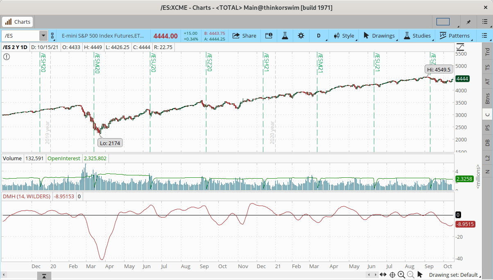

—thinkorswim, A division of TD Ameritrade, Inc. www.thinkorswim.com

---

## TradingView

Here is the TradingView Pine code for implementing the DMH indicator, based on John Ehlers' article in this issue, "The DMH: An Improved Directional Movement Indicator."

The Pine Script code given here uses the recently launched version 5 of the language.

The calculation starts with the classic definition of PlusDM and MinusDM. These directional movements are summed in an exponential moving average (EMA). Then, this EMA is further smoothed in a finite impulse response (FIR) filter using Hann window coefficients over the calculation period.

The indicator is available on TradingView from the PineCodersTASC account: https://www.tradingview.com/u/PineCodersTASC/#published-scripts

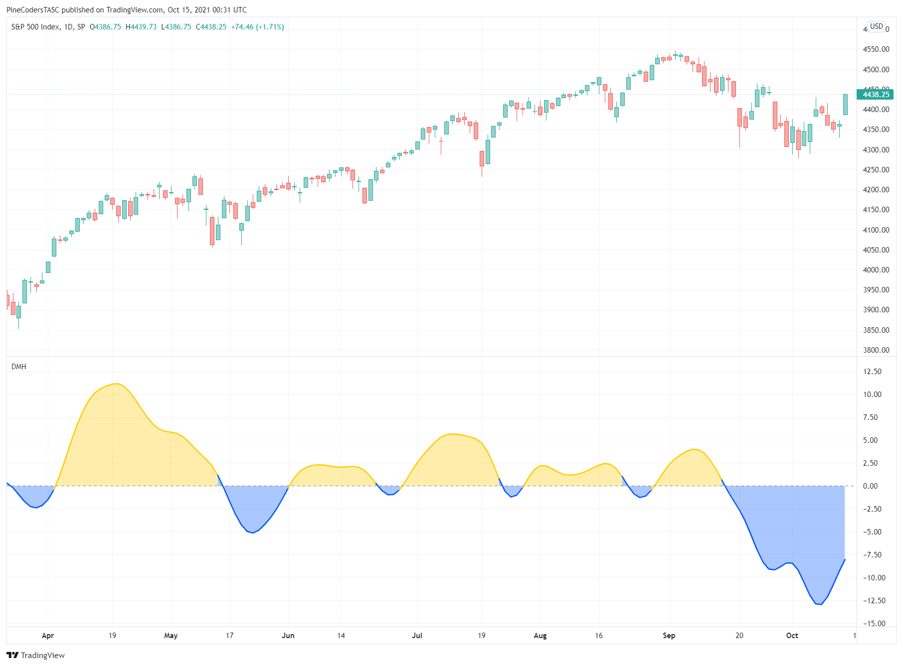

**Code file:** [DMH.pine](code/DMH.pine)

```pine
//  TASC Issue: December 2021 - Vol. 39, Issue 13
//     Article: "The DMH: An Improved
//               Directional Movement Indicator"
//  Article By: John F. Ehlers
//    Language: TradingView's Pine Script v5
// Provided By: PineCoders, for TradingView.com

//@version=5
indicator("TASC 2021.12 Directional Movement w/Hann", "DMH")

lengthInput = input.int(10,     "Length:", minval = 2)
lWidthInput = input.int( 2, "Line Width:", minval = 1)

hann(src, period) => // Hann FIR Filter
    var PIx2 = 2.0 * math.pi / (period + 1)
    sum4Hann  = 0.0, sumCoefs = 0.0
    for count= 1 to period
        coef      =  1.0 - math.cos(count * PIx2)
        sum4Hann += coef * src[count - 1]
        sumCoefs += coef
    nz(sum4Hann / sumCoefs)

dmh(period) => // Directional Movement w/Hann
    upMove = high - high[1]
    dnMove = -low +  low[1]
    pDM = upMove > dnMove and upMove > 0 ? upMove : 0.0
    mDM = dnMove > upMove and dnMove > 0 ? dnMove : 0.0
    hann(ta.rma(pDM - mDM, period), period)

signal = dmh(lengthInput)

plotColor = signal > 0.0 ? #FFCC00   : #0055FF
areaColor = signal > 0.0 ? #FFCC0055 : #0055FF55

plot(signal, "Area", areaColor, style = plot.style_area)
plot(signal,  "DMH", plotColor, lWidthInput)
hline(0, "Zero", color.gray)
```

—PineCoders, for TradingView, https://www.tradingview.com

---

## eSignal

For this month's Traders' Tip, we've provided the study "Directional Movement using Hann Windowing.efs" based on the article in this issue by John Ehlers titled "The DMH: An Improved Directional Movement Indicator."

The study contains formula parameters that may be configured through the edit chart window (right-click on the chart and select "edit chart"). A sample chart is shown in Figure 3.

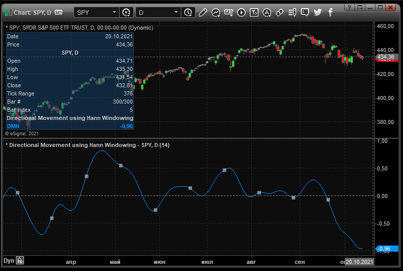

**Code file:** [DMH.efs](code/DMH.efs)

—Eric Lippert, eSignal, an Interactive Data company, 800 779-6555, www.eSignal.com

---

## Wealth-Lab

In his article in this issue, "The DMH: An Improved Directional Movement Indicator," John Ehlers presents his improved version of the classic directional movement indicator.

It's possible to apply Ehlers' DMH indicator in diverse ways. As one way, Ehlers suggests using the rate of change of DMH crossing over zero for a valley (buy) and crossing under zero for a peak (sell).

For this strategy we decided to go with the zero line crossings. The rules are a piece of cake to implement in Wealth-Lab 7 thanks to its "building blocks" feature, which eliminates the need to write code.

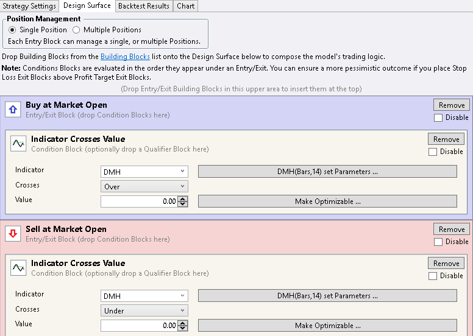

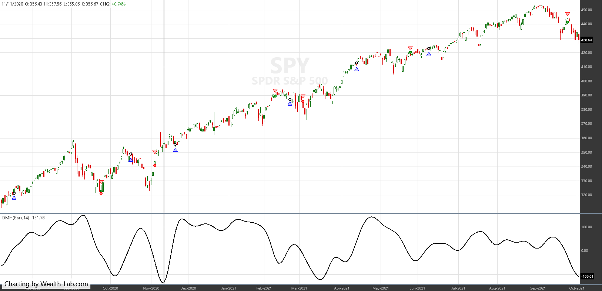

—Gene Geren (Eugene), Wealth-Lab team, www.wealth-lab.com

---

## NinjaTrader

The DMH indicator, as introduced by John Ehlers in his article in this issue, "The DMH: An Improved Directional Movement Indicator," is available for download at the following link.

Once the file is downloaded, you can import the indicator in NinjaTrader 8 from within the Control Center by selecting Tools → Import → NinjaScript Add-On.

A sample chart displaying the indicator is shown in Figure 6.

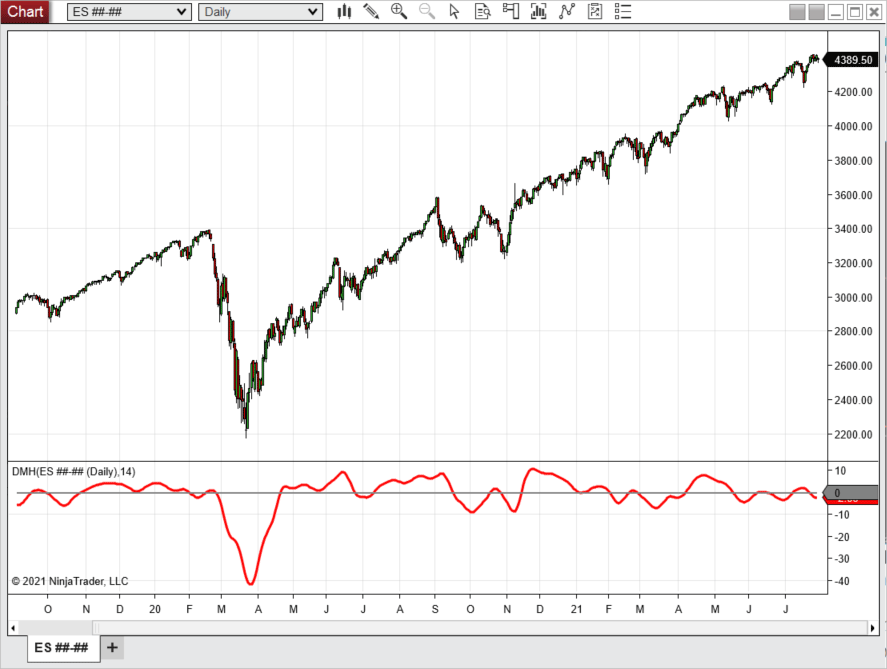

**Code file:** [DMH.cs](ninja-trader/DMH.cs)

—Brandon Haulk, NinjaTrader, LLC, www.ninjatrader.com

---

## Neuroshell Trader

The DMH indicator, as presented in John Ehlers' article in this issue, "The DMH: An Improved Directional Movement Indicator," can be easily implemented in NeuroShell Trader using NeuroShell Trader's ability to call external DLLs.

After moving the code given in the article to your preferred compiler and creating a DLL, you can insert the resulting indicator.

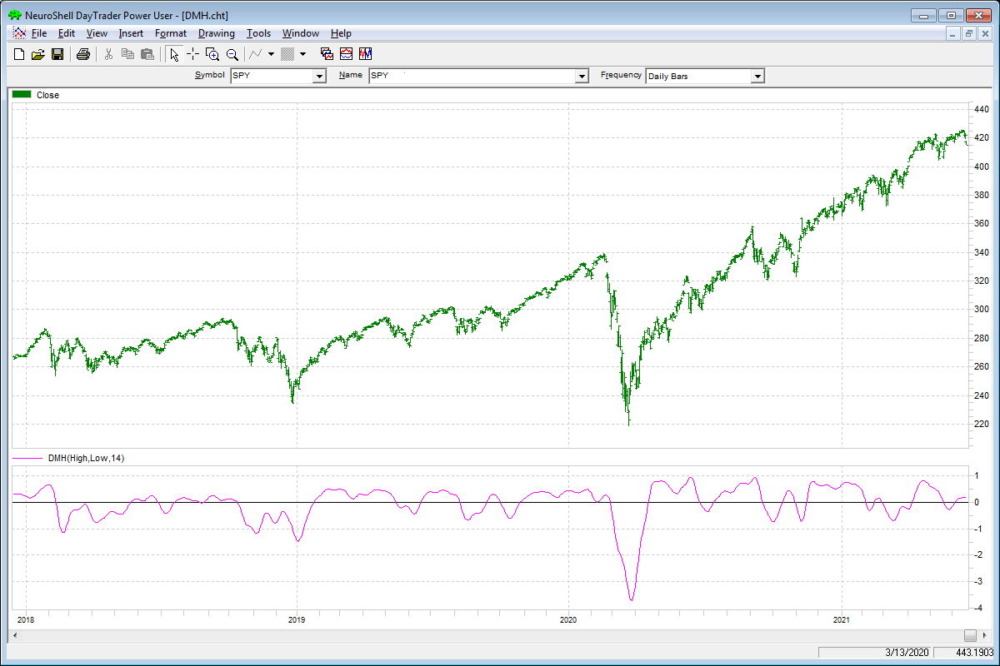

—Ward Systems Group, Inc., sales@wardsystems.com, www.neuroshell.com

---

## Optuma

In his article in this issue, "The DMH: An Improved Directional Movement Indicator," John Ehlers introduces his directional movement with Hann windowing indicator. Here is the Optuma code for implementing this indicator, using the finite impulse response (FIR) filter available with our set of Ehlers tools (optuma.com/ehlers).

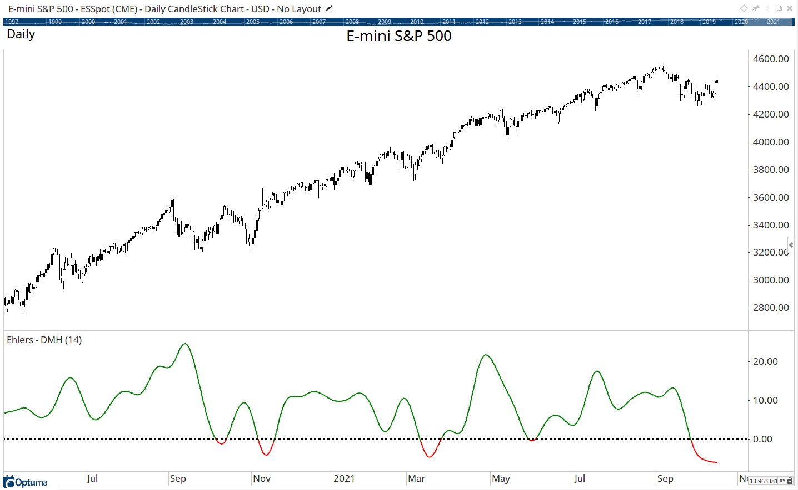

**Code file:** [DMH.optuma](code/DMH.optuma)

```optuma
//Ehlers DMH Indicator;
#$Length = 14;
PlusDM = ADX(DEFAULT=DMPlus, BARS=1);
MinusDM = ADX(DEFAULT=DMMinus, BARS=1);
DM1 = PlusDM - MinusDM;
EMA = MA(DM1, STYLE=Exponential, CALC=Close, BARS=$Length);
//Use the Finite Impulse Response function to calculate the Hann Window;
FIR(EMA, BARS=$Length, SMOOTHSTYLE=Hann)
```

—support@optuma.com

---

## TradersStudio

The importable TradersStudio files based on John Ehlers' article in this issue, "The DMH: An Improved Directional Movement Indicator," can be obtained on request.

Code for the author's indicator is provided in the following files.

Figure 9 shows the indicator on a chart of Microsoft Inc. (MSFT) during 2012 and 2013.

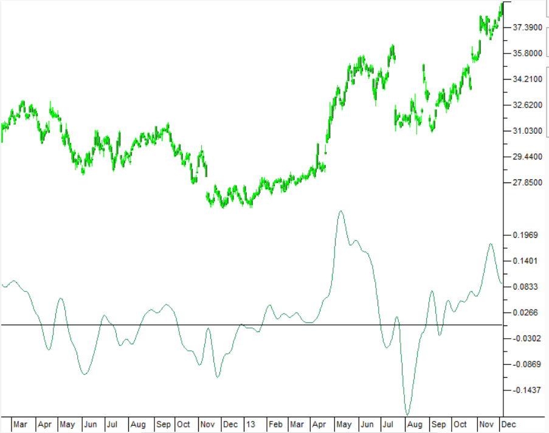

**Code file:** [DMH.trs](code/DMH.trs)

```basic
'The DMH: An Improved Directional Movement Indicator
'Author: John F. Ehlers, TASC Dec 2021
'Coded by: Richard Denning, 10/10/2021

Function EHLERS_DMH(Len1)
    'Len1 = 14
    Dim SF As BarArray
    Dim PlusDM As BarArray
    Dim MinusDM As BarArray
    Dim UpperMove As BarArray
    Dim LowerMove As BarArray
    Dim theEMA As BarArray
    Dim DMSum As BarArray
    Dim coef As BarArray
    Dim count
    Dim DMH As BarArray

    If BarNumber=FirstBar Then
        SF = 0
        PlusDM = 0
        MinusDM = 0
        UpperMove = 0
        LowerMove = 0
        theEMA = 0
        DMSum = 0
        coef = 0
        count = 0
        DMH = 0
    End If

    SF = 1 / Len1
    UpperMove = High - High[1]
    LowerMove = Low[1] - Low
    PlusDM = 0
    MinusDM = 0
    If UpperMove > LowerMove And UpperMove > 0 Then
        PlusDM = UpperMove
    Else
        If LowerMove > UpperMove And LowerMove > 0 Then
            MinusDM = LowerMove
        End If
    End If
    theEMA = SF*(PlusDM - MinusDM) + (1 - SF)* theEMA[1]

'Smooth Directional Movements with Hann Windowed FIR filter
    DMSum = 0
    coef = 0
    For count = 1 To Len1
        DMSum = DMSum + (1 - TStation_Cosine(360*count / (Len1 + 1)))*theEMA[count - 1]
        coef = coef + (1 - TStation_Cosine(360*count / (Len1 + 1)))
    Next
    If coef <> 0 Then
        DMH = DMSum / coef
    End If
    EHLERS_DMH = DMH
End Function
'------------------------------------------------------------
'INDICATOR PLOT:
Sub EHLERS_DMH_IND(Len1)
  Dim DMH As BarArray
  DMH = EHLERS_DMH(Len1)
  plot1(DMH)
  plot2(0)
End Sub
```

—Richard Denning, info@TradersEdgeSystems.com, for TradersStudio

---

## The Zorro Project

In this issue, John Ehlers describes a new usage for the Hann window in his article, "The DMH: An Improved Directional Movement Indicator." His DMH indicator is based on the difference of the positive and negative directional movements, smoothed first with an EMA and then with a Hann FIR filter.

Here is the script for replicating Ehlers' chart in his article with an SPY price curve. The resulting chart is shown in Figure 10.

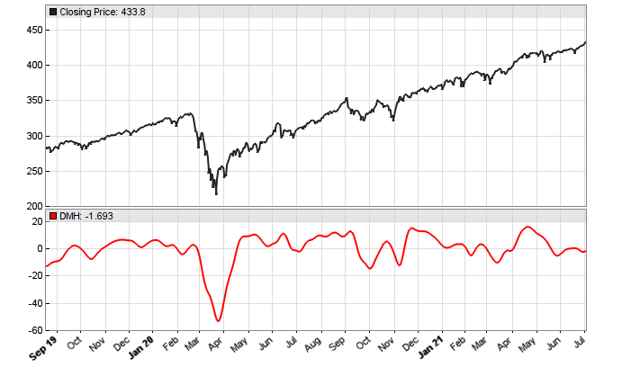

**Code file:** [DMH.c](code/DMH.c)

```c
vars hann(vars Data,int Length)
{
   vars Out = series(0,Length);
   int i;
  for(i=0; i<Length; i++)
    Out[i] = Data[i] * (1-cos(2*PI*(i+1)/(Length+1)));
  return Out;
}

var DMH(int Length)
{
  var SF = 1./Length;
  vars EMAs = series(0,Length);
  EMAs[0] = SF*(PlusDM(1)-MinusDM(1))+(1.-SF)*EMAs[1];
  return Sum(hann(EMAs,Length),Length);
}

void run()
{
  StartDate = 20190901;
  EndDate = 20210701;
  BarPeriod = 1440;

  asset("SPY");
  plot("DMH",DMH(14),NEW|LINE,RED);
}
```

—Petra Volkova, The Zorro Project by oP group Germany, https://zorro-project.com

---

## TradeStation

In the article "The DMH: An Improved Directional Movement Indicator" in this issue, John Ehlers explores a method of modernizing directional movement with Hann windowing.

A sample chart is shown in Figure 11.

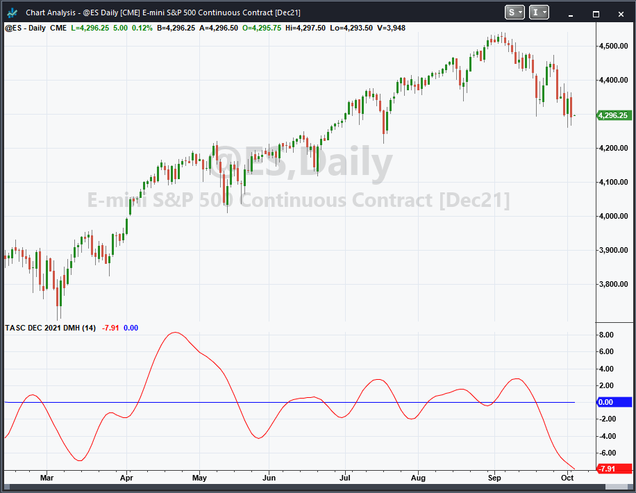

**Code file:** [DMH.els](code/DMH.els)

```easylanguage
Indicator:  TASC DEC 2021 DMH
// TASC DEC 2021
// DMH - Directional Movement using Hann windowing
// (C) 2021 John F. Ehlers

inputs:
	Length(14);

variables:
	SF(0), PlusDM(0), MinusDM(0),
	UpperMove(0), LowerMove(0), EMA(0),
	DMSum(0), coef(0), count(0), DMH(0);

SF = 1 / Length;
UpperMove = High - High[1];
LowerMove = Low[1] - Low;
PlusDM = 0 ;
MinusDM = 0 ;

if UpperMove > LowerMove and UpperMove > 0 then
	PlusDM = UpperMove
else if LowerMove > UpperMove and LowerMove > 0 then
	MinusDM = LowerMove;

EMA = SF*(PlusDM - MinusDM) + (1 - SF)* EMA[1];
//Smooth Directional Movements with Hann Windowed FIR filter

DMSum = 0;
coef = 0;

for count = 1 to Length
begin
	DMSum = DMSum + (1 - Cosine(360*count / (Length +
	 1)))*EMA[count - 1];
	coef = coef + (1 - Cosine(360*count / (Length + 1)));
end;

if coef <> 0 then DMH = DMSum / coef;

Plot1(DMH, "DMH");
Plot2(0, "Zero");
```

—John Robinson, TradeStation Securities, Inc. www.TradeStation.com

---

## Microsoft Excel

In his article in this issue, "The DMH: An Improved Directional Movement Indicator," John Ehlers presents a modification to the classic directional movement indicator using Hann windowing.

Use your Mark 1 Eyeball on Figure 12. Quite an improvement. You can observe that the moves of the DMH echo both the rallies and declines very nicely.


In an effort to reduce the potential for whipsaws, we should probably filter DMH signals with an overall trend indicator.

For comparison, in Figure 13 we have the starting point of Ehlers' discussion, the DMI (a.k.a. the ADX) plotted above the DMH.

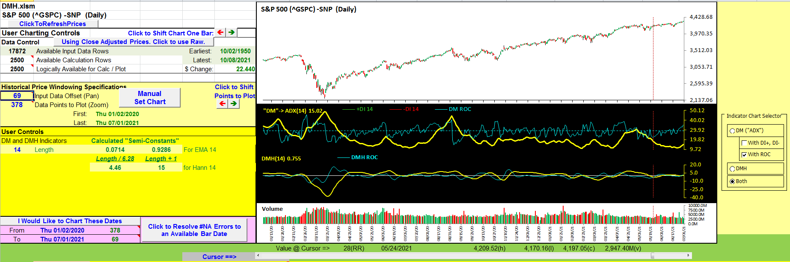

To add directionality to a DMI (ADX) chart, we add two components of the DMI calculation, the +DI and the −DI lines (see Figure 14). When the +DI line is above the −DI line, price is moving up, and vice versa.

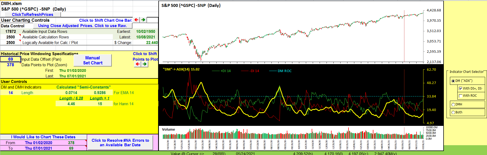

DMH does a reasonable job of taking us from needing to mentally combine three pieces of information to looking at a single indicator to get an idea of both direction and strength.

**Spreadsheet file:** [DMH.xlsm](code/DMH.xlsm)

—Ron McAllister, Excel and VBA programmer, rpmac_xltt@sprynet.com

---

*Originally published in the December 2021 issue of Technical Analysis of Stocks & Commodities magazine. All rights reserved.*

---

## BibTeX

```bibtex
@misc{tasc2021traderstips12,
  author       = {{Technical Analysis of Stocks \& Commodities}},
  title        = {Traders' Tips, December 2021},
  year         = {2021},
  month        = dec,
  url          = {https://www.traders.com/Documentation/FEEDbk_docs/2021/12/TradersTips.html},
  note         = {Traders' Tips implementations for ``The DMH: An Improved Directional Movement Indicator'' by John F. Ehlers}
}
```
