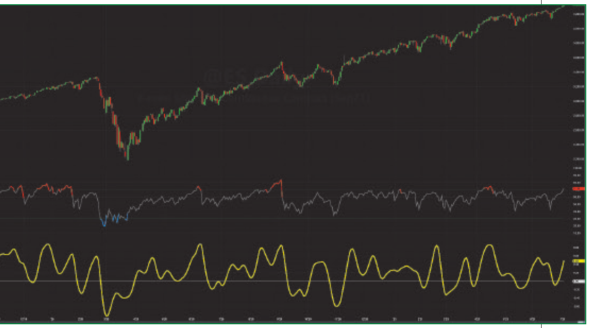

# (Yet Another) Improved RSI: Enhanced With Hann Windowing

**John F. Ehlers**
*Technical Analysis of Stocks & Commodities*, Volume 40, January 2022, pp. 26–28

- **Article URL:** <https://technical.traders.com/archive/article.asp?file=\V40\C01\357EHLE.pdf>
- **Traders' Tips URL:** <https://www.traders.com/Documentation/FEEDbk_docs/2022/01/TradersTips.html>

---

Over the years there have been many looks at this venerable, longstanding tool of technical analysis. Here, we introduce an improvement to the RSI that brings this indicator into the age of algorithmic trading. This improved RSI takes advantage of the Hann windowing technique described in an article earlier this year.

## The relative strength index, explained

The relative strength index (RSI) starts with the concept of closes up and closes down. Closes up is when the sum of the differences of the close of the current bar is higher than the close of the previous bar; otherwise, the difference is ignored. Similarly, closes down is when the sum of the differences of the close of the previous bar is higher than the close of the current bar; otherwise, the difference is ignored. The notation "CU" and "CD" means the summation over the observation period of the indicator. In other words, CU and CD are a type of finite impulse response (FIR) filter similar to the way simple moving averages are. The RSI is a function of the ratio of CU to CD.

Just to be clear, the RSI is not limited to closing prices. Any time series data can be used, because "closes up" is just a notation.

The classic RSI is defined as:

$$RSI = 100 - \frac{100}{1 + RS}\ where\ RS = \frac{CU}{CD}$$

Let's simplify the classic definition by ignoring the 100 scale factor and making the substitution for RS. The algebra gives us this simplification:

$$RSI = 1 - \frac{1}{1 + \frac{CU}{CD}} = 1 - \frac{CD}{CU + CD} = \frac{CU + CD - CD}{CU + CD} = \frac{CU}{CU + CD}$$

Now, it is easy to see that the RSI swings from zero, when there are no closes up, to 1, when there are no closes down.

At this point, I would like to depart from the classic RSI because I prefer oscillator-type indicators to have a zero mean. We can achieve this simply by multiplying the classic RSI by 2, so it swings from zero to 2, and then subtract 1 from the product so the indicator swings from −1 to +1. When we do this, the algebra gives us a new indicator as:

$$RSI = \frac{2 \cdot CU}{CU + CD} - 1 = \frac{2 \cdot CU - CU - CD}{CU + CD} = \frac{CU - CD}{CU + CD}$$

Again, CU and CD are basically simple moving averages (SMAs). In my September 2021 Stocks & Commodities article "Windowing," I showed that moving averages are not particularly good filters and that the results of FIR filters can be improved through the use of Hann windowing. Using Hann windows eliminates the need for additional filtering of the RSI because the smoothing is native to the computation itself.

## Introducing an improved RSI: The RSIH

I call my improved RSI the "RSIH," where the "H" stands for "Hann window." The RSIH is simply the classic RSI dilated and translated to swing from −1 to +1 with Hann windows used to compute CU and CD.

### The RSIH (EasyLanguage Code)

```easylanguage
{
  RSIH - RSI with Hann Windowing
  (C) 2005-2021 John F. Ehlers
}

Inputs:
  RSILength(14);

Vars:
  count(0),
  CU(0),
  CD(0),
  MyRSI(0);

//Accumulate "Closes Up" and "Closes Down"
CU = 0;
CD = 0;
For count = 1 to RSILength Begin
  If Close[count - 1] - Close[count] > 0 Then
    CU = CU + (1 - Cosine(360*count / (RSILength + 1)))*(Close[count - 1] - Close[count]);
  If Close[count] - Close[count - 1] > 0 Then
    CD = CD + (1 - Cosine(360*count / (RSILength + 1)))*(Close[count] - Close[count - 1]);
End;

If CU + CD <> 0 Then MyRSI = (CU - CD) / (CU + CD);

Plot1(MyRSI, "", red, 4, 4);
Plot2(0, "", white, 1, 1);
```

The EasyLanguage code for this improved RSI is given in the sidebar above. In Figure 1, the classic RSI and the improved RSIH are shown for comparison. The classic RSI is shown in the first subgraph and the RSIH is shown in the second subgraph in yellow. The length parameter input in both cases is 14.

Bear in mind that 14 may not be the best analysis length. The RSI reaches its peak when there are no "closes down." This is from the cycle valley to the cycle peak of a theoretical sine wave. Thus, the correct RSI analysis length is half the dominant cycle period in the data. The Hann windowing requires that the window length be longer to get the equivalent amount of smoothing of a simple average. So, the best length to use for an RSIH indicator is on the order of the dominant cycle period in the data.


**Figure 1: The RSI vs. The RSIH.** The classic RSI indicator (upper pane) is enhanced with Hann windowing to become the RSIH (lower pane). The RSIH has a zero mean and is smoother than the classic RSI.

## Enhanced indicators for our times

My recent research into the nature of market data and the characteristics of cycles that occur in data has led me to make some significant improvements in the indicators and oscillators I use for trading. The research has evolved my outlook on market data and on trend/cycle analytics. It has also led me to update many classic indicators for trading—such as the RSI, as presented in this article. I hope you will find the RSIH, enhanced with Hann windowing, a useful improvement.

---

*John Ehlers, a Contributing Editor to Stocks & Commodities, is a pioneer in the use of cycles and DSP (digital signal processing) technical analysis. He is president of MESA Software. He can be reached through his website at MESAsoftware.com.*

*The code given in this article is available in the Article Code section of our website, Traders.com.*

*See our Traders' Tips section beginning on page 50 for implementation of John Ehlers' technique in various technical analysis programs and trading platforms. Accompanying program code can be found in the Traders' Tips area at Traders.com.*

## Further reading

- Ehlers, John F. [2021]. "Windowing," *Technical Analysis of Stocks & Commodities*, Volume 39: September.
- Ehlers, John F. [2021]. "Cycle/Trend Analytics And The MAD Indicator," *Technical Analysis of Stocks & Commodities*, Volume 39: October.
- Ehlers, John F. [2021]. "The MAD Indicator, Enhanced," *Technical Analysis of Stocks & Commodities*, Volume 39: November.
- Ehlers, John F. [2021]. "The DMH: An Improved Directional Movement Indicator," *Technical Analysis of Stocks & Commodities*, Volume 39: December.
- Wilder Jr., J. Welles [1986]. "The Relative Strength Index," *Technical Analysis of Stocks & Commodities*, Volume 4: December.
- Wilder Jr., J. Welles [1978]. *New Concepts In Technical Trading Systems*, Trend Research.

---

## BibTeX

```bibtex
@article{ehlers2022rsih,
  author  = {Ehlers, John F.},
  title   = {(Yet Another) Improved RSI: Enhanced With Hann Windowing},
  journal = {Technical Analysis of Stocks \& Commodities},
  volume  = {40},
  number  = {1},
  pages   = {26--28},
  year    = {2022},
  month   = jan,
  url     = {https://technical.traders.com/archive/article.asp?file=\V40\C01\357EHLE.pdf}
}

@misc{tasc2022traderstips01,
  author       = {{Technical Analysis of Stocks \& Commodities}},
  title        = {Traders' Tips, January 2022},
  year         = {2022},
  month        = jan,
  url          = {https://www.traders.com/Documentation/FEEDbk_docs/2022/01/TradersTips.html},
  note         = {Traders' Tips implementations for ``(Yet Another) Improved RSI'' by John F. Ehlers}
}
```
