# Traders' Tips: January 2022

**(Yet Another) Improved RSI** by John F. Ehlers

- **Traders' Tips URL:** <https://www.traders.com/Documentation/FEEDbk_docs/2022/01/TradersTips.html>

---

## TradeStation

In his article in this issue, "(Yet Another) Improved RSI," John Ehlers explains how he enhances the RSI by taking advantage of Hann windowing to smooth the indicator while maintaining its responsiveness.

A sample chart is shown in Figure 1.

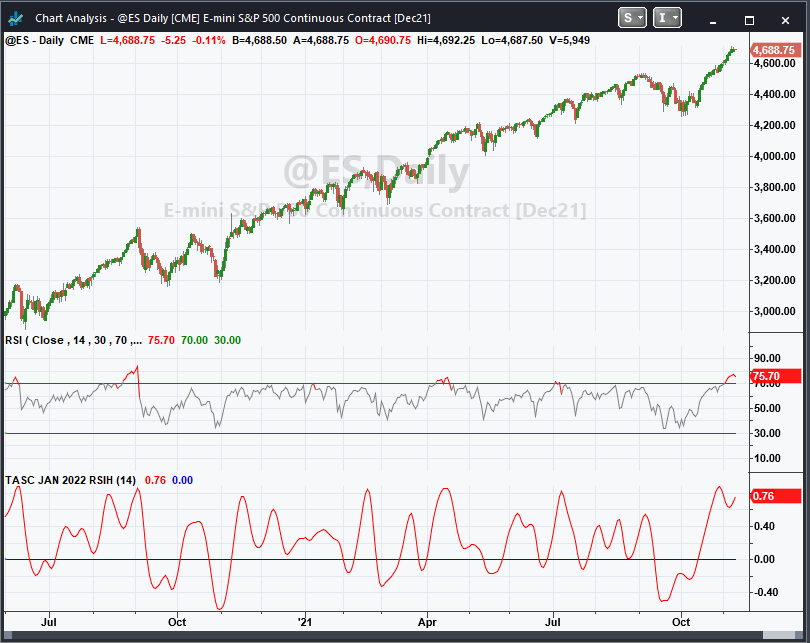

**Code file:** [RSIH.els](code/RSIH.els)

```easylanguage
Indicator:  TASC DEC 2021 RSIH
// TASC JAN 2022
// RSIH - RSI with Hann Windowing
// (C) 2005-2021 John F. Ehlers

inputs:
	RSILength(14);
	
variables:
	count(0),
	CU(0),
	CD(0),
	MyRSI(0);
	
// Accumulate "Closes Up" and "Closes Down"
CU = 0;
CD = 0;

for count = 1 to RSILength begin
	if Close[count - 1] - Close[count] > 0 then 
	 CU = CU + (1 - Cosine(360*count / (RSILength + 1)))
	 *(Close[count - 1] - Close[count]);
	if Close[count] - Close[count - 1] > 0 then 
	 CD = CD + (1 - Cosine(360*count / (RSILength + 1)))
	 *(Close[count] - Close[count - 1]);
end;

if CU + CD <> 0 then 
	MyRSI = (CU - CD) / (CU + CD);

Plot1(MyRSI, "RSIH");
Plot2(0, "Zero"); 
```

—John Robinson, TradeStation Securities, Inc. www.TradeStation.com

---

## TradingView

Here is the TradingView Pine code for implementing the RSIH indicator based on John Ehlers' article in this issue.

The indicator is available on TradingView from the PineCodersTASC account: https://www.tradingview.com/u/PineCodersTASC/#published-scripts

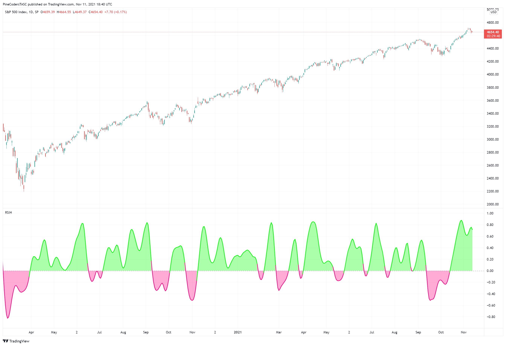

**Code file:** [RSIH.pine](code/RSIH.pine)

```pine
//  TASC Issue: January 2022 - Vol. 40, Issue 1
//     Article: "(Yet Another) Improved RSI
//               Enhanced With Hann Windowing"
//  Article By: John F. Ehlers
//    Language: TradingView's Pine Script v5
// Provided By: PineCoders, for tradingview.com

//@version=5
indicator("TASC 2022.01 Improved RSI w/Hann", "RSIH")

lengthInput = input.int(14, "Length:", minval = 2)

rsih(length) =>
    var float PIx2 = 2 * math.pi
    // Accumulate "Closes Up" and "Closes Down"
    cu = 0.0
    cd = 0.0
    for count = 1 to length
    	change = close[count] - close[count - 1]
    	absChange = math.abs(change)
    	cosPart = math.cos(PIx2 * count / (length + 1))
    
    	if change < 0
    		cu := cu + (1 - cosPart) * absChange
    	else if change > 0
    		cd := cd + (1 - cosPart) * absChange

    result = nz((cu - cd) / (cu + cd))

signal = rsih(lengthInput)
plotColor = signal > 0.0 ? #00FF00   : #FF0080
areaColor = signal > 0.0 ? #00FF0055 : #FF008055
plot(signal, "Area", areaColor, 1, plot.style_area)
plot(signal, "RSIH", plotColor, 2)
hline(0, "Zero", color.gray)
```

—PineCoders, for TradingView, https://www.tradingview.com

---

## eSignal

For this month's Traders' Tip, we've provided the study "RSI with Hann Windowing.efs" based on the article in this issue by John Ehlers.

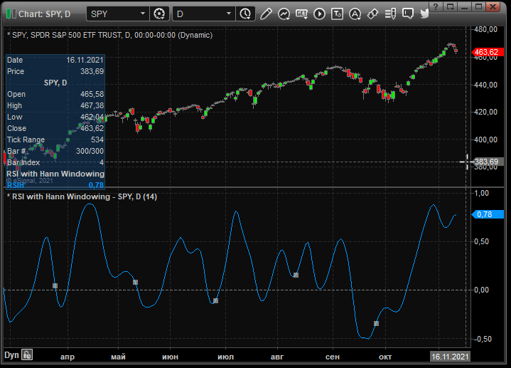

**Code file:** [RSIwithHannWindowing.efs](code/RSIwithHannWindowing.efs)

—eSignal, an ICE business, www.esignal.com

---

## Wealth-Lab

The RSIH indicator is ready for use in Wealth-Lab 7. According to Ehlers, the default period 14 may not be the optimal period and a better period is half the dominant cycle period in the data.

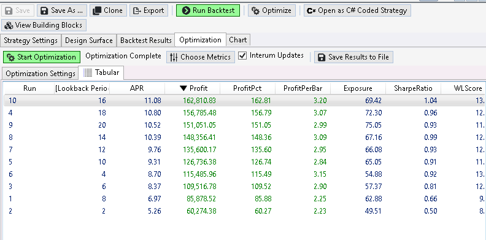

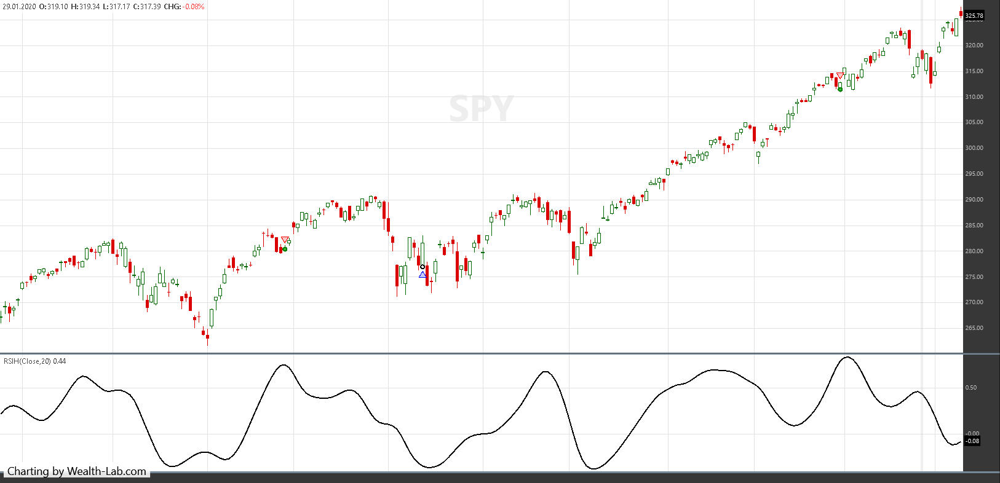

—Gene Geren (Eugene), Wealth-Lab team, www.wealth-lab.com

---

## NinjaTrader

The RSIH indicator is discussed in John Ehlers' article in this issue. It can be imported into NinjaTrader 8 from within the control center by selecting Tools → Import → NinjaScript Add-On.

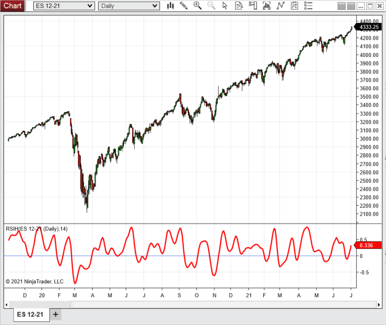

**Code file:** [RSIH.cs](ninja-trader/RSIH.cs)

—Chris Lauber, NinjaTrader, LLC, www.ninjatrader.com

---

## Neuroshell Trader

John Ehlers' RSIH indicator can be easily implemented in NeuroShell Trader using NeuroShell Trader's ability to call external DLLs.

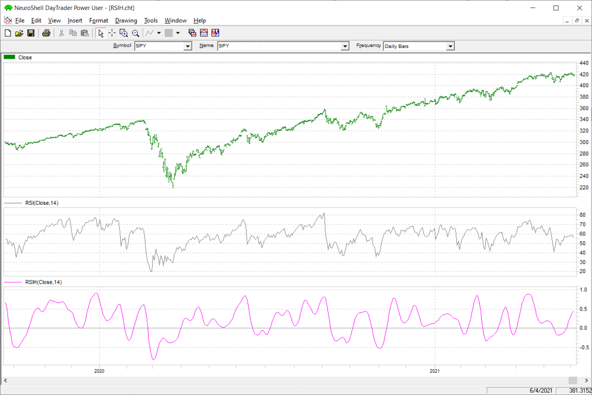

—Ward Systems Group, Inc., www.neuroshell.com

---

## Optuma

In his article in this issue, John Ehlers introduces a new version of the classic RSI oscillator by applying Hann windowing coefficients.

At www.optuma.com/ehlers users will find a collection of tools designed by John Ehlers including the RSIH.

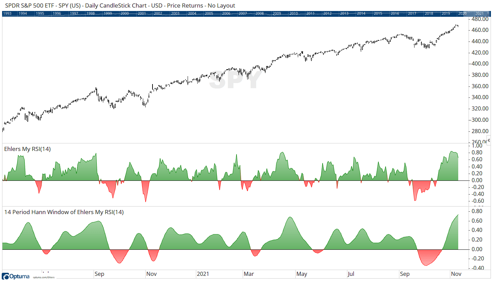

**Code file:** [RSIH.optuma](code/RSIH.optuma)

```optuma
//Set Length;
#$Length = 14;
//Calculate Ehlers MyRSI;
R1 = MYRSI(BARS=$Length);
//Use the Hann Finite Impulse Response Filter of the MyRSI;
FIR(R1, BARS=$Length, SMOOTHSTYLE=Hann)
```

—Optuma, www.optuma.com

---

## TradersStudio

The importable TradersStudio files based on John Ehlers' article in this issue can be obtained on request.

Figure 9 shows the indicator on a chart of Microsoft Inc. (MSFT) during 2012 and 2013.

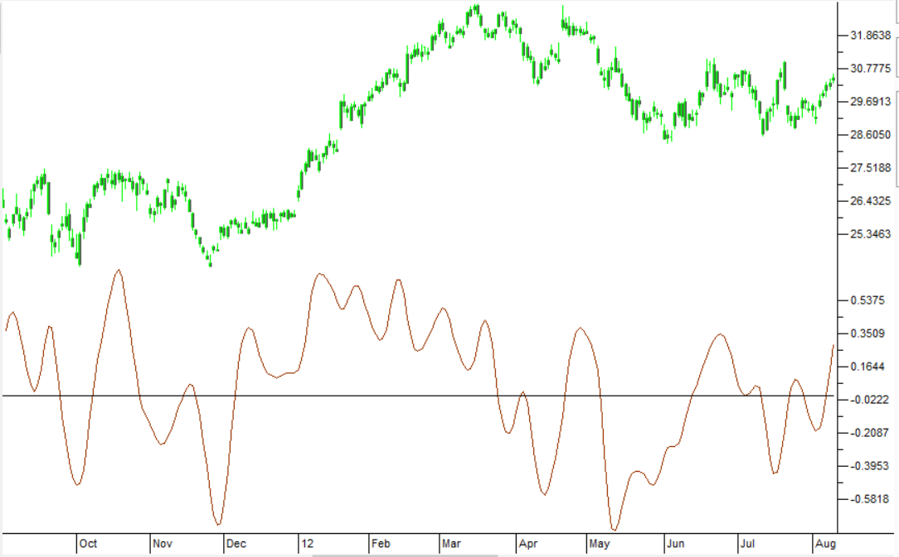

**Code file:** [RSIH.trs](code/RSIH.trs)

```basic
'(Yet Another) Improved RSI
'Author: John F. Ehlers, TASC Jan 2022
'Coded by: Richard Denning, 11/05/2021

'RSIH - RSI with Hann Windowing
'(C) 2005-2021  John F. Ehlers

Function EHLERS_RSIH(RSILength)
    Dim count
    Dim CU As BarArray
    Dim CD As BarArray
    Dim MyRSI As BarArray

    If BarNumber=FirstBar Then
        count = 0
        CU = 0
        CD = 0
        MyRSI = 0
    End If

    CU = 0
    CD = 0
    For count = 1 To RSILength
        If Close[count - 1] - Close[count] > 0 Then
            CU = CU + (1 - TStation_Cosine(360*count/(RSILength+1)))*(Close[count-1]-Close[count])
        End If
        If Close[count] - Close[count - 1] > 0 Then
            CD = CD + (1 - TStation_Cosine(360*count/(RSILength+1)))*(Close[count]-Close[count-1])
        End If
    Next

    If CU + CD <> 0 Then
        MyRSI = (CU - CD)/(CU + CD)
    End If

    EHLERS_RSIH = MyRSI
End Function
'-----------------------------------
'INDICATOR PLOT
Sub EHLERS_RSIH_IND(RSIHLength)
Dim myRSIH As BarArray
myRSIH = EHLERS_RSIH(RSIHLength)
plot1(myRSIH)
plot2(0)
End Sub
```

—Richard Denning, info@TradersEdgeSystems.com, for TradersStudio

---

## The Zorro Project

In this issue, John Ehlers introduces a new version of the classic RSI oscillator improved by applying Hann windowing. The RSIH is an RSI with the Hann window applied to the price differences.

The resulting chart (Figure 10) matches Ehlers' example chart. The curve by the RSIH is smoother than the original RSI.

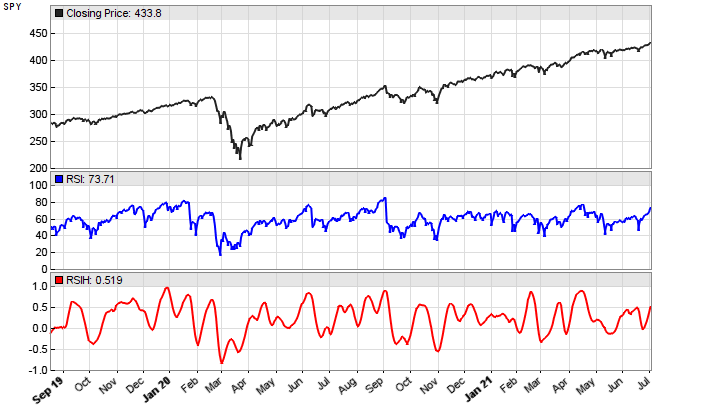

**Code file:** [RSIH.c](code/RSIH.c)

```c
var RSIH(vars Data, int Length) {
   var CU = 0, CD = 0;
  int i;
  for(i=1; i<Length; i++) {
    var D = priceClose(i-1)-priceClose(i);
    var Hann = 1-cos(2*PI*i/(Length+1));
    if(D > 0) CU += Hann*D;
    else if(D < 0) CD -= Hann*D;
  }
  if(CU+CD != 0)
    return (CU-CD) / (CU+CD);
  else return 0;
}


void run() {
  StartDate = 20190901;
  EndDate = 20210701;
  BarPeriod = 1440;

  asset("SPY");
  plot("RSI",RSI(seriesC(),14),NEW|LINE,BLUE);
  plot("RSIH",RSIH(seriesC(),14),NEW|LINE,RED);
}
```

—Petra Volkova, The Zorro Project by oP group Germany, https://zorro-project.com

---

## thinkorswim

We put together a study based on the article by John Ehlers titled "(Yet Another) Improved RSI." The chart in Figure 11 shows the study added to a two-year daily chart of SPY, along with the classic RSI for comparison.

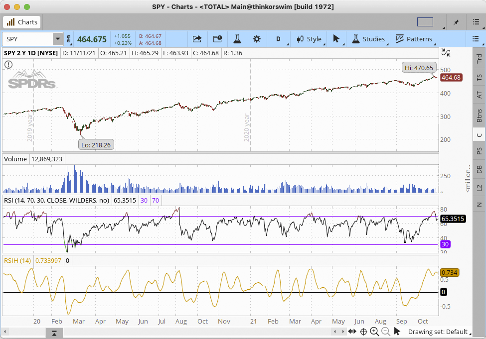

—thinkorswim, A division of TD Ameritrade, Inc. www.thinkorswim.com

---

## Microsoft Excel

In his article in this issue, John Ehlers presents a modification to the classic RSI indicator by using Hann windowing coefficients.

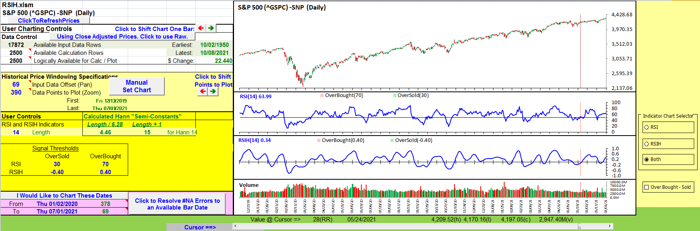

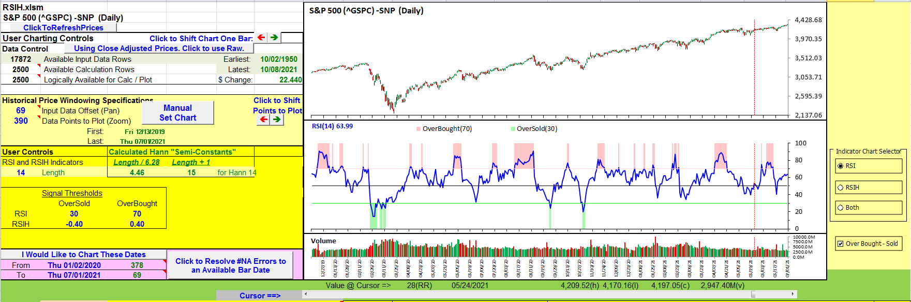

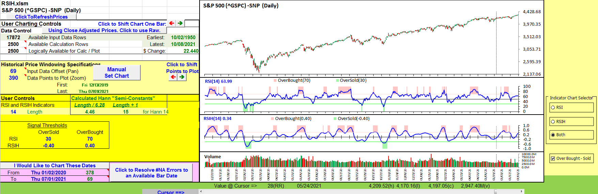

**Spreadsheet file:** [RSIH.xlsm](code/RSIH.xlsm)

—Ron McAllister, Excel and VBA programmer, rpmac_xltt@sprynet.com

---

*Originally published in the January 2022 issue of Technical Analysis of Stocks & Commodities magazine. All rights reserved.*

---

## BibTeX

```bibtex
@misc{tasc2022traderstips01,
  author       = {{Technical Analysis of Stocks \& Commodities}},
  title        = {Traders' Tips, January 2022},
  year         = {2022},
  month        = jan,
  url          = {https://www.traders.com/Documentation/FEEDbk_docs/2022/01/TradersTips.html},
  note         = {Traders' Tips implementations for ``(Yet Another) Improved RSI'' by John F. Ehlers}
}
```
