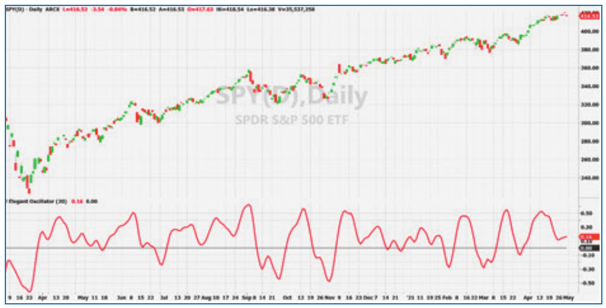

# Inverse Fisher Transform Redux: An Elegant Oscillator

**John F. Ehlers**
*Technical Analysis of Stocks & Commodities*, Volume 40, February 2022, pp. 19–23

- **Article URL:** <https://technical.traders.com/archive/article.asp?file=\V40\C02\372EHLE.pdf>
- **Traders' Tips URL:** <https://www.traders.com/Documentation/FEEDbk_docs/2022/02/TradersTips.html>

---

Swing traders will welcome the improved timing capability of the indicator presented here, named the "elegant oscillator." It uses the inverse Fisher transform to help you spot reversion-to-the-mean opportunities.

## First, the Fisher transform

Starting with a conventional amplitude-limited oscillator, like a stochastic or RSI, and scaled to swing between −1 and +1, the purpose of the Fisher transform is to convert the waveshape to one that has a nearly Gaussian probability distribution. The Fisher transform converts the original amplitudes to be scaled in terms of standard deviations. The original waveform actually needs to be limited to swing between −0.999 and +0.999 so the largest outputs are ±3 standard deviations. The swing can be increased to be as large as four standard deviations by limiting the original waveform to swing between −0.9999 and +0.9999. Not limiting the Fisher transform input can easily blow up because of a divide-by-zero error.

I provide a code fragment in EasyLanguage for the Fisher transform in the sidebar below. The interpretation of the transformed waveform is that the further the swing from zero, the higher the probability of reversion to the mean. That is, it enhances the decision capability for swing trading.

### Fisher Transform Code Fragment (EasyLanguage)

```easylanguage
If Wave > .999 Then Wave = .999;
If Wave < -.999 Then Wave = -.999;
Fisher = Log( ( 1 + Wave ) / ( 1 - Wave ) ) * .5;
```

## And now, the inverse Fisher transform

As the name implies, the inverse Fisher transform does exactly the opposite. Starting with an oscillator waveform that is widely swinging, the inverse Fisher transform compresses the waveform to one that is limited to swing between −1 and +1. The feature missing in most literature is that the original waveform is assumed to have a nominal Gaussian probability distribution. Therefore, it is good practice to scale the original waveform in terms of standard deviations before applying the inverse Fisher transform.

Scaling the waveform in units of standard deviations is easy. Since an oscillator waveform has a nominal zero mean, the standard deviation is just its root mean square (RMS). The RMS is computed by summing the square of the waveform over a sufficiently large number of samples, and then taking the square root of that sum divided by the number of samples. The normalization is done by dividing the RMS value into the waveform.

Since the inverse Fisher transform compresses the RMS-scaled waveform to swing between −1 and +1 by squishing down the larger swings, it acts as a soft limiter. A soft limiter is preferable to a hard limiter because the severe nonlinearity of a hard limiter introduces significant high-frequency noise components to the waveform that are ultimately difficult to remove by filtering. My new application of the inverse Fisher transform is to act as a soft limiter.

## Introducing an elegant oscillator

In my May 2021 S&C article, "A Technical Description Of Market Data For Traders," I shared some of my recent research on the nature of market data with a close look at cycle and noise components of market data. Based on that research, I described steps I came up with to model market data more accurately and improve how we capture market timing information in oscillator-type indicators.

An elegant and robust oscillator for trading can be created in three steps:

1. Take the derivative of the data to whiten the spectrum.
2. Limit the amplitude swings of the derivative to strip the volatility from the timing components.
3. Integrate the limited waveform. A smoothing filter acts as an integrator. The process of taking the derivative and then the integral recreates the data waveform as a smoothed indicator with a nominal zero mean.

### The Elegant Oscillator (EasyLanguage Code)

```easylanguage
{
  The Elegant Oscillator
  (c) 2021 John F. Ehlers
}

Inputs:
  BandEdge(20);

Vars:
  Deriv(0), RMS(0), count(0), NDeriv(0), IFish(0),
  a1(0), b1(0), c1(0), c2(0), c3(0), SS(0);

//Take the derivative of prices
Deriv = Close - Close[2];

//Normalize to standard deviation
RMS = 0;
For count = 0 to 49 Begin
  RMS = RMS + Deriv[count]*Deriv[count];
End;

If RMS <> 0 Then RMS = SquareRoot(RMS / 50);
NDeriv = Deriv / RMS;

//Compute the Inverse Fisher Transform
IFish = (ExpValue(2*NDeriv) - 1) / (ExpValue(2*NDeriv) + 1);

//Integrate with SuperSmoother
a1 = expvalue(-1.414*3.14159 / BandEdge);
b1 = 2*a1*Cosine(1.414*180 / BandEdge);
c2 = b1;
c3 = -a1*a1;
c1 = 1 - c2 - c3;
SS = c1*(IFish + IFish[1]) / 2 + c2*SS[1] + c3*SS[2];
If Currentbar < 3 Then SS = 0;

//Plot the indicator
Plot1(SS,"SS", red, 4, 4);
Plot2(0,"ref", black, 1, 1);
```

The only input is the BandEdge of the SuperSmoother filter. The default setting of 20 is used to retain cycle components whose wavelengths are longer than the nominal monthly cycle period. After declaring variables, the derivative is taken as the two-bar difference of closing prices. A one-bar difference of sampled data is roughly the equivalent of a derivative in calculus. This whitens the spectrum and removes the zero-frequency component from the prices. A two-bar difference is used because this also provides a zero in the transfer response at the Nyquist frequency, reducing high-frequency noise.

The next step computes the RMS value of *Deriv* using the last 50 values. The number of samples is not critical and 50 is a convenient number because it will not exceed the default "max bars back" limit if the oscillator is used in a strategy. The computation sums the square of the *Deriv* over the last 50 bars, and the RMS value is the SquareRoot of the averaged sum. The RMS value is then divided into the *Deriv* to form *NDeriv*, scaling it in terms of standard deviations. The scaled deviation is then soft-limited in the inverse Fisher transform and then smoothed in my SuperSmoother filter. It is displayed as an oscillator. The BandEdge input of the SuperSmoother can be changed to make the oscillator be either smoother or more reactive.

An example of the elegant oscillator is shown in Figure 1. A comparison of the peaks and valleys of the prices to the peaks and valleys of the elegant oscillator show that it is virtually in sync with the price waveform with little or no lag. The peaks and valleys of the elegant oscillator provide excellent selling and buying opportunities, following the principles of reversion to the mean.



## Hard and soft limiter comparison

Since the inverse Fisher transform is a key part of the elegant oscillator, it is worth examining the difference between its response and the response of a hard limiter. This comparison is made with reference to the code listing given in the sidebar below. The *Deriv* is first soft-limited in the inverse Fisher transform. For simplicity, the integrator in this case is a finite impulse response (FIR) filter with zeros in its transfer response at two-, three-, and four-bar cycle periods. In the second code group, *Deriv* is hard-limited by an amplitude clipper. The hard-limited waveform is also smoothed in an identical FIR filter.

In Figure 2, the resultant waveform using the inverse Fisher transform is plotted in red and the hard-limited waveform is plotted in blue. Clearly, the short-term swings of the blue waveform are much larger than the short-term swings of the red waveform. Therefore, the conclusion is that it is much better to use the inverse Fisher transform as a soft limiter.

### Soft and Hard Limiter Comparison (EasyLanguage Code)

```easylanguage
Vars:
  Deriv(0),
  RMS(0),
  count(0),
  NDeriv(0),
  IFish(0),
  Integ(0),
  Clip(0),
  IntegClip(0);

Deriv = Close - Close[2];

RMS = 0;
For count = 0 to 49 Begin
  RMS = RMS + Deriv[count]*Deriv[count];
End;

If RMS <> 0 Then RMS = SquareRoot(RMS / 50);
NDeriv = Deriv / RMS;
IFish = (ExpValue(2*NDeriv) - 1) / (ExpValue(2*NDeriv) + 1);
Integ = (IFish + 2*IFish[1] + 3*IFish[2] + 3*IFish[3] + 2*IFish[4] +
  IFish[5]) / 12;

Clip = Deriv;
If Clip > 1 Then Clip = 1;
If Clip < -1 Then Clip = -1;
IntegClip = (Clip + 2*Clip[1] + 3*Clip[2] + 3*Clip[3] + 2*Clip[4] +
  Clip[5]) / 12;

Plot1(Integ,"IFish", red, 4, 4);
Plot2(0,"ref", black, 1, 1);
Plot3(IntegClip,"Clip", blue, 4, 4);
```


---

*John Ehlers, a Contributing Editor to Stocks & Commodities, is a pioneer in the use of cycles and DSP (digital signal processing) technical analysis. He is president of MESA Software. He can be reached through his website at MESAsoftware.com.*

*The code given in this article is available in the Article Code section of our website, Traders.com.*

*See our Traders' Tips section beginning on page 50 for implementation of John Ehlers' technique in various technical analysis programs and trading platforms. Accompanying program code can be found in the Traders' Tips area at Traders.com.*

## Further reading

- Ehlers, John F. [2002]. "Using the Fisher Transform," *Technical Analysis of Stocks & Commodities*, Volume 20: October.
- Ehlers, John F. [2004]. "The Inverse Fisher Transform," *Technical Analysis of Stocks & Commodities*, Volume 22: May.
- Ehlers, John F. [2004]. *Cybernetic Analysis For Stocks And Futures*, John Wiley & Sons.
- Ehlers, John F. [2013]. *Cycle Analytics For Traders*, John Wiley & Sons.
- Ehlers, John F. [2021]. "A Technical Description of Market Data for Traders," *Technical Analysis of Stocks & Commodities*, Volume 39: May.

---

## BibTeX

```bibtex
@article{ehlers2022inversefisher,
  author  = {Ehlers, John F.},
  title   = {Inverse Fisher Transform Redux: An Elegant Oscillator},
  journal = {Technical Analysis of Stocks \& Commodities},
  volume  = {40},
  number  = {2},
  pages   = {19--23},
  year    = {2022},
  month   = feb,
  url     = {https://technical.traders.com/archive/article.asp?file=\V40\C02\372EHLE.pdf}
}

@misc{tasc2022traderstips02,
  author       = {{Technical Analysis of Stocks \& Commodities}},
  title        = {Traders' Tips, February 2022},
  year         = {2022},
  month        = feb,
  url          = {https://www.traders.com/Documentation/FEEDbk_docs/2022/02/TradersTips.html},
  note         = {Traders' Tips implementations for ``Inverse Fisher Transform Redux'' by John F. Ehlers}
}
```
