# Traders' Tips: February 2022

**An Elegant Oscillator** by John F. Ehlers

- **Traders' Tips URL:** <https://www.traders.com/Documentation/FEEDbk_docs/2022/02/TradersTips.html>

---

## TradeStation

In his article in this issue, "An Elegant Oscillator: Inverse Fisher Transform Redux," author John Ehlers explains how he uses the inverse Fisher transform to create an indicator he calls the *elegant oscillator*. First, he describes the Fisher transform before explaining the inverse Fisher transform, which provides normalization by dividing the root mean square (RMS) value into the derivative data series. Then, with the data scaled in units of standard deviations, the inverse Fisher transform is applied to compress, or "soft limit" the data to values between −1 and +1. This soft-limited data is then applied to a SuperSmoother filter to produce the final elegant oscillator values.

A sample chart is shown in Figure 1.

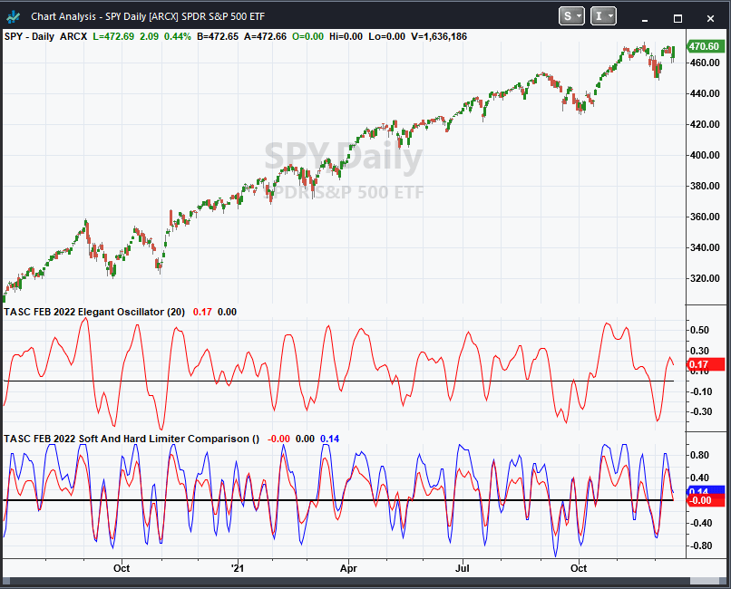

**Code file:** [ElegantOscillator.els](code/ElegantOscillator.els)

```easylanguage
Indicator:  TASC FEB 2022 Elegant Oscillator
{
	TASC FEB 2022
	The Elegant Oscillator
	(c) 2021 John F. Ehlers
}

inputs:
	BandEdge(20);
	
variables:
	Deriv(0), RMS(0), count(0), NDeriv(0), IFish(0),
	a1(0), b1(0), c1(0), c2(0), c3(0), SS(0);

//Take the derivative of prices
Deriv = Close - Close[2];
//Normalize to standard deviation
RMS = 0;

for count = 0 to 49 
begin
	RMS = RMS + Deriv[count]*Deriv[count];
end;

if RMS <> 0 then 
	RMS = SquareRoot(RMS / 50);
	
NDeriv = Deriv / RMS;

//Compute the Inverse Fisher Transform
IFish = (ExpValue(2*NDeriv) - 1) / (ExpValue(2*NDeriv) + 1);

//Integrate with SuperSmoother
a1 = expvalue(-1.414*3.14159 / BandEdge);
b1 = 2*a1*Cosine(1.414*180 / BandEdge);
c2 = b1;
c3 = -a1*a1;
c1 = 1 - c2 - c3;
SS = c1*(IFish + IFish[1]) / 2 + c2*SS[1] + c3*SS[2];
if Currentbar < 3 
	then SS = 0;
	
//Plot the indicator
Plot1(SS,"SS", red);
Plot2(0,"ref", black)


Indicator:  TASC FEB 2022 Elegant Oscillator

{
	TASC FEB 2022
	Soft And Hard Limiter Comparison
	2021 John F. Ehlers
}

variables:
	Deriv(0),
	RMS(0),
	count(0),
	NDeriv(0),
	IFish(0),
	Integ(0),
	Clip(0),
	IntegClip(0);
	Deriv = Close - Close[2];
	RMS = 0;
	
for count = 0 to 49 
begin
	RMS = RMS + Deriv[count]*Deriv[count];
end;

if RMS <> 0 
	then RMS = SquareRoot(RMS / 50);
	
NDeriv = Deriv / RMS;
IFish = (ExpValue(2*NDeriv) - 1) / (ExpValue(2*NDeriv) + 1);
Integ = (IFish + 2*IFish[1] + 3*IFish[2] + 3*IFish[3] 
 + 2*IFish[4] + IFish[5]) / 12;
Clip = Deriv;

if Clip > 1 
	then Clip = 1;
if Clip < -1 
	then Clip = -1;

IntegClip = (Clip + 2*Clip[1] + 3*Clip[2] + 3*Clip[3] 
 + 2*Clip[4] + Clip[5]) / 12;

Plot1(Integ,"IFish", red);
Plot2(0,"ref", black, 1, 1);
Plot3(IntegClip,"Clip", blue);
```

—John Robinson, TradeStation Securities, Inc. www.TradeStation.com

---

## thinkorswim

We have put together a pair of studies based on the article by John Ehlers in this issue titled "An Elegant Oscillator: Inverse Fisher Transform Redux." The two studies can be seen on the one-year daily aggregation chart of SPY in Figure 2.

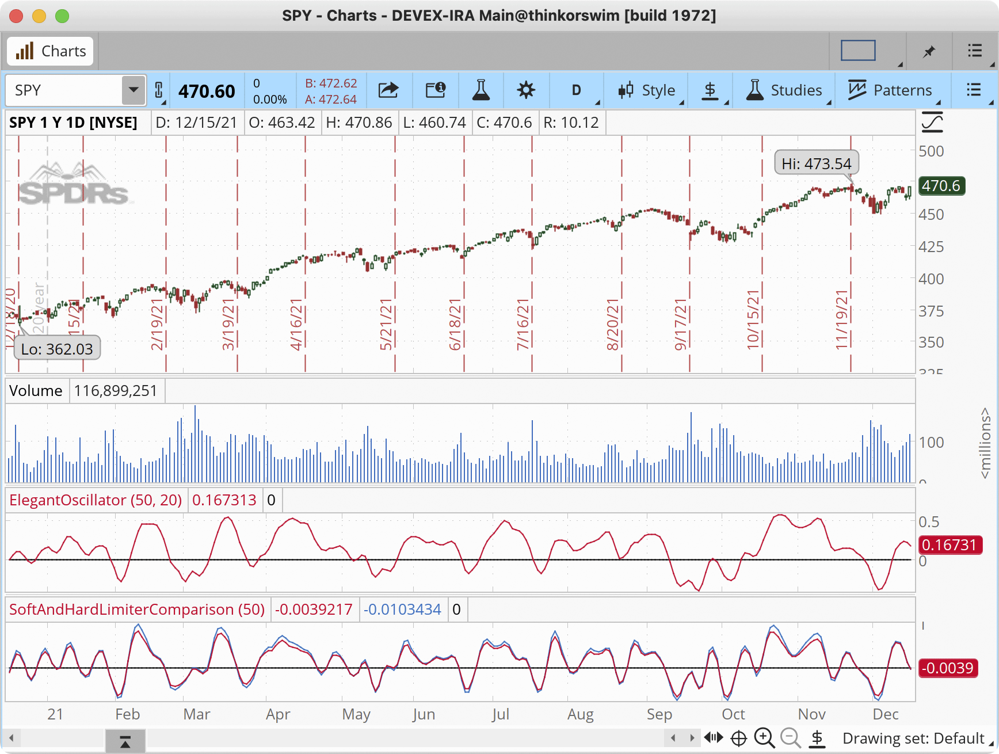

—thinkorswim, A division of TD Ameritrade, Inc. www.thinkorswim.com

---

## MetaStock

Here is the MetaStock formula implementing the elegant oscillator indicator.

**Code file:** [ElegantOscillator.mst](code/ElegantOscillator.mst)

```metastock
pds:= 20;  {BandEdge}
deriv:= C-Ref(C, -2);
RMS:= Sum(deriv * deriv, 50);
rms2:= Sqrt(rms/50);
denom:= If(rms2=0, -1, rms2);
nderiv:= If(denom= -1, 1, deriv/denom);
ifish:= (Exp(2*nderiv)-1) / (Exp(2*nderiv)+1);
a1:= Exp(-1.414*3.14159 / pds);
b1:= 2*a1*Cos(1.414*180 / pds);
c3:= -a1*a1;
c1:= 1 - b1 - c3;
ss:= c1 * (ifish + Ref(ifish, -1))/2 + 
b1*PREV + c3*Ref(PREV, -1);
ss
```

—William Golson, MetaStock Technical Support, www.MetaStock.com

---

## TradingView

Here is the TradingView Pine Script code implementing the *elegant oscillator* described in this issue's article by John Ehlers.

The indicator is available on TradingView from the PineCodersTASC account: https://tradingview.com/u/PineCodersTASC/#published-scripts

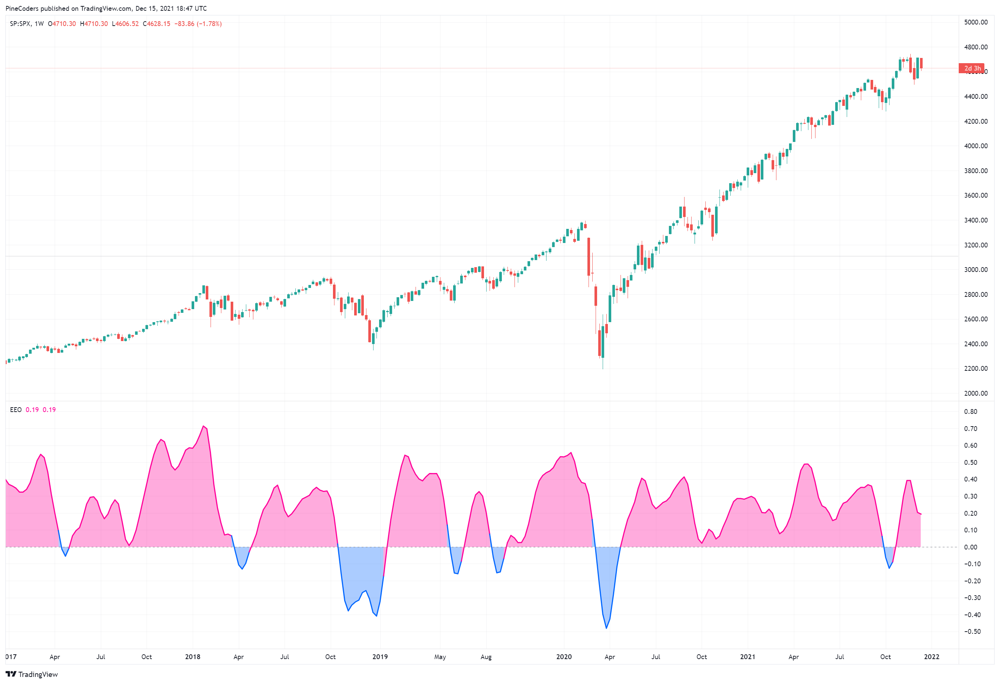

**Code file:** [ElegantOscillator.pine](code/ElegantOscillator.pine)

```pine
//  TASC Issue: February 2022 - Vol. 40, Issue 2
//     Article: Inverse Fisher Transform Redux -
//                   An Elegant Oscillator
//  Article By: John F. Ehlers
//    Language: TradingView's Pine Script v5
// Provided By: PineCoders, for tradingview.com

//@version=5
indicator("TASC 2022.02 Ehlers' Elegant Oscillator", "EEO")

sourceInput = input.source(close, "Source:")
bandEdgeInput = input.float(20.0, "Post Smooth:", minval = 2)
lengthRMSInput = input.int(50, "Length RMS:", minval = 2)

eeo(float src, float band_edge, int lengthRMS = 50) =>
    var float ANG_FREQ = math.pi * math.sqrt(2) / band_edge
    float deriv  = src - nz(src[2], nz(src[1], src))
    float rms    = math.sum(math.pow(deriv, 2), lengthRMS)
    rms         := math.sqrt(nz(rms / lengthRMS))
    float ift    = math.exp(2.0 * deriv / rms)
    ift         := (ift - 1.0) / (ift + 1.0)
    float alpha  =  math.exp(-ANG_FREQ)
    float coef2  = -math.pow(alpha, 2)
    float coef1  =  math.cos(ANG_FREQ) * 2.0 * alpha
    float coef0  = 1.0 - coef1 - coef2
    float sma2   = 0.5 * (ift + nz(ift[1], ift))
    float result = na
    result := nz(coef0 *     sma2      +
                 coef1 * nz(result[1]) +
                 coef2 * nz(result[2]))

signal    = eeo(sourceInput, bandEdgeInput, lengthRMSInput)
plotColor = signal > 0.0 ? #FF0099   : #0066FF
areaColor = signal > 0.0 ? #FF009955 : #0066FF55

plot(signal, "Area", areaColor, 1, plot.style_area)
plot(signal,   "EO", plotColor, 2)
hline(  0.0, "Zero", color.gray)
```

—PineCoders, for TradingView, https://tradingview.com

---

## Wealth-Lab

The elegant oscillator (EO) is included with a recent build of Wealth-Lab 7. Because no thresholds for buy and sell decisions are given, the elegant oscillator's thresholds can be determined by applying long-term bands like 100-day Bollinger Bands with a 1.5 standard deviation multiplier.

Since Ehlers highlights the elegant oscillator's application to swing trading, let's prototype a swing trading system with it. The idea for entry is to buy on a dip when it reverses, sell into strength, get out early and not take big losses.

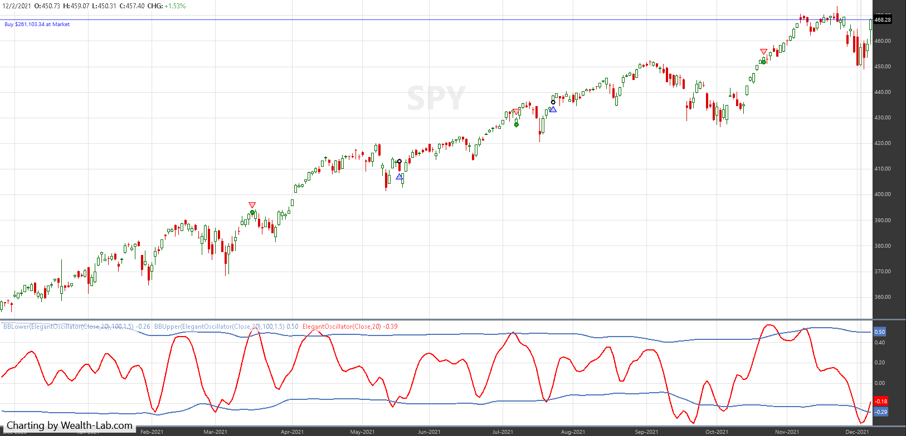

**Code file:** [ElegantOscillator.cs](code/ElegantOscillator.cs)

```csharp
using WealthLab.Backtest;
using System;
using WealthLab.Core;
using WealthLab.Indicators;
using WealthLab.TASC;
using System.Drawing;
using System.Collections.Generic;

namespace WealthScript1
{
	public class TASCFeb2022 : UserStrategyBase
	{
		public override void Initialize(BarHistory bars)
		{
			eo = ElegantOscillator.Series(bars.Close, 20);
			bbLower = BBLower.Series(eo, 100, 1.5);
			bbUpper = BBUpper.Series(eo, 100, 1.5);
			StartIndex = 100;

			PlotIndicatorLine(eo);
			PlotIndicatorLine(bbLower);
			PlotIndicatorLine(bbUpper);
		}

		public override void Execute(BarHistory bars, int idx)
		{
			if (!HasOpenPosition(bars, PositionType.Long))
			{
				if(eo.CrossesOver(bbLower, idx))
					PlaceTrade(bars, TransactionType.Buy, OrderType.Market);
			}
			else
			{
				if(eo.CrossesOver(bbUpper, idx))
					PlaceTrade(bars, TransactionType.Sell, OrderType.Market);
				else
					if(LastPosition.ProfitPctAsOf(idx) < -5)
					PlaceTrade(bars, TransactionType.Sell, OrderType.Market, default, "Stop");
			}
		}

		ElegantOscillator eo;
		BBLower bbLower;
		BBUpper bbUpper;
	}
}
```

—Gene Geren (Eugene), Wealth-Lab team, www.wealth-lab.com

---

## NinjaTrader

The EllegantOscillator and HardAndSoftLimiter indicators as presented in John Ehlers' article in this issue can be imported into NinjaTrader 8.

A sample chart displaying the indicator is shown in Figure 5.

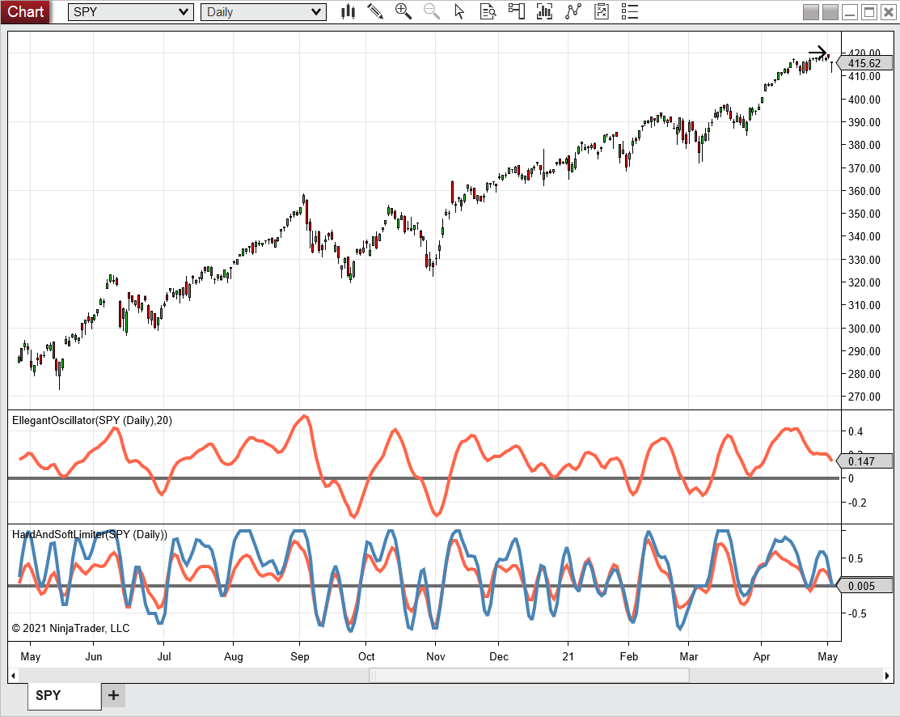

**Code files:** [EllegantOscillator.cs](ninja-trader/EllegantOscillator.cs) | [HardAndSoftLimiter.cs](ninja-trader/HardAndSoftLimiter.cs)

—Chris Lauber, NinjaTrader, LLC, www.ninjatrader.com

---

## Neuroshell Trader

John Ehlers' *elegant oscillator* indicator, introduced in his article in this issue, can be easily implemented in NeuroShell Trader by combining a few of NeuroShell Trader's 800+ indicators. After moving the code given in the article to your preferred compiler and creating a DLL, you can insert the resulting indicator.

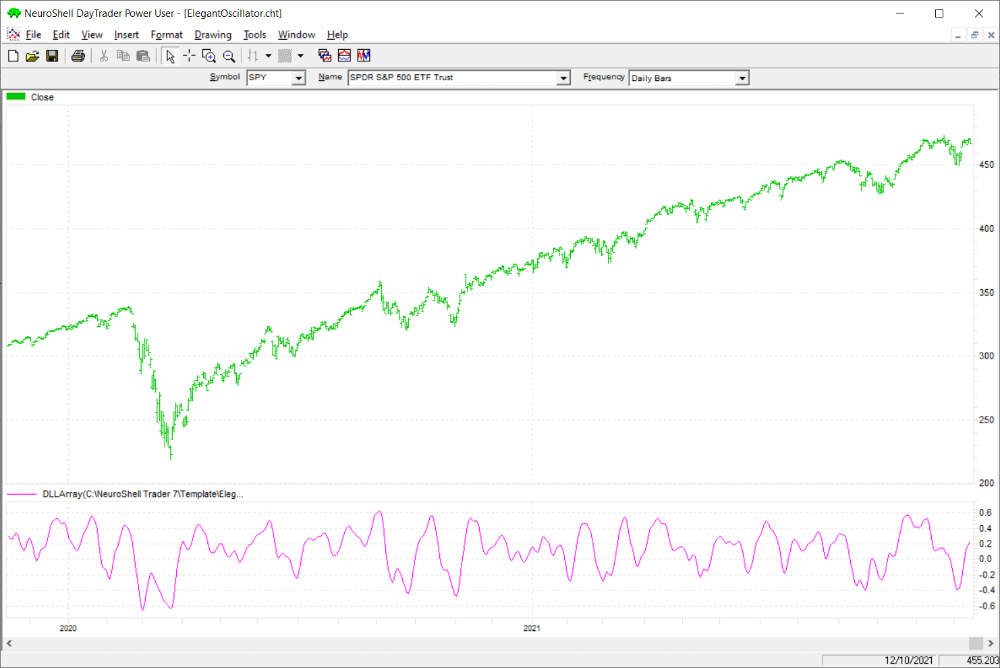

—Ward Systems Group, Inc., www.neuroshell.com

---

## The Zorro Project

The Fisher transform, which converts data to or from a Gaussian distribution, was first used in algorithmic trading in a 2002 TASC article by J.F. Ehlers. In his article in this issue, Ehlers describes a new indicator, the *elegant oscillator*.

The clipped data is this time smoothed with a finite response filter (FIR6). In Figure 7, an SPY chart is shown with the elegant oscillator (upper red line), the inverse Fisher transform (lower red line), and the hard limiter (lower blue line).

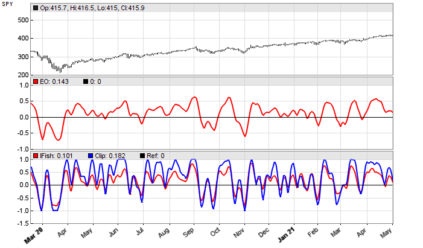

The supersmoothed elegant oscillator makes the best impression. According to Ehlers, its peaks and valleys that exceed a threshold can be used for mean-reversion trading.

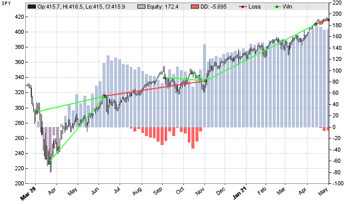

**Code file:** [ElegantOscillator.c](code/ElegantOscillator.c)

```c
var EO(vars Data,int Length)
{
  vars Derivs = series(priceClose(0)-priceClose(2));
  var RMS = sqrt(SumSq(Derivs,Length)/Length);
  var NDeriv = Derivs[0]/RMS;
  vars IFishs = series(FisherInv(&NDeriv));
  return Smooth(IFishs,20);
}


var HardClip(vars Data,int Length)
{
  vars Derivs = series(priceClose(0)-priceClose(2));
  var RMS = sqrt(SumSq(Derivs,Length)/Length);
  vars Clips = series(clamp(Derivs[0],-1,1));
  return FIR6(Clips);
}


void run()
{
  StartDate = 20200301;
  EndDate = 20210501;
  BarPeriod = 1440;

  assetAdd("SPY","STOOQ:*");
  asset("SPY");

  vars Signals = series(EO(seriesC(),50));
  var Threshold = 0.5;

  if(Signals[0] > Threshold && peak(Signals))
    enterShort();
  else if(Signals[0] < -Threshold && valley(Signals))
    enterLong();
}
```

—Petra Volkova, The Zorro Project by oP group Germany, https://zorro-project.com

---

## Microsoft Excel

In his article in this issue, John Ehlers demonstrates two oscillators. First is the *elegant oscillator*, which takes the first differences of the close, normalizes them to an RMS scale, applies the inverse Fisher transform, and smooths the result with a SuperSmoother filter. Then he compares these to an oscillator built by first clipping the price and smoothing this result with the same FIR filter.

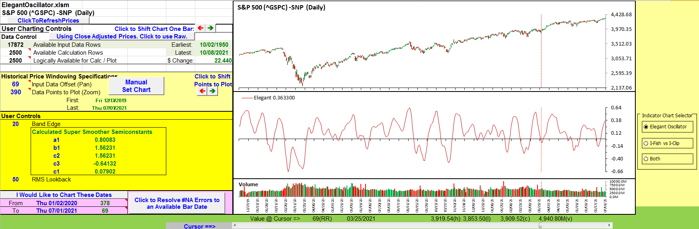

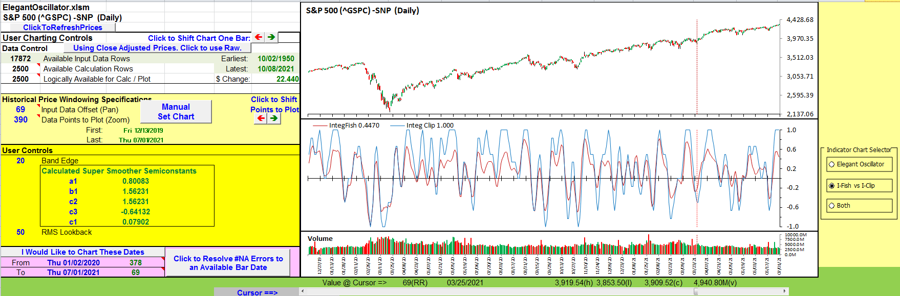

**Spreadsheet file:** [ElegantOscillator.xlsm](code/ElegantOscillator.xlsm)

—Ron McAllister, Excel and VBA programmer, rpmac_xltt@sprynet.com

---

## TradersStudio

The importable TradersStudio file for John Ehlers' article can be found at the Traders' Tips area of Traders.com.

Figure 11 shows the indicator on a chart of Cisco Systems (CSCO) during 2011.

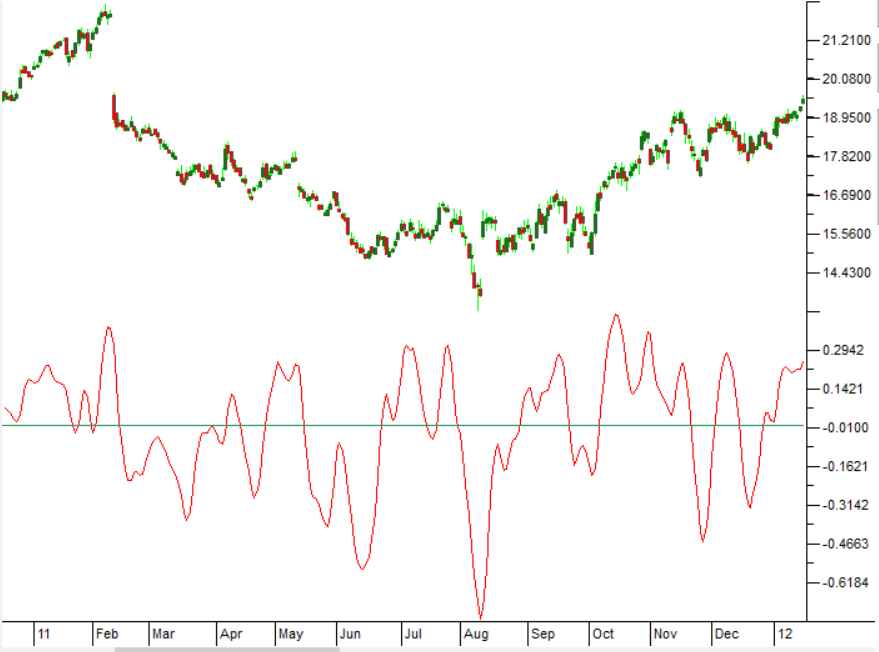

**Code file:** [ElegantOscillator.trs](code/ElegantOscillator.trs)

```basic
'The Elegant Oscillator
'Author: John F. Ehlers, TASC Feb 2022
'Coded by: Richard Denning, 12/20/2021

'Take the derivative of prices
Function EHLERS_ELEGANT_OSC(BandEdge)

    Dim Deriv As BarArray
    Dim RMS As BarArray
    Dim count
    Dim NDeriv As BarArray
    Dim IFish As BarArray
    Dim a1 As BarArray
    Dim b1 As BarArray
    Dim c1 As BarArray
    Dim c2 As BarArray
    Dim c3 As BarArray
    Dim SS As BarArray

    If BarNumber=FirstBar Then
        Deriv = 0
        RMS = 0
        count = 0
        NDeriv = 0
        IFish = 0
        a1 = 0
        b1 = 0
        c1 = 0
        c2 = 0
        c3 = 0
        SS = 0
    End If

    Deriv = Close - Close[2]
'Normalize to standard deviation
    RMS = 0
    For count = 0 To 49
        RMS = RMS + Deriv[count]*Deriv[count]
    Next
    If RMS <> 0 Then
        RMS = Sqr(RMS / 50)
    End If
    NDeriv = Deriv / RMS
'Compute the Inverse Fisher Transform
    IFish = (TStation_ExpValue(2*NDeriv) - 1) / (TStation_ExpValue(2*NDeriv) + 1)
'Integrate with SuperSmoother
    a1 = TStation_ExpValue(-1.414*3.14159 / BandEdge)
    b1 = 2*a1*TStation_Cosine(1.414*180 / BandEdge)
    c2 = b1
    c3 = -a1*a1
    c1 = 1 - c2 - c3
    SS = c1*(IFish + IFish[1]) / 2 + c2*SS[1] + c3*SS[2]
EHLERS_ELEGANT_OSC = SS
End Function
'-------------------------------------------------------------
'INDICATOR PLOT
Sub EHLERS_ELEGANT_OSC_IND(BandEdge)
Dim SS As BarArray
SS = EHLERS_ELEGANT_OSC(BandEdge)
plot1(SS)
plot2(0)
End Sub
```

—Richard Denning, info@TradersEdgeSystems.com, for TradersStudio

---

## Additional Code Files

- [ElegantOscillator.efs](code/ElegantOscillator.efs) — eSignal EFS implementation

---

*Originally published in the February 2022 issue of Technical Analysis of Stocks & Commodities magazine. All rights reserved.*

---

## BibTeX

```bibtex
@misc{tasc2022traderstips02,
  author       = {{Technical Analysis of Stocks \& Commodities}},
  title        = {Traders' Tips, February 2022},
  year         = {2022},
  month        = feb,
  url          = {https://www.traders.com/Documentation/FEEDbk_docs/2022/02/TradersTips.html},
  note         = {Traders' Tips implementations for ``Inverse Fisher Transform Redux: An Elegant Oscillator'' by John F. Ehlers}
}
```
