# Traders' Tips: Ehlers Loops, Part 1

June 2022

For this month's Traders' Tips, the focus is John F. Ehlers' article in this issue, "Ehlers Loops, Part 1." Here, we present the June 2022 Traders' Tips code with possible implementations in various software.

## TradeStation

*Chris Imhof, TradeStation Securities, Inc. — [www.TradeStation.com](https://www.TradeStation.com)*

In his article in this issue, "Ehlers Loops," John Ehlers presents some concepts of price and volume relationship to determine if any predictive value can be obtained by the analysis. In the analysis, both price and volume are filtered using high-pass and low-pass filters with the result delivering the desired data wavelengths. The author suggests that the resulting Ehlers Loops are a way to discretionarily predict bullish and bearish moves that are based on the curvature and direction of rotation of motion in the price-volume chart.

The EasyLanguage given here creates an indicator that can be applied to a TradeStation chart to observe the plots versus price. Note that the code assumes that the export directory "C:\Temp" exists and that the indicator is applied to bar intervals of daily and above.

```easylanguage
{{#include code/tradestation-ehlers-loops.els}}
```

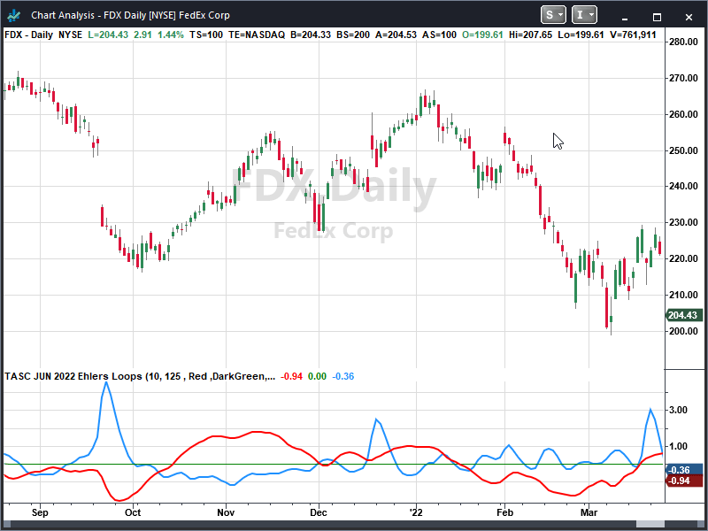

**Figure 1: TradeStation.** Demonstrated here is an indicator that can be applied to a TradeStation chart to observe the plots versus price.

*This article is for informational purposes. No type of trading or investment recommendation, advice, or strategy is being made, given, or in any manner provided by TradeStation Securities or its affiliates.*

## TradingView

*PineCoders, for TradingView — [www.TradingView.com](https://www.TradingView.com)*

Here is the Pine Script code for TradingView that implements the Ehlers Loops introduced by John Ehlers in his article in this issue.

```pine
{{#include code/tradingview-ehlers-loops.pine}}
```

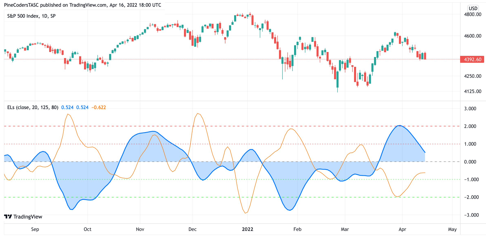

**Figure 2: TradingView.** Here are Ehlers Loops implemented on a chart by TradingView.

## Wealth-Lab.com

*Gene Geren (Eugene), Wealth-Lab team — [www.wealth-lab.com](https://www.wealth-lab.com)*

In his article in this issue, John Ehlers brings in his expertise in digital signal processing to introduce an unusual way of analyzing the price/volume relationships. For discretionary traders, his Ehlers Loops open up a new method to see ahead potential bullish and bearish moves based on the curvature and direction of rotation of motion as a function of time in the price-volume chart.

Wealth-Lab 8 makes it easy to display the various custom plots like line or bar charts, pie graphs, and scatter plots with a few lines of code. The code below accomplishes this with an open-source plotting library for .NET called ScottPlot.

```csharp
{{#include code/wealthlab-ehlers-loops.cs}}
```

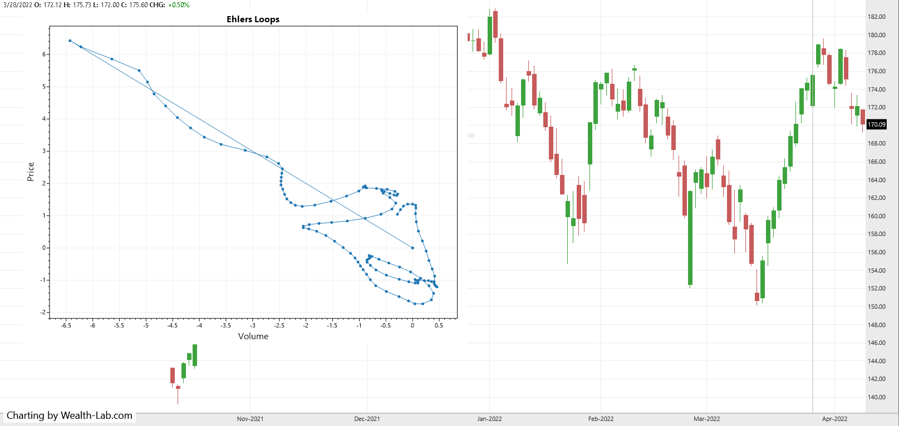

**Figure 3: Wealth-Lab.** Here, Ehlers Loops are superimposed on a chart of Apple (AAPL) in Wealth-Lab 8.

## NinjaTrader

*Kate Windheuser, NinjaTrader, LLC — [www.ninjatrader.com](https://www.ninjatrader.com)*

The Ehlers Loops indicator, which is introduced in the article in this issue by John Ehlers titled "Ehlers Loops," is available for download at the following links for NinjaTrader 8 and for NinjaTrader 7:

- **NinjaTrader 8:** [www.ninjatrader.com/SC/June2022SCNT8.zip](https://www.ninjatrader.com/SC/June2022SCNT8.zip)
- **NinjaTrader 7:** [www.ninjatrader.com/SC/June2022SCNT7.zip](https://www.ninjatrader.com/SC/June2022SCNT7.zip)

Once the file is downloaded, you can import the indicator into NinjaTrader 8 from within the control center by selecting Tools → Import → NinjaScript Add-On and then selecting the downloaded file for NinjaTrader 8. To import into NinjaTrader 7, from within the control center window, select the menu File → Utilities → Import NinjaScript and select the downloaded file.

You can review the indicator's source code in NinjaTrader 8 by selecting the menu New → NinjaScript Editor → Indicators from within the control center window and selecting the "Ehlers Loops" file. You can review the indicator's source code in NinjaTrader 7 by selecting the menu Tools → Edit NinjaScript → Indicator from within the control center window and selecting the "Ehlers Loops" file.

NinjaScript uses compiled DLLs that run native, not interpreted, which provides you with the highest performance possible.

See also: [ninja-trader/EhlersLoops.cs](ninja-trader/EhlersLoops.cs)

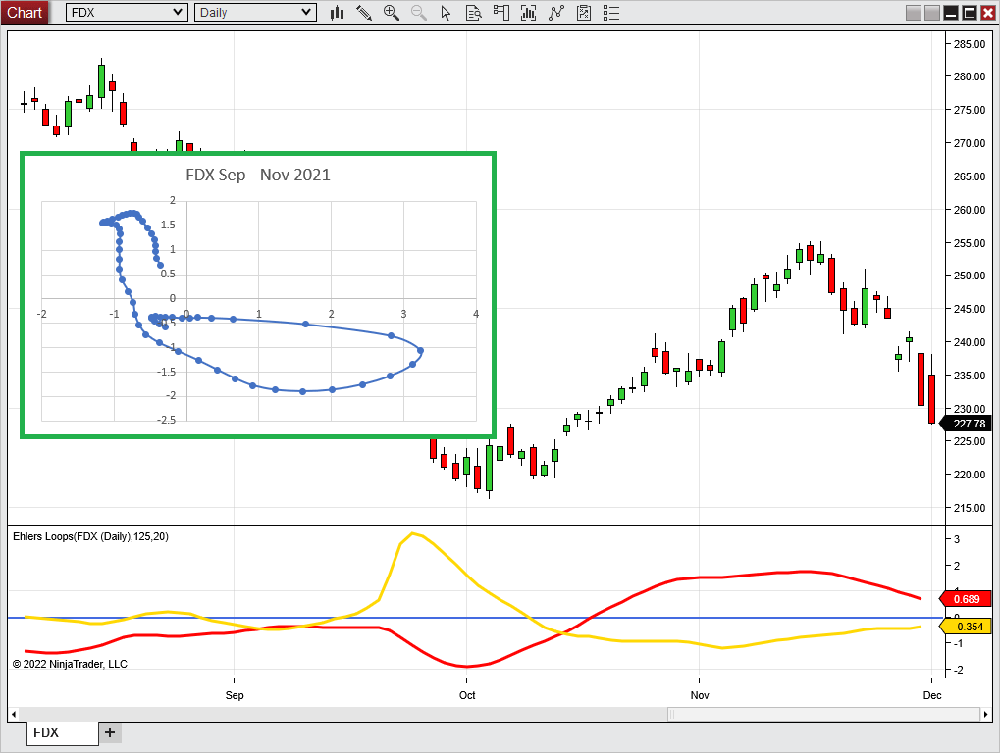

**Figure 4: NinjaTrader.** This shows an example of an Ehlers Loop of FedEx (FDX) for three months in 2021. The loop plot starts on September 1.

## Neuroshell Trader

*Ward Systems Group, Inc. — [www.neuroshell.com](https://www.neuroshell.com)*

Ehlers Loops, which are introduced by John Ehlers in his article in this issue, can be easily computed in NeuroShell Trader using NeuroShell Trader's ability to call external dynamic linked libraries. Dynamic linked libraries can be written in C, C++, or Power Basic.

After moving the code given in the article to your preferred compiler and creating a DLL, you can insert the resulting indicator as follows:

1. Select "new indicator" from the *insert* menu.
2. Choose the *External Program & Library Calls* category.
3. Select the appropriate *External DLL Call indicator*.
4. Set up the parameters to match your DLL.
5. Select the *finished* button.

Once the values for price and volume are on the chart, simply use NeuroShell Trader's export feature to export the values to an Excel spreadsheet as described in the article.

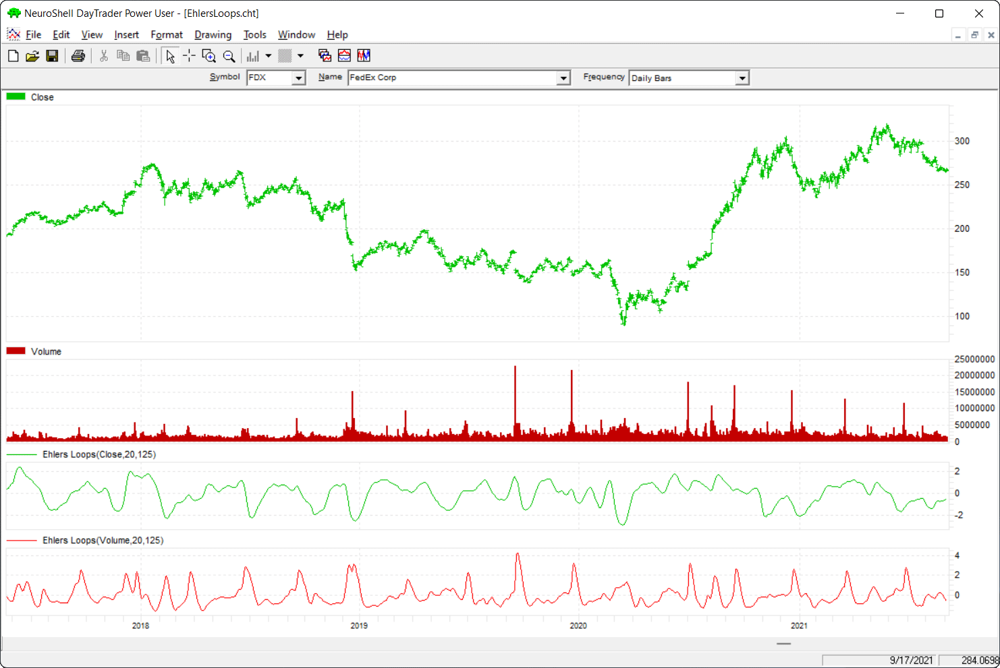

**Figure 5: Neuroshell Trader.** This NeuroShell Trader chart shows the calculated Ehlers Loops values for FedEx.

## The Zorro Project

*Petra Volkova, The Zorro Project by oP group Germany — [https://zorro-project.com](https://zorro-project.com)*

Price charts normally display price over time, or maybe, in some cases with special bars, price over momentum. In his article in this issue, John Ehlers proposes to display price over volume in a scatter plot. The result is a special curve, which the author calls an "Ehlers Loop," that is considered by the author to have predictive value. For this purpose, Ehlers filters the low and high frequencies out of the volume and price data with a roofing filter.

Here is the C code converted from the EasyLanguage given in the article:

```c
{{#include code/zorro-ehlers-loops.c}}
```

The plotGraph function is used to display each coordinate with a blue dot and connect the dots with spline lines. The last day is marked with a red square.

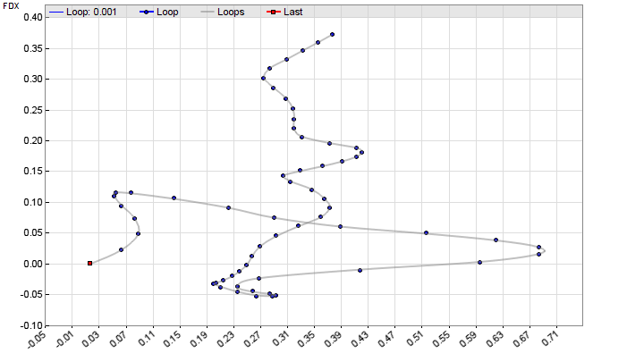

**Figure 6: Zorro Project.** Shown here is an Ehlers Loop plotted on FedEx (FDX) on April 13, 2022. To draw the Ehlers Loops in Zorro, the plotGraph function is used to display each coordinate with a blue dot and connect the dots with spline lines. The last day is marked with a red square.

Ehlers intended his loops for discretionary trading, but it could also be automated. For instance, the last N coordinates could be used as inputs for Zorro's neural net, which can then be trained to predict tomorrow's price. Or even simpler, the slope at the last point — the red square — could trigger a buy order when positive or a sell order when negative.

The scripts for the roofing indicator and the Ehlers Loop can be downloaded from the 2022 script repository on [https://financial-hacker.com](https://financial-hacker.com). The Zorro software can be downloaded from [https://zorro-project.com](https://zorro-project.com).

## Microsoft Excel

*Ron McAllister, Excel and VBA programmer*

In his article in this issue, John Ehlers introduces a technique of plotting price and volume that he calls "Ehlers Loops." The computations to generate Ehlers Loops are straightforward. Figure 7 replicates in Excel the chart from his article giving an example of an Ehlers Loop on FedEx (FDX).

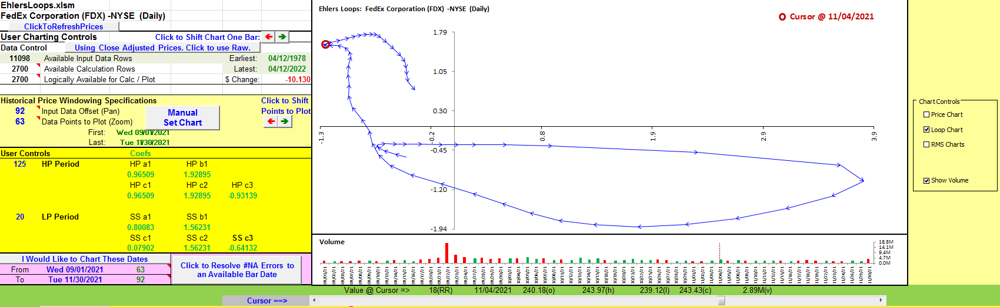

**Figure 7: Excel.** This chart replicates in Excel the chart of Ehlers Loops from John Ehlers' article in this issue.

Getting Excel 2010 to put date data labels on the points of the loop chart is a significant problem that newer versions of Excel can handle easily. So a different approach is necessary for this spreadsheet.

To assist visualizing clockwise or counter-clockwise flows, the loop data points are connected with arrows to indicate the forward-in-time point-to-point progression along the loop. A red circle cursor indicates the loop point that corresponds with the price and volume bars under their respective chart cursors. All chart cursors are controlled by the slider below the volume chart.

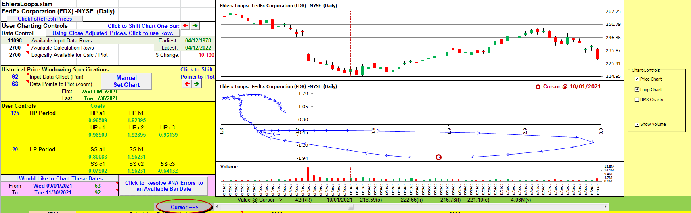

**Figure 8: Excel.** You can see the coordination of the price and the volume chart cursors with the red circle indicating the corresponding point along the loop.

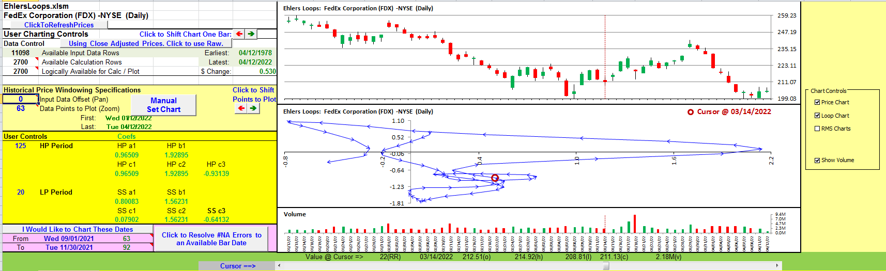

**Figure 9: Excel.** Here, the data window was shifted 92 bars forward in time by changing cell A11 to zero in order to reduce clutter.

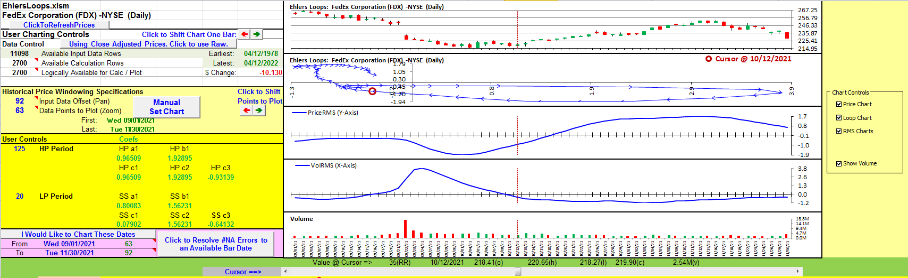

**Figure 10: Excel.** This example includes plots of the raw volume RMS (root mean square) and price RMS values that are used as the X and Y coordinates to generate the loops chart.

**To download this spreadsheet:** The spreadsheet file for this Traders' Tip can be downloaded from the TASC website. See: [code/EhlersLoops.xlsm](code/EhlersLoops.xlsm)

## TradersStudio

*Richard Denning — [info@TradersEdgeSystems.com](mailto:info@TradersEdgeSystems.com)*

The importable TradersStudio file based on John Ehlers' article, "Ehlers Loops" can be obtained on request via email to info@TradersEdgeSystems.com. The code is also shown below.

Code for the author's indicators is provided in the following files:

- **Function EHLERS_LOOPS:** computes Elegant Oscillator indicator
- **Indicator plot EHLERS_LOOPS_IND:** plots the Elegant Oscillator indicator on a chart

```basic
{{#include code/tradersstudio-ehlers-loops.txt}}
```

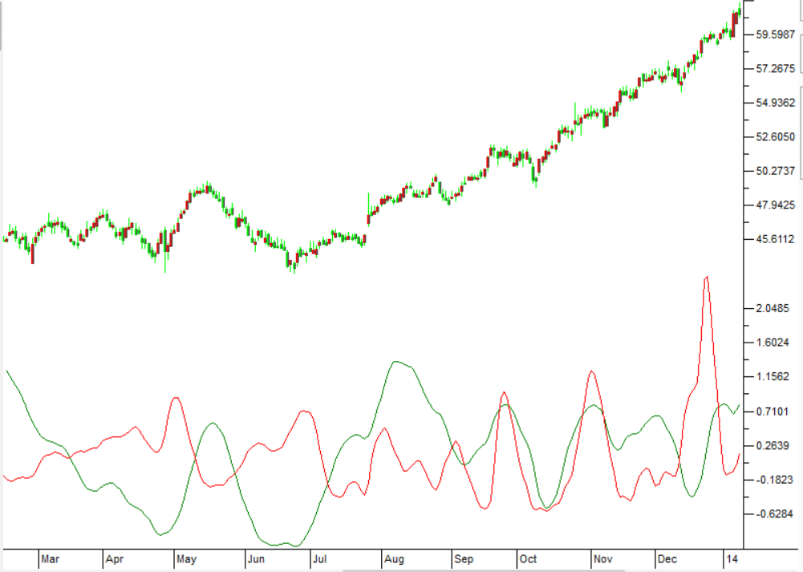

**Figure 11: TradersStudio.** This shows an example of the Ehlers Loops indicator on a conventional chart of Verisign (VRSN) during 2013.

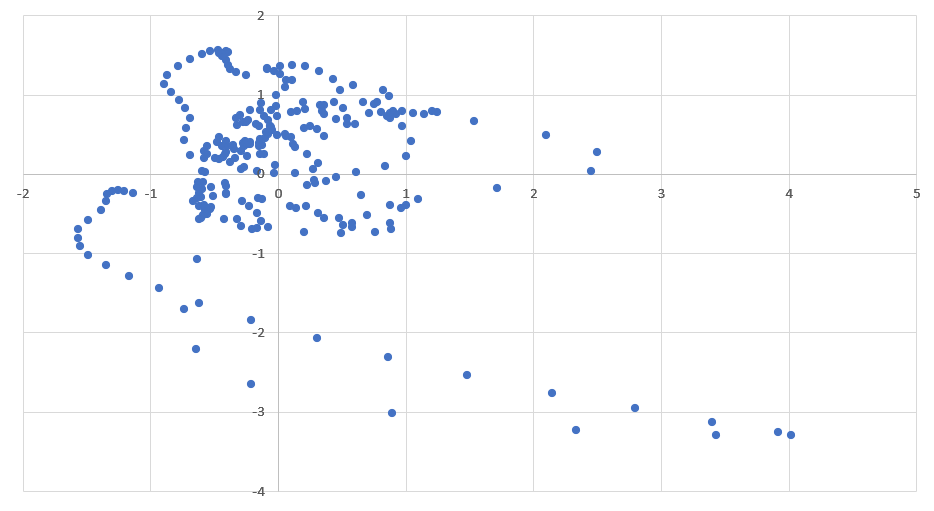

**Figure 12: TradersStudio.** This shows the Ehlers Loops indicator on a scatter plot of Verisign (VRSN) during part of 2013 and 2014.

---

## Code Files

| Platform | File |
|----------|------|
| TradeStation | [code/tradestation-ehlers-loops.els](code/tradestation-ehlers-loops.els) |
| TradingView | [code/tradingview-ehlers-loops.pine](code/tradingview-ehlers-loops.pine) |
| Wealth-Lab | [code/wealthlab-ehlers-loops.cs](code/wealthlab-ehlers-loops.cs) |
| Zorro | [code/zorro-ehlers-loops.c](code/zorro-ehlers-loops.c) |
| TradersStudio | [code/tradersstudio-ehlers-loops.txt](code/tradersstudio-ehlers-loops.txt) |
| NinjaTrader | [ninja-trader/EhlersLoops.cs](ninja-trader/EhlersLoops.cs) |
| Excel | [code/EhlersLoops.xlsm](code/EhlersLoops.xlsm) |

## References

- [Traders' Tips: June 2022](https://www.traders.com/Documentation/FEEDbk_docs/2022/06/TradersTips.html)

```bibtex
@misc{traders_tips_2022_06,
  author       = {{Technical Analysis of STOCKS \& COMMODITIES}},
  title        = {Traders' Tips: Ehlers Loops, Part 1},
  year         = {2022},
  month        = jun,
  howpublished = {online},
  url          = {https://www.traders.com/Documentation/FEEDbk_docs/2022/06/TradersTips.html}
}
```

---

*Originally published in the June 2022 issue of Technical Analysis of STOCKS & COMMODITIES magazine. All rights reserved. Copyright 2022, Technical Analysis, Inc.*
