# Traders' Tips: Pairs Rotation With Ehlers Loops, Part 2

**July 2022**

For this month's Traders' Tips, the focus is John Ehlers' article in this issue, "Pairs Rotation With Ehlers Loops, Part 2." Here, we present the July 2022 Traders' Tips code with possible implementations in various software.

The Traders' Tips section is provided to help the reader implement a selected technique from an article in this issue or another recent issue. The entries here are contributed by software developers or programmers for software that is capable of customization.

---

## TradeStation

**Contributor:** Chris Imhof, TradeStation Securities, Inc.  
**Website:** [www.TradeStation.com](https://www.tradestation.com/)

In part 1 of his article in the June 2022 issue ("Ehlers Loops"), John Ehlers uses a relationship of price and volume to determine if any predictive value can be obtained. His technique, called Ehlers Loops, aid in visualizing the performance of one datastream against another. In part 2 appearing in this issue ("Pairs Rotation With Ehlers Loops"), the author demonstrates Ehlers Loops in action with a pairs trading example. This pairs rotation strategy is aimed at minimizing drawdown while simultaneously maximizing return on capital.

Note that the code assumes that the export directory "C:\Temp" exists and that the indicator is applied to "daily and above" bar timeframes. To plot Ehlers Loops in Excel, after opening the file, highlight the second and third columns (B and C) for the desired date range and click on *insert* and choose "scatter plot with smooth lines and indicators."

```easylanguage
// TASC JUL 2022
// Ehlers Loops Pairs Rotation Chart
// (C) 2005-2022 John F. Ehlers

inputs:
	LPPeriod( 20 ),
	HPPeriod( 125 );

variables:
	HP1( 0 ), 
	HP2( 0 ),
	hpa1( 0 ),
	hpb1( 0 ),
	hpc1( 0 ),
	hpc2( 0 ),
	hpc3( 0 ),
	ssa1( 0 ),
	ssb1( 0 ),
	ssc1( 0 ),
	ssc2( 0 ),
	ssc3( 0 ),
	Price1( 0 ), 
	Price1MS( 0 ), 
	Price1RMS( 0 ),
	Price2( 0 ), 
	Price2MS( 0 ), 
	Price2RMS( 0 );

if CurrentBar = 1 then 
begin
	hpa1 = expvalue(-1.414*3.14159 / HPPeriod);
	hpb1 = 2*hpa1*Cosine(1.414*180 / HPPeriod);
	hpc2 = hpb1;
	hpc3 = -hpa1*hpa1;
	hpc1 = (1 + hpc2 - hpc3) / 4;
	ssa1 = expvalue(-1.414*3.14159 / LPPeriod);
	ssb1 = 2*ssa1*Cosine(1.414*180 / LPPeriod);
	ssc2 = ssb1;
	ssc3 = -ssa1*ssa1;
	ssc1 = 1 - ssc2 - ssc3;
End;

// Normalized Roofing Filter for Data1 
// (horizontal plot)
// 2 Pole Butterworth Highpass Filter
HP1 = hpc1*(Close of Data1 - 2*Close[1] of Data1 + Close[2] of 
Data1) + hpc2*HP1[1] + hpc3*HP1[2];

if CurrentBar < 3 then 
	HP1 = 0;

// Smooth with a Super Smoother Filter 
Price1 = ssc1*(HP1 + HP1[1]) / 2 + ssc2*Price1[1] 
 + ssc3*Price1[2];

if CurrentBar < 3 then Price1 = 0;
// Scale Price in terms of Standard Deviations

if CurrentBar = 1 then 
	Price1MS = Price1 * Price1 
else 
	Price1MS = .0242*Price1*Price1 
	 + .9758*Price1MS[1];

if Price1MS <> 0 then 
	Price1RMS = Price1 / SquareRoot(Price1MS);
	
// Normalized Roofing Filter for Data2
// (horizontal plot)
// 2 Pole Butterworth Highpass Filter
HP2 = hpc1*(Close of Data2 - 2*Close[1] of Data2
 + Close[2] of Data2) + hpc2*HP2[1] + hpc3*HP2[2];

if CurrentBar < 3 then 
 HP2 = 0;

// Smooth with a Super Smoother Filter 
Price2 = ssc1*(HP2 + HP2[1]) / 2 + ssc2*Price2[1] +
ssc3*Price2[2];

if CurrentBar < 3 then 
 Price2 = 0;

// Scale Price in terms of Standard Deviations
if CurrentBar = 1 then 
	Price2MS = Price2*Price2 
else 
	Price2MS = .0242*Price2*Price2 + .9758*Price2MS[1];

if Price2MS <> 0 then 
	Price2RMS = Price2 / SquareRoot(Price2MS);

// Conventional Plots
Plot1( Price1RMS, "Price1 RMS" );
Plot2( 0, "Zero Line" );
Plot3( Price2RMS, "Price2 RMS" );
```

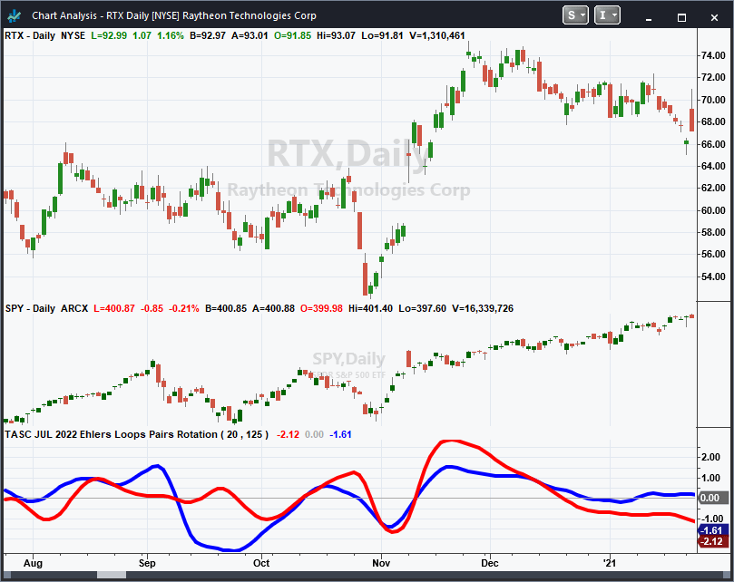

*This article is for informational purposes. No type of trading or investment recommendation, advice, or strategy is being made, given, or in any manner provided by TradeStation Securities or its affiliates.*

---

## Wealth-Lab.com

**Contributor:** Gene Geren (Eugene), Wealth-Lab team  
**Website:** [www.wealth-lab.com](https://www.wealth-lab.com/)

Wealth-Lab 8 makes it easy to display various custom plots such as line or bar charts, pie graphs, and scatter plots with just a few lines of code. The code below accomplishes this with an open-source plotting library for .NET called ScottPlot.

With a little tweak, the same C# code that we presented last month in the June 2022 Traders' Tips section based on part 1 of John Ehlers' article, "Ehlers Loops," can be used to create Ehlers Loops applied to pairs, which is the technique he demonstrates in part 2 of his article in this issue, "Pairs Rotation With Ehlers Loops."

```csharp
using WealthLab.Backtest;
using System;
using WealthLab.Core;
using WealthLab.Indicators;
using System.Drawing;
using System.Collections.Generic;
using ScottPlot;

namespace WealthScript1 
{
	public class TASC202207PairsRotationWithEhlersLoops : UserStrategyBase
	{
		public override void Initialize(BarHistory bars)
		{
			spy = GetHistory(bars, "SPY");
			PlotBarHistory(spy, "SPYPane", WLColor.Silver);

			int LPPeriod = 20, HPPeriod = 125;
			double Deg2Rad = Math.PI / 180.0;
			List<double> lstDates = new List<double>();
			List<double> lstValuesP = new List<double>();
			List<double> lstValuesP2 = new List<double>();

			hpa1 = Math.Exp(-1.414 * Math.PI / HPPeriod);
			hpb1 = 2.0 * hpa1 * Math.Cos((1.414 * 180d / HPPeriod) * Deg2Rad);
			hpc2 = hpb1;
			hpc3 = -hpa1 * hpa1;
			hpc1 = (1 + hpc2 - hpc3) / 4;
			ssa1 = Math.Exp(-1.414 * Math.PI / LPPeriod);
			ssb1 = 2.0 * ssa1 * Math.Cos((1.414 * 180d / LPPeriod) * Deg2Rad);
			ssc2 = ssb1;
			ssc3 = -ssa1 * ssa1;
			ssc1 = 1 - ssc2 - ssc3;

			TimeSeries HP1 = new TimeSeries(bars.DateTimes, 0);
			TimeSeries HP2 = new TimeSeries(spy.DateTimes, 0);
			for (int i = 2; i < bars.DateTimes.Count; i++)
			{
				HP1[i] = hpc1 * (bars.Close[i] - 2 * bars.Close[i - 1] + bars.Close[i - 2]) + hpc2 * HP1[i - 1] + hpc3 * HP1[i - 2];
				HP2[i] = hpc1 * (spy.Close[i] - 2 * spy.Close[i - 1] + spy.Close[i - 2]) + hpc2 * HP2[i - 1] + hpc3 * HP2[i - 2];
			}

			TimeSeries Price = new TimeSeries(bars.DateTimes, 0);
			TimeSeries Price2 = new TimeSeries(spy.DateTimes, 0);
			for (int i = 2; i < bars.DateTimes.Count; i++)
			{
				Price[i] = ssc1 *(HP1[i] + HP1[i - 1]) / 2 + ssc2 *Price[i - 1] + ssc3 *Price[i - 2];
				Price2[i] = ssc1 *(HP2[i] + HP2[i - 1]) / 2 + ssc2 *Price2[i - 1] + ssc3 *Price2[i - 2];
			}

			TimeSeries PriceMS = new TimeSeries(bars.DateTimes, 0);
			TimeSeries PriceRMS = new TimeSeries(bars.DateTimes, 0);
			TimeSeries Price2MS = new TimeSeries(spy.DateTimes, 0);
			TimeSeries Price2RMS = new TimeSeries(spy.DateTimes, 0);
			for (int i = 0; i < bars.DateTimes.Count; i++)
			{
				if (i < 2)
				{
					PriceMS[i] = Math.Pow(Price[i], 2);
					Price2MS[i] = Math.Pow(Price2[i], 2);
				}
				else
				{
					PriceMS[i] = 0.0242 * Price[i] * Price[i] + 0.9758 * PriceMS[i - 1];
					Price2MS[i] = 0.0242 * Price2[i] * Price2[i] + 0.9758 * Price2MS[i - 1];
				}
			
				if(PriceMS[i] != 0)
					PriceRMS[i] = Price[i] / Math.Sqrt(PriceMS[i]);
				if (Price2MS[i] != 0)
					Price2RMS[i] = Price2[i] / Math.Sqrt(Price2MS[i]);
			
				lstValuesP.Add(PriceRMS[i]);
				lstValuesP2.Add(Price2RMS[i]);
			}

			Bitmap bmp = null;
			Plot plt = new ScottPlot.Plot(800, 600);
			plt.Style(figureBackground: Color.FromArgb(51,53,54), dataBackground: Color.FromArgb(51,53,54), titleLabel: Color.White, grid: Color.White, axisLabel: Color.FromArgb(51,53,54));
		
			plt.Title("Ehlers Loops");
			plt.YLabel(bars.Symbol);
			plt.XLabel(spy.Symbol);

			plt.PlotScatter(lstValuesP2.ToArray(), lstValuesP.ToArray(), Color.Gold);
			bmp = plt.GetBitmap();
			DrawImageAt(bmp, 40, 20);
		}

		public override void Execute(BarHistory bars, int idx)
		{
		}

		double hpa1, hpb1, hpc2, hpc3, hpc1, ssa1, ssb1, ssc2, ssc3, ssc1;
		BarHistory spy;
	}
}
```

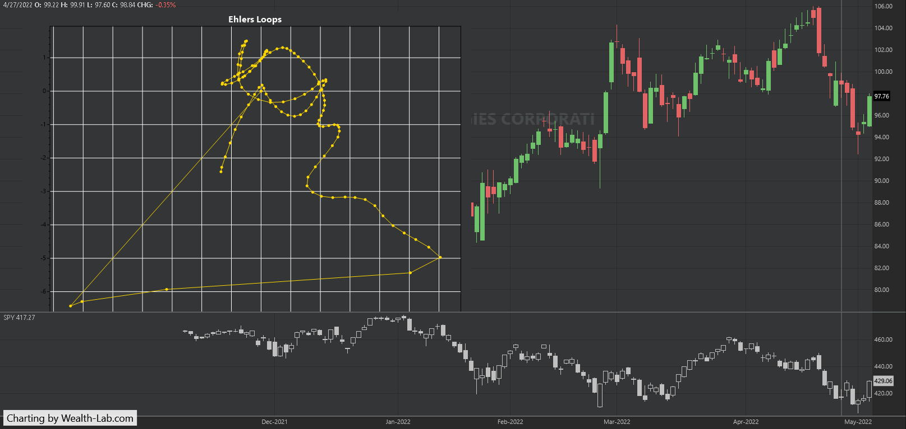

---

## NinjaTrader

**Contributor:** Kate Windheuser, NinjaTrader, LLC  
**Website:** [www.ninjatrader.com](https://www.ninjatrader.com/)

The Ehlers Loops pairs rotation indicator, as discussed in John Ehlers' article in this issue, "Pairs Rotation With Ehlers Loops," is available for download from the following links for NinjaTrader 8 and for NinjaTrader 7:

- **NinjaTrader 8:** [ninjatrader.com/SC/July2022SCNT8.zip](https://ninjatrader.com/SC/July2022SCNT8.zip)
- **NinjaTrader 7:** [ninjatrader.com/SC/July2022SCNT7.zip](https://ninjatrader.com/SC/July2022SCNT7.zip)

Once the file is downloaded, you can import the indicator into NinjaTrader 8 from within the control center by selecting Tools → Import → NinjaScript Add-On and then selecting the downloaded file for NinjaTrader 8. To import into NinjaTrader 7, from within the control center window, select the menu File → Utilities → Import NinjaScript and select the downloaded file.

You can review the indicator's source code in NinjaTrader 8 by selecting the menu New → NinjaScript Editor → Indicators from within the control center window and selecting the "Ehlers Loops Pairs Rotation" file. You can review the indicator's source code in NinjaTrader 7 by selecting the menu Tools → Edit NinjaScript → Indicator from within the control center window and selecting the "Ehlers Loops Pairs Rotation" file.

NinjaScript uses compiled DLLs that run native, not interpreted, which provides you with the highest performance possible.

Source code: [ninja-trader/EhlersLoopsPairsRotation.cs](ninja-trader/EhlersLoopsPairsRotation.cs)

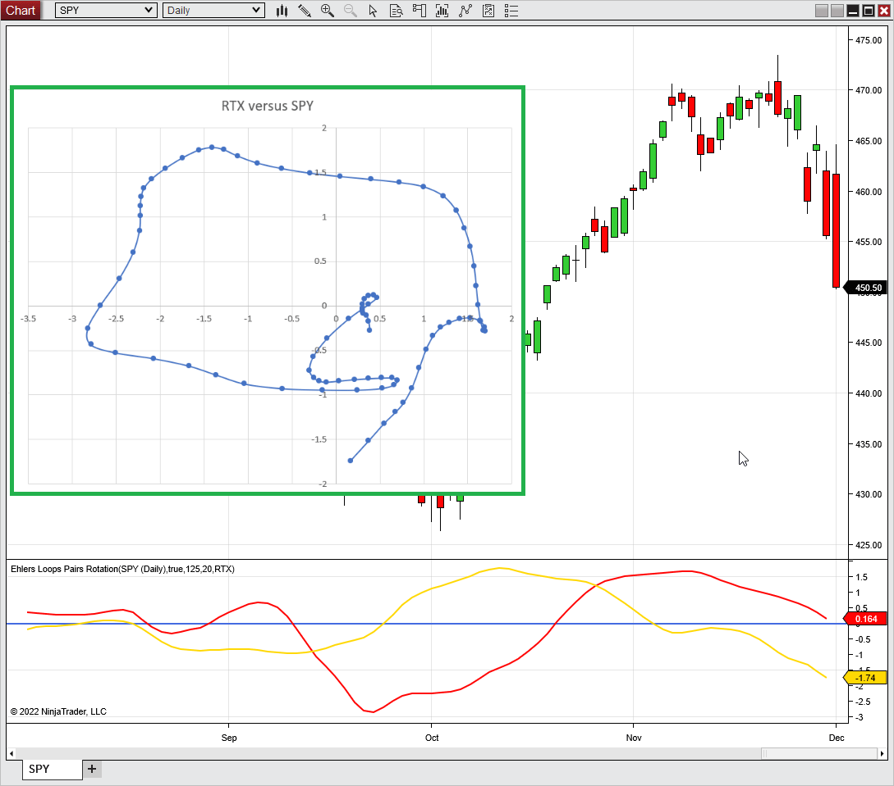

---

## Neuroshell Trader

**Contributor:** Ward Systems Group, Inc.  
**Email:** [sales@wardsystems.com](mailto:sales@wardsystems.com)  
**Website:** [www.neuroshell.com](https://www.neuroshell.com/)

The John Ehlers' Ehlers Loops pairs rotation values can be easily computed in NeuroShell Trader using NeuroShell Trader's ability to call external dynamic linked libraries. Dynamic linked libraries can be written in C, C++, or Power Basic.

After moving the code given in John Ehlers' article in this issue ("Pairs Rotation With Ehlers Loops") to your preferred compiler and creating a DLL, you can insert the resulting indicator as follows:

1. Select "New Indicator" from the *insert* menu.
2. Choose the **External Program & Library Calls** category.
3. Select the appropriate **External DLL Call** indicator.
4. Setup the parameters to match your DLL.
5. Select the *finished* button.

To calculate the pair rotation loops, load a chart for the first security, insert the second security's price onto the chart using "insert other instrument data," then apply the Ehlers Loop to the price of each pair. Then simply use the NeuroShell Trader export feature to export the loop values to an Excel spreadsheet as described in Ehlers' article.

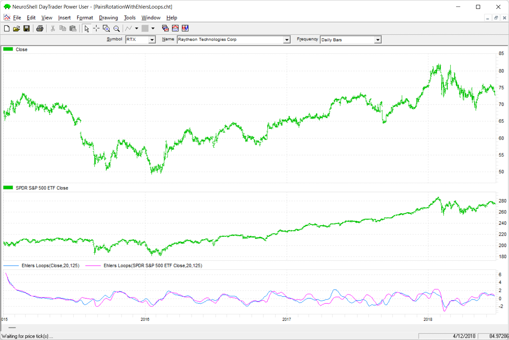

Users of NeuroShell Trader can go to the Stocks & Commodities section of the NeuroShell Trader free technical support website to download a copy of this or any previous Traders' Tips.

---

## TradersStudio

**Contributor:** Richard Denning  
**Email:** [info@TradersEdgeSystems.com](mailto:info@TradersEdgeSystems.com)

The importable TradersStudio files based on John Ehlers' article in this issue, "Pairs Rotation With Ehlers Loops," can be obtained on request via email to [info@TradersEdgeSystems.com](mailto:info@TradersEdgeSystems.com). The code is also shown below.

- **Function EHLERS_LOOPS2:** Computes normalized price data for two pairs of securities
- **Indicator plot EHLERS_LOOPS2_SYS:** A system code file for a session that exports data to the terminal. Once the session is run, the data can be copied from the terminal window to Excel and then plotted on a scatter plot.

```basic
'Ehlers Loops2, TASC July 2022
'Author: John F. Ehlers
'Coded by: Richard Denning, 5/18/2022

'Ehlers Loops Pairs Rotation Chart
'(C) 2005-2022 John F. Ehlers

Function EHLERS_LOOPS2(LPPeriod, HPPeriod, IndPrice2 As BarArray, ByRef Price1RMS)

    Dim HP1 As BarArray
    Dim HP2 As BarArray
    Dim hpa1 As BarArray
    Dim hpb1 As BarArray
    Dim hpc1 As BarArray
    Dim hpc2 As BarArray
    Dim hpc3 As BarArray
    Dim ssa1 As BarArray
    Dim ssb1 As BarArray
    Dim ssc1 As BarArray
    Dim ssc2 As BarArray
    Dim ssc3 As BarArray
    Dim Price1 As BarArray
    Dim Price1MS As BarArray
    'Dim Price1RMS As BarArray
    Dim Price2 As BarArray
    Dim Price2MS As BarArray
    Dim Price2RMS As BarArray
 
    'LPPeriod = 20
    'HPPeriod = 125
       
    If BarNumber = FirstBar Then
        hpa1 = TStation_ExpValue(-1.414*3.14159 / HPPeriod)
        hpb1 = 2*hpa1*TStation_Cosine(1.414*180 / HPPeriod)
        hpc2 = hpb1
        hpc3 = -hpa1*hpa1
        hpc1 = (1 + hpc2 - hpc3) / 4
        ssa1 = TStation_ExpValue(-1.414*3.14159 / LPPeriod)
        ssb1 = 2*ssa1*TStation_Cosine(1.414*180 / LPPeriod)
        ssc2 = ssb1
        ssc3 = -ssa1*ssa1
        ssc1 = 1 - ssc2 - ssc3
    End If
    HP1 = hpc1*(C - 2*C[1]+ C[2]) + hpc2*HP1[1] + hpc3*HP1[2]
   
    Price1 = ssc1*(HP1 + HP1[1]) / 2 + ssc2*Price1[1] + ssc3*Price1[2]
  
    If BarNumber = FirstBar Then
        Price1MS = Price1*Price1
    Else
        Price1MS = 0.0242*Price1*Price1 + 0.9758*Price1MS[1]
    End If
    If Price1MS <> 0 Then
        Price1RMS = Price1 / Sqr(Price1MS)
    End If
    HP2 = hpc1*(IndPrice2 - 2*IndPrice2[1] + IndPrice2[2]) + hpc2*HP2[1] + hpc3*HP2[2]
   
    Price2 = ssc1*(HP2 + HP2[1]) / 2 + ssc2*Price2[1] + ssc3*Price2[2]
   
    If BarNumber = FirstBar Then
        Price2MS = Price2*Price2
    Else
        Price2MS = 0.0242*Price2*Price2 + 0.9758*Price2MS[1]
    End If
    If Price2MS <> 0 Then
        Price2RMS = Price2 / Sqr(Price2MS)
    End If
    EHLERS_LOOPS2 = Price2RMS
   
End Function
'------------------------------------------------------------------------------
'A System Code File to Export Data to Terminal Window
'Which Can Then Be pasted Into Excel For Plotting on a Scatter Graph
'Use This Code To Setup a Session

Sub EHLERS_LOOPS2_SYS(LPPeriod, HPPeriod)
'LLPeriod = 20, HPPeriod = 125

Dim Price1RMS As BarArray
Dim Price2RMS As BarArray
Dim VolRMS As BarArray
Dim IndPrice2 As BarArray
IndPrice2 = C of independent1
Price2RMS = EHLERS_LOOPS2(LPPeriod, HPPeriod, IndPrice2, Price1RMS) 
Print FormatDateTime(Date)," Price1RMS ",Round(Price1RMS,2)," Price2RMS ",Round(Price2RMS,2)
End Sub
'------------------------------------------------------------------------------
```

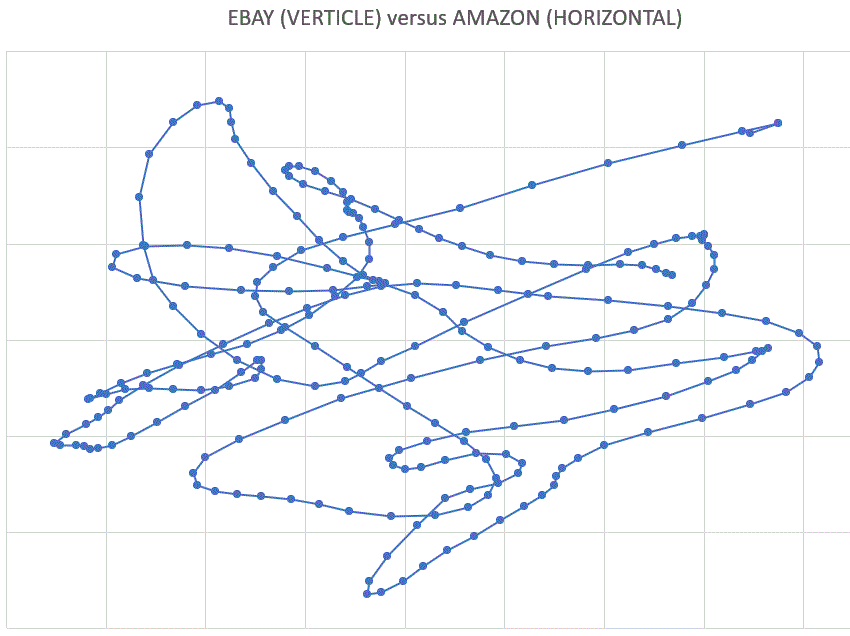

---

## The Zorro Project

**Contributor:** Petra Volkova, The Zorro Project by oP group Germany  
**Website:** [https://zorro-project.com](https://zorro-project.com)

In his article last month, John Ehlers presented a new way to display price over volume in a loop plot. This month, in his article in this issue, "Pairs Rotation With Ehlers Loops," he uses the same method to compare a stock with an index for pairs rotation.

The C code for the roofing filter that smooths and scales the data is the same:

```c
var Roofing(var *Data,int HPeriod,int LPeriod)
{
  var f = 1.414*PI/HPeriod;
  var hpa1 = exp(-f);
  var hpc2 = 2*hpa1*cos(f/2);
  var hpc3 = -hpa1*hpa1;
  var hpc1 = (1 + hpc2 - hpc3) / 4;
  f = 1.414*PI/LPeriod;
  var ssa1 = exp(-f);
  var ssc2 = 2*ssa1*cos(f/2);
  var ssc3 = -ssa1*ssa1;
  var ssc1 = 1 - ssc2 - ssc3;
 
  vars HP = series(0,3);
  HP[0] = hpc1*(Data[0] - 2*Data[1] + Data[2]) + hpc2*HP[1] + hpc3*HP[2];
  vars SS = series(HP[0],3);
  SS[0] = ssc1*(HP[0] + HP[1])/2 + ssc2*SS[1] + ssc3*SS[2];
  var Scaled = EMA(SS[0]*SS[0],.0242);
  return SS[0]/sqrt(Scaled);
}

function run()
{
  BarPeriod = 1440; 
  LookBack = 300;
  StartDate = 20210801; 
  EndDate = 20211130; 
 
  assetAdd("RTX","YAHOO:*");
  asset("RTX");
  var Y = Roofing(seriesC(),125,20);
  assetAdd("SPY","YAHOO:*");
  asset("SPY");
  var X = Roofing(seriesC(),125,20);

  if(is(LOOKBACK)) return;
  plotGraph("Loop",X,Y,DOT|GRAPH,BLUE);
  plotGraph("Loops",X,Y,SPLINE|GRAPH,TRANSP|GREY);
  if(is(EXITRUN)) 
    plotGraph("Last",X,Y,SQUARE|GRAPH,RED);
}
```

The plotGraph functions mark each coordinate with a blue dot and connect the dots with spline lines. The last day is marked with a red square. The resulting chart is shown in Figure 6.

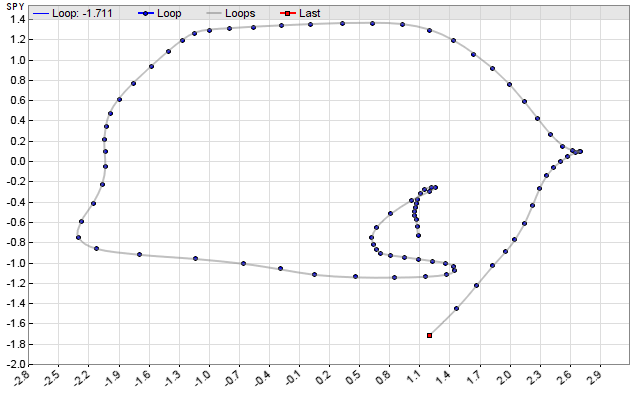

Ehlers' roofing filter is sensitive to the lookback period. It needs some time to "swing in." A too-short lookback period, like Zorro's default 80 bars, produces a visibly different loop.

Ehlers proposes to switch between stock and index depending on the loop rotation and angle quadrant. This was intended for discretionary trading, but can theoretically also be automated with a script.

The roofing indicator and the Ehlers Loop script can be downloaded from the 2022 script repository on [https://financial-hacker.com](https://financial-hacker.com). The Zorro software can be downloaded from [https://zorro-project.com](https://zorro-project.com).

---

## Microsoft Excel

**Contributor:** Ron McAllister, Excel and VBA programmer  
**Email:** [rpmac_xltt@sprynet.com](mailto:rpmac_xltt@sprynet.com)

In his article in this issue, "Pairs Rotation With Ehlers Loops," John Ehlers provides an example of using Ehlers Loops for pairs trading. There is a lot of information to be gleaned when working with Ehlers Loops in a pairs rotation.

Let's start with Figure 7, which replicates Ehlers' example from his article in this issue. From there we will drill down a bit.

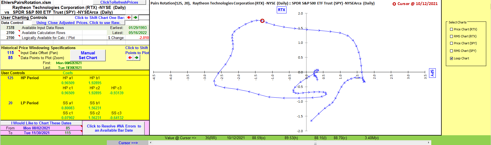

In Figure 8 we have the RTX component pricing and RMS charts. The peak and decline of the RMS plot near the center looks to be anticipating the price action. (The cursors in Figures 7 and 8 are on the same bar date.)

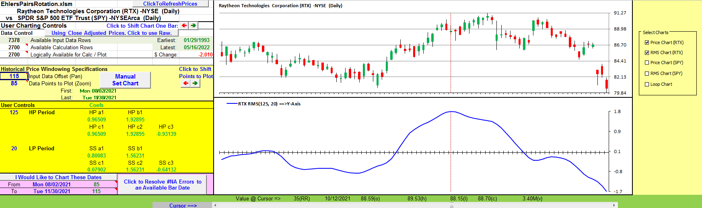

Figure 9 displays the result of playing with the HP and LP settings. In this instance, the RMS plots are noisier and seem to foreshadow the eventual price action to a greater degree than the settings used in Figure 8.

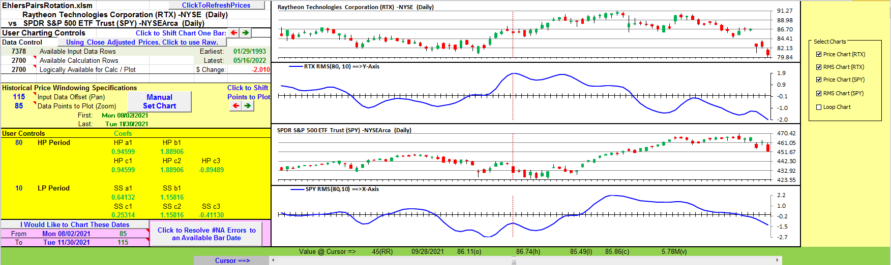

Figures 10, 11, and 12 give a larger detail view of the pairs comparison with the 80,10 HP-LP period settings in Figure 9.

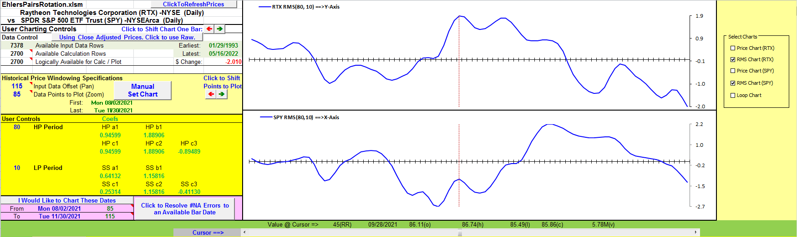

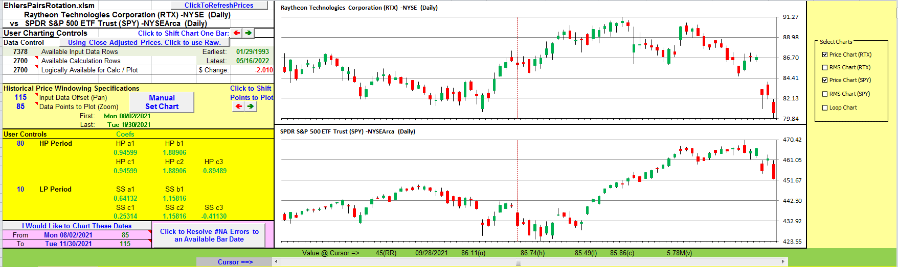

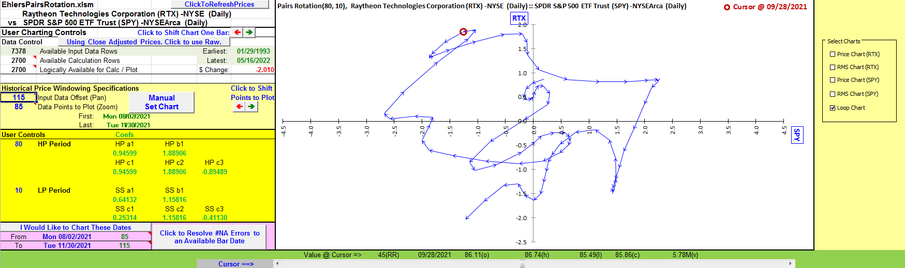

When experimenting with the spreadsheet, please be sure to use the cursor slider to get a feel for what price points generated any particular point on the Ehlers Loop and how the direction of the move along the loop to the next point works for you as a visual predictor of future price action. Be sure to try other HP and LP period values.

**To download this spreadsheet:** The spreadsheet file for this Traders' Tip can be downloaded from the link below. Right-click on the link, then select "save as" (or "save target as") to place a copy of the spreadsheet file on your hard drive.

Download: [code/EhlersPairsRotation.xlsm](code/EhlersPairsRotation.xlsm)

---

## TradingView

**Contributor:** PineCoders, for TradingView  
**Website:** [www.TradingView.com](https://www.tradingview.com/)

Here is the Pine Script code for TradingView implementing the Ehlers Loops described in this issue's article "Pairs Rotation With Ehlers Loops" by John F. Ehlers.

```pine
//  TASC Issue: July 2022 - Vol. 40, Issue 8
//     Article: Pairs Rotation With Ehlers Loops
//              Part 2 - Charting The Rotation
//  Article By: John F. Ehlers
//    Language: TradingView's Pine Script v5
// Provided By: PineCoders, for tradingview.com

//@version=5
indicator("TASC 2022.07 Pairs Rotation With Ehlers Loops",
      "PRWEL", max_lines_count=300, max_labels_count=300)

//== 2 Pole Butterworth Highpass Filter ==//
butterworthHP(float Series, float Period) =>
    var float ALPHA =  math.pi * math.sqrt(2.0) / Period
    var float BETA  =  math.exp(-ALPHA )
    var float COEF2 = -math.pow(BETA, 2)
    var float COEF1 =  math.cos( ALPHA ) * 2.0 * BETA
    var float COEF0 =  (1.0 + COEF1 - COEF2) * 0.25
    float tmp    = nz(Series[1],  Series)
    float whiten =    Series + nz(Series[2], tmp) - 2.0 * tmp 
    float smooth = na, smooth := COEF0 *     whiten     +
                                 COEF1 *  nz(smooth[1]) +
                                 COEF2 *  nz(smooth[2])

//===== 2 Pole Super Smoother Filter =====//
superSmoother(float Series, float Period) =>
    var float ALPHA =  math.pi * math.sqrt(2.0) / Period
    var float BETA  =  math.exp(-ALPHA )
    var float COEF2 = -math.pow(BETA, 2)
    var float COEF1 =  math.cos( ALPHA ) * 2.0 * BETA
    var float COEF0 =  1.0 - COEF1 - COEF2
    float sma2   = math.avg(Series, nz(Series[1], Series))
    float smooth = na, smooth := COEF0 *      sma2      +
                                 COEF1 *  nz(smooth[1]) +
                                 COEF2 *  nz(smooth[2])

//===== Faster Root Mean Square =====//
fastRMS(float Series, float Period) =>
    if Period < 1
        runtime.error("Err: fastRMS(Period=) is less than 1")
    var float COEF0 = 2.0 / (Period + 1)
    var float COEF1 = 1.0 -  COEF0
    float pow = math.pow(Series, 2)
    float ema = na, ema := COEF0 *    pow +
                           COEF1 * nz(ema[1], pow)
    nz(Series / math.sqrt(ema))

//===== RMS Scaled Bandpass Filter =====//
scaledFilt(int periodHP, int periodLP, int periodRMS) =>
    float HP       = butterworthHP(close, periodHP )
    float BPF      = superSmoother(   HP, periodLP )
    float priceRMS =       fastRMS(  BPF, periodRMS)

//===== Draws a Vertcal Line Segment =====/
vline(int X, color Color) =>
    var zero = line.new(X, -3.0, X, 3.0, color=Color,
              style=line.style_dotted,  width=1)
    line.set_x1(zero, X+1)
    line.set_x2(zero, X)

//======= Draws Various Deviation Boxes =======//
drawDeviationBox(float Width, int Offset, float Height,
                          int Deviations, color Color) =>
    if barstate.islast
        var Box = box.new(
          bar_index, Height * 0.5, bar_index, Height * -0.5,
         border_color=Color, border_style=line.style_dotted,
         bgcolor=color.new(Color, 96), text_size=size.small,
           text=str.tostring(Deviations)   +  ' deviations',
           text_color=Color,  text_valign=text.align_bottom)
        width = int(Width)
        box.set_left( Box, int(bar_index - width) + Offset)
        box.set_right(Box, int(bar_index + width) + Offset)

//===== Draws the Ehlers Loops =====/
drawLoop(float xPosition, float yPosition, color  Color,
           int  Segments,   int  BarScale,   int Offset) =>
    var aSegments = array.new<line> (Segments  )
    var aNodes    = array.new<label>(Segments+1)
    if barstate.islast
        for i=0 to Segments
            float Y2 =     yPosition[  i]
            int   X2 = int(xPosition[  i] * BarScale)
            int   X1 = int(xPosition[1+i] * BarScale)
            float Y1 =     yPosition[1+i]
            X2 := math.min(500, X2 + Offset) + bar_index
            X1 := math.min(500, X1 + Offset) + bar_index
            if i < Segments
                width = int(4 *(Segments - i) / Segments + 1)
                line.delete(array.get(aSegments, i))
                segment= line.new(X1, Y1, X2, Y2, color=Color,
                         style=line.style_solid,  width=width)
                array.set( aSegments, i, segment)
            nodeSize = i==0 ? size.large : size.normal
            nodeChar = i==0 ? '⦿' : i==Segments ? '🔙' : '⯁'
            label.delete(array.get(aNodes, i))
            node = label.new(X2, Y2, nodeChar, size=nodeSize,
                             color=#00000000, textcolor=Color,
                              style=label.style_label_center)
            array.set(aNodes, i, node)

pairedSym = input.symbol('SP:SPX','Paired Symbol')
periodLP  = input.int( 20,  "Low-Pass Period", minval= 7)
periodHP  = input.int(125, "High-Pass Period", minval=20)
periodRMS = input.int( 80,       "RMS Period",   step=10)
colorLoop = input.color(#FF0000, 'Loop Color')
barScale  = input.int( 40,       'Bar Scale:',   step= 5)
offset    = input.int(125, 'X Axis Position:',   step= 5)
segments  = input.int( 50,   'Loop Segments:', minval=10)

expression = scaledFilt(periodHP, periodLP, periodRMS)

var  CHART_TICKER = ticker.new(syminfo.prefix, syminfo.ticker)
var PAIRED_SYMBOL = ticker.new(syminfo.prefix(pairedSym),
                               syminfo.ticker(pairedSym))
PriceRMS_1 = request.security( CHART_TICKER, timeframe.period,
                       expression, ignore_invalid_symbol=true)
PriceRMS_2 = request.security(PAIRED_SYMBOL, timeframe.period,
                       expression, ignore_invalid_symbol=true)

plot(PriceRMS_1,  'Chart Symbol', color=#FF5555)
plot(PriceRMS_2, 'Paired Symbol', color=#5555FF)

hline(    0.0, "Zero", #808000FF, hline.style_dotted)
vline(math.min(500, offset) + bar_index, #808000FF)
drawDeviationBox(3.0 * barScale, offset, 6.0, 3, #FF0000)
drawDeviationBox(2.0 * barScale, offset, 4.0, 2, #FF6600)
drawDeviationBox(      barScale, offset, 2.0, 1, #FFCC00)

drawLoop(PriceRMS_2, PriceRMS_1, colorLoop,
           segments,   barScale,    offset)
```

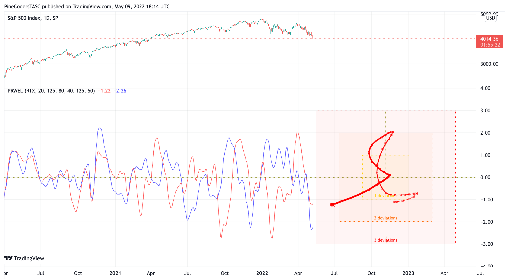

The indicator is available on TradingView from the PineCodersTASC account: [https://www.tradingview.com/u/PineCodersTASC/#published-scripts](https://www.tradingview.com/u/PineCodersTASC/#published-scripts)

---

## Code Files

| Platform | File |
|----------|------|
| TradeStation | [code/tradestation-ehlers-loops-pairs-rotation.els](code/tradestation-ehlers-loops-pairs-rotation.els) |
| Wealth-Lab | [code/wealthlab-ehlers-loops-pairs-rotation.cs](code/wealthlab-ehlers-loops-pairs-rotation.cs) |
| NinjaTrader | [ninja-trader/EhlersLoopsPairsRotation.cs](ninja-trader/EhlersLoopsPairsRotation.cs) |
| TradersStudio | [code/tradersstudio-ehlers-loops-pairs-rotation.txt](code/tradersstudio-ehlers-loops-pairs-rotation.txt) |
| The Zorro Project | [code/zorro-ehlers-loops-pairs-rotation.c](code/zorro-ehlers-loops-pairs-rotation.c) |
| Microsoft Excel | [code/EhlersPairsRotation.xlsm](code/EhlersPairsRotation.xlsm) |
| TradingView | [code/tradingview-ehlers-loops-pairs-rotation.pine](code/tradingview-ehlers-loops-pairs-rotation.pine) |

---

## References

- [Traders' Tips: July 2022](https://www.traders.com/Documentation/FEEDbk_docs/2022/07/TradersTips.html)

```bibtex
@misc{traders_tips_2022_07,
  author       = {{Technical Analysis of STOCKS \& COMMODITIES}},
  title        = {Traders' Tips: Pairs Rotation With Ehlers Loops, Part 2},
  year         = {2022},
  month        = jul,
  howpublished = {online},
  url          = {https://www.traders.com/Documentation/FEEDbk_docs/2022/07/TradersTips.html}
}
```

---

*Originally published in the July 2022 issue of Technical Analysis of STOCKS & COMMODITIES magazine. All rights reserved. © Copyright 2022, Technical Analysis, Inc.*
