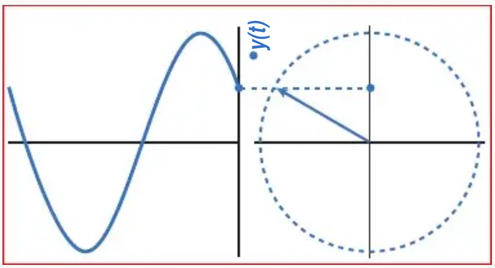
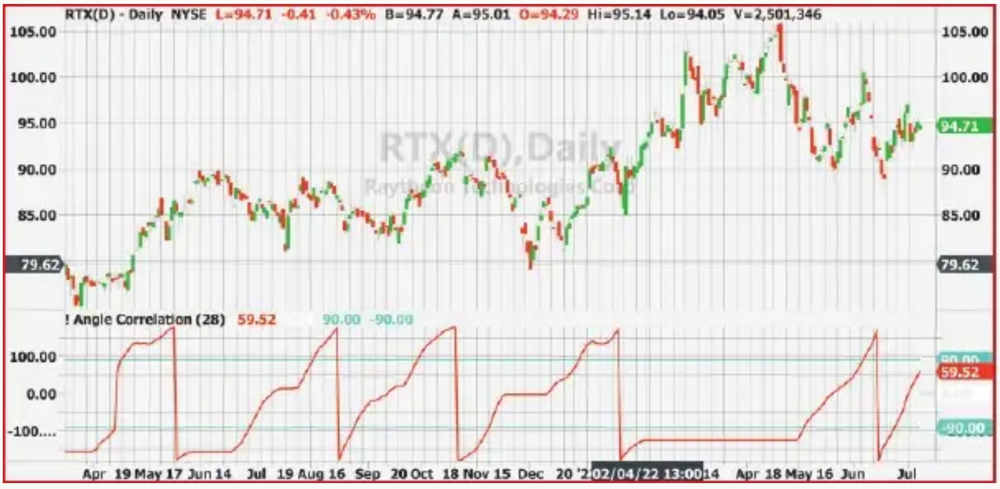
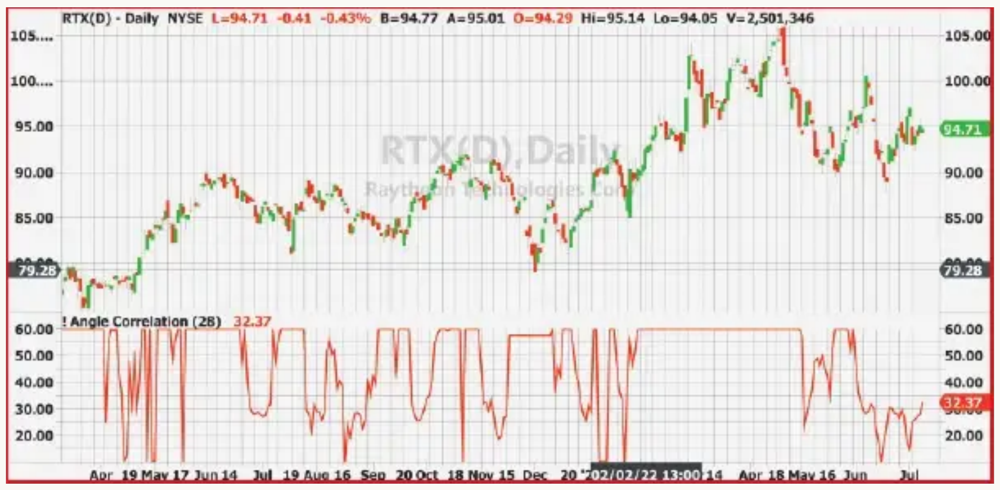
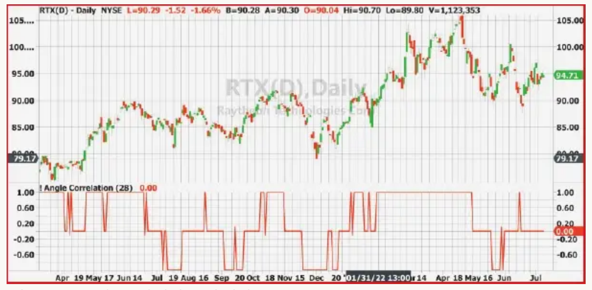

# Recurring Phase Of Cycle Analysis

**Using Phasor Analysis To Identify Market Trend**

*by John F. Ehlers*

> On this occasion of the 40-year anniversary of this magazine, S&C Contributing Editor John Ehlers takes a look back at technical analysis history and reviews what we've come to understand about cycles in the financial markets. His years of technical research on this topic has led to insights and advancements that he has shared with us in many articles, and continues to share here.

## Some Evolution of Technical Analysis

Cycle analysis for technical analysis has come a long way since the launch of this magazine in 1982. Cycle analysis was pretty primitive back then. J.M. Hurst had established that patterns such as double tops, head & shoulders, and even Elliott waves could be synthesized with just a few harmonics of a fundamental sine wave. Anthony Warren wrote some seminal articles in Stocks & Commodities about Fourier analysis, demonstrating the duality between events in the time domain and their representation in the frequency domain. Engineer Jack Hutson, publisher and founder of Stocks & Commodities magazine, recognized the importance of cycle analysis and Fourier transforms and encouraged research in this area.

### In the Beginning

In those earlier days, resolution in the frequency domain was relatively poor, but the peaks in the spectrum shapes could discern between long-wavelength seasonal periods, intermediate-length periods for trading, and short-period random variations from the peaks in the spectrum shapes. So the basic use of cycle analysis was to determine whether it was best to do trend trading or swing trading. Fast fourier transforms (FFT) were the technical rage back then, but turned out to be just not the right tool for technical analysis because of their resolution.

Maximum entropy spectral analysis (MESA) was developed in 1976 for use in the exploration of oil. It could provide a high-resolution display from short-burst seismic echoes. Recognizing that the high-resolution capability had merit, I started using it in my personal futures trading. Encouraged by Hutson, I wrote several articles for this magazine describing how MESA worked and what kind of performance it could deliver. As a result, MESA became popular among a few early adaptors. Consequently, I wrote more articles as PCs became more available and more capable.

In retrospect, I recall a funny footnote. MESA is computationally intensive. When programmed in BASIC on an Apple II computer, a single analysis would take a very long time. Just to ensure the computer had not locked up, I mapped the computing registers to the display registers so you could watch the Apple II do its work. It was actually kind of cool. Today's computers can handle the MESA algorithm without even breaking a sweat.

So MESA raised the bar for performance with regard to swing trading. The evolution through the years involved improved displays and improved timing signals for swing trading. The one constant throughout the evolution was the concept that happenings in the time domain are expressly tied to happenings in the frequency domain. Either description was a full and complete description of market activity. That relationship can be better understood with reference to Figure 1.



**FIGURE 1: TIME DOMAIN VS. FREQUENCY DOMAIN.** Happenings in the time domain are expressly tied to happenings in the frequency domain. The time domain and the frequency domain both represent events equally, so that either description provides a full and complete description of market activity. Expressed graphically here, the time waveform is represented by a pure sine wave in the left-hand side of the chart. The time waveform is also represented as a phasor (a two-dimensional vector pinned at the origin) in the right-hand side of the chart.

In simplest terms, the time waveform is represented by a pure sine wave in the left-hand side of the chart. It is also represented as a phasor in the right-hand side of the chart.

A phasor is a two-dimensional vector, pinned at the origin. Its rate of rotation is the frequency of the sine wave in the time domain. Its rotation starts at −180 degrees and advances to +180 degrees throughout the cycle period, whereupon the next cycle begins. (Note: The graphic in Figure 1 is static for the printed page, but it can be viewed at my website as an animated graphic.) The projection of the tip of the phasor onto the vertical axis as a function of time traces out the sine wave in the left side of the graphic. The projection of the phasor onto the horizontal axis as a function of time traces a cosine wave at the same time the projection onto the vertical axis produces a sine wave.

The horizontal axis is called the real axis and the vertical axis is called the imaginary axis. It can be shown that the activity on the two axes are orthogonal. That is, they are statistically independent over the period of the cycle. The activity on the real and imaginary axes defines the phasor. When the phase angle of the phasor is −90 degrees, the cycle is at its valley in the time domain. When the phase of the phasor is +90 degrees, the cycle is at its peak in the time domain.

## A Current Approach

We can create the real and imaginary components of market data by correlating the market data with cosine and sine, respectively, of fixed cycle period. The wavelength of the fixed cycle period should be about midrange of the spectrum components in the market data. The phase angle of the phasor is then easily computed as the arctangent of the ratio of the imaginary component to the real component. The computation is repeated for each bar in the data set. I show the precise computation using EasyLanguage in the sidebar, "Phasor Analysis, In EasyLanguage."

When the indicator in the code listing is applied to daily data for the stock symbol RTX (Raytheon Technologies Corp.) we get the display shown in Figure 2. The phasor is the red line in the first subgraph. The phasor starts at −180 degrees and advances through the cycle period until it reaches +180 degrees, whereupon it repeats with time. The valleys of the computed waveform are easily identified at −90 degrees, and the timing of the phase angle crossing −90 degrees can be compared to the valleys in the price waveform. Correspondingly, the peaks of the computed waveform are easily identified at +90 degrees, and the timing of the phase angle crossing +90 degrees can be compared to the peaks in the price waveform. Thus, the phase angle crossings of −90 and +90 degrees basically constitute buy and sell signals of a trading algorithm. Of course, these need to be trimmed in the real world. You want to hold a long position when the phase angle is between −90 degrees and +90 degrees. You want to hold a short position (or be out) when the phase angle is greater than +90 degrees or less than −90 degrees. You want the phase angle to be less than −90 degrees when you are swing trading.



**FIGURE 2: IDENTIFYING PEAKS AND VALLEYS IN PRICE.** This displays the phasor indicator in the code listing applied to RTX using daily data. The phasor is the red line in the first subgraph. The phase angle crossings of −90 and +90 degrees basically constitute buy and sell signals of a trading algorithm, albeit trimmed in the real world.

Note that the period of the phasor is not the period of the fixed cycle period used in the correlation process. In fact, there are times when the phase is not advanced at all. When the cycle phase is not advancing, the waveform is not cycling. If it is not cycling, it must be trending. Since the slope of the phasor is changing, the frequency of the spectrum must not be constant. Frequency is the rate-change of phase.

> It is much more preferable to perform analyses in terms of phase angle rather than in terms of cycle period.

> We can now use cycle analytics to know when to trade the trend.



**FIGURE 3: CYCLE PERIODS.** We can express the computed instantaneous period of the data as 360 divided by the rate-change of angle. The resulting derived period is shown here. As you can see, instantaneous derived cycle periods are all over the place. It is preferable to perform analyses in terms of phase angle rather than in terms of cycle period.

So when is the data trending? It is trending when it is not cycling. I have defined trending as occurring when the instantaneous period is longer that 60 days (about three months). This is also when the rate-change of angle is 6 degrees per bar or less.

Trend rules are the opposite of swing rules. When trending, you want to be long when the phase angle is greater than +90 degrees or less than −90 degrees. You want to be short or out when the phase angle is between −90 degrees and +90 degrees.

These rules can be used to create a state variable that is +1 for long positions, 0 for cycling, and −1 for short positions (or out). This state variable is shown in Figure 4. You can compare the timing of the +1 and −1 states with the short-term trends in the price data.



**FIGURE 4: TREND STATE IS LONG (+1) OR SHORT (−1).** We can use the rules to create a state variable that is +1 for long positions, 0 for cycling, and −1 for short positions (or out). This state variable is shown here. You can compare the timing of the +1 and −1 states with the short-term trends in the price data.

With reference to the sidebar's code listing for phasor analysis, you can replicate the state variable display by removing the curly brackets around the code segment titled "Trend state variable" and ensuring curly brackets are placed around the other display code segments.

## The Cycle Is Complete

In the beginning, we used cycle analysis to determine whether the market was trending or whether it was suitable for swing trading. Evolution has occurred. Our computers are far more capable than they were 40 years ago. Our continued research and application of the science of DSP to the art of trading has brought us full circle. We can now use cycle analytics to know when to trade the trend.

Congratulations to S&C for 40 years of successfully bringing new technical concepts to traders. It has been a wonderful journey. Thanks to S&C for letting me be a part of it.

---

## Phasor Analysis, In EasyLanguage

```easylanguage
{
    Phasor Analysis
    (C) 2013-2022 John F. Ehlers
}
Inputs:
    Period(28);

Vars:
    Signal(0),
    count(0),
    Sx(0),
    Sy(0),
    Sxx(0),
    Sxy(0),
    Syy(0),
    X(0),
    Y(0),
    Real(0),
    Imag(0),
    Angle(0),
    DerivedPeriod(0);

Signal = Close;

//Correlate with Cosine wave having a fixed period
Sx = 0;
Sy = 0;
Sxx = 0;
Sxy = 0;
Syy = 0;
For count = 1 to Period Begin
    X = Signal[count - 1];
    Y = Cosine(360*(count - 1) / Period);
    Sx = Sx + X;
    Sy = Sy + Y;
    Sxx = Sxx + X*X;
    Sxy = Sxy + X*Y;
    Syy = Syy + Y*Y;
End;
If (Period*Sxx - Sx*Sx > 0) and (Period*Syy - Sy*Sy > 0) Then
    Real = (Period*Sxy - Sx*Sy) / SquareRoot((Period*Sxx - Sx*Sx)*(Period*Syy - Sy*Sy));

//Correlate with a Negative Sine wave having a fixed period
Sx = 0;
Sy = 0;
Sxx = 0;
Sxy = 0;
Syy = 0;
For count = 1 to Period Begin
    X = Signal[count - 1];
    Y = -Sine(360*(count - 1) / Period);
    Sx = Sx + X;
    Sy = Sy + Y;
    Sxx = Sxx + X*X;
    Sxy = Sxy + X*Y;
    Syy = Syy + Y*Y;
End;
If (Period*Sxx - Sx*Sx > 0) and (Period*Syy - Sy*Sy > 0) Then
    Imag = (Period*Sxy - Sx*Sy) / SquareRoot((Period*Sxx - Sx*Sx)*(Period*Syy - Sy*Sy));

//Compute the angle as an arctangent function and resolve ambiguity
If Real <> 0 Then Angle = 90 - Arctangent(Imag / Real);
If Real < 0 Then Angle = Angle - 180;

//Compensate for angle wraparound
If AbsValue(Angle[1]) - AbsValue(Angle - 360) < Angle - Angle[1]
    and Angle > 90 and Angle[1] < -90 Then Angle = Angle - 360;

//Angle cannot go backwards
If Angle < Angle[1] and ((Angle > -135 and Angle[1] < 135)
    or (Angle < -90 and Angle[1] < -90)) Then Angle = Angle[1];

//Phasor Indicator
Plot1(Angle, "Angle", red, 4, 4);
Plot2(0, "Ref", white, 1, 1);
Plot4(90, "", cyan, 2, 2);
Plot8(-90, "", cyan, 2, 2);

{
//Frequency derived from rate-change of phase
Vars: DeltaAngle(0), AvgPeriod(0);
DeltaAngle = Angle - Angle[1];
If DeltaAngle <= 0 Then DeltaAngle = DeltaAngle[1];
If DeltaAngle <> 0 Then DerivedPeriod = 360 / DeltaAngle;
If DerivedPeriod > 60 Then DerivedPeriod = 60;
Plot9(DerivedPeriod, "", red, 4, 4);
}

{
//Trend State Variable
Vars: State(0);
State = 0;
If Angle - Angle[1] <= 6 Then Begin
    If Angle >= 90 or Angle <= -90 Then State = 1;
    If Angle > -90 and Angle < 90 Then State = -1;
End;
Plot10(State, "", red, 4, 4);
}
```

---

## About the Author

John Ehlers, a Contributing Editor to Stocks & Commodities, is a pioneer in the use of cycles and DSP (digital signal processing) technical analysis. This article is his 100th article to appear in this magazine, with his first article appearing in the December 1985 issue. Ehlers is president of MESA Software and can be reached through his website at [MESAsoftware.com](http://www.mesasoftware.com).

Ehlers will hold his annual workshop online October 10–14, 2022, during which he will teach and discuss concepts and trading methods from his years of work in digital signal processing. More information can be found at [MESAsoftware.com](http://www.mesasoftware.com).

## Further Reading

- Hurst, J.M. [1970]. *The Profit Magic of Stock Transaction Timing*.
- Warren, Anthony W., PhD, and Jack K. Hutson [1984]. "Maximum Entropy Optimization," *Technical Analysis of Stocks & Commodities*, Volume 2: July.

---

## References

- **Article URL:** <https://technical.traders.com/archive/article.asp?file=\V40\C10\493EHLE.pdf>
- **Traders' Tips URL:** <https://www.traders.com/Documentation/FEEDbk_docs/2022/11/TradersTips.html>

```bibtex
@article{ehlers2022recurring,
  author    = {Ehlers, John F.},
  title     = {Recurring Phase Of Cycle Analysis},
  journal   = {Technical Analysis of Stocks \& Commodities},
  volume    = {40},
  number    = {10},
  pages     = {8--14},
  year      = {2022},
  month     = oct,
  url       = {https://technical.traders.com/archive/article.asp?file=\V40\C10\493EHLE.pdf}
}

@misc{ehlers2022recurring_tips,
  author    = {Ehlers, John F.},
  title     = {Traders' Tips: Recurring Phase Of Cycle Analysis},
  year      = {2022},
  month     = nov,
  howpublished = {Technical Analysis of Stocks \& Commodities},
  url       = {https://www.traders.com/Documentation/FEEDbk_docs/2022/11/TradersTips.html}
}
```
