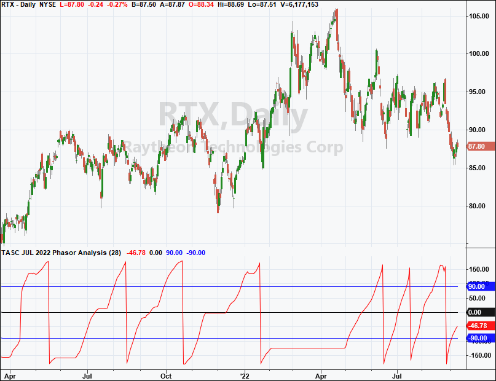
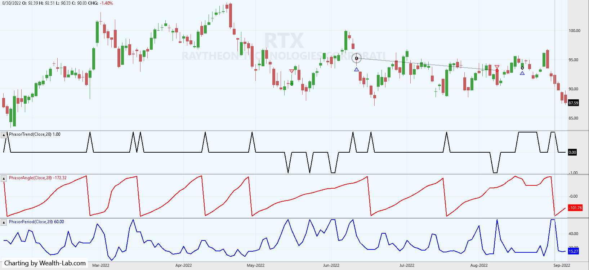
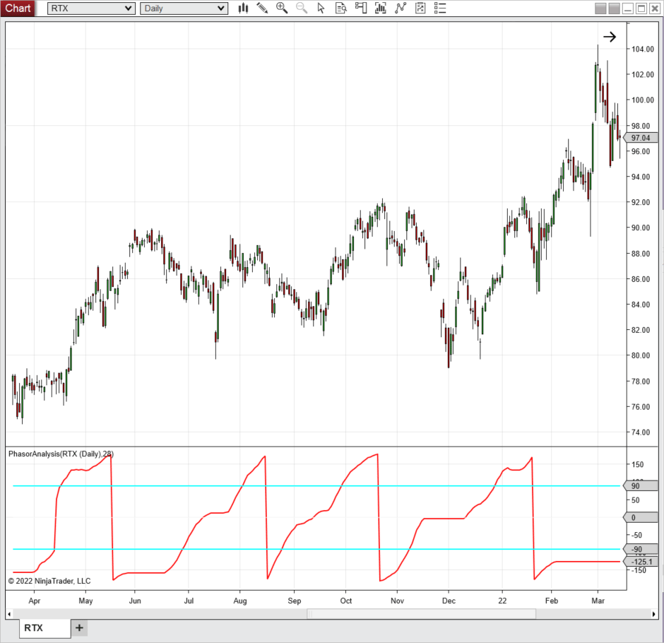
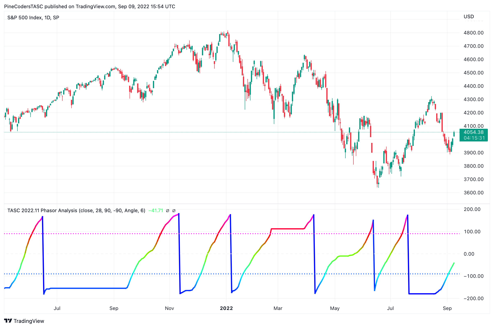
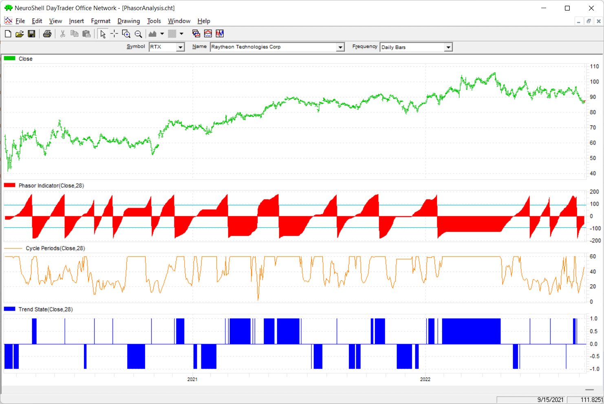
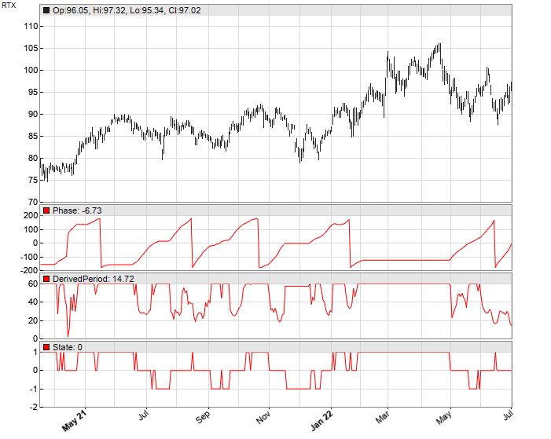
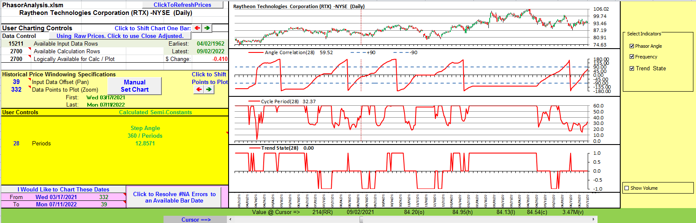

# Traders' Tips: Recurring Phase Of Cycle Analysis

**November 2022**

For this month's Traders' Tips, the focus is John Ehlers' article in the October issue, "Recurring Phase Of Cycle Analysis." Here, we present the November 2022 Traders' Tips code with possible implementations in various software.

The Traders' Tips section is provided to help the reader implement a selected technique from an article in this issue or another recent issue. The entries here are contributed by software developers or programmers for software that is capable of customization.

---

## TradeStation

*by John Robinson, TradeStation Securities, Inc. — [www.TradeStation.com](https://www.tradestation.com/)*

In his article in the October 2022 issue of S&C, "Recurring Phase Of Cycle Analysis," author John Ehlers explains how cycle analysis for technical analysis has advanced a long way over the years. In earlier years, cycle analysis was primitive and limited. In his October 2022 article, Ehlers illustrates a phasor as a two-dimensional vector, pinned at the origin, as a means for cycle analysis. (An animated graphic depicting a phasor and its angle as it progresses can be seen on the author's website.) In the course of a cycle, rotation starts at −180 degrees and advances to +180 degrees. Buy and sell signals can be observed when the phase angle crosses −90 and +90 degrees. Note that the study contains commented-out code if one wishes to observe the "frequency derived from rate change of phase" or the "trend state variable." In that case, the phasor indicator plots should be commented out before uncommenting either section.

```easylanguage
// TASC NOV 2022
// Phasor Analysis
// (C) 2013-2022 John F. Ehlers

inputs:
	Period(28);
	
variables:
	Signal(0),
	Count(0), 
	Sx(0),
	Sy(0),
	Sxx(0),
	Sxy(0),
	Syy(0),
	X(0),
	Y(0),
	Real(0),
	Imag(0),
	Angle(0),
	DerivedPeriod(0);

Signal = Close;
//Correlate with Cosine wave having a fixed period
Sx = 0; 
Sy = 0; 
Sxx = 0; 
Sxy = 0; 
Syy = 0;
	
for Count = 1 to Period 
begin
	X = Signal[count - 1];
	Y = Cosine(360*(count - 1) / Period);
	Sx = Sx + X;
	Sy = Sy + Y;
	Sxx = Sxx + X*X;
	Sxy = Sxy + X*Y;
	Syy = Syy + Y*Y;
end;

if (Period*Sxx - Sx*Sx > 0) 
 and (Period*Syy - Sy*Sy > 0) then 
	Real = (Period*Sxy - Sx*Sy) / SquareRoot(
	(Period*Sxx - Sx*Sx)*(Period*Syy - Sy*Sy));

// Correlate with a Negative Sine wave having a 
// fixed period 
Sx = 0; 
Sy = 0; 
Sxx = 0; 
Sxy = 0; 
Syy = 0;

for count = 1 to Period 
begin
	X = Signal[count - 1];
	Y = -Sine(360*(count - 1) / Period);
	Sx = Sx + X;
	Sy = Sy + Y;
	Sxx = Sxx + X*X;
	Sxy = Sxy + X*Y;
	Syy = Syy + Y*Y;
end;

if (Period*Sxx - Sx*Sx > 0) 
 and (Period*Syy - Sy*Sy > 0) then 

Imag = (Period*Sxy - Sx*Sy) / 
 SquareRoot((Period*Sxx - Sx*Sx)*(Period*Syy - Sy*Sy));

// Compute the angle as an arctangent function and 
// resolve ambiguity
if Real <> 0 then 
	Angle = 90 - Arctangent(Imag / Real);
	
if Real < 0 then 
	Angle = Angle - 180;
	
// Compensate for angle wraparound
If AbsValue(Angle[1]) - AbsValue(Angle - 360) < Angle - 
 Angle[1] and Angle > 90 and Angle[1] < -90 then 
 	Angle = Angle - 360;

// Angle cannot go backwards
if Angle < Angle[1] and ((Angle > -135 and Angle[1] < 
 135) or (Angle < -90 and Angle[1] < -90)) then 
 	Angle = Angle[1];

// Phasor Indicator
Plot1(Angle, "Angle");
Plot2(0, "Ref");
Plot4(90, "90");
Plot8(-90, "-90");

{
//Frequency derived from rate-change of phase
Vars: DeltaAngle(0), AvgPeriod(0);
DeltaAngle = Angle - Angle[1];
If DeltaAngle <= 0 Then DeltaAngle = DeltaAngle[1]; 
If DeltaAngle <> 0 Then DerivedPeriod = 360 / DeltaAngle;
If DerivedPeriod > 60 Then DerivedPeriod = 60;
Plot9(DerivedPeriod, "", red, 4, 4);
}
{
//Trend State Variable
Vars: State(0);
State = 0;
If Angle - Angle[1] <= 6 Then Begin
If Angle >= 90 or Angle <= -90 Then State = 1; 
If Angle > -90 and Angle < 90 Then State = -1;
End;
Plot10(State, "", red, 4, 4);
}
```



**FIGURE 1: TRADESTATION.** This shows a TradeStation daily chart of Raytheon Technologies (symbol RTX) with the indicator applied.

*This article is for informational purposes. No type of trading or investment recommendation, advice, or strategy is being made, given, or in any manner provided by TradeStation Securities or its affiliates.*

---

## Wealth-Lab.com

*by Gene Geren (Eugene), Wealth-Lab team — [www.wealth-lab.com](https://www.wealth-lab.com/)*

The group of phasor indicators from John Ehlers' article in the October 2022 issue of S&C, "Recurring Phase Of Cycle Analysis," has now been added to Wealth-Lab 8, making them available to any tools and extensions automatically. With the phasor trend indicator, creating a trading system by using Wealth-Lab's building blocks feature is hands-down the easiest way to set it up. Thus, we are not providing any code here. A simple rule that could be used in a system is a cross above or below the TrendState indicator. This rule is demonstrated in Figure 2 on a sample chart.



**FIGURE 2: WEALTH-LAB.** This chart demonstrates example trades taken by the sample trading system, applied to a chart of Raytheon stock (RTX) in Wealth-Lab 8.

---

## NinjaTrader

*by Emily Christoph, NinjaTrader, LLC — [www.ninjatrader.com](https://www.ninjatrader.com/)*

The phasor analysis indicator as presented in John Ehlers' article in the October 2022 issue of S&C, "Recurring Phase Of Cycle Analysis," is available for download at the following links for NinjaTrader 8 and NinjaTrader 7:

- **NinjaTrader 8:** [ninjatrader.com/SC/November2022SCNT8.zip](https://ninjatrader.com/SC/November2022SCNT8.zip)
- **NinjaTrader 7:** [ninjatrader.com/SC/November2022SCNT7.zip](https://ninjatrader.com/SC/November2022SCNT7.zip)

Once the file is downloaded, you can import the indicator into NinjaTrader 8 from within the control center by selecting Tools → Import → NinjaScript Add-On and then selecting the downloaded file for NinjaTrader 8. To import into NinjaTrader 7, from within the control center window, select the menu File → Utilities → Import NinjaScript and select the downloaded file.

You can review the indicator source code in NinjaTrader 8 by selecting the menu New → NinjaScript Editor → Indicators folder from within the control center window and selecting the PhasorAnalysis file. You can review the indicator's source code in NinjaTrader 7 by selecting the menu Tools → Edit NinjaScript → Indicator from within the control center window and selecting the PhasorAnalysis file.

NinjaScript uses compiled DLLs that run native, not interpreted, which provides you with the highest performance possible.

A sample chart displaying the indicator is shown in Figure 3.



**FIGURE 3: NINJATRADER.** The phasor analysis(28) indicator set to the "phasor" plot type displayed on a daily Raytheon (RTX) chart from April 2021 to March 2022.

---

## TradingView

*by PineCoders, for TradingView — [www.TradingView.com](https://www.tradingview.com/)*

Here is the TradingView Pine Script code implementing the phasor analysis technique described in John Ehlers' article in the October 2022 issue of S&C, "Recurring Phase Of Cycle Analysis."

```pine
//  TASC Issue: November 2022 - Vol. 40, Issue 12
//     Article: Recurring Phase Of Cycle Analysis
//              Using Phasor Analysis To Identify Market Trend
//  Article By: John Ehlers
//    Language: TradingView's Pine Script™ v5
// Provided By: PineCoders, for tradingview.com

// As representatives of TradingView members, we sincerely
// congratulate John Ehlers on his "100th TASC article". The 
// immense amount of contributed technical wisdom that Ehlers
// has graciously provided to so many TASC readers has, is,
// and will continue to be a treasured mathemagical blessing.
//
//                                      WE HONOR & THANK YOU,
//                                          "PineCoders"

//@version=5
indicator(title='TASC 2022.11 Phasor Analysis', overlay=false)
 
Phasor (float Signal = close, int Period = 28) =>
    var float angFreq = 2.0 * math.pi / Period
    float  Sx  = 0.0,  float  Sxx = 0.0
    float rSxy = 0.0,  float iSxy = 0.0
    float rSyy = 0.0,  float iSyy = 0.0
    float rSy  = 0.0,  float iSy  = 0.0
    for i=0 to Period-1
        float tmp = angFreq * i
        float X   =    Signal[i]
        float Yr  =  math.cos(tmp)
        float Yi  = -math.sin(tmp)
        Sx   += X,         Sxx += X  * X
        rSxy += X  * Yr,  iSxy += X  * Yi
        rSyy += Yr * Yr,  iSyy += Yi * Yi
        rSy  += Yr,       iSy  += Yi
    float varianceX     = Period *  Sxx -  Sx *  Sx
    float varianceYr    = Period * rSyy - rSy * rSy
    float varianceYi    = Period * iSyy - iSy * iSy
    float covarianceXYr = Period * rSxy -  Sx * rSy
    float covarianceXYi = Period * iSxy -  Sx * iSy
    float rDenominator  = varianceX * varianceYr
    float iDenominator  = varianceX * varianceYi
    float real = nz(covarianceXYr / math.sqrt(rDenominator))
    float imag = nz(covarianceXYi / math.sqrt(iDenominator))
    float angle     = 0.0
    float prevAngle = nz(angle[1])
    angle := if real == 0.0
        prevAngle
    else
        90.0 - math.todegrees(math.atan(imag / real))
    if real < 0.0
        angle -= 180.0
    float temp = math.abs(prevAngle) - math.abs(angle - 360.0)
    if  -90.0 > prevAngle
     and temp < angle - prevAngle
     and 90.0 < angle
        angle -= 360.0
    if     angle < prevAngle
     and ((angle > -135.0 and prevAngle <  135)
     or   (angle < -90.0  and prevAngle < -90.0))
        angle := prevAngle
    angle

Analysis (float Angle) =>
    float deltaAngle = Angle - nz(Angle[1])
    if deltaAngle <= 0.0
        deltaAngle := nz(deltaAngle[1])
    float derivedPeriod = if deltaAngle == 0.0
        0.0
    else
        math.min(60.0, 360.0 / deltaAngle)
    int state = 0
    if deltaAngle <= 6.0
        state := Angle > -90.0 and Angle < 90.0 ? -1 : 1
    [derivedPeriod, state]

string grp1 = 'Angle Parameters'
string grp2 = 'Indicator Choices'
Signal = input.source(close, 'Source', group=grp1)
Period = input.int   (28,    'Period', group=grp1, minval=5)
ThresholdUpper = input.int( 90, 'Upper Threshold',    1, 179)
ThresholdLower = input.int(-90, 'Lower Threshold', -179,  -1)

Indy =   input.string('Angle', 'Indicator Mode', group=grp2,
                         options=['Angle','Period','State'])
ChangeRate = input.int(6, 'Change Rate (degrees)', minval=2,
 tooltip='Intended for use with the State mode', group=grp2)

float phAngle    = Phasor(Signal, Period)
[dPeriod, Trend] = Analysis(phAngle)

// Phasor Color Wizardry
var seventeenTwelfths = 17.0 / 12.0
var seventeenSixths   = 17.0 /  6.0
colorValue =  phAngle * seventeenSixths
colorAngle = color.rgb(phAngle > 90.0 ? 255 : phAngle <-90.0 ? 
   0.0 : seventeenTwelfths * phAngle + 127.5, phAngle <  0.0 ?
  phAngle > -90.0 ? 255 : colorValue +  510 : phAngle > 90.0 ?
      0.0 : 255 - colorValue, phAngle > 0.0 ? phAngle < 90.0 ?
 0.0 : colorValue - 255 : phAngle < -90.0 ? 255 : -colorValue)

plot(Indy=='Angle'  ? phAngle : na, 'Angle', colorAngle, 3)
plot(Indy=='Period' ? dPeriod : na, 'DerivPeriod', #FFFF00)
plot(Indy=='State'  ? Trend   : na, 'TrendState', linewidth=2,
  color = Trend > 0 ? #00FF00 : Trend < 0 ? #FF0000 : #888800)

hline(  0, 'ZeroLine', #FFFFFF)
hline(Indy=='Angle' ? ThresholdUpper : na, 'Upper Threshold',
                              #FF00FF, hline.style_dotted, 2)
hline(Indy=='Angle' ? ThresholdLower : na, 'Lower Threshold',
                              #0055FF, hline.style_dotted, 2)
```

The indicator is available on TradingView in the PineCodersTASC account at <https://www.tradingview.com/u/PineCodersTASC/#published-scripts>.



**FIGURE 4: TRADINGVIEW.** The chart shows John Ehlers' phasor analysis trend indicator on a chart of the S&P 500 index.

---

## Neuroshell Trader

*by Ward Systems Group, Inc. — [www.neuroshell.com](https://www.neuroshell.com/)*

The cycle analysis technique presented in John Ehlers' article in the October 2022 issue of S&C, "Recurring Phase Of Cycle Analysis," can be easily implemented in NeuroShell Trader using NeuroShell Trader's ability to call external dynamic linked libraries (DLLs). DLLs can be written in C, C++, or Power Basic.

After moving the code given in the article to your preferred compiler and creating a DLL, you can insert the resulting indicator as follows:

1. Select *new indicator* from the *insert* menu.
2. Choose the *External Program & Library Calls* category.
3. Select the appropriate *External DLL Call* indicator.
4. Set up the parameters to match your DLL.
5. Select the *finished* button.

Users of NeuroShell Trader can go to the Stocks & Commodities section of the NeuroShell Trader free technical support website to download a copy of this or any previous Traders' Tips.



**FIGURE 5: NEUROSHELL TRADER.** This NeuroShell Trader chart demonstrates the phasor indicator, cycle periods and trend state.

---

## The Zorro Project

*by Petra Volkova, The Zorro Project by oP group Germany — [https://zorro-project.com](https://zorro-project.com/)*

In his article in the October 2022 issue, titled "Recurring Phase Of Cycle Analysis," John Ehlers presents a function for cycle analysis of price curves.

Zorro platform already contains several cycle analysis functions that are also based on algorithms by Ehlers; however, they are slightly different. For comparing the functions, users can simply replace the phasor function in this code given here with Zorro's native DominantPhase function.

The function provided here is a straightforward conversion of Ehlers' EasyLanguage code from his October 2022 article to the C language:

```c
var Angle, State, DerivedPeriod;

var phasor(vars Signals,int Period)
{
//Correlate with Cosine wave having a fixed period
  var Sx = 0, Sy = 0, Sxx = 0, Sxy = 0, Syy = 0;
  int count;
  for(count = 1; count <= Period; count++) {
    var X = Signals[count - 1];
    var Y = cos(2*PI*(count - 1) / Period);
    Sx += X; Sy += Y;
    Sxx += X*X; Sxy += X*Y; Syy += Y*Y;
  }
  var Real = 0, Imag = 0;
  if((Period*Sxx - Sx*Sx > 0) && (Period*Syy - Sy*Sy > 0))
    Real = (Period*Sxy - Sx*Sy) / sqrt((Period*Sxx - Sx*Sx)*(Period*Syy - Sy*Sy));
//Correlate with a Negative Sine wave having a fixed period
  Sx = Sy = Sxx = Sxy = Syy = 0;
  for(count = 1; count <= Period; count++) {
    var X = Signals[count - 1];
    var Y = -sin(2*PI*(count - 1) / Period);
    Sx += X; Sy += Y;
    Sxx += X*X; Sxy += X*Y; Syy += Y*Y;
  }
  if((Period*Sxx - Sx*Sx > 0) && (Period*Syy - Sy*Sy > 0))
    Imag = (Period*Sxy - Sx*Sy) / sqrt((Period*Sxx - Sx*Sx)*(Period*Syy - Sy*Sy));
//Compute the angle as an arctangent function and resolve ambiguity
  Angle = 0;
  if(Real != 0) Angle = 90 - 180/PI*atan(Imag/Real);
  if(Real < 0) Angle -= 180;
//compensate for angle wraparound
  vars Angles = series(Angle,2);
  if(abs(Angles[1]) - abs(Angle - 360) < Angle - Angles[1] && Angle > 90 && Angles[1] < -90)
    Angle -= 360;
//angle cannot go backwards
  if(Angle < Angles[1] && ((Angle > -135 && Angles[1] < 135) || (Angle < -90 && Angles[1] < -9)))
    Angle = Angles[1];
  Angles[0] = Angle;
//Frequency derived from rate-change of phase
  DerivedPeriod = 0;
  vars DeltaAngles = series(Angle - Angles[1],2);
  if(DeltaAngles[0] <= 0) DeltaAngles[0] = DeltaAngles[1];
  if(DeltaAngles[0] != 0) DerivedPeriod = 360 / DeltaAngles[0];
  if(DerivedPeriod > 60) DerivedPeriod = 60;
//Trend State Variable
  State = 0;
  if(Angle - Angles[1] <= 6) {
    if(Angle >= 90 || Angle <= -90) State = 1;
    if(Angle > -90 && Angle < 90) State = -1;
  }
  return Angle;
}
```

The phasor function returns its parameters in the three global variables angle, state, and DerivedPeriod.

For reproducing Ehlers' chart from his article, we can apply the function to a chart of Raytheon (symbol RTX) from April 2021 to July 2022 as follows:

```c
void run() 
{
  set(PLOTNOW,LOGFILE);
  BarPeriod = 1440;
  StartDate = 20210401;
  EndDate = 20220701;
  assetAdd("RTX","YAHOO:RTX");
  asset("RTX");
  phasor(seriesC(),28);
  plot("Phase",Angle,NEW,RED);
  plot("DerivedPeriod",DerivedPeriod,NEW,RED);
  plot("State",State,NEW,RED);
}
```

The chart in Figure 6 replicates the chart of RTX shown in Ehlers' October 2022 article.



**FIGURE 6: ZORRO PROJECT.** This replicates the chart of RTX shown in Ehlers' October 2022 article.

The phasor indicator can be downloaded from the 2022 script repository on [https://financial-hacker.com](https://financial-hacker.com). The Zorro software can be downloaded from [https://zorro-project.com](https://zorro-project.com).

---

## Microsoft Excel

*by Ron McAllister, Excel and VBA programmer — rpmac_xltt@sprynet.com*

In his article in the October 2022 issue of S&C, "Recurring Phase Of Cycle Analysis," John Ehlers reviews the evolution of the study of market cycles. Then he presents a simple approach to phasor analysis of price action. The code in the article's sidebar computes the correlation of price action relative to a 28-bar cycle and translates that into an instantaneous phase angle for each price bar.

With that instantaneous angle in hand, we can compute an instantaneous cycle period (frequency).

And finally, using the phase angle, we derive a trend indicator that can show us periods when we should be long (+1), short or out (−1), or cycling (0).

It is worth your time to play with the correlation period in the user controls.



**FIGURE 7: EXCEL.** This chart implements the trend indicator described in John Ehlers' article in the October 2022 issue of S&C. The indicator suggests long (+1), short or out (−1), or cycling (0). Settings can be adjusted in the user controls.

**To download this spreadsheet:** The spreadsheet file for this Traders' Tip can be downloaded [here](https://www.traders.com/Documentation/FEEDbk_docs/2022/11/images/code/PhasorAnalysis.xlsm).

---

## Code Files

| Platform | File | Description |
|----------|------|-------------|
| TradeStation | (code embedded above) | EasyLanguage indicator |
| NinjaTrader | [ninja-trader/PhasorAnalysis.cs](ninja-trader/PhasorAnalysis.cs) | C# NinjaScript indicator |
| TradingView | [code/PhasorAnalysis.pine](code/PhasorAnalysis.pine) | Pine Script v5 indicator |
| Zorro | [code/PhasorAnalysis.c](code/PhasorAnalysis.c) | Lite-C phasor function |
| Excel | [code/PhasorAnalysis.xlsm](code/PhasorAnalysis.xlsm) | VBA spreadsheet |

---

## References

- **Traders' Tips URL:** <https://www.traders.com/Documentation/FEEDbk_docs/2022/11/TradersTips.html>

```bibtex
@misc{ehlers2022recurring_tips,
  author       = {Ehlers, John F.},
  title        = {Traders' Tips: Recurring Phase Of Cycle Analysis},
  year         = {2022},
  month        = nov,
  howpublished = {Technical Analysis of Stocks \& Commodities},
  url          = {https://www.traders.com/Documentation/FEEDbk_docs/2022/11/TradersTips.html}
}
```

---

*Originally published in the November 2022 issue of Technical Analysis of Stocks & Commodities magazine. All rights reserved. Copyright 2021, Technical Analysis, Inc.*
