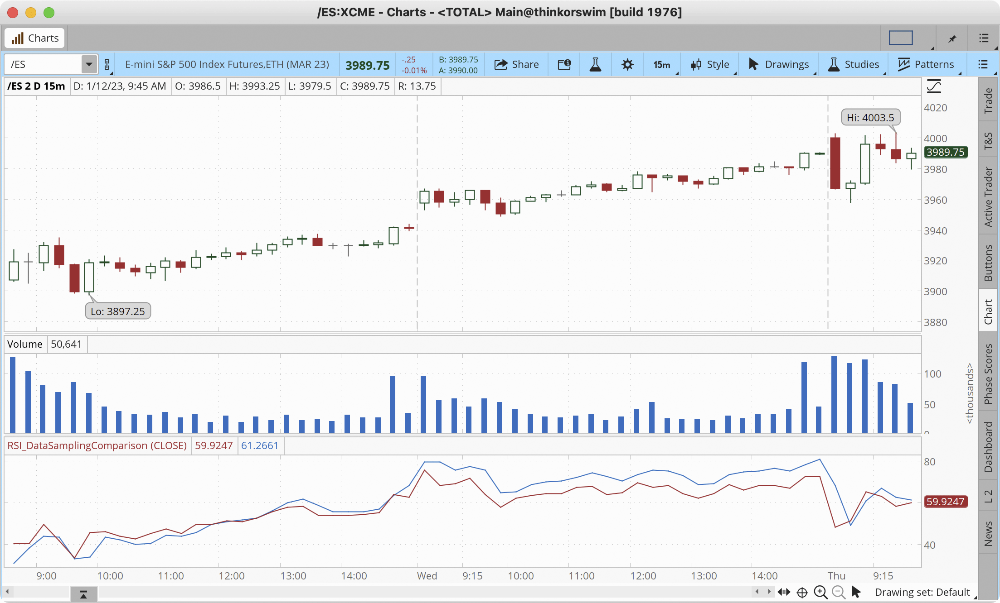
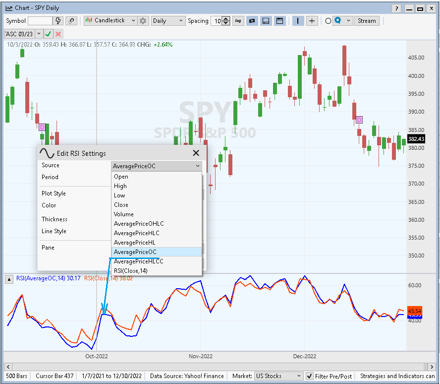
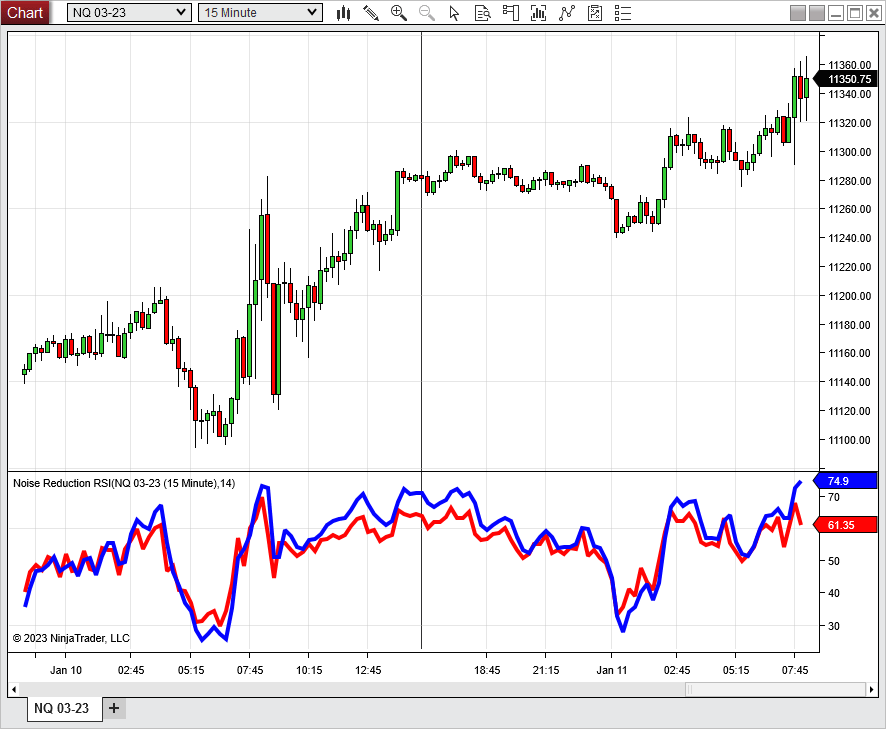
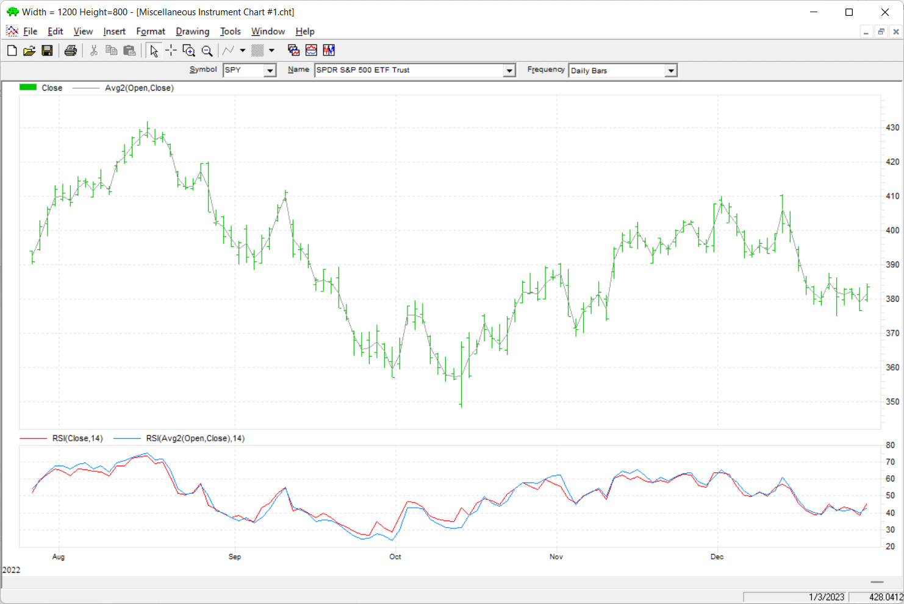
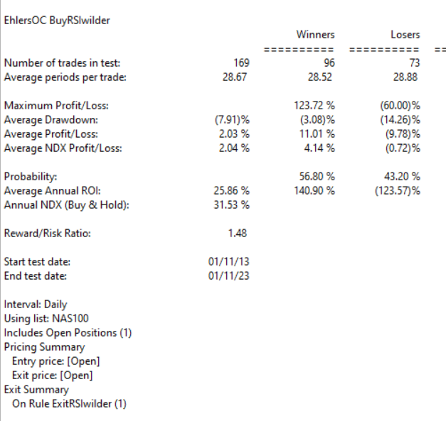
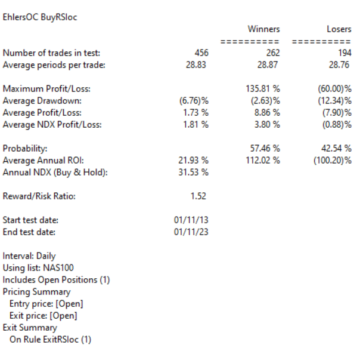
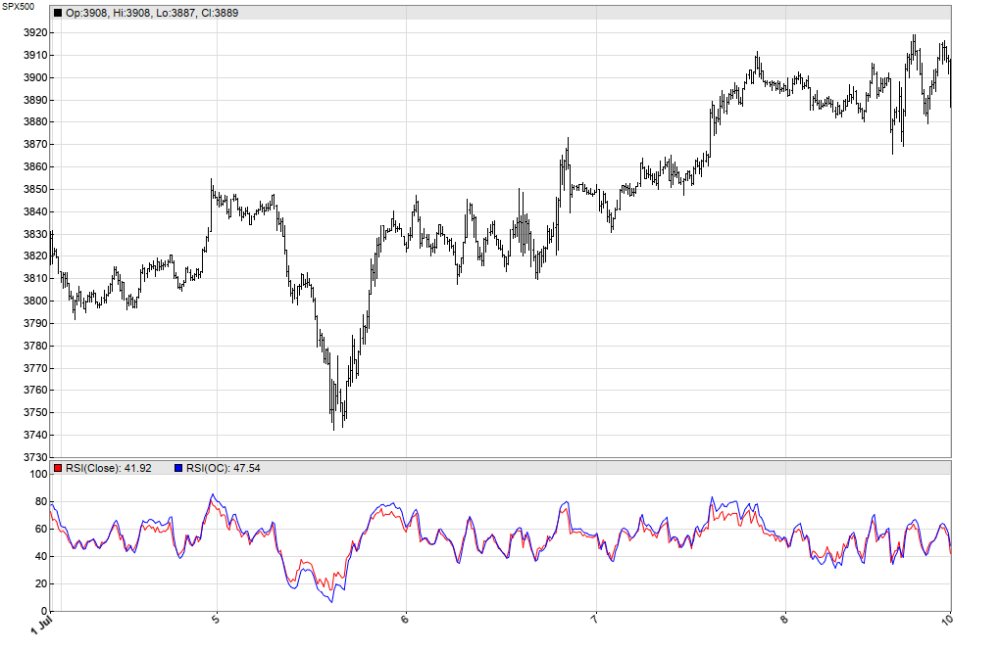

# Traders' Tips: Every Little Bit Helps

- **Article**: "Every Little Bit Helps: Averaging The Open And Close To Reduce Noise" by John F. Ehlers
- **Publication**: Technical Analysis of Stocks & Commodities, March 2023
- **URL**: <https://www.traders.com/Documentation/FEEDbk_docs/2023/03/TradersTips.html>

---

For this month's Traders' Tips, the focus is John F. Ehlers' article in this issue, "Every Little Bit Helps." Here, we present the March 2023 Traders' Tips code with possible implementations in various software.

## TradeStation

In his article in this issue, "Every Little Bit Helps," author John Ehlers proposes that noise can be reduced merely by averaging the open and close of a bar instead of only using the closing price. The data sampling example presented in the article compares the traditional RSI using close data to one calculated using the average of the open and the close.

Several built-in TradeStation indicators allow a price to be specified as an input used for calculations. For example, the built-in Mov Avg 1 Line indicator's price input can be changed from close to (close + open) / 2. In fact, the built-in RSI indicator itself has a price input that can similarly be changed.

[`tradestation-data-sampling-test.els`](code/tradestation-data-sampling-test.els)

```easylanguage
// TASC MAR 2023
// Data Sampling Test
// (C) John F. Ehlers

variables:
	CTest( 0 ),
	OCTest( 0 );

CTest = RSI(Close, 14);
OCTest = RSI((Open + Close) / 2, 14);

Plot1(CTest, "W/O Sampling");
Plot2(OCTest, "W/ Sampling");
```


*—John Robinson, TradeStation Securities, Inc., [www.TradeStation.com](https://www.tradestation.com/)*

## TradingView

Here is TradingView Pine Script code implementing the numerical example from John Ehlers' article in this issue, "Every Little Bit Helps." Taking the RSI as a test indicator, the author demonstrates the noise reduction in the data by using the average of the open and close instead of using just the closing price.

The Pine Script code provided here implements this technique, and also uses a color scheme that highlights both the RSI value and the difference between the two RSI data streams.

[`tradingview-data-sampling-test.pine`](code/tradingview-data-sampling-test.pine)

```pine
//@version=5
indicator("TASC 2023.03 Every Little Bit Helps", "ELBH",
    explicit_plot_zorder = true)

// External libraries:
import kaigouthro/hsvColor/15 as h

// Constant variables:
color NTRL = #888888

// Input panel groups, titles and inline references:
string g0  = 'RSI Options:'
string g1  = 'Color and Gradient Options:'
string it0 = 'RSI Length'
string it1 = 'Hue High'
string it2 = 'Hue Low'
string it3 = 'Background Opacity'
string it4 = 'RSI Threshold Value'
string t0  = 'Hue varies from 0 to 360, with red at 0 '+
            'and 360, green at 120, blue at 240.'
string t1  = 'Specifies the sensitivity of the gradient '+
            'to the RSI value.'

// Input options:
int len  = input.int(14, it0,1,1000,1,'','',g0)
int hue1 = input.int(150,it1,0,360, 15,t0,'',g1)
int hue2 = input.int(0 , it2,0,360, 15,'','',g1)
int op   = input.int(90, it3,0,100, 1, '','',g1)
int hbot = input.int(10, it4,5,40,  1, t1,'',g1)

// Indicators:
float rsiC  =  ta.rsi(close,  len)
float oc2   =  math.avg(open, close)
float rsiOC =  ta.rsi(oc2,    len)

// Color and gradient related calculations:
int   htop = 100 - hbot
int   span = htop - hbot
float smR  = (rsiOC/100) * span
float pt1  = smR + hbot
float pt2  = (pt1+100)/3
float br   = h.bright(chart.bg_color) < .7 ?.9:.5
float ez   = h.easeOut(math.abs((rsiOC-pt2)/span-1))
float fh   = math.max(rsiOC, rsiC, hbot)
float fl   = math.min(rsiOC, rsiC, htop)
o(col, o)  => color.new(col, o)
color c1   = h.hsv(h.stepHue(-smR, hue2, 1/ez,2),1,br, 1)
color c2   = h.hsv(h.stepHue( smR, hue1, 1/ez,2),1,br, 1)
color fade = h.hsv_gradient (rsiOC,  hbot, htop,  c1, c2)
color hc   = h.stepGradient (rsiOC, -pt1, br, fade, c1)
color lc   = h.stepGradient (rsiOC,  pt1, br, c2,  fade)

// Plots:
p0   = plot(rsiOC, 'rsi(OC)', o(fade,10), 1 )
p1   = plot(rsiC,  'rsi(C)',  na)
mid  = plot(50,    '50',   o(NTRL, 90), 2)
zero = plot(0,     '0',    o(c1, op), 1)
hund = plot(100,   '100',  o(c2, op), 1)
fill(p1, hund, rsiC, 150 , o(fade,op), o(hc,br*90))
fill(p0, zero, rsiC, -50 , o(fade,op), o(lc,br*90))
fill(p0, p1, fh,fl, o(fade, 60), o(fade,70))
```

The indicator is available on TradingView from the PineCodersTASC account: <https://www.tradingview.com/u/PineCodersTASC/#published-scripts>


*—PineCoders, for TradingView, [www.TradingView.com](https://www.tradingview.com/)*

## thinkorswim

We have put together a study based on the article by John Ehlers in this issue, "Every Little Bit Helps: Averaging The Open And Close To Reduce Noise." We built the study referenced by using our proprietary scripting language, thinkscript. To ease the loading process, simply click <https://tos.mx/Wqoyzmb> or enter the URL in *setup → open shared item* from within thinkorswim, then choose *view thinkScript study* and name it "RSI_DataSamplingComparison" or whatever name you prefer and can identify. You can then add the study to your charts from the *edit studies* menu from within the *charts* tab and then select *studies*.



*—thinkorswim, A division of TD Ameritrade, Inc., [www.thinkorswim.com](https://www.thinkorswim.com/)*

## Wealth-Lab

In "Every Little Bit Helps" in this issue, John Ehlers suggests a simple method to reduce data noise by using an average of the open and close instead of using just the closing price.

Techniques such as this come off-the-shelf in Wealth-Lab 8. With any indicator (not just the RSI) that allows customization of time series, traders can pick many flavors of the average price without having to program anything. In addition to OHLCV, here are possible choices ranging from conventional to exotic:

1. (Open+Close)/2 [This choice is demonstrated on the chart in Figure 4 as "AveragePriceOC"]
2. (H+L)/2
3. (H+L+C)/3
4. (O+H+L+C)/4
5. (H+L+C+C)/4 [an average price with double-weight closing price]



*—Gene Geren (Eugene), Wealth-Lab team, [www.wealth-lab.com](https://www.wealth-lab.com/)*

## NinjaTrader

The example RSI indicator discussed in John Ehlers' article in this issue, "Every Little Bit Helps: Averaging The Open And Close To Reduce Noise," is available for download from the following links for NinjaTrader 8 and for NinjaTrader 7:

- **NinjaTrader 8**: [www.ninjatrader.com/SC/March2023SCNT8.zip](https://www.ninjatrader.com/SC/March2023SCNT8.zip)
- **NinjaTrader 7**: [www.ninjatrader.com/SC/March2023SCNT7.zip](https://www.ninjatrader.com/SC/March2023SCNT7.zip)

Once the file is downloaded, you can import the indicator into NinjaTrader 8 from within the control center by selecting Tools → Import → NinjaScript Add-On and then selecting the downloaded file.

Source code files: [`NoiseReductionRSI.cs`](ninja-trader/NoiseReductionRSI.cs), [`@RSI.cs`](ninja-trader/@RSI.cs), [`@SMA.cs`](ninja-trader/@SMA.cs)



*—Chelsea Bell, NinjaTrader, LLC, [www.ninjatrader.com](https://www.ninjatrader.com/)*

## NeuroShell Trader

In "Every Little Bit Helps" in this issue, John Ehlers proposes averaging the open and close as inputs to some indicators to help reduce noise, instead of using only the close. This technique can be easily implemented in NeuroShell Trader. To implement a comparison between the RSI and the open-close-averaged RSI, select "new indicator" from the *insert* menu, and use the indicator wizard to create the indicators as follows:

```text
RSI( Close, 14)
RSI( Avg2(Open,Close), 14)
```



*—Ward Systems Group, Inc., [sales@wardsystems.com](mailto:sales@wardsystems.com), [www.neuroshell.com](https://www.neuroshell.com/)*

## AIQ

The importable AIQ EDS file based on John Ehlers' article in this issue, "Every Little Bit Helps," can be obtained on request via [rdencpa@gmail.com](mailto:rdencpa@gmail.com). The code is also available below.

[`aiq-data-sampling-test.eds`](code/aiq-data-sampling-test.eds)

```aiq
!Every Little Bit Helps
!Author: John F. Ehlers, TASC Mar 2023
!Coded by: Richard Denning, 1/12/2023

!Data Sampling Test
!(c) John Ehlers 2022

!INPUTS:
W1 is 14. !Wilder RSI length
W2 is 14. !Ehlers RSI length

!RSI Wilder code:
U is [close]-val([close],1).
D is val([close],1)-[close].
L1 is 2 * W1 - 1.
AvgU is ExpAvg(iff(U>0,U,0),L1).
AvgD is ExpAvg(iff(D>=0,D,0),L1).
RSIwilder is 100-(100/(1+(AvgU/AvgD))).

!Ehlers RSI code:
OCavg is ([open] + [close])/2.
Uoc is  OCavg-valresult(OCavg,1).
Doc is valresult(OCavg,1)-OCavg.
L2 is 2 * W2 - 1.
AvgU2 is ExpAvg(iff(Uoc>0,Uoc,0),L2).
AvgD2 is ExpAvg(iff(Doc>=0,Doc,0),L2).
RSIoc is 100-(100/(1+(AvgU2/AvgD2))).

!CTest is RSIwilder.
!OCTest is RSIoc.

BuyRSIwilder if RSIwilder < 20 and valrule(RSIwilder >= 20,1).
ExitRSIwilder if RSIwilder > 80 or {Position days}>=20.

BuyRSIoc if RSIoc < 20 and valrule(RSIoc >= 20,1).
ExitRSIoc if RSIoc > 80 or {Position days}>=20.
```

The system rules are:
- Buy when the RSI crosses down below 20
- Sell when the RSI crosses above 80 or after 20 trading days





*—Richard Denning, [rdencpa@gmail.com](mailto:rdencpa@gmail.com), for AIQ Systems*

## Trade Navigator

In "Every Little Bit Helps: Averaging the Open and Close to Reduce Noise" in this issue, John Ehlers suggests using an average of the open and close data instead of just close data in your indicators to slightly reduce noise in the data.

We have created a special file to make it easy to download a library into Trade Navigator that is based on this article. The file name is "SC202303."

To install this new library into Trade Navigator, click on Trade Navigator's file dropdown menu, then select "update data." Next, select *download special file*, then erase the word "upgrade" and type in "SC202303" (without the quotes), then click the *start* button. When prompted to upgrade, click *yes*. If prompted to close all software, click *continue*. Your library will now download.

This library contains a template named "S&C March 2023," a study named "data sampling," and two indicators named "CTest" and "OCTest."

*—Genesis Financial Data, Tech support 719 884-0245, [www.TradeNavigator.com](https://www.tradenavigator.com/)*

## The Zorro Project

In his article in this issue, John Ehlers proposes to use the average of the open and close, rather than the close price, for technical indicators. The advantage could be a certain amount of noise reduction.

On intraday bars, the open-close average is similar to a two-day simple moving average (SMA2). It makes the data a bit smoother, but at the cost of additional lag by half a bar.

The script given here, in C for the Zorro platform, compares the standard RSI with the open-close average RSI on the S&P 500 index with 15-minute bars.

[`zorro-data-sampling-test.c`](code/zorro-data-sampling-test.c)

```c
void run()
{
  BarPeriod = 15;
  StartDate = 20220629;
  EndDate = 20220712;
  asset("SPX500");

  vars OC = series((priceO()+priceC())/2);
  plot("RSI(Close)",RSI(seriesC(),14),NEW,RED);
  plot("RSI(OC)",RSI(OC,14),0,BLUE);
}
```

We can indeed see some noise reduction in the resulting chart, shown in Figure 9.



If the user would like to investigate whether the smoother curve compensates for the half bar of additional lag, the user can add the following five lines to the script:

```c
vars RSIs = series(RSI(OC,14));
if(crossUnder(RSIs,70))
  enterShort();
if(crossOver(RSIs,30))
  enterLong();
```

This code implements a simple RSI trading system, which enters a short position when the RSI crosses below 70, and enters a long position when it crosses above 30; a position is closed when an opposite position is opened.

The script can be downloaded from the 2023 script repository on <https://financial-hacker.com>. The Zorro platform can be downloaded from <https://zorro-project.com>.

*—Petra Volkova, The Zorro Project by oP group Germany, [zorro-project.com](https://zorro-project.com/)*

---

```bibtex
@misc{traderstips202303,
  title        = {Traders' Tips: Every Little Bit Helps},
  author       = {{Technical Analysis of STOCKS \& COMMODITIES}},
  journal      = {Technical Analysis of Stocks \& Commodities},
  volume       = {41},
  number       = {3},
  year         = {2023},
  month        = mar,
  url          = {https://www.traders.com/Documentation/FEEDbk_docs/2023/03/TradersTips.html},
  howpublished = {online},
  note         = {Implementations for: TradeStation, TradingView, thinkorswim, Wealth-Lab, NinjaTrader, NeuroShell Trader, AIQ, Trade Navigator, Zorro}
}
```
